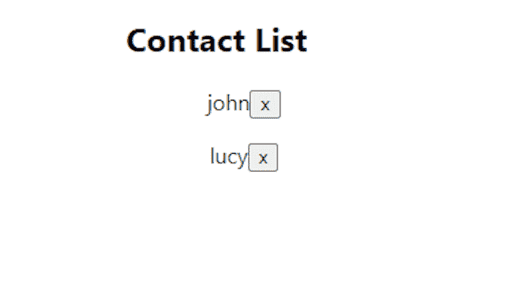
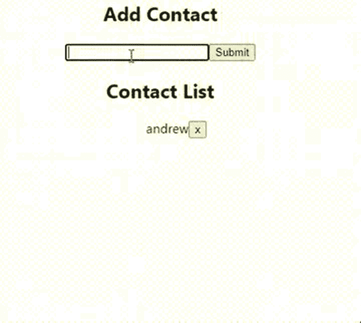

# React - LogRocket 博客的 Python 开发者指南

> 原文：<https://blog.logrocket.com/python-developers-guide-react/>

尽管创建用户界面最流行的 JavaScript 库是 React，但是作为 Python 开发人员，学习如何使用这个库可能是一个漫长而艰难的过程。

虽然您可以观看和阅读所有可能理解该库的 React 教程，但如果您不知道合适的路径或分步方法，这可能会令人望而生畏。

这是因为 React 使用了与 Python 非常不同的语法和数据结构，这使得 Python 开发人员很难适应。

在本文中，我们将描绘出 React 入门的路线图，以及作为一名 Python 开发人员投入 React 的核心先决条件。我们还将使用 Flask(一个 Python web 框架)创建一个联系人管理器应用程序，并以 React 为例。

在开始之前，您应该了解 HTML、CSS、JavaScript 和 Python。

## 反应介绍

脸书创建并维护了 React JavaScript 库，用于设计用户界面。近年来，它越来越受欢迎，因为它能够将反应式和声明式编程的力量带入前端开发领域。

React 还使得考虑用户界面代码变得更加容易，它的编程范式鼓励模块化和可重用的代码。

理解 React 只不过是 JavaScript 是至关重要的。

React 不是一门独立的编程语言，也不是一个需要多年才能理解的特定领域框架。它有一个简单的 API，在使用它创建 web 应用程序之前，只需要掌握一些函数和概念。

让我们学习一些 React 概念，这些概念在您使用 React 构建 web 应用程序的过程中非常重要。

### 反应组分

组件是自包含的可重用代码块。它们完成的事情和 JavaScript 函数一样，只是它们独立工作并返回 HTML。

它们可能与 Python 的面向对象编程(OOP)有关，因为 Python 和 JavaScript 都展示了数据模型的继承。

然而，在 OOP 中，数据是不受限制的，因为任何对象都可以在 Python 类之外创建，这与 React 组件不同，React 组件中的数据仅限于一组其他组件。此外，React 组件可以保存自己状态的数据，这与 Python 类不同。

在 React 中，组件可以将 web 应用程序分解成具有不同功能的独立部分。例如，您可以为 web 应用程序的标题创建一个组件，为导航菜单创建另一个组件，并在应用程序的其他页面上重用它。

#### 组件架构

在 Python 中，对于如何使用类没有特殊的层次结构。但是，React 组件在特定的层次结构中工作。

我们知道我们可以在其他组件中调用和呈现组件。该组件称为子组件，而调用子组件的组件称为父组件。这叫亲子关系。

在本文的后面，您将了解到了解这种架构对于组件之间的数据传输有多么重要。

* * *

### 更多来自 LogRocket 的精彩文章:

* * *

#### 类别组件

类组件是从`React.Component class`继承特性的组件。

下面是一个类组件的示例:

```
class Header extends React.Component {
  render() {
    return <h2>Hello, I am a header!</h2>;
  }
}
```

在上面的类组件中，我们包括了`extends React.Component`。该语句向组件添加了一个`React.Component`继承，使其可以访问`React.Component`功能。

该组件还需要返回 HTML 的`render()`函数来呈现其中的数据。

Python 中类组件的等效形式如下:

```
class MyComponent(Component):
    def __init__(self):
        super().__init__()

    def render(self):
        return "Hello, I am a heder" ;
```

#### 功能组件

[功能组件，像类组件一样，返回 HTML](https://blog.logrocket.com/react-pure-components-functional/) 并类似地操作，但是功能组件可以用少得多的代码来构造，由于它们的简单语法而更容易掌握，并且在本教程中受到青睐:

```
function Header() {
  return <h2>Hello, I am a header!</h2>;
}
```

下面是 Python 的等效代码:

```
def Header() {
  return "Hello, I am a header!";
}
```

#### JSX

虽然`<h1>`和`<div>`标签看起来和 HTML 标签一样，但它们不是。 [JSX 是包含这些标签的 JavaScript](https://blog.logrocket.com/diving-into-the-new-jsx-transform/) 的语法扩展，由 React 团队设计，用于在 JavaScript 组件中实现类似 HTML 的内嵌标记。

这些类似于 Python [Jinja](https://pypi.org/project/Jinja2/) 模板引擎。

JSX 和 HTML 标签之间有几个关键的区别。第一个简单来说就是 **`class`** 关键词现在是`className`。

其次，在 HTML 中，我们使用如下字符串来定义内联样式:

```
<h1 style="color: hotpink; font-size: 12px">Hello<h1>
```

然而，在 JSX，我们使用骆驼包装的物品:

```
<h1 style="color": "hotpink", "fontSize": "12px"> Hello </h1>
```

最后，变量可以添加到我们的 JSX 标记中，通过将变量包装在:

```
render() {
    var myText = 'Hello!';
    return (
          <h1>{myText}</h1>
    );
}
```

除了像`<h1>`和`<div>`这样的 HTML 元素之外，还可以引用其他 React 类。例如，在我们的`src/demo/App.js`中，我们通过将`ExampleComponent`组件访问为`<ExampleComponent>`来呈现它。

#### 样式组件

有三种方式[对 React 组件](https://blog.logrocket.com/styling-in-react-4-ways-style-react-app/)进行样式化:使用普通 CSS、使用 JavaScript 样式对象的内联样式，或者创建样式化组件。

##### 使用普通 CSS 样式

第一种样式化 React 组件的方法是使用普通 CSS，您必须创建一个常规 CSS 文件并将其导入 React 组件。导入后，必须为样式添加相应的 HTML 或 JSX 元素的类名。

以下是 CSS 标题样式的示例:

```
.header {
  padding: 60px;
  text-align: center;
  background: #1abc9c;
  color: white;
  font-size: 30px;
}
```

然后我们有头组件:

```
import React from 'react';
import PropTypes from 'prop-types';
import './Header.css';
...
export default function Alert() {
  return(
    <div className="header">
      <h2>React Header</h2>
    </div>
  )
}
```

##### 使用 JavaScript 样式的对象

在第二种方法中，您必须删除导入的 CSS 文件并创建一个填充为`20`的对象，然后使用 style 属性将该对象传递给 div:

```
import React from 'react';

function Header() {
  const wrapper = {
    padding: 20
  };

  return(
    <div style={wrapper}>
      <h1
    Header.
      </h1>
    </div>
  )
}

export default Header;
```

值得注意的是，不需要提供像素作为填充单位。默认情况下，React 将其转换为一个像素字符串。如果想要某个单位，就写成字符串。因此，举例来说，如果您希望填充是一个百分比，它将是`padding: `20%``。

#### 使用样式组件

样式化组件的第三种方式是[，通过创建样式化组件](https://blog.logrocket.com/benefits-using-styled-components-react/)。在此方法中，您必须创建样式化的对象，附加它们，并包装您的 JSX 元素。

Styled-components 是 React 和 React Native 的开发包。它允许你在你的应用中使用组件级的风格，它们使用一种叫做 CSS-in-JS 的技术将 JavaScript 和 CSS 集成在一起。

样式化组件建立在带标签的模板文字上，这意味着在样式化组件时，实际的 CSS 代码是在反斜线之间编写的。因此，开发人员可以从一个项目到下一个项目重用他们的 CSS 代码。

当使用样式化组件时，不需要将构建的组件映射到外部 CSS 样式。

您可以使用下面的 npm 命令安装样式化组件:

```
npm i [email protected]
```

下面是如何在 React 代码中使用它们的示例:

```
import React from 'react';
import styled from 'styled-components';

// Button component that'll render an <a> tag with some styles
const Button = styled.a`
  background-colour: teal;
  color: white;
  padding: 1rem 2rem;
`
const App = () => {
  return (
    <Button>I am a button</Button>
  )
}
export default App;
```

您将看到，在构造 React 功能组件时，您可以用变量类型及其名称来指定组件的名称，如 **`const Button`** 。

我们导入了上面的`styled`，它为我们提供了样式化组件的能力。另外，`styled`后面的`a`表示锚 HTML 元素，`<a>`。在声明样式化组件时，可以使用任何 HTML 元素，比如`<div>`、`<h1>`或`<p>`。

### 州

状态对象被集成到 React 组件中。[状态对象](https://blog.logrocket.com/modern-guide-react-state-patterns/)是保存组件属性值的地方，当状态对象改变时，组件重新呈现:

```
import React, {useState} from "react";

const MyComponent = () => {
    const [value, setValue] = useState(1);
    return (
        <div>
            <p>{value}</p>
            <button onClick={() => setValue((value + 1))}>Increment Value</button>
        </div>
    );
};
```

在上面的代码示例中，我们创建了一个状态`value`，它带有一个值`1,`和`setValue`，后者设置并更新状态`value`。

为了做到这一点，我们使用了`useState`钩子和`setValue`来更新`value`，在每次点击按钮时添加`1`。然后，这个状态将在 React DOM 中更新，这意味着页面不需要重新加载来呈现更改。

### 钩住

[钩子是允许你“挂钩”到 React 特性](https://blog.logrocket.com/react-hooks-the-good-the-bad-and-the-ugly/)的函数，比如状态和生命周期函数。它们类似于 Python 中的 decorators，允许您挂接一个类或函数并控制其行为。

要使用钩子，必须从 React 库中导入它们。它们不能与类组件一起使用，只能在声明了函数属性的组件的顶层使用，如下面的代码所示:

```
import React, { useState } from "react";

function FavoriteColor() {
  const [color, setColor] = useState("red");

  return (
    <>
      <h1>My favorite color is {color}!</h1>
    </>
  );
}
```

如上面的代码所示，`useState`钩子用在函数组件的顶部，也就是在 return 语句之前。

钩子使管理状态变得更容易，因为它们是内置的，可以为您执行简单的状态管理逻辑，从而避免您浪费时间去重新发明轮子。

一些钩子的例子是`useState`和`useEffect`。

### 小道具

React 属性类似于 JavaScript 函数参数和 HTML 属性。它们使用与 HTML 属性相同的语法将属性传递到组件中:

```
<Header title="My react header" />;
```

[Props 是您在组件](https://blog.logrocket.com/the-beginners-guide-to-mastering-react-props-3f6f01fd7099/)之间传递数据的方式，可以从父组件传递到子组件:

```
function House(props) {
  return <h2>I am a { props.type }!</h2>;
}

function Room() {
  return (
    <>
      <h1>Do you know my room number?</h1>
      <House type="duplex" />
    </>
  );
}
```

这里的父组件是`Room`，而`House`是子组件。这是因为在`Room`组件中调用了`House`组件，这意味着在它们之间传递了一个道具`type`。

#### 传递状态作为道具

您还可以将状态作为道具在父组件和子组件之间传递:

<

```
function House(props) {
  return <h2>I am a { props.type }!</h2>;
}

function Room() {
  const [type, setType] = useState("Duplex");

  return (
    <>
      <h1>Do you know my room number?</h1>
      <House type={type} setType={setType} />
    </>
  );
}
```

在上面的代码示例中，我们声明了携带值`"Duplex"`的状态`type`，以及更新状态的`setType`。

然后我们可以将这些状态作为道具传递给`House`组件。我们还向`House`组件添加了 props 参数，该组件收集已经传递的状态。最后，我们使用`props.type`呈现状态中的数据。

### Redux

在 React 中工作时，您将需要处理复杂应用程序中跨组件的状态。Redux 解决了这个问题，这是一个帮助维护应用程序状态的 JavaScript 包。Redux 将你所有的状态存储在一个单一的源中，并且[你可以在这个教程](https://blog.logrocket.com/why-use-redux-reasons-with-clear-examples-d21bffd5835/)中了解更多。

### 网络包

Webpack 是一个 Javascript 模块捆绑器，允许您将依赖项作为静态文件保存在项目中，这样您就不必。Webpack 中还包含加载器来帮助执行项目中的某些活动。

### 服务器渲染

学习服务器呈现将使您能够在服务器上开发组件，并在浏览器中将它们呈现为 HTML 格式；下载完所有的 JavaScript 模块后，React 将进入下一阶段。

这是 React 最好的特性之一，它可以与任何后端技术一起使用。你可以在这篇文章中了解服务器渲染。

## 构建烧瓶和 React 应用程序

现在让我们[构建 Flask 应用程序](https://blog.logrocket.com/build-deploy-flask-app-using-docker/)来管理数据库和数据请求，这将是我们的 React 应用程序的后端。本节将演示如何构建一个与 React 协同工作的 Python API，然后构建一个从您的 IT 发出请求的 React 应用程序。

### 烧瓶安装

要安装 Flask，请运行以下命令:

```
pip install flask
```

接下来，运行以下命令创建 Flask 项目:

```
# create project directory
mkdir flaskapp

cd flaskapp
```

我们现在可以创建一个`app.py`来添加下面的 Python 代码:

```
from flask import Flask

app = Flask(__name__)

@app.route('/ping')
def ping():
    return ("hello world")

if __name__ == '__main__':
    app.run()
```

### 设置烧瓶应用程序

Flask 应用程序将要求您使用以下命令安装`flask_sqlalchemy`和`flask_cors`:

```
pip install flask_sqlalchemy 
pip install flask_cors
```

安装完所需的模块后，导入并设置它们。为此，将下面的代码复制到您的`app.py`文件中:

```
import os
from flask import *
from flask_cors import CORS
from flask_sqlalchemy import SQLAlchemy

file_path = os.path.abspath(os.getcwd())+"\database.db"

app = Flask(__name__)

app.config['SQLALCHEMY_DATABASE_URI'] = 'sqlite:///'+file_path
app.config['SQLALCHEMY_TRACK_MODIFICATIONS'] = False
db = SQLAlchemy()
db.init_app(app)

@app.after_request
def after_request(response):
  response.headers.add('Access-Control-Allow-Headers', 'Content-Type,Authorization')
  response.headers.add('Access-Control-Allow-Methods', 'GET,PUT,POST,DELETE,OPTIONS')
  response.headers.add('Access-Control-Allow-Credentials', 'true')
  return response
```

接下来，为联系人管理器设置数据库:

```
class ContactModel(db.Model):
    __tablename__ = "table"

    id = db.Column(db.Integer, primary_key=True)
    name = db.Column(db.String(), unique=True)

    def __init__(self, name):
        self.name = name

    def __repr__(self):
        return f"{self.name}"

@app.before_first_request
def create_table():
    db.create_all()
```

`ContactManager`模型创建数据库表，`@app.before_first_request`装饰器运行构建表命令，该命令在您第一次使用 Flask 应用程序时触发。

#### 构建端点

在下面的代码中，我们可以创建、检索和更改联系人管理器应用程序的端点:

```
@app.route('/data/create' , methods = ['GET','POST'])
def create():
    if request.method == 'GET':
        return jsonify({"success": True, "message": "this is the create endpoint"}), 201

    if request.method == 'POST':
        request_data = json.loads(request.data)
        name = request_data['name']
        contact = ContactModel(name=name)
        db.session.add(contact)
        db.session.commit()
        return jsonify({"success": True, "message": "contact added successfully"}), 201

def contact_serializer(contact):
    return {'name': contact.name}

@app.route('/data')
def retrieveDataList():
    return jsonify([*map(contact_serializer, ContactModel.query.all())])

@app.route('/data/delete', methods=['GET','POST'])
def delete():
    request_data = json.loads(request.data)
    name = request_data['name']
    contact = ContactModel.query.filter_by(name=name).first()
    if request.method == 'POST':
        if contact:
            db.session.delete(contact)
            db.session.commit()
            return jsonify({"success": True, "message": "Contact deleted successfully"}), 201
        abort(404)

    return jsonify({"success": True}), 201
```

`create`端点在`POST`请求下收集数据以在数据库中创建联系人，而`retrieve`端点获取存储在数据库中的所有数据。

最后，`delete`端点在`POST`请求下接收数据。在继续删除之前，请确保检查数据库中是否存在该数据。在构建 React 应用程序时，这三个端点将非常有用。

### 构建 React 应用程序

要开始构建 React 应用程序，我们必须首先安装 React:

```
npm install react react-dom --save
```

要创建 React 项目，请输入以下命令:

```
npx create-react-app contactmanager
```

#### 设置 React 应用程序

在您刚刚创建的 React 应用程序中，找到`package.json`文件并向其中添加 API URL([http://127 . 0 . 0 . 1:5000/](http://127.0.0.1:5000/))，如下面的代码示例所示:

```
"name": "contactmanager",
  "version": "0.1.0",
  "private": true,
  "proxy":"http://127.0.0.1:5000/",
  "dependencies": {
    "@testing-library/jest-dom": "^5.16.1"
....
```

接下来，创建两个名为`Components`和`Pages`的文件夹。`Components`文件夹将携带所有的应用程序组件，而`Pages`文件夹将携带页面组件。

#### `App.js`文件

接下来，让我们导入并呈现携带该应用程序所有其他组件的`ContactPage`组件。将代码复制并粘贴到您的`App.js`文件中:

```
import logo from './logo.svg';
import './App.css';
import {ContactPage} from './Pages/ContactPage';

function App() {
  return (
    <div className="App">
      <ContactPage />
    </div>
  );
}

export default App;
```

#### 构建组件

在本节中，我们将构建构成联系人管理器应用程序的组件。

#### `ContactPage`组件

在`Pages`文件夹中创建一个名为`ContactPage.js`的新文件，并将下面的代码复制并粘贴到其中:

```
import React, {useState, useEffect} from 'react';
import {Card} from '../Components/Card';
import {Form} from '../Components/Form';

export const ContactPage = () => {
    const [contact, setContact] = useState([])
    const [addContact, setAddContact] = useState('')

    useEffect(()=> {
        fetch('/data').then(response => {
            if (response.ok){
                return response.json()
            }
        }).then(data => setContact(data))
    }, [])

    const handleFormChange = (inputValue) => {
        setAddContact(inputValue)
    }

    const handleFormSubmit = () => {
        fetch('/data/create', {
            method: 'POST',
            body: JSON.stringify({
                name:addContact
            }),
            headers: {
                "Content-type": "application/json; charset=UTF-8"
            }
        }).then(response => response.json()).then(message => 
            {console.log(message);
            getLatestContacts();
            setAddContact('')
            })

    }

    const deleteContact = (name) => {
        fetch('/data/delete', {
            method: 'POST',
            body: JSON.stringify({
                name:name
            }),
            headers: {
                "Content-type": "application/json; charset=UTF-8"
            }
        }).then(response => response.json()).then(message => {
            console.log(message);
            getLatestContacts()
            })

    }

    const getLatestContacts = () => {
        fetch('/data').then(response => {
            if(response.ok){
                return response.json()
            }
        }).then(data => setContact(data))
    }

    return (
        <>
        <Form userInput={addContact} onFormChange = {handleFormChange} onFormSubmit={handleFormSubmit}/>
        <Card listOfContacts={contact} onDelete={deleteContact}/>
        </>
    )
}
```

在上面的代码中，我们创建了`ContactPage`组件，并在其中呈现了`Card`和`Form`组件。

然后，通过创建一个`contact`状态及其设置者`setContact`，它将携带联系人的数据。`addContact`状态和它的设置器`setAddContact`也携带要添加到数据库中的数据的输入。

接下来，`useEffect`钩子和`fetch`方法从 Flask 应用程序中的`/data`端点检索数据，将检索到的数据设置为当前的`contact`状态。这确保了检索到的数据与应用程序上显示的数据相同。

当创建一个`handleFormChange`函数时，它将`addContact`的状态设置为输入字段中的当前数据。然后我们可以将`handleFormChange`作为道具传递给`Form`组件。

接下来，`handleFormSubmit`函数向 Flask 中的`create`端点发送数据，以向数据库添加新数据，并通过将`setAddContact`状态设置为空字符串来清除输入字段，同时在使用`getLatestContacts`函数创建新联系人后获取最新数据。

该函数还在使用`fetch`方法检索数据后将`contact`状态设置为最新数据。然后我们可以将`handleFormSubmit`作为道具传递给`Form`组件。

最后，`deleteContact`函数通过使用`fetch`方法向`data/**delete**`端点发出请求，从 Flask 数据库中删除联系人，然后由`getLatestContacts`函数在删除操作后获取新数据。

然后我们可以将`deleteContact`函数和`contact`状态传递给`Card`组件。

#### `Card`组件

`Card`组件呈现从 Flask 应用程序数据库中检索到的所有数据。要使用`Card`组件，在 components 文件夹中创建一个名为`Card.js`的新文件，并将下面的代码复制并粘贴到其中:

```
import React from 'react';

export const Card = ({ listOfContacts, onDelete }) => {

    const handleDelete = (name) => {
        onDelete(name);
    }

    return(
        <>
        <h2>Contact List</h2>
        {listOfContacts.map(contact => {
            return(
                <ul key={contact.name}>
                    <li>
                        {contact.name}  
                     <button onClick={() => handleDelete(contact.name)}> x </button>
                    </li>
                </ul>
            )
        })}
        </>
    ) 
}
```

通过使用映射函数来映射从`ContactPage`传递来的`listOfContact`属性中的数据，呈现列表中的每个联系人，我们可以添加一个删除按钮来触发`handleDelete`函数，并传递要删除的特定联系人的名称。

然后，`handleDelete`函数收集传递的名称，并调用从`ContactPage`组件传递的`onDelete`属性，执行与`deleteContact`相同的功能。

因此，我们的联系人列表目前如下所示:



#### `Form`组件

[表单组件呈现用于向我们的应用程序提交数据的表单](https://blog.logrocket.com/guide-react-forms-events-formik/)。为此，在`Components`文件夹中创建一个名为`Form.js`的新文件，复制并粘贴以下代码:

```
import React from 'react';

export const Form = ({ userInput, onFormChange, onFormSubmit }) => {

    const handleChange = (event) => {
        onFormChange(event.target.value);
    }

    const handleSubmit = (event) => {
        event.preventDefault()
        onFormSubmit()
    }

    return(
        <>
        <h2>Add Contact</h2>
        <form onSubmit={handleSubmit}>
            <input type="text" required value={userInput} onChange={handleChange}></input>
            <input type="submit" ></input>
        </form>
        </>
    )
}
```

这里，`handleSubmit`函数被附加到表单上，而`handleChange`函数被附加到 name 输入元素上。

当我们在 HTML 文本输入字段中输入数据时，`handleChange`函数触发，而当表单被提交时，`handleSubmit`函数触发。这是通过调用从`handleChange`和`handleSubmit`中的`ContactPage`传递的 prop 函数来完成的。

在`handleChange`中，我们调用了`onFormChange.`道具，它执行`ContactPage`组件中的`handleFormChange`功能，而在`handleSubmit`中，我们调用了`onFormChange.`道具来执行`handleFormSubmit`功能。

这是最终的添加联系人表单:


## 结论

最后，我们有一个工作联系人列表，可以有效地添加和删除联系人:



Python 和 React 都是创建 web 应用程序的绝佳选择。在使用它们时，您会注意到一些特性是相同的，比如 Python 的 decorators 和 React Hooks。

在代码语法和数据模型/传输原则方面只存在一些变化，例如如何定义函数，以及 React 组件中的数据如何与 Python 类中的数据进行不同的管理。

作为 Python 开发人员，在构建 web 应用程序的服务器端时，学习 React 非常重要。感谢您的阅读，祝您编码愉快！！

## [LogRocket](https://lp.logrocket.com/blg/react-signup-general) :全面了解您的生产 React 应用

调试 React 应用程序可能很困难，尤其是当用户遇到难以重现的问题时。如果您对监视和跟踪 Redux 状态、自动显示 JavaScript 错误以及跟踪缓慢的网络请求和组件加载时间感兴趣，

[try LogRocket](https://lp.logrocket.com/blg/react-signup-general)

.

[ ](https://lp.logrocket.com/blg/react-signup-general) [](https://lp.logrocket.com/blg/react-signup-general) 

LogRocket 结合了会话回放、产品分析和错误跟踪，使软件团队能够创建理想的 web 和移动产品体验。这对你来说意味着什么？

LogRocket 不是猜测错误发生的原因，也不是要求用户提供截图和日志转储，而是让您回放问题，就像它们发生在您自己的浏览器中一样，以快速了解哪里出错了。

不再有嘈杂的警报。智能错误跟踪允许您对问题进行分类，然后从中学习。获得有影响的用户问题的通知，而不是误报。警报越少，有用的信号越多。

LogRocket Redux 中间件包为您的用户会话增加了一层额外的可见性。LogRocket 记录 Redux 存储中的所有操作和状态。

现代化您调试 React 应用的方式— [开始免费监控](https://lp.logrocket.com/blg/react-signup-general)。