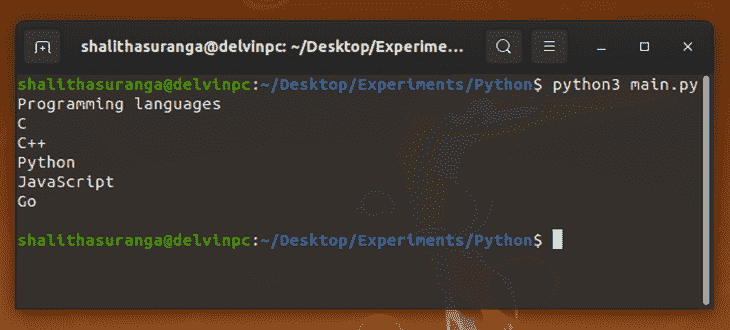
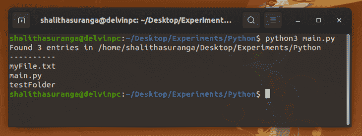
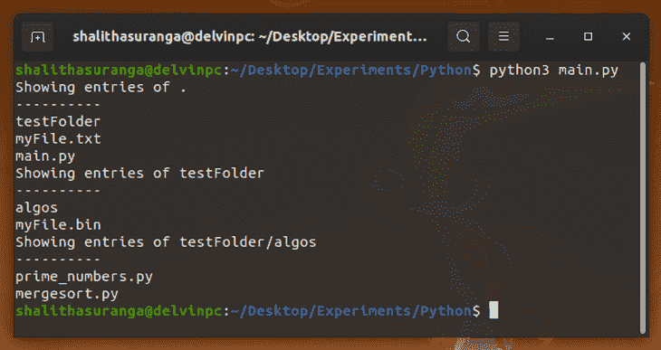
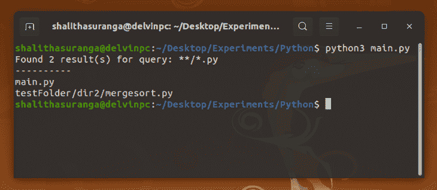
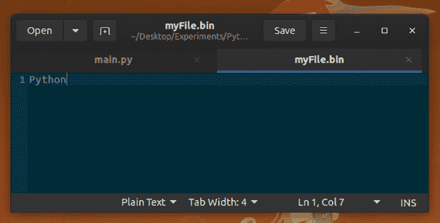

# Python 文件处理:完整指南

> 原文：<https://blog.logrocket.com/python-file-handling-guide/>

Python 是一种流行的解释型和动态类型编程语言，用于构建 web 服务、桌面应用程序、自动化脚本和机器学习项目。程序员在处理基于 Python 的软件项目时，经常需要访问操作系统的文件系统。

例如，我们使用文本文件作为输入，编写文本文件作为输出，并经常处理二进制文件。像任何其他流行的通用编程语言一样，Python 也提供了跨平台的文件处理特性。Python 通过几个内置函数和标准模块提供了文件处理特性。

在本文中，我将解释您需要了解的关于 Python 文件处理的一切，包括:

## 先决条件

在开始学习本教程之前，请确保您已经安装了 Python 3 解释器。否则，安装来自[官方版本](https://www.python.org/downloads/)的最新 Python 解释器。您也可以在现有的 Python 项目中使用本教程的代码片段。

## 用 Python 读取文件

作为第一项活动，让我们编写一些代码来读取一个文本文件。我们需要首先创建一个文件对象来读取文件。

Python 提供了内置的`open`函数来创建具有多种模式的文件对象，例如读模式、写模式等。创建一个名为`myFile.txt`的文本文件，输入以下内容。

```
Programming languages
C
C++
Python
JavaScript
Go

```

现在，创建一个名为`main.py`的新文件，并添加以下代码片段。

```
myFile = open("myFile.txt", "r") # or open("myFile.txt")
print(myFile.read())
myFile.close()

```

上面代码片段的第一行用给定的文件名创建了`myFile` file 对象。内置的`open`函数使用读取模式创建一个文件处理程序，因为我们已经通过第二个参数提供了`r`标志。

确保在使用文件后调用`close`方法来释放资源。`read`方法返回文件内容，所以一旦执行上面的代码，您就会看到内容，如下所示。



`read`方法一次读取整个文件。如果您不想一次读取所有内容，您可以用`read`方法的参数指定一个字节大小。例如，下面的代码片段只读取前 11 个字节。

```
myFile = open("myFile.txt", "r")
print(myFile.read(11)) # Programming
myFile.close()

```

您将看到第一个单词(“编程”)作为输出——因为第一个单词有 11 个字母，在 [ASCII 编码](https://en.wikipedia.org/wiki/ASCII)中，一个字母的大小等于一个字节。如果您再次打印`read(11)`的结果，您将会看到接下来的 11 个字节(" languages\n ")，因为文件光标在之前的`read(11)`方法调用中移动了 11 个位置。您可以使用`seek`方法将文件光标重置回起点，如下例所示。

```
myFile = open("myFile.txt")

print(myFile.read(11)) # Programming
print(myFile.read(10)) # languages
myFile.seek(0) # Sets file cursor to the beginning
print(myFile.read(11)) # Programming
myFile.close() 

```

在大多数情况下，逐行处理文件内容很容易。您不需要自己实现面向行的文件读取机制——Python 提供了逐行读取文件的内置特性。您可以使用`for-in`循环和`readlines`方法逐行读取文件，如下所示。

```
myFile = open("myFile.txt", "r")
for line in myFile.readlines():
    print(line)
myFile.close()

```

用一个`for-enumerate`循环可以获得当前行号，因为`readlines`方法将使用[列表类型](https://blog.logrocket.com/working-lists-python/)返回行。下面的代码片段将打印行内容及其各自的行号。

```
myFile = open("myFile.txt", "r")
for i, line in enumerate(myFile.readlines()):
    print(i, line) # line number and content
myFile.close()

```

## 用 Python 写文件

前面，我们通过使用`r`标志创建了具有读取模式的文件对象。使用读取模式无法写入文件，因此我们必须使用写入模式(`w`)来写入文件。

也可以使用`r+`或`w+`标志同时启用读取和写入模式；我们将在接下来的例子中使用`w+`旗帜。

为了开始文件写入，让我们通过编写一些 Python 代码将下面的文本输入到当前的`myFile.txt`中。

```
Programming languages
Rust
Ruby
TypeScript
Dart
Assembly

```

使用下面的脚本用上面的内容更新`myFile.txt`。

```
myFile = open("myFile.txt", "w")

content = """Programming languages
Rust
Ruby
TypeScript
Dart
Assembly"""

myFile.write(content)
myFile.close()

```

这里，我们使用 Python 多行字符串语法定义了文本文件内容，并使用`write`方法将内容写入文件。确保使用带`w`标志的写模式，否则写操作将失败，并出现`io.UnsupportedOperation`异常。

有时，我们经常需要在现有文件中添加新的内容。在这些场景中，由于资源消耗较高，读写整个内容并不是一个好方法。相反，我们可以使用追加模式(`a`)。

看看下面的代码。它将在`myFile.txt`的列表中添加一种新的编程语言。

```
myFile = open("myFile.txt", "a")
myFile.write("\nBash")
myFile.close()

```

上面的代码片段向现有文件添加了一个新行字符(`\n`)和一个新单词，而没有写入整个文件内容。因此，我们将在编程语言列表中看到一个新条目。尝试添加更多条目，看看会发生什么！

* * *

### 更多来自 LogRocket 的精彩文章:

* * *

## 在 Python 中读取文件属性

除了原始文件内容，磁盘上的文件将包含一些元数据或文件属性，包括大小、上次修改时间、上次访问时间等。

查看下面的文件代码，它显示了文件大小、上次访问时间和上次修改时间。

```
import os, time

stat = os.stat("myFile.txt")
print("Size: %s bytes" % stat.st_size)
print("Last accessed: %s" % time.ctime(stat.st_atime))
print("Last modified: %s" % time.ctime(stat.st_mtime))

```

`os.stat`函数返回一个带有许多文件属性细节的 stat 结果对象。这里我们使用`st_size`来获取文件大小，`at_atime`来获取最后一次访问文件的时间戳，`st_mtime`来获取最后一次修改的时间戳。根据您的操作系统，统计结果对象可能会有所不同。例如，在 Windows 操作系统上，您可以通过`st_file_attributes`键检索特定于 Windows 的文件属性。

如果只需要获取文件大小，可以使用`os.path.getsize`方法，而不需要检索所有元数据，如下面的代码所示。

```
import os, time

size = os.path.getsize("myFile.txt")
print("Size: %s bytes" % size)

```

## 创建新的 Python 目录

Python 提供了`os.mkdir`函数来创建单个目录。下面的代码片段在当前工作目录中创建`myFolder`。

```
import os

os.mkdir("myFolder")

```

如果你试图用上面的代码递归地创建多个目录，它将会失败。例如，您不能一次创建`myFolder/abc`，因为它需要创建多个目录。在这些场景中，`os.makedirs`函数将帮助我们，如下所示。

```
import os

os.makedirs("myFolder/abc") # Creates both "myFolder" and "abc"

```

## 读取 Python 目录内容

Python 还提供了一个简单的 API 来通过`os.listdir`函数列出目录内容。下面的代码片段列出了当前工作目录中的所有文件和目录。

```
import os

cur_dir = os.getcwd()
entries = os.listdir(cur_dir)

print("Found %s entries in %s" % (len(entries), cur_dir))
print('-' * 10)
for entry in entries:
    print(entry)

```

一旦您执行了上面的脚本，它将显示您当前目录的条目，如下所示。



尝试从不同的目录执行脚本。然后，它将显示该特定目录的条目，因为我们使用了`os.getcwd`函数来获取当前的工作目录。

有时我们需要递归地列出目录内容。`os.walk`函数帮助我们进行递归目录列表。下面的代码递归地列出了当前工作目录的所有条目。

```
import os

cur_dir = os.getcwd()
for root, sub_dirs, files in os.walk(cur_dir):
    rel_root = os.path.relpath(root)
    print("Showing entries of %s" % rel_root)
    print("-" * 10)
    for entry in sub_dirs + files:
            print(entry)

```

`os.walk`函数在内部有一个递归实现。它为每个条目返回三个值:

*   根
*   子目录
*   文件条目

这里我们分别使用了`root`、`sub_dirs`和`files`变量，用[for 循环](https://blog.logrocket.com/for-while-loops-python/)来捕获所有条目。



## 在 Python 中移除文件或目录

我们可以使用`os.remove`函数删除一个文件。可以在`os.remove`之前使用`os.path.exists`函数来防止异常。请看下面的示例代码片段。

```
import os

file_to_remove = "myFile.txt"

if os.path.exists(file_to_remove):
    os.remove(file_to_remove)
else:
    print("%s doesn't exist!" % file_to_remove)

```

Python 标准库还提供了`os.rmdir`函数来删除单个目录。它的行为类似于`os.mkdir`，如果特定的目录有一些条目，它不会删除这个目录。首先，尝试用下面的代码删除一个目录。

```
import os

dir_to_remove = "myFolder"

if os.path.exists(dir_to_remove):
    os.rmdir(dir_to_remove)
else:
    print("%s doesn't exist!" % dir_to_remove)

```

如果`myFolder`包含子文件夹或文件，上面的代码将抛出一个错误。使用下面的代码片段递归删除一个目录。

```
import os, shutil

dir_to_remove = "myFolder"

if os.path.exists(dir_to_remove):
    shutil.rmtree(dir_to_remove) # Recursively remove all entries
else:
    print("%s doesn't exist!" % dir_to_remove)

```

## 在 Python 中执行文件搜索

当我们使用自动化脚本时，有时我们需要在磁盘上执行文件搜索。例如，程序员经常需要通过他们的 Python 脚本找到日志文件、图像文件和各种文本文件。在 Python 中执行文件搜索有几种不同的方法:

*   使用`os.listdir`函数查找所有条目，并在`for`循环中使用`if`条件检查每个条目
*   用`os.walktree`函数递归查找所有条目，并用`for`循环中的`if`条件验证每个条目。
*   用`glob.glob`函数查询所有条目，只获取你需要的条目

总的来说，第三种方法最适合大多数场景，因为它具有内置的过滤支持、非常好的性能，并且只需要开发人员编写最少的代码(更 Pythonic 化)。让我们用 Python glob 模块实现一个文件搜索。

```
import glob, os

query = "**/*.py"

entries = glob.glob(query, recursive=True)
no_of_entries = len(entries)
if no_of_entries == 0:
    print("No results for query: %s" % query)
else:
    print("Found %s result(s) for query: %s" % (no_of_entries, query))

print("-" * 10)
for entry in entries:
    print(entry)

```

上面的代码递归地列出了当前目录中的所有 Python 源文件。查询变量中的前两个星号(`**`)指示 Python 搜索每个子目录，而最后一个星号表示任何文件名。

运行上面的脚本。您将看到 Python 源文件，如下所示。



尝试通过改变`query`变量来搜索不同的文件类型。

## 用 Python 处理二进制文件

之前，我们处理文本文件。默认情况下，内置的`open`函数使用文本模式(`t`)创建文件对象。图像文件、zip 文件和视频文件等非文本文件不能作为纯文本文件查看，因为没有可读的英语句子二进制文件。因此，我们必须通过字节级(或位级)处理将二进制文件视为非文本文件。

为了开始二进制文件处理，让我们写一个有一些字节的二进制文件。我们将把下面的字节保存到`myFile.bin`中。

```
01010000 01111001 01110100 01101000 01101111 01101110

```

为简单起见，我们可以分别用下面的十进制值来表示上述字节。

```
80 121 116 104 111 110

```

现在，将以下代码添加到 Python 源文件中，并执行它来创建二进制文件。

```
myBinaryFile = open("myFile.bin", "wb") # wb -> write binary
bytes = bytearray([80, 121, 116, 104, 111, 110])
myBinaryFile.write(bytes)
myBinaryFile.close()

```

这里，我们将一个字节数组实例传递给 file 对象的`write`方法。另外，请注意，我们使用二进制模式(`b`)来创建文件对象。执行上述代码片段后，用您喜欢的文本编辑器打开新创建的`myFile.bin`。您将看到以下结果。



我们已经收到“Python”作为输出，因为字节数组的字节表示已知的 ASCII 字符。例如，`80` ( `01010000`)代表 ASCII 编码中的字母`P`。即使我们在二进制文件中保存了可读的文本，几乎所有的二进制文件都包含不可读的字节流。尝试通过文本编辑器打开图像文件。

现在，我们可以在下面的示例代码中看到二进制文件读取操作。

```
myBinaryFile = open("myFile.bin", "rb")

bytes = myBinaryFile.read()
print(bytes) # bytearray(b'Python')
print("Bytes: ", list(bytes)) # Bytes:  [80, 121, 116, 104, 111, 110]
myBinaryFile.close()

```

Python 使用二进制模式的`read`方法返回字节。这里我们使用`bytearray`构造函数将字节转换成了一个`bytearray`实例。

程序员经常将归档文件与基于 Python 的 web 应用程序、web 服务、桌面应用程序和实用程序一起使用，以便一次输出或输入多个文件。例如，如果您正在构建一个基于 web 的文件管理器，您可以为用户提供一个功能，通过编程生成的 zip 文件一次下载多个文件。

Python 标准库通过`shutil`模块提供了归档文件处理 API。首先，让我们用`myFolder`的内容做一个存档。看看下面的代码。确保在运行代码片段之前创建`myFolder`并在其中添加一些文件。

```
import shutil

output_file = "myArchive"
input_dir = "myFolder"
shutil.make_archive(output_file, "zip", input_dir)

```

您可以使用下面的代码将归档文件提取到`myNewFolder`中。

```
import shutil

input_file = "myArchive.zip"
output_dir = "myNewFolder"
shutil.unpack_archive(input_file, output_dir)

```

## 复制和移动文件

`shutil`模块还提供了跨平台的 API 函数来复制和移动文件。看看下面的例子。

```
import shutil

# copy main.py -> main_copy.py
shutil.copy("main.py", "main_copy.py")
# move (rename) main_copy.py -> main_backup.py 
shutil.move("main_copy.py", "main_backup.py")
# recursive copy myFolder -> myFolder_copy
shutil.copytree("myFolder", "myFolder_copy")
# move (rename) myFolder_copy -> myFolder_backup
# if myFolder_backup exists, source is moved inside folder
shutil.move("myFolder_copy", "myFolder_backup")
print("Done.")

```

## Python 文件处理最佳实践

程序员遵循不同的编码实践。类似地，Python 程序员在处理文件时也遵循不同的编码实践。

例如，一些程序员手动使用 try-finally 阻塞和关闭文件处理程序。一些程序员通过省略`close`方法调用让垃圾收集器关闭文件处理程序——这不是一个好的做法。同时，其他程序员使用`with`语法来处理文件处理程序。

在这一节中，我将总结 Python 中文件处理的一些最佳实践。首先，看看下面遵循文件处理最佳实践的代码。

```
def print_file_content(filename):
    with open(filename) as myFile:
        content = myFile.read()
        print(content)

file_to_read = "myFile.txt"

try:        
    print_file_content(file_to_read)
except:
    print("Unable to open file %s " % file_to_read)
else:
    print("Successfully print %s's content" % file_to_read)

```

这里，我们使用了`with`关键字来隐式关闭文件处理程序。此外，我们用 try-except 块处理可能的异常。当您使用 Python 文件处理时，可以确保您的代码具有以下几点。

*   永远不要忽略异常——尤其是对于长时间运行的 Python 流程。但是，可以忽略简单实用程序脚本的异常，因为未处理的异常会阻止实用程序脚本继续运行
*   如果没有使用`with`语法，请确保正确关闭打开的文件处理程序。Python 垃圾收集器将清理未关闭的文件处理程序，但是通过我们的代码关闭文件处理程序总是好的，以避免不必要的资源使用
*   确保在代码库中统一文件处理语法。例如，如果您使用`with`关键字来处理文件，请确保在处理文件的所有地方使用相同的语法
*   当使用多个处理程序进行读写时，避免再次打开同一个文件。相反，使用`flush`和`seek`方法，如下所示:

```
def process_file(filename):
    with open(filename, "w+") as myFile: 
    # w+: read/write and create if doesn't exist unlike r+
        # Write content
        myFile.write("Hello Python!")
        print("Cursor position: ", myFile.tell()) # 13
        # Reset internal buffer
        myFile.flush()
        # Set cursor to the beginning
        myFile.seek(0)
        print("Cursor position: ", myFile.tell()) # 0
        # Print new content
        content = myFile.read()
        print(content)
        print("Cursor position: ", myFile.tell()) # 13
file_to_read = "myFile.txt"
try:        
    process_file(file_to_read)
except:
    print("Unable to process file %s " % file_to_read)
else:
    print("Successfully processed %s" % file_to_read)
```

以上内容先将一个字符串保存到文件中。之后，它通过重置内部缓冲区再次读取新添加的内容。`flush`方法清除内存中临时保存的数据，因此下一次读取将返回新添加的内容。此外，我们需要使用`seek(0)`方法调用将光标重置到开头，因为`write`方法将它设置到结尾。

## 结论

Python 为程序员提供了一种简单的语法。因此，几乎所有的文件操作都很容易实现。但是，Python 在标准库设计上有一些问题，所以同一件事有多个 API 函数。因此，您必须根据您的要求选择最合适的标准模块。

此外，与其他流行的编程语言相比，Python 是一种很慢的语言。记住这一点，确保在不使用太多资源的情况下优化您的 Python 脚本。例如，您可以通过逐行处理大型文本文件来优化性能，而不必一次处理全部内容。

在本教程中，我们讨论了通用文本文件处理和二进制文件处理。如果您需要处理特定的文件格式，选择一个更好的库或标准模块可能是值得的。例如，您可以使用 [csv 标准模块](https://docs.python.org/3/library/csv.html)处理 csv 文件，使用 [PyPDF2 库](https://github.com/mstamy2/PyPDF2)处理 PDF 文件。另外， [pickle 标准模块](https://docs.python.org/3/library/pickle.html)帮助你存储(和加载)Python 数据对象和文件。