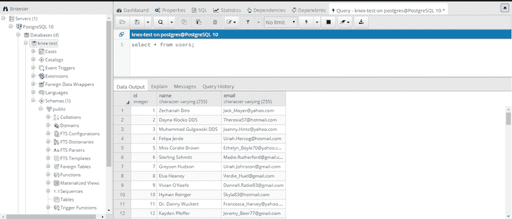

# 使用 Knex.js 查询数据库

> 原文：<https://blog.logrocket.com/querying-databases-with-knex-js/>

## Knex 简介

Knex.js 是一个“包含电池”的查询构建器，用于 PostgreSQL、MySQL、SQLite3、Oracle、Amazon Redshift 和许多其他数据库驱动程序。我们只需安装 Knex 库和适当的驱动程序来查询数据库。Knex 主要是为 Node.js 设计的，支持节点风格的回调和承诺。在本文中，我们将研究用 Knex 查询 Postgres 数据库。

## 连接 Knex 和 Postgres

要使用 Knex 和 Postgres，我们必须首先在应用程序中安装 Knex 和 pg 驱动程序。

```
npm install pg knex --save
```

安装完依赖项后，下一步是建立到 pg 的连接。这与我们传统上在节点应用程序中建立 pg 连接的方式大致相同。我们为 Postgres 和 point Knex 指定连接参数，以连接到 pg 客户机。

```
const db = require("knex")({
  client: "pg",
  connection: {
    host: "localhost",
    user: "postgres",
    password: "",
    database: "knex-test"
  }
});

app.set("db", db);

```

一旦建立了连接，我们将播种数据，而不用用 Knex 和 [faker.js](https://github.com/marak/Faker.js/) 编写任何查询。我使用 Postman 和 pgAdmin 来测试我们正在构建的 API。

## 播种转储数据

Knex 提供了许多[内置助手](http://knexjs.org/#Schema-Building)来构建我们的表模式。我已经使用内置的`createTable`函数创建了一个名为`users`的表，如果这个表不存在的话。Faker.js 正在帮助我们将虚拟数据植入表中。我使用内置的`.insert`方法将数据插入到我们刚刚创建的用户表中。这一切都发生在我们到达路线`http:localhost:3000/seed`的时候。

```
router.get("/seed", function(req, res, next) {
  const db = req.app.get('db');
  db.schema.hasTable("users").then(function(exists) {
    if (!exists) {
      db.schema
        .createTable("users", function(table) {
          table.increments("id").primary();
          table.string("name");
          table.string("email");
        })
        .then(function() {
          const recordsLength = Array.from(Array(100).keys());
          const records = recordsLength.map(rec => ({
            name: faker.name.findName(),
            email: faker.internet.email()
          }));
          db("users")
            .insert(records)
            .then(() => {
              res.send("Seeded data");
            });
        });
    } else {
      res.send("Table exists - Seeded data");
    }
  });
});
```

如果您安装了 pgAdmin，您可以快速查看种子数据。当一切正常时，您将在浏览器或邮递员界面上看到响应“种子数据”。当您尝试重新访问该路由时，它会返回“表存在-植入数据”



## 查询、插入和删除数据

### 获取所有数据

Knex 让查询变得非常简单。我将编写一个可以获取、更新、删除和创建用户的服务。使用 Knex，从 Postgres 数据库中查询数据非常简单:

```
getAllUsers(db) {
    return db
      .select("*")
      .from("users")
      .then(rows => rows);
 }
```

我将创建一个`get`路由来从数据库中获取所有用户。当从 Postman ping 这个端点时，Knex 为我们请求的数据构建查询并返回数据。

```
router
  .route("/")
  .get(function(req, res) {
    const db = req.app.get("db");
    UsersService.getAllUsers(db).then(data => {
      res.send(data);
    });
  })
```

### 插入数据

向数据库中插入新用户也很简单。我将为我们已经创建的路线创建一个`.post`方法，并用一个查询更新`usersService.js`以将数据插入 pg 数据库。

```
const UsersService = {
  insertUser(db, newUser) {
    return db
      .insert(newUser)
      .into("users")
      .returning("*")
      .then(rows => {
        return rows[0];
      });
  }
};

module.exports = UsersService;
```

更新后的路线如下所示:

```
router.route('/')
  .get(function(req, res, next) {
    const db = req.app.get("db");
    UsersService.getAllUsers(db).then(data => {
      res.send(data);
    });
  })
  .post(function(req, res) {
    const db = req.app.get("db");
    UsersService.insertUser(db, req.body).then(data => {
      res.send(data);
    });
  });
```

### 更新、删除和获取特定数据

我将根据用户 ID 对更新、删除和获取的路由进行分组。

```
router
  .route("/:id")
  .get(function(req, res) {
    const db = req.app.get("db");
    UsersService.getById(db, req.params.id).then(data => {
      res.send(data);
    });
  })
  .patch(function(req, res) {
    const db = req.app.get("db");
    UsersService.updateUser(db, req.params.id, req.body).then(() => {
      res.status(204).end();
    });
  })
  .delete(function(req, res) {
    const db = req.app.get("db");
    UsersService.deleteUser(db, req.params.id).then(data => {
      res.status(204).end();
    });
  });
```

从 Knex 查询特定信息非常简单。在这个例子中，我们使用了带有一个`where` 子句的`select`、`update`和`delete`的组合，通过 ID 选择用户并修改他们的信息。`usersService.js`看起来像:

```
const UsersService = {
  getById(db, id) {
    return db
      .from("users")
      .select("*")
      .where("id", id)
      .first();
  },
  deleteUser(db, id) {
    return db("users")
      .where({ id })
      .delete();
  },
  updateUser(db, id, userFields) {
    return db("users")
      .where({ id })
      .update(userFields);
  }
};

module.exports = UsersService;
```

使用适当的用户 ID 点击 GET、PATCH 或 DELETE 路径，我们将能够从数据库中查看、修改或删除用户信息。

完整版本的`[usersService.js](https://github.com/AvanthikaMeenakshi/knex-tutorial/blob/master/module/usersService.js)`和[路线](https://github.com/AvanthikaMeenakshi/knex-tutorial/blob/master/routes/index.js)被推送到 GitHub 上的[这个库](https://github.com/AvanthikaMeenakshi/knex-tutorial)。

## Knex.js 的利与弊

##### 优点:

1.  帮助我们编写更少的 SQL 查询:Knex 知道您正在连接到哪个数据库系统，并将改变它编写的 SQL 以匹配
2.  感觉更像是用 JavaScript 编程
3.  迁移和播种要简单得多

##### 缺点:

1.  您仍然应该花时间在更深的层次上学习数据库操作
2.  Knex 需要一个学习曲线。它本身就是一个库，开发人员应该非常了解使用 Knex 的方法
3.  如果你是一个尝试构建 API 的初学者，选择艰难的道路比快乐的道路更好。与使用 Knex 之类的查询构建器相比，自己编写查询将使您更加精通和熟悉数据库

## 您是否添加了新的 JS 库来提高性能或构建新特性？如果他们反其道而行之呢？

毫无疑问，前端变得越来越复杂。当您向应用程序添加新的 JavaScript 库和其他依赖项时，您将需要更多的可见性，以确保您的用户不会遇到未知的问题。

LogRocket 是一个前端应用程序监控解决方案，可以让您回放 JavaScript 错误，就像它们发生在您自己的浏览器中一样，这样您就可以更有效地对错误做出反应。

[](https://lp.logrocket.com/blg/javascript-signup)[https://logrocket.com/signup/](https://lp.logrocket.com/blg/javascript-signup)

[LogRocket](https://lp.logrocket.com/blg/javascript-signup) 可以与任何应用程序完美配合，不管是什么框架，并且有插件可以记录来自 Redux、Vuex 和@ngrx/store 的额外上下文。您可以汇总并报告问题发生时应用程序的状态，而不是猜测问题发生的原因。LogRocket 还可以监控应用的性能，报告客户端 CPU 负载、客户端内存使用等指标。

自信地构建— [开始免费监控](https://lp.logrocket.com/blg/javascript-signup)。