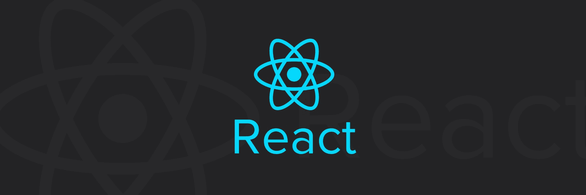

# 电子商务网站上 React 功能组件的 3 个优点

> 原文：<https://blog.logrocket.com/react-functional-components-3-advantages-and-why-you-should-use-them-a570c83adb5e/>



如果您以前使用过 React，那么您可能需要某种形式的方法来管理事物。

例如，如果我们以一个电子商务网站为例，很可能您的应用程序将不得不处理各种各样的事情，比如库存中有哪些商品，以及用户在购物车中添加了哪些商品。这些需要状态管理，这导致我们——在 React 中——使用基于类的组件。

我们的电子商务商店的一个基于类的组件的例子可能看起来像这样:

```
class App extends Component {
 constructor(props) {
       super(props);
             this.state = {
                  items: [
                    {
                      id: 0,
                      name: ‘Banana’
                      price: 25,
                      stock: 2
                    },
{
                      id: 0,
                      name: ‘Pineapple’
                      price: 90,
                      stock: 5
                    },

                    {
                      id: 0,
                      name: ‘Orange’
                      price: 20,
                      stock: 8
                    },

                    {
                      id: 0,
                      name: ‘Apple’
                      price: 50,
                      stock: 1
                    }, 
                   ],
                   cart: [],
                   total: 0,
             }
       }
 }
```

到目前为止，这是有意义的。但是在我们的应用程序中，那些仅仅处理表示而不需要任何内部状态的组件呢？

这就是我们可以开始使用功能组件的地方。

继续我们的电子商务示例，我们在应用程序中展示的每个产品都可能是它自己的组件——让我们将这个组件称为 **Product.js** 。

现在在 **Product.js** 内部，很可能有更小的子组件，比如可以点击向购物车添加/删除商品的按钮。

让我们检查一个我们可能称为 **ProductAdd.js** 的组件，它用于将产品添加到购物车。现在，出于习惯，我们最初可能会为这个按钮创建一个类组件，看起来像这样:

```
import React, {Component} from ‘react’;

 class ProductAdd extends Component {
     render() {
         return (
                 <button onClick={(e) => this.props.addToCart(this.props.id)}> + </button>
        );
     }
 }

 export default ProductAdd;
```

如果我们这样写并不是世界末日，但是考虑到它不需要内部状态，我们可以把它重写为一个功能组件。然后它会看起来像这样:

```
import React from ‘react’;

 const ProductAdd = (props) => {
       return (
       <button onClick={(e) => props.addToCart(props.id)}>+</button>
       );
 }

 export default ProductAdd;
```

您可能还注意到，我们仍然能够将属性传递给组件，属性可以是数据或函数的形式。

因此，除了处理组件的内部状态之外，功能组件可以做与类组件相同的事情。

对于我们在这里使用的例子，我们可以决定更进一步，将我们的 **Product.js** 重写为一个功能组件，因为文件的状态已经从我们在文章开始显示的主 **App.js** 文件传递下来。所以我们可以在这里做很多重构。

但是考虑到我们完全基于类的组件应用程序运行良好，我们为什么要花时间去重构呢？

让我们来看看三个原因。

**1。没有类就没有‘this’**
如果在编写 Javascript 代码时不必使用‘this’，这总是有利的。好吧，你可能正在读这篇文章，觉得你已经很好地掌握了“这个”关键词。但是当涉及到调试和整体可读性时，不必考虑“this”的范围总是有利的。

我们都曾有过不得不在 React 中调试某些东西的时候，发现我们应用程序的某些部分不能像预期的那样工作，因为我们将一些状态称为`something`，而不是`this.something`。功能组件不存在这个问题。

另外一个好处是，不使用这个意味着我们也不需要使用 bind，这是一个更令人困惑的概念。所以少了两件事，这意味着少了两个纠结，这意味着更干净，更清晰的代码。赢赢！

**2。更少的行=更好的性能**
您可能已经从我们的**产品 Add** 功能组件中注意到，它比我们基于类的对等产品少两行。这里少了两行是因为我们不必将 JSX 包装在`render()`函数中。

少两行在这里可能看起来不多，但如果你有一个电子商务网站，每个产品都是它自己的组件，我们可以很容易地拥有超过 1000 个组件。因此，少了这两行总共可以节省 2000 行！

另一个好处是，开发人员需要读写的代码越少，他们的代码就越容易理解。

* * *

### 更多来自 LogRocket 的精彩文章:

* * *

现在，除了在使用无状态功能组件时可能使用更少的代码行这一明显的改进之外，有充分的证据表明 React 中的功能组件(截至 2018 年 10 月)并没有在内部性能方面提供改进。

然而，同样有据可查的是，无状态功能组件可能很快会在 React 的未来迭代中提供改进的性能。这种提升将是没有状态或生命周期方法需要担心的结果。

因此，记住这一点，现在就习惯使用它们作为一种方法来检验您的代码库和对 React 最佳实践的一般理解是值得的。

尽管如此，功能组件仍然比类组件减少了代码，这意味着功能组件=更小的包。

**3。更容易阅读，更容易理解，更容易推理，更容易测试**

正如我们所见，无状态功能组件只是返回 JSX 的函数。因为没有任何状态被操纵，这使得它们更容易阅读和理解。

因为组件不依赖于任何内部状态，这意味着它们更容易推理，因为我们知道，传递给无状态功能组件的任何状态都是以父组件传递的属性的形式到达的。这意味着在调试方面，我们可以更进一步。

最终，因为这些组件只是返回 JSX 的函数，这使得它们很容易测试，因为你只是希望断言一个函数返回你想要的。

我们做到了！

使用功能组件有三个优点，这也是为什么您今天应该将它们添加到您的工具库中！

## [LogRocket](https://lp.logrocket.com/blg/ecommerce-signup) :看看用户为什么不完成你的电子商务流程中的一个步骤的技术和 UX 原因。

[](https://lp.logrocket.com/blg/ecommerce-signup)

LogRocket 就像是一个网络和移动应用程序和网站的 DVR，记录你的电子商务应用程序上发生的一切。LogRocket 没有猜测用户不转化的原因，而是主动揭示了阻止你转化的根本原因，比如 JavaScript 错误或死点击。LogRocket 还可以监控应用的性能，报告客户端 CPU 负载、客户端内存使用等指标。

开始主动监控您的电子商务应用程序— [免费试用](https://lp.logrocket.com/blg/ecommerce-signup)。

* * *