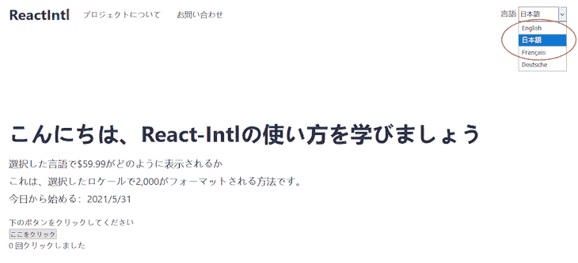
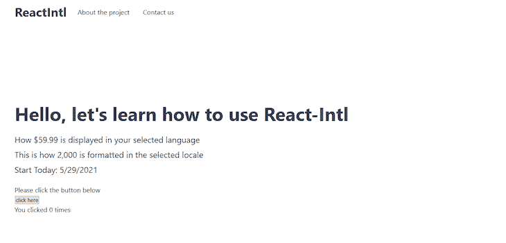
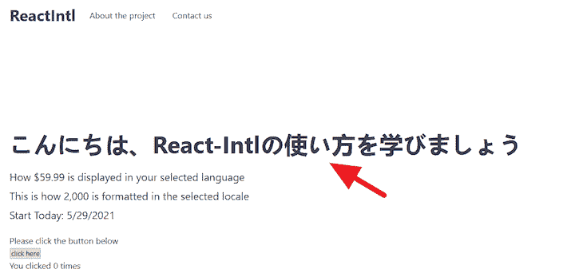
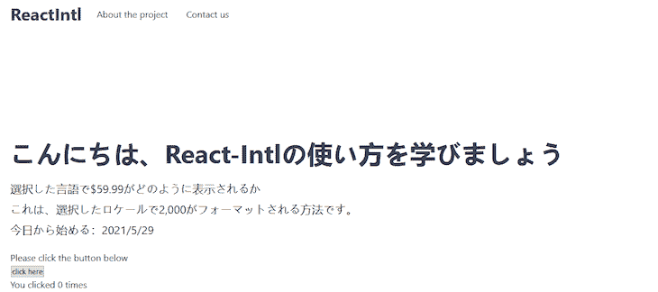
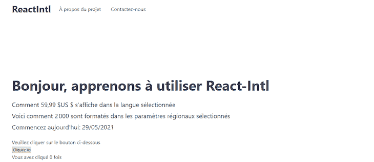

# React Intl:国际化你的 React 应用

> 原文：<https://blog.logrocket.com/react-intl-internationalize-your-react-apps/>

随着全球化的发展，为不同地区和语言环境的广泛受众编写 React 应用程序意味着要使其可以跨语言访问。

通过国际化功能，React Intl 库提供了将文件文本正确翻译成其他语言的机制。

在本指南中，我们将学习如何使用 React Intl 库在 React 项目中设置国际化。我们将创建一个简单的应用程序，允许用户在查看应用程序时选择和查看他们的首选语言。

我们还将在浏览器存储中保存所选的区域设置，以便在页面刷新或后续访问时内容仍然可用。

以下是我们将共同打造的最终产品:



与[最终确定的网页](https://ibaslogic.github.io/i18n_react_intl_project/)互动，熟悉界面，就这样，我们开始吧！

## 国际化和本地化

如前所述，React Intl 允许我们[在 React 应用](https://blog.logrocket.com/how-to-set-up-internationalization-in-react-using-lingui-js/)中设置国际化。但究竟什么是国际化？

国际化是设计一个产品的过程——在本例中是一个 React 应用程序——用于不同的地区。通常缩写为 Intl 或 i18n。

相比之下，本地化，缩写为 l10n，专注于将国际化的应用程序从其原始语言翻译成特定语言。

但是，嘿，翻译不仅仅是将文本或信息转换成目标语言。还必须考虑文化差异，比如数字和日期是如何书写的，或者不同地区的单位和货币是如何放置的。

幸运的是，有了 React Intl 库，我们可以无缝地实现我们想要的结果。

## 设置 React 项目

让我们首先从这个 GitHub 库中获取简单的 React 项目——默认内容为英文。然后，我们可以添加对另外三种语言的支持:法语、德语和日语。

因此，进入终端，切换到一个目录来保存项目，并运行以下命令来下载启动文件:

```
git clone https://github.com/Ibaslogic/i18n_react_intl_starter

```

一旦项目文件被引导，用代码编辑器打开它们。我们必须在项目目录中运行`npm install`来为项目创建一个`node_modules`文件夹。

确保在计算机上安装了 Node.js 以完成本教程。

现在，使用`npm start`启动开发服务器。我们应该会在浏览器中看到我们的应用程序被加载到 [http://localhost:3000](http://localhost:3000) 。



如果我们看一下项目的文件结构，我们应该有以下内容:

```
project_folder
    ├── node_modules
    ├── public
    ├── src
    │    ├── components
    │    │      ├── App.js
    │    │      ├── Content.js
    │    │      ├── Footer.js
    │    │      └── Header.js
    │    ├── index.css
    │    └── index.js
    ├── .gitignore
    ├── package-lock.json
    ├── package.json
    ├── README.md
    └── yarn.lock

```

太好了。既然我们在同一页上，让我们看看如何在我们的应用程序中使用 React Intl 库。

## 设置 React Intl 库

要使用这个库，我们必须通过停止开发服务器并从终端运行以下命令来安装它:

```
npm install react-intl

```

这个库为我们提供了在应用程序中实现国际化所需的所有 API 和组件。

让我们将顶级应用程序或我们应用程序的根组件包装在库中的一个`provider`组件中；在这种情况下，我们将使用`<IntlProvider>`。

### 什么是`IntlProvider`组件？

顾名思义，`IntlProvider`确保向树中的子组件提供重要的配置。

React Intl 中的这些子组件被称为`formatted`组件。它们负责在运行时进行正确的翻译和格式化。这些组件是:

*   `FormattedMessage`
*   `FormattedNumber`
*   `FormattedDate`
*   `FormattedPlural`
*   还有[更多](https://formatjs.io/docs/react-intl/components)

对于使用 React Intl 库的国际化项目，通常会使用`FormattedMessage`组件，允许用户将简单的字符串和消息翻译和格式化为复杂的字符串和消息。我们一会儿会用到这个。

回到我们的项目，让我们打开父组件文件`src/components/App.js`并用`IntlProvider`包装子组件。

确保从文件顶部的`react-intl`导入`IntlProvider`。

我们的文件应该如下所示:

```
...
import { IntlProvider } from "react-intl";

const App = () => {
  return (
    <IntlProvider>
      <div>
        <Header />
        <Content />
        <Footer />
      </div>
    </IntlProvider>
  );
};

export default App;

```

让我们花点时间检查一下`IntlProvider`组件返回什么。首先，记录组件:

```
...
const App = () => {
  console.log(IntlProvider);

  return (
    ...
  );
};
...

```

然后，检查浏览器控制台:


通过关注`defaultProps`，我们可以看到`IntlProvider`使用的所有默认配置属性。该组件还告诉我们配置一个地区。

因此，让我们通过更新组件以包括以下属性来添加识别和显示翻译所需的属性到`IntlProvider`:

```
return (
  <IntlProvider messages={{}} locale="en" defaultLocale="en">
    <div>
      <Header />
      <Content />
      <Footer />
    </div>
  </IntlProvider>
);

```

通过添加`locale`道具并保存，错误立即消失。

这个接受字符串的`locale`决定了我们的应用程序用什么语言呈现。我们将根据用户在前端的选择动态添加值。

`messages`对象包含一组准备在前端显示的翻译后的字符串。这些也将根据当前的区域设置动态添加。

最后，`defaultLocale`属性是默认的区域设置，应该与应用程序的默认语言相匹配。

在为我们的项目加载翻译后的消息之前，让我们试着熟悉一下格式化的组件。

打开`src/components/Footer.js`文件，并将这些格式化的组件添加到`return`语句中:

```
// ...
import { FormattedDate, FormattedNumber, FormattedPlural } from "react-intl";

const Footer = () => {
  // ...
  return (
    <div className="container mt">
      {/* ... */}

      <FormattedDate value={Date.now()} />
      <br />
      <FormattedNumber value={2000} />
      <br />
      <FormattedPlural value={5} one="1 click" other="5 clicks" />
    </div>
  );
};

// ...

```

接下来，保存文件并检查前端。我们应该展示这个:

```
5/29/2021 // your current date
2,000
5 clicks

```

如果我们将`IntlProvider`的`locale`属性更改为`de`并再次保存文件，我们将得到以德语格式化的数据:

```
29.5.2021

2.000

```

这太棒了。React Intl 通过格式化组件(分别为`FormattedDate`和`FormattedNumber`)基于所选区域格式化日期和数字。

这些格式化的组件有一个接受要格式化的数据的`value`属性。

我们可以通过利用它的其他道具来进一步定制这些组件。例如，我们可以有以下内容:

```
return (
  <div className="container mt">
    {/* ... */}

    <FormattedDate
      value={Date.now()}
      year="numeric"
      month="long"
      day="2-digit"
    />
    <br />
    <FormattedNumber value={2000} style={`currency`} currency="USD" />
    <br />
    {/* ... */}
  </div>
);

```

然后，我们会得到这个英语(`en`):

```
May 29, 2021 // your current date

$2,000.00

```

然后我们会得到这个德语(`de`):

```
29\. Mai 2021

2.000,00 $

```

除了这两个组件，我们还有`FormattedPlural`组件，它允许我们在应用程序中处理复数。如上面的示例所示，组件根据它接收到的值选择多个类别。

## 使用 React Intl API

我们可以格式化数据的另一种方式是通过 React Intl API[。虽然在 React](https://formatjs.io/docs/react-intl/api) 中使用[组件方法是首选，因为它可以与其他 React 组件无缝协作，但也有需要 API 方法的情况，比如当必须翻译元素的`placeholder`、`title`或`aria-label`时。](https://blog.logrocket.com/react-pure-components-functional/)

每当我们使用格式化的组件来呈现一个 React 元素时，它们都在幕后使用 React Intl API。

让我们看看这个 API 是如何工作的。仍然在`Footer.js`文件中，从`react-intl`导入`useIntl`钩子:

```
import { FormattedDate, FormattedNumber, FormattedPlural, useIntl } from "react-intl";

```

确保这是在功能性 React 组件中完成的。

如果我们在控制台中记录`useIntl`钩子，我们应该会看到格式化数据所需的所有可用函数:

```
// ...
const Footer = () => {
  // ...
  const intl = useIntl();
  console.log(intl);

  return (
    <div className="container mt">
      {/* ... */}
    </div>
  );
};
// ...
>
```

其中一个功能是`formatDate`；让我们应用它。

更新`Footer.js`文件中的`return`语句以包含该函数:

```
// ...
const Footer = () => {
  // ...
  const intl = useIntl();
  return (
    <div className="container mt">
      {/* <... */}
      <br />
      <input placeholder={intl.formatDate(Date.now())} />
    </div>
  );
};
// ...

```

检查前端以查看输入字段。记得改变`IntlProvider`的`locale`值，看看它是如何工作的。

我们可以通过添加可选配置来进一步定制:

```
<input
  placeholder={intl.formatDate(Date.now(), {
    year: "numeric",
    month: "long",
    day: "2-digit",
  })}
/>

```

现在我们已经熟悉了这些格式化程序，让我们回到我们的项目。

## 翻译应用程序的源文本字符串

为了支持其他语言环境，我们必须翻译源文本。对于本教程，让我们使用[谷歌翻译](https://translate.google.com/)。

在`src`目录下创建一个名为`i18n`的文件夹。在这个文件夹中，创建两个不同的文件，分别命名为`locales.js`和`messages.js`。`locales.js`文件将保存我们支持的地区，而`messages.js`文件将保存相应的翻译。

将此添加到`i18n/locales.js`文件中:

```
export const LOCALES = {
  ENGLISH: "en-US",
  JAPANESE: "ja-JA",
  FRENCH: "fr-FR",
  GERMAN: "de-DE",
};

```

这对于避免手动添加语言环境是必要的。例如，要访问`en-US`，我们将使用`[LOCALES.ENGLISH]`。

### 代码从哪里来？

代码`en-US`来自于`language-COUNTRY`代码，尽管我们也可以只使用`[language](http://www.gnu.org/savannah-checkouts/gnu/gettext/manual/gettext.html#Language-Codes)`代码而不添加`[COUNTRY](http://www.gnu.org/savannah-checkouts/gnu/gettext/manual/gettext.html#Country-Codes)`代码。

然而，在多个国家使用同一种语言的情况下，添加`COUNTRY`澄清器会很有用。例如，美国的英语是`en-US`，英国的英语是`en-GB`。

### React 中的翻译

现在，在`i18n/messages.js`文件中，添加以下翻译:

```
import { LOCALES } from "./locales";

export const messages = {
  [LOCALES.ENGLISH]: {
    learn_to: "Hello, let's learn how to use React-Intl",
    price_display:
      "How {n, number, ::currency/USD} is displayed in your selected language",
    number_display:
      "This is how {n, number} is formatted in the selected locale",
    start_today: "Start Today: {d, date}",
    // menu
    about_project: "About the project",
    contact_us: "Contact us",
  },
  [LOCALES.FRENCH]: {
    learn_to: "Bonjour, apprenons à utiliser React-Intl",
    price_display:
      "Comment {n, number, ::currency/USD} $ s'affiche dans la langue sélectionnée",
    number_display:
      "Voici comment {n, number} sont formatés dans les paramètres régionaux sélectionnés ",
    start_today: "Commencez aujourd'hui: {d, date}",
    // menu
    about_project: "À propos du projet",
    contact_us: "Contactez-nous",
  },
  [LOCALES.GERMAN]: {
    learn_to: "Hallo, lass uns lernen, wie man React-Intl benutzt",
    price_display:
      "Wie {n, number, ::currency/USD} in Ihrer ausgewählten Sprache angezeigt wird",
    number_display:
      "Auf diese Weise werden {n, number} im ausgewählten Gebietsschema formatiert",
    start_today: "Beginnen Sie heute: {d, date}",
    // menu
    about_project: "Über das Projekt",
    contact_us: "Kontaktiere uns",
  },
  [LOCALES.JAPANESE]: {
    learn_to: "こんにちは、React-Intlの使い方を学びましょう",
    price_display:
      "選択した言語で{n, number, ::currency/USD}がどのように表示されるか",
    number_display:
      "これは、選択したロケールで{n, number}がフォーマットされる方法です。",
    start_today: "今日から始める：{d, date}",
    // menu
    about_project: "プロジェクトについて",
    contact_us: "お問い合わせ",
  },
};

```

这个文件包含我们的应用程序源文本和支持的语言环境的翻译。注意每个惟一的 id 和键，它们可以被命名为任何名称；我们将使用它们将相应的字符串注入到我们的应用程序中。

现在，让我们把注意力集中在简单的字符串上，忽略花括号中的参数，也称为占位符。

接下来，让我们加载`IntlProvider`组件的`message`属性中的数据。

从数据中我们可以看到，我们可以像这样访问英语翻译对象:

```
messages[LOCALES.ENGLISH]

```

这同样适用于其他地区。

所以，让我们把这个英文翻译赋给`provider`组件的`messages`道具。在本指南的后面，我们将定义一个逻辑，该逻辑根据用户选择的语言环境动态注入翻译后的消息。

在`components/App.js`文件中，导入文件顶部的`LOCALES`和`messages`:

```
import { LOCALES } from "../i18n/locales";
import { messages } from "../i18n/messages";

```

然后，更新`<IntlProvider>`,这样我们就有了以下内容:

```
const App = () => {
  const locale = LOCALES.ENGLISH;

  return (
    <IntlProvider
      messages={messages[locale]}
      locale={locale}
      defaultLocale={LOCALES.ENGLISH}
    >
      ...
    </IntlProvider>
  );
};

export default App;

```

从代码中，我们可以推断出英语数据被加载到了`provider`组件中，并且可以通过子组件进行访问。

如前所述，我们将使用`FormattedMessage`来格式化这些复杂的字符串。如果我们的消息结合了日期、数字或简单的消息，那么这个组件是理想的。

我们将从转换简单的字符串开始，“你好，让我们学习如何使用 React-Intl。”

转到`components/Content.js`文件并导入`FormattedMessage`:

```
import { FormattedMessage } from "react-intl";

```

然后，用组件替换字符串:

```
import { FormattedMessage } from "react-intl";

const Content = () => {
  return (
    <div className="container hero">
      <h1><FormattedMessage id="learn_to" /></h1>
      {/* ... */}
    </div>
  );
};

export default Content;

```

就这么简单。为了测试我们的工作，我们可以手动将`App.js`文件中的`locale`更改为`JAPANESE`:

```
const locale = LOCALES.JAPANESE;

```

保存并查看前端的更改:



上面代码中使用的`FormattedMessage`接受一个`id`属性，该属性的值与翻译文件中的一个特定键相匹配，然后返回当前语言环境的相应字符串。请记住，这个`id`在翻译文件中所有支持的地区中是唯一的。

## 使用参数

当我们看到包含日期、金额或数字的消息时，我们希望用参数替换它们。

前面，我们学习了如何使用`FormattedDate`和`FormattedNumber`来格式化这些类型的值。但是这里我们将使用`FormattedMessage`,因为值是字符串的一部分。

如果我们看一下翻译文件，我们将按照下面的模式替换这些值类型:`{ key, type, format }`。

例如，我们有这样的东西:

```
price_display:
  "How {n, number, ::currency/USD} is displayed in your selected language",

```

第一个元素`n`是键，它查找数据对象以找到合适的数据。第二个元素是要解释的数据类型，它符合特定的地区。

第三个参数是可选的，允许我们指定关于元素类型的附加信息。

在上面的例子中，我们说,`number`的占位符必须格式化为美元货币。然后，React 国际头寸货币。你可以在找到[货币代码列表。](https://www.currency-iso.org/dam/downloads/lists/list_one.xml)

要使用`FormattedMessage`来转换这种类型的字符串，我们将有这样的东西:

```
<FormattedMessage id="price_display" values={{ n: 59.99 }} />

```

正如所料，`id`定位当前地区的翻译，占位符由`key`值替换。

如果我们在项目中应用这个逻辑，`components/Content.js`文件现在看起来像这样:

```
import { FormattedMessage } from "react-intl";

const Content = () => {
  return (
    <div className="container hero">
      <h1><FormattedMessage id="learn_to" /></h1>
      <p><FormattedMessage id="price_display" values={{ n: 59.99 }} /></p>
      <p><FormattedMessage id="number_display" values={{ n: 2000 }} /></p>
      <p><FormattedMessage id="start_today" values={{ d: new Date() }} /></p>
    </div>
  );
};

export default Content;

```

保存文件，并通过将`component/App.js`文件中的区域设置更改为另一种支持的语言来测试应用程序:

```
const locale = LOCALES.JAPANESE;

```

我们的应用程序应该是这样的:



## 反应整数的复数化

前面，我们学习了如何使用`<FormattedPlural>`组件来处理简单的复数文本。在本节中，我们将使用`<FormattedMessage>`在文本丰富的消息中实现复数。

目前，如果我们点击前端的计数按钮，当计数为单数时，也就是说，当计数为`1`时，我们没有显示正确文本的逻辑。

当我们使用`{ key, type, format }`模式格式化货币时，我们可以使用相同的模式，但是使用`plural`和`matches`分别替换`type`和`format`。

通过应用此模式，我们可以将以下内容添加到我们的英语翻译对象中:

```
click_count: "You clicked {count, plural, one {# time} other {# times}}"

```

复数类别`one`和`other`，匹配第一个和第二个花括号内的单数和复数形式，前面是代表计数的`#`。

如果我们将消息翻译到其他语言环境并应用相同的逻辑，我们将得到以下德语消息:

```
click_count:
      "Sie haben {count, plural, one {# Mal} other {# Mal}} geklickt",

```

对于法语:

```
click_count:
  "Vous avez cliqué {count, plural, one {# fois} other {# fois}}",

```

对于日本人:

```
click_count: "{count, plural, one {# 回} other {# 回}}クリックしました",

```

保存文件并打开`components/Footer.js`文件，使用`FormattedMessage`组件渲染翻译。

然后，找到这个元素:

```
<p>You clicked {count} times</p>

```

将上述内容替换为以下内容:

```
<p>
  <FormattedMessage id="click_count" values={{ count: count }} />
</p> 

```

我们还必须从`react-intl`导入`FormattedMessage`组件:

```
import {
  // ...
  FormattedMessage,
} from "react-intl";

```

再次保存文件。让我们重新加载前端并测试我们的工作。

我们现在可以为菜单项添加翻译支持。首先，像这样导入`components/Header.js`文件中的`FormattedMessage`:

```
import { FormattedMessage } from "react-intl";

```

我们需要访问翻译文件中使用的单独菜单`key`。为此，让我们更新`menu`数组以包含`key`:

```
const menu = [
  {
    key: "about_project",
    // ...
  },
  {
    key: "contact_us",
    // ...
  },
];

```

我们现在可以使用这些键来访问`FormattedMessage`中的翻译。

首先找到以下代码:

```
{menu.map(({ title, path }) => (
  <li key={title}>
    <a href={path}>{title}</a>
  </li>
))}

```

然后，替换为:

```
{menu.map(({ title, path, key }) => (
  <li key={title}>
    <a href={path}>
      <FormattedMessage id={key} />
    </a>
  </li>
))}

```

保存文件并测试应用程序。

为了本地化前端按钮及其对动作文本的调用，让我们在`i18n/message.js`文件中为按钮分配键。

对于英语对象，添加以下内容:

```
click_button: "Please click the button below",
click_here: "click here",

```

对于法语，添加以下内容:

```
click_button: "Veuillez cliquer sur le bouton ci-dessous",
click_here: "Cliquez ici",

```

使用上面的代码和 Google translate 添加其他语言环境的翻译，比如日语和德语。

完成后，让我们打开`components/Footer.js`并用`FormattedMessage`替换文本字符串:

```
return (
  <div className="container mt">
    {/* Footer content here */}
    <p><FormattedMessage id="click_button" /></p>
    <button onClick={onChange}>
      <FormattedMessage id="click_here" />
    </button>
    {/* ... */}
  </div>
);

```

保存文件并重新加载前端。请注意，按钮的描述和按钮的文本以法语更新。



## 增加了在前端切换语言环境的选项

为了提供在前端切换语言环境的选项，我们必须打开`components/Header.js`文件，并在`return`语句上方添加以下内容:

```
// Languages
const languages = [
  { name: "English", code: LOCALES.ENGLISH },
  { name: "日本語", code: LOCALES.JAPANESE },
  { name: "Français", code: LOCALES.FRENCH },
  { name: "Deutsche", code: LOCALES.GERMAN },
];

```

然后，导入文件顶部的`LOCALES`:

```
import { LOCALES } from "../i18n/locales";

```

接下来，我们将遍历`languages`数组来生成下拉列表。

仍然在文件中，找到这个`div`容器元素:

```
<div className="switcher">
  {/* Language switch dropdown here */}
</div>

```

然后，更新它以查看以下内容:

```
<div className="switcher">
  {/* Language switch dropdown here */}
  Languages{" "}
  <select>
    {languages.map(({ name, code }) => (
      <option key={code} value={code}>
        {name}
      </option>
    ))}
  </select>
</div>

```

保存它并将这个简单的样式添加到`src/index.css`文件中:

```
.switcher select {
  width: 99px;
  height: 30px;
}

```

再次保存文件，并在前端查看下拉菜单。目前，语言之间的切换不会改变页面内容，所以让我们来解决这个问题。

如果熟悉 React 中的[表单处理，这个过程应该是小菜一碟。如果没有，那也没关系，因为我们会一起做。](https://blog.logrocket.com/forms-in-react-in-2020/)

在 React 中，表单输入应该是一个受控的输入，不像 HTML 表单那样。

为此，我们将向`select`元素添加一个`value`道具和一个`onChange`事件。当`onChange`根据用户的选择更新值时，`value`属性被分配当前的区域设置。

同时，更新`select`元素以包含这些属性:

```
<select onChange="" value="">
  ..
</select>

```

由于`IntlProvider`在父组件中，`App.js`也必须知道当前的语言环境，所以让我们在文件中设置逻辑。

我们可以通过 props 将必要的数据传递给`Header`子组件。这个过程叫做道具演练。

打开`components/App.js`并添加一个默认语言为英语的州:

```
import { useState } from "react";
...
const App = () => {
  const locale = LOCALES.ENGLISH;

  const [currentLocale, setCurrentLocale] = useState(locale);

  return (
    <IntlProvider
      messages={messages[currentLocale]}
      locale={currentLocale}
      defaultLocale={LOCALES.ENGLISH}
    >
      ...
    </IntlProvider>
  );
};

export default App;

```

不要忘记从 React 导入`useState`钩子来获取当前的区域设置。

现在，让我们将区域设置传递给`Header`子组件，并在`select`元素中使用它。

在`App.js`文件中，更新`<IntlProvider />`中的`<Header />`实例，这样我们就有了以下内容:

```
<Header currentLocale={currentLocale}/>

```

保存文件，打开`Header.js`访问数据；将其传递给`select`元素的`value`道具:

```
...
const Header = (props) => {
  ...
  return (
    <header>
      <div className="container header_content">
        ...
        <nav>
          ...
        </nav>
        <div className="spacer"></div>
        <div className="switcher">
          {/* Language switch dropdown here */}
          Languages{" "}
          <select onChange="" value={props.currentLocale}>
           ...
          </select>
        </div>
      </div>
    </header>
  );
};

export default Header;

```

调用`props`以下内容:

```
const Header = (props) => { 

```

接下来，我们将使用`onChange`事件来处理更新。

在`App.js`文件中，在`return`语句上方添加以下处理程序，并通过 props 将其传递给`Header`组件:

```
const handleChange = (e) => {
  setCurrentLocale(e.target.value);
};

```

代码现在看起来像这样:

```
...
const App = () => {
  ...
  const handleChange = (e) => {
    setCurrentLocale(e.target.value);
  };

  return (
    ...
      <div>
        <Header currentLocale={currentLocale} handleChange={handleChange} />
        ...
      </div>
    ...
  );
};

```

保存文件并访问`Header`组件中的处理程序。

简单地更新`select`元素，这样我们就有了:

```
<select onChange={props.handleChange} value={props.currentLocale}>

```

现在我们可以测试我们的应用程序了。有用！太棒了。

确保翻译下拉列表旁边的**语言**文本。

## 在浏览器本地存储中保留选定的区域设置

现在，如果我们从默认的区域设置切换并重新加载页面，内容就会恢复到默认的。我们不想那样。

在这一节中，我们将看到如何轻松地将选定的区域设置保存到浏览器存储中。这意味着在重新加载和后续访问时，用户首选语言的内容在页面上仍然可见，进一步改善了用户体验。

首先，打开`App.js`文件，并将这段代码添加到`return`语句之上:

```
//localstorage
function getInitialLocal() {
  // getting stored items
  const savedLocale = localStorage.getItem("locale");
  return savedLocale || LOCALES.ENGLISH;
}

```

然后，更新状态以使用此函数:

```
const [currentLocale, setCurrentLocale] = useState(getInitialLocal());

```

最后，更新`handleChange`以包含存储对象:

```
const handleChange = (e) => {
  setCurrentLocale(e.target.value);
  // storing locale in the localstorage
  localStorage.setItem("locale", e.target.value);
};

```

从`App.js`文件中删除这一行，因为它现在是多余的:

```
const locale = LOCALES.ENGLISH;

```

现在，保存文件并测试应用程序。确保重新加载页面，以查看数据是否保存在存储中。

因为我们从使用`getItem()`方法访问本地存储开始，以检查任何保存的区域设置或返回一个回退，所以返回的区域设置被分配给状态变量`currentLocale`。

同样，我们也使用`setItem()`方法将用户选择的地区保存到`Storage`对象中。

阅读如何[在本地存储中持久化 React 组件的状态](https://blog.logrocket.com/localstorage-javascript-complete-guide/)以了解更多信息。

## 结论

我们已经涵盖了关于 React Intl 库我们需要知道的几乎所有内容。我们已经学习了如何将这个库应用到 React 应用程序，以及如何在本地存储中持久化用户选择的语言环境。

我希望这个指南对你有所帮助。如果你有问题或贡献，我在评论区。您还可以在这个 GitHub 资源库中找到[整个项目的源代码。](https://github.com/Ibaslogic/i18n_react_intl_project)

## [LogRocket](https://lp.logrocket.com/blg/react-signup-general) :全面了解您的生产 React 应用

调试 React 应用程序可能很困难，尤其是当用户遇到难以重现的问题时。如果您对监视和跟踪 Redux 状态、自动显示 JavaScript 错误以及跟踪缓慢的网络请求和组件加载时间感兴趣，

[try LogRocket](https://lp.logrocket.com/blg/react-signup-general)

.

[ ](https://lp.logrocket.com/blg/react-signup-general) [](https://lp.logrocket.com/blg/react-signup-general) 

LogRocket 结合了会话回放、产品分析和错误跟踪，使软件团队能够创建理想的 web 和移动产品体验。这对你来说意味着什么？

LogRocket 不是猜测错误发生的原因，也不是要求用户提供截图和日志转储，而是让您回放问题，就像它们发生在您自己的浏览器中一样，以快速了解哪里出错了。

不再有嘈杂的警报。智能错误跟踪允许您对问题进行分类，然后从中学习。获得有影响的用户问题的通知，而不是误报。警报越少，有用的信号越多。

LogRocket Redux 中间件包为您的用户会话增加了一层额外的可见性。LogRocket 记录 Redux 存储中的所有操作和状态。

现代化您调试 React 应用的方式— [开始免费监控](https://lp.logrocket.com/blg/react-signup-general)。