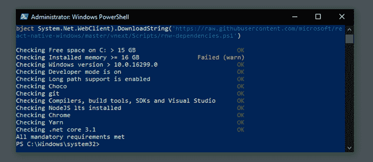
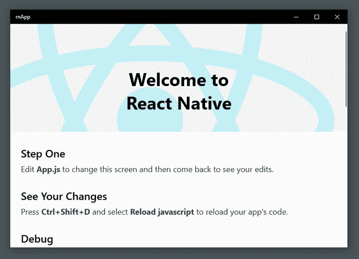
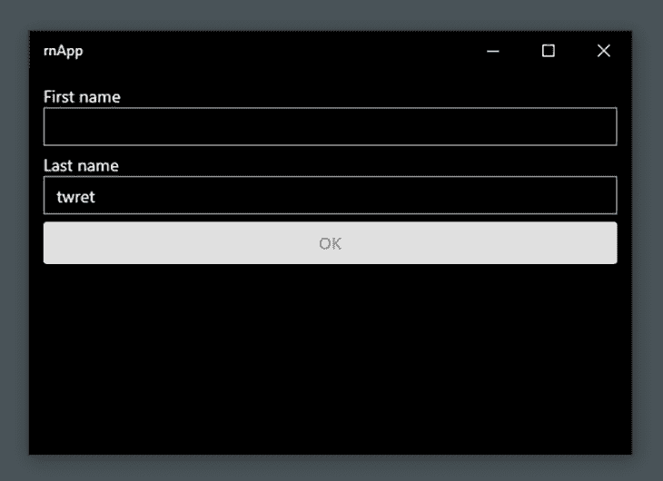

# React Native for desktop 使用 React Native for Windows-log rocket 博客

> 原文：<https://blog.logrocket.com/react-native-desktop-using-react-native-windows/>

众所周知，React 是一个免费的开源 JavaScript 库，由脸书编写，用于创建高度动态的 web 用户界面。脸书后来创建了 React Native，通过使用 React 作为开发人员的核心界面来开发跨平台的原生移动应用程序，这允许他们使用单个基于 React 语法的代码库来构建 Android 和 iOS 的原生移动应用程序。

React 通常将其组件更改呈现给 DOM(文档对象模型)，但它也可以将组件呈现为 HTML，以满足服务器端呈现(SSR)需求。对于 React Native，有 [Proton Native](https://github.com/kusti8/proton-native) ，它生成跨平台的桌面应用程序，并允许您使用 Qt 和 wxWidgets UI 工具包呈现原生 UI 元素，但它不再被主动维护。

虽然它仍然是一个活跃的分支，但在本文中，我们将介绍一个更加稳定、积极维护和流行的项目:`[react-native-windows](https://github.com/microsoft/react-native-windows)`。这是微软对 React Native for Windows 和 macOS 后端的扩展，使相同的 React Native-based 前端可以在 Windows 和 macOS 上本地呈现特定于平台的 UI 元素。

我将解释如何使用`react-native-windows`项目开发 Windows 桌面应用程序。我们还将介绍 React 本机语法如何通过框架的内部模块变成本机桌面应用程序。

## 设置开发人员环境

确保您的计算机安装了以下 Windows 版本:

*   Windows 10.0.16299.0(也称为 1709、Redstone 3 或 Fall Creators 更新)或更高版本

如果您的计算机满足上述要求，您可以在提升的 PowerShell 窗口中运行以下命令来安装所需的依赖项。

```
Set-ExecutionPolicy Unrestricted -Scope Process -Force; iex (New-Object System.Net.WebClient).DownloadString('https://raw.githubusercontent.com/microsoft/react-native-windows/master/vnext/Scripts/rnw-dependencies.ps1')

```

上述命令将打开开发人员模式并安装 Visual Studio、Chocolatey 包管理器和 Node.js LTS 版本。此外，如果您的计算机有 8GB 或更高的物理内存，那就太好了，因为 Windows 构建进程通常需要高于平均水平的物理内存才能运行。

上面的脚本文件建议使用 16GB 的物理内存。如果上述脚本的第二次执行给出如下输出，您可以继续学习本教程。



Checking prerequisites for React Native for Windows development

## 创建 React 本机 Windows 应用程序

首先，用下面的命令创建一个新的 [React Native](https://blog.logrocket.com/tag/react-native) 项目。该命令将自动生成一个基本的 React 本机应用程序。

```
npx react-native init rnApp --template [email protected]^0.64.0

```

官方的 React 原生包仅支持 Android 和 iOS 后端，因此您需要运行以下命令来启用 Windows 后端。

```
npx react-native-windows-init --overwrite

```

现在，我们可以使用下面的命令运行我们新创建的 React 本地应用程序，作为真正的本地 Windows 应用程序。此命令将从当前项目的源代码中触发调试版本。

```
npx react-native run-windows

```

此外，您可以添加`--useHermes`选项来使用 Hermes JavaScript 引擎，而不是默认的 Chakra。

第一个构建过程可能需要很长时间才能完成，因为它将编译许多 C++源文件。如果构建过程因错误而停止，您可以运行带有`--logging`选项的相同命令来查找这些错误。

您可能还需要注意以下针对构建过程中可能出现的常见错误的解决方案:

*   如果构建过程花费很多时间，或者有与 Chakra 相关的编译错误，使用`--useHermes`选项
*   如果构建过程引发了关于缺少 Windows 10 SDK 的错误，请从 Visual Studio 安装程序中安装它
*   如果构建过程因证书错误而失败，请按照以下步骤使用 Visual Studio 为自动生成的 UWP 项目创建一个新的证书
*   有些模块的路径有空格。确保您的项目路径不包含任何空格

一旦构建过程完成，您将看到 React 本机应用程序的 UWP 版本，如下所示。



The initial auto-generated React Native app runs as a UWP app

热重装功能已启用。另外，`run-windows`命令将在 Chrome 上打开 React 原生调试器。你可以使用 Chrome DevTools 为你的应用程序的 JavaScript 源文件设置断点。

现在，让我们了解一下幕后发生了什么。

## React 本机窗口内部

React 本机核心有几个基本的预定义 React 组件，如视图、文本、图像、TextInput 和 ScrollView。官方 React 原生运行时可以为 Android 和 iOS 操作系统渲染真正的原生 UI 构建块。React 原生团队最初使原生渲染模块完全可扩展。因此，开发人员社区也能够将其扩展到其他平台。

`react-native-windows`项目增加了 Windows 应用目标支持。它可以从典型的 React 本地项目生成一个具有真正本地 UWP GUI 的 Windows 应用程序。UWP 应用程序可以在所有流行的 Windows 平台上工作，如 Windows 10、Windows 10 Mobile、Xbox One 系统软件和 Windows 混合现实。

但是，应用程序的 JavaScript 部分运行在一个 JavaScript 引擎上，类似于最初的 React 原生项目。`react-native-windows`项目最初使用 Chakra JavaScript 引擎，后来他们集成了脸书的 Hermes JavaScript 引擎以提高性能。

## 使用`react-native-windows`开发简单的应用程序

我们将制作一个简单的 UWP 应用程序，当您提交您的名字和姓氏时，它会显示一条问候消息。将以下代码添加到您的`App.js`文件中。

```
import React from 'react';
import type {Node} from 'react';
import {
  SafeAreaView,
  ScrollView,
  StyleSheet,
  Text,
  TextInput,
  Button,
  useColorScheme,
  View,
  Alert,
} from 'react-native';
const App: () => Node = () => {
  const isDarkMode = useColorScheme() === 'dark';
  const [firstName, setFirstName] = React.useState('');
  const [lastName, setLastName] = React.useState('');

  const styles = StyleSheet.create({
    dark: {
      color: '#fff',
      backgroundColor: '#000',
    },
    light: {
      color: '#000',
      backgroundColor: '#fff',
    },
    formItem: {
      marginBottom: 6,
    }
  });

  const backgroundStyle = {
    backgroundColor: isDarkMode ? styles.dark : styles.light,
  };

  const showFullName = () => {
    Alert.alert(`Hello ${firstName} ${lastName}`);
  };
return (
    <SafeAreaView style={backgroundStyle}>
      <ScrollView
        contentInsetAdjustmentBehavior="automatic"
        style={backgroundStyle}>
        <View style={{padding: 12}}>
          <Text style={backgroundStyle}>First name</Text>
          <TextInput 
            style={styles.formItem} 
            value={firstName} 
            onChangeText={setFirstName}
          />
          <Text style={backgroundStyle}>Last name</Text>
          <TextInput 
            style={styles.formItem} 
            value={lastName} 
            onChangeText={setLastName}
          />
          <Button 
            style={styles.formItem}
            title='OK' 
            onPress={showFullName}
            disabled={!firstName || !lastName}>
          </Button>
        </View>
      </ScrollView>
    </SafeAreaView>
  );
};
export default App;

```

现在，通过 React 本机调试器重新加载当前应用程序。你会看到一个如下的应用程序，根据你的主题设置来设计风格。



在填写完文本输入后，当您单击 OK 按钮时，您将看到一个带有问候语的消息框，如下所示。


在这个示例应用程序中，我们使用了几个 React 本机核心组件和核心 API，以及 React 的 [`useState`钩子](https://blog.logrocket.com/a-guide-to-usestate-in-react)来获取当前用户输入。正如你所看到的，我们最终从 React 本地组件中获得了本地 UWP UI 元素。

`react-native-windows`扩展也支持复杂的布局实现，因为它支持一种 [Yoga](https://yogalayout.com/) 友好的语法。

React 原生开发者社区也制作了各种不同寻常的库，[几个库也支持`react-native-windows`](https://microsoft.github.io/react-native-windows/docs/supported-community-modules#community-modules) 。换句话说，一些流行的 React 原生库将在 Android、iOS 和 Windows 应用程序上工作。

通过使用 Visual Studio 打开 UWP 应用程序源代码，可以分发应用程序。

## 结论

这个项目是在官方 React Native 项目的早期开发阶段开始的。微软最近也开始了对`[react-native-macos](https://github.com/microsoft/react-native-macos)`的工作，为 macOS 后端扩展 React Native。

`react-native-windows`项目确实从基于 JavaScript 的代码库中呈现了特定于平台的 UI 元素。因此，如果您正在寻找一种方法来使用 React Native 构建高质量的 Windows 桌面应用程序，这是最佳的解决方案。

## [LogRocket](https://lp.logrocket.com/blg/react-native-signup) :即时重现 React 原生应用中的问题。

[](https://lp.logrocket.com/blg/react-native-signup)

[LogRocket](https://lp.logrocket.com/blg/react-native-signup) 是一款 React 原生监控解决方案，可帮助您即时重现问题、确定 bug 的优先级并了解 React 原生应用的性能。

LogRocket 还可以向你展示用户是如何与你的应用程序互动的，从而帮助你提高转化率和产品使用率。LogRocket 的产品分析功能揭示了用户不完成特定流程或不采用新功能的原因。

开始主动监控您的 React 原生应用— [免费试用 LogRocket】。](https://lp.logrocket.com/blg/react-native-signup)