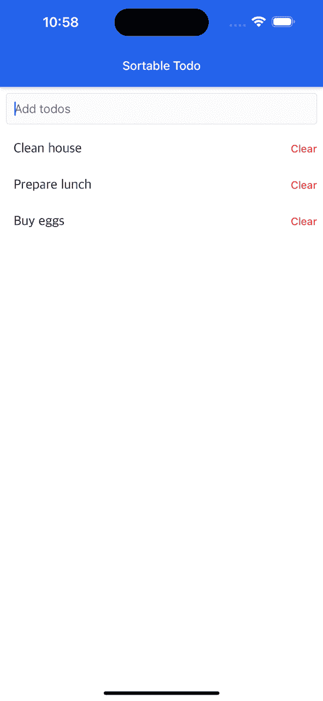
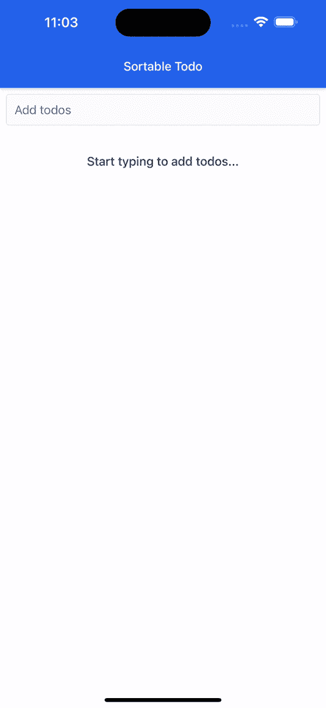

# 使用 React 本机可拖动平面列表构建可拖动的待办事项列表

> 原文：<https://blog.logrocket.com/react-native-draggable-flatlist/>

拖动列表重新排序是许多待办事项和看板应用程序的常见用例。今天，我们正在使用 React Native 构建一个类似的可排序待办事项应用程序。这个应用程序允许用户添加、删除和标记待办事项。用户还可以拖动待办事项并对其重新排序，当你想对某些事项进行优先级排序时，这一步尤其有用。

我们将使用`react-native-draggable-flatlist`构建应用程序。这个库建立在`[react-native-reanimated](https://github.com/software-mansion/react-native-reanimated)`之上，以 60 FPS 的速度无缝处理动画。它也得到很好的维护和测试，使它比其他选项更适合。

*向前跳转:*

## 安装和设置

React Native 项目可以使用 React Native 或 Expo 启动。

对于这个项目，我们将使用 Expo 来快速启动项目，因为这是启动 React 本地项目的最快和最无缝的方式。

运行以下命令创建我们的应用程序:

```
npx create-react-app todo-sortable

```

一旦项目准备就绪，我们就可以安装所需的库`[react-native-draggable-flatlist](https://github.com/computerjazz/react-native-draggable-flatlist)`。

现在让我们安装`react-native-draggable-flatlist`:

```
npm install react-native-draggable-flatlist
OR
yarn add react-native-draggable-flatlist

```

这个包依赖于`react-native-gesture-handler`和`react-native-reanimated`。让我们继续安装这些软件包:

```
npx expo install react-native-gesture-handler
# OR this command for non expo project
yarn add react-native-gesture-handler

```

该命令将安装世博会支持的 [`react-native-gesture-handler`](https://docs.expo.dev/versions/latest/sdk/gesture-handler/) 版本。

我们还需要更新入口文件 App.js 来支持手势处理程序。转到 App.js 并更新如下:

```
// import at the top
import "react-native-gesture-handler";

// wrap whole app with <GestureHandlerRootView>
import { GestureHandlerRootView } from "react-native-gesture-handler";

export default function App() {
  return (
    <GestureHandlerRootView>
      <View style={styles.container}>
        <Text>Open up App.js to start working on your app!</Text>
        <StatusBar style="auto" />
      </View>
    </GestureHandlerRootView>
  );
}

```

现在，我们需要安装[React Native realized](https://docs.expo.dev/versions/latest/sdk/reanimated/)。

```
npx expo install react-native-reanimated
# OR this command for non expo project
yarn add react-native-reanimated

```

安装完成后，还必须将巴别塔插件添加到`babel.config.js` **:**

```
module.exports = function (api) {
  api.cache(true);
  return {
    presets: ['babel-preset-expo'],
    plugins: ['react-native-reanimated/plugin'],
  };
};

```

现在，我们需要安装一个组件库，这将使我们的开发过程快得多。我用的是`react-native-design-system`，但是你可以选择任何你喜欢的组件库。

运行以下命令安装软件包:

```
yarn add react-native-design-system

```

现在我们已经准备好了样板文件。这是应用程序在这一步的样子:


现在，让我们深入了解功能！

## 为待办事项添加输入

在我们允许待办事项可拖动之前，我们需要处理添加待办事项。为了实现这一点，我们将使用来自`react-native-design-system`的`Input`组件。

首先，我们需要用来自`react-native-design-system`的`ThemeProvider`包装我们的应用程序。这是必需的，因为组件的所有样式都依赖于此。

去 App.js 用`ThemeProvider`把你的`<App/>`包起来:

```
import { ThemeProvider, theme } from "react-native-design-system";

const App = () => {
  return (
    <GestureHandlerRootView style={styles.container}>
      <ThemeProvider theme={theme}>
        <View style={styles.container}>
          <Text>Open up App.js to start working on your app!</Text>
          <StatusBar style="auto" />
        </View>
      </ThemeProvider>
    </GestureHandlerRootView>
  );
};

export default App;

```

让我们创建一个新的组件来处理待办事项列表。创建一个 src 文件夹并添加一个`TodoList`组件:

```
import { View, Text } from "react-native";
import React from "react";

const TodoList = () => {
  return (
    <View>
      <Text>TodoList</Text>
    </View>
  );
};

export { TodoList };

```

现在，我们需要添加一个`Input`组件，并使用`useState()`钩子保存用户输入:

```
import { View, Text } from "react-native";
import React from "react";
import { Input } from "react-native-design-system";

const TodoList = () => {
  const [text, setText] = useState("");

  const handleTextInput = (input) => {
    setText(input);
  };

  const handleAddTodo = () => {
    // handle adding todos
  };
  return (
    <View>
      <Input
        value={text}
        outline
        onChangeText={handleTextInput}
        onSubmitEditing={handleAddTodo}
      />
    </View>
  );
};

export { TodoList };

```

这将确保我们正确保存用户输入状态。我们将很快使用此状态来创建待办事项。现在我们只需要在 App.js 中导入这个组件:

```
import { TodoList } from "./src/TodoList";

const App = () => {
  return (
    <GestureHandlerRootView style={styles.container}>
      <ThemeProvider theme={theme}>
        <TodoList />
      </ThemeProvider>
    </GestureHandlerRootView>
  );
};

export default App;

```

## 添加待办事项

在开始将待办事项添加到我们的列表之前，我们需要了解数据是如何被`react-native-draggable-flatlist`库请求的。如果你看一下文档，你会发现它期望数据是一个数组。

让我们想象一下在我们的情况下会是什么样子:

```
const data = [
  {
    key: "123",
    todo: "Buy Grocery",
    isCompleted: false,
  },
  {
    key: "124",
    todo: "Make Omelet",
    isCompleted: false,
  },
  {
    key: "125",
    todo: "Go to the gym",
    isCompleted: false,
  },
];

```

如果你观察上面的数据，我们把数字作为一个键和其他属性放在一起。为了保持密钥的唯一性，我们还可以使用`uuid`来生成它们。让我们先安装`uuid`包:

```
yarn add uuid react-native-get-random-values

```

我们需要`react-native-get-random-values`，因为`uuid`依赖于它。我们来更新 App.js 文件，导入`react-native-get-random-values`如下:

```
import "react-native-gesture-handler";
// import the package below
import "react-native-get-random-values";
import { StyleSheet } from "react-native";
// rest of the code

```

让我们开始在数据阵列中添加待办事项:

```
// other imports
import DraggableFlatList, {
  ScaleDecorator,
} from "react-native-draggable-flatlist";
import { v4 as uuidv4 } from "uuid";
// import Header
import { Input, Header } from "react-native-design-system";

const TodoList = () => {
  const [text, setText] = useState("");
  // add state to save todos
  const [data, setData] = useState([]);

  const handleTextInput = (input) => {
    setText(input);
  };

  const handleAddTodo = () => {
    // get the current text value
    const todo = text.trim();
    if (!todo) return;
    // generate unique key id
    const key = uuidv4();
    // add new todo with the unique key we generated
    setData((prevData) => {
      const newItem = {
        key,
        todo,
        isCompleted: false,
      };
      return [newItem, ...prevData];
    });
    // reset the input field
    setText("");
  };

  const renderItem = () => {
    // render individual todo items
  };

  return (
    <View>
      <Header>Sortable Todo</Header>
      <Input
        value={text}
        outline
        onChangeText={handleTextInput}
        onSubmitEditing={handleAddTodo}
      />
      <DraggableFlatList
        data={data}
        onDragEnd={({ data }) => setData(data)}
        keyExtractor={(item) => item.key}
        renderItem={renderItem}
      />
    </View>
  );
};

```

注释应该足够清晰，能够解释上面的代码中发生了什么。

我们还添加了一个`Header`组件，这样我们的应用看起来更好一些。

我们成功地将待办事项添加到数据数组中，该数组将被传递给`DraggableFlatList`组件。

`DraggableFlatList`组件还实现了一个`onDragEnd`道具。这确保了一旦用户完成拖动，数组中项目的顺序就会更新。

让我们快速添加将呈现单个待办事项的`renderItem`实现:

```
// import ListItem above
import { ListItem, Input } from "react-native-design-system";

// update renderItem function
const renderItem = ({ item, drag, isActive }) => {
  return (
    <ScaleDecorator>
      <ListItem
        size="lg"
        onLongPress={drag}
        disabled={isActive}
        background={isActive ? "gray300" : "white"}
      >
        {item.todo}
      </ListItem>
    </ScaleDecorator>
  );
};

```

我们使用来自`react-native-design-system`的`ListItem`组件来呈现单个项目。如果你仔细观察，我们已经为`onLongPress`、`disabled`和`background`道具添加了实现。让我们快速浏览一下那里发生了什么:

*   `onLongPress`正在调用`drag`函数，这将触发`drag`对`DraggableFlatList`的功能进行排序
*   `disabled`确保`ListItem`在被拖动时保持非活动状态。我们只是在防止意外的敲击
*   `background`正在切换颜色以表示项目何时被拖动

我们几乎完成了我们的核心功能。这是此时应用程序的外观示例:



## 允许删除待办事项并将其标记为完成

尽管我们已经实现了对待办事项的添加和重新排序，但是我们的待办事项应用程序还没有完成。

让我们实现缺失的功能，该功能允许我们将项目标记为完成:

```
// add function to mark todos as completed
const handleMarkAsCompleted = (key) => {
  setData((prevData) => {
    prevData.map((item) => {
      if (item.key === key) {
        item.isCompleted = !item.isCompleted;
      }
      return item;
    });
  });
};

// add strike-through text for completed items
const renderItem = ({ item, drag, isActive }) => {
  return (
    <ScaleDecorator>
      <ListItem
        size="lg"
        onLongPress={drag}
        disabled={isActive}
        background={isActive ? "gray300" : "white"}
        onPress={() => handleMarkAsCompleted(item.key)}
        textStyle={{
          textDecorationLine: item.isCompleted ? "line-through" : "none",
        }}
      >
        {item.todo}
      </ListItem>
    </ScaleDecorator>
  );
};

```

现在唯一缺少的是删除项目的能力。我们再补充一点:

```
// remove deleted item from data array
const handleDeleteTodo = (key) => {
  setData((prevData) => prevData.filter((item) => item.key !== key));
};

// add a clear button to trigger the deletion
const renderItem = ({ item, drag, isActive }) => {
  return (
    <ScaleDecorator>
      <ListItem
        size="lg"
        onLongPress={drag}
        disabled={isActive}
        background={isActive ? "gray300" : "white"}
        onPress={() => handleMarkAsCompleted(item.key)}
        // this Text will trigger the deletion of the todo
        rightIcon={
          <Text
            size="sm"
            color="red500"
            onPress={() => handleDeleteTodo(item.key)}
          >
            Clear
          </Text>
        }
        textStyle={{
          textDecorationLine: item.isCompleted ? "line-through" : "none",
        }}
      >
        {item.todo}
      </ListItem>
    </ScaleDecorator>
  );
};

```

让我们看看它是否有效:



成功！

## 结论

在本文中，我们学习了如何使用 React Native 和`react-native-draggable-flatlist`包创建一个可拖动列表。我们能够将待办事项添加到列表中，并根据我们的优先级拖动它们，以及从列表中完全删除它们。查看 [GitHub 库](https://github.com/iamshadmirza/todo-sortable)以找到完整的源代码。

## [LogRocket](https://lp.logrocket.com/blg/react-native-signup) :即时重现 React 原生应用中的问题。

[](https://lp.logrocket.com/blg/react-native-signup)

[LogRocket](https://lp.logrocket.com/blg/react-native-signup) 是一款 React 原生监控解决方案，可帮助您即时重现问题、确定 bug 的优先级并了解 React 原生应用的性能。

LogRocket 还可以向你展示用户是如何与你的应用程序互动的，从而帮助你提高转化率和产品使用率。LogRocket 的产品分析功能揭示了用户不完成特定流程或不采用新功能的原因。

开始主动监控您的 React 原生应用— [免费试用 LogRocket】。](https://lp.logrocket.com/blg/react-native-signup)