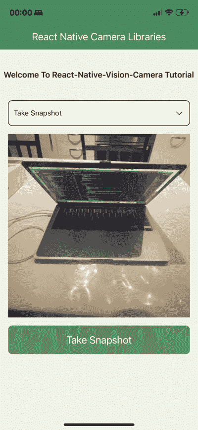

# 使用 React 本机 VisionCamera:演示和替代方案

> 原文：<https://blog.logrocket.com/react-native-visioncamera-demo-alternatives/>

在之前的一篇文章中，我写过关于[如何使用 React Native Camera](https://blog.logrocket.com/intro-to-react-native-camera/) ，不幸的是，现在已经弃用了。今天，我回来谈谈我们可以在 React Native 项目中使用的其他选项，以取代 React Native Camera。

我们将介绍 React Native VisionCamera，并评估一些其他备选方案，以帮助您选择在下一个应用中使用哪个相机库。在这篇文章中，我将通过开发一个二维码扫描仪来展示 VisionCamera 可以做什么 。我们开始吧！

*向前跳转:*

## 介绍 React 本机 VisionCamera

[VisionCamera](https://mrousavy.com/react-native-vision-camera/) 是 React Native 的全功能相机库。一些主要优势包括:

*   丰富的开发人员支持:VisionCamera 有一个庞大的开发人员社区，每个功能都有很好的文档记录和支持
*   **功能丰富** : VisionCamera 提供您想要的现代智能手机相机的所有功能，以及对正在使用的设备的完全控制——它甚至可以调整帧率等设置
*   **易于使用**:您可以轻松地开始使用带有钩子的库和具有完全控制权的函数

让我们探索几个你会发现自己经常使用的关键功能。

### 拍照

首先，我们需要启用照片捕捉来拍照:

```
<Camera {...props} photo={true} />

```

然后，就用 VisionCamera 的`[takePhoto](https://mrousavy.com/react-native-vision-camera/docs/api/classes/Camera/#takephoto)`方法:

```
const photo = await camera.current.takePhoto({
  flash: 'on'
})

```


### 拍摄快照

使用 VisionCamera 的`[takeSnapshot(...)](https://mrousavy.com/react-native-vision-camera/docs/api/classes/Camera#takesnapshot)`功能拍摄快照，如下所示:

```
const snapshot = await camera.current.takeSnapshot({
  quality: 85,
  skipMetadata: true
})

```



### 录制视频

要录制视频，您必须首先为视频录制启用视频捕获:

```
<Camera
  {...props}
  video={true}
  audio={true} *// <-- optional*
/>

```

然后我们可以通过 VisionCamera 的`[startRecording(...)](https://mrousavy.com/react-native-vision-camera/docs/api/classes/Camera#startrecording)`功能录制视频:

```
camera.current.startRecording({
  flash: 'on',
  onRecordingFinished: (video) => console.log(video),
  onRecordingError: (error) => console.error(error),
})

```

一旦我们开始记录，我们可以像这样停止它:

```
await camera.current.stopRecording()

```


## 用 VisionCamera 构建二维码扫描仪

### 设置项目

在我们开始之前，我们需要[创建一个新的 React 本地项目](https://blog.logrocket.com/create-react-native-app-using-ignite-boilerplate/)。我们可以使用以下命令来实现这一点:

```
npx react-native init react_native_image_detector
cd react_native_image_detector
yarn ios

```

太好了，现在我们可以开始安装依赖项了！首先，我们需要使用以下命令安装 React Native VisionCamera:

```
yarn add react-native-vision-camera
npx pod-install 

```

> **注意，** VisionCamera 要求 iOS ≥11 或 Android SDK ≥21。

现在，为了使用摄像头或麦克风，我们必须将 iOS 权限添加到`Info.plist`:

```
<key>NSCameraUsageDescription</key>
<string>$(PRODUCT_NAME) needs access to your Camera.</string>

<!-- optionally, if reac want to record audio: -->
<key>NSMicrophoneUsageDescription</key>
<string>$(PRODUCT_NAME) needs access to your Microphone.</string>

```

对于 Android，我们将把下面几行代码添加到我们的`AndroidManifest.xml`文件的`<manifest>`标签中:

```
<uses-permission android:name="android.permission.CAMERA" />

<!-- optionally, if you want to record audio: -->
<uses-permission android:name="android.permission.RECORD_AUDIO" />

```

我们还将使用[视觉-摄像机-代码-扫描仪插件](https://github.com/rodgomesc/vision-camera-code-scanner) 使用 ML Kit 的条形码扫描 API 扫描代码。让我们用下面的命令安装它:

```
yarn add vision-camera-code-scanner

```

要将相机二维码标记为文本，我们需要通过运行以下命令来安装[React Native realized](https://blog.logrocket.com/smooth-animations-react-native-reanimated-3/):

```
yarn add react-native-reanimated

```

最后，让我们更新我们的`babel.config.js`文件:

```
module.exports = {
  presets: ['module:metro-react-native-babel-preset'],
  plugins: [
    [
      'react-native-reanimated/plugin',
      {
        globals: ['__scanCodes'],
      },
    ],
  ],
};

```

酷，现在我们准备编码了！

### 创建 QR 扫描仪屏幕

当您使用源代码库创建 React 原生项目时，您将拥有一个带有默认 UI 组件的应用程序屏幕。因此，我将更新我们的`App.js`文件，以便使用 VisionCamera:

```
export default function App() {
  return (
    <View style={styles.screen}>
      <SafeAreaView style={styles.saveArea}>
        <View style={styles.header}>
          <Text style={styles.headerText}>React Native Camera Libraries</Text>
        </View>
      </SafeAreaView>

      <View style={styles.caption}>
        <Text style={styles.captionText}>
          Welcome To React-Native-Vision-Camera Tutorial
        </Text>
      </View>
    </View>
  );
}
```

接下来，为了录制视频或拍摄照片，我们将使用相机的物理或虚拟设备。让我们快速浏览一下两者:

*   **物理**:手机上的相机镜头。所有物理相机都有不同的特征和功能，如格式、帧速率、焦距等。此外，一些手机有多个物理摄像头
*   **虚拟**:一个或多个物理摄像设备的组合

我们可以用`useCameraDevices`挂钩拿到所有的摄像设备。让我们更新`App.js`并添加以下代码:

```
const devices = useCameraDevices();
const cameraDevice = devices.back;

```

上面，我们有一个物理设备类型列表。对于单个物理摄像机设备，该属性总是一个元素的数组；我们还可以检查这台相机是正面还是背面。

但是在我们继续之前，我们需要为麦克风和摄像机启用权限。我们可以通过以下功能请求用户授予您的应用程序使用摄像头或麦克风的权限:

```
const cameraPermission = await Camera.requestCameraPermission();
const microphonePermission = await Camera.requestMicrophonePermission();

```

权限请求状态可以是:

*   **授权**:你的 app 已经授权，有权限
*   **拒绝**:用户明确拒绝权限请求，你的应用没有权限
*   **受限(仅限 iOS)**:你的应用的摄像头或麦克风受到限制，因此你不能使用它们

让我们用请求的权限和相机设备修改我们的`App.js`文件:

```
export default function App() {
  const [cameraPermission, setCameraPermission] = useState();

  useEffect(() => {
    (async () => {
      const cameraPermissionStatus = await Camera.requestCameraPermission();
      setCameraPermission(cameraPermissionStatus);
    })();
  }, []);

  console.log(`Camera permission status: ${cameraPermission}`);

  const devices = useCameraDevices();
  const cameraDevice = devices.back;

  const renderDetectorContent = () => {
    if (cameraDevice && cameraPermission === 'authorized') {
      return (
        <Camera
          style={styles.camera}
          device={cameraDevice}
          isActive={true}
        />
      );
    }
    return <ActivityIndicator size="large" color="#1C6758" />;
  };

  return (
    <View style={styles.screen}>
      <SafeAreaView style={styles.saveArea}>
        <View style={styles.header}>
          <Text style={styles.headerText}>React Native Image Detector</Text>
        </View>
      </SafeAreaView>

      <View style={styles.caption}>
        <Text style={styles.captionText}>
          Welcome To React-Native-Vision-Camera Tutorial
        </Text>
      </View>

      {renderDetectorContent()}
    </View>
  );
}

```

在上面的代码中，我们收到了`useEffect`钩子内部的摄像头权限，得到了设备的后置摄像头。然后，我们检查`cameraDevice`是否存在，相机权限是否为`authorized`，之后 app 会显示相机组件。

### 使用帧处理器插件

如果你想用相机扫描或检测图像，你需要使用帧处理器。帧处理器是用 JavaScript 编写的简单而强大的函数，用于处理相机帧。通过使用帧处理器，我们可以:

*   构建人工智能和面部识别功能
*   使用 TensorFlow、ML Kit、Apple Vision 或其他库
*   使用 WebRTC 实现实时视频聊天
*   检测和标记图像
*   创建类似 Snapchat 的过滤器
*   使用带有深度检测的颜色过滤器

当我们需要满足特定的用例时，帧处理器插件就非常方便了。在这个 案例 中，我们将使用 视觉-摄像-扫码器 通过 ML 套件扫描二维码。我们已经在前一节 中安装了它，所以 l et 现在用它:

```
const detectorResult = useSharedValue('');

const frameProcessor = useFrameProcessor(frame => {
  'worklet';
  const imageLabels = labelImage(frame);

  console.log('Image labels:', imageLabels);
  detectorResult.value = imageLabels[0]?.label;
}, []);

```

在这里，我们扫描了二维码，并用 React Native realized[共享值](https://docs.swmansion.com/react-native-reanimated/docs/fundamentals/shared-values/)分配条形码字符串。太棒了——就是它！

这是最后一个应用程序:


你可以在 GitHub 库中查看本教程的完整代码。

## React 本机相机库备选方案

值得注意的是，VisionCamera 还有一些其他的替代产品，所以我冒昧地在下面列出了一个快速列表。与任何工具一样，您应该选择最适合您和您的用例的工具！

*   **[React Native Camera Kit](https://github.com/teslamotors/react-native-camera-kit)**:一个健壮的、高性能的、轻量级的、易于使用的相机库，在撰写本文时用于 GitHub 上的 React Native 和 1.9K stars。值得注意的是，它不支持视频，所以如果这对您的用例至关重要，您会希望找到一个替代方案
*   **[React Native 视频](https://github.com/react-native-video/react-native-video)** :编写时 GitHub 上 React Native 用 6.4K 星星的一个`<Video/>`组件。与相机套件相比，它只支持视频，所以请记住这一点
*   **[React 原生图像拾取器](https://github.com/react-native-image-picker/react-native-image-picker)** :该库允许您使用其原生 UI 从设备库或相机中选择照片/视频。在撰写本文时，它在 GitHub 上有 7.9K 颗星

## 结论

如果您的应用程序需要访问设备摄像头来拍照或录制视频，React Native Camera 是完美的选择。不幸的是，由于缺乏维护人员和增加的代码复杂性，它被弃用了，我们不得不转向其他选择。

如果相机在您的应用程序中起着重要作用，并且您需要完全控制相机，那么 React Native VisionCamera 可能是您的选择。React 原生图像拾取器可能已经成熟并流行，但它的相机功能有限。

感谢阅读。我希望这篇文章对你有用。编码快乐！

## [LogRocket](https://lp.logrocket.com/blg/react-native-signup) :即时重现 React 原生应用中的问题。

[](https://lp.logrocket.com/blg/react-native-signup)

[LogRocket](https://lp.logrocket.com/blg/react-native-signup) 是一款 React 原生监控解决方案，可帮助您即时重现问题、确定 bug 的优先级并了解 React 原生应用的性能。

LogRocket 还可以向你展示用户是如何与你的应用程序互动的，从而帮助你提高转化率和产品使用率。LogRocket 的产品分析功能揭示了用户不完成特定流程或不采用新功能的原因。

开始主动监控您的 React 原生应用— [免费试用 LogRocket】。](https://lp.logrocket.com/blg/react-native-signup)