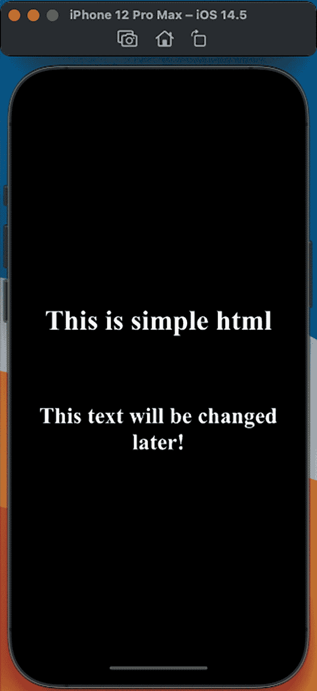
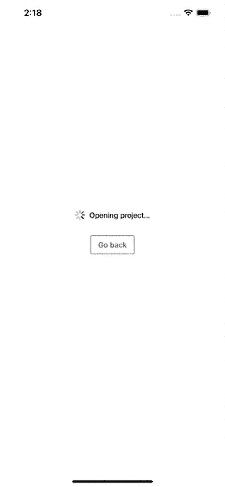

# React Native WebView:一个完整的指南

> 原文：<https://blog.logrocket.com/react-native-webview-a-complete-guide/>

WebViews 为开发人员提供了在 React 本地应用程序中呈现任何 web 组件的机会。web 组件可以是整个网页/应用程序中的任何内容，也可以只是一个简单的 HTML 文件。软件包`[react-native-webview](https://github.com/react-native-webview/react-native-webview)`使得将 WebViews 嵌入 React 本地应用程序变得非常简单！

在本帖中，我们将探讨 React Native WebView 最常见的使用案例，包括:

下面，你可以找到这个分步指南的最终结果。如您所见，我们显示随机编程语言，最后，我们被重定向到 LogRocket 博客部分！


### 先决条件

我个人在开发 React 原生应用时使用 [Expo](https://docs.expo.dev) ,所以您应该通过在您的机器上运行以下代码来安装 Expo 客户端:

```
npm install --global expo-cli
```

除了使用 Expo，我可以推荐使用 Visual Studio 代码或类似的东西。此外，JavaScript、React/React Native 和 HTML 的一些基础知识将帮助您了解本教程。

## 入门指南

所以，首先，让我们初始化我们的项目！转到您想要存储项目的目录。在这个目录中，运行`expo init my-project`来初始化 Expo 项目。您可以将“我的项目”替换为您喜欢的任何名称。

然后，用`cd my-project`切换到新创建的目录，并运行`expo start`来启动开发服务器。Expo 让你决定你想用哪种设备工作；我在上面的演示和视频中使用的设备是一台安装了 iOS 版本 14.5 的 iPhone 12 Pro Max。

但是在开始我们的应用之前，我们仍然需要安装 [React 原生 WebView 包](https://github.com/react-native-webview/react-native-webview)。为此，在项目目录中运行以下命令:

```
expo install react-native-webview

```

这个包可以在 Android 和 iOS 设备上运行。

以下是终端命令的简要概述:

```
# cd into the directory where to store your project
 $ cd dir

# initialize the expo project
$ expo init my-project

# navigate inside the newly created project
$ cd my-project

# install the webview package
$ expo install react-native-webview

# run the development server
$ expo start

```

## 创建基本的 URL 结构

为了简单起见，我们将把我们的代码添加到`App.js`文件中，我们不会创建任何额外的文件。

将 WebView 嵌入 React 本机应用程序的最简单方法是提供一个 URL 作为 WebView 组件的源:

```
# App.js
import React, { Component } from 'react';
import { SafeAreaView } from "react-native";
import { WebView } from 'react-native-webview';

class MyWeb extends Component {
  render() {
    return (
      <SafeAreaView style={{ flex: 1 }}>
        <WebView 
          source={{ uri: 'https://reactnative.dev/' }} 
        />
      </SafeAreaView>
    );
  }
}

```

为了使用 WebView 组件，您必须导入它，正如我们在第 4 行中所做的那样。之后你需要做的就是设置`source`道具！

请注意，`source`以一个对象作为值。在这种情况下，我们提供一个`URI`:

```
source={{ uri: 'https://reactnative.dev/' }} 

```

这段代码将产生类似这样的结果:


## 编写基本的内联 HTML

为 WebView 提供源代码的另一种常见方式是编写一些内嵌的 HTML 代码。让我们从一个非常简单的例子开始:

```
# App.js

class MyWeb extends Component {
  render() {
    const customHTML = `
      <body style="display:flex; flex-direction: column;justify-content: center; 
        align-items:center; background-color: black; color:white; height: 100%;">
          <h1 style="font-size:100px; padding: 50px; text-align: center;" 
          id="h1_element">
            This is simple html
          </h1>
          <h2 style="display: block; font-size:80px; padding: 50px; 
          text-align: center;" id="h2_element">
            This text will be changed later!
          </h2>
       </body>`;

    return (
      <SafeAreaView style={{ flex: 1 }}>
        <WebView 
          source={{ html: customHTML }} 
        />
      </SafeAreaView>
    );
  }
}

```

这将是结果:



这段代码与之前的代码最根本的区别在于，现在我们使用内联 HTML 作为 WebView 组件的源:`source={{ html: customHTML }}`。

从第 6–16 行，我们定义了常数`customHTML`。最终，这只是一个包含一个`h1`和一个`h2`标签的字符串，包裹在一个`body`标签中。

此外，我们定义了一些基本的内联样式，以便使元素居中并提供一些背景颜色。

这就是你如何轻松地呈现你的定制 HTML 代码。但是，如果您想要包含一些需要包含 JavaScript 的功能，比如动态特性，该怎么办呢？好吧，React Native WebView 也为这个问题提供了解决方案！

## JavaScript 和 Native 之间的通信

让我们从一些代码开始:

```
# App.js

class MyWeb extends Component {
  render() {
  const runFirst = `
      setTimeout(function() { 
          window.alert("Click me!");
          document.getElementById("h1_element").innerHTML = 
          "What is your favourite language?";
          document.getElementById("h2_element").innerHTML =
          "We will see!";
        }, 1000);
      true; // note: this is required, or you'll sometimes get silent failures
    `;

  const runBeforeFirst = `
      window.isNativeApp = true;
      true; // note: this is required, or you'll sometimes get silent failures
  `;

    return (
      <SafeAreaView style={{ flex: 1 }}>
        <WebView 
          source={{ html: customHTML }} 
          onMessage={(event) => {}}
          injectedJavaScript={runFirst}
          injectedJavaScriptBeforeContentLoaded={runBeforeFirst}
        />
      </SafeAreaView>
    );
  }
}

```

如果您看一下第 25–27 行中的 WebView 组件，您会注意到引入了三个新的道具:`onMessage`、`injectedJavaScript`和`injectedJavaScriptBeforeContentLoaded`。

提供给`injectedJavaScript` prop 的 JavaScript 代码只会在资源第一次加载后执行一次。即使刷新站点，代码也不会被再次执行！

我们的脚本叫做`runFirst`，可以在第 5–14 行找到。在这个脚本中，我们首先触发一条消息来呈现，然后，我们更改了我们的`h1`和`h2`元素的文本。所有这些都封装在一个`setTimeout`函数中，以便在`1s`之后运行这个脚本。

另一方面，`injectedJavaScriptBeforeContentLoaded` prop 中提供的脚本会在页面第一次加载之前执行。相应的脚本`runBeforeFirst`，可以在第 16–19 行找到。在这种情况下，这个脚本对我们的应用程序的视觉效果没有影响。

`onMessage`道具是必需的，即使这个道具内的函数目前是空的。没有这个属性，脚本将无法运行！



### 快速警告

`injectedJavaScript`和`injectedJavaScriptBeforeContentLoaded`道具的缺点是它们都只运行一次。然而，如您所知，有些情况下您希望不止一次地执行 JavaScript 代码。这就是我们在下一节要看的内容！

## `injectJavaScript`法

在这一节中，我们将实现这个演示应用程序的最终功能:随机显示编程语言，最后重定向到 LogRocket 博客的相应部分。

```
# App.js
const selectProgrammingLanguage = () => {
  const languages = [
    "Rust",
    "Python",
    "JavaScript",
    "TypeScript",
    "C++",
    "Go",
    "R",
    "Java",
    "PHP",
    "Kotlin",
  ];
  const randomInt = Math.floor(Math.random() * languages.length);
  return languages[randomInt];
};

class MyWeb extends Component {
  render() {
  let counter = 1;

  const script = () => {
      const selectedLanguage = selectProgrammingLanguage();
      counter += 1;
      const newURL = "https://blog.logrocket.com";
      const redirectTo = 'window.location = "' + newURL + '"';

      if (counter <= 10) {
        return `
          if (document.body.style.backgroundColor === 'white') {
            document.body.style.backgroundColor = 'black'
            document.body.style.color = 'white'
          } else {
            document.body.style.backgroundColor = 'white'
            document.body.style.color = 'black'
          };

          document.getElementById("h2_element").innerHTML = "${selectedLanguage}?";
          window.ReactNativeWebView.postMessage("counter: ${counter}");
          true;  // note: this is required, or you'll sometimes get silent failures
      `;
      } else if (counter === 11) {
        return `
          window.ReactNativeWebView.postMessage("you are now getting redirected!");
          ${redirectTo};
          true;  // note: this is required, or you'll sometimes get silent failures
        `;
      } else {
        return null;
      }
    };

    setInterval(() => {
        this.webref.injectJavaScript(script());
      }, 2000);

    return (
      <SafeAreaView style={{ flex: 1 }}>
        <WebView 
          source={{ html: customHTML }} 
          ref={(r) => (this.webref = r)}
          onMessage={(event) => {
          console.log(event.nativeEvent.data);
          }}
          injectedJavaScript={runFirst}
          injectedJavaScriptBeforeContentLoaded={runBeforeFirst}
        />
      </SafeAreaView>
    );
  }
}

```

在第 2–17 行，我们首先定义一个函数，它从第 3 行的`languages`数组中随机返回一种编程语言。然后在第 23 行定义的`script`函数中再次调用相同的函数。每次调用`script`函数时，都会创建一个随机编程语言，并包含在 HTML 代码的第 39 行:

```
document.getElementById("h2_element").innerHTML = "${selectedLanguage}?";

```

此外，每次背景从黑色变为白色(或者相反)，我们也需要字体颜色发生变化——但是这只会发生在这个函数被调用的前十次。

在第十次执行之后，脚本跳转到第 44–48 行。在那里，我们定义了我们希望被重定向到第 26 和 27 行中定义的 URL。

最后，您可能会问自己在哪里调用了`script`函数。如果你看一下第 54-56 行，你会注意到每两秒钟，这段代码就会被执行一次:

```
this.webref.injectJavaScript(script());

```

这就是你可以多次执行 JavaScript 的方法！

但是我们还没有完成。也许您注意到了第 63–65 行的`WebView`组件中的`onMessage`属性也发生了变化。您可以看到我们正在记录某种信息。

到目前为止，我们只将信息从我们的应用程序发送到网页。但是如果我们想从网页的接收信息*呢？这就是`onMessage`道具的用武之地。*

我们已经用`(event.nativeEvent.data)`记录了这种数据。该数据来自第 49 行:

```
window.ReactNativeWebView.postMessage("counter: ${counter}");

```

第 45 行:

```
window.ReactNativeWebView.postMessage("you are now getting redirected!");

```

这是我们演示应用的最终结果:


## 结论

在这篇文章中，我们回顾了如何将 WebViews 嵌入到 React 本地应用程序中。您可以为 WebView 组件提供 URL，也可以添加一些自定义的内嵌 HTML。此外，我们还讨论了如何将 JavaScript 代码注入到 WebView 组件中。

请随意使用这段代码作为进一步开发的基础。这个项目的[源代码可以在我的 GitHub 个人资料上找到！](https://github.com/kevintomas1995/rn_webview)

## [LogRocket](https://lp.logrocket.com/blg/react-native-signup) :即时重现 React 原生应用中的问题。

[](https://lp.logrocket.com/blg/react-native-signup)

[LogRocket](https://lp.logrocket.com/blg/react-native-signup) 是一款 React 原生监控解决方案，可帮助您即时重现问题、确定 bug 的优先级并了解 React 原生应用的性能。

LogRocket 还可以向你展示用户是如何与你的应用程序互动的，从而帮助你提高转化率和产品使用率。LogRocket 的产品分析功能揭示了用户不完成特定流程或不采用新功能的原因。

开始主动监控您的 React 原生应用— [免费试用 LogRocket】。](https://lp.logrocket.com/blg/react-native-signup)