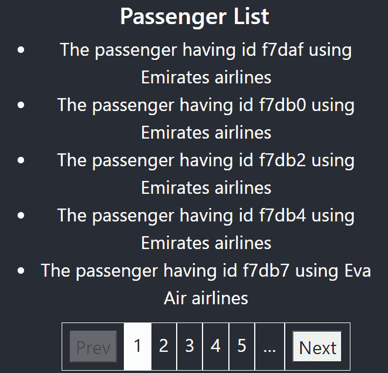

# 使用 Hooks 从头开始反应分页

> 原文：<https://blog.logrocket.com/react-pagination-scratch-hooks/>

以列表或表格形式显示大量数据的应用程序可以实现分页，将数据分成一系列页面。分页不是从服务器 API 获取大量数据，而是按需加载数据，减少了加载时间并改进了整体 UI。

虽然有许多库可用于实现分页，但有些有点笨重，会损害应用程序的整体性能。在本文中，我们将使用 React 钩子创建一个可重用的分页组件。

例如，我们将使用分页显示下图中的乘客列表。完整的代码可以在 [react-pagination](https://github.com/gsampath127/react-pagination) GitHub 库获得；请随意叉:


### 目录

在开始实现之前，让我介绍一下我们将在本文中使用的两个 React 挂钩。如果你已经熟悉 React 钩子，请随意[跳到教程。](#setting-up-project)

## `useState`挂钩

如果你想给你的功能组件添加状态，那么`useState`钩子会完成这项工作。考虑下面的例子:

```
// a new state variable called "currentPage"  
const [currentPage, setCurrentPage] = useState(1);

```

`useState`钩子有助于保存函数调用之间的值。它只有一个参数，这是初始状态。在上面的例子中，变量`currentPage`默认设置为`1`。`useState`钩子将返回一对值，第一个是变量的状态，第二个是设置状态的函数。

我们将使用`useState`钩子来维护当前页面的状态、最小和最大页面限制，以及保存来自乘客 API 的响应数据。

## `useEffect`挂钩

如果您想执行任何副作用，比如数据获取、DOM 操作，或者订阅和取消订阅事件，`useEffect`钩子将帮助您:

```
useEffect(()=>{
  // call rest api
},[]);

```

React 可以访问组件的状态，所以它会记住您传递的函数，并在 DOM 更新后调用它。我们使用`useEffect`钩子从 REST API 中获取乘客数据。

## 设置项目

我们的目标是用分页显示乘客列表，所以我们将使用免费的 REST API 来[提供乘客数据列表](https://www.instantwebtools.net/fake-rest-api)。首先使用下面的 Create React App 命令创建一个新的 React 应用程序:

```
npx create-react-app pagination-tutorial

```

从`App.js`文件中删除所有默认内容。稍后我们将在这里包括我们的组件。最终文件应该类似于下面的代码:

```
import './App.css';
function App() {
  return (
    <div className="App">
       <div className="App-header">
           // include the Passenger componnet, which we create by end of the article
        </div>
    </div>
  );
}
export default App;

```

现在，我们可以用下面的命令运行应用程序:

```
yarn start

```

功能组件允许您将 UI 分成独立的、可重用的部分。我们将使用一个函数组件，该组件有一个支持该组件的参数。在创建分页组件之前，让我们澄清一下本文其余部分中使用的几个术语。

*   当前页:表示用户在页导航上的位置
*   最大页数限制:表示页导航的上限
*   最小页面限制:表示页面上的下限

跳转到`src`文件夹，创建一个名为`Pagination.js`的新文件:

```
import React from 'react';
const Pagination = (props)=>{
    return(
        <div>
        </div>
    )
}
export default Pagination;

```

因为我们正在为分页创建一个可重用的组件，所以假设该组件使用 props 从父组件获取所有输入。我们的目标是构建如下截图所示的输出:



初始化我们在上一节讨论的术语:

```
// init
  const { currentPage, maxPageLimit, minPageLimit} = props;
  const totalPages = props.response.totalPages-1;
  const data = props.response.data;

```

现在，为了输入总页数，我们将从`1`开始建立页码。该限制将基于最大和最小页面限制:


构建 pages 数组，它将保存从`1`到总页数的所有数字:

```
 // build page numbers list based on total number of pages
    const pages = [];
    for(let i=1 ; i<=totalPages; i++){
        pages.push(i);
    }

```

要为最大和最小页面限制范围内的所有页码创建 UI，请遍历通过上述步骤构建的 pages 数组。如果迭代页面与当前页面匹配，将其激活:

```
const pageNumbers = pages.map(page => {
        if(page <= maxPageLimit  && page > minPageLimit) {
            return(
        <li key={page} id={page} onClick={handlePageClick} 
            className={currentPage===page ? 'active' : null}>
            {page}
        </li>
            );
        }else{
            return null;
        }
    }

 );

```

接下来，我们将创建省略号`…`，当左侧或右侧的页面多于当前页面时，就会出现省略号。单击省略号，用户可以移动到上一组或下一组页面。您可以在下图中看到这些，以绿色突出显示:


```
  // page ellipses
    let pageIncrementEllipses = null;
    if(pages.length > maxPageLimit){
        pageIncrementEllipses = <li onClick={handleNextClick}>&hellip;</li>
    }
    let pageDecremenEllipses = null;
    if(minPageLimit >=1){
        pageDecremenEllipses = <li onClick={handlePrevClick}>&hellip;</li> 
    }
const renderData = (data)=>{

```

让我们以列表格式呈现我们的乘客。在下面的代码中，我显示了乘客的 ID 和每位乘客使用的航空公司名称:

```
    return(
        <ul>
            {data.map((d)=> 
            <li key={d['_id']}> The passenger having id {d['_id'].slice(d['_id'].length-5)} using {d.airline[0].name} airlines</li>)
            }
        </ul>
    )
}

```

接下来，我们将组合所有的 UI 元素，并将它们与 Prev 和 Next 按钮一起返回到功能组件中。

点击**上一页**，用户导航至上一页。点击**下一个**，用户导航到下一页。UI 元素的对齐方式如下:

```
1\. Passenger’s data
2\. Pager
    1\. Prev button
    2\. Page decrement ellipses
    3\. Page numbers with current page selection
    4\. Page increment ellipses
    5\. Next button

 return (
        <div className="main">
            <div className="mainData">
              {renderData(data)}
            </div>
            <ul className="pageNumbers"> 
               <li>
                   <button onClick={handlePrevClick} disabled={currentPage === pages[0]}>Prev</button>
               </li>
               {pageDecremenEllipses}
                {pageNumbers}
               {pageIncrementEllipses}
                <li>
                   <button onClick={handleNextClick} disabled={currentPage === pages[pages.length-1]}&gt;Next</button>
               </li>
            </ul>
        </div>
    )

```

到目前为止，我们已经创建了 UI，它包括页面点击、上一次点击和下一次点击等事件。现在，让我们绑定所有事件:

```
 const handlePrevClick = ()=>{
        props.onPrevClick();
    }
    const handleNextClick = ()=>{
        props.onNextClick();
    }
    const handlePageClick = (e)=>{
        props.onPageChange(Number(e.target.id));
    }

```

现在，我们将导航到父组件，在我们的例子中是`Passengers`组件，负责获取乘客数据和设置分页属性。在这个组件中使用上面创建的`Pagination`组件。

要创建`Passengers`组件，首先初始化状态。可以参考下面的状态变量。简单地说，我们将在分页组件的开头显示从`1`到`5`的页码。我们分别用`0`和`5`初始化最小和最大页面限制。

我们将当前页面设置为`1`，这意味着用户将在第一页。通过将乘客数据设置为空数组，我们决定在接下来的步骤中获取数据。页码限制`5`告诉我们在 UI 上只显示五个页码:

```
  const pageNumberLimit = 5;
  const [passengersData, setData] = useState([]);
  const [loading, setLoading] = useState(true);
  const [currentPage, setCurrentPage] = useState(1);
  const [maxPageLimit, setMaxPageLimit] = useState(5);
  const [minPageLimit, setMinPageLimit] = useState(0);

```

当当前页面发生变化时，我们将使用`useEffect`钩子从我们的 API 中获取乘客数据，并将其保存在`passengersData`状态变量中:

```
 useEffect(()=>{
    setLoading(true);
    fetch(`https://api.instantwebtools.net/v1/passenger?currentPage=${currentPage}&size=5`)
    .then((response) => response.json())
    .then((json) => { setData(json); setLoading(false);});

  },[currentPage]);

```

这个完整分页的核心步骤是更新最大、最小和当前页面，它们在页面更改、上一次单击和下一次单击时更新。

### 上一次点击

假设您位于分页组件的第六页。如果您点击**上一页**按钮，您将被引导至第五页，并且页数限制应被重置为`1`和`5`。

为了实现上面的示例，我们将只在前一页不在当前页面范围内时更新最大和最小页面限制。前一页除以页码后得到的余数应该为零。


例如，考虑最大页数限制应该等于当前最大页数限制减去页数限制。在上图的例子中，10 减 5 等于 5。


对于最小页数限制，我们从当前最小限制中减去页数限制。在我们的例子中，我们计算出六减五等于一。请记住，当前页面是上一页减去`1`。

### 下一次点击

我们将把下一次点击作为上一个例子的切换来研究。假设你现在在第五页。点击**下一个**，应该会导航到第六页。页面限制应在`6`和`10`之间。

像前面的点击一样，我们只能通过更新最大和最小页面限制来实现上面的场景。最大和最小页数限制仅在下一页大于当前最大页数限制时更新:


为了计算最大页数限制，我们将当前最大页数限制加到页数限制上。在我们的例子中，我们将五加五等于十。


最小页数限制是当前最小限制加上页数限制。在我们的例子中，一加五等于六。当前页是上一页加一。

### 页更改

单击任意页码，将当前页面更新到特定的页码。以下是所有主要事件的代码片段:

```
const onPageChange= (pageNumber)=>{
    setCurrentPage(pageNumber);
  }
  const onPrevClick = ()=>{
      if((currentPage-1) % pageNumberLimit === 0){
          setMaxPageLimit(maxPageLimit - pageNumberLimit);
          setMinPageLimit(minPageLimit - pageNumberLimit);
      }
      setCurrentPage(prev=> prev-1);
   }

  const onNextClick = ()=>{
       if(currentPage+1 > maxPageLimit){
           setMaxPageLimit(maxPageLimit + pageNumberLimit);
           setMinPageLimit(minPageLimit + pageNumberLimit);
       }
       setCurrentPage(prev=>prev+1);
    }

```

为了用分页为乘客创建 UI，我们将组合所有需要的属性，并将它们作为道具发送给分页组件:

```
const paginationAttributes = {
    currentPage,
    maxPageLimit,
    minPageLimit,
    response: passengersData,
  };
  return(
    <div>
        <h2>Passenger List</h2>
        {!loading ? <Pagination {...paginationAttributes} 
                          onPrevClick={onPrevClick} 
                          onNextClick={onNextClick}
                          onPageChange={onPageChange}/>
        : <div> Loading... </div>
        }
    </div>
)

```

现在，我们已经构建了父组件和子组件。您就可以在应用程序的任何地方使用父组件了。

## 包扎

在本教程中，我们通过将当前页面、最大页面限制、最小页面限制和其他页面事件作为道具发送给组件，创建了一个分页组件。我们使用 React 钩子进行状态管理和获取数据。

虽然我们在 React 中开发了示例应用程序，但是您可以将相同的逻辑应用于任何框架。我希望你学到了新的东西！如果你有任何问题，一定要留下评论。编码快乐！

## [LogRocket](https://lp.logrocket.com/blg/react-signup-general) :全面了解您的生产 React 应用

调试 React 应用程序可能很困难，尤其是当用户遇到难以重现的问题时。如果您对监视和跟踪 Redux 状态、自动显示 JavaScript 错误以及跟踪缓慢的网络请求和组件加载时间感兴趣，

[try LogRocket](https://lp.logrocket.com/blg/react-signup-general)

.

[ ](https://lp.logrocket.com/blg/react-signup-general) [](https://lp.logrocket.com/blg/react-signup-general) 

LogRocket 结合了会话回放、产品分析和错误跟踪，使软件团队能够创建理想的 web 和移动产品体验。这对你来说意味着什么？

LogRocket 不是猜测错误发生的原因，也不是要求用户提供截图和日志转储，而是让您回放问题，就像它们发生在您自己的浏览器中一样，以快速了解哪里出错了。

不再有嘈杂的警报。智能错误跟踪允许您对问题进行分类，然后从中学习。获得有影响的用户问题的通知，而不是误报。警报越少，有用的信号越多。

LogRocket Redux 中间件包为您的用户会话增加了一层额外的可见性。LogRocket 记录 Redux 存储中的所有操作和状态。

现代化您调试 React 应用的方式— [开始免费监控](https://lp.logrocket.com/blg/react-signup-general)。