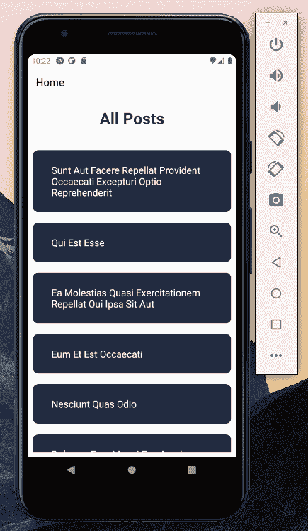
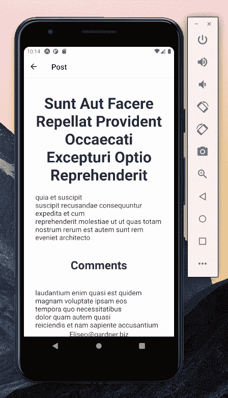

# 在 React Native - LogRocket 博客中使用 React Query 进行状态管理

> 原文：<https://blog.logrocket.com/react-query-state-management-react-native/>

## 介绍

状态管理是 React Native 开发不可或缺的一部分。

状态是一个 JavaScript 对象，用于处理组件中可变的 React 本机数据。在 React 本地组件中，状态可能会随着时间而变化，这主要是用户事件的结果。

React Native 中简单的本地状态可以用`setState`方法或`useState`钩子来管理。

然而，随着我们的应用程序越来越大，您可能需要一个状态管理库，因为管理跨组件共享的状态变得越来越困难。

### React Native 的数据提取库

因此，状态管理是您在开发 React 应用程序时可能遇到的常见问题之一。这可能是一个很难掌握的方面，因为 React 中有大量的状态管理库。

下面是一些受欢迎的:

#### 语境

在 React 中，数据流是单向的，从上到下——从父组件到子组件。[上下文 API](https://reactjs.org/docs/context.html) 提供了一种通过组件树传递数据的方式，而不需要适当的钻取。

#### Redux

Redux 是一个框架无关的状态管理层。它非常强大，非常适合大型应用程序。可以和 React，React Native，Vue 等一起使用 Redux。

Redux 提供了一个名为 store 的全局状态对象，它使用了几个概念，如 actions、action creators 和 reducers。在大多数情况下，您会将 Redux 与诸如 Redux Thunk 或 Redux-Saga 之类的中间件一起使用，这引入了更多的复杂性，因为您需要学习更多的东西。然而，Redux 非常适合客户端状态管理。

你可以在这里获得使用 Redux 和 React Native 的[全面指南。](https://blog.logrocket.com/comprehensive-guide-to-using-redux-in-react-native/)

#### 反应查询

本文重点关注 React Native 中使用 [React Query](https://react-query.tanstack.com) 的状态管理，这种技术将自己描述为 React 缺少的数据获取库。

让我们在下一节学习更多关于 React Query 的知识。

## 什么是 React 查询 3？

React Query 是我们应用程序中的一个轻量级缓存层。作为一个数据获取库，我们如何获取数据是不可知的。React Query 唯一需要知道的是 Axios 或 Fetch 返回的承诺。

React 查询的两个主要概念是[查询](https://react-query.tanstack.com/guides/queries)和[突变](https://react-query.tanstack.com/guides/mutations)。查询处理获取数据，而变异处理修改服务器上的数据。

React Query 导出一个用于处理查询的`useQuery`钩子。`useQuery`钩子有两个参数。第一个参数是一个惟一的标识符，用来描述我们正在获取的内容。第二个标识符是 fetcher 函数——一个异步函数，负责获取数据或抛出错误。

考虑下面的代码:

```
import { useQuery } from 'react-query';
import axios from 'axios';

const fetchPosts = async () => {
    const { data } = await axios.get('https://jsonplaceholder.typicode.com/posts');
    return data;
};

const usePosts = () => useQuery('posts', fetchPosts);

```

`useQuery`钩子返回一个查询对象，并处理我们获取的所有生命周期，所以我们不需要使用`useEffect`。

查询对象由 [React Query 的文档](https://react-query.tanstack.com/guides/queries)中提到的一些重要状态组成:

*   `isLoading`或`status === 'loading'` —查询没有数据，当前正在获取
*   `isError`或`status === 'error'` —查询遇到错误
*   `isSuccess`或`status === 'success'` —查询成功，数据可用
*   `isIdle`或`status === 'idle'` —该查询当前被禁用(稍后您将了解更多相关信息)

查询只能处于这些状态之一。除了这些主要状态，它还包含更多信息，例如:

*   `error` —如果查询处于`isError`状态，则错误可通过`error`属性获得
*   `data` —如果查询处于`success`状态，则可以通过`data`属性获得数据
*   `isFetching` —在任何状态下，如果查询在任何时候被抓取(包括后台重抓取)，`isFetching`将为`true`

如果没有 React Query，这些状态中的每一个都可能使用不同的`useState`钩子来处理。因此，我们可以看到 React 查询帮助我们减少了样板文件。这是开发者体验上的一个收获——`DX`收获。

此外，React Query 有助于开箱即用的缓存。这对我们的最终用户有着直接的影响，因为它让我们的应用程序感觉更快，响应更快。

在本文中，我们将了解如何使用 React Query 管理 React 本机状态。让我们从下一节的先决条件开始。

## 先决条件

*   JavaScript 的基础知识
*   React 和 React Native 的基本知识

## React Query 和 React Native 入门

首先，我们使用 [Expo CLI](https://docs.expo.dev/get-started/create-a-new-app/) 创建一个新的 React 本地应用程序，如下所示:

```
npm i --global expo-cli

// bootstrap a new project
expo init <-- your app name -->

```

将提示您一个模板列表:


选择第一个并通过运行以下命令进入您的应用程序目录:

```
cd <-- your app name -->

```

接下来，安装依赖项:

```
// install dependencies
npm i @react-navigation/native @react-navigation/stack axios 
react-native-gesture-handler react-native-safe-area-context react-native-screens 
react-query

```

启动开发服务器:

```
npm start 

```

在下一节中，我们将通过使用来自 [JSON 占位符](https://jsonplaceholder.typicode.com)的数据构建一个简单的应用程序来深入研究 React Query。

## 使用 React 查询进行复杂状态管理

### 设置样式

我们将从创建一个包含一个`color.js`文件的`constants`文件夹开始。将以下代码添加到`color.js`文件中:

```
export default {
    primary: '#202c41',
    border: '#c6c6c6',
    white: '#fff',
    gray: '#9ca5ab'
};

```

这是用于我们的应用程序的风格。

### 设置导航

接下来，我们设置导航。创建一个包含`Main.js`文件的导航文件夹。
将以下代码添加到`Main.js`文件中:

```
import React from 'react';
import { createStackNavigator } from '@react-navigation/stack';
import { Posts } from '../screens/Posts';
import { Post } from '../screens/Post';
const MainStack = createStackNavigator();
export const Main = () => (
    <MainStack.Navigator>
        <MainStack.Screen name="Home" component={Posts} />
        <MainStack.Screen name="Post" component={Post} />
    </MainStack.Navigator>
);

```

在上面的代码中，我们为两个屏幕设置了导航，即`Home`和`Post`。
我们稍后将创建`Posts`和`Post`组件。

### 添加反应查询

现在我们必须设置 React 查询。修改我们的`App.js`文件，如下所示:

```
import React from 'react';
import { StatusBar } from 'expo-status-bar';
import { NavigationContainer } from '@react-navigation/native';
import { QueryClient, QueryClientProvider } from 'react-query';
import { Main } from './navigation/Main';

const queryClient = new QueryClient();

export default function App() {
    return (
        <React.Fragment>
            <StatusBar style="auto" />
            <NavigationContainer>
                <QueryClientProvider client={queryClient}>
                    <Main />
                </QueryClientProvider>
            </NavigationContainer>
        </React.Fragment>
    );
}

```

在上面的代码中，React Query 使用`QueryClient`与缓存进行交互。而`QueryClientProvider`组件用于连接并向我们的应用程序提供`QueryClient`。

### 创建应用程序的屏幕

接下来，让我们为屏幕创建可重用的组件。创建一个`components`文件夹，里面有一个`Text.js`文件。将下面的代码添加到`Text.js`中:

```
import React from 'react';
import { StyleSheet, Text as RNText } from 'react-native';
import colors from '../constants/colors';
const styles = StyleSheet.create({
    defaultText: {
        color: colors.primary,
        fontSize: 18
    }
});
export const Text = ({ children, style = {} }) => {
    const textStyles = [ styles.defaultText ];
    textStyles.push(style);
    return <RNText style={textStyles}>{children}</RNText>;
};

```

上面，我们有一个默认样式的可重用的`Text`组件。我们将在整个应用程序中使用它来设计我们的文本。

* * *

### 更多来自 LogRocket 的精彩文章:

* * *

在我们创建屏幕——`Post.js`和`Posts.js`文件之前，我们需要设置钩子来获取这些屏幕呈现的数据。

`Posts.js`文件呈现从 JSON 占位符获得的所有帖子，当`Post.js`文件处理每个帖子的细节时，它充当主屏幕。

创建两个文件夹，分别是`screens`和`hooks`。在`hooks`文件夹中，创建一个`usePosts.js`文件，并添加以下代码:

```
import { useQuery } from 'react-query';
import axios from 'axios';

const fetchPosts = async () => {
    const { data } = await axios.get('https://jsonplaceholder.typicode.com/posts');
    return data;
};

const usePosts = () => useQuery('posts', fetchPosts);
export default usePosts;

```

另外，创建一个`usePost.js`文件和以下代码:

```
import { useQuery } from 'react-query';
import axios from 'axios';

const fetchPost = async (postId) => {
    const { data } = await axios.get(`https://jsonplaceholder.typicode.com/comments?postId=${postId}`);
    return data;
};

const usePost = (postId) => useQuery([ 'posts', postId ], () => fetchPost(postId));
export default usePost;

```

在上面的代码示例中，`useQuery`将名为`posts`的唯一标识符作为其第一个参数，将一个 fetcher 函数作为其第二个参数。我们现在可以导入`usePosts`和`usePost`在我们的`screens`中使用。

在`screens`文件夹中，创建两个文件，分别是`Posts.js`和`Post.js`。将以下代码添加到`Posts.js`文件中:

```
import React from 'react';
import { View, StyleSheet, FlatList, TouchableOpacity } from 'react-native';
import usePosts from '../hooks/usePosts';
import { Text } from '../components/Text';
import colors from '../constants/colors';

export const Posts = ({ navigation }) => {
    const { data, isLoading, isSuccess } = usePosts();
    return (
        <View style={styles.container}>
            {isLoading && (
                <React.Fragment>
                    <Text>Loading...</Text>
                </React.Fragment>
            )}

            {isSuccess && (
                <React.Fragment>
                    <Text style={styles.header}>all posts</Text>
                    <FlatList
                        data={data}
                        style={styles.wrapper}
                        keyExtractor={(item) => `${item.id}`}
                        renderItem={({ item }) => (
                            <TouchableOpacity
                                onPress={() => 
                                  navigation.push('Post', { post: item })}
                                style={styles.post}
                            >
                                <View style={styles.item}>
                                    <Text style={styles.postTitle}>
                                      {item.title}
                                    </Text>
                                </View>
                            </TouchableOpacity>
                        )}
                    />
                </React.Fragment>
            )}
        </View>
    );
};

const styles = StyleSheet.create({
    container: {
        flex: 1,
        backgroundColor: colors.white,
        padding: 10
    },
    wrapper: {
        flex: 1,
        paddingVertical: 30
    },
    item: {
        paddingVertical: 10,
        paddingHorizontal: 20
    },
    header: {
        textAlign: 'center',
        textTransform: 'capitalize',
        fontWeight: 'bold',
        fontSize: 30,
        color: colors.primary,
        paddingVertical: 10
    },
    post: {
        backgroundColor: colors.primary,
        padding: 15,
        borderRadius: 10,
        marginBottom: 20
    },
    postTitle: { color: colors.white, textTransform: 'capitalize' }
});

```

在上面的代码中，如果`isLoading`为真，我们将呈现一个`loading…`文本。如果`isSuccess`为真，我们使用`[FlatList](https://blog.logrocket.com/deep-dive-react-native-flatlist/)`渲染我们的帖子列表。

现在我们有:



接下来，在`Post.js`文件中，添加以下代码:

```
import React from 'react';
import { View, StyleSheet, ScrollView } from 'react-native';
import usePost from '../hooks/usePost';
import { Text } from '../components/Text';
import colors from '../constants/colors';

export const Post = ({ route }) => {
    const { post } = route && route.params;
    const { data: comments, isSuccess, isLoading } = usePost(post.id);
    return (
        <ScrollView style={styles.container}>
            <Text style={styles.header}>{post.title}</Text>
            <View style={styles.post}>
                <Text>{post.body}</Text>
            </View>
            {isLoading && <Text style={{ textAlign: 'center' }}>Loading...</Text>}

            {isSuccess && (
                <React.Fragment>
                    <Text style={styles.commentHeader}>Comments</Text>
                    {comments.map((comment) => (
                        <View key={comment.id} style={styles.post}>
                            <Text>{comment.body}</Text>
                            <Text>{comment.email}</Text>
                        </View>
                    ))}
                </React.Fragment>
            )}
        </ScrollView>
    );
};
const styles = StyleSheet.create({
    container: {
        flex: 1,
        backgroundColor: colors.white,
        padding: 30
    },
    header: {
        textAlign: 'center',
        textTransform: 'capitalize',
        fontWeight: 'bold',
        fontSize: 40,
        color: colors.primary,
        paddingVertical: 10
    },
    commentHeader: {
        textAlign: 'center',
        textTransform: 'capitalize',
        fontWeight: 'bold',
        fontSize: 30,
        color: colors.primary,
        paddingVertical: 30
    },
    post: {
        flex: 1,
        paddingVertical: 10,
        alignItems: 'center'
    }
});

```

在上面的代码中，我们将用户点击的帖子作为[路由参数](https://reactnavigation.org/docs/params/)接收，并使用其`ID`获取评论。以下是开机自检屏幕的示例:



此外，在第一次加载时，你会看到文章和评论的加载，但之后当你来回导航时，你不会再看到它们。这是因为 React Query 在幕后缓存了我们的数据，使得后续的加载时间变得“即时”

## 结论

React Query 是一个经过深思熟虑的数据获取库，具有许多有趣的特性。正如我们所看到的，它在`DX`和`UX`方面提供了增益，也提升了我们的应用性能。

我真的希望在看完这篇文章后，你已经学到了足够的知识，可以在你的下一个项目中尝试一下。

最后，你可以在 GitHub 上获得完整的应用程序。

## [LogRocket](https://lp.logrocket.com/blg/react-native-signup) :即时重现 React 原生应用中的问题。

[](https://lp.logrocket.com/blg/react-native-signup)

[LogRocket](https://lp.logrocket.com/blg/react-native-signup) 是一款 React 原生监控解决方案，可帮助您即时重现问题、确定 bug 的优先级并了解 React 原生应用的性能。

LogRocket 还可以向你展示用户是如何与你的应用程序互动的，从而帮助你提高转化率和产品使用率。LogRocket 的产品分析功能揭示了用户不完成特定流程或不采用新功能的原因。

开始主动监控您的 React 原生应用— [免费试用 LogRocket】。](https://lp.logrocket.com/blg/react-native-signup)