# React 参考指南:Hooks API 

> 原文：<https://blog.logrocket.com/react-reference-guide-hooks-api/>

React 钩子是在 16.8 版本中加入 React 的。通过从类到功能组件的转换，钩子允许你在功能组件中使用状态和其他特性，也就是说，不需要编写类组件。

#### *向前跳转:*

* * *

# 基本挂钩

本参考指南将讨论 React 中所有本机可用的钩子，但是首先，让我们从基本的 React 钩子开始:`useState`、`useEffect`和`useContext`。

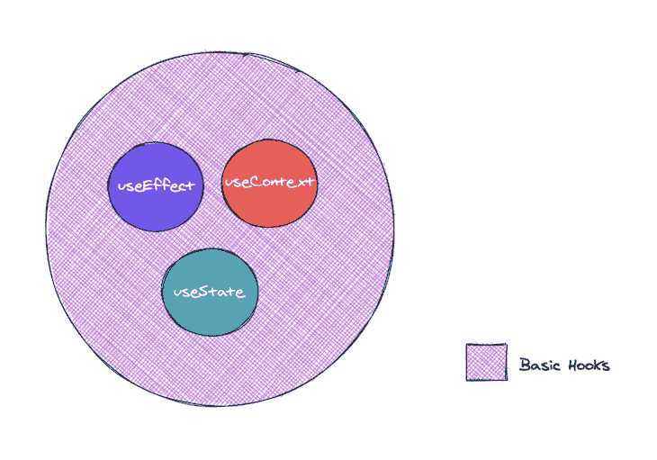

## `useState`

`useState`挂钩的签名如下:

```
const [state, setState] = useState(initialState);
```

这里的`state`和`setState`是指调用`useState`返回的状态值和更新函数，带有一些`initialState`。

值得注意的是，当你的组件第一次呈现和调用`useState`时，`initialState`是从`useState`返回的状态。

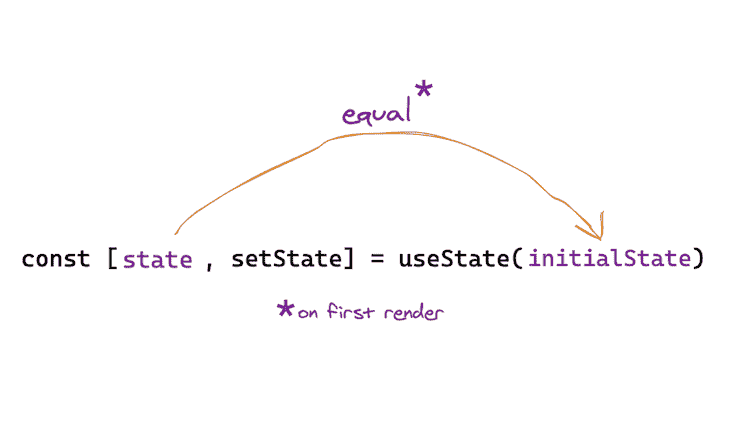

此外，为了更新状态，应该使用新的状态值调用状态更新函数`setState`，如下所示:

```
setState(newValue)
```

通过这样做，组件的新的重新呈现被排队。`useState`保证`state`值在应用更新后总是最新的。

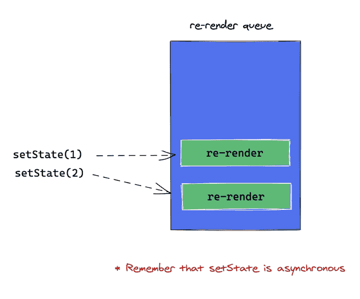

对于引用检查，`setState`函数的引用在重新渲染时不会改变。

为什么这很重要？在其他钩子的依赖列表中有 updater 函数是完全可以的，比如`useEffect`和`useCallback`，如下图:

```
useEffect(() => {
        setState(5)
}, [setState]) //setState doesn't change, so useEffect is only called on mount.
```

请注意，如果 updater 函数返回与当前状态完全相同的值，则会跳过后续的重新渲染:


### 功能更新

由`useState`返回的状态更新函数可以通过两种方式调用。第一种方法是直接传递一个新值作为参数:

```
const [state, setState] = useState(initialStateValue)

// update state as follows
setState(newStateValue)
```

这是正确的，并且在大多数情况下都非常有效。然而，在一些情况下，不同形式的状态更新是优选的: ***功能更新*** 。

下面是上面的例子，修改后使用了功能更新表:

```
const [state, setState] = useState(initialStateValue)

// update state as follows
setState((previousStateValue) => newValue)
```

您将一个函数参数传递给`setState`。在内部，React 将以之前的状态作为参数调用该函数。从这个函数返回的任何东西都被设置为新的状态。

让我们来看看这种方法更受欢迎的案例。

#### 1.新的状态值取决于先前的状态

当您的新状态依赖于以前的状态值(例如，计算)时，请支持功能状态更新。由于`setState`是异步的，React 保证之前的状态值是准确的。

这里有一个例子:

```
function GrowingButton() {
  const [width, setWidth] = useState(50);

  // call setWidth with functional update
  const increaseWidth = () => setWidth((previousWidth) => previousWidth + 10);

  return (
    <button style={{ width }} onClick={increaseWidth}>
      I grow
    </button>
  );  
}
```

在上面的例子中，按钮在每次被点击时都会变大。由于新的状态值依赖于旧的状态值，所以最好使用`setState`的功能更新形式。

2.合并对象状态

#### 考虑下面的代码块:

当您单击“更新状态”按钮时，会打印以下哪个状态值？

```
function CanYouFigureThisOut() {
  const [state, setState] = useState({ name: "React" });
  const updateState = () => setState({ creator: "Facebook" });
  return (
    <>
      <pre>{JSON.stringify(state)}</pre>
      <button onClick={updateState}>update state</button>
    </>
  );
}
```


The string {name: ‘React’} printed to the screen.

正确答案是`2`,因为使用钩子，更新函数*而不是*合并对象，不像类组件中的`setState`函数。它用作为参数传递的任何新值替换状态值。

```
//1\. 
{"name": "React", "creator": "Facebook"}

//2\. 
{"creator": "Facebook"}

//3\. 
{"name": "React"}
```

下面是如何使用状态更新器函数的函数更新形式来解决这个问题:


```
const updateState = () =>  setState((prevState) => ({ ...prevState, creator: "Facebook" }));
```

向`setState`传递一个函数，通过使用[扩展操作符](https://developer.mozilla.org/en-US/docs/Web/JavaScript/Reference/Operators/Spread_syntax) ( [`Object.assign`也起作用](https://developer.mozilla.org/en-US/docs/Web/JavaScript/Reference/Global_Objects/Object/assign))返回一个合并的对象。

Pass a function to `setState` and return a merged object by using the [spread operator](https://developer.mozilla.org/en-US/docs/Web/JavaScript/Reference/Operators/Spread_syntax) ([`Object.assign` also works](https://developer.mozilla.org/en-US/docs/Web/JavaScript/Reference/Global_Objects/Object/assign)).

3.避免其他钩子中的状态依赖

#### 有些情况下，您可以包含一个状态值作为对`useEffect`或`useCallback`的依赖。然而，如果由于`setState`使用的状态依赖，您的`useEffect`回调引发了不必要的麻烦，更新器表单可以缓解这种需求。

请参见下面的示例:

惰性初始化状态

```
const [state, setState] = useState(0) 

// before
useEffect(() => {
  setState(state * 10)
}, [state, setState]) //add dependencies to prevent eslint warning

// after: if your goal is to run the callback only on mount 
useEffect(() => {
  setState(prevState => prevState * 10)
}, [setState]) //remove state dependency. setState can be safely used here.
```

### `useState`的`initialState`参数仅在初始渲染时使用。

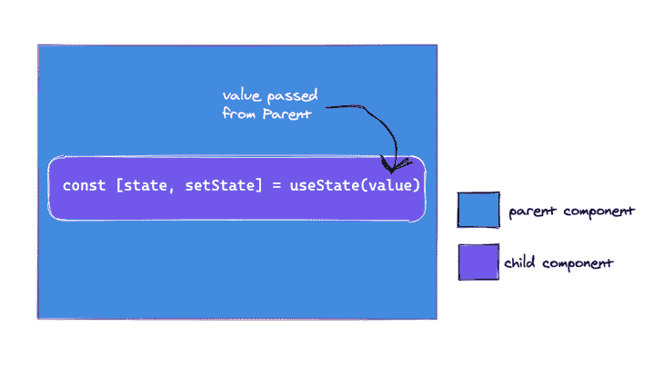

但是，如果初始状态是开销很大的计算的结果，您也可以传递一个函数，该函数将仅在初始渲染时调用:

```
// this is OK 
const [state, setState] = useState(10) 

// subsequent prop updates are ignored 
const App = ({myProp}) => {
  const [state, setState] = useState(myProp)
}
// only the initial myProp value on initial render is passed as initialState. subsequent updates are ignored.
```

退出状态更新

```
const [state, setState] = useState(() => yourExpensiveComputation(props))
```

### 如果你试图用与当前状态相同的值来更新状态，React 将不会呈现组件的子组件或触发效果，例如`useEffect`回调。React 通过 [`Object.is`比较算法](https://developer.mozilla.org/en-US/docs/Web/JavaScript/Reference/Global_Objects/Object/is#Description)比较之前和当前状态；如果它们相等，则忽略重新渲染。

需要注意的是，在某些情况下，React 可能仍然会呈现状态被更新的特定组件。这没关系，因为 React 将*而不是*深入到树中，例如，呈现组件的子组件。


如果在函数组件的主体内，也就是在 return 语句之前，进行昂贵的计算，考虑用`useMemo`优化这些计算。

***准备好深入了吗？查看我们的 useState 钩子的完整指南。***

##### `useEffect`

`useEffect`的基本签名如下:

* * *

## 接受一个函数，该函数最好包含一些命令性的、可能有效的代码。例子包括突变、订阅、定时器、记录器等。—本质上，副作用不允许出现在函数组件的主体内部。

在函数的主体中有这样的副作用会导致混乱的 bug 和不一致的 ui。不要这样。使用`useEffect`。

```
useEffect(() => {

})
```

传递给`useEffect`的函数在渲染提交到屏幕后被调用。我们将在后面的章节中对此进行更深入的解释。现在，将回调视为在功能组件中放置命令性代码的最佳位置。


The function main body refers to the block before the function return statement.

默认情况下，每次完成渲染后都会调用`useEffect`回调函数，但是您可以选择仅在某些值发生变化时调用该回调函数——这将在后面的章节中讨论。

清理效果

一些命令性代码需要清理。比如订阅需要清理，定时器需要失效等等。为此，从传递给`useEffect`的回调中返回一个函数:

```
useEffect(() => {
  // this callback will be invoked after every render
})
```

### 清理功能保证在组件从用户界面中移除之前被调用。

如果一个组件被渲染了多次，比如某个组件`A`被渲染了两次呢？在这种情况下，在第一次渲染时，会在第二次渲染之前设置并清理效果订阅。在第二次呈现中，建立了一个新的订阅。

```
useEffect(() => {
  const subscription = props.apiSubscription() 

  return () => {
     // clean up the subscription
     subscription.unsubscribeApi()
   }
})
```


这意味着在每次渲染时都会创建一个新的订阅。在有些情况下，您不希望发生这种情况，您更希望限制何时调用效果回调。请参考下一节。

效果的定时

调用`useEffect`回调和调用`componentDidMount`和`componentDidUpdate`等类方法有很大的区别。

### 在浏览器布局和绘制完成后，效果回调被调用。这使得它适用于许多常见的副作用，如设置订阅和事件处理程序，因为大多数这些不应该阻止浏览器更新屏幕。


`useEffect`就是这种情况，但是这种行为并不总是理想的。

如果您希望在浏览器下一次绘制之前让用户看到一个副作用，该怎么办？有时，这对于防止 UI 中的视觉不一致是很重要的，例如 DOM 突变。

对于这种情况，React 提供了另一个名为`useLayoutEffect`的钩子。它和`useEffect`的签名一样；唯一的区别在于它被触发的时间，也就是回调函数被调用的时间。

**注意:**，虽然`useEffect`被推迟到浏览器画好之后，**仍然保证在任何重新渲染之前被触发。这很重要。**

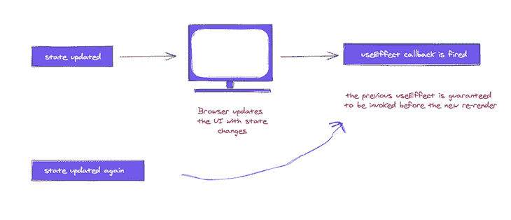

> React 将总是在开始新的更新之前刷新以前的渲染效果。

有条件地触发一个效果

默认情况下，每次渲染后都会调用`useEffect`回调函数。

### 这样做是为了在任何依赖关系改变时重新创建效果。这是伟大的，但有时它是矫枉过正。

考虑我们在前面章节中的例子:

```
useEffect(() => {
  // this is invoked after every render
})
```

在这种情况下，每次渲染时重新创建订阅没有太大意义。只有当`props.apiSubscription`改变时，才应这样做。

为了处理这种情况，`useEffect`采用了第二个参数，称为数组依赖。

```
useEffect(() => {
   const subscription = props.apiSubscription() 

  return () => {
     // clean up the subscription
     subscription.unsubscribeApi()
   }
})
```

在上面的示例中，我们可以阻止效果调用在每个渲染上运行，如下所示:

让我们仔细看看数组依赖列表。

```
useEffect(() => {

}, []) //note the array passed here
```

如果希望效果仅在装载时运行(卸载时清理)，请传递一个空数组依赖项:

```
useEffect(() => {
   const subscription = props.apiSubscription() 

  return () => {
     // clean up the subscription
     subscription.unsubscribeApi()
   }
}, [props.apiSubscription]) // look here
```

如果您的效果依赖于作用域中的某个状态或属性值，请确保将其作为数组依赖项传递，以防止在回调中访问过时的值。如果引用的值随时间变化并在回调中使用，请确保将它们放在数组依赖项中，如下所示:

假设你这样做了:

```
useEffect(() => {
   // effect callback will run on mount
   // clean up will run on unmount. 
}, [])
```

`props1`、`props2`、`props3`只有初始值，改变时不会调用效果回调。

```
useEfect(() => {
  console.log(props1 + props2 + props3)
},[props1, props2, props3])
```

如果你跳过了其中一个，例如`props3`:

```
useEffect(() => {
  console.log(props1 + props2 + props3)
},[])
```

那么`props3`变化时效果回调就不会运行。

React 团队推荐你使用[eslint-plugin-React-hooks](https://www.npmjs.com/package/eslint-plugin-react-hooks#installation)包。当依赖项指定不正确时，它会发出警告，并提出修复建议。

```
useEfect(() => {
  console.log(props1 + props2 + props3)
},[props1, props2])
```

您还应该注意到，`useEffect`回调至少会运行一次。这里有一个例子:

假设`props1`更新了一次，即从初始值变为另一个值，那么`props1`会被记录多少次？

**一次**:组件安装时

```
useEfect(() => {
  console.log(props1)
},[props1])
```

**一次**:当`props1`变化时

1.  **两次**:安装时和`props1`变化时
2.  正确答案是`3`,因为效果回调是在初始渲染后第一次触发的，后续调用发生在`props1`改变时。记住这个。
3.  最后，依赖数组不会作为参数传递给效果函数。不过，看起来确实是这样；这就是依赖数组所代表的。将来，React 团队可能会有一个高级编译器来自动创建这个数组。在此之前，请确保自己添加它们。

点击这里阅读更多关于生命周期方法的信息。

`useContext`

##### 下面是如何使用`useContext`钩子:

注意，传递给`useContext`的值必须是上下文对象，即调用`React.createContext`的返回值，而不是`ContextObject.Provider`或`ContextObject.Consumer`。

* * *

## 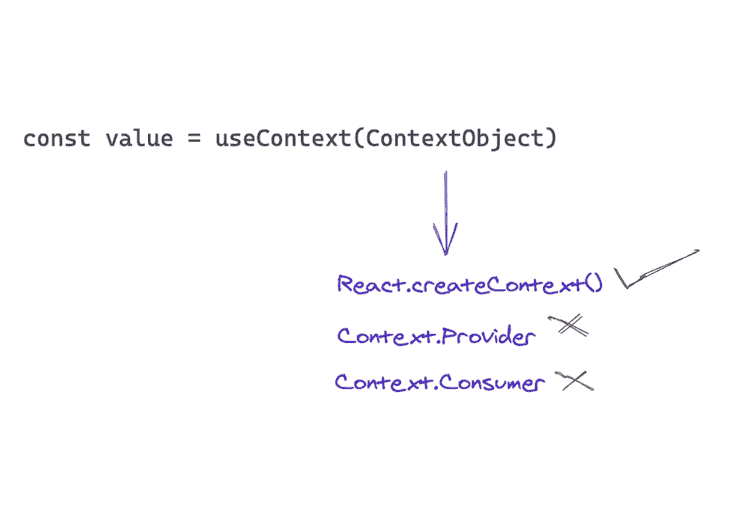

用一个上下文对象调用`useContext`(调用`React.createContext`的结果)，它返回该上下文的当前值。

```
const value = useContext(ContextObject)
```

从`useContext`返回的值由树中调用组件上方最近的`Provider`的值`prop`决定。

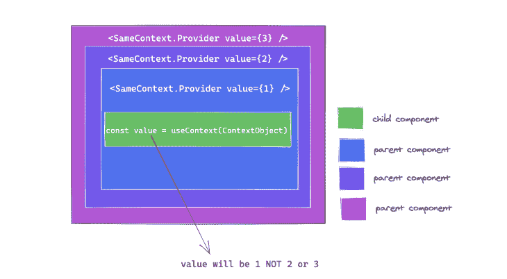

注意，在一个组件中使用`useContext`钩子隐含地订阅了组件树中最近的`Provider`，也就是说，当`Provider`更新时，这个钩子将触发一个 serenader，把最新的值传递给那个`Provider`。

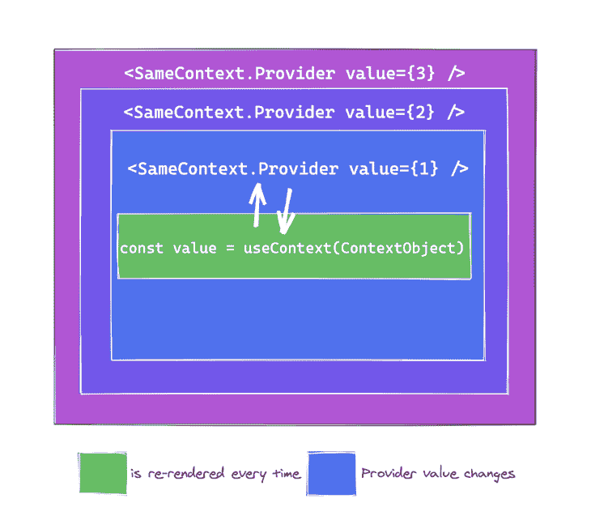

还有更重要的一点需要记住。如果祖先组件使用`React.memo`或`shouldComponentUpdate`，重新渲染仍然会从调用`useContext`的组件开始。

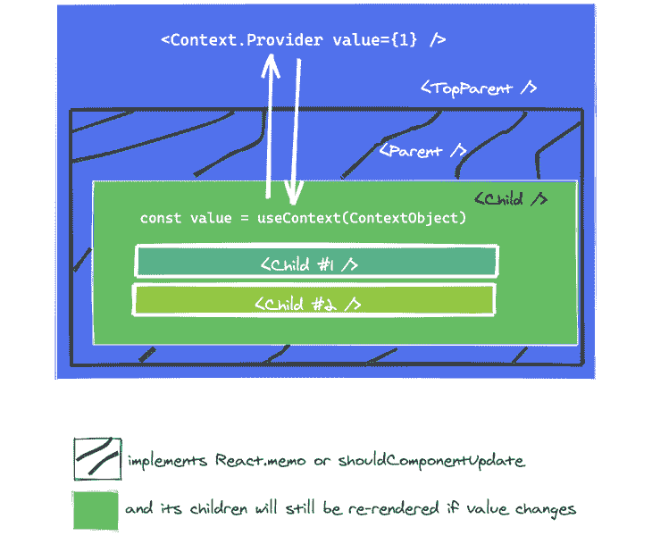

当上下文值改变时，调用`useContext`的组件将被重新呈现。如果这很昂贵，你可以考虑通过使用[记忆](https://github.com/facebook/react/issues/15156#issuecomment-474590693)来优化它。

请记住，`useContext`只允许您读取上下文并订阅它的更改。您仍然需要一个上下文提供者，即上面组件树中的`ContextObject.Provider`，来提供由`useContext`读取的值。

这里有一个例子:

***在我们关于使用上下文 API 进行状态管理的指南中，回顾一下 useContext 的更高级实现。***

附加挂钩

```
const theme = {
  light: {background: "#fff"},
  dark: {background: "#000"}
}

// create context object with light theme as default
const ThemeContext = React.createContext(theme.light) 

function App() {
   return (
    // have context provider up the tree (with its value set)
    <ThemeContext.Provider value={theme.dark}>
       <Body />
    </ThemeContext.Provider>
 )
}

function Body() {
  //get theme value. make sure to pass context object
  const theme = useContext(ThemeContext)
  return (
   {/* style element with theme from context*/}
   <main style={{ background: theme.background, height: "50vh", color: "#fff" }}>
         I am the main display styled by context!        
   </main>
  )
}
```

下面的钩子是上面讨论的基本钩子的变体。如果你是钩子的新手，现在不要学习这些；只有在特定的边缘情况下才需要它们。

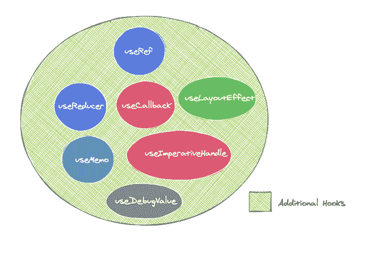

##### `useReducer`

`useReducer`是`useState`的替代。下面是它的使用方法:

* * *

# 当被调用时，`useReducer`返回一个保存当前`state`值的数组和一个`dispatch`方法。如果你熟悉 Redux，你就已经知道这个`dispatch`是怎么工作的了。

使用`useState`，您调用状态更新器函数来更新状态；使用`useReducer`，您调用`dispatch`函数并向其传递一个动作，即一个至少具有`type`属性的对象:

**注意:**，按照惯例，一个动作对象也可以有一个`payload`，例如:`{action: 'increase', payload: 10}`。

## 虽然不是绝对有必要传递遵循这种模式的 action 对象，但这是一种非常常见的模式，由 [Redux](https://redux.js.org/) 推广。

何时使用`useReducer`

```
const [state, dispatch] = useReducer(reducer, initialArgument, init)
```

当您拥有利用多个子值的复杂状态逻辑时，或者当一个状态依赖于前一个状态时，您应该优先使用`useReducer`而不是`useState`。

与调用`useState`返回的`setState` updater 函数一样，`dispatch`方法标识保持不变，所以可以将[传递给子组件](https://reactjs.org/docs/hooks-faq.html#how-to-avoid-passing-callbacks-down)，而不是回调来更新`useReducer`内保存的状态值。

```
dispatch({type: 'increase'})
```

> `reducer`功能

`useReducer`接受三个论点。第一个是`reducer`，是一个类型为`(state, action) => newState`的函数。reducer 函数接受当前状态和一个 action 对象，并返回一个新的状态值。

### 这需要一些时间来适应，除非你已经熟悉了减速器的概念。

基本上，每当你试图更新通过`useReducer`管理的状态时，即通过调用`dispatch`，当前状态值和传递给`dispatch`的动作参数被传递给缩减器。

然后从 reducer 返回新的状态值是您的责任。

### 一种更常见的方法是检查被调度的`action`的类型，并据此采取行动。

指定初始状态

如果你 ***不*** 传递第三个参数给`useReducer`，那么第二个参数给`useReducer`就会被当作钩子的`initialState`。

考虑下面的例子:

```
//receives current state and dispatched action
const reducer = (state, action) => {

}
```

如果你熟悉 Redux，值得一提的是`state = initialState`约定与`useReducer`的工作方式不同。

```
const reducer = (state, action) => {
   // return new state value 
   return state * 10 
}

```

`initialState`有时需要依赖于`props`，所以从钩子调用中指定。

```
const reducer = (state, action) => {
   // check action type  
   switch (action.type) {
    case "increase":
     //return new state
      return state * 10;
    default:
      return state;
  } 
}
```

### 如果您真的想要使用`redux`风格的调用，可以这样做:`useReducer(reducer, undefined, reducer)`。这是可能的，但不鼓励。

以下是来自`useState`钩子部分的增长按钮示例，被重构为使用`useReducer`钩子。

```
// two arguments 
useReducer(reducer, initialState)

// three arguments 
useReducer(reducer, initialArgument, init) 
// I explain what the init function is in the  "Lazy initialization" section below
```

惰性初始化

```
const [state, dispatch] = useReducer(reducer, 10) // initial state will be 10
```

也可以惰性地创建初始状态。为此，向`useReducer`传递第三个参数:`init`函数。

```
// where 10 represents the initial state
// doesn't work the same with useReducer
const reducer = (state = 10, action) {

}
```

如果你传递一个`init`函数，初始状态将被设置为`init(initialState)`，也就是说，这个函数将被第二个参数`initialArgument`调用。

```
useReducer(state, 10) // where 10 represents the initial state
```

这允许您提取逻辑来计算 reducer 外部的初始状态，这对于稍后响应某个动作时重置状态可能很方便。

逃避急件

```
const reducer = (state, action) => {
  switch (action.type) {
    case "increase":
      return state + 10;
    default:
      return state;
  }
};

export default function App() {
  const [width, dispatch] = useReducer(reducer, 50);

  // you update state by calling dispatch
  const increaseWidth = () => dispatch({ type: "increase" });

  return (
    <button style={{ width }} onClick={increaseWidth}>
      I grow
    </button>
  );
}
```

如果你试图用与当前状态相同的值来更新状态，React 将不会呈现组件的子组件或触发效果，例如`useEffect`回调。React 通过 [`Object.is`比较算法](https://developer.mozilla.org/en-US/docs/Web/JavaScript/Reference/Global_Objects/Object/is#Description)比较先前和当前状态。

### 需要注意的是，在某些情况下，React 可能仍然会呈现状态被更新的特定组件。没关系，因为 React 会将 ***而不是*** 更深入到树中，即渲染组件的子组件。

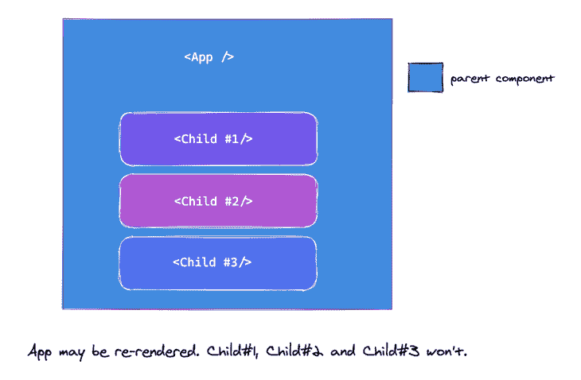

```
const [state, dispatch] = useReducer(reducer, initialArgument, init)
```

如果昂贵的计算是在你的功能组件中完成的，考虑用`useMemo`来优化它们。

***状态管理只使用钩子？你打赌。在这里看，有更多的用户操作。***

```
function init(someInitialValue) {
   return { state: someInitialValue }
}

function reducer(state, action) {
   switch(action.type) {
      //reset by calling init function
      case 'reset': 
        // an action object typically has a "type" and a "payload" 
                return init(action.payload)
   }
}
...
const initialValue = 10;
const [state, dispatch] = useReducer(reducer, initialValue, init)
```

`useCallback`

### `useCallback`的基本签名如下所示:

`useCallback`接受一个回调参数和一个数组依赖列表，并返回一个记忆化的回调。

由`useCallback`返回的内存化回调保证具有相同的引用。当向依赖引用检查的子组件传递回调以防止不必要的重新呈现时，这尤其有用。

数组依赖性同样重要。如果任何数组依赖关系发生变化，`useCallback`将重新计算内存化回调。如果您在回调中使用组件范围内的值，并且需要在调用回调时保持这些值是最新的，这一点很重要。

**N.B.** ，确保在数组依赖关系中包含回调内的所有引用变量。你还应该利用官方的 [ESLint 插件](https://www.npmjs.com/package/eslint-plugin-react-hooks#installation)来帮助检查你的数组依赖是否正确，并提供修复。

##### 考虑下面的例子:

即使`ExpensiveComponent`通过`React.memo`被记忆，它仍然会在`App`被重新渲染时被重新渲染，因为对道具`callback`的引用会改变。

* * *

## 为了保持对`callback`的引用不变，我们可以使用`useCallback`钩子:

上述解决方案是不完整的。如果不传递数组依赖，`useCallback`将在每次渲染时重新计算返回的内存化回调。那不理想。让我们来解决这个问题:

```
const memoizedCallback = useCallback(callback, arrayDependency)
```

传递一个空数组依赖意味着内存化回调只计算一次:在装载时。

让我们假设回调需要从`App`组件访问一些道具:

在这种情况下，将`props1`和`props2`作为数组依赖列表的一部分非常重要。除非你有充分的理由不这样做，否则你应该总是这样做。

> 假设`props1`和`props2`是通过值而不是引用进行比较的 JavaScript 值，例如字符串或布尔值，上面的例子简单易懂。

如果`props1`引用一个函数呢？

```
const App = () => {
   const handleCallback = () => {
     // do something important 
   }
   return <ExpensiveComponent callback={handleCallback}/>
}

const ExpensiveComponent = React.memo(({props}) => {
        // expensive stuff 
})
```

通过将`props1`函数作为一个数组依赖，你必须确定它的引用不会一直改变，也就是说，在所有的重新渲染中。如果是这样的话，那么它就违背了使用`useCallback`的目的，因为每次`props1`改变时，`useCallback`返回的记忆化回调也会改变。

有不同的方法来处理这个问题，但是简单地说，你可能想要避免[将这种变化的回调](https://reactjs.org/docs/hooks-faq.html#how-to-avoid-passing-callbacks-down)传递给子组件。`props1`也可以使用`useCallback`来记忆或完全避免。

```
const App = () => {
   // use the useCallback hook 
   const handleCallback = useCallback(() => {
     // do something important 
   })
   return <ExpensiveComponent callback={handleCallback}/>
}
```

***探索一些可以用 useCallback 解锁的常见问题。***

```
const App = () => {

   const handleCallback = useCallback(() => {
     // do something important 
   }, []) // see array dependency

   return <ExpensiveComponent callback={handleCallback}/>
}
```

`useMemo`

当`useCallback`返回一个记忆化的回调时，`useMemo`返回一个记忆化的值。这是一个有点模糊的陈述，因为回调也可以是一个值，但是本质上，`useCallback(fn, deps)`等同于`useMemo(() => fn, deps)`。

```
const App = ({props1, props2}) => {
   const handleCallback = useCallback(() => {
     // do something important
     return props1 + props2 
   }, [props1, props2]) // see array dependency
   return <ExpensiveComponent callback={handleCallback}/>
}
```

如果这令人困惑，考虑一下`useMemo`的基本签名:

这看起来非常类似于`useCallback`的签名。这里的区别在于对`useMemo`的回调是一个“创建”函数；它被调用并返回一个值。返回值是由`useMemo`记忆的。

现在，您可以重新审视一下之前的陈述:

```
const App = ({props1, props2}) => {
   const handleCallback = useCallback(() => {
     return props1(props2)
   }, [props1, props2]) // see array dependency
   return <ExpensiveComponent callback={handleCallback}/>
}
```

上面的陈述是正确的，因为`useMemo`调用了“创建”函数`() => fn`。记住箭头函数隐式返回。在这种情况下，调用“创建”函数会返回`fn`。使其等同于`useCallback`选择。

使用`useCallback`来记忆回调，使用`useMemo`来记忆值；通常是您不想在每次渲染时都重新计算的高开销操作的结果:

##### `useMemo`可用作优化，以避免每次渲染时的昂贵计算。虽然鼓励这样做，但这并不是语义上的保证。将来，React 可能会选择忽略以前记忆的值，并在下次渲染时重新计算它们，例如，为屏幕外组件释放内存。

经验法则是，您的代码应该在没有`useMemo`的情况下工作，然后添加`useMemo`以优化性能。注意，`useMemo`的数组依赖与`useCallback`中的一样:

* * *

## 如果没有数组依赖，如上所示，`someExpensiveCalculation`仍然会在每次重新渲染时运行。

对于空数组，它只能在装载时运行。

**N.B.** ，确保在数组依赖关系中包含回调内的所有引用变量。你还应该利用官方的 [ESLint 插件](https://www.npmjs.com/package/eslint-plugin-react-hooks#installation)来帮助检查你的数组依赖是否正确，并提供修复。

```
const memoizedValue = useMemo(callback, arrayDependency);
```

还不要疯狂使用 useMemo——阅读更多关于钩子记忆和如何避免滥用 use memo 的陷阱。

```
useCallback(fn, deps) === useMemo(() => fn, deps)
```

`useRef`

`useRef`钩子的基本签名如下:

```
const memoizedValue = useMemo(() => computeExpensiveValue(a, b), [a,b]);
```

`useRef`返回一个可变对象，其值设置为:`{current: initialValue}`。

使用`useRef`和直接在组件内手动设置对象值(如`const myObject = {current: initialValue}`)的区别在于`ref`对象在组件的整个生命周期内保持不变，即在重新渲染过程中保持不变。

```
const App = () => {
  useMemo(() => someExpensiveCalculation())

  return null
}
```

要更新存储在`ref`对象中的值，您需要像下面这样改变`current`属性:

```
const App = () => {
  // see array below 
  useMemo(() => someExpensiveCalculation(), [])

  return null
}
```

调用`useRef`返回的对象将在组件的整个生命周期内保持不变，不管是否重新渲染。

> `useRef`的一个常见用例是存储子 DOM 节点:

##### 上面的例子之所以有效，是因为如果您将一个`ref`对象传递给 React，例如`<div ref={myRef} />`，每当 DOM 节点发生变化时，React 就会将其`current`属性设置为相应的 DOM 节点，例如`myRef = {current: *dom node*}`。

返回一个普通的 JavaScript 对象，所以它不仅仅可以用来保存 DOM 节点——它可以保存你想要的任何值。这使得它成为在功能组件中模拟类似实例的变量的完美选择:

* * *

## 在上面的例子中，我们通过`useEffect`来记录`initialProp1`和`prop1`。这将在安装时和每次`prop1`改变时被记录。

由于`initialProp1`是在初始渲染时保存的`prop1`，它永远不会改变。它将永远是`props1`的初始值。我们的意思是。

```
const refObject = useRef(initialValue)
```

如果传递给`App`的`props1`的第一个值是`2`，即`<App prop1={2} />`，将在挂载时记录以下内容:

如果传递给`App`的`prop1`从`2`更改为`5`——比方说，由于状态更新——将记录以下内容:

```
const App = () => {
   const refObject = useRef("value")
   //refObject will always be {current: "value"} every time App is re-rendered. 
}
```

`initialProp1`在组件的生命周期内保持不变，因为它保存在`ref`对象中。更新这个值的唯一方法是改变`ref`对象的当前属性:`initialProp1.current = **new value**`。

```
const App = () => {
   const refObject = useRef("value")

   //update ref 
   refObject.current = "new value" 

  //refObject will always be {current: "new value"} 
}
```

这样，您就可以继续创建类似于[实例的变量](https://reactjs.org/docs/hooks-faq.html#is-there-something-like-instance-variables)，它们不会在您的功能组件中改变。

记住，`useRef`和自己创建一个`{current: ...}`对象的唯一区别是`useRef`会在每次渲染时给你相同的`ref`对象。

```
function TextInputWithFocusButton() {
  //1\. create a ref object with initialValue of null
  const inputEl = useRef(null);

  const onButtonClick = () => {
    // 4\. `current` points to the mounted text input element
    // 5\. Invoke the imperative focus method from the current property
    inputEl.current.focus();
  };

  return (
    <>
      {/* 2\. as soon as input is rendered, the element will be saved in the ref object, i.e., {current: *dom node*}  */}
      <input ref={inputEl} type="text" />
      {/* 3\. clicking the button invokes the onButtonClick handler above */}
      <button onClick={onButtonClick}>Focus the input</button>
    </>
  );
}
```

还有一点要注意。当内容改变时，`useRef`不会通知您，也就是说，改变`current`属性不会导致重新渲染。对于在 React 将当前属性设置为 DOM 节点后执行状态更新的情况，请按如下方式使用回调 ref:

The example above works because if you pass a `ref` object to React, e.g., `<div ref={myRef} />`, React will set its `current` property to the corresponding DOM node whenever that node changes, i.e., `myRef = {current: *dom node*}`.

```
const App = ({prop1}) => {
    // save props1 in ref object on render
        const initialProp1 = useRef(prop1)

    useEffect(() => {
       // see values logged here
       console.log({
         initialProp1: initialProp1.current,
         prop1
       })
    }, [prop1])
}
```

就此而言，你需要用 useRef 和一般的 refs 来选择你的位置。阅读一些用例。

Since `initialProp1` is `prop1` saved on initial render, it never changes. It’ll always be the initial value of `props1`. Here’s what we mean.

`useImperativeHandle`

```
{
  initialProp1: 2,
  prop1: 2,
}
```

`useImperativeHandle`挂钩的基本特征是:

```
{
  initialProp1: 2, // note how this remains the same
  prop1: 5,
}
```

`useImperativeHandle`接受一个`ref`对象和一个`createHandle`函数，其返回值“替换”了`ref`对象中存储的值。

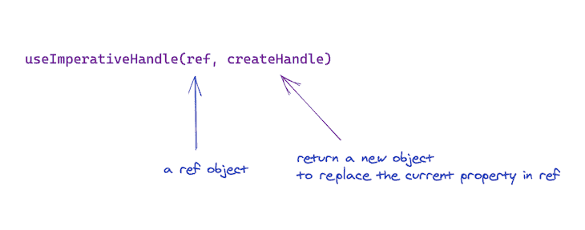

注意`useImperativeHandle`要和`forwardRef`一起用。

考虑下面的例子:

```
function UpdateStateOnSetRef() {
  // set up local state to be updated when ref object is updated
  const [height, setHeight] = useState(0);

  // create an optimised callback via useCallback
  const measuredRef = useCallback(node => {
    // callback passed to "ref" will receive the DOM node as an argument
    if (node !== null) {
      // check that node isn't empty before calling state
      setHeight(node.getBoundingClientRect().height);
    }
  }, []);

  return (
    <>
      {/* pass callback to the DOM ref */}
      <h1 ref={measuredRef}>Hello, world</h1>
      <h2>The above header is {Math.round(height)}px tall</h2>
    </>
  );
}
```

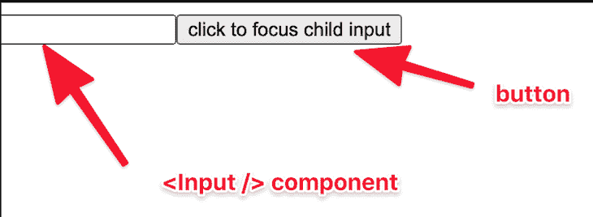

##### 应用程序的目标是在点击`button`元素时聚焦输入。一个非常简单的问题。

上面的解决方法是正确的。我们创建一个`ref`对象，并将其传递给`Input`组件。为了将`ref`对象转发给`Input`子组件，我们使用`forwardRef`，如下所示:

* * *

## 这太棒了，它像预期的那样工作。

然而，在这个解决方案中，父组件`App`拥有对`input`元素的完全访问权，即`App`中声明的`inputRef`持有子输入元素的完整 DOM 节点。

```
useImperativeHandle(ref, createHandle, [arrayDependency])
```

如果你不想这样呢？如果想对父节点隐藏 DOM 节点，只暴露一个`focus`函数，基本上就是父节点需要的全部了，怎么办？

这就是`useImperativeHandle`的用武之地。

在`Input`组件中，我们可以继续使用`useImperativeHandle`钩子，如下所示:

考虑一下`useImperativeHandle`调用:

函数参数返回一个对象。这个对象返回值被设置为从父对象传入的`ref`的`current`属性。

不再是父节点拥有对整个 DOM 节点的完全访问权，现在`App`中的`inputRef`将持有`{current: focus: ..}`，其中`focus`代表我们在`useImperativeHandle`中定义的函数。

如果您继续将`ref`对象记录在父组件`App`和子组件`Input`中，这将变得更加明显:

```
const App = () => {
  const inputRef = useRef(null);

  const handleClick = () => {
    inputRef.current.focus();
  };

  return (
    <>
      <Input ref={inputRef} />
      <button onClick={handleClick}>click to focus child input</button>
    </>
  );
}
```


```
const Input = forwardRef((props, ref) => {
  return <input ref={inputRef} {...props} />;
});
```

现在你知道`useImperativeHandle`是如何工作的了！这是一种在使用`ref`时定制暴露给父组件的实例值的方法，这是一个非常具体的用例。

如果您需要控制从函数参数返回到`useImperativeHandle`的值的重新计算，一定要利用数组依赖列表。

`useLayoutEffect`

`useLayoutEffect`的签名与`useEffect`相同；不同的是执行的时间。

您的`useLayoutEffect`回调/效果将在所有 DOM 突变后，即 ***在*** 浏览器有机会绘画之前，同步触发**。**

```
const Input = forwardRef((props, ref) => {
  // create internal ref object to hold actual input DOM node 
  const inputRef = useRef();

  // pass ref from parent to useImperativeHandle and replace its value with the createHandle function
  useImperativeHandle(ref, () => ({
    focus: () => {
      inputRef.current.focus();
    }
  }));

  // pass internal ref to input to hold DOM node
  return <input ref={inputRef} {...props} />;
});
```

建议您尽可能使用`useEffect`以避免阻挡视觉更新。然而，`useLayoutEffect`也有合法的使用案例，例如，从 DOM 读取布局并同步重新渲染。

```
useImperativeHandle(ref, () => ({
    focus: () => {
      inputRef.current.focus();
    }
  }));
```

如果你正在从一个类组件中移植代码，`useLayoutEffect`与`componentDidMount`和`componentDidUpdate`在同一个阶段触发，但是首先从`useEffect`开始，只有在引起问题的时候才尝试`useLayoutEffect`。除非你完全确定需要，否则不要阻止可视化更新。

同样值得一提的是，使用服务器端呈现，在 JavaScript 下载到客户端之前，`useEffect`和`useLayoutEffect`都不会运行。

对于包含`useLayoutEffect`的服务器渲染组件，您将得到一个警告。要解决这个问题，您可以将代码移动到`useEffect`，即在第一次渲染(和绘制)之后触发，或者延迟显示组件，直到客户端渲染之后。

要从服务器呈现的 HTML 中排除需要布局效果的组件，可以用`showChild && <Child />`有条件地呈现它，用`useEffect(() => { setShowChild(true); }, [])`推迟显示它。这样在补水之前 UI 就不会显得破了。


***细节中的魔鬼。确定何时使用 useEffect 与 useLayoutEffect 可能很棘手。让我们澄清一下。***

`useDebugValue`

* * *

## `useDebugValue`基本签名如下:

`useDebugValue`可用于在 [React DevTools](https://chrome.google.com/webstore/detail/react-developer-tools/fmkadmapgofadopljbjfkapdkoienihi?hl=en) 中显示自定义挂钩的标签。

考虑以下基本的自定义挂钩:

一个漂亮的挂钩。让我们继续使用这个自定义挂钩:

结果如下:


考虑一下 React DevTools 是如何显示的:


##### 应用程序中的每个自定义钩子都显示在 DevTools 中。您可以单击每个挂钩来查看其内部状态:

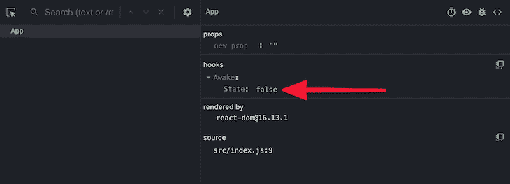

* * *

## 如果你想在 DevTools 中显示一个自定义的“标签”,我们可以如下使用`useDebugValue`钩子:

自定义标签现在将显示在 DevTools 中，如下所示:

```
useDebugValue(value)
```


**注意**，不要给每一个自定义钩子添加调试值。这些对于作为共享库一部分的定制钩子来说是最有价值的。

```
const useAwake = () => {
  const [state, setState] = useState(false);

  const toggleState = () => setState((v) => !v);

  return [state, toggleState];
};
```

在某些情况下，通过`useDebugValue`格式化显示值可能是一个开销很大的操作。也没有必要运行这个昂贵的操作，除非一个钩子被实际检查。对于这种情况，您可以将一个函数作为第二个参数传递给`useDebugValue`。

```
export default function App() {
  const [isAwake, toggleAwake] = useAwake();

  return (
    <div className="App">
      <h1>isAwake: {isAwake.toString()} </h1>
      <button onClick={toggleAwake}>Toggle awake!</button>
    </div>
  );
}
```


在上面的例子中，我们避免了不必要的调用`val.toUpperCase`,因为只有在 React DevTools 中检查到钩子时才会调用它。

[LogRocket](https://lp.logrocket.com/blg/react-signup-general) :全面了解您的生产 React 应用

调试 React 应用程序可能很困难，尤其是当用户遇到难以重现的问题时。如果您对监视和跟踪 Redux 状态、自动显示 JavaScript 错误以及跟踪缓慢的网络请求和组件加载时间感兴趣，

.

LogRocket 结合了会话回放、产品分析和错误跟踪，使软件团队能够创建理想的 web 和移动产品体验。这对你来说意味着什么？

LogRocket 不是猜测错误发生的原因，也不是要求用户提供截图和日志转储，而是让您回放问题，就像它们发生在您自己的浏览器中一样，以快速了解哪里出错了。

```
const useAwake = () => {
  const [state, setState] = useState(false);
  // look here
  useDebugValue(state ? "Awake" : "Not awake");
  ...
};
```

不再有嘈杂的警报。智能错误跟踪允许您对问题进行分类，然后从中学习。获得有影响的用户问题的通知，而不是误报。警报越少，有用的信号越多。

LogRocket Redux 中间件包为您的用户会话增加了一层额外的可见性。LogRocket 记录 Redux 存储中的所有操作和状态。

> 现代化您调试 React 应用的方式— [开始免费监控](https://lp.logrocket.com/blg/react-signup-general)。

In some cases, formatting a value for display via `useDebugValue` might be an expensive operation. It’s also unnecessary to run this expensive operation unless a Hook is actually inspected. For such cases, you can pass a function to `useDebugValue` as a second argument.

```
useDebugValue(state ? "Awake" : "Not awake", val => val.toUpperCase());
```


In the example above, we avoid calling `val.toUpperCase` unnecessarily as it’ll only be invoked if the Hook is inspected in the React DevTools.

## [LogRocket](https://lp.logrocket.com/blg/react-signup-general): Full visibility into your production React apps

Debugging React applications can be difficult, especially when users experience issues that are hard to reproduce. If you’re interested in monitoring and tracking Redux state, automatically surfacing JavaScript errors, and tracking slow network requests and component load time,

[try LogRocket](https://lp.logrocket.com/blg/react-signup-general)

.

[ ](https://lp.logrocket.com/blg/react-signup-general) [](https://lp.logrocket.com/blg/react-signup-general) 

[LogRocket](https://lp.logrocket.com/blg/react-signup-general) combines session replay, product analytics, and error tracking – empowering software teams to create the ideal web and mobile product experience. What does that mean for you?

Instead of guessing why errors happen, or asking users for screenshots and log dumps, LogRocket lets you replay problems as if they happened in your own browser to quickly understand what went wrong.

No more noisy alerting. Smart error tracking lets you triage and categorize issues, then learns from this. Get notified of impactful user issues, not false positives. Less alerts, way more useful signal.

The LogRocket Redux middleware package adds an extra layer of visibility into your user sessions. LogRocket logs all actions and state from your Redux stores.

Modernize how you debug your React apps — [start monitoring for free](https://lp.logrocket.com/blg/react-signup-general).**