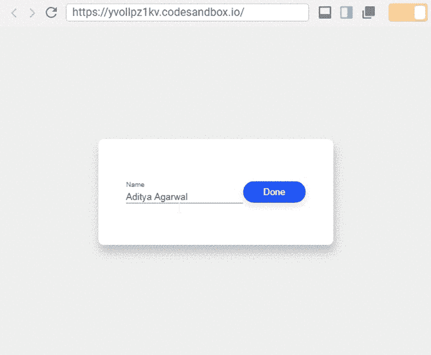
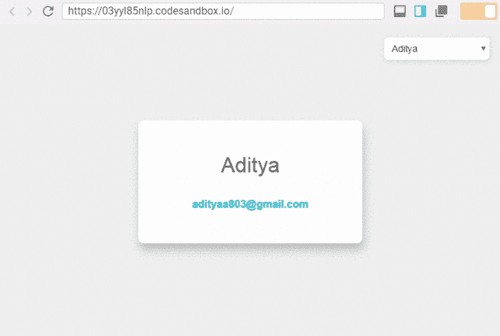

# React 渲染道具 vs .自定义钩子- LogRocket 博客

> 原文：<https://blog.logrocket.com/react-render-props-vs-custom-hooks/>

***编者按:*** *本帖最后一次更新于 2022 年 9 月 16 日，以包括关于渲染道具模式的附加信息。*

【React Hooks 刚发布的时候大家都有话说，但是很多开发者还是继续使用渲染道具。 而 渲染道具还没有也不会完全消亡，它们已经进化到提供不同的功能。而且，随着自定义钩子的引入，开发人员可以停止使用渲染道具。在这篇文章中，我们将学习如何用自定义钩子替换 React 渲染道具。

## 目录

## React 中的渲染道具是什么？

## [渲染道具是一种高级模式](https://blog.logrocket.com/react-reference-guide-render-props/#need)，用于跨组件共享逻辑。通常称为容器组件的组件可以将 UI 的外观委托给其他表示组件，并且只实现业务逻辑。因此，我们可以通过使用 render prop 模式将横切关注点实现为组件。

使用渲染道具的总体目的是:

在组件之间共享代码

1.  [使用上下文 API](https://blog.logrocket.com/react-context-api-deep-dive-examples/)
2.  使用渲染道具的好处

## 开发人员喜欢使用渲染道具有几个原因。首先，它们读取和更新本地组件状态，在我们希望重用组件逻辑和将组件状态从 UI 中分离出来的情况下，它们非常有用。

当我们想要在不同的组件之间共享相同的行为时，render props 模式使我们能够最大限度地减少代码重复。我们可以隔离 JSX 的一部分，并注入一些状态，而不会给组件带来副作用。

使用渲染道具的问题

## 然而，使用渲染道具有其自身的问题。然而，其中一些问题只有在我们更深入地研究代码或扩展项目时才会出现。

封装器

### 为了增加代码库的干度，我们经常实现许多小的、粒度的组件，以便每个组件处理一个关注点。然而，这通常会让开发人员将许多包装组件嵌套在一起。

如果我们增加包装组件的数量，组件的大小和复杂性会增加，而包装组件的可重用性可能会降低。安德鲁·克拉克在推特上完美地总结了这个问题。

绑定`this`

### 因为包装组件处理状态或生命周期方法，所以它们使用类组件。对于类组件，我们必须正确地绑定`this`，否则，我们可能会丢失函数内部的`this`上下文。不幸的是，绑定所有方法的语法看起来没有吸引力，并且经常成为开发人员的负担。

班级

### 类包含了大量的样板代码，每当我们将一个功能组件转换成一个类组件时，编写这些代码是很糟糕的。

显然，类也很难用构建工具来优化。这导致了双重惩罚，因为它既没有带来好的开发者体验，也没有带来好的用户体验。React 团队甚至考虑将来将类组件支持转移到一个单独的包中。

对纯组件使用渲染道具

### 如果我们在 render 方法中创建一个赋值函数，使用 render prop 会抵消使用`PureComponent`带来的好处。浅属性比较总是为新属性返回`false`，在这种情况下，每个渲染都会为渲染属性生成一个新值。更多[细节，请参考 React 文档](https://reactjs.org/docs/render-props.html#be-careful-when-using-render-props-with-reactpurecomponent)。

许多这些问题并不完全是渲染道具模式的错。直到最近，React 还没有提供一种在不涉及类的情况下使用状态或生命周期方法的方式。因此，我们必须使用容器组件中的类来实现 render props 模式。

然而，随着 React Hooks API 的引入，这一切都改变了。React 钩子让我们只用几行代码就可以在功能组件中使用状态和生命周期钩子。更好的是，我们可以实现自己的定制挂钩，为我们提供一个简单而强大的跨组件共享逻辑的原语。因此，我们不需要类或 render props 模式来在组件之间共享代码。

在开始之前，让我们先看看 React 钩子是如何使用的。

什么是 React 钩子？

## 简而言之， [React 钩子允许你在功能组件中使用状态和其他特性](https://blog.logrocket.com/react-hooks-cheat-sheet-unlock-solutions-to-common-problems-af4caf699e70/),而不必编写一个类组件。然而，学习更多东西的最好方法是使用它。

因此，要使用 React 挂钩，我们将构建一个组件，该组件默认显示信息，并允许我们通过单击一个按钮来更新该信息:



在上图中，组件在一个字段中显示信息，我们可以通过按字段右侧的按钮来更新信息。

什么是 React Hook 可编辑项目？

### 从这个例子中我们可以[观察到，组件有两种状态。一种状态](https://recordit.co/fsqbCcOFSi)[控制输入域](https://blog.logrocket.com/the-complete-guide-to-react-hook-form/)，另一种状态在查看器和编辑器之间切换。让我们看看如何用 React 钩子实现这一点:

我们来分解一下上面的代码。我们定义了`EditableItem`功能组件，它带有几个道具，`label`和`initialValue`用于显示输入字段上方的标签，`initialValue`道具用于显示默认信息。

```
import React, { useState } from "react";

function EditableItem({ label, initialValue }) {
  const [value, setValue] = useState(initialValue);
  const [editorVisible, setEditorVisible] = useState(false);

  const toggleEditor = () => setEditorVisible(!editorVisible);

  return (
    <main>
      {editorVisible ? (
        <label>
          {label}
          <input
            type="text"
            value={value}
            onChange={event => setValue(event.target.value)}
          />
        </label>
      ) : (
        <span>{value}</span>
      )}
      <button onClick={toggleEditor}>{editorVisible ? "Done" : "Edit"}</button>
    </main>
  );
}

```

我们设置了一个`value`状态来跟踪输入字段的值，并设置了一个`editorVisible`状态来跟踪编辑状态。在标记中，我们根据`editorVisible`的值改变按钮的标签。默认情况下，`value`变量将被赋予`initialValue`属性数据。

因为我们希望默认显示查看器，所以我们必须首先将`editorVisible`值设置为`false`。因此，我们一边叫`useState`，一边经过`false`。

为了在查看器和编辑器之间切换，我们必须定义`toggleEditor`函数，它在调用函数时将`editorVisible`状态设置为相反的状态。我们想在用户点击按钮时调用这个函数，所以我们将其指定为按钮的`onClick`道具。

这就是使用 React 钩子的简单之处，但它并没有就此停止。钩子还有一招，自定义钩子。

React 中的自定义钩子是什么？

## 根据 React 文档，React 中的定制钩子是重用有状态逻辑的[机制](https://reactjs.org/docs/hooks-custom.html)。在我们的用例中，我们可以看到`editorVisible`状态是一个 toggler，而切换是我们 ui 中的一个常见用例。如果我们想要跨组件共享切换逻辑，我们可以定义一个`Toggler`组件并使用 render props 模式来共享切换方法。

但是，如果我们可以只使用一个函数而不是搞乱组件，不是更容易吗？我们可以用一个定制的 React 钩子来实现。使用定制钩子，我们可以将切换逻辑从`EditableItem`组件提取到一个单独的函数中。我们称这个函数为`useToggle`,因为[推荐以`use`和](https://blog.logrocket.com/create-your-own-react-hooks/)开始一个定制钩子的名字。`useToggle`自定义钩子看起来像下面的代码:

在上面的代码中，我们执行了以下操作:

```
import React, { useState } from "react";

function useToggle(initialValue) {
  const [toggleValue, setToggleValue] = useState(initialValue);
  const toggler = () => setToggleValue(!toggleValue);

  return [toggleValue, toggler];
}

```

使用`useState`钩子获取状态和状态更新器

*   定义了一个`toggler`函数，将`toggleValue`设置为其当前值的相反值
*   返回两个项目的数组；`toggleValue`读取当前状态，`toggler`切换`toggleValue`状态
*   虽然在现代浏览器中，[在每次渲染时创建函数](https://reactjs.org/docs/hooks-faq.html#are-hooks-slow-because-of-creating-functions-in-render)并不慢，但是我们可以通过记忆`toggler`函数来避免延迟。为此， [`useCallback`钩派上了用场](https://blog.logrocket.com/react-usememo-vs-usecallback-a-pragmatic-guide/):

自定义挂钩的使用方式和其他挂钩一样。因此，在我们的`EditableItem`组件中使用`useToggle`就像这样简单:

```
import React, { useState, useCallback } from "react";

function useToggle(initialValue) {
  const [toggleValue, setToggleValue] = useState(initialValue);
  const toggler = useCallback(() => setToggleValue(!toggleValue));

  return [toggleValue, toggler];
}

```

现在，让我们来看看渲染道具与反应钩子相比表现如何:

```
import React, { useState } from "react";

import useToggle from 'useToggle.js';

function EditableItem({ label, initialValue }) {
  const [value, setValue] = useState(initialValue);
  const [editorVisible, toggleEditorVisible] = useToggle(false);

  return (
    <main>
      {editorVisible ? (
        <label>
          {label}
          <input
            type="text"
            value={value}
            onChange={event => setValue(event.target.value)}
          />
        </label>
      ) : (
        <span>{value}</span>
      )}
      <button onClick={toggleEditorVisible}>
        {editorVisible ? "Done" : "Edit"}
      </button>
    </main>
  );
}

```

使用 React 自定义挂钩重用代码

```
class Toggler extends Component {
  constructor(props) {
    super(props);
    this.state = {
      toggleValue: props.initialValue
    };
    this.toggler = this.toggler.bind(this);
  }

  toggler() {
    this.setState(prevState => ({
      toggleValue: !prevState.toggleValue
    }));
  }
  render() {
    return this.props.children(this.state.toggleValue, this.toggler);
  }
}

class EditableItem extends Component {
  constructor(props) {
    super(props);
    this.state = {
      value: props.initialValue
    };
  }

  setValue(newValue) {
    this.setState({
      value: newValue
    });
  }

  render() {
    return (
      <Toggler initialValue={false}>
        {(editorVisible, toggleEditorVisible) => (
          <main>
            {editorVisible ? (
              <label>
                {this.props.label}
                <input
                  type="text"
                  value={this.state.value}
                  onChange={event => this.setValue(event.target.value)}
                />
              </label>
            ) : (
              <span>{this.state.value}</span>
            )}
            <button onClick={toggleEditorVisible}>
              {editorVisible ? "Done" : "Edit"}
            </button>
          </main>
        )}
      </Toggler>
    );
  }
}

```

### 毫无疑问，使用定制钩子可以更容易地在组件之间重用代码，并且需要的代码更少。然后，我们可以使用 render props 模式重用代码:

接下来，我们将学习如何使用 React 钩子来消费上下文数据，而不是使用 render props 模式。

```
function useToggle(initialValue) {
  const [toggleValue, setToggleValue] = useState(initialValue);
  const toggler = useCallback(() => setToggleValue(!toggleValue));

  return [toggleValue, toggler];
}

function EditableItem({ label, initialValue }) {
  const [value, setValue] = useState(initialValue);
  const [editorVisible, toggleEditorVisible] = useToggle(false);

  return (
    <main>
      {editorVisible ? (
        <label>
          {label}
          <input
            type="text"
            value={value}
            onChange={event => setValue(event.target.value)}
          />
        </label>
      ) : (
        <span>{value}</span>
      )}
      <button onClick={toggleEditorVisible}>
        {editorVisible ? "Done" : "Edit"}
      </button>
    </main>
  );
}

```

使用 React 自定义挂钩消费上下文数据

## 就像我们有用于状态的`useState`钩子一样，我们有用于消费上下文数据的`useContext`。同样，让我们学习如何在实际场景中使用它。

一个常见的需求是跨组件提供用户详细信息。这是上下文挂钩的一个很好的用例:



上图演示了如何使用上下文挂钩来跨组件共享用户信息，这可以通过在下拉菜单中选择不同的用户来看到。

使用上下文来更改用户

### 在这个例子中，我们有两个组件，`UserProfile`和`ChangeProfile`。`UserProfile`组件显示用户的详细信息，`ChangeProfile`组件在用户之间切换。

用户之间的切换仅适用于我们的演示。在现实世界的项目中，我们会根据谁登录来更新用户的详细信息，而不是选择菜单。

实现如下所示:

在上面的代码中，我们执行了以下操作:

```
import React, { createContext, useState, useContext } from "react";
const UserContext = createContext();

function UserProfile() {
  const { user } = useContext(UserContext);
  const emailLink = `mailto:${user.email}`;
  return (
    <section>
      <h3>{user.name}</h3>
      <a href={emailLink} title={emailLink}>
        {user.email}
      </a>
    </section>
  );
}

function ChangeProfile() {
  const profiles = [
    {
      name: "Aditya",
      email: "[email protected]",
    },
    {
      name: "Arnold",
      email: "[email protected]",
    },
  ];
  const { user, setUser } = useContext(UserContext);
  const updateUser = (event) => {
    const profile = profiles[event.target.value];
    setUser(profile);
  };
  return (
    <select onChange={updateUser}>
      {profiles.map((profile, index) => (
        <option value={index} key={profile.email}>
          {profile.name}
        </option>
      ))}
    </select>
  );
}

function User({ children }) {
  const [user, setUser] = useState({
    name: "Aditya",
    email: "[email protected]",
  });
  const value = { user, setUser };
  return <UserContext.Provider value={value}>{children}</UserContext.Provider>;
}

export default function App() {
  return (
    <div className="App">
      <User>
        <ChangeProfile />
        <UserProfile />
      </User>
    </div>
  );
}

```

创建了一个将用户名和电子邮件传递给其他组件的`UserContext`

*   创建了一个显示用户详细信息的`UserProfile`组件
*   设置一个呈现列表的`ChangeProfile`组件。当用户选择一个概要文件时，我们用`setUser`方法更新上下文
*   定义了一个`User`组件，用于存储用户的数据，并通过`UserContext`提供给其子组件`UserProfile`和`ChangeProfile`访问
*   这个例子展示了在 React 定制钩子中使用上下文是多么简单。

在组件中实现插槽

## render props 模式的另一个常见用例是在组件中实现插槽:

对于不需要函数作为道具的更简单的方法，我们可以如下将 JSX 指定为组件道具:

```
function Card({ title, body, action}) {
  return (
    <section className='card'>
      <nav className='header'>
        {title()}
      </nav>
      <main className='main'>
        {body()}
      </main>
      <footer className='footer'>
        {action()}
      </footer>
    </section>
  )
}

function App() {
  return (
    <Card
      title={() => (
        <h2>Card Title</h2>
      )}
      body={() => (
        <div>
          <p>
            Some Content
          </p>
          <a href="/link">Some Link</a>
        </div>
      )}
      action={() => (
        <button onClick={() => console.log('clicked')}>Some Action</button>
      )}
    />
  )
}

```

在这里使用 render props 模式是错误的，因为它旨在组件之间共享数据。所以，在这种情况下，我们应该避免使用渲染道具。

```
function Card({ title, body, action }) {
  return (
    <section className="card">
      <nav className="header">{title}</nav>
      <main className="main">{body}</main>
      <footer className="footer">{action}</footer>
    </section>
  );
}

function App() {
  return (
    <Card
      title={<h2>Card Title</h2>}
      body={
        <div>
          <p>Some Content</p>
          <a href="/link">Some Link</a>
        </div>
      }
      action={
        <button onClick={() => console.log("clicked")}>Some Action</button>
      }
    />
  );
}

```

结论

## 在我看来，render props 模式不是为上述用例设计的，但是 React 社区使用它是因为没有其他选择。React 团队注意到了这一点，并做出了我们都喜欢使用的东西，这很好。

React 挂钩和 render props 可以共存，因为它们解决了将状态从组件移开的相同问题。很明显，React 的未来非常光明，React 团队的重点也非常明确。

我希望你喜欢这篇文章。如果你喜欢我的作品，请在[推特](https://twitter.com/dev__adi)和[媒体](https://medium.com/@adityaa803)上关注我，或者订阅[我的简讯](https://buttondown.email/itaditya)。

使用 LogRocket 消除传统反应错误报告的噪音

## 是一款 React analytics 解决方案，可保护您免受数百个误报错误警报的影响，只针对少数真正重要的项目。LogRocket 告诉您 React 应用程序中实际影响用户的最具影响力的 bug 和 UX 问题。

[LogRocket](https://lp.logrocket.com/blg/react-signup-issue-free)

自动聚合客户端错误、反应错误边界、还原状态、缓慢的组件加载时间、JS 异常、前端性能指标和用户交互。然后，LogRocket 使用机器学习来通知您影响大多数用户的最具影响力的问题，并提供您修复它所需的上下文。

[ ](https://lp.logrocket.com/blg/react-signup-general) [  ](https://lp.logrocket.com/blg/react-signup-general) [LogRocket](https://lp.logrocket.com/blg/react-signup-issue-free)

关注重要的 React bug—[今天就试试 LogRocket】。](https://lp.logrocket.com/blg/react-signup-issue-free)

Focus on the React bugs that matter — [try LogRocket today](https://lp.logrocket.com/blg/react-signup-issue-free).