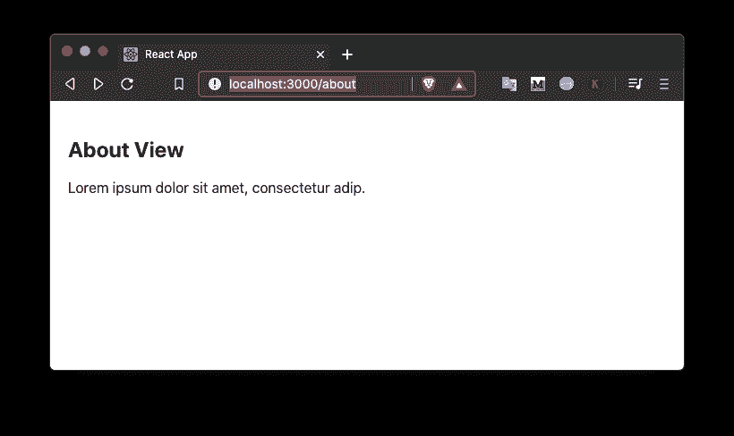
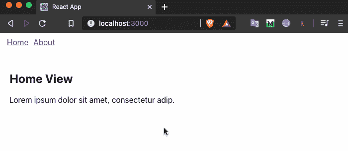
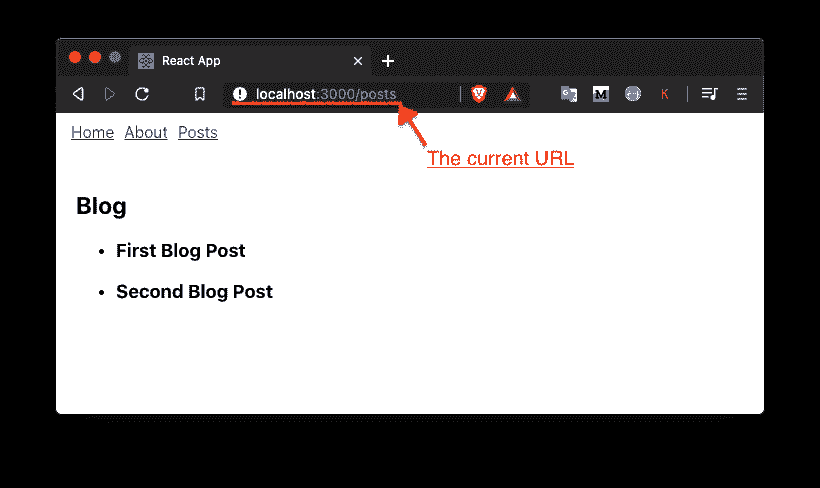

# React apps 中的 React 路由器 v6 使用指南

> 原文：<https://blog.logrocket.com/react-router-v6/>

具有多个视图的单页面应用程序(SPAs)需要一种路由机制，以便在这些不同的视图之间导航，而无需刷新整个网页。这可以通过使用路由库来处理，例如 [React Router](https://github.com/ReactTraining/react-router) 。

在本教程中，让我们看看如何使用 React Router v6 库创建路由。请注意，在写这篇文章的时候，React 路由器 v6 仍然处于测试阶段。本教程将向您展示该库即将推出的一些新特性。

如果你有在 React 应用中使用路由的经验，你可能已经知道在过去的几年里 [Reach Router](https://reach.tech/router/) 已经获得了一些关注。但是，从版本 6 开始，它将被合并回 React 路由器库中。这确实意味着 v6 版本的[比以前的版本有更小的包大小](https://twitter.com/ryanflorence/status/1229134773282455554)，这是 Reach Router 存在的主要原因之一。

## 先决条件

为了充分利用本教程，请确保在本地开发环境中安装了以下软件:

*   [Node.js](https://nodejs.org/en/) 版本> = `12.x.x`已安装
*   访问一个包装管理器，如 [npm](https://www.npmjs.com/) 或 [yarn](https://classic.yarnpkg.com/en/) 或 [npx](https://www.npmjs.com/package/npx)
*   JavaScript、Reactjs 和 React Hooks 的基础知识

## 入门指南

首先创建一个新的 React 应用程序。从终端窗口使用以下命令生成项目目录，然后在项目目录中导航并安装所需的依赖项，以添加 React Router v6 库:

```
npx create-react-app react-router-v6-example
cd react-router-v6-example
yarn add history [email protected]
```

一旦安装了依赖项，在您喜欢的代码编辑器中打开`package.json`文件，您将会看到`react-router-dom`库的依赖版本:

```
“dependencies": {
    // rest of the dependencies installed
    "react-router-dom": "6.0.0-beta.0",
  },
```

## React 路由器库中的不同包

React 路由器库包含三个不同的 npm 包，以下每个包都有不同的用途:

*   `react-router`
*   `react-router-dom`
*   `react-router-native`

包`react-router`是核心库，用作上面列出的其他两个包的对等依赖。`react-router-dom`是 React 应用程序中用于路由的包。列表中的最后一个包，`react-router-native`具有用于开发 [React 本地](https://reactnative.dev/)应用程序的绑定。

现在我们已经讨论过了，让我们建立第一条路线。

## 使用 React 路由器 v6 创建第一条路由

要使用 React 路由器库创建第一条路由，请打开`src/App.js`文件并添加以下导入语句:

```
// after other import statements
import { BrowserRouter as Router } from 'react-router-dom';
```

这是从`react-router-dom`库导入的第一个组件。它用于包装不同的路线。它使用 HTML5 历史 API 来跟踪 React 应用程序中的路线历史。

上面代码片段中的`Router`部分是别名，这样更容易编写。建议在 React 应用程序的组件层次结构的顶层组件中导入和使用它:

```
function App() {
  return <Router>{/* All routes are nested inside it */}</Router>;
}
```

从`react-router-dom`导入的下一个组件是新的`Routes`:

```
import { BrowserRouter as Router, Routes } from 'react-router-dom';
```

这个新元素是以前的`Switch`组件的升级。它包括相对路由和链接、自动路由排名、嵌套路由和布局等功能。

来自`react-router-dom` required 的最后一个组件叫做`Route`，负责呈现 React 组件的 UI。它有一个名为`path`的道具，总是匹配应用程序的当前 URL。第二个必需的属性叫做`element`，它告诉`Route`组件何时遇到当前 URL，以及要呈现哪个 React 组件。这里的`element`关键字也是新增加的。以前，在 React Router v5 中，您将使用名为`component`的道具。

为了在下面的演示中创建第一条路线，让我们创建一个名为`Home`的基本函数组件，它返回一些 JSX:

```
function Home() {
  return (
    <div style={{ padding: 20 }}>
      <h2>Home View</h2>
      <p>Lorem ipsum dolor sit amet, consectetur adip.</p>
    </div>
  );
}
```

接下来，用以下路径更新`App`功能组件。这里要注意的 v6 库的另一个特性是`Route`组件的`element`属性现在允许你传递一个 React 组件，而不仅仅是 React 组件的名字。这使得沿路线传递道具变得容易:

```
function App() {
  return (
    <Router>
      <Routes>
        <Route path="/" element={<Home />} />
      </Routes>
    </Router>
  );
}
```

要查看它的工作情况，请返回到终端窗口，使用命令`yarn start`启动开发服务器。接下来，在浏览器窗口中访问 URL `[http://localhost:3000](http://localhost:3000)`。

这是此步骤后的输出:


让我们快速创建另一个名为`About`的功能组件，该组件仅在浏览器窗口中的 URL 为`[http://localhost:3000/about](http://localhost:3000/about)`时呈现:

```
function About() {
  return (
    <div style={{ padding: 20 }}>
      <h2>About View</h2>
      <p>Lorem ipsum dolor sit amet, consectetur adip.</p>
    </div>
  );
}
```

然后，为`About`组件添加`Route`:

```
<Routes>
  <Route path="/" element={<Home />} />
  <Route path="/about" element={<About />} />
</Routes>
```

现在，返回浏览器窗口并访问 URL `[http://localhost:3000/about](http://localhost:3000/about)`:



## 添加导航菜单

为了在 React 应用程序中的特定路线上导航，或者在演示应用程序中的两条现有路线上导航，让我们在来自`react-router-dom`的`Link`组件的帮助下添加一个最小导航栏。

首先从库中导入它:

```
import { BrowserRouter as Router, Routes, Route, Link } from 'react-router-dom';
```

在 HTML 中的不同网页之间导航的概念是使用锚标记:

```
<a href="">Some Link Name</a>
```

在 React 应用程序中使用这种方法将导致每次呈现新视图或页面时刷新网页。这不是你在使用 React 这样的库时所寻求的优势。为了避免刷新网页，`react-router-dom`库提供了`Link`组件。

接下来，在`App`函数组件中，创建一个导航栏，如代码片段所示:

```
<Router>
  <nav style={{ margin: 10 }}>
    <Link to="/" style={{ padding: 5 }}>
      Home
    </Link>
    <Link to="/about" style={{ padding: 5 }}>
      About
    </Link>
  </nav>
  {/* Rest of the code remains same */}
</Router>
```

进入浏览器窗口查看导航栏的运行:


## 如何处理嵌套路由

嵌套路由是一个需要理解的重要概念。当路由嵌套时，通常假设网页的某个部分保持不变，只有网页的子部分发生变化。

例如，如果您访问一个简单的博客，博客的标题总是会显示出来，然后在其下方会显示一个博客文章列表。但是，当您单击一篇博客文章时，博客文章列表会被该特定博客文章的内容或描述所替换。这是一个将在本节中执行的示例，以了解如何在最新版本的 React 路由器库中处理嵌套路由。

在 React Router v5 中，嵌套路由必须明确定义。React 路由器 v6 的情况并非如此。它从名为`Outlet`的 React 路由器库中挑选一个最佳元素来呈现特定路由的任何匹配子元素。首先，从`react-router-dom`库中导入`Outlet`:

```
import {
  // rest of the elements/components imported remain same
  Outlet
} from 'react-router-dom';
```

为了模仿一个基本的博客，让我们在`App.js`文件中添加一些模拟数据。代码片段由一个名为`BlogPosts`的对象组成，该对象进一步由不同的对象作为属性组成。每个物体都由三样东西组成:

*   一篇独特的文章
*   那篇文章的标题
*   职位描述

```
const BlogPosts = {
  '1': {
    title: 'First Blog Post',
    description: 'Lorem ipsum dolor sit amet, consectetur adip.'
  },
  '2': {
    title: 'Second Blog Post',
    description: 'Hello React Router v6'
  }
};
```

这个独特的小块将被用在网页浏览器的 URL 中，以查看每篇文章的内容。接下来，创建一个名为`Posts`的函数组件，其中显示了所有博客文章的列表:

```
function Posts() {
  return (
    <div style={{ padding: 20 }}>
      <h2>Blog</h2>
      {/* render any matching child */}
      <Outlet />
    </div>
  );
}
```

定义另一个名为`PostLists`的组件，该组件将在浏览器窗口中的 URL 点击`[http://localhost:3000/posts](http://localhost:3000/posts)`时显示所有帖子的列表。让我们使用 JavaScript `Object.entries()`方法从对象`BlogPosts`返回一个数组。然后映射该数组以显示所有博客文章的标题列表:

```
function PostLists() {
  return (
    <ul>
      {Object.entries(BlogPosts).map(([slug, { title }]) => (
        <li key={slug}>
          <h3>{title}</h3>
        </li>
      ))}
    </ul>
  );
}
```

像这样修改`App`功能组件中的路线:

```
<Routes>
  {/* Rest of the code remains same */}
  <Route path="posts" element={<Posts />}>
    <Route path="/" element={<PostLists />} />
  </Route>
</Routes>
```

这表明每当 URL `[http://localhost:3000/posts](http://localhost:3000/posts)`被触发时，就会呈现一个博客文章列表，因此组件`PostsLists`:



## 如何访问路线的 URL 参数和动态参数

要通过单击呈现的博客文章列表中的文章标题来访问单个文章，您所要做的就是将每个文章的标题包装在`PostsLists`组件的`Link`组件中。然后，使用每个帖子的`slug`定义每个帖子的路径。`/posts/`前缀允许网络浏览器中的路径保持一致:

```
<ul>
  {Object.entries(BlogPosts).map(([slug, { title }]) => (
    <li key={slug}>
      <Link to={`/posts/${slug}`}>
        <h3>{title}</h3>
      </Link>
    </li>
  ))}
</ul>
```

接下来，从`react-router-dom`库中导入一个名为`useParams`的钩子。这个钩子允许你访问一个特定的路径(或者在这种情况下，slug)可能拥有的任何动态参数。每个`slug`的动态参数将是每个博客文章的`title`和`description`。访问它们的需要是当一篇博客文章的特定段被触发作为浏览器窗口中的 URL 时显示每篇博客文章的内容:

```
import {
  // rest of the elements/components imported remain same
  useParams
} from 'react-router-dom';
```

创建一个名为`Post`的新功能组件。该组件将从`useParams`钩子中获取文章的当前 slug。使用 JavaScript 中的方括号符号语法，创建了一个新的`post`变量，它具有博客文章的属性值或当前内容。析构这个`post`变量的内容，您可以呈现它们:

```
function Post() {
  const { slug } = useParams();
  const post = BlogPosts[slug];
  const { title, description } = post;
  return (
    <div style={{ padding: 20 }}>
      <h3>{title}</h3>
      <p>{description}</p>
    </div>
  );
}
```

最后，在`App`函数组件中添加一个名为`:slug`的动态路径来呈现每个帖子的内容:

```
// Rest of the code remains same
<Route path="posts" element={<Posts />}>
  <Route path="/" element={<PostLists />} />
  <Route path=":slug" element={<Post />} />
</Route>
```

这一步之后的完整输出如下:


## 结论

如果你是第一次学习 React 路由器，希望这篇文章能给你一个很好的介绍。如果您已经熟悉这个路由库的任何以前的版本，我希望这篇文章能让您对以前版本和最新版本之间的变化有一个大致的了解。

在这个 [GitHub 仓库](https://github.com/amandeepmittal/blog-examples/tree/master/react/react-router-v6-example)中可以找到源代码。

## 使用 LogRocket 消除传统反应错误报告的噪音

[LogRocket](https://lp.logrocket.com/blg/react-signup-issue-free)

是一款 React analytics 解决方案，可保护您免受数百个误报错误警报的影响，只针对少数真正重要的项目。LogRocket 告诉您 React 应用程序中实际影响用户的最具影响力的 bug 和 UX 问题。

[ ](https://lp.logrocket.com/blg/react-signup-general) [  ](https://lp.logrocket.com/blg/react-signup-general) [LogRocket](https://lp.logrocket.com/blg/react-signup-issue-free)

自动聚合客户端错误、反应错误边界、还原状态、缓慢的组件加载时间、JS 异常、前端性能指标和用户交互。然后，LogRocket 使用机器学习来通知您影响大多数用户的最具影响力的问题，并提供您修复它所需的上下文。

关注重要的 React bug—[今天就试试 LogRocket】。](https://lp.logrocket.com/blg/react-signup-issue-free)