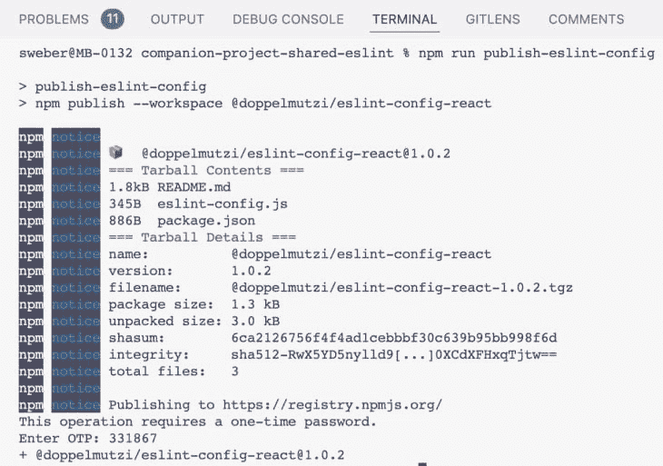
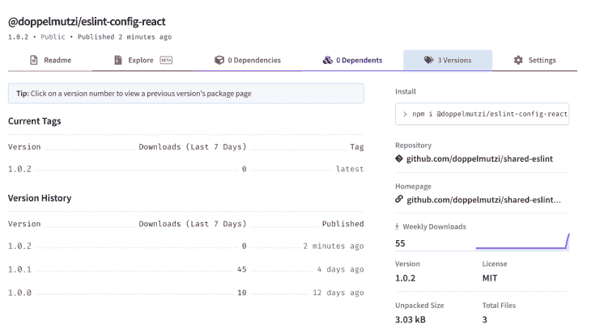

# 通过共享的 ESLint 和更漂亮的配置减少维护工作量

> 原文：<https://blog.logrocket.com/reduce-effort-shared-eslint-prettier-configs/>

如果你参与多个项目，你可能会在每个项目中使用相同的 [ESLint](https://eslint.org/) 和[beautiful](https://prettier.io/)设置。当然，使用同样方便的 ESLint 插件和配置有利于一致性，但是你必须从你的`package.json`、`.eslintrc.js`和`.prettierrc`中一遍又一遍地复制和粘贴你的依赖项:

对于每一个新的项目，这种方法会越来越多地导致维护问题。如果您想要(或者需要)定期地改变您的规则集，您必须接触所有的项目，并且手动地确保它们不会彼此偏离。

这不是一个枯燥的方法，这实质上意味着每条信息都应该有一个真实的来源。重复的代码(或其他信息)被认为是反模式，应该重构为唯一的表示。

当谈到减少您必须使用 ESLint 和更漂亮的配置进行复制的数量时，将它们捆绑到您自己的自定义 npm 包中可以节省大量时间和精力。使用这种方法，您只需在一个地方进行更改，发布一个新版本，并更新项目中的依赖项版本。此外，您可以添加或覆盖规则，或者添加特定于项目的配置。

在本帖中，我们将通过以下部分讨论如何捆绑您的 ESLint 和更漂亮的配置，以便更容易地跨项目使用:

## ESLint 和更漂亮的设置概述

要跟进，请看下面的 GitHub 项目:

一方面，ESLint 包是本文的基础，因为它包含了我长期以来在所有 React 项目中使用的首选 ESLint 配置。这个配置停用了 ESLint 的所有格式化规则，并确保了更漂亮的用于代码美化。

## 共享库的 Monorepo 设置

我的目标是提供两个 npm 包，将 ESLint 和更漂亮的配置外包到单独的 npm 包中。因此，我使用一个 monorepo 项目来促进包的单独发布，但这绝不是使用 monorepo 设置所必需的。这篇文章没有解释 monorepos 的 npm 工作空间是如何工作的，但是如果你对此感兴趣，你可以跟随我的[详细指南](https://blog.logrocket.com/exploring-workspaces-other-advanced-package-manager-features/)。

npm 项目的文件夹结构如下所示:

```
.
├── packages/
│   ├── eslint-config/
│   │   ├── eslint-config.js
│   │   └── package.json
│   └── prettier-config/
│       ├── package.json
│       └── prettier-config.json    
├── .gitignore
└── package.json

```

根`package.json`定义了工作区`eslint-config`和`prettier-config`的位置。

```
{
  "name": "Shared ESLint and Prettier config",
  "version": "1.0.0",
  "workspaces": [
    "packages/*"
  ],
  "scripts": {
    "publish-eslint-config": "npm publish --workspace @doppelmutzi/eslint-config-react",
    "publish-prettier-config": "npm publish --workspace @doppelmutzi/prettier-config"
  }
}

```

在脚本`publish-eslint-config`和`publish-prettier-config`的帮助下，您可以将每个包发布到各自的公共 [npm 注册表](https://www.npmjs.com/)。

说到包，接下来让我们深入研究包`@doppelmutzi/eslint-config-react`的实现。

## 共享 ESLint 配置(`@doppelmutzi/eslint-config-react`)

这个部分处理工作区`@doppelmutzi/eslint-config-react`，它暴露了我们的 ESLint 配置。

### `package.json`

让我们来看看我们在提供的 GitHub 回购中的`[eslint-config/package.json](https://github.com/doppelmutzi/shared-eslint/blob/main/packages/eslint-config/package.json)`。

```
{
    "name": "@doppelmutzi/eslint-config-react",
    "version": "1.0.0",
    "main": "./eslint-config.js",    
    "peerDependencies": {
        "@babel/eslint-parser": "7.16.5",
        "eslint": "8.5.0",
        "eslint-config-prettier": "8.3.0",
        "eslint-config-standard": "16.0.3",
        "eslint-import-resolver-node": "0.3.6",
        "eslint-plugin-import": "2.25.3",
        "eslint-plugin-node": "11.1.0",
        "eslint-plugin-prettier": "4.0.0",
        "eslint-plugin-promise": "6.0.0",
        "eslint-plugin-react": "7.28.0",
        "eslint-plugin-react-hooks": "4.3.0",
        "prettier": "2.5.1"
    },
    "scripts": {
        "publish-manual": "npm publish"
    },
    "publishConfig": {
        "access": "public"
    },
    // ...    
}

```

最重要的部分是`main`属性，它引用保存我们的 ESLint 配置的文件。我们一会儿就来看看。在发布新版本之前，需要设置`version`属性。

属性定义了你需要安装到你的项目中来使用我们的共享库的包。我将在使用这个库的 React 示例项目中进行更详细的介绍。

属性是特定于 npm 的，它使我们能够将这个项目发布到公共的 npm 注册表。`publish-manual`脚本只是使用内置的 npm CLI 命令来发布这个包。在本节的最后，我们将调用这个脚本来发布这个包的一个版本。

### `eslint-config.js`文件

[`eslint-config.js`](https://github.com/doppelmutzi/shared-eslint/blob/main/packages/eslint-config/eslint-config.js) 保存了我们希望在项目中重用的 ESLint 配置。我们可以随意命名它，但是必须在我们的`package.json`的`main`字段中引用它。

具体来说，这个文件保存您通常放入 [ESLint 配置文件](https://eslint.org/docs/user-guide/configuring/configuration-files#using-configuration-files) ( `.eslintrc`，`.eslintrc.js`)等的内容。)在您的项目中。

```
// .eslintrc.js
module.exports = {
  // ...
  extends: [
    "plugin:react/recommended",
    "standard",
    "plugin:prettier/recommended",
  ],
  parser: "@babel/eslint-parser",
  parserOptions: {
    ecmaFeatures: {
      jsx: true,
    },
    ecmaVersion: 12,
    sourceType: "module",
  },
  plugins: ["react"],
};

```

正如我在简介中描述的，这是我首选的 React 设置。

### 发布到 npm

让我们将它发布到公共 npm 注册中心。在`packages/eslint-config/`文件夹中，我们可以直接执行`$ npm run publish-manual`或者`$ npm publish`。此外，通过这个 npm 工作区设置，我们还可以使用根文件夹(`$ npm run publish-eslint-config`)中的脚本`publish-eslint-config`将其推送到注册表中。

```
{
  // root package.json
  "description": "Shared ESLint and Prettier config",
  "workspaces": [
    "packages/*"
  ],
  "scripts": {
    "publish-eslint-config": "npm publish --workspace @doppelmutzi/eslint-config-react",
    "publish-prettier-config": "npm publish --workspace @doppelmutzi/prettier-config"
  }
}

```



Execution and output of the `npm publish` command

确保您已经将`packages/eslint-config/package.json`中的版本号调整为新版本；否则你会得到一个`403`错误。如果出版工作，你会在 npm 上找到你的新版本。



Version gets published to npmjs

## 共享更漂亮的配置(`@doppelmutzi/prettier-config`)

在这一节中，我将解释如何将您的自定义漂亮配置外包到一个单独的包中，就像我在示例 GitHub repo 中对`@doppelmutzi/prettier-config`所做的那样。

### `package.json`

再来看看我们现在的`[prettier-config/package.json](https://github.com/doppelmutzi/shared-eslint/blob/main/packages/prettier-config/package.json)`。

```
{
    "name": "@doppelmutzi/prettier-config",
    "version": "1.0.0",
    "main": "./prettier-config.json",
    "peerDependencies": {
        "prettier": "2.5.1"
    },
    "publishConfig": {
        "access": "public"
    },
    "scripts": {
        "publish-manual": "npm publish"
    },
    // ...
}

```

同样，最有趣的部分是`main`字段，它指向提取的更漂亮的配置。

其他字段的含义与我们在 ESLint 部分给出的相同；唯一的对等依赖本身更漂亮。在下一节我们将包含这个库时，这将变得相关。

### `prettier-config.json`文件

[`prettier-config.json`](https://github.com/doppelmutzi/shared-eslint/blob/main/packages/prettier-config/prettier-config.json) 构成了[配置文件](https://prettier.io/docs/en/configuration.html)。我们将用它来覆盖 Prettier 的默认行为。

在我们的例子中，我们使用单引号(`singleQuote`)来定义 beauty，并避免在单个箭头函数参数(`arrowParens`)周围使用括号。

```
{
    "singleQuote": true,
    "arrowParens": "avoid"
}

```

### 发布到 npm

这类似于发布`@doppelmutzi/eslint-config-react`包。调整完`version`字段后，我们只需调用根文件夹中的`$ npm run publish-prettier-config`。

## 在 React 项目中使用共享库

我构建的 [React 示例项目](https://github.com/doppelmutzi/companion-project-use-shared-eslint)展示了如何使用我们的库。在这一节中，我将逐步解释如何在您自己的 React 项目中使用它。

### 安装定制的 ESLint 和更漂亮的软件包

要将这些库引入 React 项目，必须首先将它们作为依赖项添加。

```
# add eslint-config-react as dev dependency
$ npm i -D @doppelmutzi/eslint-config-react
# add prettier-config as dev dependency
$ npm i -D @doppelmutzi/prettier-config

```

### 安装对等依赖项

在这之后，我们必须安装我们在每个库的`package.json`文件中定义的对等依赖项。为此，我们可以利用 npm 包`[install-peerdeps](https://github.com/nathanhleung/install-peerdeps)`。

```
# install eslint-config-react's peer dependencies as dev peerDependencies
$ npx install-peerdeps --dev @doppelmutzi/eslint-config-react
# install prettier-config's peer dependencies as dev dependencies
$ npx install-peerdeps --dev @doppelmutzi/prettier-config

```

或者，您可以将在`peerDependencies`字段中定义的库复制到您的`package.json`的`devDependencies`部分，并调用`$ npm install`。

最后，您的`package.json`将会是这样的:

```
{
  // ...
  "devDependencies": {
    "@babel/eslint-parser": "7.16.5",
    "eslint": "8.5.0",
    "eslint-config-prettier": "8.3.0",
    "eslint-config-standard": "16.0.3",
    "eslint-import-resolver-node": "0.3.6",
    "eslint-plugin-import": "2.25.3",
    "eslint-plugin-node": "11.1.0",
    "eslint-plugin-prettier": "4.0.0",
    "eslint-plugin-promise": "6.0.0",
    "eslint-plugin-react": "7.28.0",
    "eslint-plugin-react-hooks": "4.3.0",
    "prettier": "2.5.1",
    // your other dependencies
  }
}

```

### 设置配置文件

最后一步是设置我们的配置文件`.eslintrc.js`和`.prettierrc`。要在`@doppelmutzi/eslint-config-react`中使用 ESLint 配置，您需要以下配置:

```
module.exports = {
  extends: ['@doppelmutzi/eslint-config-react'],
};

```

您仍然可以选择使用特定于项目的配置来覆盖或扩展此设置。
为了更美观的设置，你只需将以下内容放入`.prettierrc`。

```
"@doppelmutzi/prettier-config"

```

### 配置 VS 代码和 IntelliJ

最后一步是正确配置您的 IDE。我的首选设置是在保存时自动修复 ESLint 问题；因此，我需要提供一个配置来启用作为用户或工作区配置的保存操作。

对于工作区配置，您必须打开工作区设置，切换到 JSON 编辑器，并将以下内容粘贴到其中。

```
  "editor.codeActionsOnSave": {
    "source.fixAll": true,
    "source.fixAll.eslint": true
  },
  "editor.formatOnSave": true,
  "javascript.format.enable": false,
  "[javascript]": {
    "editor.formatOnSave": false
  },
  "[javascriptreact]": {
    "editor.formatOnSave": false
  },
  // ...

```

VS 代码在项目的根文件夹中生成一个`.vscode/settings.json`文件。来自配套项目的这个 [`settings.json`文件](https://github.com/doppelmutzi/companion-project-use-shared-eslint/blob/main/.vscode/settings.json)也包含了启用带有纱线浆果 PnP 项目的 ESLint 工作流程所需的配置。

要了解更多关于 ESLint 和 Yarn Berry 的信息，你可以阅读我之前关于包管理器的 LogRocket 文章。

要配置 IntelliJ，你必须进入**偏好菜单**的**代码质量工具**部分。选择**自动 ESLint 配置**让 IntelliJ 从`node_modules`文件夹中提取 ESLint 包。另外，还需要检查`Run eslint --fix on save`。


IntelliJ’s Code Quality Tools preferences to activate ESLint

## 结论

本文解释了如何在一个单独的包中提供 ESLint 和更漂亮的配置。有了这个地方，您就有了一个独特地方来存放支持可重用性的代码，并构成了一个单点真理。这种干巴巴的方法减少了维护工作量，因为更改只需进行一次，就能反映到所有应用中。

如果你想了解更多关于我在自己的 React 项目中使用 ESLint 和 Prettier 的方法，请随意阅读我在个人博客上发表的一些关于这个主题的文章:

## 您是否添加了新的 JS 库来提高性能或构建新特性？如果他们反其道而行之呢？

毫无疑问，前端变得越来越复杂。当您向应用程序添加新的 JavaScript 库和其他依赖项时，您将需要更多的可见性，以确保您的用户不会遇到未知的问题。

LogRocket 是一个前端应用程序监控解决方案，可以让您回放 JavaScript 错误，就像它们发生在您自己的浏览器中一样，这样您就可以更有效地对错误做出反应。

[](https://lp.logrocket.com/blg/javascript-signup)[https://logrocket.com/signup/](https://lp.logrocket.com/blg/javascript-signup)

[LogRocket](https://lp.logrocket.com/blg/javascript-signup) 可以与任何应用程序完美配合，不管是什么框架，并且有插件可以记录来自 Redux、Vuex 和@ngrx/store 的额外上下文。您可以汇总并报告问题发生时应用程序的状态，而不是猜测问题发生的原因。LogRocket 还可以监控应用的性能，报告客户端 CPU 负载、客户端内存使用等指标。

自信地构建— [开始免费监控](https://lp.logrocket.com/blg/javascript-signup)。