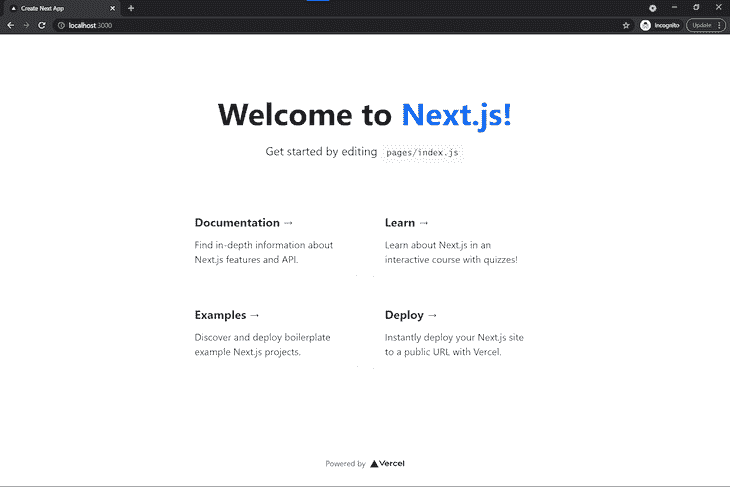

# 在 React 应用程序中渲染 JSON 动画

> 原文：<https://blog.logrocket.com/rendering-json-animations-react-applications/>

使用 JSON 动画可能有点棘手。没有太多的资源可以深入讨论它们，所以如果您选择在下一个 React 项目中使用 JSON 动画，您可能会很容易迷失方向。

在本教程中，我将分享我在自己构建的 React 应用程序中尝试渲染 JSON 动画的个人经验。我将介绍我所面临的挑战，我如何解决这些问题，以及在 React 应用程序中呈现 JSON 动画的简单方法。

虽然您可以在这个演示中使用任何框架，但我将使用 Next.js，因为它非常棒，速度非常快。你可以通过预先填充的链接查看 [React 项目](https://github.com/fullstackmafia/json-animation-react)和 [Next.js 项目](https://github.com/fullstackmafia/json-animation-nextjs)的源代码。我们开始吧！

### 目录

## Next.js 入门

首先，我们将从头开始创建一个 Next.js 项目。您可以使用下面的命令通过 IDE 的终端创建一个:

```
npx create-next-app

```

上面的命令创建了一个样板 Next.js 应用程序，可以通过`port 3000`上的 dev 服务器访问。导航到项目文件夹，使用以下代码启动项目:

```
cd front-end-app
npm run dev

```

您应该会在浏览器中看到下面的屏幕:



既然我们已经从头开始搭建了 Next.js 应用程序，让我们来看看真正的问题所在，部署动画！

## 使用 Lottie 和 Cloudinary 配置 Next.js

网络上的大多数 JSON 动画都是通过一个制作和托管动画的在线平台 [Lottie](https://lottiefiles.com/) 制作的。[洛蒂动画附带预配置的说明](https://blog.logrocket.com/creating-animations-lottie-react-native/)，用于在网页上添加和配置动画。

下面是我们将要使用的动画片段:

 [https://www.youtube.com/embed/GlN2v46Grvk?version=3&rel=1&showsearch=0&showinfo=1&iv_load_policy=1&fs=1&hl=en-US&autohide=2&wmode=transparent](https://www.youtube.com/embed/GlN2v46Grvk?version=3&rel=1&showsearch=0&showinfo=1&iv_load_policy=1&fs=1&hl=en-US&autohide=2&wmode=transparent)

视频

[https://youtu.be/GlN2v46Grvk](https://youtu.be/GlN2v46Grvk)

务必[注册一个](https://lottiefiles.com/login) [免费](https://lottiefiles.com/login) [洛蒂账户](https://lottiefiles.com/login)。在我们开始之前，让我们的 Next.js 应用程序看起来更像一个工作场所。

我们将用一系列书籍替换默认页面，包括每本书的详细信息以及一些照片。每本书的照片将被托管在一个基于云的图片管理服务上。下面的代码片段是针对图书收藏的:

```
// pages/index.js

  <h1 className={styles.title}>
          Welcome to our Book Store!
        </h1>
        <p className={styles.description}>
          Get started by browsing our collection
        </p>
        <div className={styles.grid}>
          <a className={styles.card}>
            <h2>Fiction</h2>
            <p>Find in-depth information all the fiction you can read!</p>
            
          </a>
          <a className={styles.card}>
            <h2>Science</h2>
            <p>Explore our books and learn all you can about science </p>
            
          </a>
          <a
            className={styles.card}
          >
            <h2>Engineering</h2>
            <p>Get in and learn our engineering best practices</p>
            
          </a>
          <a
            className={styles.card}
          >
            <h2>Product</h2>
            <p>
              Create amazing products with knowledge gotten from our books
            </p>
            
          </a>
        </div>

```

此时，您的页面应该看起来有点像下面的视频:

 [https://www.youtube.com/embed/X2OOV6SvNyU?version=3&rel=1&showsearch=0&showinfo=1&iv_load_policy=1&fs=1&hl=en-US&autohide=2&wmode=transparent](https://www.youtube.com/embed/X2OOV6SvNyU?version=3&rel=1&showsearch=0&showinfo=1&iv_load_policy=1&fs=1&hl=en-US&autohide=2&wmode=transparent)

视频

[https://youtu.be/X2OOV6SvNyU](https://youtu.be/X2OOV6SvNyU)

## 用 Lottie 渲染 Next.js 动画

现在，对于我们教程的主要部分，我们将使用 Lottie 渲染一个动画。首先，将 Lottie 的 web 组件添加到您的应用程序中，这可以通过一个`script`标签来实现。将下面的标签插入到你的应用程序的`pages/index.js`文件的`Head`部分:

```
<script src="https://unpkg.com/@lottiefiles/[email protected]/dist/lottie-player.js"></script>

```

接下来，你需要获得你的动画的 URL，你可以通过上传你的 JSON 动画到你的 Lottie 账户来获得。最后，您必须在代码中使用 Lottie 的`<lottie-player>`元素来渲染动画。另外，确保动画的 URL 出现在`src`属性中，如下所示:

```
 <lottie-player src="URL HERE" background="transparent"  speed="1"  style="width: 300px; height: 300px;" loop controls autoplay></lottie-player>

```

上面的元素还包含预配置的设置，您可以根据需要更改这些设置来改变动画的尺寸:

*   `autoplay`:表示页面加载后是否播放动画
*   `loop`:表示动画是否应该循环播放
*   `style`:表示动画的任何额外配置，如样式、边框等。
*   `controls`:指示播放控件是否应与动画一起呈现
*   `speed`:表示动画的播放速度

由于我们正在使用 Next.js 框架并编写 JSX，我们需要对`<lottie-player>`元素做一些修改:

```
  <lottie-player src="URL HERE" background="transparent"  speed="1"  style={{width: "300px", height: "300px"}} loop controls autoplay></lottie-player>

```

现在，您应该会看到页面上的动画。保存您的更改并进行硬刷新:

 [https://www.youtube.com/embed/uV1Hta1Fn_8?version=3&rel=1&showsearch=0&showinfo=1&iv_load_policy=1&fs=1&hl=en-US&autohide=2&wmode=transparent](https://www.youtube.com/embed/uV1Hta1Fn_8?version=3&rel=1&showsearch=0&showinfo=1&iv_load_policy=1&fs=1&hl=en-US&autohide=2&wmode=transparent)

视频

[https://youtu.be/uV1Hta1Fn_8](https://youtu.be/uV1Hta1Fn_8)

## 使用 Lottie 和 Next.js 的限制

虽然和洛蒂一起工作很棒，但我注意到它有很多缺点。和洛蒂在一起时，我找不到这样做的方法。相反，我不得不公开托管我的动画，让每个人都可以使用。

这促使我寻找一个替代的解决方案，同时仍然保留我选择的框架。谢天谢地，我找到了一个有[反应的——洛蒂](https://github.com/chenqingspring/react-lottie)。

## react-lottie:使用 JSON 动画和 react

React 生态系统的一个不可否认的优势是它获得了大量的支持，从为 React 应用程序开发的第三方包的数量就可以看出这一点。

在 React 中处理动画是可能的，这要感谢一个名为 react-lottie 的包，它包装了 Adobe 的 [Bodymovin](https://exchange.adobe.com/creativecloud.details.12557.bodymovin.html) 插件，以将动画导出或转换为 JSON 格式。为了探索 react-lottie 如何工作，让我们从头开始创建一个新的 react 项目:

```
npx create-react-app animation-demo

```

导航到您新创建的应用程序并安装 react-lottie，如下所示:

```
cd animation-demo

npm install react-lottie

```

接下来，让我们将 JSON 动画添加到 React 项目中。在项目的`/src`目录中，创建一个名为`animations`的文件夹。在其中，添加您的 JSON 文件。注意，你可以通过注册[洛蒂](https://lottiefiles.com/)来下载 JSON 动画。

让我们创建一个组件来处理我们的动画。在`/src`目录中，创建第二个名为`components`的文件夹。在`components`中，创建一个名为`AnimationPage`的 JSX 文件:

```
// src/components/AnimationPage.jsx

import React, { Component } from 'react';
import Lottie from 'react-lottie';
import animationData from '../animations/data.json'
class AnimationPage extends Component {
    render() {
        const defaultOptions = {
            loop: true,
            autoplay: true,
            animationData: animationData,
            renderer: 'svg'
        }
        return (
            <div>
               <Lottie
                options={defaultOptions}
                height={500}
                width={500}
               />
            </div>
        )
    };  
}
export default AnimationPage;

```

在上面的代码片段中，我们导入了 JSON 动画，并配置了用于呈现该动画的选项。我们的配置设置包括以下内容:

*   `loop`:一个布尔值，它决定动画是否应该在显示器上循环播放
*   `autoplay`:一个布尔值，它决定是否在页面加载完成后立即播放动画
*   `renderer`:表示应该以何种文件格式渲染动画

我们还导入了一个`Lottie`组件，用于处理要显示的动画。有了这个组件，我们将配置设置作为道具传递，并配置动画的`width`和`height`。

现在，让我们保存它并将`AnimationPage`组件导入到我们项目的`App.js`文件中:

```
 src/App.js

import './App.css';
import AnimationPage from './components/AnimationPage';
function App() {
  return (
    <div className="App">
      <AnimationPage/>
    </div>
  );
}
export default App;

```

让我们保存并重新加载我们的应用程序。您应该会看到动画浮动:

 [https://www.youtube.com/embed/Gq4rRZm3f1I?version=3&rel=1&showsearch=0&showinfo=1&iv_load_policy=1&fs=1&hl=en-US&autohide=2&wmode=transparent](https://www.youtube.com/embed/Gq4rRZm3f1I?version=3&rel=1&showsearch=0&showinfo=1&iv_load_policy=1&fs=1&hl=en-US&autohide=2&wmode=transparent)

视频

[https://youtu.be/Gq4rRZm3f1I](https://youtu.be/Gq4rRZm3f1I)

让我们通过创建一个功能组件来包含我们的图书详细信息，从而将我们的图书收藏添加到新创建的 React 项目中。在`components`文件夹中，创建一个名为`BookPage`的新 JSX 组件:

```
// src/components/BookPage.jsx

import React from 'react';
import '../styles/BookPage.css'
function BookPage()  {
    return(
        <main className="main">
          <h1 className="title">Welcome to our Book Store!</h1> 
          <p className="description">Get started by browsing our collection</p>
          <div className="grid">
            <a className="card">
              <h2>Fiction</h2>
              <p>Find in-depth information all the fiction you can read!</p>
              
            </a>

          // ....

          </div>
        </main> 
    ) 
}
export default BookPage;

```

现在，保存并刷新您的应用程序。它应该类似于 Next.js 应用程序:

 [https://www.youtube.com/embed/z4kjJxw42ng?version=3&rel=1&showsearch=0&showinfo=1&iv_load_policy=1&fs=1&hl=en-US&autohide=2&wmode=transparent](https://www.youtube.com/embed/z4kjJxw42ng?version=3&rel=1&showsearch=0&showinfo=1&iv_load_policy=1&fs=1&hl=en-US&autohide=2&wmode=transparent)

视频

[https://youtu.be/z4kjJxw42ng](https://youtu.be/z4kjJxw42ng)

## 结论

React 有一个非常健康的生态系统，支持前端工程师蓬勃发展。开发人员通常可以在各种工具、插件和包的帮助下解决利基用例中的问题。

在本教程中，我们解决了在 Lottie 中使用 react-lottie 渲染 JSON 动画时出现的问题，react-Lottie 是 Adobe body movin 扩展的包装器。您可以应用本文中的信息在自己的 React 主题应用程序中呈现 JSON 应用程序。我希望你喜欢这篇文章，如果你有任何问题，一定要留下评论。

## [LogRocket](https://lp.logrocket.com/blg/react-signup-general) :全面了解您的生产 React 应用

调试 React 应用程序可能很困难，尤其是当用户遇到难以重现的问题时。如果您对监视和跟踪 Redux 状态、自动显示 JavaScript 错误以及跟踪缓慢的网络请求和组件加载时间感兴趣，

[try LogRocket](https://lp.logrocket.com/blg/react-signup-general)

.

[ ](https://lp.logrocket.com/blg/react-signup-general) [](https://lp.logrocket.com/blg/react-signup-general) 

LogRocket 结合了会话回放、产品分析和错误跟踪，使软件团队能够创建理想的 web 和移动产品体验。这对你来说意味着什么？

LogRocket 不是猜测错误发生的原因，也不是要求用户提供截图和日志转储，而是让您回放问题，就像它们发生在您自己的浏览器中一样，以快速了解哪里出错了。

不再有嘈杂的警报。智能错误跟踪允许您对问题进行分类，然后从中学习。获得有影响的用户问题的通知，而不是误报。警报越少，有用的信号越多。

LogRocket Redux 中间件包为您的用户会话增加了一层额外的可见性。LogRocket 记录 Redux 存储中的所有操作和状态。

现代化您调试 React 应用的方式— [开始免费监控](https://lp.logrocket.com/blg/react-signup-general)。