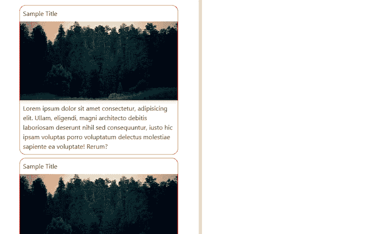
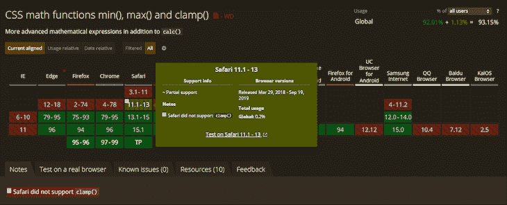

# 使用 Fab Four 技术的响应式 CSS 边界半径

> 原文：<https://blog.logrocket.com/responsive-css-border-radius-fab-four-technique/>

在过去的几年里，浏览器对各种 CSS 特性的支持已经有了长足的进步。虽然垂直居中一个`div`是我们用这种方式相当容易执行的事情，但是我们仍然缺少一些关键的特性。

你可能已经熟悉了`media-queries`，它基于浏览器视窗或屏幕分辨率应用样式，但有时我们可能需要`[container-queries](https://developer.mozilla.org/en-US/docs/Web/CSS/CSS_Container_Queries)`，它仍然只在某些浏览器的`feature`标志下可用。

今天我们将实现 Fab Four 技术，根据元素的`container`维度，而不是`screen`宽度，对元素应用`border-radius`。

> **作者注**:我最近在[推特](https://twitter.com/shadeed9/status/1444683275616854022)上偶然发现了这个技巧，在那里 [Frank Yan](https://twitter.com/frankyan) (一位脸书工程师)进一步解释了它的含义。在这个帖子中，有人建议这段代码不应该是“人写的”，所以我在这篇博文的结尾为你做了介绍。

## 这种技术有什么作用？

Fab Four 技术可以通过使用各种 CSS 函数来实现，如`min`、`max`、`calc`和`clamp`，以计算是否应该应用特定的 CSS 规则，同时将其与容器元素的维度而不是设备视口进行比较。

让我们来看看下面的演示，其中几个`card`组件被包装在一个可调整大小的容器中:

参见 [CodePen](https://codepen.io) 上 Kiril Peyanski([@ kspeyanski](https://codepen.io/kspeyanski))
的未命名的笔。

这里我们想要实现的特定需求是，每当卡片的容器宽度小于`400px`时，就移除卡片的`border-radius`。



> **作者注**:用`console.log`相当于调试的 CSS 是`border: 1px solid red`，用了应该不会心疼！

深入研究我们的代码，我们可以观察到下面的`border-radius`计算:

```
css
.dynamic-card {
  border-radius: max(0px, min(16px, (100% - 400px + 1px) * 9999)) / 16px;
}

```

乍一看可能很奇怪，但是我们将检查每个计算并进一步解释它。我们希望确定代码中的以下变量:

*   期望的`border-radius`
*   集装箱宽度`breakpoint`

```
css
.dynamic-card {
  border-radius: max(0px, min(DESIRED_BORDER_RADIUS, (100% - WIDTH_BREAKPOINT + 1px) * 9999)) / DESIRED_BORDER_RADIUS;
}
```

为了深入研究上面的 CSS 规则，我们必须将它分成三个不同的计算:

*   `min`计算
*   `max`计算
*   `division`按像素

### `min`计算

```
css
  min(DESIRED_BORDER_RADIUS, (100% - WIDTH_BREAKPOINT + 1px) * 9999)

```

这里发生了什么事？嗯，首先我们必须考虑`100%`在做什么。将`width: 100%`设置为 CSS 元素会(在大多数情况下)将元素扩展到其整个容器宽度，这意味着当在`min`函数中使用`100%`时，它将总是返回我们容器的`width`。

这意味着如果我们的容器是`480px`宽，并且我们已经定义了一个`400px`的`WIDTH_BREAKPOINT`，计算将是:

```
css
  /* 480px - 400px + 1px = 81px * 9999 = a really big POSITIVE number */
  min(DESIRED_BORDER_RADIUS, (480px - 400px + 1px) * 9999)

```

计算的`* 9999`部分只是为了确保我们总是高于`max`值或者低于`min`值。否则，我们可能会处于两者之间。

看一下容器宽度小于我们预定义的断点的另一种情况:

```
css
  /* 320px - 400px + 1px = -79px * 9999 = a really big NEGATIVE number */
  min(DESIRED_BORDER_RADIUS, (320px - 400px + 1px) * 9999)

```

由于我们有一个`min`函数，我们通过计算得到以下结果:

*   当`container`宽度大于`breakpoint`宽度时，最终结果将是`DESIRED_BORDER_RADIUS`(或本例中的`16px`)
*   当`container`宽度低于`breakpoint`时，我们得到一个负数(或者在我们的例子中是`-789,921`)

`max`计算
这是我们复杂计算集合中要调用的下一个函数:

```
css
  max(0px, RESULT_FROM_MIN)

```

我们已经知道我们会得到一个正的边界半径或者一个负数。通过应用`min`计算的结果，我们得到以下结果:

*   当`container`宽度大于`breakpoint`宽度时:`RESULT_FROM_MIN`(或本例中的`16px`)
*   当`container`宽度低于`breakpoint`时:`0px`

### `/ DESIRED_BORDER_RADIUS`计算

```
css
  border-radius: RESULT_FROM_MAX / DESIRED_BORDER_RADIUS;

```

这不是一个`division`操作符，而是一个[扩展语法](https://developer.mozilla.org/en-US/docs/Web/CSS/border-radius#values)，用于将`border-radius`应用于一个元素。上面的代码将被评估(注意丢失的`/`字符):

```
css
  border-top-left-radius:     RESULT_FROM_MAX DESIRED_BORDER_RADIUS;
  border-top-right-radius:    RESULT_FROM_MAX DESIRED_BORDER_RADIUS;
  border-bottom-right-radius: RESULT_FROM_MAX DESIRED_BORDER_RADIUS;
  border-bottom-left-radius:  RESULT_FROM_MAX DESIRED_BORDER_RADIUS;

```

这很重要，因为 CSS 解析引擎对我们试图用`min`和`max`函数定义边界半径的方式不太满意，所以我们使用这个巧妙的小技巧。

我们可以使用`clamp`功能作为替代，但我们避免这样做，因为它在 Safari 12 中不支持。



这项技术依赖于我们的 CSS 解析引擎来计算`100%`。这个百分比将评估为我们容器的`width`，而不是我们可以在`media-queries`中使用的`screen width`。

下面的代码在大多数情况下可以工作，但是当我们有一个可调整大小的容器时就会失败，如上例所示:

```
css
.dynamic-card {
    border-radius: 0;
}
@media screen and (min-width: 400px) {
  .dynamic-card {
    border-radius: 16px;
  }
}

```

### 颠倒逻辑

根据应用要求，Fab Four 技术可以应用于多种情况。有时，每当容器`width`小于特定的`breakpoint`时，应该应用特定的规则。在这种情况下，我们可以颠倒逻辑:

出发地:

```
(100% - WIDTH_BREAKPOINT + 1px) * 9999))

```

收件人:

```
(WIDTH_BREAKPOINT - 1px - 100%) * 9999))

```

这将仅在`width`低于`breakpoint`时应用期望的`value`。

## 公用事业

让我们面对这样一个事实，即使你很熟悉这个技术，这个计算也不是简单易懂的。幸运的是，我们可以提取 SASS mixins，或者各种 CSS-in-JS 库的实用函数(比如 [styled-components](https://styled-components.com/) )。

### 带有 CSS 变量的原生 CSS

```
css
  .dynamic-card {
    --border-radius: 16px;
    --breakpoint: 400px;
  }
  .dynamic-border {
    border-radius: max(0px, min(var(--border-radius), (100% - var(--breakpoint) + 1px) * 9999)) / var(--border-radius);
  }

```

### 萨斯米辛

以下 [SASS mixin](https://sass-lang.com/documentation/at-rules/mixin) 帮助我们在基于 SASS 的项目中实现 Fab Four 技术:

```
scss
@mixin dynamic-border-radius($value, $breakpoint) {
  & {
    border-radius: #{"max(0px, min(#{$value}, 100% - #{$breakpoint} + 1px) * 9999) / #{$value}"};
  }
}
.dynamic-card {
  @include dynamic-border-radius(16px, 400px);
}

```

### CSS-in-JS

```
import styled, { css } from 'styled-components';
const dynamicBorderRadius = (value, breakpoint) => css`
  border-radius: max(0px, min(${value}px, 100% - ${breakpoint}px + 1px) * 9999) /
    ${value}px;
`;
const Card = styled('div')`
    ${dynamicBorderRadius(16, 400)};
`;

```

## 结论

随着网络的发展，我们将会看到更多像`container-queries`这样的特性在大多数网络浏览器中实现。在这一天到来之前，我们可以使用 Fab Four 这样的技术来实现特定的应用程序需求，这些需求看起来并不总是那么简单。

## 你的前端是否占用了用户的 CPU？

随着 web 前端变得越来越复杂，资源贪婪的特性对浏览器的要求越来越高。如果您对监控和跟踪生产环境中所有用户的客户端 CPU 使用、内存使用等感兴趣，

[try LogRocket](https://lp.logrocket.com/blg/css-signup)

.

[](https://lp.logrocket.com/blg/css-signup)[https://logrocket.com/signup/](https://lp.logrocket.com/blg/css-signup)

LogRocket 就像是网络和移动应用的 DVR，记录你的网络应用或网站上发生的一切。您可以汇总和报告关键的前端性能指标，重放用户会话和应用程序状态，记录网络请求，并自动显示所有错误，而不是猜测问题发生的原因。

现代化您调试 web 和移动应用的方式— [开始免费监控](https://lp.logrocket.com/blg/css-signup)。