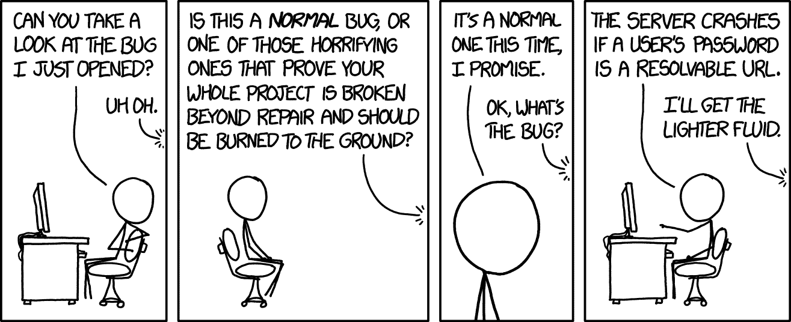
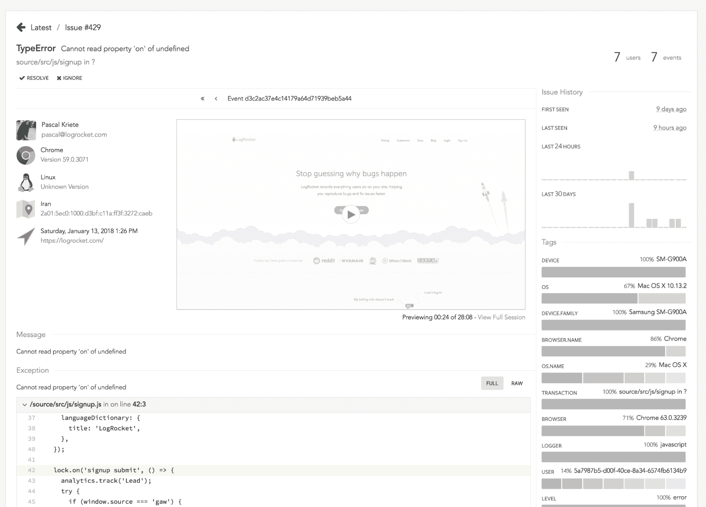
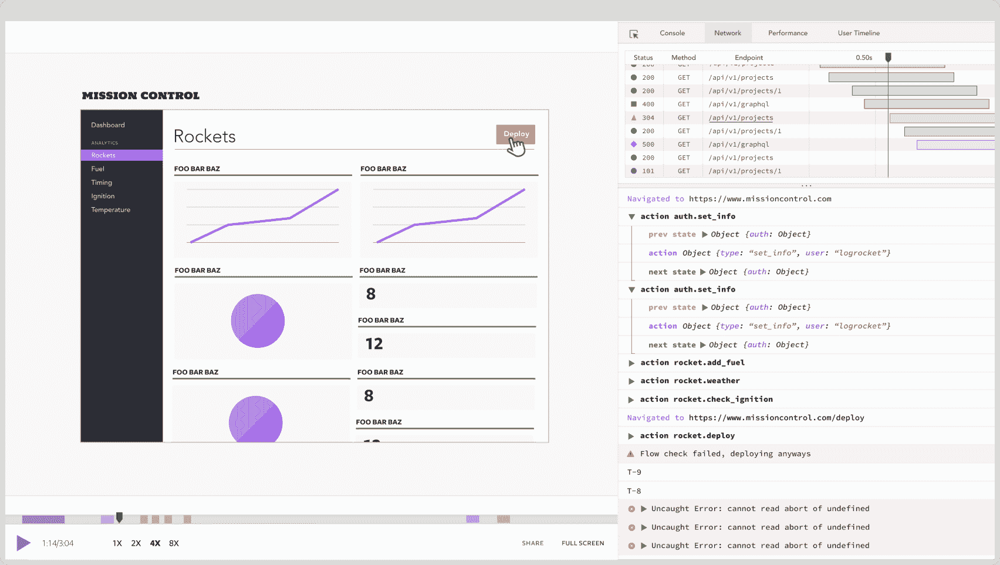
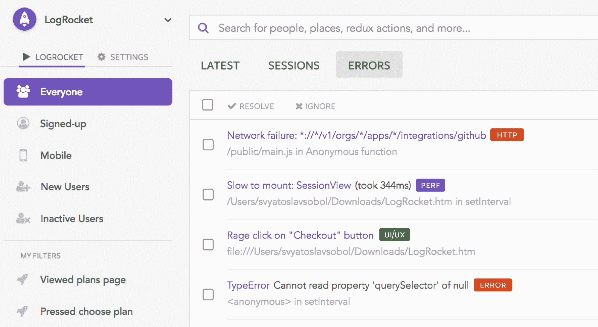

# 反思前端错误报告

> 原文：<https://blog.logrocket.com/rethinking-front-end-error-reporting/>

理解网络应用中的问题很难。在神秘的 JavaScript 错误、用户报告的 bug 和 QA 中发现的问题之间，有一个持续的斗争来超越影响用户的问题。这些只是显而易见的问题——大多数 bug 实际上从未被报告过，因为有糟糕体验的用户只是离开或默默忍受。

传统的错误报告工具(如 BugSnag、Sentry 和 Rollbar)只能解决部分问题。最初是为记录服务器端错误而设计的，后来随着前端应用程序变得越来越复杂，他们增加了浏览器 SDK。虽然这些工具捕获了一些有用的信息，如堆栈跟踪和元数据，但许多团队发现它们的警报噪音太大(误报太多而无用)，并且它们没有捕获足够的上下文来阐明复杂的问题。

## 前端是不同的

调查前端和后端错误是非常不同的过程。服务器端代码运行在单一平台上。通常，系统中可能导致难以重现的错误的唯一状态来自于容易记录的事件，如数据库或缓存查询。当服务器代码中发生未处理的异常时，通常意味着有一个明显的问题需要解决。

在前端，事情没有这么简单。一般的 web 应用程序运行在超过 15 种不同的浏览器上，跨越数百种设备类型。状态可能非常复杂，来自内存、本地存储、本地数据库、服务人员和 API。一个 web 应用程序必须对连接问题和跨浏览器差异具有鲁棒性，并且不像后端，异常通常是明确的，它可能很难衡量对前端的影响。

考虑到前端开发人员看到的错误的频率和多样性，最重要的问题变成了，*这影响到用户了吗？*不幸的是，只看堆栈跟踪和异常消息，很难知道。这是一个导致瘫痪的 bug 吗？或者只是一个麻烦。

## 回答正确的问题

You never quite know how things will break. (credit: xkcd.com)

两年前，我们开始思考完美的前端 bug 报告应该是什么样的。显然，它将收集基本信息，如堆栈跟踪、元数据和频率直方图。但是要真正衡量对用户的影响，特别是对于难以重现的错误，它必须让你实际上*看到*发生了什么。

LogRocket 是我们在这方面的大胆尝试——重现一个问题，就像它发生在你自己的浏览器中一样。

## 都在视频里了

LogRocket 错误报告的中心是一个像素完美的视频，它准确地捕捉了用户在屏幕上看到的内容。为了在不影响性能的情况下做到这一点，LogRocket 对 DOM 进行了检测，以记录问题发生时页面上的 HTML 和 CSS。

此外，LogRocket 记录控制台日志、JavaScript 错误、堆栈跟踪、带有头+体的网络请求/响应、浏览器元数据和自定义日志。它还与 React、Redux 和 Angular 等库进行了深度集成，以记录操作和应用程序状态。

观看视频是快速了解某个异常是否真正影响了用户的最快方法。如果发生了，您可以通过检查网络请求、日志和应用程序状态，轻松地找出发生了什么。

## 用户报告的错误

当用户寻求帮助时——无论是通过帮助台、电子邮件，还是最糟糕的是在 Twitter 上——支持人员和开发人员能够迅速了解问题所在是至关重要的。不幸的是，这通常意味着要求用户提供截图、日志和重现步骤。

使用 LogRocket，您只需搜索用户并重放他们遇到问题或请求支持的会话。我们已经与大多数帮助台建立了集成，如 Intercom，让您可以直接从聊天中查看用户的历史记录。

有时候，不清楚用户是感到困惑还是真的遇到了错误。通过查看视频回放以及他们会话中的控制台和网络日志，您可以很容易地做出这种区分。

大多数 bug 都不是显式的异常

## 虽然监控和修复 JavaScript 异常对于应用程序的健康至关重要，但现实是用户遇到的大多数问题都不是显式的代码错误，也从未被报告过。UI 故障，缓慢的性能，破碎的界面，甚至混乱的 UX 都会对用户的快乐和你的底线产生负面影响。

如果前端团队希望能够快速发布新特性，他们必须确信这些问题正在被主动检测到并浮出水面。

此外，任何类型的问题都必须是可信的——如果有太多的误报，警报就会被忽略。

我们的使命:揭露所有负面影响用户的前端问题

## JavaScript 异常只是我们在 LogRocket 中开始出现的第一类“问题”。我们在前端收集的遥测数据让我们可以检测性能问题、接口故障、混乱的 UX 等等。我们已经开始与 Reddit、Twitch 和 AOL 等精选客户合作，以解决这些问题，并将在未来几个月内向更多客户推出。

如果你是 LogRocket 的现有客户，或者想开始与我们合作，[联系](/cdn-cgi/l/email-protection#55262025253a272115393a32273a363e30217b363a38)，你就可以加入测试版。

前端是未来

## 向丰富的单页应用的转变无疑提高了用户体验质量和开发人员的工作效率。但是随着复杂性的增加，需要更多的可观察性。现有的工具还不足以让团队对他们发布的前端代码有信心。

在 LogRocket，我们已经朝着我们认为的解决方案迈出了一大步，但还有很多工作要做。如果你想帮助前端开发人员定义下一代工具，我们很乐意见到你。我们正在[招聘](https://logrocket.com/company)🙂

At LogRocket, we’ve taken what we believe is a big step toward a solution — but there’s lots more work to do. If you want to help define the next generation of tooling for frontend developers, we’d love to meet you. We’re [hiring](https://logrocket.com/company) 🙂