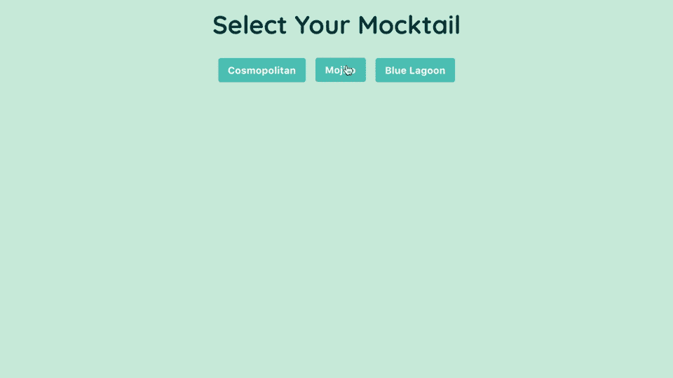
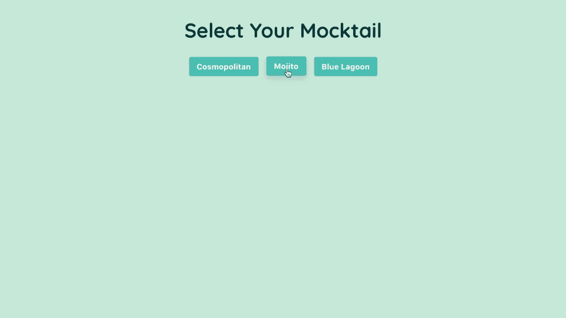
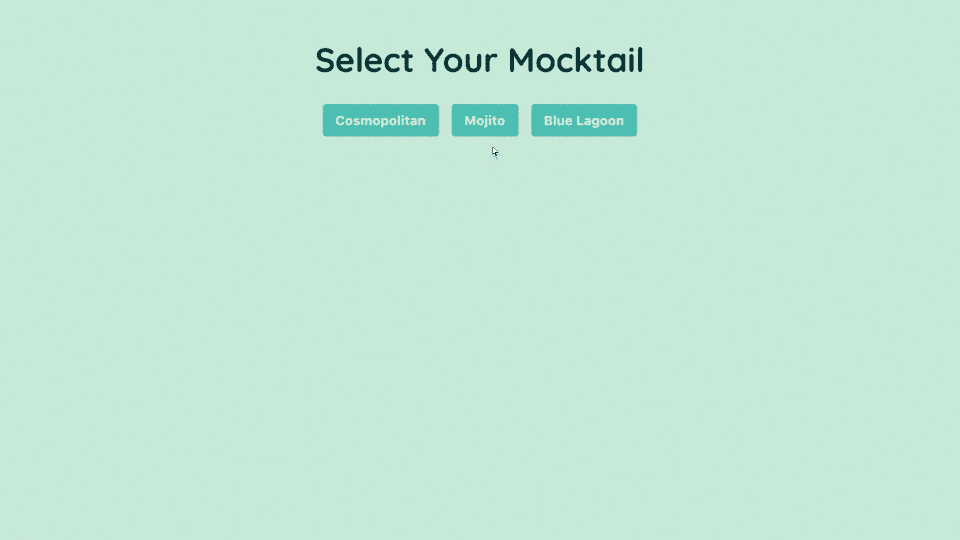
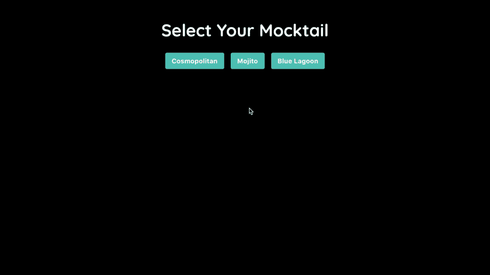

# 从 React 16 中的 setState 返回 null

> 原文：<https://blog.logrocket.com/returning-null-from-setstate-in-react-16-5fdb1c35d457/>

### 概观

React 16 让您决定是否通过`.setState`更新状态，以防止不必要的 DOM 更新。用`null`调用`.setState`不再触发 React 16 的更新。

我们将通过重构一个 mocktail 选择应用程序来探索这是如何工作的，即使我们选择了同一个 mocktail 两次，它也会更新。



Our mocktail selection app.

文件夹结构可能如下所示:

```
src
 |-> App.js
 |-> Mocktail.js
 |-> index.js
 |-> index.css
 |-> Spinner.js
```

[](https://logrocket.com/signup/)

### 我们的应用程序如何工作

我们的应用程序将呈现一个选定的 mocktail。我们可以通过点击其中一个按钮来选择/切换模拟尾巴。当我们这样做时，一个新的 mocktail 被加载，一个新的 mocktail 图像在加载完成后被呈现。

`App`组件——父组件——有一个`mocktail`状态和一个处理 mocktail 更新的`updateMocktail`方法。

```
import React, { Component } from 'react';

import Mocktail from './Mocktail';

class App extends Component {

  state = {
    mocktail: ''
  }

  updateMocktail = mocktail => this.setState({ mocktail })

  render() {

    const mocktails = ['Cosmopolitan', 'Mojito', 'Blue Lagoon'];

    return (
      <React.Fragment>
        <header>
          <h1>Select Your Mocktail</h1>
          <nav>
            {
              mocktails.map((mocktail) => {
                return <button 
                  key={mocktail}
                  value={mocktail}
                  type="button"
                  onClick={e => this.updateMocktail(e.target.value)}>{mocktail}</button>
              })
            }
          </nav>
        </header>
        <main>
            <Mocktail mocktail={this.state.mocktail} />
        </main>
      </React.Fragment>
    );
  }
}

export default App;
```

在`button`元素的`onClick`事件上调用`updateMocktail`方法，并且`mocktail`状态被传递给子组件`Mocktail`。

`Mocktail`组件有一个名为`isLoading`的加载状态，当这个状态为真时，就会呈现出`Spinner`组件。

```
import React, { Component } from 'react';

import Spinner from './Spinner';

class Mocktail extends Component {

    state = {
        isLoading: false
    }

    componentWillReceiveProps() {
        this.setState({ isLoading: true });
        setTimeout(() => 
            this.setState({
                isLoading: false
            }), 500);
    }

    render() {

        if (this.state.isLoading) {
            return <Spinner/>
        }

        return (
            <React.Fragment>
                <div className="mocktail-image">
                    
                </div>
            </React.Fragment>
        );
    }
}

export default Mocktail;
```

在`Mocktail`组件的`componentWillReceiveProps`生命周期方法中调用`setTimeout`，将加载状态设置为`true`，持续 500 毫秒。

每当`Mocktail`组件的 props 用新的`mocktail`状态更新时，它显示加载微调器半秒钟，然后呈现 mocktail 图像。

### 问题是

现在，这样做的问题是无论如何,`mocktail`状态会被更新并触发`Mocktail`组件的重新呈现——即使状态实际上没有改变。

例如，每次我点击 **Mojito** 按钮，我们都会看到应用程序不必要地重新渲染 Mojito 图像。React 16 提供了状态性能改进，如果状态的新值与其现有值相同，我们可以通过在`setState`中返回`null`来防止触发更新。



### 解决方案

以下是我们将遵循的步骤，以防止不必要的重新渲染:

1.  检查状态的新值是否与现有值相同
2.  如果值相同，我们将返回`null`
3.  返回`null`不会更新状态，也不会触发组件重新渲染

因此，首先，在`App`组件的`updateMocktail`方法中，我们将创建一个名为`newMocktail`的常量，并为它分配为`mocktail`传递的值。

```
updateMocktail = mocktail => {  
  const newMocktail = mocktail;    
  this.setState({     
    mocktail  
  })  
}
```

因为我们将基于以前的状态检查和设置状态，而不是传递`setState`和`object`，所以我们将传递一个函数，该函数将以前的状态作为参数。然后我们将检查`mocktail`状态的新值是否与现有值相同。

如果值相同，`setState`将返回`null`。否则，如果值不同，`setState`将返回更新后的`mocktail`状态，这将触发用新状态重新呈现`Mocktail`组件。

```
updateMocktail = mocktail => {
  const newMocktail = mocktail;  
  this.setState(state => {
    if (state.mocktail === newMocktail) {
      return null;
    } else {
      return { mocktail };
    }  
  })  
}
```



现在，单击一个按钮仍然会加载它各自的 mocktail 图像。但是，如果我们为同一个 mocktail 再次单击按钮，React 不会重新呈现`Mocktail`组件；因为`setState`正在返回`null`，所以没有状态变化来触发更新。

我在下面的两张 gif 中突出显示了 React DevTools 中的更新:



Before returning null (above) vs. after returning null (below).

> **注意:**我在这里使用了深色主题，这样使用 React DevTools 突出显示更新特性可以更容易地观察 React DOM 中的更新。

### 结论

现在我们已经介绍了在 React 16 中从`setState`返回 null。我在下面的 CodeSandbox 中添加了 mocktail 选择应用程序的完整代码，供您使用。

用`null`防止不必要的状态更新和重新渲染可以让我们的应用程序执行得更快，让应用程序执行得更快的全部意义在于改善我们应用程序的用户体验。

用户不会无缘无故地偶然发现一个产品。用户对产品的感受直接反映了他们对公司及其产品的看法，因此我们需要确保以一种自然、直观的方式围绕用户的期望构建体验。

我希望这篇文章对你有所帮助。我希望听到您的反馈！

**感谢您的阅读！**

## [LogRocket](https://lp.logrocket.com/blg/react-signup-general) :全面了解您的生产 React 应用

调试 React 应用程序可能很困难，尤其是当用户遇到难以重现的问题时。如果您对监视和跟踪 Redux 状态、自动显示 JavaScript 错误以及跟踪缓慢的网络请求和组件加载时间感兴趣，

[try LogRocket](https://lp.logrocket.com/blg/react-signup-general)

.

[ ](https://lp.logrocket.com/blg/react-signup-general) [](https://lp.logrocket.com/blg/react-signup-general) 

LogRocket 结合了会话回放、产品分析和错误跟踪，使软件团队能够创建理想的 web 和移动产品体验。这对你来说意味着什么？

LogRocket 不是猜测错误发生的原因，也不是要求用户提供截图和日志转储，而是让您回放问题，就像它们发生在您自己的浏览器中一样，以快速了解哪里出错了。

不再有嘈杂的警报。智能错误跟踪允许您对问题进行分类，然后从中学习。获得有影响的用户问题的通知，而不是误报。警报越少，有用的信号越多。

LogRocket Redux 中间件包为您的用户会话增加了一层额外的可见性。LogRocket 记录 Redux 存储中的所有操作和状态。

现代化您调试 React 应用的方式— [开始免费监控](https://lp.logrocket.com/blg/react-signup-general)。

* * *