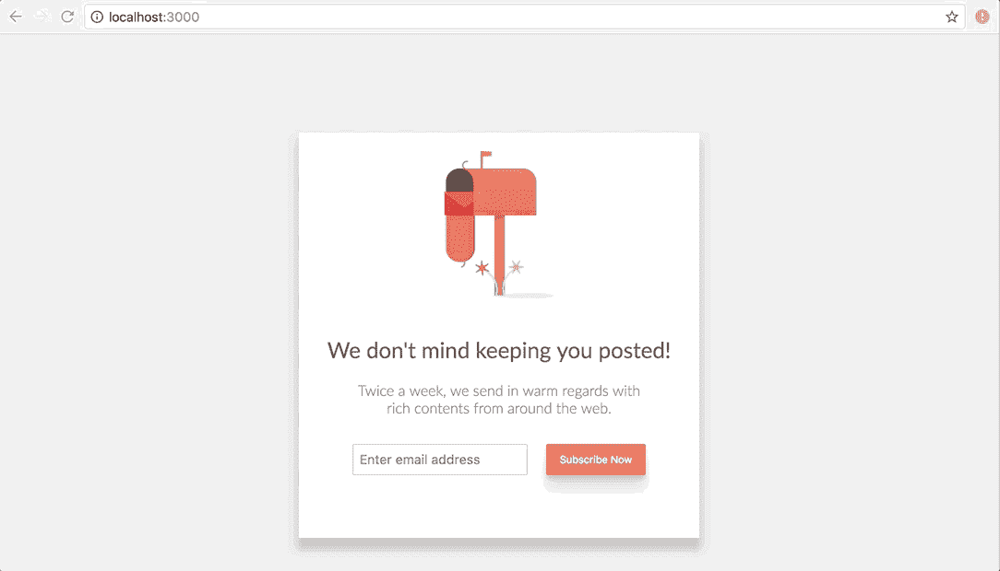

# 用 React Router 制作路由转换动画

> 原文：<https://blog.logrocket.com/routes-animation-transitions-in-react-router-v4-9f4788deb964/>


React Router v4 为构建支持导航的 React 应用程序提供了直观的声明式 API。然而，在构建需要运动的 ui 时，文档、堆栈溢出或博客中并没有多少解释如何在路线之间设置动画。

在本文中，我们将使用新的 React 路由器(v4)创建一个 React 应用程序，并在视图之间导航时添加一些动画。在本教程的最后，你将看到如何使用高阶组件(HOC)来用 React 的`CSSTransitionGroup`插件组成你的组件。

这是我们将构建的应用程序的预览:

[](https://logrocket.com/signup/)

### 创建新的 React 项目

本文的所有例子都可以在 Codesandbox.io 中找到，但是在一个真实的项目中，你至少需要用`create-react-app`来设置一个项目。让我们安装这个工具并设置一个新项目:

```
# Install globally
npm install -g create-react-app

#Create a new project
create-react-app router-animations
```

您需要再安装两个依赖项；react 路由器和 CSS 过渡插件:

```
yarn add react-router-dom react-addons-css-transition-group
```

注意，与之前版本的 React 路由器不同，我们安装的是`react-router-dom`而不是`react-router`。React 路由器的 v4 是独立于平台的，这就是为什么我们要安装依赖于`react-router`包本身的`react-router-dom`，并在安装过程中拉动它。

只是为了有一个不那么无聊的用户界面，复制替换的内容`index.css`和`logo.svg`分别找到[这里](https://github.com/christiannwamba/react-router-transition/blob/master/src/index.css)和[这里](https://github.com/christiannwamba/react-router-transition/blob/master/src/logo.svg)。

### 创建寻呼路由

我们都准备好开始添加路线了。在 src 目录中创建一个 pages 文件夹。这是将添加解析为路由页面的组件的地方。

只有两页:

1.  **订阅页面**:假想邮件订阅页面
2.  **感谢页面**:邮件订阅后显示的感谢页面

让我们从订阅页面开始:

接下来，还要添加感谢页面:

除了组件中明显的文本，它们还有一个共同点——`SubscribeForm`。这是一个 UI 组件，只显示订阅表单。

让我们也创建它:

如果没有定义`thanks`属性，组件将呈现一个文本输入和一个订阅按钮。该属性仅在`ThankYou`页面的`SubscribeForm`组件上定义。如果它被定义了，组件只呈现一个按钮，上面写着“再试一次”。

根据查看的页面，按钮应该在被点击时使用`history.push()`方法将我们带到另一个页面。

配置路由和浏览器路由器

### 设置好要呈现的页面后，让我们定义它们的路径以及它们应该呈现到的路径。用以下内容更新您的`App`组件:

With the pages set to be rendered, let’s define their routes and what paths they should be rendered to. Update your `App` component with the following:

上面的组件是这样的:

使用我们导入的`react-router-dom`库中的`Route`配置路由。

*   `Route`只是一个组件，它接收像`path`这样的属性来指定组件将被安装在什么位置。它还接收`component`，这是当指定路径匹配时应该安装的组件
*   现在，为了让路由器实际上与 React 一起工作，我们需要用`BrowserRouter`组件包装`App`组件:

我们在这里所做的唯一改变是我们导入了`BrowserRouter`并将其别名为`Router`(只是为了简洁)，然后我们用`Router`包装了`App`组件:

```
// ./src/index.js

import React from 'react';
import ReactDOM from 'react-dom';
import { BrowserRouter as Router } from 'react-router-dom';
import './index.css';
import App from './App';
import registerServiceWorker from './registerServiceWorker';

ReactDOM.render(
  <Router>
    <App />
  </Router>, 
  document.getElementById('root')
);
registerServiceWorker();
```

打开应用程序时，屏幕上应该会有一些导航:

```
<Router>
  <App />
</Router>
```

为 web 应用程序定制的在线代码编辑器

> 高阶组件

高阶组件(HOC)允许您扩展 React 组件。它们基本上是接受一个组件并返回一个组件的函数。就这么简单。

### 当两个组件共享相同的特性导致逻辑重复时，它们就变得很方便。例如，作为组件订阅页面可能有一个徽标和一个白色背景。与感谢页面相同。为了给两个组件都添加一个徽标和一个白色背景，我们需要在两个组件类中都编写这个特性。相反，我们可以做的是使用一个实现共享特性的特设，并使用 Subscribe 或 Thank You 调用特设。

举个例子会更有意义。在组件目录中创建一个名为`PageShell`的组件:

组件是一个函数，它被设计成接收一个组件(页面)作为参数。

它用一些花哨的 DOM 内容[1]包装接收到的组件并返回，传入它的 props[2]并将组件作为函数返回。

```
// ./src/components/PageShell.js

import React from 'react';
import logo from '../logo.svg';

const PageShell = Page => { 
  return props => {/* [1]*/}
    <div className="page">
        
        <Page {...props} /> {/* [2]*/}
    </div>;
};

export default PageShell;
```

*   期望是`PageShell`会这样用:`PageShell(PageComponent)`
*   现在让我们用`PageShell`包装`App`中的页面组件:
*   The expectation is that `PageShell` will be used like this: `PageShell(PageComponent)`

唯一的区别是，在将`Subscribe`和`ThankYou`传递给`component`属性之前，我们首先将其包装在`PageShell`中，从而得到这个新的外观:

为 web 应用程序定制的在线代码编辑器

临时转换

> 为了实现转换，每个组件都需要用`ReactCSSTransitionGroup`包装。

更多来自 LogRocket 的精彩文章:

### `transitionName`映射到一个 CSS 类，它定义了动画的每个阶段发生的事情。下面是来自`index.css`的一小段删节片段:

`ReactCSSTransitionGroup`映射到每个阶段(出现、进入和离开),并应用 CSS 类定义上可用的任何过渡效果。你可以在动画附加软件的 [React 文档中了解更多信息。](https://facebook.github.io/react/docs/animation.html)

* * *

### 如果我们正在构建一个大型的应用程序，当你试图用`ReactCSSTransitionGroup`包装这些组件时，你将会被重复的代码弄得一团糟。有了 HOC，你可以在页面外壳中使用一次`ReactCSSTransitionGroup`，用页面外壳包装每个需要`ReactCSSTransitionGroup`的组件:

* * *

```
<ReactCSSTransitionGroup
        transitionAppear={true}
        transitionAppearTimeout={600}
        transitionEnterTimeout={600}
        transitionLeaveTimeout={200}
        transitionName="SlideIn"
      > 
        <Page />
</ReactCSSTransitionGroup>
```

The `transitionName` maps to a CSS class that defines what happens at every phase of the animation. Here is a small and truncated snippet from `index.css`:

```
.SlideIn-appear {
  transform: translateX(30px);
  opacity: 0;
}
.SlideIn-appear.SlideIn-appear-active {
  opacity: 1;
  transform: translateX(0);;
  transition: all 0.6s linear;
}
.SlideIn-enter {
    opacity: 0;
    transform: translateX(30px);
}
.SlideIn-enter.SlideIn-enter-active {
    opacity: 1;
    transform: translateX(0);
    transition: all 0.2s linear 0.4s;
}
.SlideIn-leave {
    opacity: 1.0;
    transform: translateX(0);
}
.SlideIn-leave.SlideIn-leave-active {
    opacity: 0;
    position: absolute;
    width: 100%;
    transform: translateX(-30px);
    transition: all 0.2s linear;
}
```

这就是在您的路线上开始转场所需要的一切:

为 web 应用程序定制的在线代码编辑器

资源

[LogRocket](https://lp.logrocket.com/blg/react-signup-general) :全面了解您的生产 React 应用

> 调试 React 应用程序可能很困难，尤其是当用户遇到难以重现的问题时。如果您对监视和跟踪 Redux 状态、自动显示 JavaScript 错误以及跟踪缓慢的网络请求和组件加载时间感兴趣，

.

#### LogRocket 结合了会话回放、产品分析和错误跟踪，使软件团队能够创建理想的 web 和移动产品体验。这对你来说意味着什么？

LogRocket 不是猜测错误发生的原因，也不是要求用户提供截图和日志转储，而是让您回放问题，就像它们发生在您自己的浏览器中一样，以快速了解哪里出错了。

## 不再有嘈杂的警报。智能错误跟踪允许您对问题进行分类，然后从中学习。获得有影响的用户问题的通知，而不是误报。警报越少，有用的信号越多。

LogRocket Redux 中间件包为您的用户会话增加了一层额外的可见性。LogRocket 记录 Redux 存储中的所有操作和状态。

[try LogRocket](https://lp.logrocket.com/blg/react-signup-general)

现代化您调试 React 应用的方式— [开始免费监控](https://lp.logrocket.com/blg/react-signup-general)。

[ ](https://lp.logrocket.com/blg/react-signup-general) [](https://lp.logrocket.com/blg/react-signup-general) 

[LogRocket](https://lp.logrocket.com/blg/react-signup-general) combines session replay, product analytics, and error tracking – empowering software teams to create the ideal web and mobile product experience. What does that mean for you?

Instead of guessing why errors happen, or asking users for screenshots and log dumps, LogRocket lets you replay problems as if they happened in your own browser to quickly understand what went wrong.

No more noisy alerting. Smart error tracking lets you triage and categorize issues, then learns from this. Get notified of impactful user issues, not false positives. Less alerts, way more useful signal.

The LogRocket Redux middleware package adds an extra layer of visibility into your user sessions. LogRocket logs all actions and state from your Redux stores.

Modernize how you debug your React apps — [start monitoring for free](https://lp.logrocket.com/blg/react-signup-general).