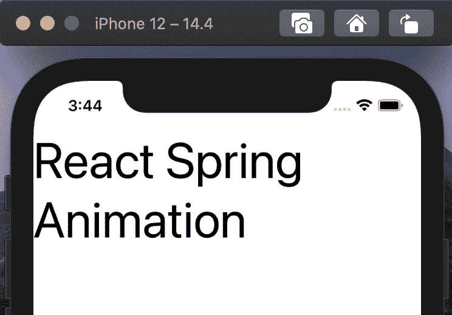
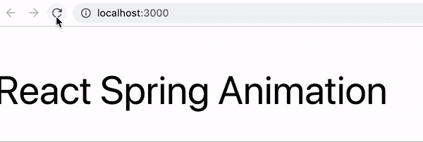
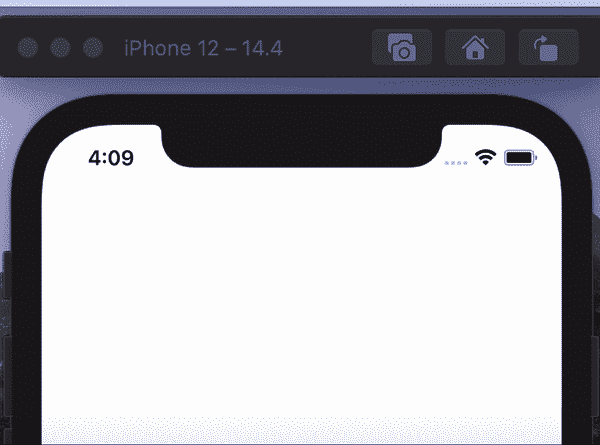

# 从一个代码库运行 React 和 React Native 中的动画

> 原文：<https://blog.logrocket.com/run-animations-react-react-native-one-codebase/>

## 介绍

动画对于应用程序的交互非常重要。它们让用户感觉与应用程序联系更紧密。

随着 React Native 势头越来越猛，许多产品要么是用 React Native 构建的，要么已经移植到它上面。然而，虽然网页代码在某些情况下可以在移动应用程序中重用，但一个主要问题是动画通常不能延续，因为 API 完全不同。

在本文中，我们将学习如何利用 react 原生文件解析和 react-spring(一个动画库)来编写一个在 React 和 React 原生中运行动画的单一代码库。

我们将从学习 React 原生文件解析和 react-spring 开始，然后构建一个非常基本的示例应用程序。在这个示例应用程序中，我们将编写一段代码，这段代码既可以在 React web 上运行，也可以在 React Native 移动应用程序中运行。

## 反应本地文件解析

React Native 有一个高效的文件解析系统，允许我们编写特定于平台或特定于本机的代码。它将检测文件何时具有`.ios.js`或`.android.js`扩展名，并在其他组件需要时加载相关平台(Android/iOS)文件。这样，我们可以为两个不同的平台编写两段不同的代码或组件。

同样，当我们创建扩展名为`.js`或`.native.js`的文件时，`.js`文件被 Node.js 和 web 获取，而`.native.js`文件被 React Native [Metro bundler](https://facebook.github.io/metro/) 获取。

这使我们能够构建易于维护的应用程序，并跨平台重用大量代码。

考虑以下结构的文件夹:

```
|-TestComponent
  |-index.js
  |-index.native.js

```

假设我们在`App`组件中使用了`TestComponent`组件，如下所示:

```
const App = () => (
  <div>
    <TestComponent />
  </div>
)

```

当为浏览器捆绑代码时，`TestComponent`的导入将从`index.js`文件导入组件。然而，如果代码是为 React Native 捆绑的，它会选择`index.native.js`。

我们将利用文件解析的这个方面来为两个平台编写一个动画代码。

## 反作用弹簧

React-spring 是一个基于 spring 物理学的动画库，应该可以满足你大部分 UI 相关的动画需求。它给你足够灵活的工具来自信地将你的想法投射到移动界面中。

React-spring 是现有的两个 React 动画库之间的桥梁: [React Motion](https://alligator.io/react/react-motion/) 和 [Animated](https://www.npmjs.com/package/react-animated-css) 。它继承了 Animated 的强大插值和性能，以及 React Motion 的易用性。

与其他动画库相比，react-spring 的主要优势是它能够应用动画，而不依赖 react 逐帧渲染更新。动画是基于物理学的。

没有必要(除非您有意这样做)自定持续时间或缓动。这意味着你的动画可以无缝地处理中断和变化。结果是平滑、柔和、看起来自然的动画。

React-spring 也是一个跨平台的动画库。对于 web、React Native 和其他平台，它有类似的实现，但是作为不同的包。我们可以根据自己的需求选择合适的模块。然而，它们在所有平台上共享相同的 API。这有助于我们使用 react-spring 实现所有平台一个代码的目标。

在本文中，我们将为我们将要构建的示例应用程序使用`useSpring`钩子。`useSpring`通过覆盖值来改变动画，或者通过使用 API 传递回调函数来动态更新值，从而将值转换为动画值。

## 构建示例应用程序

让我们使用刚刚学到的上述概念，构建一个示例应用程序。这个示例应用程序将使用 React 用于 web，React Native 用于移动应用程序，react-spring 用于动画。从功能上来说，这将是一个非常简单的应用程序，其中一个文本将出现在应用程序的加载和放大，在移动应用程序和网络上。

然而，我们将不得不首先创建这个应用程序工作的基本构件。您可以手动配置 Metro bundler 和 webpack，或者使用现有的初学者工具包。

我已经用`expo`和`create-react-app`合并成单个项目。该应用程序的完整工作版本可以在[这里](https://github.com/vilvaathibanpb/React-RN-Animations.git)找到。

现在让我们看一些代码。考虑以下项目:

```
|-src
  |-Box
    |-index.js
    |-Box.js
    |-Box.native.js
  |-Text
    |-index.js
    |-Text.js
    |-Text.native.js
  |-App.js

```

这里我们有两个组件:`Box`和`Text`。这两个组件都利用 React Native 中的文件解析，这使我们能够编写适用于两种平台的单个组件。

### `Box`

`Box`是容器组件。我们将使用`Box`作为所有其他组件或文本的容器。

在 web 中，我们使用`div`或`section`作为容器。然而，React Native 不支持这些元素，而是使用`View`组件作为容器。我们的目标是为所有平台编写一个代码，因此我们将创建这个`Box`组件来翻译成基于平台的`div`或`View`。

考虑到 React Native 的文件分辨率，我们将为`Box`组件创建两个文件:

`Box.js`文件将被 web 平台使用，它只是一个`div`的别名。这会像这样导出`div`元素:

```
// Box.js
export default 'div';

```

React 原生平台将使用`Box.native.js`文件。我们从 React Native 导入`View`组件，并从文件中导出它，如下所示:

```
// Box.native.js
import {View} from 'react-native'
export default View

```

我们创建了一个通用的`index.js`文件，因此在其他文件中导入和使用`Box`组件更容易，可读性更好。如果你看到这里，我们没有明确提到`Box`是从`.js`还是`.native.js`文件导入的。

* * *

### 更多来自 LogRocket 的精彩文章:

* * *

我们让捆绑器决定，只导出`index.js`文件中的组件，这样它就可以被其他组件使用:

```
// index.js
import Box from './Box';
export default Box

```

### `Text`

组件将被用来给网络和移动应用添加文本。在 web 中，我们使用像`h1`、`h2`或`p`这样的元素来显示文本，而在 React Native 中，我们使用`Text`组件。这个`Text`组件现在将根据平台转换为`p`或`Text`。

我们将为`Text`组件创建两个文件:

`Text.js`文件将被 web 平台使用，它只是`p`的别名。这会像这样导出`p`元素:

```
// Text.js
export default 'p';

```

React 原生平台将使用`Text.native.js`文件。我们从 React Native 导入`Text`组件，并从下面的文件中导出它:

```
// Text.native.js
import {Text} from 'react-native'
export default Text

```

像`Box`组件一样，我们也在这里创建一个通用的`index.js`文件。这使得导入和在其他文件中使用`Text`组件变得更容易，可读性更强:

```
// index.js
import Text from './Text';
export default Text

```

现在我们已经有了`Box`和`Text`组件的基本构建块，我们可以继续构建示例应用程序了。

让我们创建一个新组件`App.js`，它将使用`Box`作为容器，使用`Text`来显示我们的标题:`React Spring Animation`。我们还可以给组件添加一些样式。

它应该是这样的:

```
// App.js

import React from 'react';
import Box from './Box';
import Text from './Text';

function App() {
  return (
    <Box style={{ marginTop: 50}}>
      <Text style={{ fontSize: 50 }}>React Spring Animation</Text>
    </Box>
  );
}
export default App;

```

上面的代码为移动和 web 创建了相同的文本，您可以在下面的截图中看到。在幕后，代码在任何平台上执行之前都是捆绑在一起的。

当 webpack 为 web 捆绑代码时，它使用`Box.js`和`Text.js`文件，向`App`组件添加一个带有文本`React Spring Animation`的`div`元素和`p`元素，并在浏览器上运行它。

然而，Metro 捆绑了`Box.native.js`和`Text.native.js`文件，并将 React Native 中的`View`和`Text`组件添加到了`App`组件中。这也给移动应用带来了预期的效果。

到目前为止，这是我们的应用在移动和网络上的样子:


## 添加动画

是时候给上面的应用程序添加动画了。让我们通过增加字体大小给文本添加一个“放大”动画。

首先，安装`react-spring`作为项目的依赖项:

```
npm i react-spring

yarn add react-spring

```

接下来，构建一个类似于`Box`和`Text`组件的`Animated`组件。这个`Animated`组件将是我们从`react-spring`库中获取所有钩子、API 和实用程序的单一来源。

我们将把它构造成类似于我们的`Box`和`Text`组件，从而使用基于每个平台的正确的钩子和 API。

React-spring 有两个我们将使用的模块:`react-spring`用于 web，而`react-spring/native`用于 React Native。在这个例子中，我们将使用`react-spring`的`useSpring`钩子来实现动画。

然而，我们应该为 web 从`react-spring`导入`useSpring`，为 React Native 从`react-spring/native`导入`useSpring`。因此我们不能直接使用`react-spring`。

考虑到这些事实，我们将构建一个`Animated`组件，它将帮助我们为多个平台编写单个动画。

让我们添加一个新的组件文件夹如下:

```
|-src
  |-Animated
    |-index.js
    |-Animated.js
    |-Animated.native.js

```

### `Animated`

`Animated`组件将从`react-spring`提供所有需要的钩子和工具。在 web 中，我们使用来自`react-spring`的`useSpring`和`useTransition`等元素制作动画，而在 React Native 中，我们使用来自`react-spring/native`的相同钩子。

这个`Animated`组件将根据平台从`react-spring`或`react-spring/native`导入`useSpring`。

我们将为`Animated`组件创建两个文件:

*   `Animated.js`
*   `Animated.native.js`

`Animated.js`文件将被 web 平台使用，将从`react-spring`导入`useSpring`和`animated`并导出；

```
// Animated.js
export { useSpring, animated } from 'react-spring'

```

`Animated.native.js`文件将被 React 原生平台使用，并将从`react-spring/native`导入`useSpring`和`animated`并导出；

```
// Animated.native.js
export { useSpring, animated } from 'react-spring/native'

```

我们现在可以创建一个通用的`index.js`文件，它将导入和导出`Animated`组件，如`Box`和`Text`。这将使得在其他文件中导入和使用`Animated`组件变得更容易，可读性更强:

```
// index.js
export {useSpring, animated} from './Animated'

```

现在，让我们使用`App.js`中的`Animated`组件来制作文本动画。

从`Animated`组件导入`useSpring`和`animated`:

```
import { useSpring, animated } from './Animated';

```

然后，使用`Animated`功能创建一个启用动画的组件。仅当组件被`Animated`函数扩展时，才可以使用 react-spring 对其进行动画处理:

```
const AnimatedText = animated(Text);

```

使用`useSpring`函数创建动画，这与 CSS 关键帧动画非常相似。

CSS 中的关键帧通过定义动画序列中关键帧(或路点)的样式来控制 CSS 动画序列中的中间步骤。因此，我们可以在动画的不同阶段确定元素的样式。

`useSpring`工作原理完全相同。您可以分别使用`from`和`to`属性定义某些样式在动画开始和结束时的外观:

```
const styles = useSpring({
    from: {
      fontSize: 10,
    },
    to: { 
      fontSize: 50,
     },
  })

```

最后，将`styles`传递给`AnimatedText`组件的`style`属性:

```
<AnimatedText style={{ ...styles }}>React Spring Animation</AnimatedText>

```

综上所述，`App.js`应该如下所示:

```
import React from 'react';
import { useSpring, animated } from './Animated';
import Box from './Box';
import Text from './Text';

const AnimatedText = animated(Text)

function App() {
  const styles = useSpring({
    from: {
      fontSize: 10,
    },
    to: { 
      fontSize: 50,
     }
  })
  return (
    <Box style={{ marginTop: 50}}>
      <AnimatedText style={{ ...styles }}>React Spring Animation</AnimatedText>
    </Box>
  );
}

```

上面的代码为 web 和移动设备的文本添加了一个“放大”动画(通过 React Native)。

你可以在下面的 gif 图中看到它的样子:





## 结论

使用上述技术，我们几乎可以一次创建任何动画，并在 web 和移动平台上重用它。这使得快速原型和易于维护成为可能。它还有助于跨平台特性的一致行为。

不幸的是，这项技术有一个小小的警告:只有 React 和 React Native 都支持的 CSS 属性才能以这种方式制作动画。任何涉及到其他 CSS 属性的东西都应该在两个平台上保持两个版本的代码。

## [LogRocket](https://lp.logrocket.com/blg/react-signup-general) :全面了解您的生产 React 应用

调试 React 应用程序可能很困难，尤其是当用户遇到难以重现的问题时。如果您对监视和跟踪 Redux 状态、自动显示 JavaScript 错误以及跟踪缓慢的网络请求和组件加载时间感兴趣，

[try LogRocket](https://lp.logrocket.com/blg/react-signup-general)

.

[ ](https://lp.logrocket.com/blg/react-signup-general) [](https://lp.logrocket.com/blg/react-signup-general) 

LogRocket 结合了会话回放、产品分析和错误跟踪，使软件团队能够创建理想的 web 和移动产品体验。这对你来说意味着什么？

LogRocket 不是猜测错误发生的原因，也不是要求用户提供截图和日志转储，而是让您回放问题，就像它们发生在您自己的浏览器中一样，以快速了解哪里出错了。

不再有嘈杂的警报。智能错误跟踪允许您对问题进行分类，然后从中学习。获得有影响的用户问题的通知，而不是误报。警报越少，有用的信号越多。

LogRocket Redux 中间件包为您的用户会话增加了一层额外的可见性。LogRocket 记录 Redux 存储中的所有操作和状态。

现代化您调试 React 应用的方式— [开始免费监控](https://lp.logrocket.com/blg/react-signup-general)。

## [LogRocket](https://lp.logrocket.com/blg/react-native-signup) :即时重现 React 原生应用中的问题。

[](https://lp.logrocket.com/blg/react-native-signup)

[LogRocket](https://lp.logrocket.com/blg/react-native-signup) 是一款 React 原生监控解决方案，可帮助您即时重现问题、确定 bug 的优先级并了解 React 原生应用的性能。

LogRocket 还可以向你展示用户是如何与你的应用程序互动的，从而帮助你提高转化率和产品使用率。LogRocket 的产品分析功能揭示了用户不完成特定流程或不采用新功能的原因。

开始主动监控您的 React 原生应用— [免费试用 LogRocket】。](https://lp.logrocket.com/blg/react-native-signup)