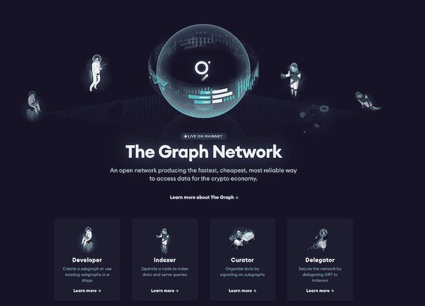
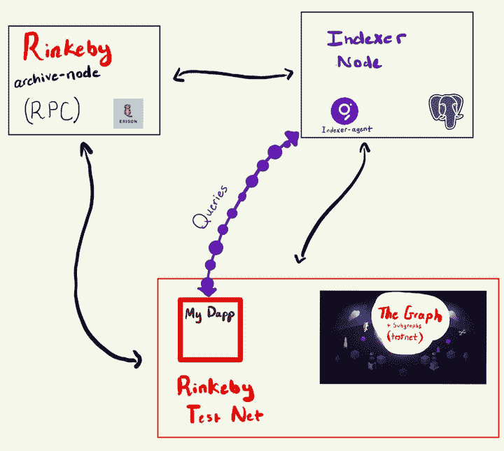
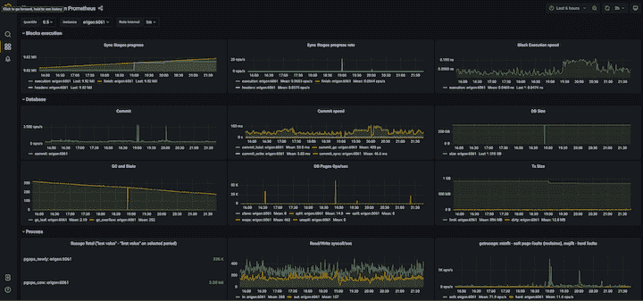

# 如何运行图网络的 Rinkeby 索引器(免费)- LogRocket 博客

> 原文：<https://blog.logrocket.com/run-rinkeby-indexer-graph-network-for-free/>

图表是 2021 年最引人注目的 Web3 新技术之一，有望成为下一个去中心化的谷歌。

一个由受激励的参与者组成的网络帮助管理、排序、保护和获取数据，通过一个通用的可访问 API 来实现所有这些数据，该 API 可以根据每个查询进行跟踪，并提供给世界各地的开发人员。

在本指南中，我们将回顾图表中的四个主要角色。但是如果你已经对基础部分感到满意了，可以直接跳到教程部分。



## 图表是什么？

Graph 的使命是以一种快速、高效、可靠、最重要的是分散的方式将数据从区块链提供给应用程序开发人员。

网络中的参与者可以扮演四个主要角色来使该搜索基础设施运行:

*   一个**开发人员**帮助获取他们或其他人可能需要的数据，然后编写一个 [GraphQL 模式](https://blog.logrocket.com/graphql-modules-tutorial-how-to-modularize-graphql-schema/)来告诉其他人如何在网络上提供这些数据。
*   一个**索引器**(我们今天将考察的角色)是这样一个人，他获取开发人员的 GraphQL 模式，并计算出需要什么数据来驱动 GraphQL 模式中定义的 API。一旦知道，索引器就在它们监听区块链上的新块时收集并标记该数据，以给 API 加油并使其活跃
*   一个**策展人**扮演着检查子图和子图质量的微妙角色，并使用资金向给定子图提供信号。具有更多信号的子图更有可能被索引器看到，因此更有可能作为被服务的一些查询的源而结束
*   **委托人**通过将它们的本地 Graph $GRT 令牌标记到某些索引器来帮助保护网络。每一个分散的经济体都需要低进入壁垒和高货币进入壁垒的组合，以保持一个平衡的系统安全平稳地运转。委托人帮助把所有的联系在一起

## 图表的结构

计划是这样的:我们将在下面更详细地解释:



让我们提醒自己我们在这里做什么:为区块链数据提供查询服务。这意味着我们需要一个正在运行的 API 和一个数据源。

从形式上来说，我们的 API 将与图中的索引器软件一起运行，包装在 GitHub 上由 [trader-payne](https://github.com/trader-payne) 编写的一个漂亮的 docker-compose 中。Postgres 也将运行在索引器上，索引器是 docker-compose 的一部分，以及其他一些预打包的实用程序，如 InfluxDB。

我们的索引器将与我们在 Rinkeby 测试网络上为以太坊设置的[存档节点](https://www.quicknode.com/guides/infrastructure/ethereum-full-node-vs-archive-node)进行对话，以提供该区块链上最新区块的最新数据。这样，开发人员可以在 Rinkeby 上将子图部署到图的测试网络中，这些子图可以被我们的索引器节点获取。

来自这些子图的信息将被存储在 Postgres 中，以便来自 Rinkeby DAaps 的查询可以快速从我们这些索引器中获取信息，以运行他们的服务。当我第一次设置它时，我在一台旧的笔记本电脑上运行 Rinkeby 归档，在一台旧的 PC 上运行我的 Indexer。

让我们把一切都准备好。

## 设置 Rinkeby 归档节点

我们将使用 [Erigon](https://github.com/ledgerwatch/erigon) 来扫描区块链，并全天候运行以保持我们的数据存储块是最新的。您将需要至少 400GiB 的可用固态硬盘存储。

要学习本教程，您应该安装 Docker。然而，如果你只是想用你自己的方式使用裸机，这并不是必需的，因为 Erigon 是用 Go 编写的。

一旦您准备好节点/计算机来运行所需的存储，请使用以下命令克隆 Erigon repo:

```
 git clone — recurse-submodules -j8 https://github.com/ledgerwatch/erigon.git

```

接下来，`cd`进入目录并构建二进制文件:

```
cd erigon
make erigon

```

通常情况下，Erigon 会将所有区块链数据存储在`~/.local/share/erigon`中。如果您想改变这一点，将环境变量`XDG_DATA_HOME`导出到您的首选目录。

我们现在应该可以在我们的机器上运行 Erigon 了。不过，我们将在 Docker 中运行它，因为 repo 附带了一个预构建的、漂亮的 docker-compose，与 Grafana 仪表板一起提供。

在此之前，我们需要告诉 Erigon 抓取 Rinkeby 链而不是主以太坊链，并告诉我们的索引器与之对话的 RPC 客户端，它应该查找 Rinkeby 数据集，而不是以太坊。

为此，在`docker-compose.yml`中执行以下操作:

1.  对于`erigon`服务，在`command`的末尾添加`— chain rinkeby`
2.  对于`rpcdaemon`服务，将`volumes`线设置为`${XDG_DATA_HOME:-~/.local/share}/erigon/rinkeby:/home/erigon/.local/share/erigon`。如您所见，我们将`/rinkeby`添加到路径中，告诉 RPC 客户端寻找 Rinkeby 链文件夹，而不是默认的主网络文件夹

添加完这些项目后，用`docker-compose up -d`启动它。然后，您应该能够访问`localhost:3000`并看到同步进度的仪表板。

啊，是的——看看这美景:



这可能需要一小时到一天的时间来完成；耐心等待数据库大小持平。

当这是同步的时候，你应该做更多的事情:获得一个以太坊主网络 RPC 端点。

是的，我知道我们刚刚为 Rinkeby 做了所有的工作。但是我们也需要一个以太坊主网络来与 mainnet 上的图形交互。

以太坊节点运行起来要沉重得多，所以让我们使用 Infura 来处理我们需要的少量调用，因为它是免费的。

前往[官方 Infura 网站](https://infura.io/)，创建一个账户，制作一个以太坊 Mainnet 节点，并准备好马上从**项目设置**中复制连接信息。

## 让索引器运行

为了让索引器与 Rinkeby 网络智能合约进行交互，它需要一个钱包来保存和签署交易。如果你还没有元掩码，在这里安装浏览器扩展。

如果你需要的话，点击[这里的](https://iancoleman.io/bip39/)生成一个 15 个单词的短语。在页面底部，您会看到一些与该短语相关的私钥对。复制其中一个私钥(记下以`0x!`开头的公钥),并将其导入 MetaMask。


在 MetaMask 中，确保您在 Rinkeby 测试网络上。你需要练习以太坊，你可以在这里找到[。如果水龙头坏了，试试这里的](https://faucet.rinkeby.io/)。

你还需要一些练习用的 GRT 代币。你可以通过跳转到[图的不和谐频道](https://discord.gg/)并在# testnet-水龙头频道用`!grt [address]`请求 GRT 来得到这些。

看，我现在有钱了！一旦我们为索引器准备好了令牌，让我们放下 docker-compose 并输入我们的设置:

```
git clone https://github.com/StakeSquid/graphprotocol-testnet-docker

```

接下来，您需要一个域名，可以指向您的索引器的 IP 地址来生成 SSL。我使用 GoDaddy，但是你也可以使用 [FreeNom](https://my.freenom.com/) 作为 12 个月的免费名称——非常简洁！您需要在您的域名下注册三个子域名:

1.  索引。[我的域名]
2.  查询。[我的域名]
3.  仪表板。[我的域名]

现在您已经下载了代码，设置了域，有硬币的钱包，以及可用的 Rinkeby 和 Mainnet RPC 节点，让我们输入我们的索引器设置，它位于文件`start`:

```
[email protected] \
INDEX_HOST=index.[my-domain] \
QUERY_HOST=query.[my-domain] \
GRAFANA_HOST=dashboard.[my-domain] \
ADMIN_USER=paul \
ADMIN_PASSWORD=some_password \
DB_USER=arbitrary \
DB_PASS=also_arbitrary \
GRAPH_NODE_DB_NAME=arbitrary \
AGENT_DB_NAME=arbitrary \
MAINNET_RPC_0="[INFURA RPC ENDPOINT]" \
MAINNET_RPC_1="[THE SAME INFURA RPC ENDPOINT]" \
RINKEBY_RPC="[http://your.rinkeby.node.adress]" \
OPERATOR_SEED_PHRASE="[pneumonic for your wallet we set up]" \
STAKING_WALLET_ADDRESS=[wallet address] \
GEO_COORDINATES="69.69 69.69" \

```

现在终于到了开始这一切的时候了——多么令人兴奋！通过运行`bash start`点击绿色大按钮。

注意，在这个过程中你会看到很多红色。没关系——就像他们说的，买入并持有。让它跑；这需要一点时间，但事情会结束，很快你就会微笑。

一旦红色消失，事情看起来是绿色的，我们可以通过输入 shell 来检查我们的索引器部署的状态，`./shell cli`。

然后，通过轮询索引器的当前规则来询问索引器的状态:

```
graph indexer rules get all

```

如果此命令成功，您就成功了！

## 分配到一个子图，检查你的表现

现在我们已经运行了索引器，我们应该给它一些子图来实际处理。

首先，你应该从[图的子图浏览器](https://thegraph.com/explorer)中找到一个你认为值得你花时间的子图。注意这个子图的 IPFS 散列。

IPFS 是一个分散的对象文件存储库，有点像 S3。子图代码存储在这里，我们可以通过它唯一的散列来提取它，这就是我们提到子图的散列时所指的。阅读更多关于改变游戏规则的 [IPFS 网络](https://blog.logrocket.com/guide-ipfs-garbage-collection/)。

接下来，跳转到`./shell cli`工具中的索引器，运行这个命令为这个子图分配 1000 $GRT:

```
graph indexer rules set {IPFS_HASH} allocationAmount 1000 decisionBasis always

```

如果您想在任何给定时间检查您的分配，您可以使用`graph indexer rules get {IPFS_HASH}`来完成。

图形索引器有多种方法来为它分配要索引的子图，并且您可以做一些事情，例如，如果一个子图有特定的管理器信号，则只拾取它。或者，您可以将 1，000 $GRT 分配给子图 X，将 1，000 $GRT 分配给子图 y。

## 结论

祝贺您——您刚刚通过网络索引器节点创建了一个图形 Rinkeby！现在是一个很好的机会来熟悉日志、CLI，并在进入 Mainnet 之前提出问题。索引快乐！

作为我们图表回顾的最后一点，我们应该记住，上述各方都从网络上快速、高效和可靠的查询服务中获益。这就是目标。索引器的成本模型各不相同。你可以在图表的官方文档中了解更多信息。

## 加入像 Bitso 和 Coinsquare 这样的组织，他们使用 LogRocket 主动监控他们的 Web3 应用

影响用户在您的应用中激活和交易的能力的客户端问题会极大地影响您的底线。如果您对监控 UX 问题、自动显示 JavaScript 错误、跟踪缓慢的网络请求和组件加载时间感兴趣，

[try LogRocket](https://lp.logrocket.com/blg/web3-signup)

.

[](https://lp.logrocket.com/blg/web3-signup)[https://logrocket.com/signup/](https://lp.logrocket.com/blg/web3-signup)

LogRocket 就像是网络和移动应用的 DVR，记录你的网络应用或网站上发生的一切。您可以汇总和报告关键的前端性能指标，重放用户会话和应用程序状态，记录网络请求，并自动显示所有错误，而不是猜测问题发生的原因。

现代化您调试 web 和移动应用的方式— [开始免费监控](https://lp.logrocket.com/blg/web3-signup)。