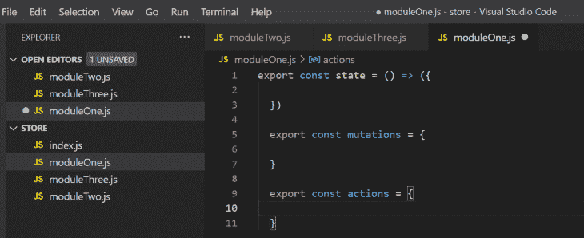
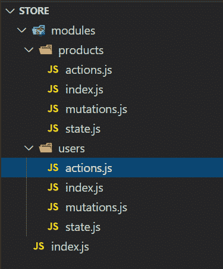

# 使用 Vuex 和 Nuxt.js 的可扩展状态管理

> 原文：<https://blog.logrocket.com/scalable-state-management-with-vuex-and-nuxt-js/>

应用程序状态管理是构建应用程序以获得更好的可伸缩性和可维护性的关键因素。在本文中，我们将学习使用 Vuex 和 Nuxt.js 构建不同大小的应用程序的不同方法。

## Nuxt 简介

Nuxt 是构建在 Vue 之上的高级框架，帮助您构建生产就绪的 Vue 应用。

js 可以在几个方面帮助改善 T2 的开发工作。首先，开箱即用，Nuxt.js 为您的代码提供了一个很好的结构，它在`next.config.js`文件中也是灵活和可配置的。js 优化了你的代码，并有助于搜索引擎对你的应用程序进行正确的索引。

Nuxt.js 还附带了一些很棒的包，如 [Vue-router](https://router.vuejs.org/) 、 [Vuex](https://vuex.vuejs.org/guide/) 、 [Webpack](https://webpack.js.org/) 、 [Babel](https://babeljs.io/) 和 [PostCSS](https://postcss.org/) ，以及一些很酷的功能，如自动导入组件和通过在 pages 目录中创建文件名来无缝设置路由。

js 还提供了服务器端渲染(SSR)功能，可以更快地进行第一次有意义的绘制。

## Vuex 简介


Image from [https://vuex.vuejs.org/#what-is-a-state-management-pattern](https://vuex.vuejs.org/#what-is-a-state-management-pattern)

根据其[文档](https://vuex.vuejs.org/)，Vuex 是 Vue 的状态管理模式和库。那是什么意思？简单地说，Vuex 是一个用于管理组件所依赖的数据的库。

Vuex 是基于 [Flux](https://vuex.vuejs.org/) (由脸书为管理状态开发的)设计的，它提供了一个存储，作为你的 Vue 应用的单一真实来源，以及存储中数据的可预测操作的突变和动作。

在我们继续之前，请记住以下几个重要的 Vuex 术语:

*   **[存储](https://vuex.vuejs.org/guide/state.html#single-state-tree)**—Vuex 存储包含应用的状态、突变和动作。存储是反应性的，如果一个组件正在使用存储的状态，并且状态发生了变化，那么该组件将被重新渲染以反映这种变化
*   **[状态](https://vuex.vuejs.org/guide/state.html#single-state-tree)** —状态是包含应用级状态的简单对象。Vue 通过`data`钩子提供了一个组件内状态，但是如果您希望数据可以被任何组件访问，建议您将它存储在状态中
*   **[Getters](https://vuex.vuejs.org/guide/getters.html)** —这些使来自存储状态的数据能够进行计算。或者，您可以从存储中检索状态，并根据组件的需要执行计算，但是如果有几个组件需要相同的计算，这可能会变得单调乏味和重复。有了处理计算的 getter，您就可以检索计算出的值了
*   **[突变](https://vuex.vuejs.org/guide/mutations.html#commit-with-payload)** —商店的状态是不可变的，只能通过突变来突变。突变与行动联系在一起。想象 Vuex 的变异只是一段代码。除非被执行，否则这段代码不会运行
*   **[动作](https://vuex.vuejs.org/guide/actions.html)** —一个动作执行突变。动作是一个执行我在上面的突变定义中提到的“代码块”的命令。没有这个命令，代码块将不会被执行

## 为什么我们需要国家管理

在有许多组件的应用程序中进行状态管理是一件非常痛苦的事情。您拥有的组件越多，您就越需要使用事件沿着组件树向上传递数据(直到到达父组件)，然后使用 props 向下传递到需要数据的组件。

由于组件较少，这相对简单:


然而，随着越来越多，事情变得复杂起来，就像这个例子中的组件结构:


如果组件 A 有组件 G 需要的数据，那么您需要通过 B 和 E 移动数据，如果组件 G 有组件 C 需要的数据，您需要通过发出事件将数据通过 E、B 和 A 移动，然后通过 props 移动到 C。可以想象，随着组件和嵌套数量的增加，这可能会变得非常混乱。

如果你可以轻松地在组件之间移动数据，那么[你可能不需要像 Vuex](https://blog.logrocket.com/do-you-really-need-vuex/) 这样的状态管理工具。但是，正如 Redux [的作者丹·阿布拉莫夫所说](https://twitter.com/dan_abramov/status/704304462739939328?lang=en)，“通量库就像眼镜:当你需要它们的时候你会知道的。”我认为任何州立图书馆都是如此。

使用 Vuex，您可以轻松、可预测地访问所有组件的应用程序级数据和功能。你可以在下面的图表中开始明白我的意思。


## Nuxt 应用程序中的状态管理

当 Vuex 注意到存储目录(位于项目的根目录)中没有隐藏的文件时，它会自动启用 Vuex 存储实例。Nuxt 自动将存储目录中的每个文件(除了动作、突变和状态文件)转换为命名空间模块，这意味着这些模块的动作或突变可以具有相同的名称，并且可以独立运行。然后，Nuxt 将动作或变异限定到该模块。

Nuxt 存储可以在两种模式下创建，经典模式和模块模式。

在 Vuex 3 中，经典模式被设置为不推荐使用。在这种模式下，`store/index.js`返回一个创建商店实例的方法，如下所示:

```
import Vuex from "vuex";
import state from './state';
import actions from './actions';
import mutations from './mutations;
import moduleOne from './moduleOne;
const createStore = () => {
    return new Vuex.Store({
       state,
       actions,
       mutations,
        modules: {
            moduleOne
        },
    });
};
export default createStore;

```

在模块模式下，每个。存储目录中的 js 文件自动转换为命名空间模块(index.js)。这是将像这样导出对象的根模块:

```
import Vuex from "vuex";
import state from './state';
import actions from './actions';
import mutations from './mutations;
export default {
       state,
       actions,
       mutations,
};

```

没有必要导入模块，因为 Nuxt 会为您完成这项工作。

## 小规模应用程序中的状态管理

一个典型的小规模应用程序包括大约五个状态属性、一个动作和五个突变。当您将状态、变异、动作和 getters 放在同一个文件中时，管理起来并不复杂，文件也不会有过多的代码。

对于这种应用程序，只需在项目的根目录下创建一个存储目录，并在其中创建一个 index.js 文件。

**Index.js**

```
export const state = () => ({
  counter: 0
})

export const mutations = {
  increment(state) {
    state.counter++
  },
  decrement(state) {
    state.counter--
  }
}

```

当创建一个模块时，状态值必须总是一个函数，而你的突变和动作可以是对象。对于要创建的存储，必须导出您的存储、突变和操作。Vuex 将为上述文件创建的存储是:

```
new Vuex.Store({
  state: () => ({
    counter: 0
  }),
  mutations: {
    increment(state) {
      state.counter++
    }
  }
})

```

这和 Nuxt 中的根模块一样简单。

随着状态属性、动作和变化的数量分别增长到大约 20 个，index.js 文件开始变得不可展示、不可维护和不可管理。因此需要把商店拆了。

这里有两种在大中型应用程序中构造状态的方法

1.  **关注点的划分**——在这种方法中，您将`like-logic`分组在一起，也就是说，您为您的操作、突变和状态拥有不同的文件
2.  **模块化方法** —在模块化方法中，状态、动作和突变基于模块被分组到相同的文件或文件夹中

## 中等规模应用程序中的状态管理

遵循第一种方法意味着您的商店目录将如下所示:


虽然这将更好地适应不断增长的商店，但我认为每个文件都可能变得虚假和混乱。想象有 30 个动作、突变和状态属性，在代码中导航变得更加忙乱，然后我们可以开始使用注释和间距来区分与不同模型相关的动作。

如果我们遵循第二种方法，我们将不得不把我们的商店分成模块。



对于模块应该由什么组成有不同的看法，一些思考模块应该代表应用程序中的特性，一些思考模块应该代表来自 API 端点的数据模型。根据经验和对这个主题的阅读，我推荐后者用于中等规模的应用。

因此，如果我们有一些端点服务于这些模型:

| 统一资源定位器 | 方法 | 描述 |
| /产品 | 邮政 | 将产品添加到数据库 |
| /product/:id | 得到 | 获取产品信息 |
| /产品/id | 放 | 编辑产品信息 |
| /product/:id | 删除 | 从数据库中删除产品 |
| /产品 | 得到 | 获取数据库中的所有产品 |
| /用户 | 得到 | 获取用户的信息 |
| /用户 | 邮政 | 添加用户 |
| /用户 | 放 | 编辑用户的信息 |

用模块表示数据模型将使目录看起来像这样:



然后，每个模块将在模块的 index.js 文件或其各自的文件中拥有其状态(导出为函数)、突变和动作(导出为对象)。

## 大规模应用程序中的状态管理

遵循模块化方法，并将 API 中的每个数据模型表示为模块，我们可以轻松地扩展我们的大型应用程序。想象一下，我们的应用程序已经发展到需要处理超过 60 种状态属性、动作和突变的地步，我们在小规模或中等规模应用程序中使用的方法都不会产生易于管理的存储结构。

Nuxt 不像在中等规模的应用程序中那样只为我们的模块创建一个文件，而是允许我们处理状态中的子目录，这些子目录应该在一个`modules`目录中。`modules`目录中的每个子目录都将是一个模块，子目录的名称将是模块的名称。

在这个子目录中，我们可以为状态创建 state.js，为操作创建 actions.js，为突变创建 mutation.js 文件，以及创建一个 index.js 文件，该文件将导入这些文件并将它们作为对象导出。Nuxt 会将这个对象作为一个模块，并将其包含在存储中(不需要我们在根 index.js 文件中手动导入)。

## 结论

在本文中，我们已经了解了什么是 Nuxt，使用 Nuxt 的一些优点，什么是 Vuex，以及它如何与 Nuxt 通信。

我们还介绍了如何在小型、中型和大型 Nuxt 应用程序中构建商店。他们的文档也是理解这些概念的重要资源。

## 像用户一样体验您的 Vue 应用

调试 Vue.js 应用程序可能会很困难，尤其是当用户会话期间有几十个(如果不是几百个)突变时。如果您对监视和跟踪生产中所有用户的 Vue 突变感兴趣，

[try LogRocket](https://lp.logrocket.com/blg/vue-signup)

.

[](https://lp.logrocket.com/blg/vue-signup)[https://logrocket.com/signup/](https://lp.logrocket.com/blg/vue-signup)

LogRocket 就像是网络和移动应用程序的 DVR，记录你的 Vue 应用程序中发生的一切，包括网络请求、JavaScript 错误、性能问题等等。您可以汇总并报告问题发生时应用程序的状态，而不是猜测问题发生的原因。

LogRocket Vuex 插件将 Vuex 突变记录到 LogRocket 控制台，为您提供导致错误的环境，以及出现问题时应用程序的状态。

现代化您调试 Vue 应用的方式- [开始免费监控](https://lp.logrocket.com/blg/vue-signup)。