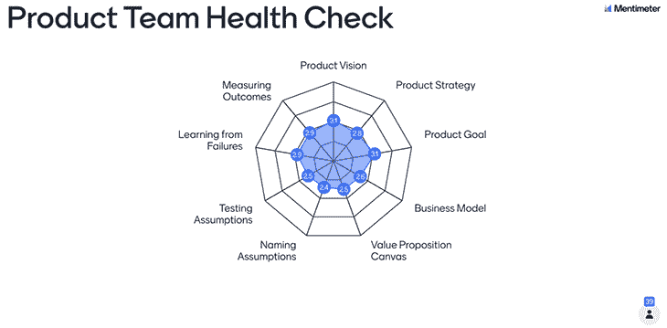

# Scrum 是一个框架，而不是银弹

> 原文：<https://blog.logrocket.com/product-management/scrum-is-a-framework-not-a-silver-bullet/>

团队只有超越 scrum 才能成功。

在过去的十年中，scrum 的采用有了显著的增长。今天，它是最著名和最广泛使用的敏捷框架之一。

Scrum 为团队提供了一种简单的方式[一起工作来增量地创造价值](https://blog.logrocket.com/product-management/what-is-continuous-improvement-process-methodologies/)。谁不想这样呢？

问题是，几乎每个人都会陷入常见的 scrum 陷阱和反模式，比如:

*   最大化无人使用的功能
*   分而治之是满足利益相关者需求的方法
*   交付是最重要的，因为没有人有时间做其他事情
*   成功意味着提高速度

很容易陷入这些反模式，但这不是 scrum 真正的目的。我们是怎么到这里的？

Scrum 在设计上并不邪恶；其实挺有帮助的。恶的部分在于解读。这就像一场电话游戏——到最后，它一点也不像它应该是什么样子。

> 我必须说清楚。单靠 scrum 你没有成功的机会。您必须向它添加正确的元素。

让我详细说明为什么团队错过了标记，成为功能工厂，而不是授权团队。

* * *

## 目录

* * *

## Scrum 是不完整的

单纯依赖 scrum 是错误的。不要相信我的话，看看 [Scrum 指南](https://scrumguides.org/scrum-guide.html):

scrum 框架是故意不完整的，只定义了实现 scrum 理论所需的部分。Scrum 是建立在使用它的人们的集体智慧之上的。

故意不完整。请不要忘记这一点。但这意味着什么呢？简而言之，你必须添加一些东西来使 scrum 成功，这就是危险地带。

> 纯粹主义者会失败，因为 scrum 没有准备好引导团队彻底创造价值。

Scrum 为基本的交互创造了空间。此外，如果处理得当，它有助于加强组织内部的协作。但是该框架不会回答以下任何问题:

你只能靠自己了。你必须弄清楚如何在没有 scrum 的情况下回答这些问题。这没关系。Scrum 从未承诺回答这些问题，但是许多人仍然认为框架是敏捷的整个圣杯。

我已经说过一千遍了，但我怎么强调都不为过:

> Scrum 是达到目的的一种手段。目标是创造价值，不是做 scrum。

## 带来正确的元素

如果 scrum 是不完整的，你应该添加什么来使数字产品的繁荣成为可能？嗯，看情况。这不是非黑即白的，因为场景和业务发挥了作用。但我要说的是，一些关键元素非常标准，可以跨行业使用。

几个月前，我在《敏捷到敏捷》上谈过，当我问及 scrum 团队的现状时，我感到非常惊讶。我想了解团队使用什么。请看下图:

产品健康检查——主题演讲敏捷到敏捷——作者 David Pereira。

正如你所看到的，关键产品管理元素的使用对于活动的观众来说是非常有限的。这是一个例外还是常见陷阱的反映？不幸的是，这是我在 scrum 团队中常见的情况。

> 他们的目标是更快地创造价值，但却错过了实现这一目标的关键要素。

让我向您解释一下我认为使您在数字产品管理方面取得成功的关键要素:

### 1.产品愿景

你设想实现什么？[令人信服的产品愿景](https://blog.logrocket.com/product-management/what-is-a-product-vision-statement-examples/)激励团队，明确方向。你知道你解决的问题，为什么这很重要，以及如何区分。

### 2.产品策略

光有远见是不够的。你必须制定一个策略来实现你的愿景。你的目标受众是谁？你如何取悦他们？你愿意做出哪些取舍？[有价值的产品战略使团队能够更快地专注于日常决策](https://blog.logrocket.com/product-management/product-strategy-frameworks-examples/)。

### 3.产品目标

一旦你有了清晰的愿景和指导策略，你必须定义下一步要关注什么。产品目标代表了实现愿景的步骤。这是几个月就能实现的事情。

### 4.商业模式

了解如何连接你的业务是很重要的。如果你不了解全局，决策就会变得武断，并有可能产生误导。我喜欢使用商业模型画布或精益画布。他们开门见山，给出了一个惊人的概述。

### 5.价值主张

[你对你的客户有多了解](https://blog.logrocket.com/product-management/customer-feedback-why-you-should-seek-how-to-obtain/)？你了解他们的工作、付出和收获吗？没有这些，你只能依靠运气，这是一个可怕的选择。打造一个价值主张不会花很长时间，但缺乏它将导致长期的错误。

### 6.命名假设

爱上一个想法很容易，但把它做对却很难。退后一步，说出我们的假设对成功至关重要。我喜欢问，“什么会出错？”然后，我反向工作来测试这些假设。不做就像开车看不到路；崩溃只是时间问题。

### 7.测试假设

命名假设是不够的。你需要测试那些关键的。主要的方面是知道你不需要测试所有的东西，除了那些对商业成功至关重要的。你考得越快，你学得就越快。如今，我们很幸运，因为你有很多选择来立即测试想法。

### 8.从失败中学习

失败不是坏事。这只是迈向成功的自然一步。传统上，人们认为失败是不可避免的。这就是他们不惜一切代价避免的原因。但是，没有失败，你不会更快地学会如何创造价值。挑战在于创造小实验，从尽可能小的失败中学习，然后调整你的步骤。

### 9.测量结果

交付特性并不意味着创造价值。你怎么知道一个东西什么时候为用户创造了价值？只有当你衡量结果时，你才能知道。尽快找出衡量结果的方法至关重要。这将使你能够创造重要的东西。

* * *

订阅我们的产品管理简讯
将此类文章发送到您的收件箱

* * *

## 超越 scrum

scrum 的目标是实现价值最大化，但通常你无法单独用 scrum 做到这一点。Scrum 在帮助团队发现盲点方面很棒，但是当谈到创造价值时，你必须超越框架。

scrum 最大的危险之一是陷入执行模式。这将确保团队成为特色工厂，并错过标记。为了避免这种情况，你应该专注于产品发现。

你会发现很多发现产品的方法，其中大部分都是噪音。一个很好的方法是遵循特雷莎·托雷斯提倡的[持续发现习惯](https://www.producttalk.org/2021/08/product-discovery/)。随着您掌握产品发现，您将增加更快交付价值的机会。

我必须强调[发现和交付是密不可分的](https://blog.logrocket.com/product-management/product-discovery-vs-delivery/)；如果你试图将它们分开，你就有削弱责任感的风险。团队应该自始至终负责任。

另一个挑战是确定优先次序和决策。Scrum 需要敏锐的注意力。否则，你的团队会分心，创造不了多少价值。我鼓励团队简化决策并确保进度。一个很好的方法是使用 Martin Erikson 的[决策堆栈框架](https://martineriksson.com/the-decision-stack)。

当您实现决策堆栈框架时，您的团队将会理解什么是重要的，以及如何将他们的日常工作与全局联系起来。跳过这一步，你将面临无休止的讨论和决策瘫痪。

## 最后的想法

数字产品世界既令人兴奋又令人疲惫。不要指望一眨眼的功夫就能找到创造一流产品的捷径。在你做出有意义的事情之前，你要准备好几次碰壁。

你不会找到一个完美的成功秘诀，但是你可以通过在游戏中加入必要的元素来增加你成功的机会。我与你分享的是在许多行业中对我有效的方法。它可能对你也有用，但是不要把你的游戏限制在我分享的范围内。养成学习的心态，根据自己的发现去适应。

> 在数字产品的世界里，变化是唯一确定的事情。

*精选图片来源:[icon scout](https://iconscout.com/icon/agile-5804828)*

## [LogRocket](https://lp.logrocket.com/blg/pm-signup) 产生产品见解，从而导致有意义的行动

[LogRocket](https://lp.logrocket.com/blg/pm-signup) 确定用户体验中的摩擦点，以便您能够做出明智的产品和设计变更决策，从而实现您的目标。

使用 LogRocket，您可以[了解影响您产品的问题的范围](https://logrocket.com/for/analytics-for-web-applications)，并优先考虑需要做出的更改。LogRocket 简化了工作流程，允许工程和设计团队使用与您相同的[数据进行工作](https://logrocket.com/for/web-analytics-solutions)，消除了对需要做什么的困惑。

让你的团队步调一致——今天就试试 [LogRocket](https://lp.logrocket.com/blg/pm-signup) 。

[David Pereira Follow](https://blog.logrocket.com/author/davidpereira/) Product Leader with 15+ years of experience. Partner at Value Rebels and interim CPO at omoqo. Almost every product team is trapped somehow; untrapping them is what drives me.