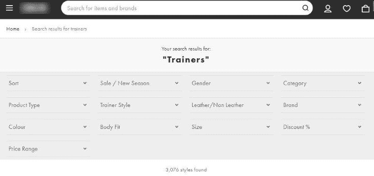
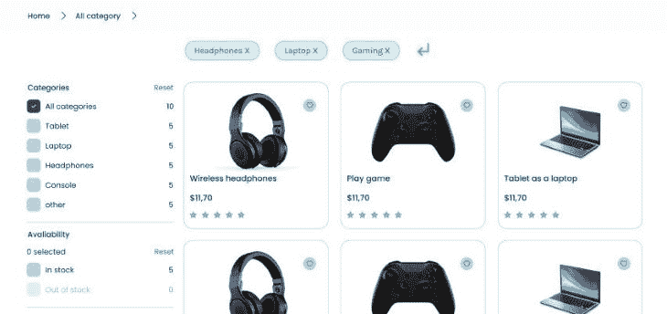
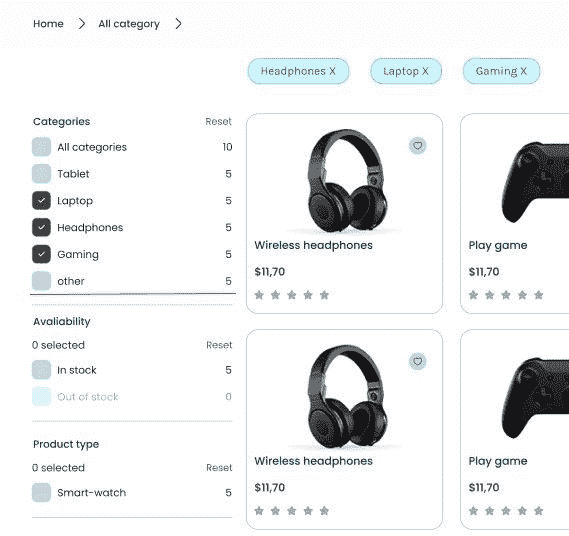
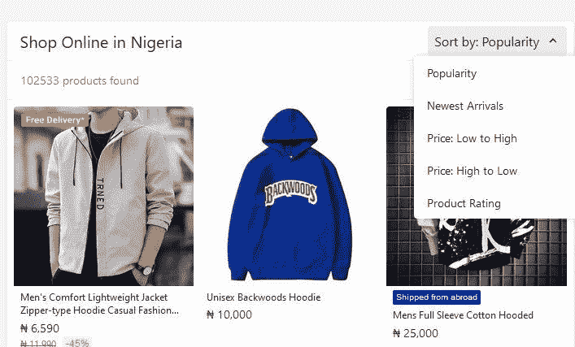
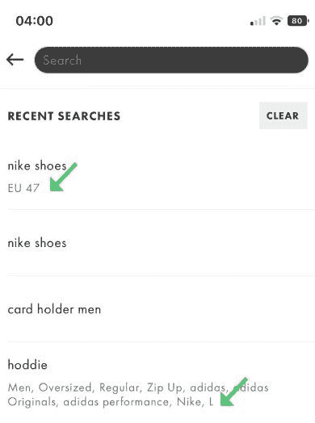

# 更好的 UX 搜索过滤原则

> 原文：<https://blog.logrocket.com/ux-design/search-filter-principles-better-ux/>

在设计包含大量目录的商业产品时，在搜索功能中添加过滤器有利于改善用户体验。有效的过滤器可以帮助用户筛选选项，并根据他们的喜好调整搜索结果，从而加快决策过程。它还能节省用户的宝贵时间。

平均而言，[30%的网上购物者使用搜索过滤器](https://www.algolia.com/blog/ecommerce/e-commerce-search-and-kpis-statistics/)，并且转化的可能性是不使用过滤器者的两倍。

然而，搜索过滤器可能会被错误地实施，这通常会损害用户体验并增加跳出率——12%的用户会在不满意的搜索后跳至竞争对手的网站。那么，在我们的产品中构建搜索过滤器时，我们应该避免什么呢？我们可以运用什么原则来建设一个更好的 UX？

在本帖中，我们将检查各种执行不佳的搜索过滤器的例子，并强调一些你可以用来产生令人满意的过滤体验的技巧。我们开始吧！

## 策略性地放置过滤器面板

如前所述，搜索过滤器是用户登陆你的电子商务产品时首先寻找的组件之一。因此，有必要战略性地定位这个元素，确保你的用户在试图接触它时没有摩擦。

你会发现网上有各种不同的定位方法，最常见的方法是在屏幕两侧垂直布局。

然而，在上面的设计中，这家服装公司犯了一个错误，将滤镜面板隐藏在一个相当不显眼的**滤镜**按钮后面。没有必要强迫用户额外点击来查看面板，尤其是当桌面视图中有足够的空间来显示面板时。展开时，面板还会在视觉上截断一些结果。

更好的方法是让面板始终可见，并为移动视图保留按钮:

令人满意的过滤器布局的另一个例子是这个粘性的水平过滤器面板，当用户导航产品列表时，它保持在视图中:

一般来说，过滤系统的位置有助于用户更快地完成任务。

## 应用的过滤器应该是可见的并且易于移除

让所有应用的过滤器对用户可见将帮助他们更好地理解这些过滤器如何影响他们的搜索结果。这种反馈机制将有助于确保您的用户在没有找到他们想要的东西时不会感到沮丧，因为他们可以很容易地调整过滤器参数。

还需要让用户能够轻松地移除应用的过滤器。当他们没有得到想要的结果时，或者如果他们想看到更多(或更少)的结果时，这允许他们容易地修改他们的搜索体验。

下面是一个实际例子:

总的来说，使应用的过滤器可见并易于移除的目标是在他们的搜索或浏览体验中给用户更多的控制和灵活性，并使他们更容易找到他们正在寻找的东西。

## 为搜索过滤器提供清晰的描述性标签

为产品的过滤系统提供清晰的描述性标签可以帮助用户更容易地找到他们想要的东西。当标签不够清晰或描述性不够时，用户可能很难理解过滤器的作用，或者当他们应用它时会包括哪些内容。

以下面的设计为例:

过滤器选项 **Other** 不明确，用户不知道应用它会得到什么结果。我鼓励你使用描述性标签，因为它可以改善用户体验，使他们更有可能有效地使用过滤系统。

## 为你的产品目录创建一个有组织的标签系统

在标签系统中正确标记每个项目的有组织的目录将为最终用户提供愉快的过滤体验。如果一个项目被恰当地标记到正确的类别，过滤器可以很容易地根据这些标记进行计算，并将相关结果返回给用户。

保持目录有序的电子商务和媒体巨头已经从这种做法中受益，使他们能够保持用户的注意力。

以网飞为例。众所周知，在流媒体服务上找到一个可以观看的节目是一项艰巨的任务。作为一个解决方案，网飞提供了一个独特代码的[集合，观众可以用它来按科幻、动漫、经典、恐怖等类别过滤节目。](https://www.netflix-codes.com/)

一般来说，有组织的标签对你的过滤系统和用户都有帮助。

## 使用排序来增强搜索体验

虽然过滤器给用户提供了对搜索结果组织的有效控制，但在组合中添加排序工具将极大地增强搜索体验。排序有助于将数据排列成有意义的顺序，以便用户可以更有效地分析数据。

通过以一种能引起用户共鸣的方式组织数据，排序可以使用户更容易找到他们正在寻找的信息。例如，假设一个用户预算有限，正在网站上搜索一件价格合理的商品。在这种情况下，如果他们可以选择按价格对搜索结果进行排序，而不是按随机顺序排列，他们可能会更快地找到它。

网店比较流行的一些分拣参数有**新到**；**人气**；**价格:由低到高；**以此类推。

## 允许用户保存和重复使用过滤器配置

存储用户的过滤器配置以备将来重用对于任何产品的用户体验都是一个巨大的好处。通过这样做，用户可以轻松地从他们停止的地方开始，或者在先前的过滤器参数的基础上创建新的查询。这可以提高用户满意度，增加过滤系统的使用率。

如果过滤器很复杂，或者如果用户希望对多组数据应用相同的过滤器，这种技术会很有用。

## 提供充分的反馈

反馈是任何用于吸引、解释和提高用户满意度的成功设计的重要组成部分。过滤系统可以通过几种方式向最终用户提供良好的反馈:

1.  **结果数量**:对于每一个新应用的过滤器，产品的用户界面应该显示由于该过滤器现在可用的结果/项目/产品的数量
2.  **模糊不可用的过滤器选项**:某些过滤器的组合经常会使其他过滤器选项不可用，例如，在一个运动鞋网站上，针对某个鞋码的过滤可能会排除一些库存中没有该尺码的品牌选项。因此，在用户界面中反映这一点并逐渐模糊不可用的过滤器选项是很重要的，而不是让用户应用它们并最终没有结果
3.  **交互式过滤优于批量过滤**:交互式过滤是一种响应速度更快的方法，当应用新的过滤器时，搜索结果会立即更新。通过这种方式，用户可以立即看到他们所应用的过滤器的效果，这与批处理过滤相反，批处理过滤仅在用户做出过滤器选择之后才更新结果
4.  **相关结果**:过滤系统应该根据应用的过滤器返回相关结果。如果结果不相关，用户可能会变得沮丧并对系统失去信心

总的来说，来自过滤系统的好的反馈应该帮助用户理解过滤器如何影响他们的结果，并给他们所需的工具来找到他们想要的东西。

## 结论

许多技术可以应用于搜索过滤器，使它们对用户来说更有用、更舒适。关注 UX 设计的这一部分将会极大地提高你网站的性能，并增加转化的机会。当你的过滤系统帮助用户有效地完成他们的任务时，你总是可以指望用户不断回到你的产品。

*标题图片来源:* [图标侦察](https://iconscout.com/icon/ecommerce-77)

## [LogRocket](https://lp.logrocket.com/blg/signup) :无需采访即可获得 UX 洞察的分析

[LogRocket](https://lp.logrocket.com/blg/signup) 让您可以回放用户的产品体验，以可视化竞争，了解影响采用的问题，并结合定性和定量数据，以便您可以创建令人惊叹的数字体验。

查看设计选择、交互和问题如何影响您的用户— [立即尝试 LogRocket】。](hhttps://lp.logrocket.com/blg/signup)