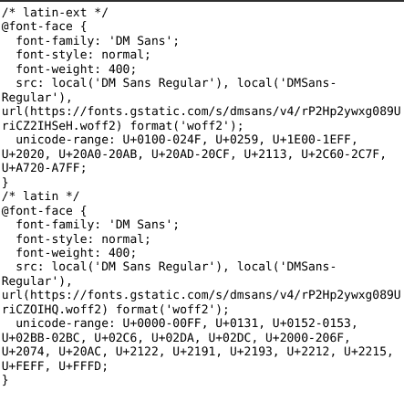
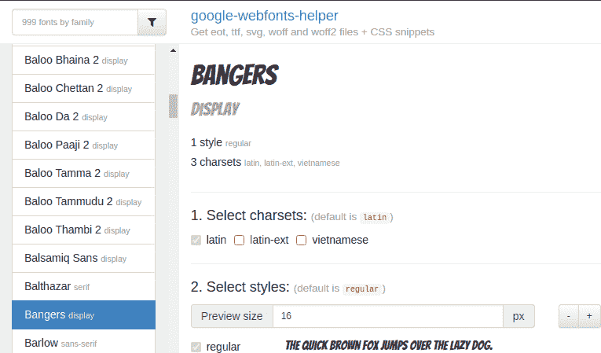
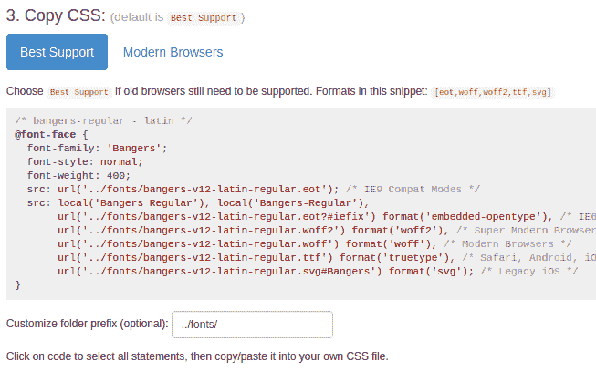

# 自托管字体与谷歌字体应用编程接口-日志火箭博客

> 原文：<https://blog.logrocket.com/self-hosted-fonts-vs-google-fonts-api/>

字体在 web 开发中的使用对于 web 应用程序的呈现方式起着重要的作用。不同类型的字体有不同的含义和使用范围。

为了确保使用字体的应用程序呈现的一致性，有一些选项需要考虑，每个选项都有自己的优缺点。

在本文中，我们将了解:

*   如何在 web 开发中使用字体
*   托管字体的使用
*   谷歌字体应用编程接口
*   什么是自托管字体，为什么你会需要它

## 如何使用字体

要在 web 应用程序中使用字体，我们需要一个引用的 CSS 文件，其代码如下:

```
body {
  font-family: Helvetica, Arial,...
}
```

用逗号分隔的几个字体用于`font-family`(如上图所示)被称为[字体堆叠](https://www.lifewire.com/font-stack-definition-3467414)。这是一种为没有安装前一种字体的系统提供多种字体(作为后备)的技术。也就是说，Arial(对于上面的代码)将用于没有安装 Helvetica 的系统。

通常，会指定一个以上的系列(尽管在风格、重量等方面相似),以尽可能确保在许多设备上呈现相同的外观。但事实是，你永远无法获得完美的跨浏览器体验。这是因为这种字体的使用完全取决于使用浏览器的系统。除非你坚持使用最常用的字体，否则很难保证你的 web 应用程序在许多系统中外观一致。

这就是[网络字体](https://developer.mozilla.org/en-US/docs/Learn/CSS/Styling_text/Web_fonts)试图解决的问题。

## 托管字体的使用

托管字体是 web 字体。Web 字体是一种已经在许多浏览器中使用的技术。它允许开发者提供一种所有浏览器都使用的字体。在这种情况下，浏览器将在浏览器查看网站期间安装字体(不是永久安装到设备上)。在某些情况下，它会缓存字体以备将来请求。

像这样的字体将被托管在应用服务器或第三方服务器的某个地方。CSS 对它任何引用都会激活浏览器的临时安装(或缓存)。

假设字体存储在应用程序的服务器中，在一个名为 fonts 的目录中，我们可以有以下内容:

```
@font-face: {
  font-family: 'MyFont';
  src: url('./fonts/myfont.woff2') format('woff2');
}
body {
  font-family: 'MyFont', Arial, ...
}
```

在这项技术中需要注意的一件重要事情是，字体有多种格式。并且，不是所有的浏览器都支持相同的格式。对于上面的例子，只有支持`.woff2`的系统才能使用这种字体，否则，他们将退回到使用设备中可用的字体。

为了实现跨浏览器的相似表示，我们必须指定同一种字体的各种字体格式。

例如，假设我们有一个`woff`字体，那么`@font-face`规则应该是这样的:

```
@font-face: {
  font-family: 'MyFont';
  src: url('./fonts/myfont.woff2') format('woff2'),
  src: url('./fonts/myfont.woff') format('woff');
}
```

在这里，浏览器将使用它支持的任何格式。

使用这种方法意味着，对于我们希望包含在应用程序中的每种字体，不同的格式必须可以跨浏览器使用。这就是像谷歌字体这样的字体服务的用武之地。

## 谷歌字体 API

Google 字体提供了使用任何(免费或付费)字体所必需的 CSS 配置。你要做的就是像这样导入它:

```
@import url("https://fonts.googleapis.com/css?family=font-name");
```

可以在 URL 中指定`font-weight`、`font-style`以及其他一些属性来获得我们需要的样式。你可以在[他们的网站](https://fonts.google.com/)上找到这些选项的文档。

注意，导入的 CSS 文件类似于上面的`@font-face`声明。下面是截图:



您可能注意到在这个截图中只指定了`.woff2`格式。原因是，Google Fonts 在基于用户代理交付所需格式方面做得很好。[这里有一个 Stackoverflow 上的回答，证明了](https://stackoverflow.com/questions/26874901/how-can-i-download-woff-files-from-google-fonts#answer-26916251)。

然而，谷歌字体(和类似的服务)是第三方服务。这里需要注意的是，浏览器需要发出额外的请求——一个针对您的服务器，一个针对第三方服务器——来为您的应用程序加载所有资源(包括字体)。由于多个外部请求，这可能会影响性能。

如果你回到上图，你会注意到 Google Fonts 也在向另一个第三方服务器发出请求。正如上一段所解释的，这也会影响性能。

这是自宿主字体解决的一个问题。

以防你认为复制字体规则是减少额外的第三方服务器的解决方案——它不是！没用的。就像我上面说过的几段话，谷歌字体只提供用户代理需要的字体。Chris Coyler 的这篇文章详细介绍了。

## 自托管字体

我前面提到过，字体可以保存在应用程序的服务器中。这也和自托管字体有关。在这种情况下，您的服务器托管字体样式表(包含`@font-face`规则)。

您可能希望自托管字体，以避免这些多重外部请求。向您的服务器发出一个请求，所有字体资源都会立即从该服务器提供，而不需要转到其他地方。

自托管字体的一个更好的应用是自托管 Google 字体。这是因为它们为字体提供了大量已配置的样式表。这将省去你自己设置它们的麻烦。

请注意，您需要确保您想要使用的字体的许可证允许您在 Google 服务器之外使用该字体。

## 如何自托管谷歌字体



*   设置 1 和 2 为您提供了选择[字符集](https://developer.mozilla.org/en-US/docs/Web/CSS/@charset)和预览尺寸的字段:


*   接下来是 CSS 配置。CSS 配置有两个选项，“最佳支持”和“现代浏览器”:



最佳支持提供了支持新旧浏览器的配置，而现代浏览器仅针对现代浏览器进行配置。你可以选择你想要的。

您还会在图像下方看到字体路径栏。这将有助于修改字体的参考。您可以保持原样，但是请注意，您必须根据放置样式表的目录正确指定字体的路径(在`@font-face`规则中)。

*   选择选项后，将 CSS 样式表复制到那里。然后，将复制的 CSS 粘贴到应用程序中正确的样式表文件中
*   为您下载存档文件设置:


提取后，您将拥有不同格式的字体，可以存储在正确的目录中。

在所有这些设置中，所有字体请求都将单独发送到您的服务器。这提高了性能，这是我们的主要目标。

你可以查看[这篇文章](https://www.tunetheweb.com/blog/should-you-self-host-google-fonts/)了解更多信息。

## 结论

托管字体服务解决了确保 web 浏览器字体一致性的困难，并为我们提供了各种字体。

自托管字体是另一种技术，允许我们的应用程序确保性能，并利用托管字体服务提供的字体和样式表的易用性。如文中所述，这将取决于使用字体背后的政策。

你坚持到了最后，现在我相信你已经更好地理解了字体是如何工作的，以及自托管字体与托管字体(如 Google 字体)的区别。

至于哪一个最好用，这取决于你的需要，权衡是很少的。虽然自托管字体减少了第三方服务器，并为您提供 100%的字体控制和管理，但您可以相信谷歌的服务会尽快提供最好的服务。在这种情况下，性能受到的影响可能很小。