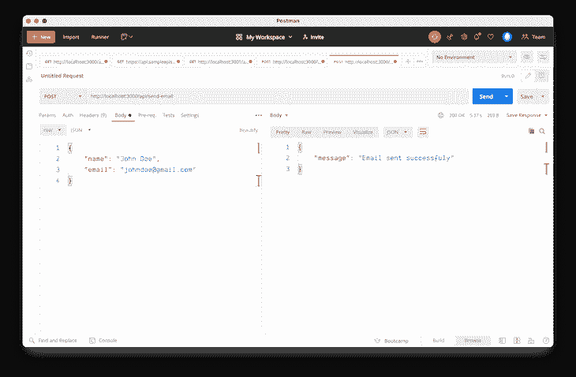
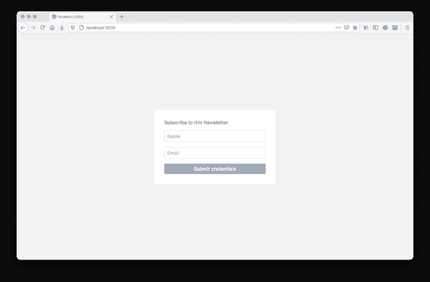
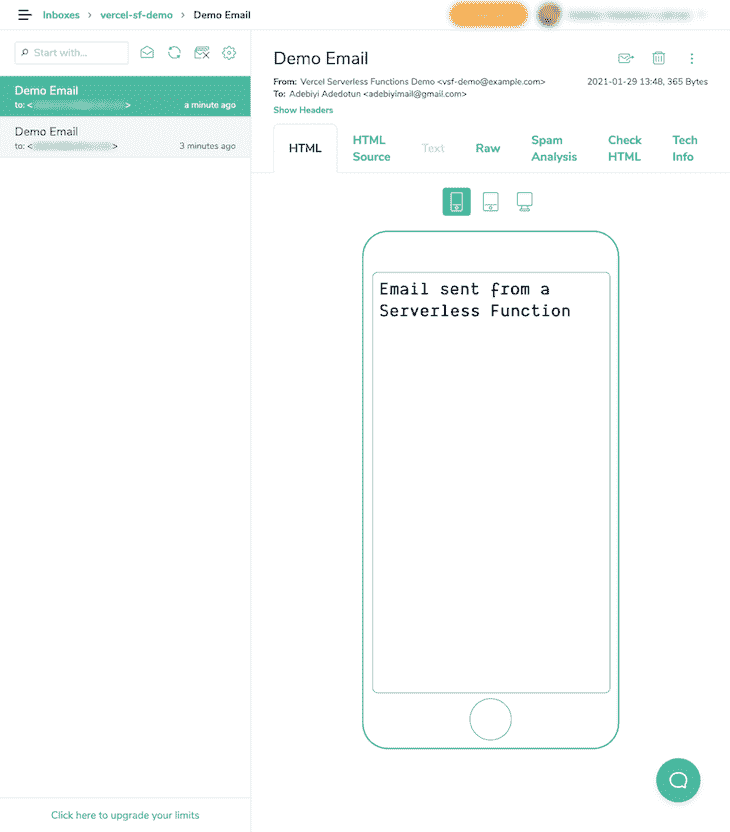

# 使用 Node.js 通过 Vercel 进行无服务器部署

> 原文：<https://blog.logrocket.com/serverless-deployments-vercel-node-js/>

在本教程中，我们将回顾如何以及何时通过 Vercel 云平台使用无服务器 Node.js 函数。

## 介绍

无服务器功能是运行在云服务器上的服务器端代码，不需要作为[无服务器计算架构](https://en.wikipedia.org/wiki/Serverless_computing)一部分的实际后端。这些功能是按需运行的，需要 AWS、Azure 或 Vercel 等云平台的帮助，以帮助管理编排和维护专用服务器的复杂性。

无服务器功能(也称为云功能或功能即服务(FaaS))可用于发送电子邮件、执行数据库查询、处理用户认证、管理表单提交等。对于前端开发者来说，去无服务器化有很多好处和权衡。

要成功运行无服务器功能，必须在将用于部署的云平台的技术范围内工作。对于本教程，我们将重点介绍 Vercel。Vercel 无服务器函数用[支持的后端语言](https://vercel.com/docs/serverless-functions/supported-languages)编写，像 [Node.js](https://nodejs.org/en/) ，在[支持的前端框架](https://github.com/vercel/vercel/tree/master/examples)，像 [React](https://reactjs.org) 。这些函数接受一个 HTTP 请求，对其进行操作，并根据项目计划在规定的超时时间内提供响应。

## 为什么将您的无服务器功能部署到 Vercel？

[Vercel](https://vercel.com/home) 是一个面向静态前端和无服务器功能的云平台。有了它，您可以托管即时部署和自动扩展的网站和 web 应用程序。

Vercel 对无服务器功能的处理是顶级的，原因有很多，首先是它的易用性。您的函数有一个熟悉且合理的默认基线，这使得学习曲线最小化。Vercel 也用一个`package.json`来统治他们所有人。您可以为您的应用程序使用一个单独的`package.json`,并且 Vercel 会根据 import 自动查找并应用所使用的包。

Vercel 还允许您定制运行时版本、内存和执行，并在 Vercel 仪表板附带的监控日志中监控您的功能和请求。如果不支持运行时，Vercel 允许你使用[社区运行时](https://vercel.com/blog/customizing-serverless-functions#community-runtimes)或[自己构建一个](https://vercel.com/docs/runtimes#advanced-usage/developing-your-own-runtime)。

最后， [Vercel CLI](https://vercel.com/docs/cli) 在本地为您复制生产环境，因此您可以使用您的无服务器功能，而无需在每次发生更改时重新部署。

## 将无服务器功能部署到 Vercel

在没有任何配置的情况下，将您的无服务器函数部署到 Vercel 就像在您的项目根目录下创建一个`/api`目录一样简单，该目录将您的函数保存为带有相应扩展名的文件，如`.js`和`.ts`。有了这个设置，Vercel 将自动检查`/api`目录并相应地执行您的函数。

基本的无服务器 Node.js 函数可能如下所示:

```
// `/api/hello.js`
export default function hello(req, res) {
  res.statusCode = 200;
  res.json({ message: 'It works' });
}

```

假设您使用上面的默认函数 export 在项目目录的根目录下创建了一个`/api/hello.js`文件。从这里开始，Vercel 将把这个函数作为一个无服务器函数来执行，并把它作为一个 HTTP 端点暴露在`/api`子目录后面(例如`baseURL/api/function-name`)。

假设您的`baseURL`是`[http://localhost:3000](http://localhost:3000)`，这里有更多的例子来说明您的文件和生成的 HTTP 端点看起来会是什么样子:

## 通过路径段访问您的无服务器功能

至此，您已经可以通过文件名访问无服务器功能了。如果您有一个文件`/api/user/id.js`，一个端点`/api/user/id`会自动生成。

更简单的是，无服务器函数可以通过[路径段](https://vercel.com/docs/serverless-functions/introduction#path-segments)动态命名和访问。这是通过将文件名放在方括号中来实现的，如`/api/user/[id].js`；`id`是动态路径，可以在`req.query`对象中访问。

```
// `/api/user/[id].js
export default function fetchUser(req, res) {
  res.statusCode = 200;
  const { id } = req.query;

  res.send(`Fetch profile for user: ${id}`);
}

```

无服务器函数的`request`和`response`参数分别是`[http.incomingMessage](https://nodejs.org/api/http.html#http_class_http_incomingmessage)`和`[http.ServerResponse](https://nodejs.org/api/http.html#http_class_http_serverresponse)`的实例。它们都有许多 Node.js 助手作为属性和方法供您使用，包括`request.body`、`request.query`、`response.json()`和`response.send()`。

有关所有可用助手的完整解释，请查看 [Node.js 助手文档](https://vercel.com/docs/runtimes#official-runtimes/node-js/node-js-request-and-response-objects/node-js-helpers)。

## 使用 Vercel CLI 进行本地开发

通常，每次进行更改时，您都需要将无服务器功能部署到 Vercel。Vercel 通过使用 Vercel CLI 在本地主机上复制 Vercel 上的生产环境来满足您的本地开发需求。

要安装 Vercel CLI，请运行以下命令:

```
// npm
npm i -g vercel

// yarn
yarn global add vercel

```

Vercel CLI 公开了一系列的[命令](https://vercel.com/docs/cli#commands)，包括用于本地复制 Vercel 生产环境的`vercel dev`，用于登录您的 Vercel 帐户的`vercel login`，以及用于向您的项目添加环境变量的`vercel env add`。

像 [Next.js](https://nextjs.org) 这样的框架有对无服务器函数的本地支持，所以你不需要使用`vercel dev`命令——事实上，[文档](https://vercel.com/docs/cli#commands/dev/when-to-use-this-command)建议不要使用它。然而，虽然您可能不需要`vercel dev`，但是如果您需要在本地下载项目的环境变量，您可能希望使用`vercel env pull`。

此外，运行 Next.js 应用程序会自动监听无服务器函数。要手动操作，使用`vercel dev`命令上的`--listen <port>`选项。例如，`vercel dev --listen 3000`监听端口 3000。

### 使用 Next.js 进行本地开发

你可能知道，Next.js 有一个[基于文件的路由系统](https://blog.logrocket.com/prefetching-dynamic-routing-next-js/)，这意味着`pages`目录中的每个新目录和/或文件都成为一个新的路由(除了`pages/api`目录中的目录和/或文件，它们成为 [API 路由](https://nextjs.org/docs/api-routes/introduction))。

尽管我们之前提到过`/api`目录应该创建在项目的根目录下，但是在使用 Next.js 时，存放无服务器函数的`/api`目录应该创建在`pages`目录下。一旦完成，您就可以像平常一样创建函数了。

### 使用其他支持的静态前端框架进行本地开发

对于不包含原生支持的框架，包括 Gatsby 和 Vue，`vercel dev`可以派上用场。但是，请注意，在运行`vercel dev`之前，您需要有一个 Vercel 帐户，并且需要使用命令`vercel login`通过 CLI 登录。

首先，创建一个`api`目录，并在项目的根目录下运行`vercel dev`命令。然后，按照说明并回答提供的问题(请注意，这些命令可能因您的身份验证状态而异):

*   建立和发展
*   哪个范围应该包含您的项目？
*   链接到现有项目？
*   你的项目叫什么名字？
*   您的代码位于哪个目录中？
*   想要覆盖设置吗？

当您成功完成该过程时，Vercel 将自动执行一些操作，包括:

*   创建并部署一个新项目，您可以在 Vercel 仪表板上查看它
*   将一个`.vercel`文件夹添加到您的项目中以供查看。这将包含一个自述文件，基本解释了为什么`.vercel`文件夹存在
*   自动检测框架，并根据项目的`package.json`中的 [npm 脚本](https://docs.npmjs.com/cli/v6/using-npm/scripts/)运行它
*   运行应用程序并提供访问 URL

要获得可以部署到 Vercel 的无服务器功能示例应用程序列表，请查看这个 [GitHub 存储库](https://github.com/vercel/vercel/tree/master/examples)。

## 配置环境变量

您可以通过 GUI 或通过 Vercel CLI 在 Vercel 的仪表板上直接从项目设置中配置环境变量。

通过 GUI 这样做相当简单:


Environment Variables section on Vercel’s dashboard

使用 Vercel CLI，您可以使用`vercel env add`命令添加环境变量，并使用`vercel env pull`将它们下载到本地项目中，这将在项目的根目录下创建新变量或将新变量追加到`.env`文件中。

无论您决定走哪条路，添加环境变量归结为三个基本特征:环境变量的类型(明文、秘密、系统提供)；环境变量的名称和值；以及您希望使变量可用的环境(生产、预览、开发或上述所有环境)。

参见[环境变量文档](https://vercel.com/docs/environment-variables)获取完整解释。

## 警告和技术细节

无服务器功能通过云平台的帮助运行在云上。虽然遵循无服务器函数的既定语法是绝对必要的，但是您还需要了解其他注意事项和技术细节。虽然 Vercel 为您的无服务器功能提供了一个很好的起点和合理的默认值，但是知道如何根据您的需要进行微调总是好的。

### 支持的语言

Vercel 官方支持四种后端语言或官方运行时:

*   Node.js，文件扩展名为`.js`或`.ts`
*   去，用`.go`文件扩展名
*   Python，文件扩展名为`.py`
*   Ruby，文件扩展名为`.rb`

还有对[社区运行时](https://vercel.com/docs/runtimes#advanced-usage/community-runtimes)的支持，如 [Deno](https://github.com/TooTallNate/vercel-deno) 、 [PHP](https://github.com/juicyfx/vercel-php) 和 [Rust](https://github.com/mike-engel/vercel-rust) 等。或者，你也可以[开发自己的运行时](https://vercel.com/docs/runtimes#advanced-usage/developing-your-own-runtime)。

### 执行超时

无服务器函数有一个[默认执行超时](https://vercel.com/docs/platform/limits#general-limits)，在此期间它们必须响应一个传入的 HTTP 请求。对于在默认执行超时时间内不响应 HTTP 请求的长期运行的无服务器功能，将返回 HTTP 502(错误网关)响应错误状态代码和错误代码`[NO_RESPONSE_FROM_FUNCTION](https://vercel.com/docs/error/application/NO_RESPONSE_FROM_FUNCTION)`。

### 保留的环境变量

有些环境变量名是保留的，因此您不能重用它们。参见[保留环境变量文件](https://vercel.com/docs/environment-variables#reserved-environment-variables)中的完整列表。

### 限制

需要注意的[限制](https://vercel.com/docs/platform/limits#serverless-function-payload-size-limit)有限。其中包括[无服务器功能有效负载大小限制、](https://vercel.com/docs/platform/limits#serverless-function-payload-size-limit)为 HTTP 请求或响应主体授予 5MB 的最大有效负载大小，以及[将无服务器功能部署到多个区域](https://vercel.com/docs/platform/limits#serverless-function-regions)，这根据您的计划是有限的。

### CORS headers

API 路由是为您的无服务器功能生成的路由。默认情况下，它们是[同源](https://developer.mozilla.org/en-US/docs/Web/Security/Same-origin_policy)，因为它们没有指定 [CORS 头](https://developer.mozilla.org/en-US/docs/Web/HTTP/CORS)。有几种方法可以让[在 Vercel](https://vercel.com/knowledge/how-to-enable-cors?query=cors#understanding-cors) 上启用 CORS。

## 使用节点邮件程序和邮件陷阱发送电子邮件

Diana Lepilkina 有一篇关于[如何用 Nodemailer 发送电子邮件的精彩文章。](https://blog.mailtrap.io/sending-emails-with-nodemailer/) [Nodemailer](https://nodemailer.com/about/) 是一个可以让你从 Node.js 发送邮件的模块，用命令`npm install nodemailer`或者`yarn add nodemailer`安装。

本节不是重复 Lepilkina 的解释，而是解释如何使用无服务器函数获得相同的结果。为了简单明了，这个例子使用了 Next.js。

继续的先决条件是拥有一个 MailTrap 帐户和一个安装了 Nodemailer 的 Next.js 应用程序。MailTrap 是一个电子邮件沙盒服务，可以捕获你的电子邮件，让你在正式发送之前检查和调试你的电子邮件样本。

假设您已经创建了一个 Next.js 应用程序，使用以下代码在您的 Next.js 应用程序中创建一个无服务器函数文件`/api/send-email.js`:

```
// 1\. Import the `nodemailer` module
import nodemailer from 'nodemailer';

// 2\. Create a `nodemailer` transporter - connect Nodemailer to MailTrap (transporter)
const transporter = nodemailer.createTransport({
  host: process.env.MAIL_HOST,
  port: 25,
  auth: {
    user: process.env.MAIL_USER,
    pass: process.env.MAIL_PASS,
  },
});

```

Nodemailer `createTransport`方法用于将 Nodemailer 连接到 MailTrap 或[邮戳](https://postmarkapp.com)之类的传输器。传递的选项——`host`、`port`和`auth`——属于 MailTrap。你需要从你的[收件箱](https://mailtrap.io/inboxes)中获取它们。


MailTrap projects and Inboxes

您可以重复使用收件箱或通过“添加收件箱”添加新的收件箱。然后，选择“Integrations”下的 Nodemailer 并复制您的 transporter 选项。


将主机、用户和 pass 选项保存为环境变量:`MAIL_HOST`、`MAIL_USER`、`MAIL_PASS`。

将`sendEmail`功能附加到`/api/send-email.js`上。

```
async function sendEmail({ name, email }) {
  const emailOptions = {
    from: 'Vercel Serverless Functions Demo <[email protected]>',
    to: `${name} - ${email}`,
    subject: 'Demo Email',
    html: `<h2>Email sent from a Serverless Function</h2>`,
  };

  // 3\. This will send the email with the `emailOptions` above.
  return transporter.sendMail(emailOptions);
}

```

默认的导出函数`handler`处理传入的请求，尝试`sendEmail`，然后做出适当的响应:

```
export default async function handler(req, res) {
  if (req.method === 'POST') {
    const emailRes = await sendEmail(req.body);
    if (emailRes.messageId) {
      return res.status(200).json({ message: `Email sent successfuly` });
    }

    return res.status(400).json({ message: 'Error sending email' });
  }

  return res.status(400).json({ message: `Incorrect method: ${req.method}. Did you mean POST?` });
}

```

如果你愿意，你可以使用 Postman 来测试它，如下图所示。看看如何基于 HTTP 方法使用单个函数进行响应？



Testing the serverless function on Postman

您还可以在 Next.js 上获取一个简单演示的[链接，该演示连接到一个表单。](https://www.notion.so/adebiyial/Serverless-Node-js-Functions-on-Vercel-43593e1c77284a4899e1be2b131ae272)



Demo application with Next.js serverless function to send email

此时，您的 MailTrap 收件箱应该开始接收电子邮件。



MailTrap inbox showing a couple of emails

## 结论

当与云计算平台集成时，无服务器功能消除了在后端工作的需要，即使在解决传统上面向后端的任务时也是如此。使用 Vercel，部署您的无服务器功能或通过 Vercel CLI 在本地工作可以帮助您更快地部署无服务器功能并节省时间。

如需更多资源，请查看[这份有用指南和文档的列表](https://www.notion.so/adebiyial/Serverless-Node-js-Functions-on-Vercel-43593e1c77284a4899e1be2b131ae272)。

## 200 只显示器出现故障，生产中网络请求缓慢

部署基于节点的 web 应用程序或网站是容易的部分。确保您的节点实例继续为您的应用程序提供资源是事情变得更加困难的地方。如果您对确保对后端或第三方服务的请求成功感兴趣，

[try LogRocket](https://lp.logrocket.com/blg/node-signup)

.

[](https://lp.logrocket.com/blg/node-signup)[https://logrocket.com/signup/](https://lp.logrocket.com/blg/node-signup)

LogRocket 就像是网络和移动应用程序的 DVR，记录下用户与你的应用程序交互时发生的一切。您可以汇总并报告有问题的网络请求，以快速了解根本原因，而不是猜测问题发生的原因。

LogRocket 检测您的应用程序以记录基线性能计时，如页面加载时间、到达第一个字节的时间、慢速网络请求，还记录 Redux、NgRx 和 Vuex 操作/状态。

[Start monitoring for free](https://lp.logrocket.com/blg/node-signup)

.