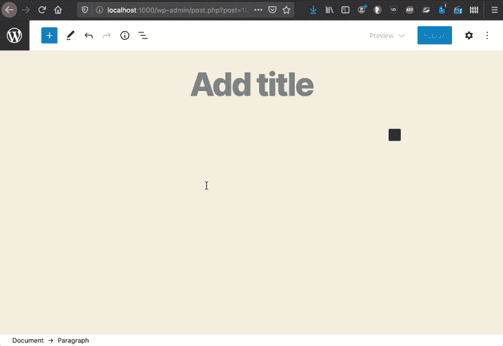
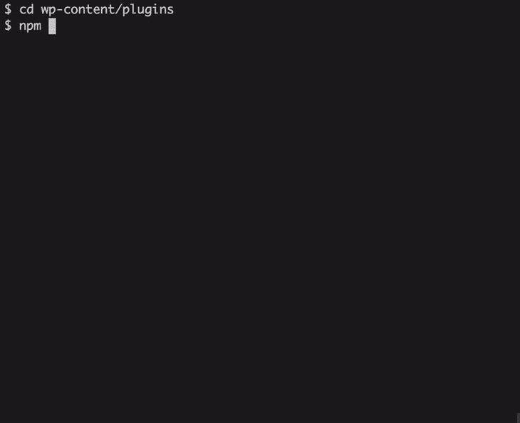
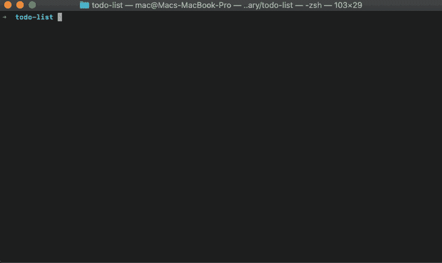

# 建立你的第一个古腾堡项目

> 原文：<https://blog.logrocket.com/setting-up-first-gutenberg-project/>

Gutenberg 是基于 React 的 WordPress 编辑器。它有两个版本:一个是[古腾堡插件](https://wordpress.org/plugins/gutenberg/)，开发周期很快，每两周就会推出新功能；以及与 WordPress core(简称 WordPress 编辑器)的集成，每三到四个月整合一次新功能。

Gutenberg 基于[块](https://developer.wordpress.org/block-editor/principles/key-concepts/#blocks)，这些块是高级组件，旨在提供可通过编辑器访问的单一功能，目前用于创建内容，但在[不久的将来](https://make.wordpress.org/core/2020/05/20/ways-to-keep-up-with-full-site-editing-fse/)，也用于构建网站。块使得将内容保存到数据库变得容易，并且基于 React，支持丰富的用户交互。

由于功能是通过插件提供的，WordPress 已经看到了将几个模块捆绑在一起的插件的出现。然而，自其最新版本(8.4 版本，2020 年 6 月底)以来，Gutenberg 在编辑器中集成了[一个块目录，这使我们能够在编辑博客文章时动态安装块:](https://make.wordpress.org/core/2020/06/24/whats-new-in-gutenberg-24-june/)



Block directory.

块目录仅适用于[单块插件](https://make.wordpress.org/meta/2019/03/08/the-block-directory-and-a-new-type-of-plugin/)。因此，生产只提供一个模块的插件提高了它被用户安装的机会:

*   **多块插件**:可通过[插件目录](https://wordpress.org/plugins/)安装
*   **单块插件**:可通过插件目录和块目录安装

在本文中，我们将学习如何为单块插件和多块插件创建一个新项目，以及如何毫不费力地设置开发环境。

## 搭建单块插件

有几个工具可以使项目设置过程自动化。这些都带有预定义的配置，适用于大多数情况，并且可以针对特殊情况进行定制，包括 [webpack](https://webpack.js.org/) (捆绑 JavaScript 文件进行分发) [Babel](https://babeljs.io/) (将现代 JavaScript 代码编译成可以在旧浏览器中运行的遗留代码) [ESLint](https://eslint.org/) (分析 JavaScript 代码)，以及其他一些依赖项。

可用的工具有:

是官方解决方案，由开发 Gutenberg 的团队维护。因此，我们可以期望它总是与项目的需求保持同步。例如，在 Gutenberg 8.4 发布的同时，`@wordpress/create-block`被更新为[生成所需的元数据](https://github.com/WordPress/gutenberg/blob/9e9d4b937e6f13cec3ba3114330211edbf90e243/packages/create-block/CHANGELOG.md#0160-2020-06-25)以支持块目录。

这个工具主要受 create-react-app 的启发:它是一个 Node.js 流程，利用 npm 来安装所需的依赖项。为了搭建新块，我们[在命令行](https://developer.wordpress.org/block-editor/packages/packages-create-block/#usage)中执行:

```
npm init @wordpress/block [options] [slug]
```

`slug`是用于识别的 block slug，它也会给插件起名字。选项是可选的，但是建议提供以下选项(否则，它将使用默认的通用选项):

*   `--namespace <value>`–块名的内部命名空间
*   `--title <value>`–显示块的标题
*   `--short-description <value>`–块的简短描述
*   `--category <name>`–块显示在哪个类别下

运行该命令将创建一个新目录，并以`slug`作为其名称(在本例中为`todo-list`):



Scaffolding a new block through @wordpress/create-block. (Image from developer.wordpress.org)

该目录将包含插件和块所需的所有文件:

```
todo-list/
├──build/
│ ├── index.asset.php
│ ├── style.css
│ ├── style-index.css
│ └── index.js
├── src/
│ └── index.js
├── .gitignore
├── .editorconfig
├── block.json
├── package.json
├── package-lock.json
├── todo-list.php
└── readme.txt
```

*   `block.json`包含块目录所需的元数据
*   `readme.txt`包含插件目录所需的信息
*   `todo-list.php`(跟随提供的`slug`)是插件的主文件
*   `package.json`按块定义所有的 JavaScript 依赖关系
*   `src/index.js`是块的入口
*   `build/index.js`是编译后的 JavaScript 代码
*   `build/style.css`和`build/style-index.css`是编译后的 CSS 文件，包含从 Sass 文件中提取的样式

创建项目后，我们可以在终端中进入目录，并执行以下命令:

*   `npm start`–开始开发构建
*   `npm run build`–构建生产代码
*   `npm run format:js`–格式化 JavaScript 文件
*   `npm run lint:css`–lints CSS 文件
*   `npm run lint:js`–lints JavaScript 文件
*   `npm run packages-update`–将 WordPress 软件包更新到最新版本

## 搭建一个正则脚本插件

尽管 Gutenberg 在很大程度上是基于块的，但也有一些领域的功能是通过标准组件而不是块来提供的。例如，在文档选项卡 panel 上添加一个[面板](https://developer.wordpress.org/block-editor/components/panel/)就是这种情况:


Sidebar panel.

下面的代码演示了一个示例面板组件:

```
import { registerPlugin } from '@wordpress/plugins';
import { PluginDocumentSettingPanel } from '@wordpress/edit-post';

const WelcomeGuidePluginDocumentSettingPanel = () => (
  <PluginDocumentSettingPanel
    name="welcome-guide"
    title="Welcome Guide"
    className="welcome-guide"
  >
    ... (Welcome Guide Contents)
  </PluginDocumentSettingPanel>
);

registerPlugin( 'welcome-guide-plugin-document-setting-panel', {
  render: WelcomeGuidePluginDocumentSettingPanel,
  icon: 'welcome-view-site',
} );
```

目前，还没有生成非块的搭建工具(有一个[特性请求](https://github.com/WordPress/gutenberg/issues/23514)来实现它)。因此，就目前而言，最好的策略是仍然利用`@wordpress/create-block`来生成一个单块插件，然后通过修改 PHP 文件来处理常规脚本，如这里的[所述](https://css-tricks.com/adding-a-custom-welcome-guide-to-the-wordpress-block-editor/#step-1-scaffolding-the-script)。

## 搭建一个多块插件

存在单块插件不适合的情况。例如，如果我们的插件提供一个自定义的文章类型，通过它自己的自定义块来操作，那么在同一个插件中包含所有的块是有意义的。

`@wordpress/create-block`处理创建单块插件。然后，为了创建一个多块插件，我们可以使用以下策略。

为 WordPress 插件创建文件夹`my-plugin`；它的主文件`my-plugin.php`，包含[标准插件信息](https://developer.wordpress.org/plugins/plugin-basics/header-requirements/)；[readme . txt](https://codex.wordpress.org/Writing_a_Plugin#Readme_File)；还有一个子文件夹，`blocks/`:

```
my-plugin/
├──blocks/
├── my-plugin.php
└── readme.txt
```

在`blocks/`中，运行几次`npm init @wordpress/block [options] [slug]`命令，每个程序块一次(在本例中是`block1`和`block2`)。这样，所有的块都是相互独立的；每个都有自己的`package.json`，并且可以有自己的 webpack 配置。然后，从每个块中删除文件`readme.txt`和`block.json`，并编辑主文件以删除插件信息:

```
my-plugin/
├──blocks/
│ ├──block1/
│ │ ├── build/
│ │ │ ├── index.asset.php
│ │ │ ├── style.css
│ │ │ ├── style-index.css
│ │ │ └── index.js
│ │ ├── src/
│ │ │ └── index.js
│ │ ├── .gitignore
│ │ ├── .editorconfig
│ │ ├── package.json
│ │ ├── package-lock.json
│ │ └── block1.php
│ └──block2/
│   ├── build/
│   │ ├── index.asset.php
│   │ ├── style.css
│   │ ├── style-index.css
│   │ └── index.js
│   ├── src/
│   │ └── index.js
│   ├── .gitignore
│   ├── .editorconfig
│   ├── package.json
│   ├── package-lock.json
│   └── block2.php
├── my-plugin.php
└── readme.txt
```

最后，从主插件文件(`my-plugin.php`)，`require`屏蔽所有主文件:

```
require 'blocks1/block1.php';
require 'blocks2/block2.php';
```

如果我们想让不同的块托管在它们自己的存储库中，我们可以通过 [Composer](https://getcomposer.org) 将它们导入到插件中，正如这里所描述的[。](https://www.designbombs.com/creating-a-gutenberg-block-using-the-official-new-package/)

## 设置开发环境

`[wp-env](https://developer.wordpress.org/block-editor/packages/packages-env/)`是一个基于 [Docker 的](https://www.docker.com/)，无配置工具，用于建立一个本地 WordPress 环境来构建和测试插件和主题。

要进行全局安装，请运行:

```
npm -g i @wordpress/env
```

然后，要初始化一个新的 WordPress 环境，确保 Docker 正在运行，浏览到终端中插件的文件夹，并执行:

```
wp-env start
```

就这样——一个新的 WordPress 实例将在`localhost:8888`下创建，并安装和激活我们的插件。这真的再简单不过了。该流程提供了一个完整的工作实例，将数据保存到一个附加的数据库中，因此如果我们`wp-env stop`服务，然后再`wp-env start`它，就不会有数据丢失。

在后台，Docker 脚本安装一个 [MariaDB](https://mariadb.com/) 数据库的实例，下载最新版本的 WordPress，安装并配置它。第一次创建环境时，下载所有文件可能需要相当长的时间(甚至半小时或更长)。从那时起，创建额外的 WordPress 环境应该只需要几分钟。

执行带有`--debug`选项的命令来查看流程运行时发生了什么是一个好主意:

```
wp-env start --debug
```



Running wp-env start –debug.

默认情况下会安装 WP-CLI 。通过`wp-env run [container] [command]`命令，我们可以使用 WP-CLI 与 WordPress 交互，并通过[从数据库](https://make.wordpress.org/core/2020/03/03/wp-env-simple-local-environments-for-wordpress/#comment-38165)中查询数据。例如，此命令检索用户列表:

```
wp-env run cli wp user list
```

WordPress 环境可以通过位于项目根目录的文件`[.wp-env.json](https://developer.wordpress.org/block-editor/packages/packages-env/#wp-env-json)`进行配置。我们可以定义以下属性:

*   使用什么版本的 WordPress(默认为最新版本)
*   要下载(从 GitHub repo、某个 URL 的. zip 文件或本地文件)、安装和激活什么主题/插件
*   在哪个端口下运行(默认`8888`)
*   `wp-config.php`的常数定义

`wp-env`可以帮助降低为开源项目做贡献的门槛:通过在存储库中添加文件`.wp-env.json`,贡献者几乎可以立即开始编写代码。

例如，下面的开源 WordPress 插件的`.wp-env.json`文件使站点可以在`localhost:6375`下访问(有助于确保我们的实例不会与其他实例冲突)，安装插件和 Gutenberg，并在屏幕上打印错误以便调试:

```
{
  "plugins": [
    "https://downloads.wordpress.org/plugin/gutenberg.zip",
    "."
  ],
  "port": 6375,
  "testsPort": 6376,
  "config": {
    "WP_DEBUG_DISPLAY": true
  }
}
```

## 即将推出:设置热模块更换

webpack 的热模块替换(HMR)可以在应用程序运行时交换、添加或删除模块，而无需完全重装，从而显著加快开发速度。到目前为止，Gutenberg 只能支持 live reload，这是一个较慢的 HMR 版本，可以在观察到变化时重新加载页面。

然而，`wp-env`使得在开发网站时为 HMR 提供支持成为可能。当通过即将到来的全站点编辑器(计划用于 WordPress 5.6 ，2020 年 12 月)建立站点时，HMR 将会非常有用。

[该拉取请求](https://github.com/WordPress/gutenberg/pull/23013)(待合并)增加了以下命令:

```
npm run dev:edit-site
```

在项目的根上执行它之后，对代码的任何更改都将立即生效，而无需重新加载页面。

## 结论

Gutenberg 强调需要学习 React 和 JavaScript。此外，整个 Gutenberg 项目涉及到一些技术(webpack、Babel、ESLint、Docker ),直到不久前，开发人员还不需要掌握——甚至不需要知道——来创建一个 WordPress 插件。所需要的只是一些 PHP 知识。

幸运的是，尽管复杂性增加了，但新的工具正在被创造出来以帮助管理这种复杂性，从而减少了启动新的古腾堡项目所需的知识量。在本文中，我们探索了用于自动创建新插件的`@wordpress/create-block`，用于毫不费力地设置开发环境的`wp-env`，以及将使该过程更加容易和更好的新工具。

## 使用 [LogRocket](https://lp.logrocket.com/blg/signup) 消除传统错误报告的干扰

[](https://lp.logrocket.com/blg/signup)

[LogRocket](https://lp.logrocket.com/blg/signup) 是一个数字体验分析解决方案，它可以保护您免受数百个假阳性错误警报的影响，只针对几个真正重要的项目。LogRocket 会告诉您应用程序中实际影响用户的最具影响力的 bug 和 UX 问题。

然后，使用具有深层技术遥测的会话重放来确切地查看用户看到了什么以及是什么导致了问题，就像你在他们身后看一样。

LogRocket 自动聚合客户端错误、JS 异常、前端性能指标和用户交互。然后 LogRocket 使用机器学习来告诉你哪些问题正在影响大多数用户，并提供你需要修复它的上下文。

关注重要的 bug—[今天就试试 LogRocket】。](https://lp.logrocket.com/blg/signup-issue-free)