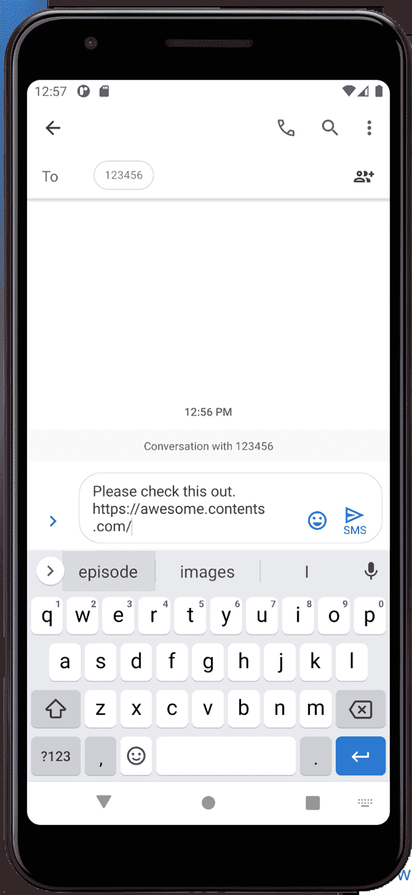
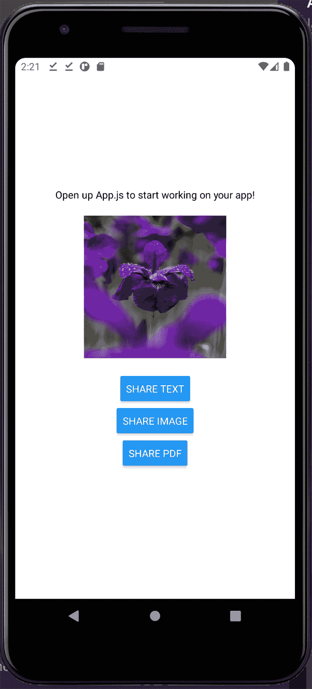
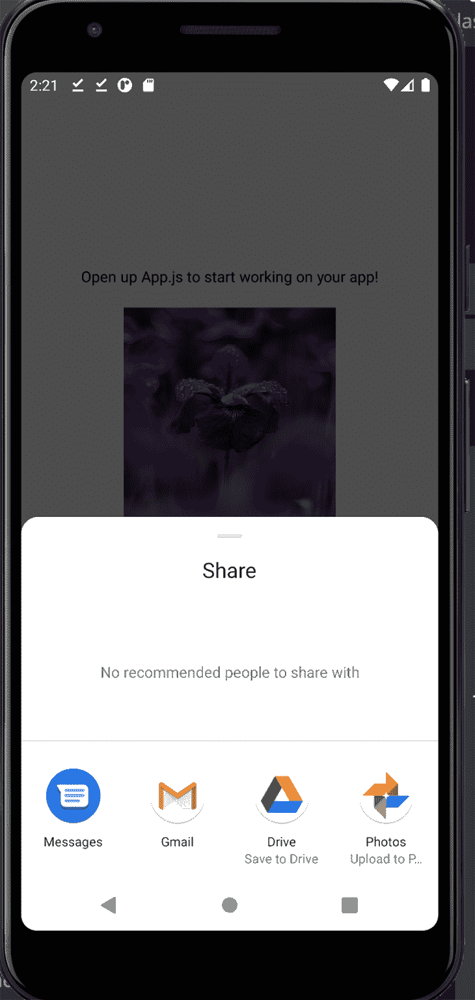

# 使用 React Native Share - LogRocket 博客在 React Native 应用程序中共享内容

> 原文：<https://blog.logrocket.com/sharing-content-react-native-apps-using-react-native-share/>

## 介绍

随着社交媒体应用的兴起，企业保持相关性和接触更广泛受众的需要怎么强调都不为过。作为工程师，我们经常制造影响人们生活的产品。虽然我们的解决方案可能很棒，但要将这些解决方案送到用户手中，往往需要的不仅仅是将它们投入生产。

随着我们的应用程序变得越来越互联，让我们的用户能够与其他应用程序共享内容变得越来越重要——因此，与其他受众共享内容也变得越来越重要。

本文的目的是向您展示如何在 React 本机支持的应用程序中实现与其他应用程序的内容共享。

在我们探索如何分享和分享什么之前，让我们首先从用户的角度考虑为什么。为什么我们的移动应用需要内容共享功能？从用户的角度来看，与其他应用共享内容有助于他们:

*   收集他们感兴趣的内容
*   在其他平台上与他们的网络共享内容
*   将内容加入书签并保存，以便以后查找

从商业角度来看，用户从一个应用程序或社交网络向另一个应用程序或社交网络共享内容增加了企业的可见性和受众。可以把它想象成一种间接的口碑传播形式，从一个用户到他们的网络。分享的用户为应用程序的潜在新用户打开了大门。

从开发人员的角度来看，有几种方法可以提供这种功能。React Native 提供了一个[包，能够为其支持的移动应用程序共享特性](https://reactnative.dev/docs/share)。让我们简单地研究一下这个包。

## React Native 内置的共享包

为了给我们一个透视感，让我们从 React Native 安装共享包，如下所示:

```
javascript
import React from 'react';
import { Share, View, Button } from 'react-native';

const ShareExample = () => {
  const onShare = async () => {
    try {
      const result = await Share.share({
        message:
          'React Native | A framework for building native apps using React',
      });
      if (result.action === Share.sharedAction) {
        if (result.activityType) {
          // shared with activity type of result.activityType
        } else {
          // shared
        }
      } else if (result.action === Share.dismissedAction) {
        // dismissed
      }
    } catch (error) {
      alert(error.message);
    }
  };
  return (
    <View style={{ marginTop: 50 }}>
      <Button onPress={onShare} title="Share" />
    </View>
  );
};

export default ShareExample;

```

请注意:这段代码取自共享包文档。

`share`方法接受两个参数:`content`和`options`。`content`有三个字段；`message`、`title`和`url`。`url`字段只在 iOS 中有效。

React Native 的共享包的问题是它的功能非常有限。例如，您不能使用这个包轻松地共享其他形式的数据，如 PDF 或音频文件。使用 React Native 的共享，您也不能共享到特定的社交应用程序，例如 Instagram Stories。

为了避开这些限制，我们可以使用更健壮的 [React 本地共享包](https://github.com/react-native-share/react-native-share)。

React Native Share 诞生于 [React Native 不断壮大的贡献者社区](https://blog.logrocket.com/why-keep-faith-react-native/)。这是一个支持与其他应用程序进行社交共享的包，并带有内置功能，如在脸书故事和其他社交应用程序上共享 PDF 文件、图像等。

让我们通过一个演示来探索这个包。在这个演示中，我将使用 Expo。您可以从一个简单的工作流程开始。我不会讨论这个演示的安装部分，因为世博会文件已经对此进行了足够详细的讨论。

我还将在 Android 模拟器中运行这个项目，但是您可以自由地使用您的目标操作系统平台。

## 要求

*   世博 CLI
*   Node.js v12.0.0 或更高版本

运行`expo init <your_app_name>`开始。

如前所述，要安装 React 原生共享包，请遵循[Expo 安装说明](https://reactnative.dev/docs/share)。

## 共享链接

安装包后，运行`npm start`然后`npm run <os_name e.g. android>`启动应用程序。

让我们从简单的事情开始:分享一个链接。

```
javascript
import { StatusBar } from "expo-status-bar";
import React from "react";
import { StyleSheet, Text, View, Button } from "react-native";
import Share from "react-native-share";

const url = "https://awesome.contents.com/";
const title = "Awesome Contents";
const message = "Please check this out.";

const options = {
  title,
  url,
  message,
};

export default function App() {
  const share = async (customOptions = options) => {
    try {
      await Share.open(customOptions);
    } catch (err) {
      console.log(err);
    }
  };

  return (
    <View style={styles.container}>
      <Text>Open up App.js to start working on your app!</Text>
      <StatusBar style="auto" />
      <Button
        onPress={async () => {
          await share();
        }}
        title="Share"
      />
    </View>
  );
}

const styles = StyleSheet.create({
  container: {
    flex: 1,
    backgroundColor: "#fff",
    alignItems: "center",
    justifyContent: "center",
  },
});

```

我们来了解一下是怎么回事。首先，我们导入 React 本地共享包，然后定义三组选项:

*   标题，这是发送到应用程序操作系统的共享活动的标题
*   共享内容时包含消息的选项
*   一个 URL，这是我们想要分享的链接

然后，我们创建一个`share`函数来处理对共享的`open`方法的调用，并将`options`道具传递给这个方法。接下来，我们将这个`share`函数传递给一个按钮。

如果你在模拟器上测试，你会看到不同的共享选项。我将使用短信选项。当您选择此选项时，您会看到短信正文中设置的消息和 URL。



## 共享媒体文件

接下来，我们分享一张图片和一个 PDF 文件。若要共享媒体文件，您需要共享该文件的 base64 编码格式。对于本教程，我已经包含了一个`base64.js`文件，其中包含一个转换为 base64 格式的图像和 PDF。

```
javascript
import { StatusBar } from "expo-status-bar";
import React from "react";
import { StyleSheet, Text, View, Button, Image } from "react-native";
import Share from "react-native-share";
import file from "./assets/base64";

const url = "https://awesome.contents.com/";
const title = "Awesome Contents";
const message = "Please check this out.";

const options = {
  title,
  url,
  message,
};
export default function App() {
  const [image, setImage] = React.useState(
    "file:///data/user/0/com.rnshare/cache/rn_image_picker_lib_temp_0f9dbf03-c89c-4728-a763-6b15e3752f8e.jpg"
  );
  const share = async (customOptions = options) => {
    try {
      await Share.open(customOptions);
    } catch (err) {
      console.log(err);
    }
  };

  return (
    <View style={styles.container}>
      <Text>Open up App.js to start working on your app!</Text>
      <StatusBar style="auto" />
      <Image
        source={{
          uri: image,
        }}
        style={{ ...styles.containerImg, ...styles.stretchImg }}
      />
      <View style={{ marginVertical: 5 }}>
        <Button
          onPress={async () => {
            await share();
          }}
          title="Share Text"
        />
      </View>
      <View style={{ marginVertical: 5 }}>
        <Button
          onPress={async () => {
            await share({
              title: "Sharing image file from awesome share app",
              message: "Please take a look at this image",
              url: file.img,
            });
          }}
          title="Share Image"
        />
      </View>
      <View style={{ marginVertical: 5 }}>
        <Button
          onPress={async () => {
            await share({
              title: "Sharing pdf file from awesome share app",
              message: "Please take a look at this file",
              url: file.pdf,
            });
          }}
          title="Share pdf"
        />
      </View>
    </View>
  );
}

const styles = StyleSheet.create({
  container: {
    flex: 1,
    backgroundColor: "#fff",
    alignItems: "center",
    justifyContent: "center",
  },
  containerImg: {
    paddingTop: 50,
    marginVertical: 20,
  },
  stretchImg: {
    width: 200,
    height: 200,
    resizeMode: "stretch",
  },
});

```

我共享的图像显示在模拟器上。



我创建了两个按钮——一个用于共享图像，另一个用于在模拟器上共享编码的 PDF 文件。

当您点击**共享图像**按钮时，会显示一个包含支持共享的不同应用的 UI。然后你可以点击任何你想分享的应用程序。

请务必注意，根据您共享的文件类型，某些应用程序将不会显示。例如，当您共享 PDF 文件时，照片应用程序不会显示在可共享目的位置列表中。



## 共享到特定应用程序

我们在这里仅仅触及了表面，使用 React Native Share 包可以做很多事情。如果您的使用案例需要，您可以直接分享到特定的应用程序，例如 WhatsApp。让我们看看怎么做。

在创建的初始`share`函数下面添加以下方法。

```
javascript
  const singleShare = async (customOptions) => {
    try {
      await Share.shareSingle(customOptions);
    } catch (err) {
      console.log(err);
    }
  };

```

接下来，在最后一个按钮下面添加代码:

```
javascript
 <View style={{ marginVertical: 5 }}>
        <Button
          onPress={async () => {
            await singleShare({
              title: "Share via whatsapp",
              message: "some awesome dangerous message",
              url: file.pdf,
              social: Share.Social.WHATSAPP,
              whatsAppNumber: "9199999999",
              filename: file.pdf,
            });
          }}
          title="Share to whatsapp"
        />
 </View>

```

所以，我们来分解一下。我们访问 share 包中的`singleShare`方法，它接受与`open`方法相似的选项和附加属性。我们传递我们想要定位的社交应用，然后是`whatsAppNumber`，最后，我们传递我们想要分享的文件。

它支持大量其他社交应用程序；请查看文档以获得它们的列表。

## 检测已安装的共享应用

在前面的代码中，我们假设用户安装了 WhatsApp。鉴于它的应用下载量，这可能是真的，但作为工程师，我们不能做出这种假设。

如果我们想检测用户是否安装了应用程序，该怎么办？幸运的是，React 本地共享包为我们提供了一个有用的方法。

让我们看看如何重用我们的 WhatsApp 示例，但首先要确认用户安装了 WhatsApp。

重构`singleShare`函数:

```
javascript
 const singleShare = async (customOptions) => {
    try {
      const { isInstalled } = await Share.isPackageInstalled(
        "com.whatsapp.android"
      );

      if (isInstalled) {
        await Share.shareSingle(customOptions);
      } else {
        Alert.alert(
          "Whatsapp not installed",
          "Whatsapp not installed, please install.",
          [{ text: "OK", onPress: () => console.log("OK Pressed") }]
        );
      }
    } catch (err) {
      console.log(err);
    }
  };

```

我们首先使用`isPackageInstalled`方法并传递应用程序的 ID 来检查 WhatsApp 是否已安装。此 id 必须是有效的 iOS 或 Android 应用程序 ID。然后，如果安装了，我们调用`singleShare`方法，否则我们警告用户 WhatsApp 没有安装。

不幸的是，`isPackageInstalled`方法只适用于 Android，但你可以在 iOS 中使用`Linking.canOpenURL(<app_schema>)`来检查应用程序是否安装在[用户的设备上。](https://blog.logrocket.com/how-to-build-ios-apps-using-react-native/)

## 结论

我们已经走了很长的路了！我们首先探索了来自 [React Native](https://blog.logrocket.com/tag/react-native) 的内置`share`包，并查看了它的局限性。接下来，我们检查了 React 原生共享包，以及它在与各种社交应用程序共享各种类型的媒体方面给予我们的超能力。

我们可以对我们的应用程序进行的一项改进是，首先在初始渲染期间检测应用程序上是否安装了某些特定的社交应用程序，如 WhatsApp，然后隐藏或显示**共享到 WhatsApp** 按钮。这提供了更好的用户体验。

需要注意的是，React 原生共享包还不支持 Expo 管理的引导应用程序。此外，这将无法与 Expo Go 客户端一起工作，即使您使用的是一个简单的工作流。如果你的项目使用 Expo 并依赖于 Expo Go 客户端，你应该查看 Expo 共享包。

我希望我已经以某种方式帮助你理解了如何在你的应用中启用共享功能。去创造一些伟大的东西吧，我支持你。

## [LogRocket](https://lp.logrocket.com/blg/react-native-signup) :即时重现 React 原生应用中的问题。

[](https://lp.logrocket.com/blg/react-native-signup)

[LogRocket](https://lp.logrocket.com/blg/react-native-signup) 是一款 React 原生监控解决方案，可帮助您即时重现问题、确定 bug 的优先级并了解 React 原生应用的性能。

LogRocket 还可以向你展示用户是如何与你的应用程序互动的，从而帮助你提高转化率和产品使用率。LogRocket 的产品分析功能揭示了用户不完成特定流程或不采用新功能的原因。

开始主动监控您的 React 原生应用— [免费试用 LogRocket】。](https://lp.logrocket.com/blg/react-native-signup)