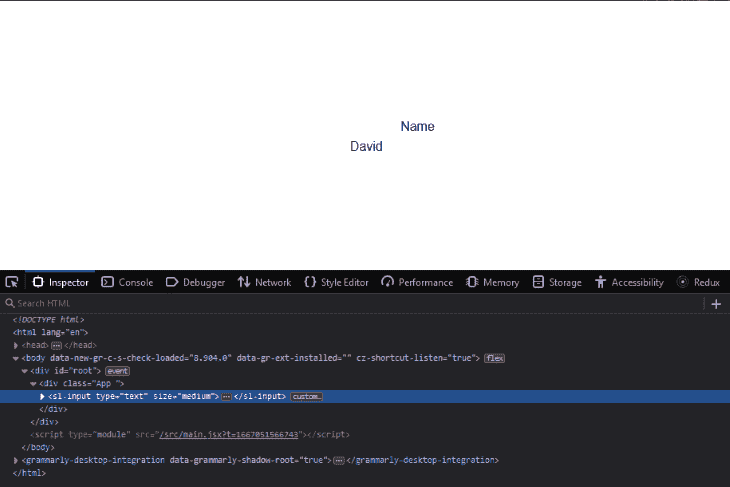
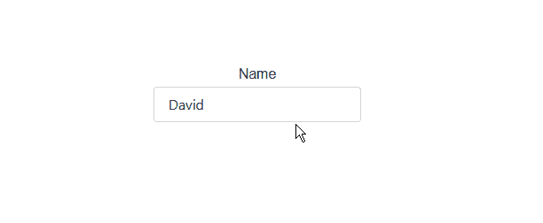
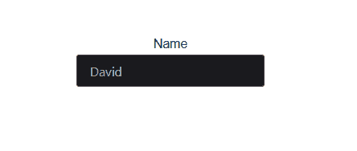
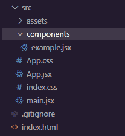
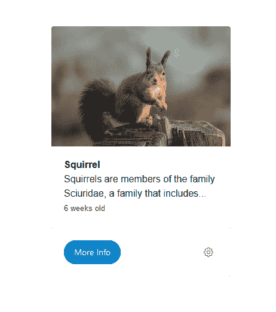
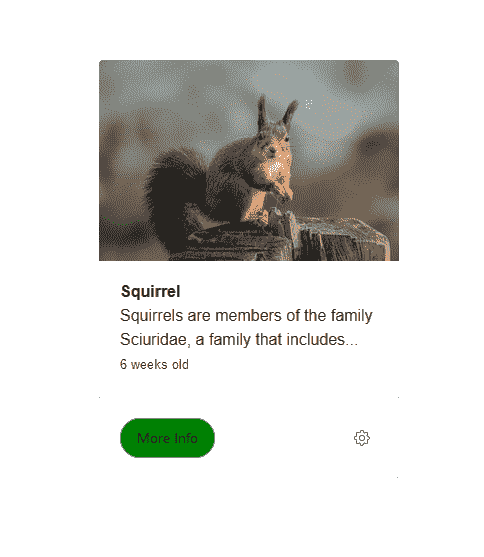
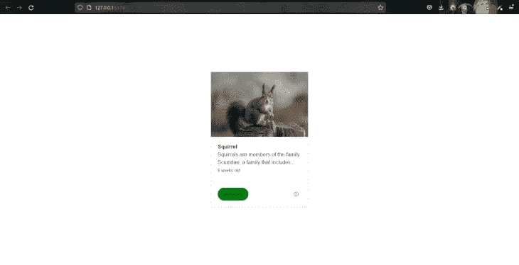
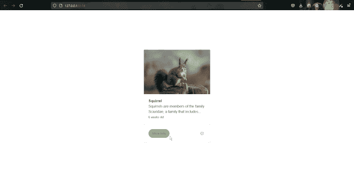

# 鞋带:为 React 构建 web 组件

> 原文：<https://blog.logrocket.com/shoelace-build-web-components-react/>

尽管 web 组件是在 2011 年引入的，但它们并不是普通开发人员编写 UI 布局的第一或第二选择，尽管该技术提供了什么。

这部分是由于 JavaScript 框架、组件驱动的开发爱好者和其他深奥因素的增加。

现在，鞋带出现了，这是一个基于 web 组件技术的 UI 库，它提供了与任何 JavaScript 框架相同的体验，但有更好的附加功能。

在本文中，我们将介绍鞋带，看看它的内部功能，并演示如何使用它的组件和 React 来构建一个简单的界面。

向前跳:

## 先决条件

要跟随本教程，您需要以下内容:

*   React 的工作知识
*   您的计算机上安装了最新版本的 Node.js

## 鞋带是什么？

鞋带是一个开源的、框架无关的组件，用于构建可访问的 web 应用程序。

与导出特定于特定框架的用户界面组件和元素的传统 UI 库不同，鞋带提供了一组高度可定制的 UI 组件，这些组件构建在一种与框架无关的技术上，称为 web 组件。

## 什么是 web 组件？

web 组件是标准 web 技术的组合，它允许您创建可重用的自定义元素或组件，这些元素或组件将功能和样式封装在代码的其余部分之外。

web 组件规范由三种技术组成:

*   **定制元素**:这些 HTML 元素具有定制的标签名称和行为，由一组 JavaScript APIs 指定，可以在应用程序的任何地方使用
*   **Shadow Dom** :这是一组 JavaScript APIs，将一个作用域 Dom 树附加到一个元素上。它隔离了自定义元素的功能和样式，以避免与文档的其他部分冲突
*   **HTML 模板**:这些 HTML 元素(`<template>`和`<slot>`)使您能够创建标记模板，这些模板在被调用之前不会被呈现

这些技术一起用于创建具有封装功能的 web 组件。

查看文档，了解更多关于 [web 组件规范](https://developer.mozilla.org/en-US/docs/Web/Web_Components)的信息。

## 使用鞋带的好处

Angular、React 和 Vue.js 等前端框架基于使用组件驱动的开发来创建组件的有组织 UI 的概念，这些组件将内容、功能和样式封装到单个 JavaScript 文件中。

尽管这确实减轻了 web 开发中存在的复杂约束，但它也有一些缺点:

*   组件是特定于框架的，这意味着它们只能在为其设计的框架中使用
*   开发人员必须学会如何使用组件设计的框架
*   组件的寿命受到框架寿命的限制
*   当切换到另一个框架时，开发人员必须重新构建基础组件

Web 组件旨在解决这些问题。

鞋带是建立在 web 组件技术上的。它导出 HTML 和 DOM 标准组件，这些组件被所有现代浏览器支持，并在不同的框架中工作。

使用鞋带有很多好处；以下是一些例子:

*   完全可定制的组件，以匹配现有设计
*   能够使用共享相同 UI 组件的不同框架构建多个应用程序
*   无需重新构建基础组件即可切换框架
*   持续的浏览器支持

## 鞋带入门

安装鞋带就像给你的项目文档添加一个`<script></script>`标签一样简单。然而，并不是每个框架都提供对 web 组件的内置支持。

例如，React 渲染树不能正确传播 web 组件发出的事件。为了解决这个问题，鞋带创建了包装器，让我们在 React 中使用 web 组件。

将鞋带整合到项目中有三种官方方式:

*   **CDN** :这是将鞋带融入你的项目最简单的方法；它需要将 CDN 脚本和样式链接添加到您的文档中
*   **本地安装**:这个方法让你使用 Node.js 包管理器在本地安装鞋带
*   通过 CDN 或本地安装鞋带将会在你的项目中产生完整的库，从而减少你的应用程序的加载时间。相反，鞋带让你挑选并安装那些你真正需要的组件

### 装置

在这篇文章中，我们将使用 React 来演示鞋带的用法。由于鞋带使用了 React 的包装器，我们只能使用 npm 在本地安装这个库。

出于演示的目的，我假设您已经设置了一个 React 项目。现在，用下面的命令安装鞋带:

```
npm install @shoelace-style/shoelace

```

安装了鞋带后，您可以通过将它们导入到您的组件中来开始使用它的组件，就像这样:

```
import { SlInput } from "@shoelace-style/shoelace/dist/react";
function App() {
  return (
    <div className="App ">
      <SlInput value={"David"} label="Name" />
    </div>
  );
}

export default App;

```

如您所见，鞋带组件是作为 React 组件导入的，而不是实际的自定义元素。这是单独反应所特有的；上面代码中的`<SlButton>`组件将作为其他框架(如 Vue、Svelte 或 Angular)中的`<sl-button>`定制元素导入。

上述代码将向浏览器呈现一个基本的 input 元素，但没有默认样式:



### 主题选择

鞋带组件被设计成与你的项目可能有的不同主题系统高度兼容。您可以选择浅色或深色主题，或者创建一个现成的自定义主题。

添加到项目中的主题将决定组件的默认样式。例如，假设您通过将样式表链接到项目的`App.js`文件来将`light`主题添加到项目中:

```
import "./App.css";
import { SlInput } from "@shoelace-style/shoelace/dist/react";

//light theme stylesheet
import "@shoelace-style/shoelace/dist/themes/light.css";

function App() {
  return (
    <div className="App">
      <SlInput value={"David"} label="Name" />
    </div>
  );
}

export default App;

```

输入组件将以默认样式呈现(在本例中，由`light`主题决定)，如下所示:



如果您添加了`dark`主题，组件将使用与该主题相对应的默认样式来呈现:



与`light`主题不同，要使用`dark`主题，必须在将样式表导入项目后激活它。您可以通过将`sl-theme-dark`添加到`App.js`文件中父`div`的`className`中来实现，如下所示:

```
//dark theme stylesheet
import "@shoelace-style/shoelace/dist/themes/dark.css";

function App() {

  return (
    <div className="App sl-theme-dark">
      <SlInput value={"hello"} />
    </div>
  );
}

export default App;

```

到目前为止，您应该对鞋带的工作原理以及如何将其集成到 React 项目中有了基本的了解。

接下来，让我们创建一个组合来更好地了解鞋带组件的内部功能。

## 在 React 中使用 web 组件

鞋带提供了你在许多其他框架库中找不到的独特组件。像`[image composer](https://shoelace.style/components/image-comparer)`和`[split panel](https://shoelace.style/components/split-panel)`这样的组件真正推动了库的可能性。

对于我们的示例项目，我们将构建一个带有按钮和齿轮图标的 card 组件，单击该组件将触发一个事件。

如果你想跟随示例项目，在`src`文件夹中创建一个`components`文件夹，并添加一个`card.jsx`文件:



接下来，将`card`组件导入到`App.js`文件中，并将其添加到`return`部分:

```
//App.jsx
import { useState } from "react";
import "./App.css";
import Example from "./components/example";

function App() {
  return (
    <div className="App">
      <Example />
    </div>
  );
}

export default App;

```

现在，您需要将您将在整个教程中使用的所有组件导入到`card.jsx`文件中:

```
//example.js
import {
  SlButton,
  SlCard,
  SlDrawer,
  SlIconButton,
  SlDialog,
  SlSwitch,
} from "@shoelace-style/shoelace/dist/react";

```

做完这些，是时候开始写卡片了！

在组件体中，声明`<Slcard>`组件，并将以下代码嵌套在其中:

```
<SlCard style={{ maxWidth: "300px" }} >

<strong>Squirrel</strong>
<br />
<p>Squirrels are members of the family Sciuridae, a family that includes…</p>
<br />
<small>6 weeks old</small>
<div slot="footer"
 style={{
    display: "flex",
    alignItems: "center",
    justifyContent: "space-between",
 }}
>
  <SlButton variant="primary" pill>
    More Info
  </SlButton>
  <SlIconButton
    name="gear"
  ></SlIconButton>
</div>
</SlCard>

```

这里，我们使用`img`、`strong`和`small`元素向卡片添加了图像、标题和描述。我们还添加了一个带有`div`的页脚，并嵌套了鞋带按钮和图标组件:



在导入和使用图标等资源之前，请确保在`App.jsx`文件中设置鞋带资源的基本路径:

```
//App.jsx
import { setBasePath } from "@shoelace-style/shoelace/dist/utilities/base-path";
setBasePath(
  "https://cdn.jsdelivr.net/npm/@shoelace-style/[email protected]/dist/"
);

```

`img`和`div`标签上的`slot`属性是一个鞋带属性，一些 web 组件用它来接受里面的内容。在我们的项目中，我们用它来定义卡片组合的图像和页脚部分。

属性告诉组件在哪里放置它所调用的元素。以带有页脚`slot`的`div`为例，如果您将代码放在卡组件的顶部，就在`img`标签之前:

```
<SlCard style={{ maxWidth: "300px" }}>
<div slot="footer"
   style={{
      display: "flex",
      alignItems: "center",
      justifyContent: "space-between",
   }}
  >
    <SlButton variant="primary" pill>
      More Info
    </SlButton>
    <SlIconButton
      name="gear"
    ></SlIconButton>
  </div>
  
  <strong>Squirrel</strong>
  <br />
  <p>Squirrels are members of the family Sciuridae, a family that includes…</p>
  <br />
  <small>6 weeks old</small>
</SlCard>;

```

页脚`div`仍然会呈现在浏览器中卡片的底部。这同样适用于`img`标签。

访问`card`组件[文档页面](https://shoelace.style/components/card?id=slots)查看其他组件插槽以及如何使用它们。

接下来，让我们看看如何用 CSS 定制我们的卡片组合。

## 样式鞋带 web 组件

您可能已经注意到，鞋带组件开箱后并没有特别好的样式，但是它们有足够的样式让您使用。

要将鞋带组件的设计与应用程序的设计保持一致，您必须首先了解鞋带如何利用阴影 DOM。

如前所述，影子 DOM 封装了自定义元素的样式和行为。因此，shadow DOM 外部的样式不能影响内部的内容，所以不能简单地用 CSS 选择器来定位自定义元素的内部。

使用浏览器的 devtool 查看卡片页脚的`More Info`按钮。它应该看起来像这样:


在开始设计组件样式之前，我们需要了解这里发生了什么。`<SlButton>`组件创建一个`button`元素，其中有三个嵌套的`span`元素，分别代表 web 组件的各个部分:`prefix`、`label`和`suffix`。

第二个`span`元素包装了一个`<slot>`元素，负责呈现在 web 组件标签之间传递的任何内容。

注意到`shadow-root`；这是我们按钮的阴影 DOM。它将内容封装在`button`定制元素中。

底层的`button`元素是我们需要的样式。尽管如此，由于仅仅从外部用常规的 CSS 选择器是不可能做到的，我们将使用鞋带提供的一种方法来设计定制元素。

有三种方法可以自定义鞋带自定义元素；您可以使用[组件](https://shoelace.style/getting-started/customizing?id=component-parts)、[设计令牌](https://shoelace.style/getting-started/customizing?id=design-tokens)或[自定义属性](https://shoelace.style/getting-started/customizing?id=component-parts)。

官方文档详细解释了如何使用这些方法进行定制。为了方便起见，我们将演示如何使用第一种方法(组件部分)定制我们的组件。

鞋带组件公开了一个 *`part`属性，该属性允许您使用 CSS `::part()`伪选择器从阴影根之外定位定制元素。*

 *如果您仔细观察 devtool 中的`<SlButton>`定制元素，您会注意到底层`button`元素上的一个`part`属性:

```
<button
part="base"
class="button button--primary button--medium button--standard button--pill button--has-label"
type="button"
role="button"
aria-disabled="false"
tabindex="0"
>
...
</button>;

```

您可以将元素的`part(base)`属性作为目标，只需在 CSS 文件中给`<SlButton>`组件一个`className`，并向其添加`::part()`选择器:

```
.button::part(base){
  color: black;
  background-color: green;
}

```

或者，您可以使用组件作为选择器，但是它必须与实际的定制元素在一起，而不是由包装器导出的 React 组件。所以，让我们用`sl-button`代替`SlButton`:

```
sl-button::part(base){
  color: black;
  background-color: green;
}

```

这段 CSS 代码将按钮的文本和背景颜色分别从白色改为黑色，从蓝色改为绿色:



这里有一些重要的东西需要注意。由于每个`button`组件都有一个基础部件，页面上的每个按钮都会选择这种样式。为了解决这个问题，我们可以再次使用组件方法。我们将赋予按钮一个`className`，并使用它来代替组件的名称。

我们的卡片上没有太多其他的样式。在这种情况下，默认样式已经足够好了，所以我们将保持原样。

接下来，让我们看看向`More Info`按钮和齿轮图标添加事件监听器。

## 事件处理

鞋带组件发出的事件和方法的用法可能与您习惯的反应略有不同。例如，`dialog`组件有一个`show`方法，在被调用时手动触发`dialog`组件的弹出状态。然而，您必须使用 React 的`useRef`钩子来访问底层的定制元素，才能使用这个方法:

```
import React from "react";
import { SlDialog } from "@shoelace-style/shoelace/dist/react";

export default function Example() {
  const ref = React.useRef();
  return (
    <div>
      <SlDialog label="dialog" ref={ref}></SlDialog>
    </div>
  );
}

```

该组件还发出一个`sl-show`事件，该事件在对话框显示时触发。在 React 中，您可以使用`onSlShow`监听同一个事件:

```
import React from "react";
import { SlDialog } from "@shoelace-style/shoelace/dist/react";

export default function Example() {
  const aFunc = () =>{
    console.log("This function will run when the dialog component shows");
  }
  return (
    <div>
      <SlDialog label="dialog" onSlShow={aFunc}></SlDialog>
    </div>
  );
}

```

或者，您可以在像`SlButton`和`<SlIconButton>`这样的组件上使用 React 的事件处理程序，比如`onClick`:

```
import React from "react";
import { SlDialog } from "@shoelace-style/shoelace/dist/react";

export default function Example() {
  const [toggle, setToggle] = React.useState(false)
  return (
    <div>
      <SlDialog label="dialog" onClick={() => setToggle(true)}></SlDialog>
    </div>
  );
}

```

接下来，我们将添加`onClick`事件处理程序，当单击卡片上的`More Info`按钮和齿轮图标组件时，这些事件处理程序将打开`drawer`和`dialog`组件。

组件将显示更多关于卡片内容的信息。当`dialog`组件的状态改变时，它将呈现一个禁用或启用`More Info`按钮的`switch`组件。

我们需要做的第一件事是在`example.jsx`文件中为每个事件创建三种不同的状态:

```
 const [open, setOpen] = React.useState(false);
 const [dialog, setDialog] = React.useState(false);
  const [toggle, setToggle] = React.useState(true);

```

接下来，向页脚按钮和齿轮图标添加`onClick`事件处理程序，并使用回调函数切换`Open`和`Dialog`状态变量值:

```
<SlButton
onClick={() => setOpen(true)}
  variant="primary"
  pill
>
  More Info
</SlButton>
<SlIconButton
  name="gear"
  onClick={() => setDialog(true)}
></SlIconButton>

```

现在，当一个按钮被点击时，它的事件处理程序会将`Open`和`Dialog`状态的值设置为`true`。

接下来，在卡片组合下方添加`drawer`和`dialog`组件，内容和道具如下:

```
<SlDrawer
  label="Squirrel"
  placement="start"
  open={open}
  onSlAfterHide={() => setOpen(false)}
>
  
  <p>
    Squirrels are members of the family Sciuridae, a family that includes
    small or medium-size rodents. The squirrel family includes tree
    squirrels, ground squirrels, and flying squirrels. Squirrels are
    indigenous to the Americas, Eurasia, and Africa, and were introduced
    by humans to Australia.
  </p>

  <SlButton
    slot="footer"
    variant="primary"
    onClick={() => setOpen(false)}
  >
    Close
  </SlButton>
</SlDrawer>
<SlDialog
  label="Dialog"
  open={dialog}
  onSlAfterHide={() => setDialog(false)}
>
  <div
    style={{
      display: "flex",
      alignItems: "center",
      justifyContent: "space-between",
    }}
  >
    <p>Enable/Disable Drawer button</p>
    <SlSwitch
      onSlChange={() => setToggle(toggle ? false : true)}
    ></SlSwitch>
  </div>
  <SlButton
    slot="footer"
    variant="primary"
    onClick={() => setDialog(false)}
  >
    Close
  </SlButton>
</SlDialog>

```

两个组件上的`open`属性允许您传递状态变量来控制它们的打开和关闭状态。我们用这个来代替`show`和`hide`方法。

通过将`Open`和`Dialog`状态传递给`open`道具，我们告诉组件显示它们各自状态的值何时为[真值](https://developer.mozilla.org/en-US/docs/Glossary/Truthy):



在这两个组件的页脚中有一个带有`onClick`事件处理程序的`button`组件，它将状态设置为`false`，从而关闭它们。

与其他组件不同，嵌套在`dialog`组件中的`SlSwitch`组件没有为其事件使用`onClick`处理程序。相反，我们使用`onSlChange`事件处理程序来设置切换状态。

```
<SlSwitch
onSlChange={() => setToggle(toggle ? false : true)}
 ></SlSwitch>

```

在这里，我们在为其设置新值之前，检查`toggle`状态的值是否为`true`。

现在，`toggle`状态不会触发任何事情。我们希望它根据当前值禁用或启用`More Info`按钮。所以，我们要做的是给按钮添加一个`disabled`道具，并将`toggle`状态变量作为参数传递给它:

```
<SlButton
onClick={() => setOpen(true)}
  variant="primary"
  disabled={toggle}
  pill
  className="button"
>
  More Info
</SlButton>

```



就是这样！我们用最少的努力成功地创建了一个交互式卡片组合。多亏了鞋带和 web 组件技术，我们可以很容易地将我们的组合转移到其他框架，如 Svelte、Angular 或 Vue，几乎不需要调整。

## 结论

在本文中，我们介绍了鞋带和 web 组件。我们还研究了鞋带如何利用 web 组件技术来创建与框架无关的 UI 库。

本文还展示了鞋带的`button`、`card`、`input`、`dialog`、`drawer`和`switch`组件，并演示了如何将它们组合在一起组成一个简单的界面。

## [LogRocket](https://lp.logrocket.com/blg/react-signup-general) :全面了解您的生产 React 应用

调试 React 应用程序可能很困难，尤其是当用户遇到难以重现的问题时。如果您对监视和跟踪 Redux 状态、自动显示 JavaScript 错误以及跟踪缓慢的网络请求和组件加载时间感兴趣，

[try LogRocket](https://lp.logrocket.com/blg/react-signup-general)

.

[ ](https://lp.logrocket.com/blg/react-signup-general) [](https://lp.logrocket.com/blg/react-signup-general) 

LogRocket 结合了会话回放、产品分析和错误跟踪，使软件团队能够创建理想的 web 和移动产品体验。这对你来说意味着什么？

LogRocket 不是猜测错误发生的原因，也不是要求用户提供截图和日志转储，而是让您回放问题，就像它们发生在您自己的浏览器中一样，以快速了解哪里出错了。

不再有嘈杂的警报。智能错误跟踪允许您对问题进行分类，然后从中学习。获得有影响的用户问题的通知，而不是误报。警报越少，有用的信号越多。

LogRocket Redux 中间件包为您的用户会话增加了一层额外的可见性。LogRocket 记录 Redux 存储中的所有操作和状态。

现代化您调试 React 应用的方式— [开始免费监控](https://lp.logrocket.com/blg/react-signup-general)。*