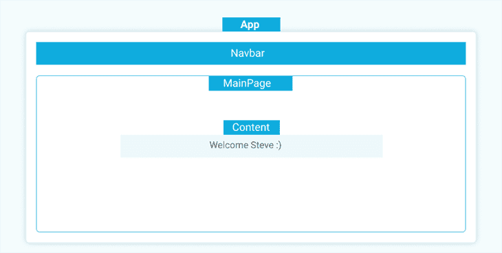
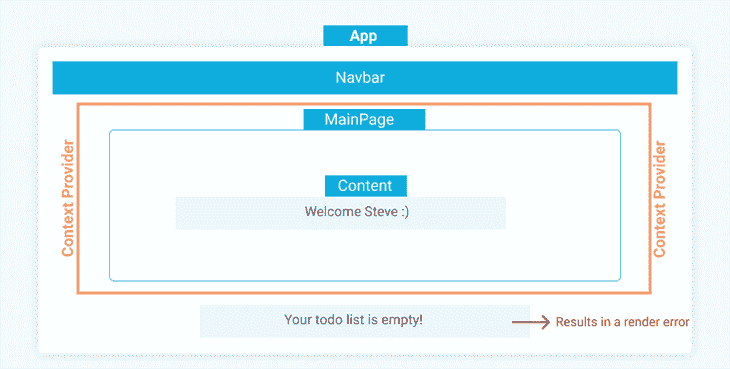

# 一个更好的解决 React apps 中道具钻孔的方法——log rocket 博客

> 原文：<https://blog.logrocket.com/solving-prop-drilling-react-apps/>

在 React 应用程序中处理状态管理可能是一件棘手的事情，尤其是当数据需要从根组件向下传递到深层嵌套的组件时。作为 React 开发人员，我们经常倾向于过度设计我们的应用程序，过分依赖于上下文 API 和 Redux，而实际上并不需要它们。我们太快地接触到这些工具——即使在简单地要求将状态/数据传递给深层嵌套组件的基本情况下——所有这些都是为了克服适当的钻探。

在某些情况下，这完全没问题，但在其他情况下，这给我们的应用程序增加了冗余。每当有状态改变时，消费或使用这些提供者的每个组件都被重新呈现。

很少有开发人员会停下来看看 React 库本身，寻找它的一些问题的解决方案——或者甚至考虑是否有更好的替代方法来沿着组件树向下传递数据——结果，我们看不到过去 React 对构建用户界面的 JavaScript 库的表面定义。

但是 React 本身也是一个状态管理库，它为状态管理提供了自己方便的解决方案，特别是对于像将数据传递给深层嵌套组件这样的事情。本文旨在为您提供一个关于如何做到这一点的清晰指南——并展示更有选择性地依赖上下文 API 或 Redux 的好处。

## 什么是道具钻探，为什么它是一个问题？

不先看问题本身，就不能看问题的解决方案。那么，到底什么是道具钻探，为什么它是一个问题？

Prop drilling 是通过几个嵌套的子组件传递数据的非正式术语，目的是将这些数据传递给更深层次的嵌套组件。这种方法的问题是，大多数传递数据的组件实际上并不需要这些数据。它们只是用作将数据传输到目的组件的媒介。

这就是术语“钻探”的由来，因为这些组件被迫接受不相关的数据并将其传递给下一个组件，下一个组件又依次传递它，如此类推，直到它到达目的地。这可能会导致组件可重用性和应用程序性能的重大问题，我们将在后面解释。

现在，让我们来看一组可能导致正确钻井的环境示例。

## 为支柱钻孔构建一个深度嵌套的应用程序

想象一下，我们正在构建一个应用程序，当用户登录时，它会用名字来欢迎用户。下面是我们将看到的演示应用程序的可视化表示。



为了保持代码最少，我们不会覆盖样式；这只是为了提供一个我们的应用程序会是什么样子的坚实的想法。

现在，让我们看看组件层次结构，以理解组件之间的关系。


正如您现在可能看到的，我们的问题是保存用户名的`user`对象只在根组件级别可用( **App** ，而呈现欢迎消息的组件嵌套在我们的应用程序深处( **Message** )。这意味着我们必须以某种方式将这个`user`对象传递给呈现欢迎消息的组件。

蓝色箭头表示实际的`user`对象道具，因为它从根**应用**组件向下钻，通过几个嵌套的组件，到达需要它的实际**消息**组件。然后，它最终用登录用户的名字呈现欢迎消息。

这是一个典型的支柱钻孔案例。这就是开发人员经常求助于上下文 API 作为绕过这个假设问题的手段的地方，而没有考虑其中产生的潜在问题。

现在我们有了项目的可视化地图，让我们用实际的代码来实践一下。

```
import { useState } from "react";

function App() {
  const [user, setUser] = useState({ name: "Steve" });
  return (
    <div>
      <Navbar />
      <MainPage user={user} />
    </div>
  );
}
export default App;

// Navbar Component
function Navbar() {
  return <nav style={{ background: "#10ADDE", color: "#fff" }}>Demo App</nav>;
}

//MainPage Component
function MainPage({ user }) {
  return (
    <div>
      <h3>Main Page</h3>
      <Content user={user} />
    </div>
  );
}

// Content Component
function Content({ user }) {
  return (
    <div>
      <Message user={user} />
    </div>
  );
}

//Message Component
function Message({ user }) {
  return <p>Welcome {user.name}</p>;
}

```

请注意，我们不是将组件拆分到不同的文件中，然后导入每个单独的组件，而是将它们作为各自单独的功能组件放在同一个文件中。我们现在可以在没有任何外部输入的情况下使用它们。

我们的最终输出将是:


现在我们有了一个基本的工作应用程序，让我们通过再次求解来比较这个解决方案和道具钻井，这次使用上下文 API。

## 使用上下文 API 解决支柱钻孔

对于那些不熟悉[上下文 API](https://reactjs.org/docs/context.html) 的人，我们将从快速概述它的功能开始。

上下文 API 基本上允许您将状态/数据广播给多个组件，方法是用上下文提供者包装它们。然后，它使用其 value 属性将该状态传递给上下文提供者。然后，子组件可以在需要时使用上下文消费者或`useContext`钩子接入这个提供者，并访问由上下文提供者提供的状态。

让我们创建一个上下文并将`user`对象传递给上下文提供者。然后，我们将继续用上下文提供者包装我们想要的组件，并访问它在需要它的特定组件中保存的状态。

```
import "./App.css";
import { createContext, useContext } from "react";

//Creating a context
const userContext = createContext();

function App() {
  return (
    <div>
      <Navbar />
      <userContext.Provider value={{ user: "Steve" }}>
        <MainPage />
      </userContext.Provider>
    </div>
  );
}
export default App;

function Navbar() {
  return <nav style={{ background: "#10ADDE", color: "#fff" }}>Demo App</nav>;
}

function MainPage() {
  return (
    <div>
      <h3>Main Page</h3>
      <Content />
    </div>
  );
}

function Content() {
  return (
    <div>
      <Message />
    </div>
  );
}

function Message() {
// Getting access to the state provided by the context provider wrapper
  const { user } = useContext(userContext);
  return <p>Welcome {user} :)</p>;
}

```

我们从导入一个用于创建上下文的`createContext`钩子和一个提取上下文提供者提供的状态的`useContext`钩子开始。

然后我们调用`createContext`钩子函数，它返回一个带有空值的上下文对象。然后存储在一个名为`userContext`的变量中。

接下来，我们继续用`Context.Provider`包装`MainPage`组件，并将`user`对象传递给它，这将把它提供给嵌套在`MainPage`组件中的每个组件。

最后，我们在嵌套在`MainPage`组件中的`Message`组件中提取这个用户，使用了`useContext`钩子和一点析构。

我们已经完全消除了通过中间组件传递用户属性的需要。结果，我们解决了支柱钻孔的问题。


我们呈现的输出保持不变，但是下面的代码更加精简和清晰。

那么，为什么这是一个问题呢？

## 严重依赖上下文 API 的两个主要缺点是

虽然我们已经通过在应用程序中引入上下文 API 完全解决了 prop drilling 的问题，但是它也有自己的问题，比如组件可重用性和性能的问题。

这些警告虽然在小规模应用中可以忽略不计，但同样会导致不必要的结果。[上下文文档本身](https://reactjs.org/docs/context.html#before-you-use-context)警告这些警告:

> **在使用上下文之前**
> 上下文主要用于当一些数据需要被不同嵌套层次的*多个*组件访问时。请谨慎使用它，因为它使组件重用更加困难。
> **如果只是想避免一些道具通过很多关卡，组件构成往往是比上下文更简单的解决方案。**

### 组件可重用性的问题

当一个上下文提供者被包装在多个组件上时，我们隐式地将存储在该提供者中的任何状态或数据传递给它所包装的子组件。

注意到我含蓄地说了吗？我们不会*真正地*将状态传递给这些组件——直到我们启动一个实际的上下文消费者或`useContext`钩子——但是我们已经隐式地使这些组件依赖于这个上下文提供者提供的状态。

问题源于试图在上下文提供者的边界之外重用这些组件。在呈现之前，该组件首先尝试确认由上下文提供者提供的隐式状态是否仍然存在。当它没有找到这个状态时，它抛出一个渲染错误。

还不清楚？想象一下我们之前的例子。假设我们想要重用`Message`组件来基于不同的条件显示不同的消息，并且这个`Message`组件被放置在上下文提供者包装器的边界之外。

```
import { createContext, useContext } from "react";
//Creating a context
const userContext = createContext();
function App() {
  return (
    <>
      <div>
        <Navbar />
        <userContext.Provider value={{ user: "Steve" }}>
          <MainPage />
        </userContext.Provider>
      </div>
      {/* Trying to use the message component outside the Context Provider*/}
      <Message />
    </>
  );
}
export default App;
function Navbar() {
  return <nav style={{ background: "#10ADDE", color: "#fff" }}>Demo App</nav>;
}
function MainPage() {
  return (
    <div>
      <h3>Main Page</h3>
      <Content />
    </div>
  );
}
function Content() {
  return (
    <div>
      <Message />
    </div>
  );
}
function Message() {
  // Getting access to the state provided by the context provider wrapper
  const { user } = useContext(userContext);
  return <p>Welcome {user} :)</p>;
}

```

我们从上面得到的输出是:


如上所述，任何这样做的尝试都会导致呈现错误，因为`Message`组件现在依赖于上下文提供者状态中的用户对象。对于上下文提供者提供的任何现有的`user`对象，尝试访问它将会失败。下面是上述片段的可视化说明。



有些人会建议通过用上下文包装整个应用程序来绕过这个问题。这对于较小的应用程序来说没问题，但对于较大或更复杂的应用程序来说，这可能不是一个实用的解决方案，因为我们经常希望根据需要管理的内容来确定应用程序中多个上下文提供者的范围。

### 性能问题

上下文 API 使用一种比较算法，将它的当前状态值与它接收到的任何更新进行比较，每当发生更改时，上下文 API 都会将此更改广播给使用其提供者的每个组件，这又会导致这些组件的重新呈现。

乍一看，这似乎是微不足道的，但是当我们严重依赖上下文进行基本状态管理时，我们通过不必要地将所有状态推给上下文提供者而过度设计了我们的应用程序。正如您所预料的，当许多组件依赖于这个上下文提供者时，这不是很有性能，因为每当有状态更新时，它们都会重新呈现，而不管这种变化是否涉及或影响它们。

## 介绍组件组成

让我们回忆一下我们已经在这里看到的 React 的创作者的一些建议:

> 如果你只想避免一些道具通过很多关卡，组件组合往往是比上下文更简单的解决方案。

您可能会从我之前引用的 React 文档中认出这句话——确切地说，它在[上下文 API 部分](https://reactjs.org/docs/context.html#before-you-use-context)中。

较新的 React 开发人员可能想知道“组件组合”是什么意思。组件组合不是一个新添加的特性，我敢说它是 React 和许多 JavaScript 框架背后的基本原则。

当我们构建 React 应用程序时，我们通过构建多个可重用的组件来实现，这些组件几乎可以像独立的乐高积木一样被查看。每个乐高积木(组件)都被认为是我们最终界面的一部分——当组装或组合在一起时，就形成了我们应用程序的完整界面。

这种将组件组装成乐高积木的过程被称为组件组装。

如果您以前构建过 React 应用程序(我肯定您有)，您可能使用过组件组合，但没有认识到它是什么:管理应用程序状态的替代方法。在本文中，我们将主要关注两种类型的组件组合:[容器组件](#container-components)和[专用组件](#specialized-components)。

## 容器组件

和 JavaScript 中的所有东西一样(除了原始数据类型)，React 中的组件只是对象，和典型的对象一样，组件可以包含不同种类的属性，包括其他组件。实现这一壮举有两种方式:

1.  通过显式地将一个或多个组件作为该组件的属性传递给另一个组件，然后可以在该组件中提取和呈现该属性
2.  通过将父组件包装在一个或多个子组件周围，然后使用默认的子属性捕获这些子组件

让我们来看第一种方式:

```
import {useState} from 'react'

function App() {
  const [data, setData] = useState("some state");
  return <ComponentOne ComponentTwo={<ComponentTwo data={data} />} />;
}

function ComponentOne({ ComponentTwo }) {
  return (
    <div>
      <p>This is Component1, it receives component2 as a prop and renders it</p>
      {ComponentTwo}
    </div>
  );
}

function ComponentTwo({ data }) {
  return <h3>This is Component two with the received state {data}</h3>;
}

```

我们可以简单地将这些组件提升到我们的根应用程序，然后手动将预期的子组件传递到父组件，并将预期的数据直接附加到子组件，而不是将组件嵌套在组件中，然后努力通过 prop drilling 将数据传递给它们。然后，父组件会将其渲染为道具。

现在，让我们看看第二种方式:

```
function App() {
  const [data, setData] = useState("some state");

  return (
    <ParentComponent>
      <ComponentOne>
        <ComponentTwo data={data} />
      </ComponentOne>
    </ParentComponent>
  );
}

function ParentComponent({ children }) {
  return <div>{children}</div>;
}
function ComponentOne({ children }) {
  return (
    <>
      <p>This is Component1, it receives component2 as a child and renders it</p>
      {children}
    </>
  );
}

function ComponentTwo({ data }) {
  return <h3>This is Component two with the received {data}</h3>;
}

```

在这一点上，代码应该是不言自明的——每当我们将一个组件包装在另一个组件上时,*包装的*组件就成为了被*包装的*组件的父组件。然后，可以使用负责呈现子组件的默认子属性在父组件中接收子组件。

## 专业组件

专门化组件是有条件地创建的通用组件，通过传入与特定变体的条件相匹配的属性来呈现其自身的专门化变体。

这种形式的组件组合不一定解决正确的钻探，但更关心可重用性和创建更少的组件，当与容器组件混合时，这可以在组合有状态接口中有效地发挥关键作用。

下面是一个专门化组件的例子，以及它如何促进可重用性。

```
function App() {
  return (
    <PopupModal title="Welcome" message="A popup modal">
      <UniqueContent/>
    </PopupModal>
  );
}

function PopupModal({title, message, children}) {
  return (
    <div>
      <h1 className="title">{title}</h1>
      <p className="message">{message}</p>
      {children && children}
    </div>
  );
}

function UniqueContent() {
  return<div>Unique Markup</div>
}

```

## 为什么组件组成很重要

既然您对组件组合有了一点了解，那么搞清楚组件组合有多有用就不是火箭科学了。列举几个原因:

*   它鼓励我们组件的可重用性
*   它很容易解决没有外部库的 prop drilling 的问题
*   通过将我们的大多数组件提升到根级别，并智能地组合各种组合方法，它可以成为状态管理的有效替代方案
*   组合使您的代码更可预测，更易于调试
*   它很容易增强与其他组件共享状态和功能的能力
*   从根本上说，这是构建界面的反应方式

我可以继续讲述组件组合的各种重要方式，但是您应该已经看到了它的模式。我们还将在下一节中逐一介绍它们。

## 使用组件组合重新创建我们的应用程序

让我们重构我们的应用程序，使用组件组合。我们将通过两种方式来展示它的灵活性。

```
import { useState } from "react";

function App() {
  const [user, setState] = useState({ name: "Steve" });
  return (
    <div>
      <Navbar />
      <MainPage content={<Content message={<Message user={user} />} />} />
    </div>
  );
}
export default App;

function Navbar() {
  return <nav style={{ background: "#10ADDE", color: "#fff" }}>Demo App</nav>;
}

function MainPage({ content }) {
  return (
    <div>
      <h3>Main Page</h3>
      {content}
    </div>
  );
}

function Content({ message }) {
  return <div>{message}</div>;
}

function Message({ user }) {
  return <p>Welcome {user.name} :)</p>;
}

```

或者

```
function App() {
  const [user, setState] = useState({ name: "Steve" });
  return (
    <div>
      <Navbar />
      <MainPage>
        <Content>
          <Message user={user} />
        </Content>
      </MainPage>
    </div>
  );
}
export default App;

function Navbar() {
  return <nav style={{ background: "#10ADDE", color: "#fff" }}>Demo App</nav>;
}

function MainPage({ children }) {
  return (
    <div>
      <h3>Main Page</h3>
      {children}
    </div>
  );
}

function Content({ children }) {
  return <div>{children}</div>;
}

function Message({ user }) {
  return <p>Welcome {user.name} :)</p>;
}

```

正如在上面的两个片段中所看到的，有几种方法可以进行组件组合。在第一个代码片段中，我们利用 React 的 props 特性将组件作为一个简单的对象传递给每个父组件，并将数据附加到感兴趣的组件。

在第二个代码片段中，我们利用`children`属性创建了一个布局的纯组合，数据直接传递给感兴趣的组件。我们可以很容易地想出更多的方法来重构这个应用程序，只使用组件组合，但现在你应该清楚地看到只依靠组件组合来解决 prop drilling 的可能性。

## 结论

React 提供了一个强大的组合模型，不仅可以管理组件，还可以管理应用程序中的状态。React 的上下文文档中写道:

> Context 旨在共享可以被视为 React 组件树的“全局”数据，例如当前经过身份验证的用户、主题或首选语言。

通常建议您减少对本地状态管理的上下文或其他库的依赖，特别是如果这是为了避免适当的钻取，并且组件组合很容易成为您的最佳选择。

## 参考

反应文档:

1.  [组成与继承](https://reactjs.org/docs/composition-vs-inheritance.html)
2.  [语境](https://reactjs.org/docs/context.html)

## [LogRocket](https://lp.logrocket.com/blg/react-signup-general) :全面了解您的生产 React 应用

调试 React 应用程序可能很困难，尤其是当用户遇到难以重现的问题时。如果您对监视和跟踪 Redux 状态、自动显示 JavaScript 错误以及跟踪缓慢的网络请求和组件加载时间感兴趣，

[try LogRocket](https://lp.logrocket.com/blg/react-signup-general)

.

[ ](https://lp.logrocket.com/blg/react-signup-general) [](https://lp.logrocket.com/blg/react-signup-general) 

LogRocket 结合了会话回放、产品分析和错误跟踪，使软件团队能够创建理想的 web 和移动产品体验。这对你来说意味着什么？

LogRocket 不是猜测错误发生的原因，也不是要求用户提供截图和日志转储，而是让您回放问题，就像它们发生在您自己的浏览器中一样，以快速了解哪里出错了。

不再有嘈杂的警报。智能错误跟踪允许您对问题进行分类，然后从中学习。获得有影响的用户问题的通知，而不是误报。警报越少，有用的信号越多。

LogRocket Redux 中间件包为您的用户会话增加了一层额外的可见性。LogRocket 记录 Redux 存储中的所有操作和状态。

现代化您调试 React 应用的方式— [开始免费监控](https://lp.logrocket.com/blg/react-signup-general)。