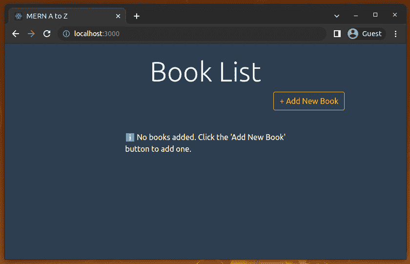
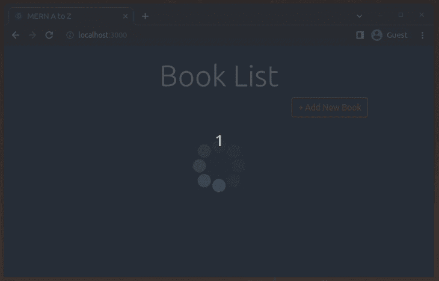
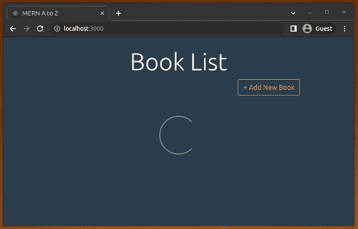
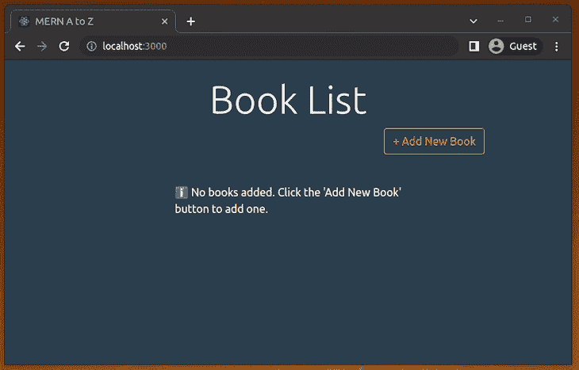
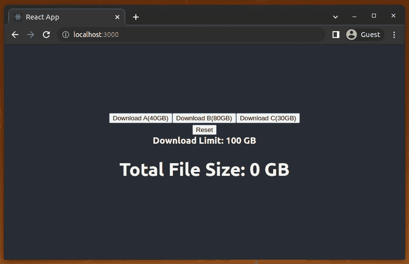
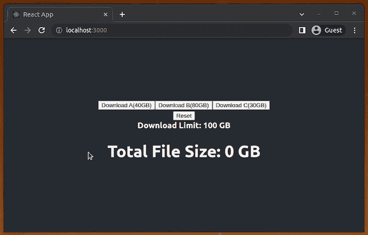
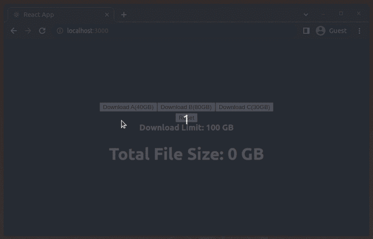
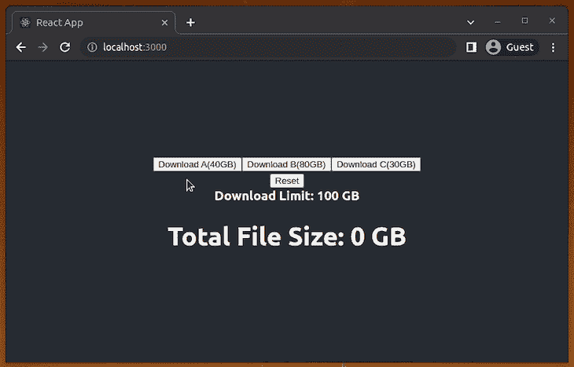

# 向 React app 添加微调器和通知

> 原文：<https://blog.logrocket.com/spinners-notifications-react-app/>

***编者按:**这篇文章最后一次更新是在 2022 年 7 月 21 日更新代码，包括更多关于特色微调器和通知库的最新信息，还包括关于 SVG 和 CSS 选项的信息。*

为了使您的 web 项目更具交互性和用户友好性，您可能希望添加一些额外的 UI 特性，比如显示加载状态的微调器，或者指示应用程序事件的通知。

今天，我们将探讨如何实现这些功能。我们不会简单地展示一些例子，而是将重点放在如何将它们集成到一个全栈项目中。

### 内容

## 在我们开始之前…

那么我们到底要讨论什么呢？

首先，我们将回顾向我们的项目添加一个微调器(例如，指示装载)所需的所有必要步骤。

然后，我们将在项目中只使用一个“通知容器”来管理通知，并学习如何使用它们来显示消息。为此，我们将讨论两个不同的 npm 包，以便对它们进行一些比较。

在这里，我将使用一个现有的 MERN 项目，我们可以添加这些功能，看看结果。我不打算深入讨论这个现有的项目，因为我们在这里的目的只是展示上述功能的实现和集成。

事实上，我们已经为那个项目准备了一个很好的教程，它解释了你需要理解的一切。如果你愿意，可以从[这里](https://blog.logrocket.com/mern-stack-tutorial/)开始读。

## 资源

[这里的](https://github.com/nurislam03/MERN_A_to_Z)是项目服务端的 GitHub 回购，[这里是客户端的回购](https://github.com/codezri/MERN_A_to_Z_Client)。只是克隆或下载它们，无论你喜欢什么。

在运行 API 服务器之前，您需要在本地或云上创建一个 MongoDB 实例来存储 web 应用程序的数据。如果你想在云上创建一个，你可以在 [MongoDB Atlas](https://www.mongodb.com/atlas/database) 上创建一个免费的 MongoDB 集群。将数据库连接字符串添加到`config/default.json`文件中。

使用`README.md`文件中提供的说明或下面提供的说明启动 web 应用程序后端。要开始运行服务器，请确保您在`MERN_A_to_Z/`目录中，并键入以下命令:

```
npm install
npm run app
# --- or ---
yarn install
yarn app

```

以上命令将在端口`8082`上安装依赖项并启动 RESTful API 服务器。我们只需要运行的服务器。之后，我们不需要在那里做任何改变。

要启动客户端应用程序的开发服务器，请确保您位于`MERN_A_to_Z_Client/mern_a_to_z_client/`目录中，并键入以下命令:

```
npm install
npm start
# --- or --- 
yarn install
yarn start

```

我们将严格按照我们的客户项目工作；所有的变化都将发生在那里。

现在项目的服务器端和客户端都已经运行了，请访问 [http://localhost://3000](http://localhost://3000) 查看项目实况。你会看到如下网页应用:

## 添加基于 GIF 的旋转器动画

在这里，我将为我们现有的 MERN 项目添加一个装载旋转器。首先，我们将添加一个传统的基于 GIF 的 spinner 动画，稍后，我们将使用一个流行的包来添加现代的基于 CSS 动画的 spinner。我们将更新我们的`ShowBookList.js`文件，在`ShowBookList`组件中添加一个加载微调器。

因此，在组件文件夹中创建一个名为`common`的文件夹。路径应该是这样的:`MERN_A_to_Z_Client/mern_a_to_z_client/src/components/common`。现在，在`common`文件夹中，创建一个名为`Spinner.js`的文件，并为加载微调器添加一个. gif 文件。

你可以找到不同种类的。gif 文件全网免费；您可以使用基于 web 的工具来生成它们，也可以使用源代码附带的工具。

现在，用下面的代码更新您的`Spinner.js`:

```
import React from 'react';
import spinner from './spinner.gif';

function Spinner() {
  return (
    <div>
      
    </div>
  );
};

export default Spinner;

```

在这里，我们导入。gif 文件(`import spinner from './spinner.gif';`)。如果你使用你自己的，不同的微调文件，用你想添加的文件名替换`spinner.gif`。

现在，用下面的代码更新您的`ShowBookList.js`文件:

```
import React, { useState, useEffect } from 'react';
import '../App.css';
import axios from 'axios';
import { Link } from 'react-router-dom';
import BookCard from './BookCard';
import Spinner from './common/Spinner';

function ShowBookList() {

  let [books, setBooks] = useState([]);
  let [loading, setLoading] = useState(true);

  useEffect(() => {
    axios
      .get('/books')
      .then(res => {
        setBooks(res.data);
        setLoading(false);
      })
      .catch(err =>{
        console.log('Error from ShowBookList');
      })
  }, []);

  let listContent;

  if(loading) {
    listContent = <div className="list-msg"><Spinner/></div>;
  }
  else if(books.length === 0) {
    listContent = <div className="list-msg">ℹ️ No books added. Click the 'Add New Book' button to add one.</div>;
  }
  else {
    listContent = books.map((book, k) =>
      <BookCard book={book} key={k} />
    );
  }

  return (
    <div className="ShowBookList">
      <div className="container">
        <div className="row">
          <div className="col-md-12">
            <br />
            <h2 className="display-4 text-center">Book List</h2>
          </div>

          <div className="col-md-11">
            <Link to="/create-book" className="btn btn-outline-warning float-right">
              + Add New Book
            </Link>
            <br />
            <br />
            <hr />
          </div>

        </div>

        <div className="list">
              { listContent }
        </div>
      </div>
    </div>
  );
}

export default ShowBookList;

```

在这里，我们从`common/Spinner.js`导入我们的`Spinner`组件，并使用`ShowBookList`函数中的一些逻辑为`listContent`赋值。我们还用`let [loading, setLoading] = useState(false)`语句添加了一个初始设置为`false`的加载状态。

你不需要遵循同样的逻辑；你可以用自己的方式写，很明显，根据你的项目类型会有所不同。

现在，运行项目并访问: [http://localhost:3000/](http://localhost:3000/)

在很短的时间内，您将会看到如下所示的装载微调器。这是通过 API 获取数据的延迟时间。这意味着该微调器将一直显示，直到状态变量`loading`变为`false`。

我通过注释掉`setLoading(false);`语句记录了下面的预览，因为加载状态的改变是瞬间的——我们只能在非常慢的网络连接和低端设备上长时间看到微调器。



您可以调整微调器的背景颜色，当然也可以使用定制的微调器。在这里，我的目标只是展示我们何时何地可以使用 GIF spinners，以及我们如何设置它。

## 用反作用旋转器添加现代旋转器

有很多工具可以生成漂亮的 GIF 旋转器动画，它们为添加旋转器到 React 应用程序提供了一个很好的解决方案。但是 gif 现在已经有点过时了，因为有更好的方法，比如 CSS 动画和动画 SVG。此外，GIF 像任何其他图像文件一样具有相当大的下载大小(例如，我们的示例 spinner GIF 的大小是 26.3 KB)。

流行的 [react-spinners](https://github.com/davidhu2000/react-spinners) 包为 react 应用程序提供了许多内置的可定制的基于 CSS 的 spinners。让我们用一个现代的轻量级的 spinner 替换我们以前基于 GIF 的 spinner！

首先，安装 react-spinners 包:

```
npm install react-spinners
# --- or ---
yarn add react-spinners

```

接下来，用下面的代码更新之前创建的`Spinner.js`:

```
import React from 'react';
import ClipLoader from 'react-spinners/ClipLoader';

function Spinner() {
  return (
    <div style={{ width: '100px', margin: 'auto', display: 'block' }}>
      <ClipLoader color="#52bfd9" size={100}/>
    </div>
  );
};

export default Spinner;

```

现在，您将看到基于 CSS-DOM 的微调器动画，如以下预览所示:



你可以用`color`道具根据你的应用主题定制你的微调器。同样，你可以用`size`、`width`和`height`道具对微调器做更多的调整。

在这里，我们使用书店应用程序的`ClipLoader`微调器组件进行演示，但是您可以从内置的[组件列表](https://www.davidhu.io/react-spinners/)中选择不同的加载动画。尝试使用几个定制的微调器！

react-spinners 包呈现普通的 DOM 元素。如果你需要使用基于 SVG 的 spinner 动画，你可以使用 [react-loading](https://github.com/fakiolinho/react-loading) 和 react-loader-spinner 包。

## 使用反应通知配置通知

现在我将展示如何在我们的 [React](https://blog.logrocket.com/10-mistakes-react-developers-make/) 项目中处理通知。首先我们将使用 [react-notifications](https://www.npmjs.com/package/react-notifications) ，顾名思义，它是 react 的通知组件。

### 软件包安装

转到客户端项目目录(`MERN_A_to_Z_Client/mern_a_to_z_client/`)并安装以下 npm 包:

```
npm install react-notifications
# --- or ---
yarn add react-notifications

```

再次运行该项目。

### 设置通知容器

现在更新`App.js`文件。从 react-notifications 和`notifications.css`文件导入`NotificationContainer`:

```
import React from 'react';
import { BrowserRouter, Route, Routes } from 'react-router-dom';

// React Notification
import 'react-notifications/lib/notifications.css';
import { NotificationContainer } from 'react-notifications';

import CreateBook from './components/CreateBook';
import ShowBookList from './components/ShowBookList';
import ShowBookDetails from './components/ShowBookDetails';
import UpdateBookInfo from './components/UpdateBookInfo';

import './App.css';

function App() {
  return (
    <BrowserRouter>
      <Routes>
        <Route exact path='/' element={<ShowBookList/>} />
        <Route path='/create-book' element={<CreateBook/>} />
        <Route path='/edit-book/:id' element={<UpdateBookInfo/>} />
        <Route path='/show-book/:id' element={<ShowBookDetails/>} />
      </Routes>
      <NotificationContainer/>
    </BrowserRouter>
  );
}

export default App;

```

到目前为止，一切顺利——我们已经完成了对`NotificationContainer`的设置。

> 确保在应用程序中只使用一个`NotificationContainer`组件。

现在是时候传递来自不同组件的通知来显示它们的消息了。

## 从组件设置通知

在这里，您只需从 react-notifications 导入`NotificationManager`。之后，您就可以通过`NotificationManager`传递通知了。

看看我在`CreateBook.js`文件中所做的更改，以传递来自`CreateBook`组件的通知。

打开`CreateBook.js`并用以下代码更新它:

```
import React, { useState } from 'react';
import { Link, useNavigate } from 'react-router-dom';
import axios from 'axios';

// React Notification
import { NotificationManager } from 'react-notifications';

import '../App.css';

function CreateBook() {

  let [book, setBook] = useState({
    title: '',
    isbn:'',
    author:'',
    description:'',
    published_date:'',
    publisher:''
  });
  let navigate = useNavigate();

  function onChange(e) {
    setBook({...book, [e.target.name]: e.target.value});
  };

  function onSubmit(e) {
    e.preventDefault();

    axios
      .post('/books', book)
      .then(res => {
        navigate('/');
        NotificationManager.success('You have added a new book!', 'Successful!', 2000);
      })
      .catch(err => {
        NotificationManager.error('Error while creating new book!', 'Error!');
      })
  };

  return (
    <div className="CreateBook">
      <div className="container">
        <div className="row">
          <div className="col-md-8 m-auto">
            <br />
            <Link to="/" className="btn btn-outline-warning float-left">
                Show Book List
            </Link>
          </div>
          <div className="col-md-8 m-auto">
            <h1 className="display-4 text-center">Add Book</h1>
            <p className="lead text-center">
                Create new book
            </p>

            <form noValidate onSubmit={onSubmit}>
              <div className='form-group'>
                <input
                  type='text'
                  placeholder='Title of the Book'
                  name='title'
                  className='form-control'
                  value={book.title}
                  onChange={onChange}
                />
              </div>
              <br />

              <div className='form-group'>
                <input
                  type='text'
                  placeholder='ISBN'
                  name='isbn'
                  className='form-control'
                  value={book.isbn}
                  onChange={onChange}
                />
              </div>

              <div className='form-group'>
                <input
                  type='text'
                  placeholder='Author'
                  name='author'
                  className='form-control'
                  value={book.author}
                  onChange={onChange}
                />
              </div>

              <div className='form-group'>
                <input
                  type='text'
                  placeholder='Describe this book'
                  name='description'
                  className='form-control'
                  value={book.description}
                  onChange={onChange}
                />
              </div>

              <div className='form-group'>
                <input
                  type='date'
                  placeholder='published_date'
                  name='published_date'
                  className='form-control'
                  value={book.published_date}
                  onChange={onChange}
                />
              </div>
              <div className='form-group'>
                <input
                  type='text'
                  placeholder='Publisher of this Book'
                  name='publisher'
                  className='form-control'
                  value={book.publisher}
                  onChange={onChange}
                />
              </div>

              <input
                  type="submit"
                  className="btn btn-outline-warning btn-block mt-4"
              />
            </form>
        </div>
        </div>
      </div>
    </div>
  );
}

export default CreateBook;

```

运行项目并访问[http://localhost:3000/create-book](http://localhost:3000/create-book)。现在，在创建一本新书后，您将看到如下消息。如果系统未能添加新书，您也会收到一条错误消息。



您可以在项目的不同组件中应用相同的方法。根据通知类型，通知将以不同的颜色显示:信息、成功、警告和错误。

您还可以随消息传递五个不同的参数:`message`、`title`、`timeOut`、`callback`和`priority`。

### 可用的`NotificationManager`API

对于这个包，有以下四种不同类型的 API 可供我们使用:

```
info
success
warning
error

```

这里有一个`success`类型的例子。对于给定的场景，只需将`success`替换为适当的通知类型:

```
NotificationManager.success(message, title, timeOut, callback, priority);

```

通知类型后面的参数描述如下:
`message`:我们要传递的消息。它必须是字符串。
`title`:通知的标题。同样，它的类型是 string。
`timeOut`:弹出超时，单位毫秒。这一定是个整数。
`callback`:我们可以通过一个函数(type 功能)通过通知。它在弹出窗口被点击后执行。
`priority`:这是一个布尔参数。通过将优先级设置为 true，我们可以在任何时候将任何通知推到顶部。

## 使用 react-toastify 配置通知

既然我们已经讨论了反应通知，让我们继续讨论[反应通知](https://www.npmjs.com/package/react-toastify)。这两个包的目的相似，但是 react-toastify 比 react-notifications 有更多的内置特性，而且它对定制也更开放。

根据撰写本文时的每周下载记录，React-toastify 比 react-notifications 更受欢迎。

React-toastify 具有许多特性，其中包括:

*   易于集成
*   用户化
*   允许用户通过滑动来关闭显示的通知
*   一个别致的进度条，显示通知的剩余时间

对于这一部分，我想创建一个新项目来展示整个设置。让我们使用 create-react-app 来获得 react 项目的初始设置。

```
npx create-react-app react-notification-example

```

从项目目录(`react-notification-example`)，运行项目:

```
npm start
# --- or ---
yarn start

```

现在，打开`App.js`文件，用下面的代码更新它:

```
import React, { useState } from 'react';
import './App.css';

function App() {
  let [totalSize, setTotalSize] = useState(0);
  let [sizeLimit] = useState(100);

  function addDownloadTask(size) {
    if(totalSize + size <= sizeLimit) {
      setTotalSize(totalSize + size);
    }
  };

  function reset() {
    setTotalSize(0);
  }

  return (
    <div className="App">
        <header className="App-header">
          <div>
            <button onClick={() => addDownloadTask(40)}>
              Download A(40GB)
            </button>

            <button onClick={() => addDownloadTask(80)}>
              Download B(80GB)
            </button>

            <button onClick={() => addDownloadTask(30)}>
              Download C(30GB)
            </button>
          </div>

          <div>
            <button onClick={reset}>
              Reset
            </button>
          </div>

          <b>
            Download Limit: {sizeLimit} GB
          </b>

          <h1>
            Total File Size: {totalSize} GB
          </h1>
        </header>
    </div>
  );
}

export default App;

```

此更新将更改您的 [http://localhost:3000/](http://localhost:3000/) 的视图，您应该会在浏览器上看到以下页面:



在这里，您有三个选项可以通过点击下载三个不同的文件。点击其中任何一项，**总文件大小**将显示更新后的数字(您已下载的总 GB 数)。我们将下载限制设置为 100。当然，你可以更改它们，还有一个**重置**按钮来重置总下载大小。

> 这个应用没有任何服务器功能，那些**下载**按钮不会下载任何文件。它只是一个计算总下载文件大小的计数器。这足以说明 react-toastify 的用途。

### 反应-加热装置

从您的项目文件夹(`react-notification-example`)中，运行您的首选包管理器的命令来安装 react-toastify:

```
npm install react-toastify
# -- or ---
yarn add react-toastify

```

现在，用这两行代码更新`App.js`,导入 react-toastify 所需的内容:

```
import { ToastContainer, toast } from 'react-toastify';
import 'react-toastify/dist/ReactToastify.css';

```

之后，在你的应用程序树的`App`函数*中添加一次*函数`ToastContainer`。如果您不确定将它放在哪里，那么在应用程序中呈现根组件将是最好的选择。

```
<ToastContainer position="top-right"/>

```

位置在这里是可选的，但是默认的位置值是浏览器的右上角。如果需要，您可以用以下任一项替换位置值:

*   `top-left`
*   `top-right`
*   `top-center`
*   `bottom-left`
*   `bottom-right`
*   `bottom-center`

现在你可以设置通知通过`ToastContainer`。我在`addDownloadTask`和`reset`函数中添加了三种不同类型的通知——`success`、`error`和`info`。

我们最终的`App.js`文件应该是这样的:

```
import React, { useState } from 'react';

// React Toastify
import { ToastContainer, toast } from 'react-toastify';
import 'react-toastify/dist/ReactToastify.css';

import './App.css';

function App() {
  let [totalSize, setTotalSize] = useState(0);
  let [sizeLimit] = useState(100);

  function addDownloadTask(size) {
    if(totalSize + size <= sizeLimit) {
      setTotalSize(totalSize + size);
      toast.success(`You have downloaded a ${size} GB file successfully!`);
    }
    else {
      toast.error('Download limit exceeded!');
    }
  }

  function reset() {
    setTotalSize(0);
    toast.info('Download counter was initialized to 0');
  }

  return (
    <div className="App">
        <header className="App-header">
          <div>
            <button onClick={() => addDownloadTask(40)}>
              Download A(40GB)
            </button>

            <button onClick={() => addDownloadTask(80)}>
              Download B(80GB)
            </button>

            <button onClick={() => addDownloadTask(30)}>
              Download C(30GB)
            </button>
          </div>

          <div>
            <button onClick={reset}>
              Reset
            </button>
          </div>

          <b>
            Download Limit: {sizeLimit} GB
          </b>

          <h1>
            Total File Size: {totalSize} GB
          </h1>
        </header>
        <ToastContainer/>
    </div>
  );
}

export default App;

```

每次成功下载后，您都会收到以下`success`通知:



如果您仔细查看通知，您会看到通知中有一个进度条。这表示通知的剩余显示时间。

当您在超过或达到下载限制后尝试执行下载时，您会收到以下`error`通知:



当您按下**复位**按钮时，会显示`info`通知:



您也可以通过简单地点按它来消除任何通知，或者您可以向左或向右滑动它们。

React-toastify 是完全可定制的，还有许多更令人兴奋的功能来满足您的所有需求。你可以在这里查看完整的文档。

像任何其他 npm 包一样，这些通知包也有备选方案。例如，您可以使用以下替代包在 React 中显示这些 toaster 通知:

## 结论

今天我们已经讨论了添加一个微调器和两个不同的包来管理 React 项目中的通知。由于可定制性和有效的大小，考虑在传统 gif 上使用纯基于 CSS 或基于 SVG 的旋转动画。然而，如果不太影响包的大小，使用较小的 GIF 微调器也可以。如今，一些开发人员倾向于使用类似脸书的内容加载器(也称为框架加载器或占位符加载器)而不是 spinners。然而，与现代的骨骼加载器相比，spinners 提供了标准的和最小的动画 UI 元素。

这两个通知包都很受欢迎并且可以定制。React-notifications 比 react-toasty 简单，但我会推荐 react-toasty 而不是 react-notifications，因为前者更受欢迎，并且有更多可定制的选项来支持 react-notifications 的所有相同功能。

## 使用 LogRocket 消除传统反应错误报告的噪音

[LogRocket](https://lp.logrocket.com/blg/react-signup-issue-free)

是一款 React analytics 解决方案，可保护您免受数百个误报错误警报的影响，只针对少数真正重要的项目。LogRocket 告诉您 React 应用程序中实际影响用户的最具影响力的 bug 和 UX 问题。

[ ](https://lp.logrocket.com/blg/react-signup-general) [  ](https://lp.logrocket.com/blg/react-signup-general) [LogRocket](https://lp.logrocket.com/blg/react-signup-issue-free)

自动聚合客户端错误、反应错误边界、还原状态、缓慢的组件加载时间、JS 异常、前端性能指标和用户交互。然后，LogRocket 使用机器学习来通知您影响大多数用户的最具影响力的问题，并提供您修复它所需的上下文。

关注重要的 React bug—[今天就试试 LogRocket】。](https://lp.logrocket.com/blg/react-signup-issue-free)