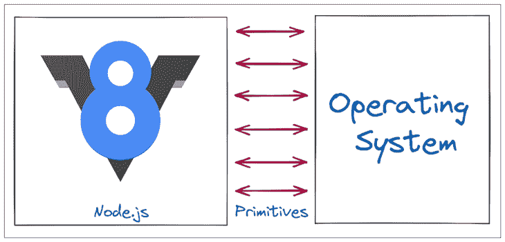
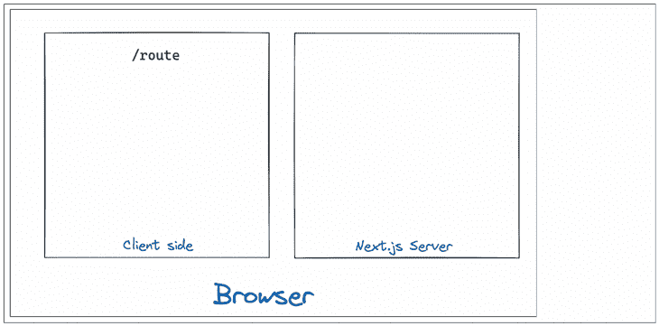
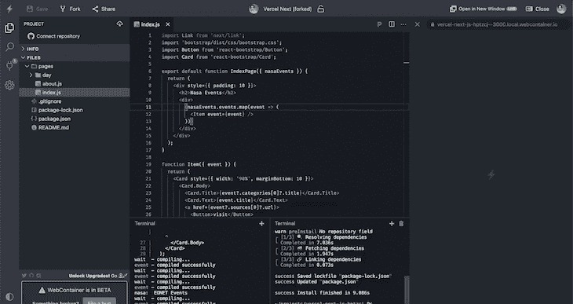

# Stackblitz WebContainers:在 browser - LogRocket 博客中运行 Next.js

> 原文：<https://blog.logrocket.com/stackblitz-webcontainers-nextjs-browser/>

Stackblitz 是一个流行的在线 IDE，用于创建和共享项目，被 Google 和 GitHub 等公司使用。由 VS Code 支持的 Stackblitz 为其用户提供了加速和共享使用 React、Vue 和 Angular 等框架和库的 fullstack 应用程序的能力。因为 Stackblitz 项目立即在线，您只需单击一下就可以共享您的项目！

最近，Stackblitz 推出了 [WebContainers](https://blog.stackblitz.com/posts/introducing-webcontainers/) ，它允许用户在浏览器内部运行整个 Node.js 进程，为安全性、速度和性能提供了好处。
因此，用户也可以在浏览器中运行 Next.js 项目！

在本文中，我们将深入探讨这一功能。我们开始吧！

## node.jsprimitive

在我们理解 Stackblitz 如何工作之前，我们必须了解 Node.js 背后的功能。Node.js 是一个 JavaScript 运行时，它建立在 Chrome [V8 引擎](https://v8.dev/)的基础上，该引擎将开发人员编写的 JavaScript 代码转换成计算机可以理解的东西。

Node.js 使得开发者可以在像操作系统这样的本地环境中运行他们的 JavaScript 代码，而不需要浏览器。I/O 原语是标准库的一部分，它允许 Node.js 执行访问数据库、发出网络请求和从文件系统中读取数据等操作。

Node.js 提供了 I/O 原语的阻塞和非阻塞实现。然而，我们更喜欢在单线程上执行的非阻塞原语。Node.js 依赖于自己独特的基于事件的系统，该系统可以防止并行运行操作时由于多线程而出现的并发问题。



## 浏览器中的 Node.js

您可以在 macOS、Windows 和 Linux 机器上安装 Node.js。尽管目前仍处于测试阶段，但多亏了 [WASM](https://blog.logrocket.com/node-worker-threads-shared-array-buffers-rust-webassembly/) 和[功能 API](https://web.dev/fugu-status/) ，也可以在浏览器中运行 Node.js 了！

在 Stackblitz WebContainers 中，WASM 层成功地抽象出了操作系统层，使得在浏览器选项卡中运行的 Node.js 进程实际上就像在成熟的操作系统中运行一样！


## 设置 Node.js WebContainer

现在，让我们来试试吧！让我们前往 [Stackblitz](https://stackblitz.com/) 并尝试运行一些我们自己的代码。要启动一个新项目，请访问主页并单击 Node.js。几秒钟之内，就会为我们创建一个新项目，它包括左侧我们项目的文件系统，中间是用于进行更改的代码编辑器，底部是终端。

要添加我们的代码，请在终端中运行下面的代码片段:

```
node index.js

```

我们当前使用的 Node.js 版本将通过代码打印到控制台。

让我们写一些与我们的文件系统一起工作的代码。在同一个项目中创建一个名为`tmp.txt`的文件，并添加以下文本:

```
Hello World

```

接下来，我们将添加以下代码片段，该代码片段读取文件并将其截断为五个字符:

```
const { open } = require('fs/promises');
async function readAndTruncate() {
  let filehandle = null;
  try {
    filehandle = await open('tmp.txt', 'r+');
    await filehandle.truncate(5);
  } finally {
    await filehandle?.close();
  }
}
readAndTruncate();

```

在运行这段代码并检查`tmp.txt`时，我们看到我们的初始输入已经被修改为 read `Hello`，这意味着我们用于读写文件的 Node.js 原语已经工作了！

## 浏览器中的 Next.js

现在我们已经成功运行了 Node.js WebContainer，让我们设置一个 Next.js 项目。首先，让我们了解 Next.js 和 Stackblitz 背后的功能。请记住，Next.js 是一个基于 React 的框架，提供静态渲染、服务器端渲染和开箱即用的图像优化。

让我们简单考虑一下访问 React 应用程序和访问 Next.js 应用程序之间的区别。

### 访问 React 应用程序

为了访问 React 应用程序，我们在浏览器中输入应用程序 URL。浏览器将获取 HTML、CSS 和 JavaScript 包。然后在浏览器上编译 JavaScript，同时将 React 代码转换为相应的 HTML 和 CSS，生成页面。然后将页面插入到获取的 HTML 中的一个`div`中，调出 UI。

### 访问 Next.js 应用程序

为了访问 Next.js 应用程序，我们在浏览器中输入 URL。在构建时，有几个页面被标记为静态。如果请求的页面是静态的，则按原样提供。如果页面不是静态的，浏览器会检查它是否是服务器端呈现的页面。如果是，则执行必要的 API 调用，最终生成的 HTML 和 CSS 发送到浏览器直接显示。

如果页面既不是静态的，也不是服务器端呈现的，那么您可以用一种非常类似于 React 应用程序的方式来访问它！但是，最终的 HTML 和 CSS 将直接交付给浏览器，而不是在您解包 JavaScript 包时创建。

直接在浏览器中呈现页面可以缩短页面加载时间，增加与 SEO 爬虫程序的兼容性，从而提升整体性能！使用 Stackblitz web containers，您无需离开浏览器就可以获得这些好处。

## 在 Stackblitz 创建我们的 Next.js 项目



您可能已经注意到，在 Next.js 应用程序的生命周期中，服务器比普通 React 应用程序的生命周期起着更大的作用。

Next.js 服务器基于 Node.js，因此，从历史上看，Next.js 服务器可以在任何支持运行 Node.js 的系统上运行。现在，Node.js 可以完全在带有 WebContainers 的浏览器内部运行，这意味着我们也可以在浏览器中运行 Next.js 应用程序！

要启动一个新的 Next.js 项目，请转到 Stackblitz 主屏幕并单击 Next.js。或者，您可以打开任何浏览器，在地址栏中键入`Next.new`，然后按 enter 键。将为我们建立一个新的 Next.js 项目！

我们也可以基于 [Next.js GitHub](https://github.com/vercel/next.js/tree/canary/examples) 中的例子创建一个新项目！我们只需要在`Next.new`前面追加项目名称。例如，如果我想用 [blog-starter](https://github.com/vercel/next.js/tree/canary/examples/blog-starter) 的例子开始一个新项目，我可以在浏览器中运行下面的代码:

```
next.new/blog-starter

```

## 集成 API

按照上面的步骤生成一个包含两个文件的项目，`index.js`和`about.js`。这些文件迎合了 Next.js starter 模板为您提供的两条路线，`/`和`/about`。让我们将一个 API 集成到我们的项目中，并修改在`/`路线上呈现的 UI。

对于这个演示，我们将使用 [NASA Events API](https://eonet.sci.gsfc.nasa.gov/api/v2.1/events) ，它返回当前地球上发生的所有气候事件的摘要。我们将使用来自 [React Bootstrap](https://react-bootstrap.github.io) 库的组件来设计我们的 UI。通过在终端中运行以下命令来安装库:

```
npm install --save [email protected] bootstrap

```

我们将这些依赖项安装在浏览器内部创建的 Node.js 环境中。接下来，让我们在`index.js file`中导入引导 CSS:

```
import 'bootstrap/dist/css/bootstrap.css';

```

### 服务器端渲染

为了检索我们项目的数据，我们将使用 Next.js 中的`getServerSideProps`函数。我们将在服务器端进行调用，然后使用 React 组件`IndexPage`中的结果。这样做将指示 Next.js 在浏览器对该特定组件发出任何请求时在服务器端进行调用:

```
export async function getServerSideProps(context) {
  const res = await fetch('https://eonet.sci.gsfc.nasa.gov/api/v2.1/events');
  const events = await res.json();
  return {
    props: { nasaEvents: events } // will be passed to the page component as props
  };
}

```

### 用户界面渲染

接下来，我们将返回在一个`props`键中获取的事件，Next.js 将把这些事件作为道具传递给 React 组件。然后，我们将使用引导组件以列表形式显示事件:

```
export default function IndexPage({ nasaEvents }) {
  return (
    <div style={{ padding: 10 }}>
      <h2>Nasa Events</h2>
      <div>
        {nasaEvents.events.map(event => (
          <Item event={event} />
        ))}
      </div>
    </div>
  );
}

```

接下来，我们将需要为每个事件呈现的 UI 抽象到另一个 UI 组件中，我们将其命名为`Item`:

```
Helper component
function Item({ event }) {
  return (
    <Card style={{ width: '90%', marginBottom: 10 }}>
      <Card.Body>
        <Card.Title>{event?.categories[0]?.title}</Card.Title>
        <Card.Text>{event.title}</Card.Text>
        <a href={event?.sources[0]?.url}>
          <Button>visit</Button>
        </a>
      </Card.Body>
    </Card>
  );
}

```

现在，我们的代码完成了！更新后，我们将看到我们能够获得全球正在发生的气候事件列表:



## 结论

在本教程中，我们学习了如何使用 Stackblitz WebContainers 完全在浏览器中运行 Next.js 项目。我们设置了 Node.js 容器，然后通过它访问 Next.js 项目，将 API 与服务器端和 UI 呈现集成在一起。

我们的项目包括一个[项目 URL](https://stackblitz.com/edit/vercel-next-js-hptzcj?file=pages/index.js) ，它有助于协作开发，以及一个[部署 URL](https://vercel-next-js-hptzcj.stackblitz.io) ，它让用户预览最终结果。为了共享这个项目，我可以简单地共享项目的 URL。我希望你喜欢这个教程！

## [LogRocket](https://lp.logrocket.com/blg/nextjs-signup) :全面了解生产 Next.js 应用

调试下一个应用程序可能会很困难，尤其是当用户遇到难以重现的问题时。如果您对监视和跟踪状态、自动显示 JavaScript 错误、跟踪缓慢的网络请求和组件加载时间感兴趣，

[try LogRocket](https://lp.logrocket.com/blg/nextjs-signup)

.

[](https://lp.logrocket.com/blg/nextjs-signup)[](https://lp.logrocket.com/blg/nextjs-signup)

LogRocket 就像是网络和移动应用的 DVR，记录下你的 Next.js 应用上发生的一切。您可以汇总并报告问题发生时应用程序的状态，而不是猜测问题发生的原因。LogRocket 还可以监控应用程序的性能，报告客户端 CPU 负载、客户端内存使用等指标。

LogRocket Redux 中间件包为您的用户会话增加了一层额外的可见性。LogRocket 记录 Redux 存储中的所有操作和状态。

让您调试 Next.js 应用的方式现代化— [开始免费监控](https://lp.logrocket.com/blg/nextjs-signup)。