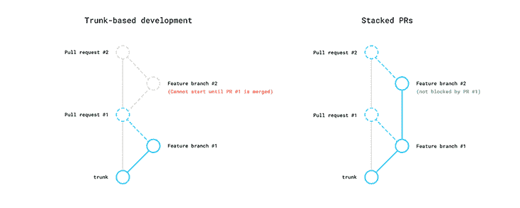
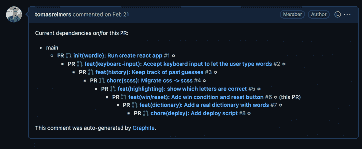

# 通过 stacking ，在代码审查中保持畅通，并更快地构建产品

> 原文：<https://blog.logrocket.com/stay-unblocked-code-review-build-products-faster-with-stacking/>

[Tomas Reimers Follow](https://blog.logrocket.com/author/tomasreimers/) Co-founder of Graphite; previously Facebook NY and Harvard. Passionate about dev velocity. Hobbyist photographer, runner, and writer.

# 在代码审查中保持畅通，通过堆叠更快地构建产品

## 

2022 年 5 月 13 日 3 min 读 888

您刚刚为您的购物应用程序编写完新的结账流程，现在您需要添加促销代码功能。促销代码建立在结账流程之上，但是您意识到您不能建立在结账流程之上，因为您的第一个拉取请求还没有到达——它停留在代码审查中。换句话说，你被封锁了。

你要做什么？您可以:

1.  做点别的事情:这不太好，你现在脑子里有整个代码库供你评论，做别的事情只会让你慢下来
2.  **打扰你的评论者**:也不给力，你只会让*他们*慢下来
3.  **折叠成第一份 PR** :没有什么比接受数千行代码审查更让开发人员喜欢的了

或者，你可以叠加。

准备好了解更多关于堆叠的知识了吗？

*向前跳转:*

## 什么是堆叠？

堆叠是高绩效开发人员保守得最好的秘密。原理很简单:一旦您完成了一个特性的编写，您就将它提交到您的特性分支，将它移动到分支的上方进行审查，并从该特性分支创建一个分支。

Diagram credit: Xiulung Choy

等等，你是说——我们总是从`main`分支。为什么我要从一个特性分支中分支出来？

答案相当简单。一个特性分支的分支允许你从你停止的地方继续你的工作。无需等待该功能的实现，只需分支并运行即可。

在 Graphite，我们最近写了关于如何使用堆栈构建 Wordle 的文章。这里是 T2 的公关大楼，所有的字都在这里。

这里有一叠八个，做着同样的事情:

作为一名评论家，这两本书哪一本更容易阅读？哪一个你可能复习的更快？你认为哪一个会先被合并？请在评论区告诉我们你的想法。

## 如何将堆叠融入团队环境

现在，我肯定你在问，这会让我的队友困惑吗？

好问题！不，这不会让你的队友感到困惑。幸运的是，GitHub 对栈有基本的内置支持。

假设你有一个堆栈:`main → checkout → promo_codes`。要创建这个堆栈，您可以在 GitHub 上创建两个 pull 请求:

*   一个合并分支`promo_codes`为`checkout`
*   一个合并分支`checkout`为`main`

在堆栈中，一个分支合并到它下面的分支，因此，GitHub 将只显示这两个变化之间的差异，使您的审阅者可以一点一点地理解堆栈。

当您将`checkout`合并到`main`中时，您将自动重新定位第二个拉请求，现在合并到`main`中。

我们看到其他人做了两件事来帮助他们的队友了解他们的筹码:

*   *   1.  许多人用堆栈中的位置来命名他们的拉取请求，即“[1/8] PR 标题”、“[2/8]另一个 PR 标题”)
        2.  一些特别有帮助的队友在他们的描述中留下了他们栈的其余部分的链接，以帮助评审者在评审栈时导航栈

如果这最后一点听起来像一个负担，这就是自动化工具可以帮助的地方，我们将在单独的部分中讨论。

## 为什么没有更多人使用堆叠？

虽然 [GitHub 的代码审查工具对堆叠](https://blog.logrocket.com/using-stacked-pull-requests-in-github/)有基本的支持，但它仍然不像使用 [Phabricator](https://www.phacility.com/phabricator/) 或 [Gerrit](https://www.gerritcodereview.com/) 那样容易开箱即用，在那里堆叠是常见的。大多数人不堆栈是因为本地工具不太好——在 GitHub 中，如果你需要在堆栈的底部编辑 pull 请求，重新设置栈顶请求的基础可能需要大量的工作。

幸运的是，大部分工作可以自动化，并且有许多工具可以帮助管理这些工作。在启动 Graphite 之前，我们使用了 [git-town](https://www.git-town.com/) 、 [ghstack](https://github.com/ezyang/ghstack) 、 [branchless](https://github.com/arxanas/git-branchless) 等。

Graphite 是一个专门为 GitHub 设计的工具。它可以同步你的书库，给 GitHub 添加评论来帮助你的评论者定位，你今天就可以开始使用它，即使你在 GitHub 上的同事还没有准备好改变他们的工作流程。

## 如何在现有项目中进行堆叠？

通常的工作流程是将你的代码放入第一个 PR 中。通过堆叠，您可以将您的更改分解成多个 PRs，这允许您:

*   分别着陆每个变化
*   查查它
*   减轻审阅者的工作量，从而使审阅更快、更彻底

此外，一旦你开始分解你的变更，你可以得到越来越多的关于特性发布的粒度。我们的示例结帐流程听起来像是一个复杂的特性——至少，它可以分成多个拉请求，一个用于服务器更改，一个用于客户端更改。

## 结论

不管你用什么，如果你想成为一个更快的开发者，就开始堆叠吧。

## 使用 [LogRocket](https://lp.logrocket.com/blg/signup) 消除传统错误报告的干扰

[LogRocket](https://lp.logrocket.com/blg/signup) 是一个数字体验分析解决方案，它可以保护您免受数百个假阳性错误警报的影响，只针对几个真正重要的项目。LogRocket 会告诉您应用程序中实际影响用户的最具影响力的 bug 和 UX 问题。

然后，使用具有深层技术遥测的会话重放来确切地查看用户看到了什么以及是什么导致了问题，就像你在他们身后看一样。

LogRocket 自动聚合客户端错误、JS 异常、前端性能指标和用户交互。然后 LogRocket 使用机器学习来告诉你哪些问题正在影响大多数用户，并提供你需要修复它的上下文。

关注重要的 bug—[今天就试试 LogRocket】。](https://lp.logrocket.com/blg/signup-issue-free)