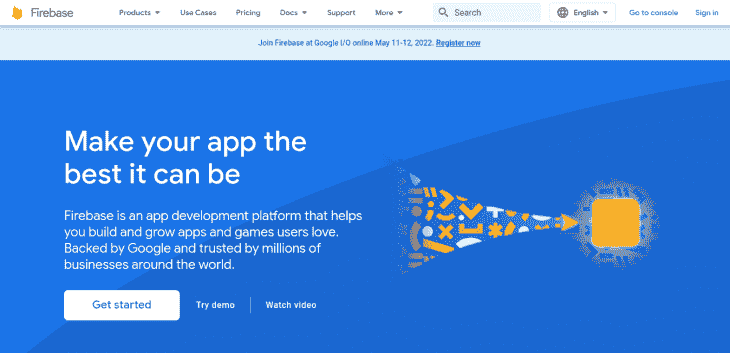
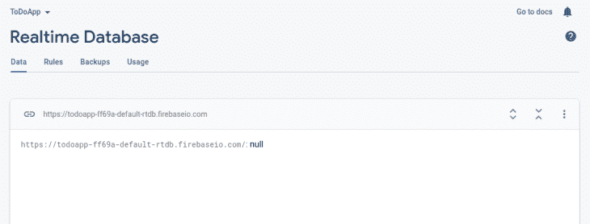
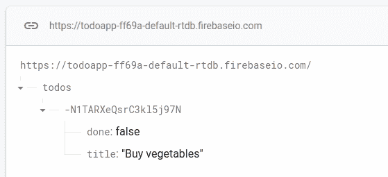
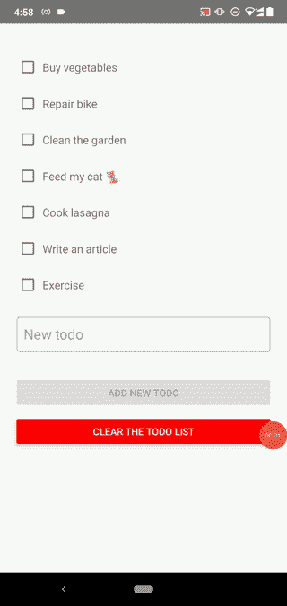

# 使用 Firebase - LogRocket 博客获取 React 本机应用程序的数据

> 原文：<https://blog.logrocket.com/storing-retrieving-data-react-native-apps-firebase/>

***编者按:*** *本教程于 2022 年 6 月 2 日更新，包含了最新版本的* *Firebase **，以及*** *模块化 SDK APIs。*

如今，存储和检索用户生成的数据在移动和 web 应用程序中非常常见，因此，有不同的云服务为移动和 web 开发人员提供了存储数据的能力。

这些服务中有谷歌的 Firebase。Firebase 是一个 BaaS(后端即服务)，这意味着它允许 web 和移动开发人员执行常见的后端任务，如用户身份验证和创建数据库，而无需维护或保养。

另一方面， [React Native](https://reactnative.dev/) 是一个 UI 框架，允许开发人员使用他们对 React(一个流行的前端框架)的知识来构建跨 Android 和 iOS 设备工作的原生应用。React Native 提高了工作效率，因为开发人员不必为特定应用程序的 iOS 和 Android 版本管理两个不同的代码库。

在本文中，您将学习如何使用 Firebase 存储、检索和更新用户生成的数据。在本文结束时，我们将构建一个“待办事项”Android 应用程序，它使用 Firebase 提供的数据库服务保存和检索数据库中的不同任务。

要阅读本文，您应该对 React 和 React Native 有一个实用的理解。

## 内容

## 设置本地反应

首先，让我们创建一个新的 React 本地项目。你可以访问官方的 [React 原生文档](https://facebook.github.io/react-native/docs/getting-started)来获得关于设置基础的指南。

完成后，您现在可以创建一个新的 React 本地项目:

```
npx react-native init ToDoApp

```

我们还需要安装我们将在项目中使用的依赖项。这些依赖关系是:

在您的终端中运行以下命令来安装这些依赖项:

```
npm install firebase
npm install @react-native-community/checkbox
# --- or ---
yarn add firebase
yarn add @react-native-community/checkbox

```

现在设置已经完成，我们可以开始构建我们的应用程序了！

## 设置 Firebase

在我们开始写代码之前，我们需要为 Firebase 做一些设置，以便它能与我们的应用程序完美配合。

首先，在项目的根目录下创建一个名为`firebase-config.js`的文件来实现 Firebase 配置和初始化。

现在，请访问 Firebase 网站。



点击 **Get Started** 按钮，您将被带到一个页面，在这里您可以创建一个新项目。创建完新项目后，您应该会看到一个类似下图的仪表板页面。


从侧面菜单中选择**构建**选项。完成之后，您现在应该能够从 Firebase 提供的两个数据库选项中进行选择:**实时数据库**和**Firestore***数据库，这两个数据库具有相似的功能。*

 *如果您不确定使用哪种数据库服务，您可以查看 Firebase 关于选择数据库的指南。在本文中，我们将利用实时数据库。

一旦您选择了**实时数据库**选项并创建了一个新的数据库，就会弹出一个为您的数据库设置安全规则的模式。在测试模式下选择**开始**。现在你应该在一个页面上显示你的数据库中的数据(现在是空的)。



既然数据库已经创建好并可以使用了，我们需要从我们的 Firebase 项目中获得一些连接信息(Firebase 配置)。这些信息或数据将有助于将我们的代码与我们的 Firebase 项目联系起来。

要获取我们的 Firebase 配置详细信息，请返回到项目概述页面，并向 Firebase 项目添加一个 web 应用程序。注册应用程序后，您应该可以获得 JavaScript 对象形式的配置详细信息:

```
const firebaseConfig = {
  apiKey: 'XXXXXXXXXXXXXXXXXXXXXXX',
  authDomain: 'todoapp-XXXX.firebaseapp.com',
  databaseURL: 'https://todoapp-XXXXXX.firebaseio.com',
  projectId: 'todoapp-XXXX',
  storageBucket: 'todoapp-XXXX.appspot.com',
  messagingSenderId: 'XXXXXXX',
  appId: "XXXXXXXXXXXXXXXXXXXXXXXXXXXXXXXXXXXX"
};

```

现在打开您的`firebase-config.js`文件，导入 Firebase 应用程序模块和数据库模块。导入 Firebase 模块后，您需要复制并粘贴文件中的 Firebase 配置详细信息。确保使用仪表板中的原始 Firebase secret 标识符，而不是以下`XXX`占位符:

```
import { initializeApp } from 'firebase/app';
import { getDatabase } from 'firebase/database';

const firebaseConfig = {
    apiKey: 'XXXXXXXXXXXXXXXXXXXXXXX',
    authDomain: 'todoapp-XXXX.firebaseapp.com',
    databaseURL: 'https://todoapp-XXXXXX.firebaseio.com',
    projectId: 'todoapp-XXXX',
    storageBucket: 'todoapp-XXXX.appspot.com',
    messagingSenderId: 'XXXXXXX',
    appId: 'XXXXXXXXXXXXXXXXXXXXXXXXXXXXXXXXXXXX'
};

```

现在我们只需要使用从 Firebase 获得的配置细节初始化一个 Firebase 应用程序。完成后，我们将获得 Firebase 为我们的应用程序提供的数据库服务的引用，并将其导出:

```
const app = initializeApp(firebaseConfig);
const db = getDatabase(app);

export { db };

```

我们现在可以使用`db`引用读写我们的实时数据库了！

## 创建我们的 React 组件

让我们开始写代码吧！请注意，为了简单起见，我将在我的`App.js`文件中编写我的所有代码，但是请确保正确构建您的生产应用程序。

首先，我们需要一个组件来显示待办事项列表中的任务，并管理该任务的状态。该组件将负责指示某项任务是否已经完成。我们将这个组件称为`ToDoItem`:

```
import React from 'react';
import {
  StyleSheet,
  View,
  Text,
  Button,
  ScrollView,
  TextInput
} from 'react-native';
import CheckBox from '@react-native-community/checkbox';

const ToDoItem = () => {
  return (
    <View>
      <CheckBox/>
      <Text>
        A random To-Do item
      </Text>
    </View>
  );
};

```

如您所见，我们从@ react-native-community/checkbox 导入了`CheckBox`组件。此复选框将用于指示特定的待办任务是否已完成。

现在让我们来设计我们的组件！React Native 附带了一个样式表，我们可以用它来定义不同元素的样式:

```
const styles = StyleSheet.create({
  todoItem: {
    flexDirection: 'row',
    marginVertical: 10,
    alignItems: 'center',
  },
  todoText: {
    paddingHorizontal: 5,
    fontSize: 16
  },
});

```

我们现在可以在每个元素的样式属性中应用这些样式，如下所示:

```
<View style = {styles.todoItem}></View>

```

一旦复选框被选中，我们希望我们的`ToDoItem`组件有不同的样式。为此，我们将创建一个名为`doneState`的状态来管理待办任务的状态——无论任务是否已经完成——使用 React 的`useState`钩子。

首先，像这样导入`useState`钩子和 React:

```
import React, { useState } from 'react';

```

现在，随着`useState`钩子的导入，我们可以像这样创建我们的状态:

```
const [doneState, setDone] = useState(false);

```

基本上，我们创建了一个名为`doneState`的状态，它的初始值为`false`。如果在将来的某个时候，我们想要更新`doneState`的值并将其设置为`true`，我们总是可以使用`setDone`:

```
setDone(true);

```

`CheckBox`带有一个名为`value`的属性，它使我们能够控制何时应该选中复选框。在这种情况下，我们希望在任务完成后检查我们的复选框(当`doneState`的值为`true`)。

因为我们的复选框组件的`value`属性依赖于`doneState`的值，所以每当单击复选框时，我们希望将`doneState`的值更改为当前值的相反值。

这可以通过`CheckBox`组件附带的`onValueChange`支柱来完成。我们将为复选框的`onValueChange`事件创建一个名为`onCheck`的事件处理程序:

```
const onCheck = (isChecked) => {
  setDone(isChecked);
};

```

现在，正如我之前指出的，一旦我们的`ToDoItem`组件被检查过，我们希望对它进行不同的样式化。一旦检查完毕，`ToDoItem`的不透明度将会降低。让我们实现这一点:

```
return (
    <View style={styles.todoItem}>
      <CheckBox
        onValueChange={onCheck}
        value={doneState}
      />
      <Text style={[styles.todoText, {opacity: doneState ? 0.2 : 1}]}>
        A random To-Do item
      </Text>
    </View>
  );
};

```

现在我们已经准备好了`ToDoItem`组件的基本部分，让我们创建我们的`App`组件，它将作为我们应用程序的主屏幕。

我们的`App`组件需要两种状态:`todos`，它包含所有待办事项，以及`presentTodo`，它将是当前添加的待办事项。我们还需要添加一个`View`组件来包含待办事项列表；一个`TextInput`组件，用户将在其中输入一个新的待办事项；添加待办事项的按钮；另一个按钮用来清空我们的数据库，从而摆脱所有的待办事项。

经过一些设计，我们的`App`组件应该是这样的:

```
const App = () => {
  const [todos, setTodos] = useState({});
  const [presentTodo, setPresentTodo] = useState('');

  function addNewTodo() {
    setPresentTodo('');
  }

  function clearTodos() {

  }

  return (
    <ScrollView
      style={styles.container}
      contentContainerStyle={styles.contentContainerStyle}>
      <View>
        {/* Empty view: will contain to-do items soon */}
      </View>

      <TextInput
        placeholder="New todo"
        value={presentTodo}
        style={styles.textInput}
        onChangeText={text => {
          setPresentTodo(text);
        }}
        onSubmitEditing={addNewTodo}
      />

      <View>
        <View style={{marginTop: 20}}>
          <Button
            title="Add new todo"
            onPress={addNewTodo}
            color="green"
            disabled={presentTodo == ''}
            />
        </View>

        <View style={{marginTop: 20}}>
          <Button
            title="Clear the todo list"
            onPress={clearTodos}
            color="red"
            style={{marginTop: 20}}
          />
        </View>
      </View>
    </ScrollView>
  );
}

const styles = StyleSheet.create({
  container: {
    flex: 1,
    paddingTop: 12
  },
  contentContainerStyle: {
    padding: 24
  },
  textInput: {
    borderWidth: 1,
    borderColor: '#afafaf',
    borderRadius: 5,
    paddingHorizontal: 10,
    marginVertical: 20,
    fontSize: 20,
  },
  todoItem: {
    flexDirection: 'row',
    marginVertical: 10,
    alignItems: 'center'
  },
  todoText: {
    paddingHorizontal: 5,
    fontSize: 16
  },
});

```

## 构建 React Native 和 Firebase 实时数据库

现在，我们准备开始使用一些 Firebase 代码来将我们的任务项持久化到 Firebase 的实时数据库中。

* * *

### 更多来自 LogRocket 的精彩文章:

* * *

首先，我们需要从`firebase-config.js`文件导入数据库:

```
import { db } from './firebase-config.js';

```

在我们继续之前，我们需要了解 Firebase 提供的实时数据库中的数据是如何组织的。数据实际上是以 JSON 树的形式构造的。

根据[文档](https://firebase.google.com/docs/database/web/structure-data#how_data_is_structured_its_a_json_tree):

> 所有 Firebase 实时数据库数据都存储为 JSON 对象。您可以将数据库视为云托管的 JSON 树。与 SQL 数据库不同，它没有表或记录。当您将数据添加到 JSON 树中时，它将成为现有 JSON 结构中的一个节点，并带有一个关联的键。

这使得使用实时数据库变得容易和熟悉。

当我们的`App`组件挂载时，我们要做的第一件事是获取所有当前的待办事项，并将它们添加到我们的`todos`状态对象中。为此，我们需要获取对数据库中特定位置的引用。到这个地方的路径将被称为`todos`。一旦我们这样做了，我们需要监听该路径或位置的内容的变化。这非常类似于在普通 JavaScript 中监听事件。在这种情况下，我们将监听一个名为`value`的事件。

同样，根据 Firebase 文档:

> “[此事件允许我们]读取给定路径中内容的静态快照，因为它们在事件发生时就存在。此方法在附加侦听器时触发一次，并且在每次数据(包括子数据)发生更改时再次触发。

向事件回调函数传递一个快照，该快照包含该位置的所有数据，包括子数据。我们现在可以使用`val()`方法从快照中获取数据。这些数据通常采用 JavaScript 对象的形式:

```
useEffect(() => {
  return onValue(ref(db, '/todos'), querySnapShot => {
    let data = querySnapShot.val() || {};
    let todoItems = {...data};
    setTodos(todoItems);
  });
}, []);

```

如果我们正在读取的路径中没有数据，我们使用 OR ( `||`)操作符将一个空对象分配给数据变量。注意，当 React 组件退出时，我们返回`onValue`函数的返回值来取消订阅 Firebase 事件处理程序——`useEffect`钩子的返回值有助于这样的清理。这里，我们使用带有空依赖数组的`useEffect`钩子，在第一次呈现`App`组件时只注册一次事件处理程序。

确保从 Firebase 数据库模块导入`onValue`功能。您可以导入任何支持的 Firebase 模块化 API 函数，如下所示:

```
import {
  ref,
  onValue,
  push,
  update,
  remove
} from 'firebase/database';

```

我们还需要给我们的`addNewTodo()`函数添加一些代码。我们希望每个待办事项都有一个名称或标题，以及一个值来指示相关的待办任务是否已经完成。

因此，我们将使用一个对象来表示数据库中的每个待办事项。要将数据添加到特定位置，我们需要引用我们要添加数据的位置的路径，并使用`push()`函数:

```
function addNewTodo() {
  push(ref(db, '/todos'), {
    done: false,
    title: presentTodo,
  });
  setPresentTodo('');
}

```

为了清除我们的`todos`路径中的数据，我们只需要获得对那个位置的引用并使用`remove()`函数:

```
function clearTodos() {
  remove(ref(db, '/todos'));
}

```

现在，尝试使用`TextInput`组件添加一个待办事项。您应该注意到数据库仪表板或控制台中的数据库发生了变化:



如果我们将待办事项列表记录到控制台，我们应该会看到这样的内容:

```
{
  "-N1TARXeQsrC3kl5j97N":{
    "done":false,
    "title":"Buy vegetables"
  }
}

```

如果您观察这个结果，您会注意到待办事项列表是一个对象，它的键名等于 Firebase 分配给所有待办事项的惟一 ID。每个待办事项的值都是一个对象，其格式类似于我们在`addNewTodo()`函数中指定的格式。

有了这些信息，我们现在可以从我们的`todos`状态对象中提取键，并将必要的道具传递给每个`ToDoItem`组件。

让我们提取这些键，并将它们分配给一个名为`todosKeys`的变量:

```
render() {
    const todosKeys = Object.keys(todos);
    return (
      <ScrollView ...>
        ...
      </ScrollView>
    );
}

```

让我们将它添加到`App`组件中的空`View`组件:

```
<View>
  {todosKeys.length > 0 ? (
    todosKeys.map(key => (
      <ToDoItem
        key={key}
        id={key}
        todoItem={todos[key]}
      />
    ))
  ) : (
    <Text>No todo item</Text>
  )}
</View>

```

现在，我们需要对我们的`ToDoItem`组件进行一些修改。因为我们的待办事项组件现在可以访问它们适当的名称和状态，所以我们可以去掉占位符值。我们的`ToDoItem`组件现在应该是这样的:

```
const ToDoItem = ({todoItem: {title, done}, id}) => {
  const [doneState, setDone] = useState(done);

  const onCheck = (isChecked) => {
    setDone(isChecked);
  };

  return (
    <View style={styles.todoItem}>
      <CheckBox
        onValueChange={onCheck}
        value={doneState}
      />
      <Text style={[styles.todoText, {opacity: doneState ? 0.2 : 1}]}>
        {title}
      </Text>
    </View>
  );
};

```

现在，我们简单的待办事项应用程序大部分已经完成。然而，仍然有一个小问题:如果你将一个待办事项选中为完成，然后重新加载该应用程序，该待办事项将恢复到原来的未选中状态。拥有一个我们无法更新的数据库的目的是什么？

因此，每当复选框被选中时，我们都需要更新数据库中`done`的值。我们可以用`update()`函数来实现。要更新特定的字段，只需传入一个包含已更新字段的对象:

```
const onCheck = (isChecked) => {
  setDone(isChecked);
  update(ref(db, '/todos'), {
    [id]: {
      title,
      done: !doneState,
    },
  });
};

```

现在，每当您将一个特定的待办事项检查为完成时，待办事项的值`done`就会在数据库中更新。这是完整的`App.js`源文件——与您创建的文件进行比较，或者复制粘贴它以使应用程序工作:

```
import React, { useState, useEffect } from 'react';
import {
  StyleSheet,
  View,
  Text,
  Button,
  ScrollView,
  TextInput
} from 'react-native';
import CheckBox from '@react-native-community/checkbox';
import {
  ref,
  onValue,
  push,
  update,
  remove
} from 'firebase/database';
import { db } from './firebase-config.js';

const App = () => {
  const [todos, setTodos] = useState({});
  const [presentTodo, setPresentTodo] = useState('');
  const todosKeys = Object.keys(todos);

  useEffect(() => {
    return onValue(ref(db, '/todos'), querySnapShot => {
      let data = querySnapShot.val() || {};
      let todoItems = {...data};
      setTodos(todoItems);
    });
  }, []);

  function addNewTodo() {
    push(ref(db, '/todos'), {
      done: false,
      title: presentTodo,
    });
    setPresentTodo('');
  }

  function clearTodos() {
    remove(ref(db, '/todos'));
  }

  return (
    <ScrollView
      style={styles.container}
      contentContainerStyle={styles.contentContainerStyle}>
      <View>
        {todosKeys.length > 0 ? (
          todosKeys.map(key => (
            <ToDoItem
              key={key}
              id={key}
              todoItem={todos[key]}
            />
          ))
        ) : (
          <Text>No todo item</Text>
        )}
      </View>

      <TextInput
        placeholder="New todo"
        value={presentTodo}
        style={styles.textInput}
        onChangeText={text => {
          setPresentTodo(text);
        }}
        onSubmitEditing={addNewTodo}
      />

      <View>
        <View style={{marginTop: 20}}>
          <Button
            title="Add new todo"
            onPress={addNewTodo}
            color="green"
            disabled={presentTodo == ''}
            />
        </View>

        <View style={{marginTop: 20}}>
          <Button
            title="Clear the todo list"
            onPress={clearTodos}
            color="red"
            style={{marginTop: 20}}
          />
        </View>
      </View>
    </ScrollView>
  );
}

const ToDoItem = ({todoItem: {title, done}, id}) => {
  const [doneState, setDone] = useState(done);

  const onCheck = (isChecked) => {
    setDone(isChecked);
    update(ref(db, '/todos'), {
      [id]: {
        title,
        done: !doneState,
      },
    });
  };
  return (
    <View style={styles.todoItem}>
      <CheckBox
        onValueChange={onCheck}
        value={doneState}
      />
      <Text style={[styles.todoText, {opacity: doneState ? 0.2 : 1}]}>
        {title}
      </Text>
    </View>
  );
};

const styles = StyleSheet.create({
  container: {
    flex: 1,
    paddingTop: 12
  },
  contentContainerStyle: {
    padding: 24
  },
  textInput: {
    borderWidth: 1,
    borderColor: '#afafaf',
    borderRadius: 5,
    paddingHorizontal: 10,
    marginVertical: 20,
    fontSize: 20,
  },
  todoItem: {
    flexDirection: 'row',
    marginVertical: 10,
    alignItems: 'center'
  },
  todoText: {
    paddingHorizontal: 5,
    fontSize: 16
  },
});

export default App;

```

一旦运行 React Native 项目，您将看到如下应用程序。

Android 黑暗 UI 模式:


Android light UI 模式:



这款应用的完整源代码[可在 GitHub](https://github.com/codezri/react-native-todo-firebase) 上获得。

## 结论

就是这样！我们已经用 Firebase 驱动的后端创建了我们的待办事项 Android 应用程序！通常，你会给这个应用添加一些认证，这样用户就可以在世界上任何支持的设备上登录，并且仍然可以访问他们的数据。这也可以通过 Firebase 来实现。你可以在这里查看我的教程。

此外，尝试在应用程序中添加新功能，例如编辑现有的待办事项，排序待办事项，调整待办事项，删除选定的待办事项或一次性删除已完成的待办事项。您可以从[这里](https://firebase.google.com/docs/reference/js/database.md#database_package)浏览所有支持的 Firebase 实时数据库 API 函数的详细信息。

## [LogRocket](https://lp.logrocket.com/blg/react-native-signup) :即时重现 React 原生应用中的问题。

[](https://lp.logrocket.com/blg/react-native-signup)

[LogRocket](https://lp.logrocket.com/blg/react-native-signup) 是一款 React 原生监控解决方案，可帮助您即时重现问题、确定 bug 的优先级并了解 React 原生应用的性能。

LogRocket 还可以向你展示用户是如何与你的应用程序互动的，从而帮助你提高转化率和产品使用率。LogRocket 的产品分析功能揭示了用户不完成特定流程或不采用新功能的原因。

开始主动监控您的 React 原生应用— [免费试用 LogRocket】。](https://lp.logrocket.com/blg/react-native-signup)*