# Strapi API 创建:快速指南- LogRocket 博客

> 原文：<https://blog.logrocket.com/strapi-api-creation-quick-guide/>

*编者按:这篇文章于 2021 年 10 月更新，以提高清晰度并删除过时的信息。*

内容管理系统(CMSs)已经存在很长时间了。Strapi 是 Node.js 的一个 headless CMS，它提供了一个 GUI 来创建不同的内容类型，并将用户管理集成到平台中。它支持 RESTful APIs 和 GraphQL。

此外，Strapi 支持 NoSQL 和 SQL 数据库。更改数据库就像更改环境变量一样简单。

在本指南中，我们将介绍使用 Strapi 创建 API 的以下步骤:

## 设置工作环境

Strapi 要求在您的系统上安装 Node.js。它提供了一个样板文件生成器`create-strapi-app`，用于设置应用程序。可以使用 npm 通过以下命令进行全局安装。

```
$ npm i -g create-strapi-app

```

使用`create-strapi-app`很简单；只需传递项目的名称。`--quickstart`将用默认设置创建一个项目。

```
create-strapi-app my-blog --quickstart

```

在使用 Strapi 之前，您必须创建一个管理员用户。命令`npm run develop`在`[http://localhost:1337](http://localhost:1337)`上启动服务器。管理员用户是使用`[http://localhost:1337/admin/auth/register](http://localhost:1337/admin/auth/register)`创建的。

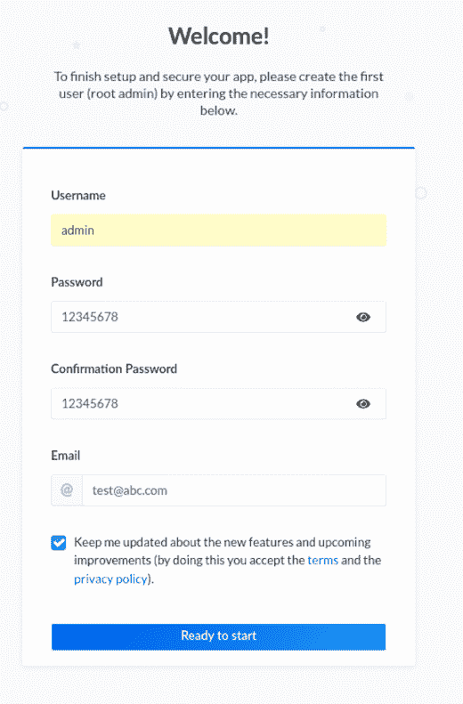

一旦样板文件准备就绪，就可以使用 admin UI 来构建 API 的数据库模式。

## 创建您的 Strapi 数据库模式

Strapi 为创建数据库模式提供了一个简单的 UI。如果我们想改变我们的配置，我们必须编辑出我们的项目文件。例如，为了改变`env`变量，我们必须编辑`config/environments`文件夹。

Strapi 包括一个内容构建器插件，它为创建数据库模式提供了一个很好的 UI。该插件独立于数据库，相同的模式可以在 SQL 和 NoSQL 数据库中使用。

我们的演示网站将有一个博客收集类型和评论收集类型。博客将存储大部分内容，评论集合将存储用户信息和博客上的评论。

### 创建收藏

从在`[http://localhost:1337/admin](http://localhost:1337/admin)`登录管理员开始。打开侧边栏上的**内容类型构建器**页面。

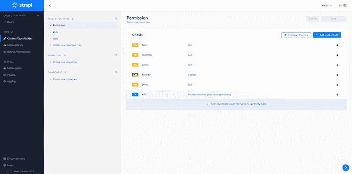

现在创建一个名为“Blog”的新集合来存储站点的博客。它将包含标题、图像和内容。

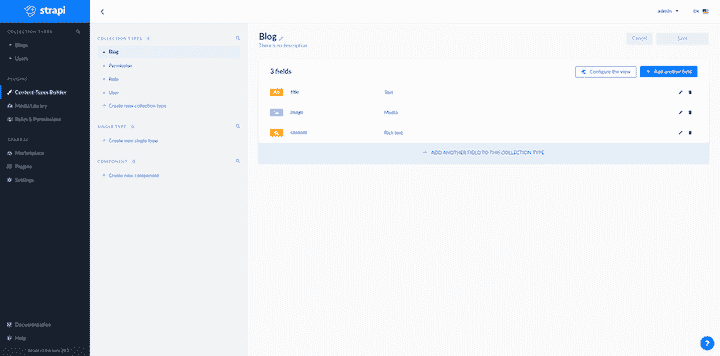

接下来，创建一个名为“Comment”的集合。这将存储博客的评论，并包括内容、用户和博客文章的字段。`blog`字段存储相应博客文章的链接和创建给定评论的用户的详细信息。

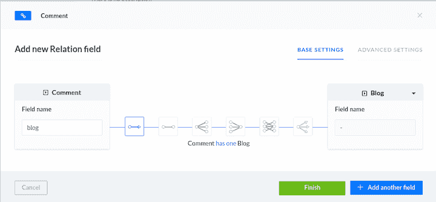


我们已经为评论创建了链接:一个链接到用户集合，另一个链接到博客集合。博客和用户集合没有关于链接的信息。现在我们的后端都设置好了。

### 文档插件

我们将从 Marketplace 部分安装文档插件，以便于访问 API 细节。这个插件将为 API 创建 swagger 规范。


## 设置 Strapi 基于 JWT 的身份验证

身份验证是任何应用程序的重要元素。Strapi 有现成的基于 JWT 的身份验证。

默认密钥用于签署 JWT。可以在配置文件`/extensions/users-permissions/config/jwt.json`中更改签名密钥。用户注册和登录的 API 已经嵌入到平台中。

```
{
  "jwtSecret": "f1b4e23e-480b-4e58-923e-b759a593c2e0"
}

```

我们将使用`local`提供者进行认证。该密码和电子邮件/用户名用于验证用户。如果我们点击侧边栏上的“Documentation ”,它会提供一个选项来查看 swagger API 文档。

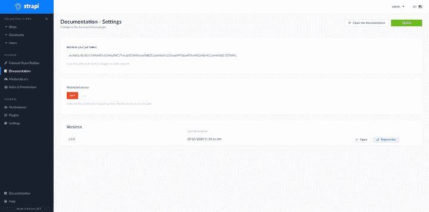

点击**打开文档**查看 swagger API 文档。导航至**用户权限–用户**访问 API 以创建用户和登录用户。


我们将使用`/auth/local`和`/auth/local/register`。

### 身份验证角色和权限

默认情况下，Strapi 有两个角色用于控制对内容的访问:public 和 authenticated。public 角色是针对未经身份验证的用户的，而 authenticated 角色是针对—您猜对了—经过身份验证的用户的。

这些角色会根据用户的身份验证状态自动分配给用户。“公共”用户可以阅读博客和评论，“认证”用户可以在博客上发表评论和编辑评论。可以在**角色和权限**部分编辑角色。

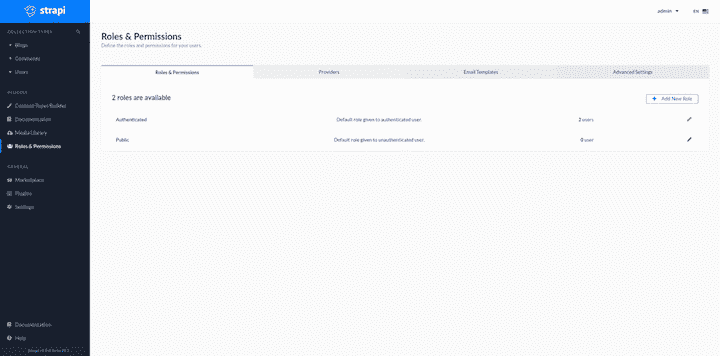

在此屏幕上，您可以编辑公共角色以允许访问博客和评论。

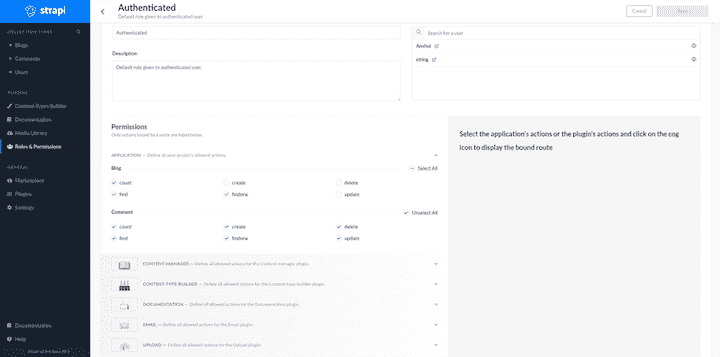

现在让我们给我们的演示网站添加评论。要添加评论，用户必须经过身份验证。
我们需要通过为`Comment`集合定制控制器来控制对`comment collection`的写访问。每个集合的控制器都位于`api`文件夹中。要更改控制器，请编辑`api/comment/controllers/comment.js`。

我们需要安装`strapi-utils`来编辑我们的控制器。

```
npm i strapi-utils

// file: api/comment/controllers/comment.js

const { sanitizeEntity } = require('strapi-utils');

module.exports = {
    // this method is called when api to create comment is called
    async create(ctx) {
        // add user from the request and add it to the body of request
        ctx.request.body.user = ctx.state.user.id;
        // call the function to creating comment with data
        let entity = await strapi.services.comment.create(ctx.request.body);
        // return data for api after removing field which are not exported
        return sanitizeEntity(entity, { model: strapi.models.comment });
    },
    async update(ctx) {
        // get the id of comment which is updated
        const { id } = ctx.params;
        // finding the comment for user and id
        const [comment] = await strapi.services.comment.find({
            id: ctx.params.id,
            'user.id': ctx.state.user.id,
        });
        // comment does not exist send error
        if (!comment) {
            return ctx.unauthorized(`You can't update this entry`);
        }
        // update the comment
        let entity = await strapi.services.comment.update({ id }, ctx.request.body);
         // return data for api after removing field which are not exported
        return sanitizeEntity(entity, { model: strapi.models.comment });
    },
    async delete(ctx) {
        // get the id of comment which is updated
        const { id } = ctx.params;
        // finding the comment for user and id
        const [comment] = await strapi.services.comment.find({
            id: ctx.params.id,
            'user.id': ctx.state.user.id,
        });
        // comment does not exist send error
        if (!comment) {
            return ctx.unauthorized(`You can't update this entry`);
        }
        // delete the comment
        let entity = await strapi.services.comment.delete({ id });
         // return data for api after removing field which are not exported
        return sanitizeEntity(entity, { model: strapi.models.comment });
    },
};

```

这里，我们只是在 Strapi 提供的函数上添加了一个额外的层，这样我们就可以将用户数据添加到请求体中。斯特拉皮处理其余的。

现在我们需要更改已经过认证的用户角色，这样用户就可以创建、编辑和删除评论。

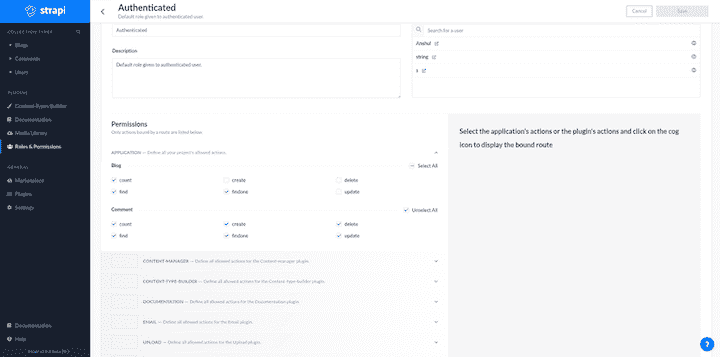

## 实现我们的 Gatsby 前端

对于前端，我们将使用[盖茨比](https://blog.logrocket.com/is-gatsby-really-that-great-e7b19c4c1c05/)。使用`gatsby new frontend`创建一个新的 Gatsby 项目。我们项目的文件结构如下。

```
src/
├── components
│   ├── card.js
│   └── dialog.js
├── images
└── pages
    ├── 404.js
    ├── blog.js
    └── index.js

```

### 前端组件

让我们看看我们将在前端使用的组件。

*   包含一个简单的卡片组件，显示作为道具提供给它的信息
*   `dialog.js`包含一个登录和注册的对话框
*   `blog.js`用于显示博客和评论
*   是主页，显示博客列表
*   `404.js`未找到 URL 时显示错误

### 设计主页


向 API `/blogs`发出 GET 请求，获取所有的博客文章。这映射到一个博客文章列表，并为每个博客文章显示一个卡片组件。它还包含显示登录/注册对话框的代码。

当用户点击一张卡片时，它会将他们导航到`/blog`页面。

```
import React, { useState } from 'react';
import { makeStyles } from '@material-ui/core/styles';
import Grid from '@material-ui/core/Grid';
import Typography from '@material-ui/core/Typography';
import Card from "../components/card";
import Dialog from "../components/dialog"
import { Button } from '@material-ui/core';
const useStyles = makeStyles((theme) => ({
  root: {
    flexGrow: 1,
    textAlign: "center"
  },
  paper: {
    height: 500,
    width: 400,
  },
  control: {
    padding: theme.spacing(2),
  },
}));
export default function () {
  const classes = useStyles();
  const [blogs, setBlogs] = useState([])
  const [open, setOpen] = useState(false)
  const [login, setLogin] = useState(false)
  // fetch all blogs
  React.useEffect(() => {
    fetch("http://localhost:1337/blogs").then(res => res.json()).then(val => setBlogs(val))
  }, [])
  return (
    <>
    {/*dialog for authentication */}
      <Dialog open={open} setOpen={setOpen} login={login} />
      <Grid container className={classes.root} spacing={2}>
        <Grid item xs={12}>
          <Grid container justify="center">
            <Grid item xs={10}>
              <Typography variant="h3" component="h2" gutterBottom gutterLeft>Blogs</Typography>
            </Grid>
            {/*check if token is present or not */}
            {
              !localStorage.getItem("token") ? [<Grid item xs={1}>
                <Button onClick={() => { setOpen(true); setLogin(true) }}>Login</Button>
              </Grid>,
              <Grid item xs={1}>
                <Button onClick={() => { setOpen(true); setLogin(false) }}> Register</Button>
              </Grid>] : ""
            }
          </Grid>
        </Grid>
        <Grid item xs={12}>
          <Grid container justify="center" spacing={10}>
            {/*map through list of blog and create list of cards */}
            {blogs.map((value) => (
              <Grid key={value} item>
                <Card value={value} />
              </Grid>
            ))}
          </Grid>
        </Grid>
      </Grid>
    </>
  );
}

```

### 设计我们的卡组件

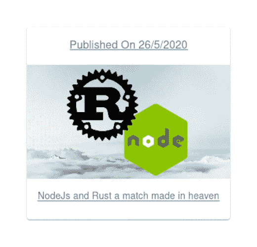

```
import React from 'react';
import { makeStyles } from '@material-ui/core/styles';
import Card from '@material-ui/core/Card';
import CardHeader from '@material-ui/core/CardHeader';
import CardMedia from '@material-ui/core/CardMedia';
import CardContent from '@material-ui/core/CardContent';
import CardActions from '@material-ui/core/CardActions';
import Collapse from '@material-ui/core/Collapse';
import Typography from '@material-ui/core/Typography';
import { red } from '@material-ui/core/colors';
import { Link } from 'gatsby';
const useStyles = makeStyles((theme) => ({
  root: {
    maxWidth: 345,
  },
  media: {
    height: 0,
    paddingTop: '56.25%', // 16:9
  },
  expand: {
    transform: 'rotate(0deg)',
    marginLeft: 'auto',
    transition: theme.transitions.create('transform', {
      duration: theme.transitions.duration.shortest,
    }),
  },
  expandOpen: {
    transform: 'rotate(180deg)',
  },
  avatar: {
    backgroundColor: red[500],
  },
}));
export default function NewCard({ value }) {
  const classes = useStyles();
  return (
    <Link to={`/blog`} state={{ value }}>
      <Card className={classes.root}>
        <CardHeader
          subheader={`Published On ${new Date(value.created_at).toLocaleDateString("in")}`}
        />
        <CardMedia
          className={classes.media}
          image={"http://localhost:1337" + value.image.url}
        />
        <CardContent>
          <Typography variant="body2" color="textSecondary" component="p">
            {value.title}
          </Typography>
        </CardContent>
      </Card></Link>
  );
}

```

### 设计博客页面

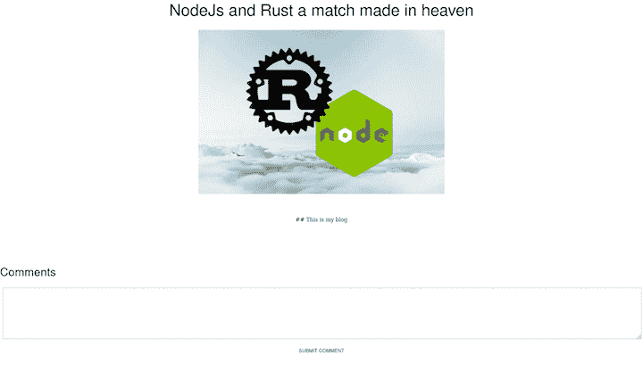

我们将从传递给页面的 location prop 中获取博客的详细信息，并使用对`/comments?blog={{blog-id}}`的 GET 请求获取博客的评论。`blog-id`是当前博客的 ID。

然后，我们将向`/comments`发出一个 POST 请求，请求头中带有 JWT 令牌。该令牌保存在本地存储中。

```
import React, { useState, useEffect } from 'react';
import { makeStyles } from '@material-ui/core/styles';
import Grid from '@material-ui/core/Grid';
import Typography from '@material-ui/core/Typography';
import List from '@material-ui/core/List';
import ListItem from '@material-ui/core/ListItem';
import ListItemIcon from '@material-ui/core/ListItemIcon';
import ListItemText from '@material-ui/core/ListItemText';
import Avatar from '@material-ui/core/Avatar';
import { TextareaAutosize } from '@material-ui/core';
import Button from "@material-ui/core/Button"
const useStyles = makeStyles((theme) => ({
    root: {
        flexGrow: 1,
        textAlign: "center"
    },
    paper: {
        height: 500,
        width: 400,
    },
    control: {
        padding: theme.spacing(2),
    },
    content: {
        margin: "100px"
    }
}));
export default function ({ location }) {
    const classes = useStyles();
    const [comments, setComments] = useState([])
    const [content, setContent] = useState("")
    useEffect(() => {
        fetch(`http://localhost:1337/comments?blog=${location.state.value.id}`).then(res => res.json()).then(val => setComments(val))
    }, [])
    const submitComment = () => {
        fetch("http://localhost:1337/comments", {
            method: "post",
            headers: {
                "content-type": "application/json",
                authorization: `Bearer ${localStorage.getItem("token")}`
            },
            body: JSON.stringify({
                content,
                blog: location.state.value.id
            })
        }).then(() => fetch(`http://localhost:1337/comments?blog=${location.state.value.id}`).then(res => res.json()).then(val => setComments(val)))
    }
    return (
        <>
            <Grid container className={classes.root} spacing={2}>
                <Grid item xs={12}>
                    <Grid container justify="center">
                        <Grid item xs={10}>
                            <Typography variant="h3" component="h2" gutterBottom gutterLeft>{location.state.value.title}</Typography>
                        </Grid>
                    </Grid>
                </Grid>
                <Grid container justify="center">
                    </img>
                </Grid>
                <Grid item xs={12} className={classes.content}>
                    <Grid container justify="center" spacing={10}>
                        {location.state.value.content}
                    </Grid>
                </Grid>
                <Typography variant="h4" component="h2" gutterBottom gutterLeft>Comments</Typography>
                <Grid item xs={12}><TextareaAutosize minLength={10} rowsMin={10} style={{ width: "100%" }} value={content} onChange={(e) => setContent(e.target.value)} /></Grid>
                <Grid item xs={12}><Button onClick={submitComment}>Submit comment</Button></Grid>
                <Grid item xs={12}>
                    <Grid container justify="left">
                        <List>
                            {
                                comments.map((val) => <ListItem>
                                    <ListItemIcon><Avatar>{val.user.username[0]}</Avatar></ListItemIcon>
                                    <ListItemText primary={`${val.user.username} said  `} />
                                    <ListItemText secondary={": " + val.content} />
                                </ListItem>)
                            }
                        </List>
                    </Grid>
                </Grid>
            </Grid>
        </>
    );
}

```

## 添加 RESTful 登录对话框组件

下面是我们的对话框组件在[提示用户登录](https://blog.logrocket.com/user-registration-authentication-strapi-next-js/)时的样子。

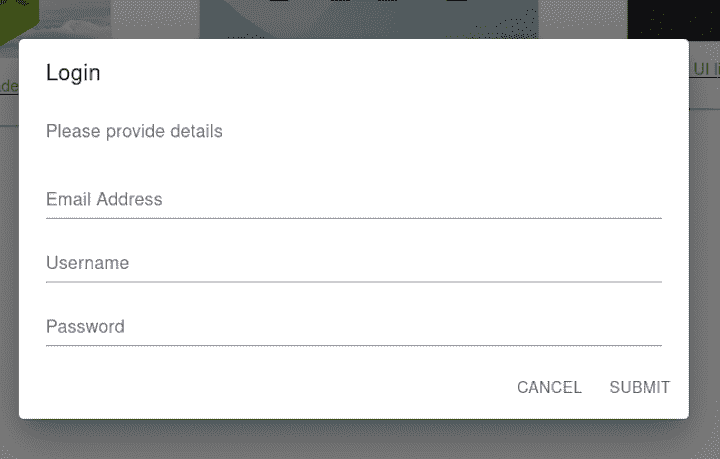

用用户名、电子邮件和密码向`/auth/local/register`发出用户注册的 POST 请求。当注册成功时，JWT 令牌被返回并保存在本地存储中，以便以后使用。

对于登录，向`/auth/local`发出一个 POST 请求，其中包含两个字段:`identifier`和`password`。`identifier`可以是电子邮件或用户名。

```
import React, { useState } from 'react';
import Button from '@material-ui/core/Button';
import TextField from '@material-ui/core/TextField';
import Dialog from '@material-ui/core/Dialog';
import DialogActions from '@material-ui/core/DialogActions';
import DialogContent from '@material-ui/core/DialogContent';
import DialogContentText from '@material-ui/core/DialogContentText';
import DialogTitle from '@material-ui/core/DialogTitle';
export default function FormDialog({ open, setOpen, login }) {
    const [pass, setPass] = useState("")
    const [email, setEmail] = useState("")
    const [user, setUser] = useState("")
    const handleSubmit = () => {
        if (!login)
            fetch("http://localhost:1337/auth/local/register", {
                method: "post",
                headers: {
                    "content-type": "application/json"
                },
                body: JSON.stringify({
                    password: pass,
                    email,
                    username: user
                })
            }).then((res) => res.json())
                .then(res => localStorage.setItem("token", res.jwt)).finally(() => setOpen(false))
        else
            fetch("http://localhost:1337/auth/local", {
                method: "post",
                headers: {
                    "content-type": "application/json"
                },
                body: JSON.stringify({
                    password: pass,
                    identifier: user || email
                })
            }).then((res) => res.json())
                .then(res => localStorage.setItem("token", res.jwt)).finally(() => setOpen(false))
    };
    const handleClose = () => {
        setOpen(false);
    };
    return (
        <div>
            <Dialog open={open} onClose={handleClose} aria-labelledby="form-dialog-title">
                <DialogTitle id="form-dialog-title">{login ? "Login" : "Register"}</DialogTitle>
                <DialogContent>
                    <DialogContentText>
                        Please provide details
          </DialogContentText>
                    <TextField
                        autoFocus
                        margin="dense"
                        id="email"
                        label="Email Address"
                        type="email"
                        fullWidth
                        value={email}
                        onChange={(e) => { setEmail(e.target.value) }}
                    />
                    <TextField
                        autoFocus
                        margin="dense"
                        id="username"
                        label="Username"
                        type="email"
                        fullWidth
                        value={user}
                        onChange={(e) => { setUser(e.target.value) }}
                    />
                    <TextField
                        autoFocus
                        margin="dense"
                        id="password"
                        label="Password"
                        type="password"
                        fullWidth
                        value={pass}
                        onChange={(e) => { setPass(e.target.value) }}
                    />
                </DialogContent>
                <DialogActions>
                    <Button onClick={handleClose} color="primary">
                        Cancel
          </Button>
                    <Button onClick={handleSubmit} color="primary">
                        Submit
          </Button>
                </DialogActions>
            </Dialog>
        </div>
    );
}

```

## 从 SQLite 切换到 PostgreSQL

Strapi 支持 NoSQL 和 SQL 数据库。更改数据库就像更改配置文件夹中的 env 变量一样简单。

默认情况下，Strapi 使用 SQLite，这有利于本地测试，但是在生产中，您应该使用生产就绪的数据库，例如 [PostgreSQL](https://blog.logrocket.com/getting-started-with-postgres-in-your-react-app/) 或 MySQL。这里我们将使用 PostgreSQL。

要更改数据库，请编辑`config/environments/production/database.json`文件。

```
{
  "defaultConnection": "default",
  "connections": {
    "default": {
      "connector": "bookshelf",
      "settings": {
        "client": "postgres",
        "host": "${process.env.DATABASE_HOST }",
        "port": "${process.env.DATABASE_PORT }",
        "database": "${process.env.DATABASE_NAME }",
        "username": "${process.env.DATABASE_USERNAME }",
        "password": "${process.env.DATABASE_PASSWORD }"
      },
      "options": {}
    }
  }
}

```

现在，它将从生产环境变量中选择数据库凭证。

## 结论

现在你应该对 Strapi 有了基本的了解，对进一步的探索有了坚实的基础。我们演示了如何创建带有关系的数据库模式、实现身份验证、定制控制器以及过滤数据。

Strapi 非常适合创建后端 api。它高度可定制，支持广泛的集成。Strapi 可以与 Nuxt、React、Angular——实际上是任何前端框架一起使用。

## 200 只显示器出现故障，生产中网络请求缓慢

部署基于节点的 web 应用程序或网站是容易的部分。确保您的节点实例继续为您的应用程序提供资源是事情变得更加困难的地方。如果您对确保对后端或第三方服务的请求成功感兴趣，请尝试 LogRocket 。[](https://logrocket.com/signup/)[https://logrocket.com/signup/](https://logrocket.com/signup/)

LogRocket 就像是网络和移动应用程序的 DVR，记录下用户与你的应用程序交互时发生的一切。您可以汇总并报告有问题的网络请求，以快速了解根本原因，而不是猜测问题发生的原因。

LogRocket 检测您的应用程序以记录基线性能计时，如页面加载时间、到达第一个字节的时间、慢速网络请求，还记录 Redux、NgRx 和 Vuex 操作/状态。[开始免费监控](https://logrocket.com/signup/)。