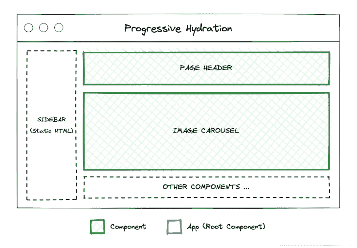
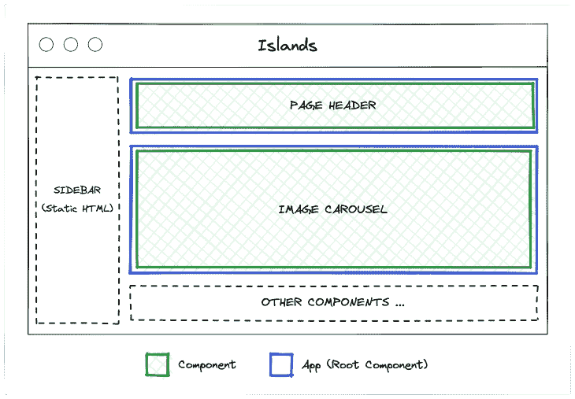

# 从巨石迁移到岛屿的策略

> 原文：<https://blog.logrocket.com/strategies-migrating-monolith-islands/>

单片应用程序可能不是今天所有的热门，但是很多(WordPress，Ruby on Rails，Laravel，等等。)都是活的，活跃的，还在大量使用。

事实上，不那么流行的一个主要好处是“流行”在过去几年中已经发展得足够远，许多现代模式可以应用于构建网站和应用程序的更传统的方法。

在这里，我们将看看岛屿建筑。这是一个已经讨论了几年的范式，但最近得到了更多的关注。在 [Next.js 13](https://nextjs.org/blog/next-13) (最流行的现代框架之一)中刚刚发布的新特性中使用了类似的范例，暗示这种类型的模式有足够的支持演变成主流。

## 岛屿建筑说明

我们在这里的目标是探索如何在使用单一应用程序时利用孤岛架构的优势。让我们首先来看看确定什么是孤岛架构，以便更好地了解它是否适合您的应用程序。

### HTML 呈现模式的历史

为了理解孤岛是如何工作的，让我们先来看看在 web 上呈现 HTML 的过于简化的历史:

*   **SSR** :单体框架(WordPress、Ruby on Rails、Laravel)传统上使用服务器端代码编译 HTML，并在请求时将代码发送给浏览器——即[服务器端呈现(SSR)](https://blog.logrocket.com/implementing-ssr-next-js-dynamic-routing-prefetching/)
*   **SPA** :大约十年前，[单页面应用(SPA)](https://blog.logrocket.com/micro-frontend-apps-single-spa/)——Angular，React——的引入使得网站可以呈现单个 HTML 页面，但用 JavaScript 构建内容。这很快变得难以维护并失宠，但它推动了开发，为通过组件构建和维护 ui 打开了大门
*   **SSG** :推出 [Netlify](https://www.netlify.com/) 和 [Jamstack](https://jamstack.org/) 利用 CDN 商业化地传送静态内容，内置缓存失效机制。几乎是在一夜之间，这使得静态站点发电机(SSG)再次冷却。通过 SSGs，服务器在构建过程中预先呈现网站的整套 HTML 页面，并通过 CDN 提供给用户。这是革命性的，但也给大型网站带来了额外的挑战(构建时间长、缺乏可预见性、成本等。)
*   **SSR + SSG** :几年前，Next.js 大受欢迎，很大程度上是因为它引入了一种方法来处理预渲染的扩展挑战，允许在 SSR 和 SSG 之间进行每页选择。但是，一旦客户端 JavaScript 被加载，它就像一个 SPA。开发人员非常喜欢这种方法的一点是(除了可伸缩性之外),一切都可以用 JavaScript 完成

### 渲染革命与进化

乍一看(没有太多细微差别)，这段历史似乎暗示我们回到了我们开始的地方，差不多 20 年后。

> 钟摆终于摆了回来，用一个破坏球的力量。愿过去十年建造的不必要的复杂之塔被粉碎💥🔨[https://t.co/PPGUB2U6Af](https://t.co/PPGUB2U6Af)

讽刺的是，通过服务器，然后是客户端，再然后是服务器进行渲染的流行是显而易见的。但事情没那么简单。每一次革命都是为 web 创造更好的开发者体验的一次进化，坦率地说，是为了让更多的人能够更容易地使用 web。

### 找到两全其美的方法:渐进式补水

自从 Next.js 流行以来，出现了无数的工具来尝试解决如何找到性能和开发人员体验的完美平衡。

已经出现的共同模式通常围绕着我们所说的[渐进水合](https://www.patterns.dev/posts/progressive-hydration/)。通过渐进式水合，HTML 从服务器发送到浏览器。这可以通过 SSR(按需构建)或 SSG(预构建)来实现。

然后，该页面加载一个 JavaScript 包，该包“融合”了页面，使其具有交互性。

Next.js 和其他人正是利用这种范式，让开发人员能够使用 React 等 UI 框架来构建包含组件的整个 UI，并分别选择最有效的方式将内容交付给浏览器。

### 岛屿与渐进水合

Islands 遵循渐进式水合的动机，但有所改变——他们的目标是向客户端发送更少的 JavaScript。

对于岛，页面上的每个组件都被视为一个岛。那些不需要交互性的，就是单纯的静态 HTML。交互式组件作为迷你应用程序发布，包含交互性所需的所有 JavaScript。

这些网站上有一些很棒的岛屿介绍文章:

### 建筑在继续发展

在我们继续前进之前，重要的是要认识到我们还没有走到尽头。新的优化和模式不断涌现。最近发布的使用 React 服务器组件的[Next 13](https://nextjs.org/blog/next-13)和 [Shopify 收购 Remix](https://shopify.engineering/remix-joins-shopify) 是两个继续寻找新方法来优化开发者和用户体验之间平衡的故事。

## 岛屿建筑的优势

孤岛方法有许多好处，但大多数都是在现有框架的基础上改进的，这些框架提供了可以在服务器上处理的依赖关系。对于小型和/或大部分是静态的应用程序，这绝对有意义。这是个很好的选择。

相反，让我们考虑一下我发现的孤岛相对于传统 SSR 单体框架的两个主要优势:

*   **客户端性能**:对大型应用程序来说，最方便的做法就是捆绑 JavaScript。这可能意味着您在每个页面上都加载了 JS 代码，但实际上它并不做任何事情，因为它服务于应用程序的另一部分
*   **组织/UI 可伸缩性**:孤岛意味着考虑组件。用组件构建 UI 比传统的 HTML 片段和巨大的 CSS 文件更容易管理和扩展

## 从巨石“迁移”到岛屿的小贴士

您可以通过几种不同的方式在您的单片应用程序中利用孤岛架构。它们不一定意味着迁移。这是关于改变你对网站交互性的思考方式。

### 手动调整您当前的实施

假设您正在使用一个 MVC 框架，或者甚至是一个带有局部视图概念的框架(正如大多数服务器端模板语言所做的那样)，您可以简单地将适当的 JavaScript 与每个“局部”视图一起带来。

这里的挑战是，您可能在不同的部分(岛)之间共享依赖关系。这可能需要一些实用程序在运行 JavaScript 代码之前有条件地加载必要的依赖项。

### 普通 web 组件

你可能听说过 [web 组件](https://developer.mozilla.org/en-US/docs/Web/Web_Components)。他们似乎冷静了一两分钟。嗯…他们回来了！这在很大程度上要归功于岛屿建筑这样的理念。

像 Brad Frost 这样的人正在考虑下一代 web 组件。Web 组件最初吓退了人们，因为需要 JavaScript 来呈现可重用到 DOM 的东西似乎很荒谬。我 100%同意——这就是为什么我从来没有真正用过它们。

像 [Lit](https://lit.dev/) 和 [Stencil](https://stenciljs.com/) 这样的框架已经存在很多年了，仍然可以使用，但是(以我的经验来看)很难以一种可扩展的、孤岛式的方式实现，这种方式与其他工具很好地融合。

然而， [11ty](https://www.11ty.dev/) 团队最近发布了一个名为 [WebC](https://github.com/11ty/webc) 的新项目，作为一种框架无关的方式来呈现 web 组件，并在以后根据需要对其进行水合。WebC 引入的模式有一个坚实的基础，根植于向客户端发送更少的 JavaScript，并且很可能在您今天使用的单一框架中实现。

11ty 团队还有另一个项目正在进行中，名为 [is-land](https://github.com/11ty/is-land) ，这是一个基于某些特定事件(例如，当它出现在视口中时)进行自我水合的 web 组件。is-land 是一个单独的脚本，也意味着是框架不可知的，尽管它最适合 11ty。这是值得考虑的除了 WebC，甚至就其本身与您的自定义实现的网页组件的渲染。

您可能不想直接使用这些框架或库，但是您可以使用它们来开发更适合您和您的工具的解决方案。

### 通过网络发送 HTML

随着这些 UI 框架越来越受欢迎，Basecamp 的人(Ruby on Rails 的创造者)开发了 [Hotwire](https://hotwired.dev/) ，这是一个将服务器端动作封装在页面的隔离部分而无需重新加载页面的工具。它只是从服务器响应中获取结果 HTML，并只替换页面的这一部分。

可能有类似 Hotwire 的工具可用于您正在使用的框架。

* * *

### 更多来自 LogRocket 的精彩文章:

* * *

然而，Hotwire 更像是异步请求的孤岛架构。据我所知，它并没有完全捕捉到页面上的交互性。例如，一个 carousel 组件可能需要 JavaScript 来旋转和响应点击，但它不需要发送数据。

换句话说，这种方法只能让您部分了解前端代码的真正孤岛方法。

### 逐渐迁移到现代框架

最后，还有核选项:重建！

如果你想要现代 web 模式的好处，但是以前的想法感觉太多的定制或努力，可能是时候升级你的前端了。

当然，当我们谈论升级整个应用程序时，总感觉很多。但不一定非要这样。你可以做这一块(页面、路线等)。)一次，使其逐渐迁移，或[扼杀者 fig 应用](https://martinfowler.com/bliki/StranglerFigApplication.html)。

许多人从 monolith 迁移到更具组合性的方法的方式是分别构建前端和后端，这可能是一条更简单的途径，因为您不必移动数据。取而代之的是，你当前的应用慢慢变成了一个纯 API 的应用，而你把前端页面剥离出来变成了一个新的应用。

## 选择适合你的道路

如您所知，这不是一种通用的迁移方式。如今有许多类型和规模的单片应用。有很多方法可以让你的前端代码获得类似孤岛的好处。

如果没有什么听起来立即显而易见或有益的，我建议尝试在您当前的系统内小规模实现一些方法。如果感觉合适，您可以将它推进一点，直到您确信它可以扩展到服务于您的整个应用程序。或者你继续尝试下一件事。

## 使用 [LogRocket](https://lp.logrocket.com/blg/signup) 消除传统错误报告的干扰

[LogRocket](https://lp.logrocket.com/blg/signup) 是一个数字体验分析解决方案，它可以保护您免受数百个假阳性错误警报的影响，只针对几个真正重要的项目。LogRocket 会告诉您应用程序中实际影响用户的最具影响力的 bug 和 UX 问题。

然后，使用具有深层技术遥测的会话重放来确切地查看用户看到了什么以及是什么导致了问题，就像你在他们身后看一样。

LogRocket 自动聚合客户端错误、JS 异常、前端性能指标和用户交互。然后 LogRocket 使用机器学习来告诉你哪些问题正在影响大多数用户，并提供你需要修复它的上下文。

关注重要的 bug—[今天就试试 LogRocket】。](https://lp.logrocket.com/blg/signup-issue-free)