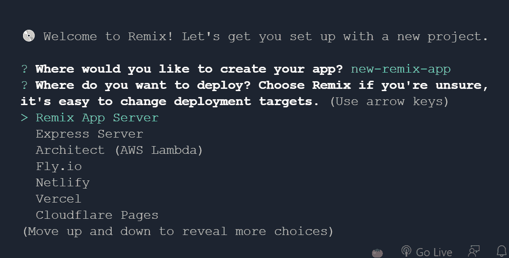
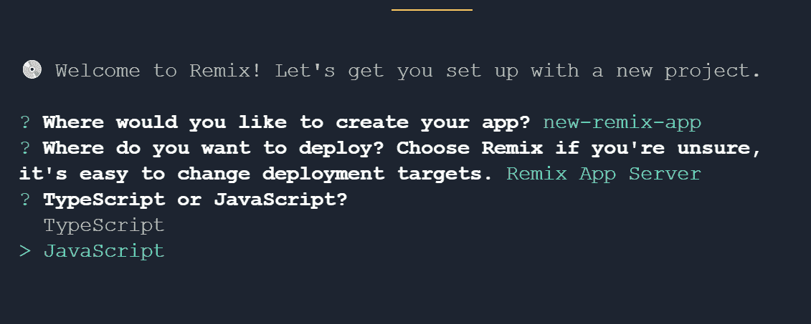
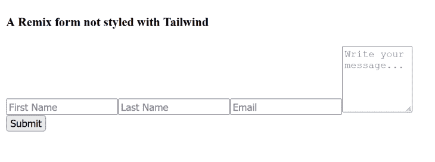
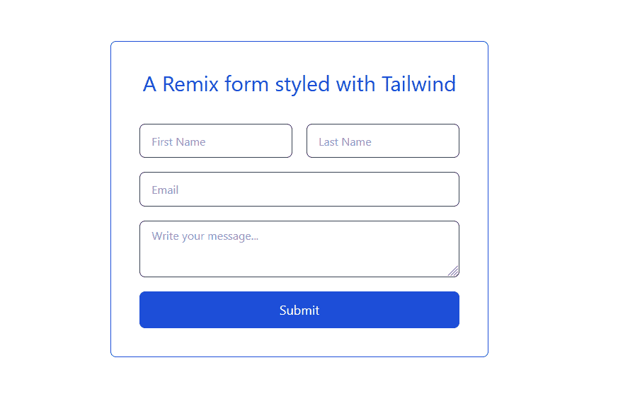

# 用顺风 CSS 设计混音应用程序

> 原文：<https://blog.logrocket.com/styling-remix-applications-tailwind-css/>

## 介绍

Remix 是一个用于构建 React 应用的全栈框架。它由 [React 路由器](https://blog.logrocket.com/migrating-react-router-v6-complete-guide/)的创造者制作，是目前最热门的框架之一，已经在 [GitHub](https://github.com/remix-run/remix) 上获得了 11k 颗星。

Remix 提供了一种构建应用程序的独特方法，并提供了一些有用的功能，如服务器端呈现、基于文件系统的路由、类型脚本支持、对 cookies 和会话的内置支持等等。Remix 最初是作为付费产品发布的，但最近被开源。

Tailwind CSS 是一个实用优先的框架，多年来越来越受欢迎。它附带了几个有用的实用程序类、JIT 模式、scroll snap API 等，使开发人员能够快速发布前端用户界面。

Tailwind CSS 具有开发人员人机工程学的内联式搭配的优点，并生成一个 CSS 文件供 Remix 导入。生成的 CSS 输出通常在 8-10kb 左右，即使对于大型应用程序也是如此。

在本文中，我们将学习如何使用 Tailwind CSS 设置和样式化一个 Remix 应用程序。

## 设置新的混音应用程序

要设置一个新的 Remix 应用程序，我们必须使用一个叫做 [create-remix](https://www.npmjs.com/package/create-remix) 的工具。

在您的终端中运行以下命令开始:

```
npx [email protected]

```

上面的命令触发了一个 CLI，我们可以在其中配置应用程序。

下图显示了 CLI 提供的配置选项:







差不多就是这样！接下来让我们将 Tailwind CSS 添加到应用程序中。

## 将 Tailwind CSS 与 Remix 集成

我们需要按照以下步骤将 Tailwind 集成到我们的应用程序中:

首先，运行下面的命令来安装 Tailwind CSS:

```
npm add -D concurrently tailwindcss

```

接下来，我们需要初始化 Tailwind 并在应用程序的根目录下创建`tailwind.config.js`文件:

```
npx tailwindcss init

```

现在我们可以更新`tailwind.config.js`文件了。我们在那里添加所有模板文件的路径:

```
module.exports = {
  content: ["./app/**/*.{ts,tsx,jsx,js}"], //paths added to config
  theme: {
    extend: {},
  },
  variants: {},
  plugins: []
};

```

接下来，我们将更新`package.json`文件中的脚本，如下所示:

```
"scripts": {
    // ...
    "build": "npm run build:css && remix build",
    "build:css": "tailwindcss -o ./app/tailwind.css",
    "dev": "concurrently \"npm run dev:css\" \"remix dev\"",
    "dev:css": "tailwindcss -o ./app/tailwind.css --watch",
    // ...
},

```

随着我们对脚本的修改，启动我们的开发服务器将会生成一个`tailwind.css`文件。

最后，将生成的样式表与我们的应用程序链接起来:

```
import { Links, LiveReload, Outlet, Scripts, ScrollRestoration } from "remix";

import styles from "./tailwind.css";

export function links() {
  return [{ rel: "stylesheet", href: styles }];
}

export default function App() {
  return (
    <html lang="en">
      <head>
        <Links />
      </head>
      <body>
        <Outlet />
        <ScrollRestoration />
        <Scripts />
        {process.env.NODE_ENV === "development" && <LiveReload />}
      </body>
    </html>
  );
}

```

我们将样式从生成的`tailwind.css`文件导入到我们的`app/root.jsx`文件中。

Remix 有一个链接样式表和其他外部资源的独特方法；我们创建并导出一个`links`函数到我们想要应用样式的页面中。在这种情况下，我们希望在整个应用程序中使用顺风风格。Remix 使用这个定制的`links`组件在后台加载链接。

至此，我们已经成功地将 Tailwind CSS 添加到应用程序中。接下来让我们用它来设计一些组件。

## 使用 Tailwind CSS 在 Remix 中设置联系人表单的样式

让我们设置一个基本的联系人表单，稍后我们将对其进行样式设置:

```
export default function Home() {
  return (
    <section> 
      <form>
        <h4>A Remix form not styled with Tailwind</h4>
        <div>
          <input type="text" placeholder="First Name" />
          <input type="text" placeholder="Last Name" />
          <input type="email" placeholder="Email" />
          <textarea
            cols="5"
            rows="2"
            placeholder="Write your message..."
          ></textarea>
        </div>
        <button type="submit">Submit</button>
      </form>
    </section>
  );
}

```

在这个代码块中，我们设置了一个`section`元素，并将一个`form`放入其中。该表单包含一个`h4`标题和一个`div`，在这里我们放置了`input`、`textarea`和`button`元素。

下图显示了没有应用任何样式的表单的外观:



现在，我们将 Tailwind 的实用程序类应用于表单:

```
export default function Home() {
  return (
    <section className="container mx-auto my-20 md:w-1/3 p-5 border border-blue-700 rounded-lg">
      <form className="space-y-10">
        <h4 className="text-center text-3xl text-blue-700">
          A Remix form styled with Tailwind
        </h4>
        <div className="grid grid-cols-2 gap-5">
          <input
            type="text"
            className="border border-gray-700 px-4 py-3 focus:outline-none focus:border-blue-700 rounded-lg"
            placeholder="First Name"
          />
          <input
            type="text"
            className="border border-gray-700 px-4 py-3 focus:outline-none focus:border-blue-700 rounded-lg"
            placeholder="Last Name"
          />
          <input
            type="email"
            className="border border-gray-700 px-4 py-3 focus:outline-none focus:border-blue-700 col-span-2 rounded-lg"
            placeholder="Email"
          />
          <textarea
            cols="5"
            rows="2"
            className="border border-gray-700 px-4 py-2 focus:outline-none focus:border-blue-700 col-span-2 rounded-lg"
            placeholder="Write your message..."
          ></textarea>
        </div>
        <button
          type="submit"
          className="focus:outline-none mt-5 bg-blue-700 px-4 py-3 text-white w-full text-lg rounded-lg"
        >
          Submit
        </button>
      </form>
    </section>
  );
}

```

让我们来分解我们添加到元素中的类:

在`section`元素中，`container`类将该部分的`max-width`设置为当前断点的最小宽度，而`mx-auto`将其居中。`md:w-1/3`将宽度设置为其容器的 33.333%。

在`form`元素中，`space-y-10`向表单添加 2.5 雷姆的上边距。

是输入元素所在的容器 div。我们通过给它一个`grid`类来设置它显示一个网格。`grid-cols-2`定义网格将有多少列，`gap-5`增加网格列之间的间距。

`border-gray-700`给`input`类一个深灰色的边框，`rounded-lg`增加一个边框半径。

对于`button`类，`text-white`将文本颜色设置为白色，`bg-blue-700`将按钮的背景颜色更改为深蓝色。

应用这种样式后，我们的表单看起来是这样的:



## 结论

在 Remix 应用程序中集成 Tailwind 非常简单。将 Remix 构建 web 应用程序的独特方法与 Tailwind 相结合，打开了 web 开发新可能性的大门。

## 你的前端是否占用了用户的 CPU？

随着 web 前端变得越来越复杂，资源贪婪的特性对浏览器的要求越来越高。如果您对监控和跟踪生产环境中所有用户的客户端 CPU 使用、内存使用等感兴趣，

[try LogRocket](https://lp.logrocket.com/blg/css-signup)

.

[](https://lp.logrocket.com/blg/css-signup)[https://logrocket.com/signup/](https://lp.logrocket.com/blg/css-signup)

LogRocket 就像是网络和移动应用的 DVR，记录你的网络应用或网站上发生的一切。您可以汇总和报告关键的前端性能指标，重放用户会话和应用程序状态，记录网络请求，并自动显示所有错误，而不是猜测问题发生的原因。

现代化您调试 web 和移动应用的方式— [开始免费监控](https://lp.logrocket.com/blg/css-signup)。