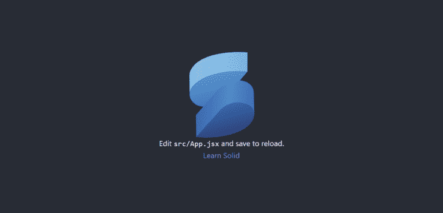
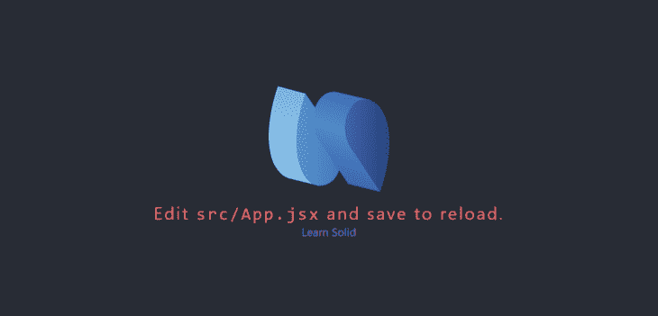
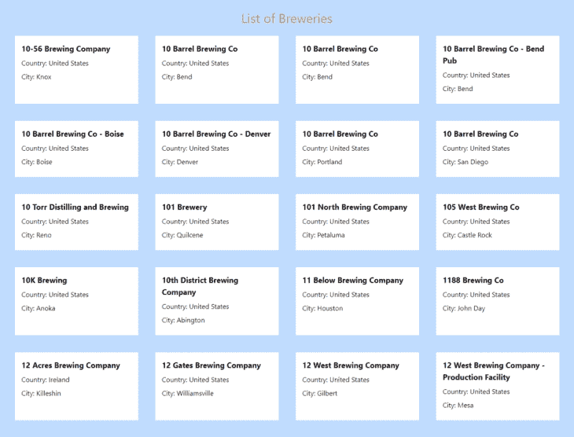

# 使用顺风 CSS 设计 SolidJS 应用程序

> 原文：<https://blog.logrocket.com/styling-solidjs-applications-using-tailwind-css/>

## 介绍

多年来，Tailwind CSS 越来越受欢迎，已经成为想要快速发布前端用户界面的 web 开发人员的首选 CSS 框架。

在本指南中，我们将介绍如何通过 [SolidJS](https://blog.logrocket.com/introduction-solidjs/) 安装和使用 Tailwind，这是一个 JavaScript 框架，因其轻量级和极快的速度而越来越受欢迎。

## 实体设置

要创建一个可靠的 JS 应用程序，请在终端上运行以下命令:

```
#javascript
npx degit solidjs/templates/js solid-tailwind

```

```
#typescript
npx degit solidjs/templates/ts solid-tailwind

```

上面的命令克隆了一个用 [Vite](https://blog.logrocket.com/whats-new-in-vite-2-0/) 构建的 SolidJS 模板应用程序。您可以选择克隆 TypeScript 或 JavaScript 模板版本，但是对于本指南，我们将继续使用 JavaScript 模板。

若要完成安装，请安装项目依赖项。首先，使用`cd`命令进入新创建的项目文件夹:

```
cd solid-tailwind

```

然后通过运行以下命令来安装依赖项:

```
npm install
#OR 
yarn install

```

接下来，您可以通过使用以下命令运行本地服务器来查看创建的项目:

```
npm run dev
#OR
yarn dev

```

如果没有其他应用程序在端口 3000 上运行，上面的命令将启动该端口上的本地开发服务器。

进入 [http://localhost:3000/](http://localhost:3000/) 查看 app 运行情况。



## 顺风设置

接下来，我们将安装和设置 [Tailwind](https://blog.logrocket.com/using-tailwind-css-in-production/) 来使用我们新创建的 SolidJS 项目。

要安装 Tailwind，我们需要将它和其他几个依赖项一起安装，比如 PostCSS 和 Autoprefixer。

使用以下命令安装依赖项:

```
npm install -D [email protected] [email protected] [email protected]
#OR
yarn add -D [email protected] [email protected] [email protected]                 

```

接下来，我们需要生成我们的`tailwind.config.js`和`postcss.config.js`文件。这些文件让我们可以配置 Tailwind 和 PostCSS，让它们按照我们想要的那样工作。

要生成这些文件及其内容，请运行以下命令:

```
npx tailwindcss init -p

```

接下来，让我们更新我们的`tailwind.config.js`文件中的`purge`数组，以包含我们想要从中移除未使用的顺风类的文件或目录的列表。这也称为树摇动，它有助于在部署应用程序时最小化包的大小:

```
#tailwind.config.js
module.exports = {
  purge: ['./index.html', './src/**/*.{js,ts,jsx,tsx}'],
  darkMode: false, // or 'media' or 'class'
  theme: {
    extend: {},
  },
  variants: {
    extend: {},
  },
  plugins: [],
}

```

现在我们将把 Tailwind 的 CSS 样式导入到我们的`index.css`文件中，该文件位于`src`文件夹中。

清空其内容并替换为以下代码:

```
/* index.css */
@tailwind base;
@tailwind components;
@tailwind utilities;

```

设置顺风的最后一步是将顺风导入到您的`index.jsx`或`index.ts`(如果您使用了 TypeScript 模板):

```
#index.jsx or index.ts
import { render } from "solid-js/web";
import "tailwindcss/tailwind.css";

import "./index.css";
import App from "./App";
render(App, document.getElementById("root"));

```

让我们通过向我们的`App.jsx`或`App.ts`文件中的段落标签添加 Tailwind 类来确认我们的安装:

```
<p class="text-4xl text-red-400 tracking-widest">
  Edit src/App.jsx and save to reload. </p>
```

我们在浏览器上的应用程序屏幕现在应该是这样的:



瞧，我们已经成功安装了顺风！现在，我们可以在我们的`.jsx`或`.ts`文件中的 HTML 标记中使用 Tailwind 类，根据我们的需要来设计我们的应用程序。

## 用 Tailwind 设计 SolidJS 应用程序

在本节中，我们将构建并设计一个迷你 SolidJS 应用程序，该应用程序对 [OpenBreweryDB API](https://api.openbrewerydb.org/) 进行 API 调用，并获取啤酒厂列表。我们将使用 Tailwind 来设计和显示输出。

我们完成的应用程序应该如下所示:



让我们进入`App.jsx`文件开始吧。首先，删除其内容，并替换为以下代码:

```
import { onMount, For } from "solid-js";
import { createSignal } from "solid-js";

function App() {
  const [breweryList, setBreweryList] = createSignal([]);
  const fetchBreweries = () => {
    const apiUrl = "https://api.openbrewerydb.org/breweries/";
    fetch(apiUrl)
      .then((response) => response.json())
      .then((data) => {
        console.log(data)
        setBreweryList(data)
      });
  }
  onMount(() => {
    fetchBreweries();
  })
  return (
    <div>
    </div>
  );
}
export default App;

```

上面的代码只是从 API 中获取啤酒厂列表，并在应用程序第一次实例化时将其设置为等于`breweryList`数组。

我们已经得到了数据，下一步是在浏览器屏幕上显示数据。为了实现这一点，让我们对 HTML 标记和样式的工作。

首先，我们将 Tailwind 类添加到根 div:

```
return (
    <div class="bg-blue-200 h-full"></div>
);

```

`bg-blue-200`类将根 div 的背景颜色设置为某种蓝色，而`h-full`类将高度设置为 100%。

接下来，我们在`h1`标签之间添加应用标题:

```
return (
  <div class="bg-blue-200 h-full">
    <h1 class="text-3xl text-red-400 text-center py-6">List of Breweries</h1>
  </div>
);

```

`text-3xl`类将字体大小增加到 30px，
`text-red-400`将文本颜色更改为某种红色，`text-center`将文本居中，`py-6`将 24px 的填充添加到文本的顶部和底部。

现在我们有了我们的`ul`标签，它包围了我们的`For`循环标签，它迭代来自 API 的数据并在`li`标签之间显示它:

```
return (
  <div class="bg-blue-200 h-full">
    <h1 class="text-3xl text-red-400 text-center py-6">List of Breweries</h1>
      <ul class="container mx-auto pb-10 grid grid-cols-4 gap-10">
        <For each={breweryList()}>{(list) =>
          <li class="bg-white p-4">
            <span class="inline-block mb-2 text-lg font-bold">
              {list.name}
            </span>
            <span class="inline-block mb-2">
              Country: {list.country}
            </span>
            <span class="inline-block mb-2">
              City: {list.city}
            </span>
          </li>
        }
        </For>
      </ul>
  </div>
);

```

`container`类将我们的`div`的`max-width`设置为当前断点的`min-width`。如果您更喜欢为一组固定的屏幕尺寸进行设计，而不是试图适应完全流动的视口，这将非常有用。

让我们列出一些其他使用的顺风类及其功能:

*   `mx-auto`将左右方向的边距设置为自动
*   在元素上实例化一个 CSS 网格
*   `grid-cols-4`设置 CSS 网格应该拥有的列数。这里我们指定了数字 4，所以我们得到了 4 列
*   `gap-10`向 CSS 网格添加网格间隙属性。我们指定了数字 10，因此它设置了 40px 的间隙
*   `bg-white`将元素的背景颜色设置为白色
*   `inline-block`将元素的显示属性设置为`inline-block`

这是一个非常基本的应用程序，但是 Tailwind 有很多其他的类可以用来使它变得更加高级。欲了解更多关于所有可用顺风类及其用途的信息，请查阅官方文档。

## 结论

恭喜您，您已经完成了本指南的结尾部分！现在，您可以在 SolidJS 应用程序中设置 Tailwind，并对其应用 Tailwind 样式。

为了使我们构建的应用程序更好，请仔细阅读 Tailwind 官方文档，使其具有响应性，添加过渡，并探索 Tailwind 提供的其他样式选项。

## 你的前端是否占用了用户的 CPU？

随着 web 前端变得越来越复杂，资源贪婪的特性对浏览器的要求越来越高。如果您对监控和跟踪生产环境中所有用户的客户端 CPU 使用、内存使用等感兴趣，

[try LogRocket](https://lp.logrocket.com/blg/css-signup)

.

[](https://lp.logrocket.com/blg/css-signup)[https://logrocket.com/signup/](https://lp.logrocket.com/blg/css-signup)

LogRocket 就像是网络和移动应用的 DVR，记录你的网络应用或网站上发生的一切。您可以汇总和报告关键的前端性能指标，重放用户会话和应用程序状态，记录网络请求，并自动显示所有错误，而不是猜测问题发生的原因。

现代化您调试 web 和移动应用的方式— [开始免费监控](https://lp.logrocket.com/blg/css-signup)。