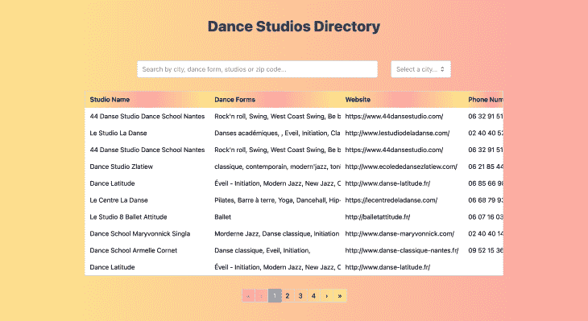
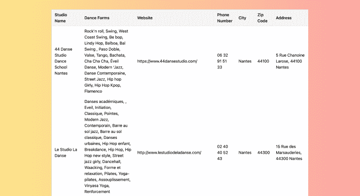
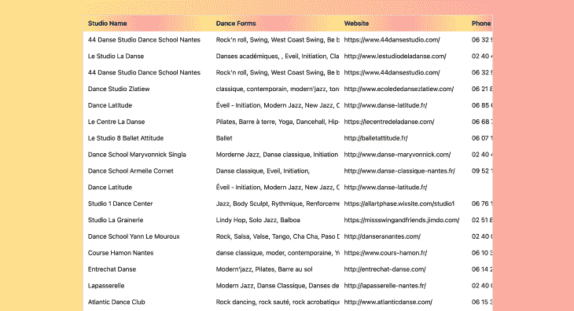
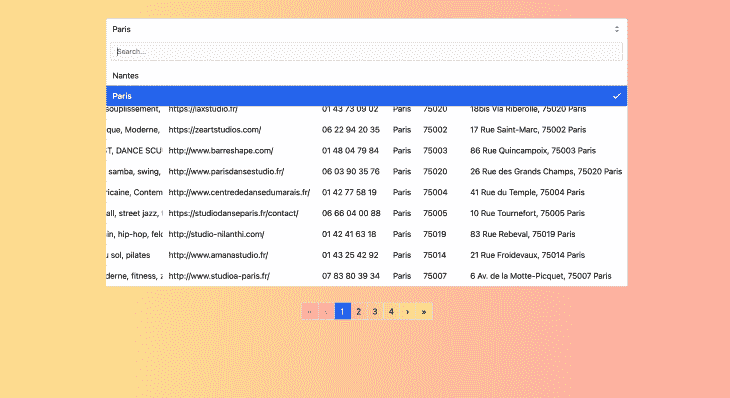
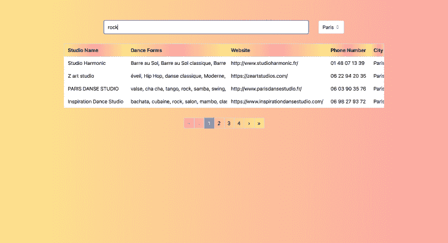

# 用 VueTailwind 设计 Vue.js 组件的样式

> 原文：<https://blog.logrocket.com/styling-vue-js-components-with-vuetailwind/>

想象一下，一个 UI 组件库可以满足您所有的具体需求。当然，这好得令人难以置信。然而，有一个接近的解决方案。在本教程中，我们将向您介绍 VueTailwind。

## 什么是 VueTailwind？

[VueTailwind](https://www.vue-tailwind.com/) 是一个 Vue.js 组件库，基于新的 [Tailwind CSS](https://blog.logrocket.com/tailwind-css-vs-bootstrap-ui-kits/) 框架，利用了它的实用程序类。VueTailwind 与其他组件库的不同之处在于，VueTailwind 是高度可定制的，因此您可以根据自己的需求快速进行调整。

简而言之，VueTailwind 将通过以下方式轻松适应您的应用设计:

*   为您提供了为每个组件设置变量和状态的可能性
*   允许您添加或覆盖现有组件的 CSS 类

但不要只相信我的话。让我们通过创建一个 Vue.js 应用程序来一起探索 VueTailwind👾。我们的演示应用程序将显示一个舞蹈工作室的目录，如下所示:



我们简单的应用程序将被称为[dance-directory.com](https://github.com/nrifki/dance-directory.git)。该代码可在 [GitHub](https://github.com/nrifki/dance-directory.git) 上获得。这个应用程序将列出和过滤舞蹈工作室💃🕺.

## 设置 VueTailwind

开始之前，我们需要设置我们的应用程序👷‍♀️.

首先用`npm install -g @vue/cli`安装 Vue CLI。

用`vue create dance-directory`创建 app。不要选择 Vue 3，因为 VueTailwind 与这个版本还不兼容。

安装顺风 CSS `vue add tailwind`。我总是为[顺风 CSS 智能感知](https://marketplace.visualstudio.com/items?itemName=bradlc.vscode-tailwindcss) VS 代码插件✨.生成一个`tailwind.config.js`

用`npm install vue-tailwind --save`安装 VueTailwind。

通过在项目根目录下的文件中列出必要的组件来安装它们。我们称之为`VueTailwindSettings.js`:

```
// 📜 VueTailwindSettings.js
import { TInput, TButton, TRichSelect, TPagination, TTag, TTable } from "vue-tailwind/dist/components";
const VueTailwindSettings = {
  "t-input": {
    component: TInput,
  },
  "t-button": {
    component: TButton,
  },
  "t-rich-select": {
    component: TRichSelect,
  },
  "t-pagination": {
    component: TPagination,
  },
  "t-tag": {
    component: TTag,
  },
  "t-table": {
    component: TTable,
  },
};
export default VueTailwindSettings;

```

您可以在 [VueTailwind 文档](https://www.vue-tailwind.com/docs/installation/)中浏览组件的完整列表。然而，我们只需要输入、按钮、rich select、分页、标记和表格组件——我认为这些都是该库功能的典型例子。

要配置我们的 Vue 应用程序以使用 VueTailwind 和组件，我们必须执行以下操作:

```
// 📜 src/main.js
import Vue from "vue";
import App from "./App.vue";
import router from "./router";
import "./assets/tailwind.css";
// 1️⃣  Import vue-tailwind
import VueTailwind from "vue-tailwind";
// 2️⃣  Import VueTailwind components we will use
import VueTailwindSettings from "/VueTailwindSettings.js";
Vue.config.productionTip = false;
Vue.use(VueTailwind, VueTailwindSettings);
new Vue({
  router,
  render: (h) => h(App),
}).$mount("#app");
```
- We also need to install [tailwindcss forms](https://github.com/tailwindlabs/tailwindcss-forms) using `npm install @tailwindcss/forms` and by adding it to the plugins list in the Tailwind CSS config file. ⬇️
```javascript
// 📜  tailwind.config.js
module.exports = {
  plugins: [require("@tailwindcss/forms")],
};

```

VueTailwind 还要求我们扩展 Tailwind CSS 变体的配置，以便根据元素的状态来处理元素样式(比如当一个按钮被禁用时):

```
// 📜  tailwind.config.js
module.exports = {
  variants: {
    extend: {
      opacity: ["disabled"],
      cursor: ["disabled"],
    },
  },
};

```

最后，我们将通过修改 Tailwind CSS 配置文件来配置 [PurgeCSS](https://purgecss.com/) 以移除未使用的 CSS:

```
// 📜  tailwind.config.js
module.exports = {
  purge: {
    content: ["./public/**/*.html", "./src/**/*.vue", "./VueTailwindSettings.js", "node_modules/vue-tailwind/dist/*.js"],
  },
};

```

此时，您的`tailwind.config.js`文件应该如下所示:

```
// 📜  tailwind.config.js
module.exports = {
  purge: {
    content: ["./public/**/*.html", "./src/**/*.vue", "./VueTailwindSettings.js", "node_modules/vue-tailwind/dist/*.js"],
  },
  darkMode: false, // or 'media' or 'class'
  theme: {
    extend: {},
  },
  variants: {
    extend: {
      opacity: ["disabled"],
      cursor: ["disabled"],
    },
  },
  plugins: [require("@tailwindcss/forms")],
};

```

为了快速设置项目，我将把与我将在`src/static/tableData.json`中列出的舞蹈工作室相关的数据存储起来，您可以在 [GitHub repo](https://github.com/nrifki/dance-directory/blob/main/src/static/tableData.json) 中访问这些数据。

## 使用 VueTailwind 设计 Vue.js 组件的样式

现在我们已经创建了我们的项目，让我们删除默认组件，并在动手之前给应用程序的背景添加一点爵士风格👐。

我们将使用 [VueTailwind 标签](https://www.vue-tailwind.com/docs/tag/)组件，并赋予其`tag-name` `_div_`来创建一个`<div></div>`元素，以包装我们的应用程序和主页中的组件。标签组件可以用来添加其他 HTML 标签，比如标题。

```
// 📜 src/App.vue
<template>
  <t-tag tag-name="div" class="min-h-screen p-10 bg-gradient-to-r from-yellow-200 to-red-300">
    <router-view />
  </t-tag>
</template>
<style></style>
```

```
// 📜 src/views/Home.vue
<template>
  <t-tag tag-name="div" class="max-w-screen-lg m-auto"> </t-tag>
</template>
<script>
export default {
  name: "Home",
};
</script>

```

到目前为止，在运行了`npm run serve`之后，你的页面在`[http://localhost:8081/](http://localhost:8081/)`上会是这样的:


现在，让我们使用表格组件显示添加到应用程序中的数据:

```
// 📜 src/views/Home.vue
<template>
  <t-tag tag-name="div" class="max-w-screen-lg m-auto">
    <t-table :headers="tableHeaders" :data="tableData"></t-table>
  </t-tag>
</template>
<script>
import tableDataJson from "@/static/tableData.json";
export default {
  name: "Home",
  data() {
    return {
      tableHeaders: ["Studio Name", "Dance Forms", "Website", "Phone Number", "City", "Zip Code", "Address"],
      tableData: tableDataJson,
    };
  },
};
</script>

```

首先，我们将我们的`Table`组件添加到主页`<t-table></t-table>`中。这个组件需要两个道具:`data`和`headers`。

接下来，我们导入数据`tableDataJson`，并通过在我们的数据函数中定义它，使它可以作为`tableData`被组件的`data`属性访问。

不要忘记列出我们将使用的标题(`tableHeaders`)。

如您所见，它工作正常，但看起来并不太好:



我们已经想开始设计我们的组件了。文档列出并详细解释了配置库主题的各种方法📖：

> 有三种方法可以定制我们的 UI 库:
> 
> *   一旦你使用了这个道具，你就清除了所有应用于组件的样式，只有你输入的 CSS 类会被考虑。
> *   你在这里输入的 CSS 类不会清除所有组件的现有样式。这样，我们可以添加更多的 CSS 类或者只覆盖一个我们想要改变的 CSS 类。
> *   `variants`:是一个 prop，期望一个对象带有你要使用的变体和它们各自的 CSS 类(比如 error 或者 disabled 变体，你说吧！).

我们将添加 Tailwind CSS 类，使表格更具可读性(例如，设置宽度和溢出)，并给表格标题一点颜色🖍:

```
// 📜 VueTailwindSettings.js
// [...]
const VueTailwindSettings = {
  // [...]
  "t-table": {
    component: TTable,
    props: {
      fixedClasses: {
        table: "min-w-0 block overflow-x-auto whitespace-nowrap",
        td: "max-w-xs overflow-scroll",
        theadTh: "bg-gradient-to-r from-yellow-200 via-red-300 to-yellow-200",
      },
    },
  },
};
//   [...]

```

现在我们的表格可以滚动，可读性更好:



⚠️注意到，通常，`classes`和`fixedClasses`道具需要字符串。在我们的例子中，我们正在使用一个[更复杂的组件](https://www.vue-tailwind.com/docs/table)。您应该经常检查组件的文档，以确保您理解它是如何构造的。

虽然我们的表格现在可读性更好了，但它还是太长了。如果我们添加更多数据，使用[分页](https://www.vue-tailwind.com/docs/pagination/)会很有帮助🔢：

```
// 📜 src/views/Home.vue
<template>
  <t-tag tag-name="div" class="max-w-screen-lg m-auto">
    <t-table :headers="tableHeaders" :data="tableData"></t-table>
    <t-pagination class="my-8 bg-gradient-to-l from-yellow-200 to-red-300" :total-items="paginationTotalRows" :per-page="paginationLimitRows" v-model="currentPage"></t-pagination>
  </t-tag>
</template>
<script>
import tableDataJson from "@/static/tableData.json";
export default {
  name: "Home",
  data() {
    return {
      currentPage: 1,
      paginationLimitRows: 10,
      tableHeaders: ["Studio Name", "Dance Forms", "Website", "Phone Number", "City", "Zip Code", "Address"],
      tableData: tableDataJson,
    };
  },
  computed: {
    paginationTotalRows() {
      return tableDataJson.length;
    },
  },
};
</script>

```

让我们来分析一下我们在这里做了什么。

首先，我们添加了`<t-pagination></t-pagination>`组件，并将其样式化如下:`class="my-8 bg-gradient-to-l from-yellow-200 to-red-300"`。

当然，您仍然可以直接在页面上而不是在 VueTailwind 配置文件中设计组件的样式。但是这应该保留给特殊情况。目前，我知道这是我的应用程序中唯一可以分页的地方，所以我继续在这里向分页组件添加样式。

任何你知道或者稍微知道会被多次使用的组件都应该在配置文件中使用`fixedClasses`中的`classes`进行样式化。你也可以为它创建`variant`。这只是一个干净的代码问题，有助于维护您的应用程序。

接下来，我们告诉分页组件 prop `total-items`我们有多少行。我们的`paginationTotalRows()`计算函数会处理这个问题。

我们向`per-page` prop 指定每页允许多少行。我选了`paginationLimitRows: 10`。

另外，不要忘记设置`v-model="currentPage"`到`1`，因为那是初始状态。
如果您运行这段代码，分页组件就在那里，它应该拥有的页数是准确的。也就是说，该表没有采用我们指定的每页行数(10)😰。

不在话下😃！我们只需要另一个计算函数来根据我们当前所在的页面过滤表:

```
// 📜 src/views/Home.vue
// [...]
<script>
import tableDataJson from '@/static/tableData.json';]
export default {
  // [...]
  computed: {
    paginationTotalRows() {
      return tableDataJson.length;
    },
    tableData() {
      return tableDataJson.filter((row, rowIndex) => {
        const startRowIndex = (this.currentPage - 1) * this.paginationLimitRows;
        const endRowIndex = this.currentPage * this.paginationLimitRows;
        return rowIndex >= startRowIndex && rowIndex < endRowIndex
      })
    }
  }
}
</script>

```

现在我们的表格已经分页😎！


让我们深入一点，添加一个丰富的选择和搜索输入来过滤表中的数据。假设你想在一个特定的城市找到舞蹈工作室，比如说巴黎。为此，我们可以使用[富选择组件](https://www.vue-tailwind.com/docs/rich-select):

```
// 📜 src/views/Home.vue
<template>
  <t-tag tag-name="div" class="max-w-screen-lg m-auto">
    <t-rich-select name="select" placeholder="Select a city..." v-model="selectedCity" :options="optionsCity"></t-rich-select>
    <t-tag tag-name="div" class="my-8">
      <t-table :headers="tableHeaders" :data="tableData"></t-table>
      <t-pagination class="my-8 bg-gradient-to-l from-yellow-200 to-red-300" :total-items="paginationTotalRows" :per-page="paginationLimitRows" v-model="currentPage"></t-pagination>
    </t-tag>
  </t-tag>
</template>
<script>
import tableDataJson from '@/static/tableData.json';
export default {
  name: 'Home',
  data() {
    return {
      currentPage: 1,
      optionsCity: ['Nantes', 'Paris'],
      paginationLimitRows: 10,
      selectedCity: '',
      tableHeaders: ['Studio Name', 'Dance Forms', 'Website', 'Phone Number', 'City', 'Zip Code', 'Address']
    }
  },
  computed: {
    paginationTotalRows() {
      return tableDataJson.length;
    },
    tableData() {
      return tableDataJson.filter((row) => {
        const filteredCity = this.selectedCity.toLowerCase();
        if (!filteredCity) {
          return true
        }
        const rowCity = row.City.toLowerCase();
        if (rowCity.includes(filteredCity)) {
          return true
        }
      }).filter((row, rowIndex) => {
        const startRowIndex = (this.currentPage - 1) * this.paginationLimitRows;
        const endRowIndex = this.currentPage * this.paginationLimitRows;
        return rowIndex >= startRowIndex && rowIndex < endRowIndex
      })
    }
  }
</script>

```

让我们来分解一下我们是如何实现城市过滤器的。

首先，我们添加了`<t-rich-select></t-rich-select>`组件。

接下来，我们给出组件`name="select"`、`placeholder="Select a city..."`，并在我们的`data`函数中将`v-model="selectedCity"`定义为一个空字符串。

我们在我们定义为`optionsCity: ['Nantes', 'Paris']`的过滤器`:options="optionsCity"`中填入选项。

为了让我们的表显示过滤后的数据，我们扩展了我们的`tableData()`计算函数，以便根据选择的城市过滤整个表。



如果我们想根据舞蹈工作室提供的舞蹈形式，或者仅仅根据它们的名称来搜索舞蹈工作室，该怎么办？我们可以添加一个搜索[输入](https://www.vue-tailwind.com/docs/text-input)如下:

```
// 📜 src/views/Home.vue
<template>
  <t-tag tag-name="div" class="max-w-screen-lg m-auto">
    <t-tag tag-name="div" class="flex max-w-screen-md m-auto my-8 justify-between">
      <t-input class="min-w-50 mr-8" name="search" placeholder="Search by city, dance form, studios or zip code..." v-model="filter"></t-input>
      <t-rich-select name="select" placeholder="Select a city..." v-model="selectedCity" :options="optionsCity"></t-rich-select>
    </t-tag>
    <t-tag tag-name="div" class="my-8">
      <t-table :headers="tableHeaders" :data="tableData"></t-table>
      <t-pagination class="my-8 bg-gradient-to-l from-yellow-200 to-red-300" :total-items="paginationTotalRows" :per-page="paginationLimitRows" v-model="currentPage"></t-pagination>
    </t-tag>
  </t-tag>
</template>
<script>
import tableDataJson from "@/static/tableData.json";
export default {
  name: "Home",
  data() {
    return {
      currentPage: 1,
      filter: "",
      optionsCity: ["Nantes", "Paris"],
      paginationLimitRows: 10,
      selectedCity: "",
      tableHeaders: ["Studio Name", "Dance Forms", "Website", "Phone Number", "City", "Zip Code", "Address"],
    };
  },
  computed: {
    paginationTotalRows() {
      return tableDataJson.length;
    },
    tableData() {
      return tableDataJson
        .filter((row) => {
          const searchTerm = this.filter.toLowerCase();
          if (!searchTerm) {
            return true;
          }
          const rowKeys = Object.keys(row);
          for (const rowKey of rowKeys) {
            const rowValue = row[rowKey].toString().toLowerCase();
            if (rowValue.includes(searchTerm)) {
              return true;
            }
          }
        })
        .filter((row) => {
          const filteredCity = this.selectedCity.toLowerCase();
          if (!filteredCity) {
            return true;
          }
          const rowCity = row.City.toLowerCase();
          if (rowCity.includes(filteredCity)) {
            return true;
          }
        })
        .filter((row, rowIndex) => {
          const startRowIndex = (this.currentPage - 1) * this.paginationLimitRows;
          const endRowIndex = this.currentPage * this.paginationLimitRows;
          return rowIndex >= startRowIndex && rowIndex < endRowIndex;
        });
    },
  },
};
</script>

```

我们将对搜索输入做与城市过滤器相同的事情。

首先，添加`<t-input></t-input>`组件。

给它一个`name="search"`、`placeholder="Search by city, dance form, studios or zip code..."`并将`v-model="filter"`也设置为我们`data()`中的一个空字符串。

我们还需要进一步扩展我们的`tableData()`计算函数，通过遍历所有行并搜索我们选择输入的任何关键字来过滤整个表。

然后…瞧🙌！



只剩下一个小细节:标题。我们将使用`<t-tag></t-tag>`组件，并将`tag-name`定义为`h3`:

```
// 📜 src/views/Home.vue
<template>
  <t-tag tag-name="div" class="max-w-screen-lg m-auto">
    <t-tag tag-name="h3" class="flex justify-center my-8 mb-16 text-4xl text-blue-900 font-extrabold">Dance Studios Directory</t-tag>
    <t-tag tag-name="div" class="flex max-w-screen-md m-auto my-8 justify-between">
      <t-input class="min-w-50 mr-8" name="search" placeholder="Search by city, dance form, studios or zip code..." v-model="filter"></t-input>
      <t-rich-select name="select" placeholder="Select a city..." v-model="selectedCity" :options="optionsCity"></t-rich-select>
    </t-tag>
    <t-tag tag-name="div" class="my-8">
      <t-table :headers="tableHeaders" :data="tableData"></t-table>
      <t-pagination class="my-8 bg-gradient-to-l from-yellow-200 to-red-300" :total-items="paginationTotalRows" :per-page="paginationLimitRows" v-model="currentPage"></t-pagination>
    </t-tag>
  </t-tag>
</template>
<script>
import tableDataJson from "@/static/tableData.json";
export default {
  name: "Home",
  data() {
    return {
      currentPage: 1,
      filter: "",
      optionsCity: ["Nantes", "Paris"],
      paginationLimitRows: 10,
      selectedCity: "",
      tableHeaders: ["Studio Name", "Dance Forms", "Website", "Phone Number", "City", "Zip Code", "Address"],
    };
  },
  computed: {
    paginationTotalRows() {
      return tableDataJson.length;
    },
    tableData() {
      return tableDataJson
        .filter((row) => {
          const searchTerm = this.filter.toLowerCase();
          if (!searchTerm) {
            return true;
          }
          const rowKeys = Object.keys(row);
          for (const rowKey of rowKeys) {
            const rowValue = row[rowKey].toString().toLowerCase();
            if (rowValue.includes(searchTerm)) {
              return true;
            }
          }
        })
        .filter((row) => {
          const filteredCity = this.selectedCity.toLowerCase();
          if (!filteredCity) {
            return true;
          }
          const rowCity = row.City.toLowerCase();
          if (rowCity.includes(filteredCity)) {
            return true;
          }
        })
        .filter((row, rowIndex) => {
          const startRowIndex = (this.currentPage - 1) * this.paginationLimitRows;
          const endRowIndex = this.currentPage * this.paginationLimitRows;
          return rowIndex >= startRowIndex && rowIndex < endRowIndex;
        });
    },
  },
};
</script>

```

我们的应用程序现在已经开始运行，准备好了🚀！


> 🔗[www.dance-directory.com](https://www.dance-directory.com/)

## 结论

如您所见，在配置 Vue.js 组件的主题时，如果您使用的是 Tailwind CSS，VueTailwind 非常有意义。创建组件所节省的时间是相当可观的😮。

同时，VueTailwind 具有极高的灵活性；您可以覆盖并实现这些组件所需的变体。

请记住，库是不断更新和改进的，所以请尝试一下，并保持关注。我怀疑在不久的将来我们会听到更多关于它的消息😉。

我也很高兴看到你们的评论和推特消息 [@RifkiNada](https://twitter.com/RifkiNada) 。如果你对我的工作或我的其他文章感兴趣，请随时查看我的[个人网站](https://www.nadarifki.com/)。

## 像用户一样体验您的 Vue 应用

调试 Vue.js 应用程序可能会很困难，尤其是当用户会话期间有几十个(如果不是几百个)突变时。如果您对监视和跟踪生产中所有用户的 Vue 突变感兴趣，

[try LogRocket](https://lp.logrocket.com/blg/vue-signup)

.

[](https://lp.logrocket.com/blg/vue-signup)[https://logrocket.com/signup/](https://lp.logrocket.com/blg/vue-signup)

LogRocket 就像是网络和移动应用程序的 DVR，记录你的 Vue 应用程序中发生的一切，包括网络请求、JavaScript 错误、性能问题等等。您可以汇总并报告问题发生时应用程序的状态，而不是猜测问题发生的原因。

LogRocket Vuex 插件将 Vuex 突变记录到 LogRocket 控制台，为您提供导致错误的环境，以及出现问题时应用程序的状态。

现代化您调试 Vue 应用的方式- [开始免费监控](https://lp.logrocket.com/blg/vue-signup)。