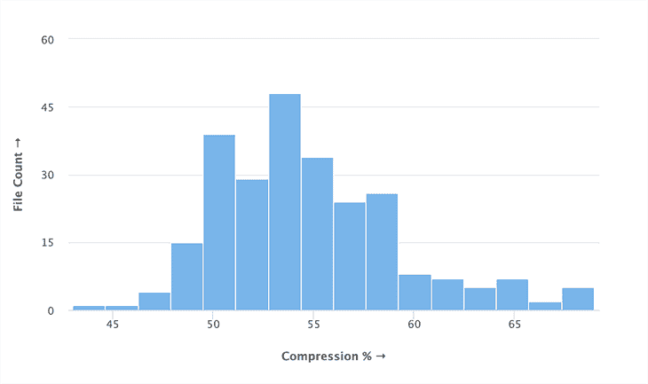
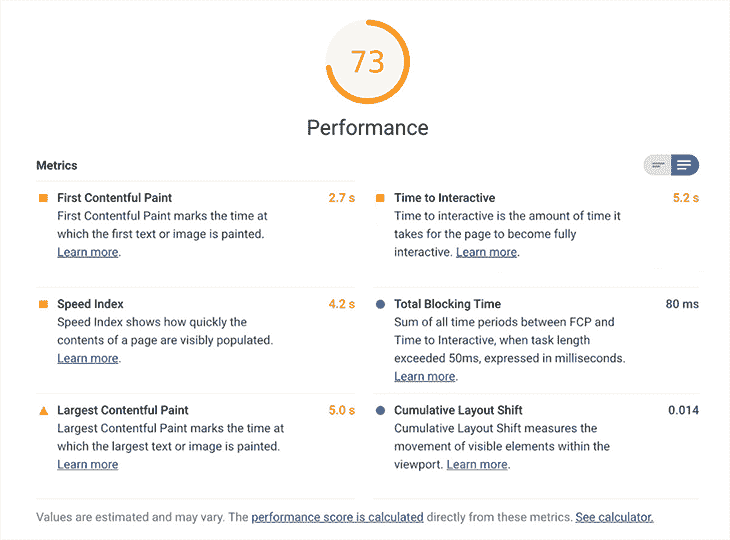

# SVGO 值得吗？

> 原文：<https://blog.logrocket.com/svgo-cost-benefit-analysis/>

SVG 优化器(SVGO)是一个流行的开源工具，用于缩小 SVG 文件。它的工作原理是“安全地删除编辑器元数据、注释、隐藏元素、[和]默认值或非最佳值。”看看 [Github 依赖数字](https://github.com/svg/svgo)，SVGO 是一个非常广泛使用的工具，在 460 万个仓库中使用。作为参考， [React](https://blog.logrocket.com/tag/react) 在 700 万个仓库中使用。

SVGO 是一个维护良好的项目，在大多数情况下，它会安全地删除所有不必要的字符。然而，尽管它有助于减轻页面重量，但最终重要的是它是否能在性能上产生明显的差异。这就是为什么 [Lighthouse 优先考虑像](https://web.dev/performance-scoring/)[第一幅有意义的画(FMP)](https://web.dev/first-meaningful-paint/) 、[第一幅有内容的画(FCP)](https://web.dev/first-contentful-paint/) 和[最大内容的画(LCP)](https://web.dev/lighthouse-largest-contentful-paint/) 这样的度量，而不是静态资产的大小和请求的数量。

我们需要问的问题是:SVGO 真的对表现有明显的影响吗？我们来看看细节。

## SVGO 可以节省多少字节？

SVGO 节省的字节数很大程度上取决于它正在缩小的文件以及它是如何创建的。在某些情况下，它可能会以一个位数的低百分比减少文件大小，在某些情况下，该数字可能高达 90%。对于使用 Sketch 和 Adobe Illustrator 等工具创建的具有非常精确的值、空格、长名称和注释的矢量文件，它尤其有效。

为了进行测试，我在各种 SVG 包中尝试了 SVGO，并在 SVGO 的标准默认值下比较了缩小前后的文件大小。如果你有兴趣，可以查看我的分析的[原始数据。](https://docs.google.com/spreadsheets/d/1doK9RY0K2EFnfzGjn1zPynt6RJwTN63IdlkO9OpbbuA/edit?usp=sharing)

### 旗帜套件

是一个 SVG 图标，是用 Sketch 创建的一组国旗。正如我们前面所说的，SVGO 对于用这个工具导出的文件非常有效。

对集合中的所有图标运行 SVGO 后，压缩百分比的分布如下:

Distribution of compression percentages for Flagkit

平均而言，SVGO 将文件大小减少了 54.8%。累积起来，对于所有文件，它节省了大约 446kB，即 56%。如果我们在应用程序中使用 FlagKit 的所有图标，我们可以用 SVGO 节省不到半兆字节。

### 插图

让我们对更大的东西做类似的分析。illustrations 是一个漂亮的 SVG 插图包，由 Adobe Illustrator 中的[维贾伊·维尔马](https://dribbble.com/realvjy)设计。

Distribution of compression percentages in Illlustrations

与 Flagkit 相比，压缩率没有那么高，但这是意料之中的，因为这个包中的 SVG 文件要大得多。在这种情况下，SVGO 平均节省了大约 24.2%，累计 824kB，即 23.7%。

### 世界地图(高清)

最后，让我们尝试一个大的 SVG 文件。来自 amCharts 的世界高清矢量地图大约有 1.3MB 大小。

在这里，SVGO 将文件大小减少到 880kB，节省了大约 420kB，即 31.5%。

### 概括起来

未精简和精简捆绑包之间的节约达到:

1.  旗帜套件:
    1.  未混合= 793kB
    2.  Minified = 346kB
    3.  **节省= 447kB**
2.  插图
    1.  未混合= 3.4MB
    2.  缩小= 2.6MB
    3.  **节省= 805kB**
3.  世界地图:
    1.  未混合= 1.3MB
    2.  Minified = 880kB
    3.  **节省= 420kB**

## 缺少组件:压缩

你可能已经注意到，我们遗漏了上面的一个关键步骤:压缩。互联网上的大多数静态资产和 HTML 页面都是使用 GZIP 压缩来传送的。据 W3 Techs 报道，更有效的 brotli 算法已经被 T2 30%的网站使用。两种压缩算法都能够显著减小静态资产的大小。

因此，我们应该比较压缩前后的文件大小。在这一部分，我将检查通过 Cloudflare CDN 提供的缩小和未缩小的捆绑包的大小。

注意:根据我的观察，Cloudflare CDN 默认使用 Brotli level 3 压缩，这比最大的 level 11 压缩要差，但对于测试最终的文件大小来说仍然足够好。如果你的 CDN 使用最好的压缩方式，大小的差别会更小。

下面是压缩后包的大小之间的差异(我使用了工具`[brotli-size-cli](https://github.com/andrewiggins/brotli-size-cli)`):

1.  旗帜套件:
    1.  未混合+ brotli-3 = 127kB
    2.  Minified + brotli-3 = 55kB
    3.  **节省= 72kB**
2.  插图
    1.  未混合+ brotli-3 = 592kB
    2.  Minified + brotli-3 = 470kB
    3.  **节省= 122kB**
3.  世界地图:
    1.  未混合+ brotli-3 = 503kB
    2.  Minified + brotli-3 = 370kB
    3.  **节省= 132kB**

我们可以看到，大小的差异要大得多。现在让我们看看这在 web 性能的上下文中意味着什么。

## 在应用内测试我们的发现

在我们的实验中，我们将尝试一次加载所有这些文件，看看这个增量有多重要。

我使用`[svg-sprite](https://github.com/svg-sprite/svg-sprite)`将我们所有的 SVG 打包成 CSS 精灵，以避免多个请求影响速度数据。我将精灵作为名为`[test-svgo](https://unpkg.com/browse/test-svgo@latest/)`的 npm 包上传，并使用 unpkg.com 的[CDN](https://unpkg.com/)来服务它们。因此，所有文件都通过 Cloudflare CDN 进行了测试，类似于在生产环境中提供文件的方式。

对于其性能审计，谷歌灯塔，可以说是最受欢迎的性能评分工具，使用[1.6 Mbps ↑/ 750 kbps↓节流连接](https://github.com/GoogleChrome/lighthouse/blob/master/docs/throttling.md)，这代表了 4G 连接的底部 25%和 3G 连接的顶部 25%。这相当于谷歌 Chrome DevTools 中的快速 3G 模式。我在相同的模式下测试了所有三个包，并记录了下载它们所花费的时间。结果如下:

1.  旗帜套件:
    1.  未混合+brot Li-3 = 700 毫秒
    2.  minified+brot Li-3 = 309 毫秒
    3.  **节省= 400 毫秒**
2.  插图
    1.  未混合+溴-3 = 3.28 秒
    2.  Minified + brotli-3 = 2.94s
    3.  **节省= 620 毫秒**
3.  世界地图:
    1.  未混合+ brotli-3 = 2.78
    2.  minified+brot Li-3 = 2.05 秒
    3.  **节省= 730 毫秒**

这里的差异是否足够显著，足以产生影响？是的，它是！然而，对此有很大的警告。

### 警告 1: SVG 不阻止渲染

SVG 图像通常是非阻塞资源，除非您已经在 CSS 中内联了它们。与 CSS 和 JS 不同，它们不会阻塞页面的渲染，并且可以并行加载。

Google Lighthouse [广泛地优先考虑与用户交互相关的指标](https://web.dev/performance-scoring/#lighthouse-8)。

Metrics graphic pulled from the [Google Lighthouse performance report page](https://web.dev/speed-index/)

因此，优先级应该是使第一次渲染尽可能快，然后顺序加载页面上的其他内容。

根据这一定义，找出需要首先渲染的内容并对这些资源进行优先级排序，是比 SVG 优化更好的提高性能的方法。只有当 SVG 都很大并且必须在第一个文件夹中加载时，优化 SVG 才会有真正的不同。

### 警告 2:捆绑通常并不可取

是的，在 HTTP1.1 时代，捆绑的确是提高性能的方法，但是有了 HTTP2，请求的开销[大大减少了](https://developers.google.com/web/fundamentals/performance/http2)。当您捆绑 SVG 时，您还会加载那些不是立即需要的文件。

看看这两个来自`test-svgo`项目的样本页面，[页面 A](https://unpkg.com/test-svgo@latest/css/sprite.css.illlustrations.html) 和[页面 B](https://unpkg.com/test-svgo@0.0.3/css/sprite.css.illlustrations.unbundled.html) 。页面 A 使用捆绑包加载插图，而页面 B 直接加载插图。页面 A 更擅长一次加载全部内容，但是页面 B 开始渲染插图的速度要快得多——提供了更好的用户体验。

在我们创建的包中，缩小产生了显著的差异，但更多的时候，我们希望单独使用我们的文件，当单独加载时，缩小几乎不会对性能产生明显的影响。你可以通过查看我们刚刚看过的同一页面的[缩小版](https://unpkg.com/test-svgo@latest/css/sprite-minified.css.illlustrations.unbundled.html)和[未缩小版](https://unpkg.com/test-svgo@latest/css/sprite.css.illlustrations.unbundled.html)来自己看到这一点。

### 警告 3:很少有人在一个页面上需要这么多 SVG

我们做测试时假设我们必须加载很多文件(或者一个大文件)来测试 SVGO 的能力。页面上可能会有多个大插图，使用 SVGO 会有所不同，但在大多数情况下，这些 SVG 往往是图标、徽标和简单的插图。

从 1.2MB 到 880kB 意义重大，但是从 2kB 到 1.2kB 并没有太大的区别，即使页面上有几十个图标。这是因为总的来说，即使 SVGO 将其削减 50 %,储蓄也会少得多。

## 结论

SVGO 是一个很好的工具，可以有意义地减少 SVG 文件的大小，但是节省的空间通常是有限的，因为 SVG 文件通常很小——不像在 CSS 或 JS 中加载图像，这会阻止页面的渲染，SVG 可以并行加载。

SVGO 对非常大的文件有意义，比如我们在本文中测试的世界地图，但是如果你的页面上只有有限数量的较小的 SVG，SVGO 不会提高你的性能。另外，如果您确实需要多个 SVG，很可能您不需要立即加载它们。

仔细考虑哪些资源需要首先渲染，可以对性能产生更大的影响。

另一个反对 SVGO 的理由是它对维护的影响。如果您维护两套 SVG，那很好。但如果你对所有文件都运行 SVGO，修改填充和描边等简单的事情就会变得更加困难。

总的来说，如果我们最终看不到更大的画面，我们不应该担心节省千字节——这些指标实际上很重要，如 FMP、FCP 和 LCP。总之，在大多数情况下，优化性能时，缩小 SVG 不应该是优先考虑的事情。

## 使用 [LogRocket](https://lp.logrocket.com/blg/signup) 消除传统错误报告的干扰

[LogRocket](https://lp.logrocket.com/blg/signup) 是一个数字体验分析解决方案，它可以保护您免受数百个假阳性错误警报的影响，只针对几个真正重要的项目。LogRocket 会告诉您应用程序中实际影响用户的最具影响力的 bug 和 UX 问题。

然后，使用具有深层技术遥测的会话重放来确切地查看用户看到了什么以及是什么导致了问题，就像你在他们身后看一样。

LogRocket 自动聚合客户端错误、JS 异常、前端性能指标和用户交互。然后 LogRocket 使用机器学习来告诉你哪些问题正在影响大多数用户，并提供你需要修复它的上下文。

关注重要的 bug—[今天就试试 LogRocket】。](https://lp.logrocket.com/blg/signup-issue-free)