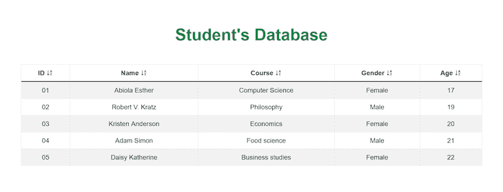
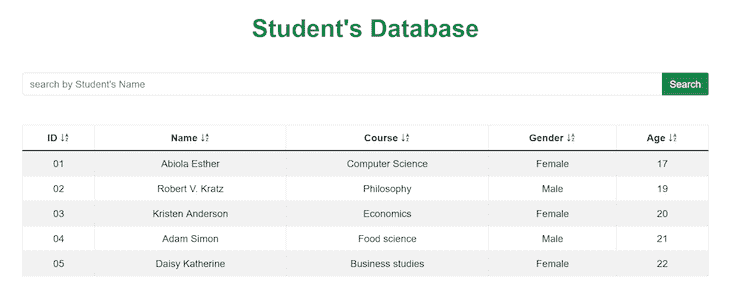

# 用 Bootstrap - LogRocket Blog 在 Vue 3 中从头开始构建一个表格组件

> 原文：<https://blog.logrocket.com/table-component-from-scratch-vue-3-bootstrap/>

表是数据的表示，通常使用行和列，但有时使用更复杂的结构。表格支持各种参数，可用于跟踪频率、记录等。

有了 Vue，我们可以使用组件(构建功能性 web 应用程序的可重用代码片段)轻松构建和实现单页面应用程序的表格。在本教程中，我们将逐步学习在 Vue 3 中使用 Bootstrap 构建表格组件的方法。你可以在这个 [GitHub repo](https://github.com/Abiola-Farounbi/vue3-table) 中找到完整实现的完整代码。让我们开始吧！

## 先决条件

要跟随本教程，您需要了解安装在本地开发机器上的 Vue 和 Node.js 的基本知识。您可以通过在终端中运行以下命令来验证是否安装了 Node.js:

```
node -v

```

## 目录

## 入门指南

### 创建新的 Vue 项目

首先，运行下面的代码来安装最新的 Vue CLI:

```
npm install -g @vue/cli

```

使用 Vue CLI 创建新的 Vue 3 项目:

```
vue create vue3-table

```

### 设置引导

Bootstrap 是一个流行的 CSS 框架，用于在移动友好的 web 应用程序中开发响应性和可定制的功能，也可以很容易地用于不同的组件。要为此项目设置引导程序，首先，我们将按如下方式安装引导程序:

```
npm i bootstrap 

```

然后，将 CSS 文件导入到项目中:

```
import "bootstrap/dist/css/bootstrap.min.css";

```

## 使用组合 API 创建表格组件

在撰写本文时， [Vue 3 被设置为所有 Vue 项目中的默认版本](https://blog.logrocket.com/building-vue-3-component-library/)。Vue 3 引入了构建高效和健壮的应用程序的特性，其中之一是[组合 API](https://v3.vuejs.org/api/composition-api.html) 。

组合 API 是一个总括术语，由一组 API 组成，允许我们使用导入的函数而不是声明选项来创作 Vue 组件。Composition API 主要与单文件组件中的`[<script setup>](https://vuejs.org/api/sfc-script-setup.html)`语法一起使用，以可组合函数的形式为您的代码库实现干净、高效的逻辑重用。

在本节中，我们将从头开始构建一个反应式表格组件，然后向表格组件添加额外的功能。让我们一步一步地看每一部分。

## 在表格上显示数据

首先，让我们在 components 文件夹中创建一个名为`Table.vue`的组件。在定义组件时，我们将使用 HTML 表格元素来设置表格的布局。我们可以使用 Bootstrap 中的 CSS 类轻松地设计组件的样式:

```
<template>
  <table id="tableComponent" class="table table-bordered table-striped">
  </table> 
</template>

```

表格由表头`thead`和表体`tbody`组成。在构建组件时，我们将考虑将单独的数据作为页眉和页脚的道具进行传递，然后使用`v-for`指令创建一个`for loop`来获取表的每个值。

在组件中，我们还将创建组件将从父组件接收数据的属性:

```
  &lt;thead>
    <tr>
      <!-- loop through each value of the fields to get the table header -->
      <th  v-for="field in fields" :key='field' @click="sortTable(field)" > 
        {{field}} <i class="bi bi-sort-alpha-down" aria-label='Sort Icon'></i>
       </th>
    </tr>
  </thead>
  <tbody>
      <!-- Loop through the list get the each student data -->
      <tr v-for="item in filteredList" :key='item'>
      <td v-for="field in fields" :key='field'>{{item[field]}}</td>
    </tr>
  </tbody>

```

表格组件的最终实现如下面的代码所示:

```
<template>
  </div>
<table id="tableComponent" class="table table-bordered table-striped">
  <thead>
    <tr>
      <!-- loop through each value of the fields to get the table header -->
      <th  v-for="field in fields" :key='field' @click="sortTable(field)" > 
        {{field}} <i class="bi bi-sort-alpha-down" aria-label='Sort Icon'></i>
       </th>
    </tr>
  </thead>
  <tbody>
      <!-- Loop through the list get the each student data -->
      <tr v-for="item in filteredList" :key='item'>
      <td v-for="field in fields" :key='field'>{{item[field]}}</td>
    </tr>
  </tbody>
</table> 
</template>
<script>
export default {
  name: 'TableComponent',
  props:{
      // 
      studentData:{
          type: Array,
      },
      fields:{
          type: Array,
      }
  }, 
}
</script>

```

现在我们的 table 组件已经完成，我们将导入 table 组件并用 props 声明它。将以下代码添加到`App.vue`文件中:

```
&lt;template>
    <div class="container text-center  mt-5 mb-5">
    <h1 class="mt-5 fw-bolder text-success "> Student's Database </h1>
     <div class="table-responsive my-5">

      <!-- The table component -->
       <Table :fields='fields' :studentData ="studentData"></Table>
     </div>

</div>
</template>
<script>
// Importing the table component
import Table from './components/Table.vue'
export default {
  name: 'App',
  components: {
    Table
  },
  setup(){
    //An array of values for the data
       const studentData = [
      {ID:"01", Name: "Abiola Esther", Course:"Computer Science", Gender:"Female", Age:"17"},
     {ID:"02", Name: "Robert V. Kratz", Course:"Philosophy", Gender:"Male", Age:'19'},
      {ID:"03", Name: "Kristen Anderson", Course:"Economics", Gender:"Female", Age:'20'},
     {ID:"04", Name: "Adam Simon", Course:"Food science", Gender:"Male", Age:'21'},
      {ID:"05", Name: "Daisy Katherine", Course:"Business studies", Gender:"Female", Age:'22'},  
    ]
    const fields = [
      'ID','Name','Course','Gender','Age'
    ]
    return{studentData,fields}
  },
}
</script>

```

上面代码的输出如下:



## 附加功能

根据您正在构建的应用程序中表组件的用例，您可以在组件中包含不同的功能来改善用户体验，比如多列排序和筛选。在这一节中，我们将学习如何在您的表组件中包含这些特性。

### 多列排序

排序可以是升序也可以是降序。对于表，这取决于所选的特定列。您可以使用默认的 JavaScript 函数或其他外部插件(如 [Lodash](https://lodash.com/) )轻松实现多列排序，这些插件提供了不同的模板函数，更容易添加到组件中。

使用以下命令安装 Lodash:

```
npm i --save lodash

```

Lodash 库提供了各种可以处理数组、集合、字符串、对象和数字的函数。然后我们直接从`lodash`导入排序函数:

```
// Importing the lodash library
import { sortBy} from 'lodash';

```

然后我们创建一个`sortTable()`函数来处理点击事件。还创建了一个新的列表，用排序后的值实时更新数据:

```
// a value to check for sort
let sort = ref(false);
let updatedList = ref([])
// a function to sort the table
const sortTable = (col) => {
    sort.value = true
    // Use of _.sortBy() method
    updatedList.value = sortBy(props.studentData,col)
  }

```

为了指定要排序的列，将参数`col`传递给每个标题。当用户单击任一标题时，该列被设置为按升序排序:

```
<th v-for="field in fields" :key='field' @click="sortTable(field)" >
    {{field}} <i class="bi bi-sort-alpha-down" aria-label='Sort Icon'></i>
</th>

```

项目从最低到最高排序，即从`A`到`Z`，第一行显示最低值，随后各行显示逐渐升高的值:


### 过滤

在表中，我们还可以通过指定的条件或查询来搜索数据。我们可以使用 JavaScript `filter`函数实现过滤。首先，我们创建一个搜索栏布局:

```
&lt;div class="searchBar">
     <!-- Filter Search -->
     <div class="input-group mb-5">
       <input type="search" class="form-control" v-model='searchQuery' placeholder="Student's Name" aria-label="Recipient's username" aria-describedby="button-addon2">
      </div
    </div>

```

使用 computed 属性，我们创建一个新列表，该列表根据 filter 函数的返回值更新旧列表:

```
const filteredList = computed(() => {
  return sortedList.value.filter((product) => {
    return (
    // converts the query and value to lower case  index
       product.Name.toLowerCase().indexOf(searchQuery.value.toLowerCase()) != -1
       )
       });

```



## 结论

表格以可视化格式表示数据，便于用户在 web 应用程序中查看和理解。在本文中，我们在 Vue 3 中从头开始构建了一个响应迅速、可访问的表格组件。我们还将 Bootstrap 框架用于定制样式，然后进一步向组件添加排序和过滤功能。

您可以在本文的基础上添加更多的特性来提高您的整体 UX。我希望你喜欢这个教程，如果有任何问题，一定要在 Twitter 上联系我。编码快乐！

## 像用户一样体验您的 Vue 应用

调试 Vue.js 应用程序可能会很困难，尤其是当用户会话期间有几十个(如果不是几百个)突变时。如果您对监视和跟踪生产中所有用户的 Vue 突变感兴趣，

[try LogRocket](https://lp.logrocket.com/blg/vue-signup)

.

[](https://lp.logrocket.com/blg/vue-signup)[https://logrocket.com/signup/](https://lp.logrocket.com/blg/vue-signup)

LogRocket 就像是网络和移动应用程序的 DVR，记录你的 Vue 应用程序中发生的一切，包括网络请求、JavaScript 错误、性能问题等等。您可以汇总并报告问题发生时应用程序的状态，而不是猜测问题发生的原因。

LogRocket Vuex 插件将 Vuex 突变记录到 LogRocket 控制台，为您提供导致错误的环境，以及出现问题时应用程序的状态。

现代化您调试 Vue 应用的方式- [开始免费监控](https://lp.logrocket.com/blg/vue-signup)。