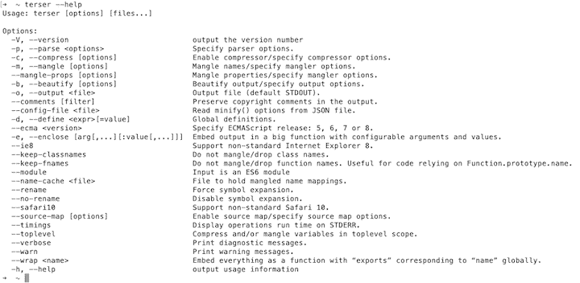
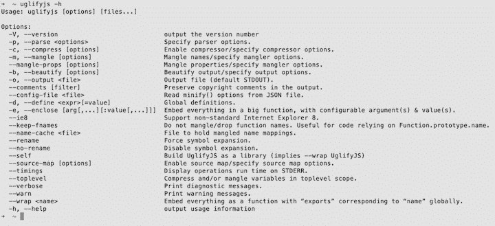
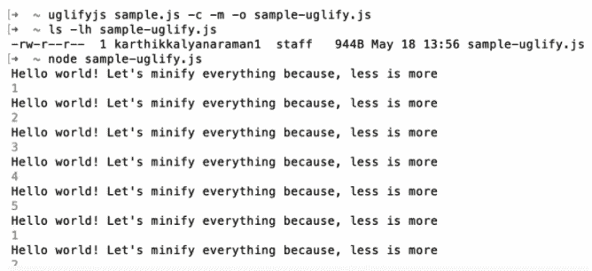
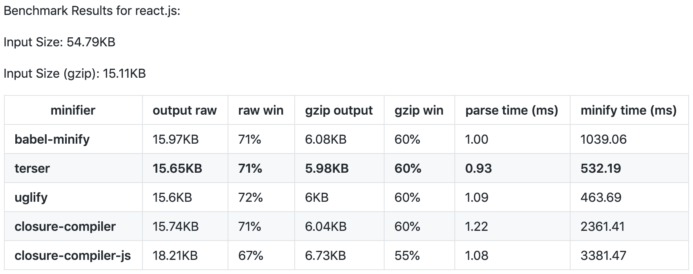
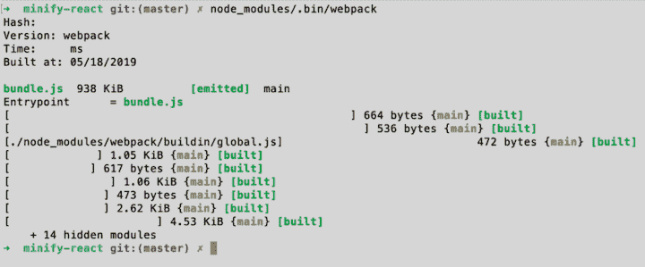
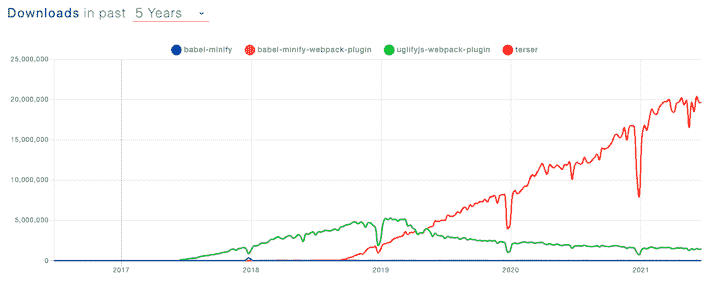
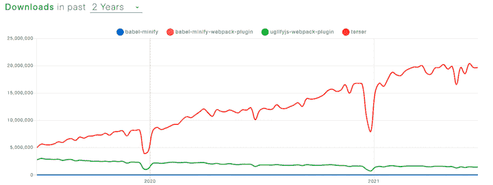

# Terser vs. Uglify vs. babel-minify:比较 JavaScript minifiers - LogRocket 博客

> 原文：<https://blog.logrocket.com/terser-vs-uglify-vs-babel-minify-comparing-javascript-minifiers/>

***编者按**:本教程最后一次更新是在 2021 年 7 月 1 日，以删除过时的信息，并突出自最初出版日期以来 Terser 的人气上升。它可能仍然包含一些过时的信息。*

在本教程中，我们将向您介绍 Terser，这是一个用于 ES6 和更高版本的 JavaScript 解析器和 mangler/compressor 工具包，并将其与类似的缩小工具 UglifyJS 和 babel-minify 进行比较。我们将解释为什么 Terser 性能更好，并演示如何使用 Terser webpack 插件，以及用于 UglyJS 和 babel-minify 的 webpack 插件。

以下是我们将要介绍的内容:

## 什么是缩小？

缩小(也称为最小化)是从解释编程语言或标记语言的源代码中删除所有不必要的字符而不改变其功能的过程。这些不必要的字符通常包括:

*   空白字符
*   换行符
*   评论
*   块分隔符

 [https://www.youtube.com/embed/kHifDVw5t_w?version=3&rel=1&showsearch=0&showinfo=1&iv_load_policy=1&fs=1&hl=en-US&autohide=2&wmode=transparent](https://www.youtube.com/embed/kHifDVw5t_w?version=3&rel=1&showsearch=0&showinfo=1&iv_load_policy=1&fs=1&hl=en-US&autohide=2&wmode=transparent)

视频

让我们看一个例子来演示缩小是如何工作的。下面的代码显示了一个 JavaScript 示例代码，用于创建一个数组并用前 20 个整数值初始化它:

```
var array = [];
for (var i = 0; i < 20; i++) {
  array[i] = i;
}

```

现在，让我们试着手动缩小这段代码。下面的例子展示了我们如何只用一行代码就能实现同样的功能:

```
for(var a=[i=0];++i<20;a[i]=i);

```

首先，我们简化了`array`变量的名称(`array`到`a`)，然后我们将它移到了`for()`循环初始化构造中。我们还将第 3 行的数组初始化移到了`for()`循环中。因此，文件的字符数和大小都大大减少了。

## 为什么缩小？

既然我们理解了什么是缩小，那么就很容易猜测我们为什么要这样做。因为缩小缩小了源代码的大小，所以它在网络上的传输变得更加有效。

这对于 web 和移动应用程序尤其有用，在这些应用程序中，前端向后端发出 [HTTP 请求](https://blog.logrocket.com/5-ways-to-make-http-requests-in-node-js/)以获取文件、用户数据等资源。对于 Instagram 或脸书等相当大的应用程序，前端通常安装在用户的设备上，而后端和数据库作为多个实例存在于内部服务器或云中。

在一个典型的用户操作中，比如加载一张照片，前端向后端发出 HTTP 请求，后端则向数据库实例发出请求以获取所请求的资源。这涉及到通过网络传输数据，这个过程的效率与传输的数据大小成正比。这正是缩小有用的地方。

在上一节中，我们演示了如何手工缩小一个琐碎的代码。但是对于庞大的代码库来说，这真的不是一个可扩展的解决方案。

开发人员已经开发了许多工具来简化 JavaScript 代码。当本指南最初出版时，最流行的 JavaScript 缩小解决方案是 [UglifyJS](https://www.npmjs.com/package/uglify-js) 、 [babel-minify](https://www.npmjs.com/package/babel-minify) (以前的 Babili)和 [Terser](https://github.com/terser/terser) 。从那时起，Terser 成为三者中最受欢迎的工具，并在 2021 年得到广泛使用。

让我们仔细看看 Terser，看看它与其他 JavaScript 化库(即 UglifyJS 和 babel-minify)相比如何提高性能。

## 戏弄者

Terser 是一个用于 ES6+的 JavaScript 解析器和分解器/压缩器工具包。在过去的几年中，它获得了广泛的欢迎，这在很大程度上归功于其卓越的性能和效率。

Terser 建议您使用 [Rollup](https://rollupjs.org/guide/en/) 来捆绑您的模块，因为它产生的代码总体上更小。Rollup 是一个类似于 [webpack](https://webpack.js.org/) 的模块捆绑器，它被创建来尽可能有效地构建 JavaScript 库的平面分发版，利用 ES2015 模块的巧妙设计。

虽然 Rollup 是一个不错的选择，但是如果您使用的是 webpack >v4，那么默认情况下会使用 Terser(在撰写本文时最新的版本是 [Terser v5.7.1](https://github.com/terser/terser/releases/tag/v5.7.1) )。)Terser 可以通过切换一个[布尔](https://webpack.js.org/configuration/optimization/)变量来启用，如下所示:

```
module.exports = {
  //...
  optimization: {
    minimize: false
  }
};
```

### 安装预告

让我们安装 Terser:

```
npm install terser -g
```

Terser 命令行具有以下语法:

```
terser [input files] [options]
```

Terser 可以接受多个输入文件。建议您首先传递输入文件，然后传递选项。Terser 将按顺序解析输入文件，并应用任何压缩选项。

这些文件在同一个全局范围内被解析——也就是说，从一个文件到另一个文件中声明的某个变量/函数的引用将被正确匹配。如果没有指定输入文件，Terser 将从 STDIN 中读取。

如果希望在输入文件之前传递选项，请用双破折号分隔两者，以防止输入文件被用作选项参数:

```
terser --compress --mangle -- input.js
```

现在让我们试着运行我们的`sample.js`代码:

```
terser -c toplevel,sequences=false --mangle -- sample.js > sample-terser.js
```

以下是该输出的内容:

```
new class{constructor(l){this.hello=l}printvar(){console.log(this.hello)}}("hello world").printvar();
```

我们可以看到，输出远远优于 UglifyJS 和 babel-minify。文件的大小是 102B，比原来的`sample.js`大小减少了将近 55%。使用`--help`选项可以找到 Terser 的其他命令行选项。



在所有选项中，我们最感兴趣的是`--compress`和`--mangle`，它们都有自己的选项集。`--compress`和`--mangle`的[选项](https://github.com/terser-js/terser#compress-options)让你控制如何处理你的源代码以生成缩小的输出。

你可能已经注意到，在我们第一个更简洁的例子中，我们已经使用了`--compress`的`toplevel`和`sequences`选项。例如，您可以将`true`传递给`--compress`的`drop_console`选项，从源代码中删除所有的`console.*`函数，如果您不想破坏类名，也可以使用`keep_classnames`选项。

有时，美化生成的输出可能很有用。你可以用 [`--beautify`](https://github.com/terser-js/terser#output-options) 选项来完成。许多构建工具使用 Terser — [在这里找到它们](https://www.npmjs.com/browse/depended/terser)。

让我们尝试在源文件上使用`drop_console`选项，看看`console.log()`函数是否被删除:

```
terser --compress drop_console=true -- sample.js > sample-drop-console.js
```

现在，让我们来看看来源的内容，`sample.js`:

```
//ES6 Syntax

class sample {
  constructor(helloworld) {
      this.hello = helloworld
  }
  printvar() {
    console.log(this.hello)
  }
}

var hello = "hello world"
var s = new sample(hello)
s.printvar()
```

而现在的输出，`sample-drop-console.js`:

```
class sample{constructor(helloworld){this.hello=helloworld}printvar(){}}var hello="hello world",s=new sample(hello);s.printvar();
```

如您所见，`console.log(this.hello)`调用已经从输出中移除。现在，让我们用`toplevel`和`sequences`选项来试试`drop_console`:

```
terser -c toplevel,sequences=false,drop_console=true --mangle -- sample.js > sample-terser-tsd.js
```

我们来看看内容:

```
new class{constructor(r){this.hello=r}printvar(){}}("hello world").printvar();
```

正如我们所看到的，代码被进一步破坏和压缩，这个新文件的大小只有 79B。与不使用`drop_console`选项时我们看到的 55%相比，这减少了 65%。这样，我们可以根据项目的需求，使用选项来平衡可读性和性能。

## 丑陋

[UglifyJS](https://github.com/mishoo/UglifyJS2) 的目标是缩小和压缩你的代码。

### 安装丑 JS

让我们继续使用以下命令安装它:

```
npm install uglify-js -g
```

现在让我们尝试在 JavaScript 模块上运行 uglify。为此，我编写了一个示例模块`sample.js`，代码如下:

```
var print = "Hello world! Let's minify everything because, less is more"

var apple = [1,2,3,4,5]

for(let element in apple) {
    console.log(print)
    console.log(element)
}

for(let element in apple) {
    console.log(print)
    console.log(element)
}

for(let element in apple) {
    console.log(print)
    console.log(element)
}

for(let element in apple) {
    console.log(print)
    console.log(element)
}

for(let element in apple) {
    console.log(print)
    console.log(element)
}

for(let element in apple) {
    console.log(print)
    console.log(element)
}

for(let element in apple) {
    console.log(print)
    console.log(element)
}

for(let element in apple) {
    console.log(print)
    console.log(element)
}

for(let element in apple) {
    console.log(print)
    console.log(element)
}

for(let element in apple) {
    console.log(print)
    console.log(element)
}

for(let element in apple) {
    console.log(print)
    console.log(element)
}

for(let element in apple) {
    console.log(print)
    console.log(element)
}

for(let element in apple) {
    console.log(print)
    console.log(element)
}

for(let element in apple) {
    console.log(print)
    console.log(element)
}

```

这段代码基本上是在一个`for()`循环中打印一个字符串和一个数组。我们多次复制`for()`循环来增加文件的大小，这样我们可以更好地看到丑陋的效果。




正如我们所看到的，UglifyJS 有很多选项，其中大部分是不言自明的。所以，让我们继续尝试其中的几个:



文件大小为 944B，通过重复打印字符串和数组值来执行。

我们在`sample.js`文件中使用了`-c`(压缩)和`-m`(变形)选项，并对其进行了美化。文件大小已经减少到 944B，大约减少了 22%。现在，让我们看看文件内容，看看它是如何随着丑化而改变的:

```
var print="Hello world! Let's minify everything because, less is more",apple=[1,2,3,4,5];for(i=0;i<5;i++)console.log(print),console.log(apple[i]);for(i=0;i<5;i++)console.log(print),console.log(apple[i]);for(i=0;i<5;i++)console.log(print),console.log(apple[i]);for(i=0;i<5;i++)console.log(print),console.log(apple[i]);for(i=0;i<5;i++)console.log(print),console.log(apple[i]);for(i=0;i<5;i++)console.log(print),console.log(apple[i]);for(i=0;i<5;i++)console.log(print),console.log(apple[i]);for(i=0;i<5;i++)console.log(print),console.log(apple[i]);for(i=0;i<5;i++)console.log(print),console.log(apple[i]);for(i=0;i<5;i++)console.log(print),console.log(apple[i]);for(i=0;i<5;i++)console.log(print),console.log(apple[i]);for(i=0;i<5;i++)console.log(print),console.log(apple[i]);for(i=0;i<5;i++)console.log    (print),console.log(apple[i]);for(i=0;i<5;i++)console.log(print),console.log(apple[i]);for(i=0;i<5;i++)console.log(print),console.log(apple[i]);
```

从上面的示例中，我们可以看到输出的内容具有相同的代码，没有任何空格和换行符。

为了进一步了解丑陋的效果，让我们用一个原型函数编写一个示例 JS 代码:

```
// comments 

function sample(helloworld) {
  this.hello = helloworld
}
sample.prototype.printvar = function()
{
  console.log(this.hello)
}

var hello = "hello world"
var s = new sample(hello)
s.printvar()
```

现在，让我们丑化这段代码:


丑化的代码是 131B。

注意，我使用了 Uglify 的`-e`(括起来)选项。该选项将所有内容嵌入到一个大函数中，带有可配置的参数和值。为了理解这意味着什么，让我们看看输出的内容:

```
!function(){function o(o){this.hello=o}o.prototype.printvar=function(){console.log(this.hello)};new o("hello world").printvar()}();
```

在经过丑化的输出中，我们可以看到函数名`sample`不见了，取而代之的是`o`。所有的代码都包含在一个大函数中，这以牺牲可读性为代价进一步减小了代码的大小。

原始文件大小为 207B，运行 Uglify 后，文件大小减少到 131B。与不使用`-e`选项时的 22%相比，减少了近 40%。

## babel-minify(以前的 Babili)

babel-minify ，原名 [Babili](https://babeljs.io/blog/2016/08/26/babili) ，是一个实验项目，试图使用 [Babel 的](https://babeljs.io/)工具链(用于编译)来做类似的事情:缩小。

***编者按**:babel-minify[最后一次更新](https://github.com/babel/minify/releases)是在 2019 年 8 月，从未达到生产准备状态。如库的[自述](https://github.com/babel/minify) :* 中所述

> 是一个实验项目，试图使用 Babel 的工具链(用于编译)来做类似的事情，缩小。目前在 0.x 中，不建议在生产中使用。

为什么要用 babel-minify 而不是 UglifyJS？以前版本的 UglifyJS 不支持最新版本的 ECMAScript。随着 UglifyJS 的发布，这个库现在支持 JavaScript 和“ECMAScript 中的大多数语言特性”然而，对于“ECMAScript 更奇特的部分”，UglifyJS 文档建议在运行 UglifyJS 缩减代码之前运行 Babel 来转换 ES6。babel-minify 将这两个步骤合并为一个步骤。

babel-minify 具有 ES2015+意识，因为它是使用 babel 工具链构建的。它被写成一套巴别塔插件，可以用[巴别塔预置缩小](https://github.com/babel/minify/tree/master/packages/babel-preset-minify)来消费。

### 安装 Babel

让我们使用以下命令在本地安装 Babel 和用于传输 ES6 的 Babel 预置:

```
npm install --save-dev @babel/core @babel/cli
npm install --save-dev babel-plugin-transform-es2015-classes
```

现在，让我们用 ES6 语法写一个`sample.js`:

```
//ES6 Syntax

class sample {
  constructor(helloworld) {
      this.hello = helloworld
  }
  printvar() {
    console.log(this.hello)
  }
}

var hello = "hello world"
var s = new sample(hello)
s.printvar()
```

让我们使用下面的命令来传输这段代码:

```
babel --plugins transform-es2015-classes sample.js > sample-transpiled.js
```

转换后的代码内容如下所示:

```
function _classCallCheck(instance, Constructor) { if (!(instance instanceof Constructor)) { throw new TypeError("Cannot call a class as a function"); } }

function _defineProperties(target, props) { for (var i = 0; i < props.length; i++) { var descriptor = props[i]; descriptor.enumerable = descriptor.enumerable || false; descriptor.configurable = true; if ("value" in descriptor) descriptor.writable = true; Object.defineProperty(target, descriptor.key, descriptor); } }

function _createClass(Constructor, protoProps, staticProps) { if (protoProps) _defineProperties(Constructor.prototype, protoProps); if (staticProps) _defineProperties(Constructor, staticProps); return Constructor; }

//ES6 Syntax
let sample = function () {
  function sample(helloworld) {
    _classCallCheck(this, sample);

    this.hello = helloworld;
  }

  _createClass(sample, [{
    key: "printvar",
    value: function printvar() {
      console.log(this.hello);
    }
  }]);

  return sample;
}();

var hello = "hello world";
var s = new sample(hello);
s.printvar();
```

正如您所看到的，ES6 类语法已经被转换成了常规的函数语法。现在，让我们运行丑化这个内容来缩小它:

```
uglifyjs sample-transpiled.js -c -m -e -o sample-transpiled-uglified.js
```

现在，该输出的内容如下所示:

```
function _classCallCheck(e,l){if(!(e instanceof l))throw new TypeError("Cannot call a class as a function")}function _defineProperties(e,l){for(var n=0;n<l.length;n++){var r=l[n];r.enumerable=r.enumerable||!1,r.configurable=!0,"value"in r&&(r.writable=!0),Object.defineProperty(e,r.key,r)}}function _createClass(e,l,n){return l&&_defineProperties(e.prototype,l),n&&_defineProperties(e,n),e}let sample=function(){function e(l){_classCallCheck(this,e),this.hello=l}return _createClass(e,[{key:"printvar",value:function(){console.log(this.hello)}}]),e}();var hello="hello world",s=new sample(hello);s.printvar();
```

如果我们比较文件大小，`sample.js`是 227B，`sample-transpiled.js`是 1KB，`sample-transpiled-uglified.js`是 609B。这显然不是一个最佳的过程，因为它会导致文件大小的增加。为了解决这个问题，引入了 babel-minify。现在，让我们安装 babel-minify 并尝试编译代码。

```
npm install babel-minify --save-dev
```

让我们使用下面的命令用 babel-minify 来缩小相同的`sample.js`代码:

```
minify sample.js > sample-babili.js
```

让我们看看这个输出的内容:

```
class sample{constructor(l){this.hello=l}printvar(){console.log(this.hello)}}var hello="hello world",s=new sample(hello);s.printvar();
```

这个文件的大小是 135B，减少了将近 40 %,这是一个更好的缩减代码的方法。它直接提高了通过网络传输的效率，并且可以在浏览器上运行，因为 Babel 可以传输代码。也有[各种插件可用](https://babeljs.io/blog/2016/08/26/babili#some-of-the-plugins-https-githubcom-babel-babili-plugins-in-babel-preset-babili)。

## 性能比较

来自 Babel 存储库的比较基准测试结果提供了这些工具的一些统计数据，可以帮助您为您的项目选择正确的缩小器:



正如我们所见，Terser 在基于 React 的项目中表现最好。你可以在 [Babel repo](https://github.com/babel/minify#benchmarks) 中找到其他 web 框架的结果。

## 使用 webpack 配置用于 React 的微型放大器

在这一节中，我们将了解为 React 应用程序配置迷你化器的过程。让我们在这个例子中使用 Terser 来缩小 React 应用程序。

为了以简化的方式实现这一点，我们使用了 [webpack](https://webpack.js.org/) 。webpack 是一个工具链，用于将所有文件打包成一个名为`bundle.js`的文件，可以高效地加载。

### 安装 webpack

让我们使用以下命令安装 webpack:

```
npm install webpack --save-dev
```

让我们也安装一些 Babel 插件来传输代码:

```
npm install babel-core babel-loader babel-preset-env babel-preset-reactbabel-preset-stage-0 --save-dev
```

### Terser webpack 外挂程式

现在，让我们安装 [Terser](https://github.com/webpack-contrib/terser-webpack-plugin) 插件:

```
npm install terser-webpack-plugin --save-dev
```

我们还需要。svg 和。css 加载器，所以让我们也安装它们:

```
npm install svg-inline-loader --save-dev
npm install css-loader --save-dev
```

### 配置 webpack 文件

在这个阶段，我们只需要配置`webpack.config.js`文件，所以让我们这样做:

```
const path = require('path');
const TerserPlugin = require('terser-webpack-plugin');

module.exports = {
  entry: "./src/index.js",
  output: {
    filename: 'bundle.js',
    path: path.resolve(__dirname, 'dist')
  },
  mode: 'development',
  module: {
    rules: [
    {
      test: /.js$/,
      exclude: /(node_modules)/,
      use: {
        loader: 'babel-loader',
        options:{
          presets: ['@babel/preset-react']
        }
      }
    },
    {
      test: /.svg$/,
      loader: 'svg-inline-loader'
    },
    {
      test: /.css$/,
      use: ['style-loader', 'css-loader'],
    }]
  },
  optimization: {
    minimizer: [new TerserPlugin()],
  },
}
```

从上面的代码我们可以看到，webpack 的入口点是`src/`里面的`index.js`，最终的输出会作为`bundle.js`存储在`dist/`目录里面。**优化**字段将`TerserPlugin`拉入缩小过程。现在，让我们运行 webpack 来为生产静态构建我们的应用程序。



我们可以看到，webpack 运行了所有文件的加载程序和插件，构建了一个 938KB 大小的`bundle.js`，而我们的整个应用程序要比这个大得多。这就是 webpack 以及相关加载器和插件的真正威力。

最近推出了一些新的捆扎机。其中，[卷装](https://rollupjs.org/guide/en/)和[包裹](https://parceljs.org/)越来越受欢迎。任何捆绑工具的基本配置和设置都与 webpack 相似。你可以在这里找到 webpack、Rollup 和 package[的性能对比。](https://x-team.com/blog/rollup-webpack-parcel-comparison/)

## 结论

最后，让我们看看下面这张来自 [npm trends](https://www.npmtrends.com/babel-minify-vs-babel-minify-webpack-plugin-vs-uglifyjs-webpack-plugin-vs-terser) 的图表，它显示了过去五年中 Terser、UglifyJS 和 babel-minify 的每周下载量:



正如你所看到的，Terser 在 2019 年年中左右赶上了 UglifyJS，此后再也没有回头。这可以直接归因于它比其他缩小工具更好的性能。

放大一点，两年的视图显示 Terser 的受欢迎程度继续上升并向右移动:



感谢你阅读这篇文章。我希望你喜欢学习缩小，并澄清了一些长期以来对这个概念的疑虑。

## 使用 LogRocket 消除传统反应错误报告的噪音

[LogRocket](https://lp.logrocket.com/blg/react-signup-issue-free)

是一款 React analytics 解决方案，可保护您免受数百个误报错误警报的影响，只针对少数真正重要的项目。LogRocket 告诉您 React 应用程序中实际影响用户的最具影响力的 bug 和 UX 问题。

[ ](https://lp.logrocket.com/blg/react-signup-general) [  ](https://lp.logrocket.com/blg/react-signup-general) [LogRocket](https://lp.logrocket.com/blg/react-signup-issue-free)

自动聚合客户端错误、反应错误边界、还原状态、缓慢的组件加载时间、JS 异常、前端性能指标和用户交互。然后，LogRocket 使用机器学习来通知您影响大多数用户的最具影响力的问题，并提供您修复它所需的上下文。

关注重要的 React bug—[今天就试试 LogRocket】。](https://lp.logrocket.com/blg/react-signup-issue-free)