# 使用 Charles Web Proxy 像专家一样测试和调试 Android 应用程序

> 原文：<https://blog.logrocket.com/test-debug-android-apps-with-charles-web-proxy/>

## 介绍

测试和调试是任何好的应用程序开发生命周期的一部分。虽然有很多工具和库可以用来构建 Android 应用程序，但是当您考虑它所执行的功能时，Charles Web debugging proxy 是一个非常不错的选择。

使用这个工具，您可以减少花费在调试和解决问题上的时间。在我自己进行了几次尝试之后，我对我所能完成的事情以及我调试和解决问题的简单快捷印象深刻。

在本文中，您将了解 Charles Web Proxy 以及如何设置它。我们将讨论以下内容:

## 什么是查尔斯网络代理？

据[查尔斯网代理网站](https://www.charlesproxy.com/)显示，查尔斯是

> 一个 HTTP 代理/HTTP 监控/反向代理，使开发人员能够查看他们的机器和互联网之间的所有 HTTP 和 SSL/HTTPS 流量。这包括请求、响应和 HTTP 头，其中包含 cookies 和缓存信息。

简而言之，Charles Web 调试代理是一个软件应用程序，它监视个人计算机上的网络活动，如网络请求和服务器响应。它会实时拦截和更改数据包。

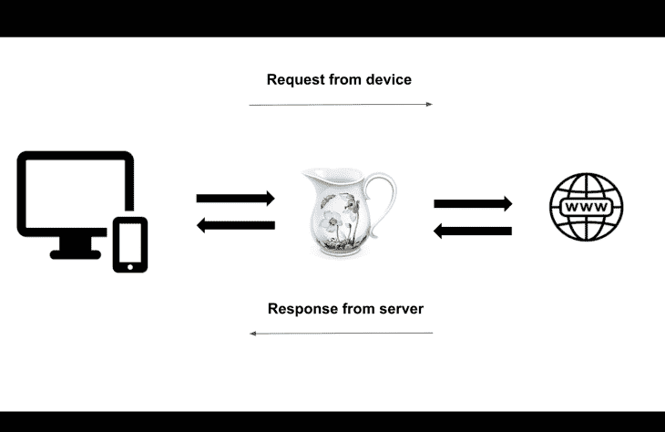

## 使用 Charles Web 代理时要考虑的用例

测试和调试可能会非常令人沮丧和疲惫。查尔斯的存在就是为了减少这种由工作引起的压力；有了 Charles，您可以快速诊断问题并实现快速修复。我将列出几个我觉得 Charles 很方便的用例。

### 1.用状态测试功能实现

一个典型的场景是，您依赖来自后端的值来确定客户端的某些行为。通常，您可以请求后端工程师进行更改，这是可行的。然而，这并不是一个流畅的过程——通常，你会在关于需要改变的讨论中结束，这降低了生产力。

有了 Charles，在响应被传送到客户端之前，您可以编辑网络响应到您选择的任何数据结构，以满足测试需求，并更有效地测试应用程序对不同状态的响应。

### 2.API 端点未部署到临时服务器

假设您正在开发一个需要向后端服务器发出请求的特性。您可能会因为后端工程师尚未将 API 端点部署到登台环境中而受阻。在这种情况下，你能做的最好的事情就是在等待后端满足你的需求的同时，起草一份 PR。这种方法效率不高，降低了生产率。

使用 Charles，您可以模拟业务需求中陈述的网络响应，以测试所做的工作。此外，你可以放心地准备一份公关审查。

### 3.调试和测试错误

构建移动应用程序时，不能忽略网络错误。它们是由网络请求引起的(即内部服务器错误)。测试您的客户端逻辑如何响应不同的网络错误响应可以加速开发。

您可以使用 Charles Web Proxy 方便地模拟这些响应。

概括地说，从上面的用例中，我们可以通过 Charles 实现以下目标:

*   拦截和编辑网络请求和响应
*   模拟 HTTP 失败响应，如`Internal Server Error - 500, Bad Request (400)`
*   从 JSON 文件加载 HTTP 响应

## 如何用 Android 设置 Charles Web 代理

我将概述在您的 PC 和 Android 设备上设置 Charles 的一些步骤。

### 在你的电脑上安装查尔斯

从[官网](https://www.charlesproxy.com/download/)下载最新版的查尔斯。如下图所示，您应该选择符合您电脑规格的文件。


Download the latest version of Charles Web Proxy

安装后，您将看到一个如下所示的窗口:

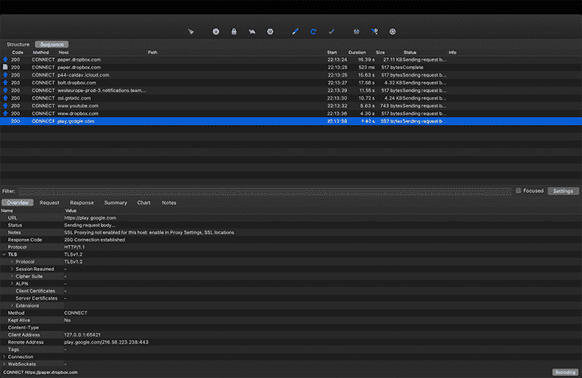

### 在 Charles 上启用 SSL 代理

SSL 代理拦截所有 SSL 请求，并以这样一种方式代理它们，即您可以以纯文本方式查看 SSL 请求和响应的内容，而不仅仅是查看加密文本。

为所有 HTTPS 连接设置代理，如下所示:

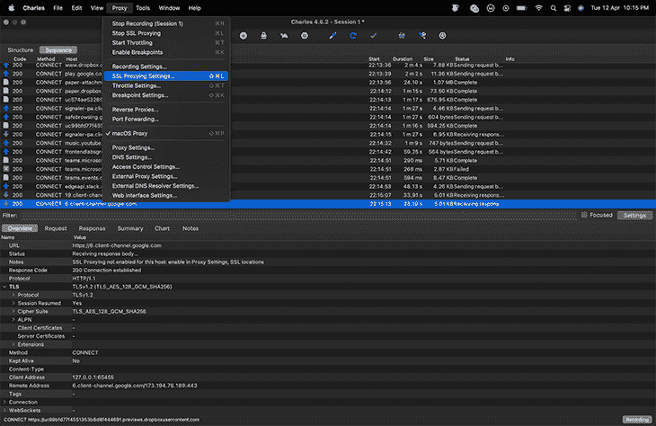

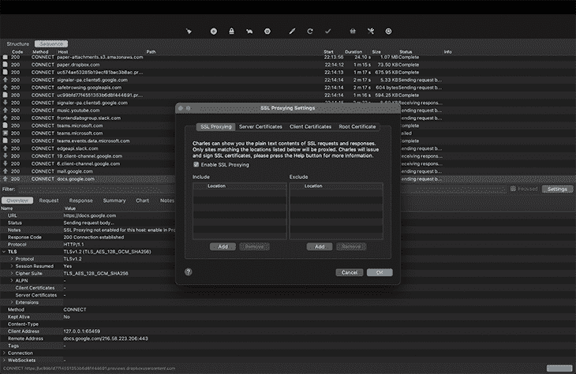

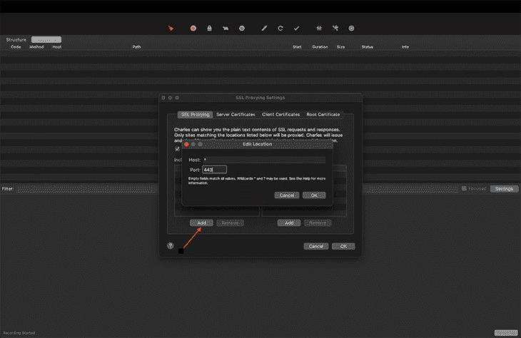

我们将主机定义为`*`，它告诉 Charles 拦截每个网络流量事件。端口设置为 443，表示主机是安全的— HTTPS 是 HTTP 的安全加密版本，所有 HTTPS web 流量都流向端口 443。

### 配置 Android 设备以使用 Charles 作为其 HTTP 代理

Android 允许对每个无线网络进行代理配置。我们将使用从 Charles 帮助窗口中检索的 HTTP 代理设置将 PC 和 Android 设备连接到同一个网络。

从 Charles 帮助窗口中检索 HTTP 配置，如下:
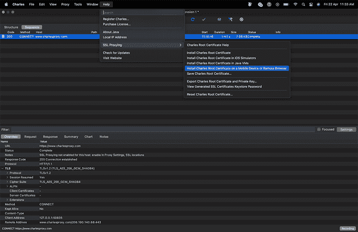

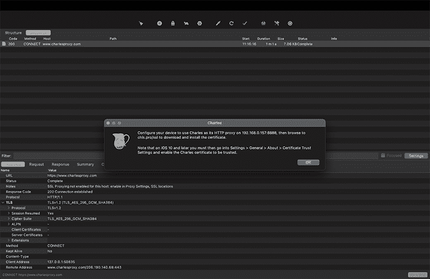

现在，在 Android 上设置代理设置。

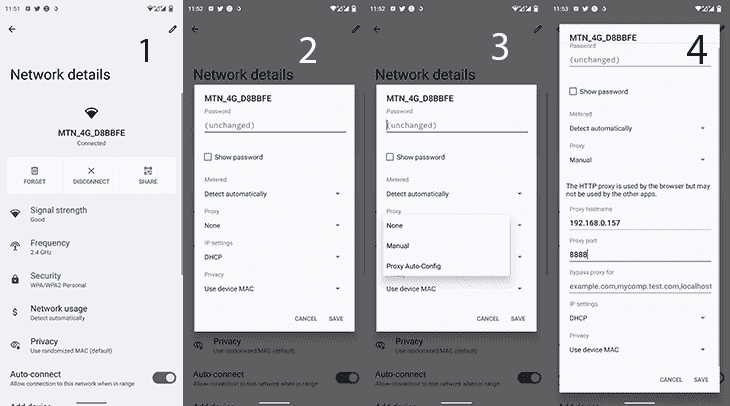

Step 1: Click the edit icon on the top right
Step 2: Under **Proxy label**, click the dropdown icon to reveal more options
Step 3: Select **Manual**
Step 4: Enter the HTTP config retrieved from the Charles help window

Charles 将提示您接受来自移动设备的连接。点击**允许**。


前往`[http://chls.pro/ssl](http://chls.pro/ssl)`下载您的查尔斯证书，该证书将安装在您的 Android 设备上。

导航至**设备设置**，并按照下面的屏幕截图获取安装指南。

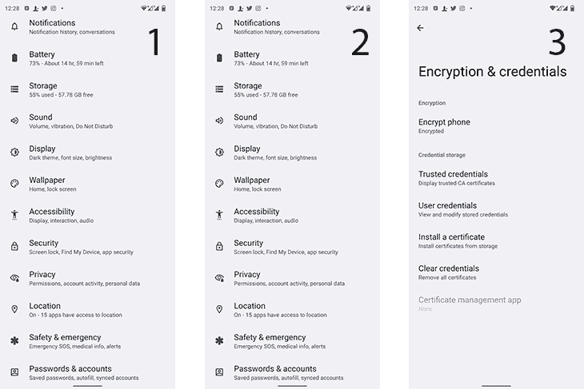

Step 1: Click **Security**
Step 2: Click **Encryption and Credentials**
Step 3: Click **Install a certificate**

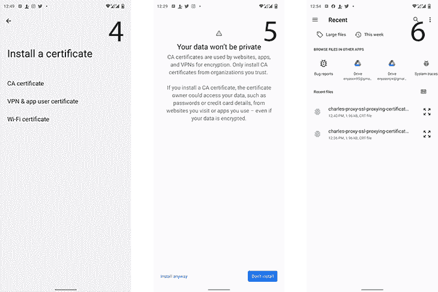

Step 4: Select **CA certificate**
Step 5: Click **Install anyway**
Step 6: Select the Charles cert dowloaded in previous steps

完成这些步骤后，Charles 应该开始拦截来自您的移动应用程序的网络流量。

## 使用 Charles Web 代理调试 Android 项目

我们在上面配置的代理将被 web 浏览器使用，但可能不会被其他应用程序使用。您需要向您的应用程序添加配置，以便让它信任由 Charles SSL 代理生成的 SSL 证书。

为了配置您的应用程序以信任 Charles，您需要向您的应用程序添加一个[网络安全配置文件](https://developer.android.com/training/articles/security-config.html)。该文件可以覆盖系统默认值，使您的应用程序能够信任用户安装的 CA 证书(例如，Charles 根证书)。您可以指定这只应用于应用程序的调试版本，以便生产版本使用默认的信任配置文件。你可以在 Charles 的网站的 [SSL 证书部分了解更多信息。](https://www.charlesproxy.com/documentation/using-charles/ssl-certificates/)

将一个`network_security_config.xml`文件添加到应用程序的`res/xml/`文件夹中:

```
<network-security-config> 
  <debug-overrides> 
    <trust-anchors> 
      <!-- Trust user added CAs while debuggable only -->
      <certificates src="user" /> 
    </trust-anchors> 
  </debug-overrides> 
</network-security-config>

```

在应用程序的`Manifest.xml`文件中指定网络配置设置。

```
<?xml version="1.0" encoding="utf-8"?>
<manifest ... >
    <application android:networkSecurityConfig="@xml/network_security_config" ... >
        ...
    </application>
</manifest>

```

我们已经准备好开始使用 Charles 来代理来自我们移动应用程序的流量。

出于本文的目的，接下来我将使用一个电影浏览器 Android 项目来演示我们之前强调的用例。从 [my GitHub repo](https://github.com/enyason/Emovie) 中克隆项目。

## 当服务器引发内部服务器错误时测试应用程序行为

在编写软件时，您希望采用[防御编程](https://en.wikipedia.org/wiki/Defensive_programming)方法，以避免在生产中出现意外的结果，比如确保您的应用程序能够像处理 500 内部服务器错误一样优雅地处理网络错误。

出于以下原因，让您的后端工程师在端点上强制执行 500 服务器错误并不是运行此测试的好方法:

1.  使用此端点的其他设备可能会被阻止，因为该端点出现故障
2.  开发人员可能会忘记恢复更改，这甚至会在生产级别引起问题
3.  它降低了生产率

记住这些，我们将依靠 Charles 和 [httpstat](https://httpstat.us/) 为我们的移动应用模拟一个 500 内部服务器错误。

### 模仿错误响应

在我们继续模拟错误响应之前，请确保您可以拦截并解密来自 [TMDB API](https://www.themoviedb.org/documentation/api) 的响应。如果设置正确，您应该会看到类似下面的截图:

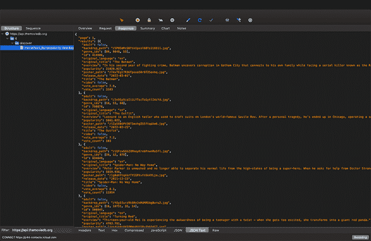

然后，我们可以将 API 响应映射到 Remote，如下所示:


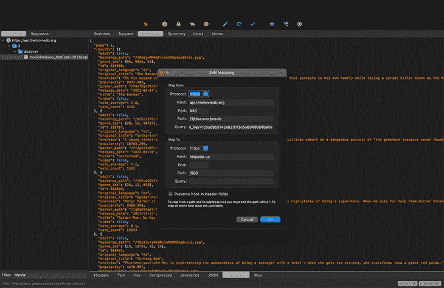

保存此设置，并从您的应用程序再次触发 API 调用。您应该看到视图结构中列出的`[https://httpstat.us/](https://httpstat.us/)`,如下所示:

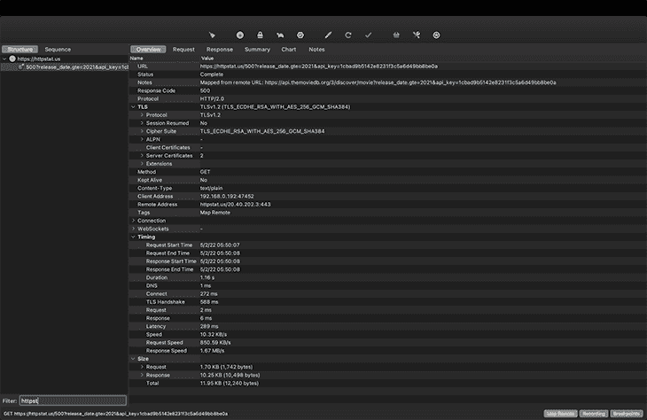

基本上，我们已经指示 Charles 拦截对 [`https://api.themoviedb.org`](https://api.themoviedb.org/3/discover/movie?release_date.gte=2021&api_key=1cbad9b5142e8231f3c5a6d49bb8be0a) 的任何请求，并将来自`[https://httpstat.us/500](https://httpstat.us/500)`的响应传递到移动设备，而不是来自`[https://api.themoviedb.org/3/discover/movierelease_date.gte=2021&api_key=1cbad9b5142e8231f3c5a6d49bb8be0a](https://api.themoviedb.org/3/discover/movierelease_date.gte=2021&api_key=1cbad9b5142e8231f3c5a6d49bb8be0a)`的原始响应。

在下面的截图中，我显示了一条提示消息，通知用户服务器出错。


Displaying the HTTP 500 server error in a toast message at the bottom of the screen

瞧啊！我们已经成功地模拟了一个内部服务器错误，而不需要关闭 TMDB 服务器。😀

## 使用模拟 web 响应测试客户端应用程序逻辑

除了**地图遥控**，还有一个对应的功能，**地图本地**。它们具有相似的功能，但是它们之间的区别在于提供响应的位置。前者从在线服务器返回响应，而后者通过 JSON 文件从本地机器提供响应。

当端点未准备好使用时，此功能对于测试客户端应用程序功能非常方便。
使用 Map Remote 时概述的以下步骤适用于使用 Map Local。

不要选择 **Map Remote** ，而是选择 **Map Local** 并使用本地机器上的 JSON 文件。参见以下截图，以供参考:

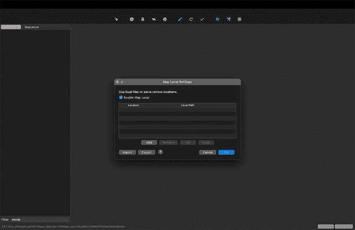

Under **Map Local Settings**, click **Add**

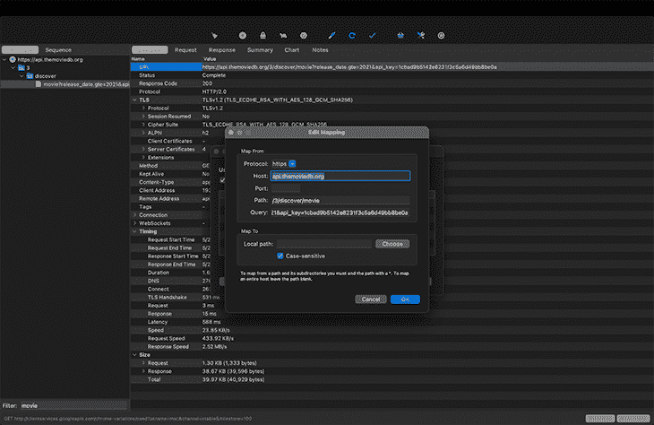

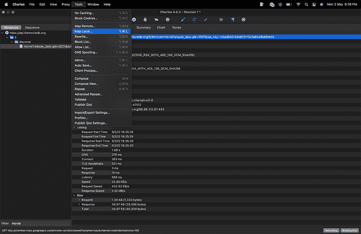

Select **Map Local**

### 使用断点

断点！是啊，没错。您可以真正地实时暂停网络请求和响应，并对它们进行编辑。然后，您的客户端应用程序将接收来自 Charles 的经过编辑的响应——与您在 Android Studio 中放置断点的方式相同，但这更加复杂，因为您可以操纵数据。

请参见下面的屏幕截图，了解如何在网络请求上设置断点:

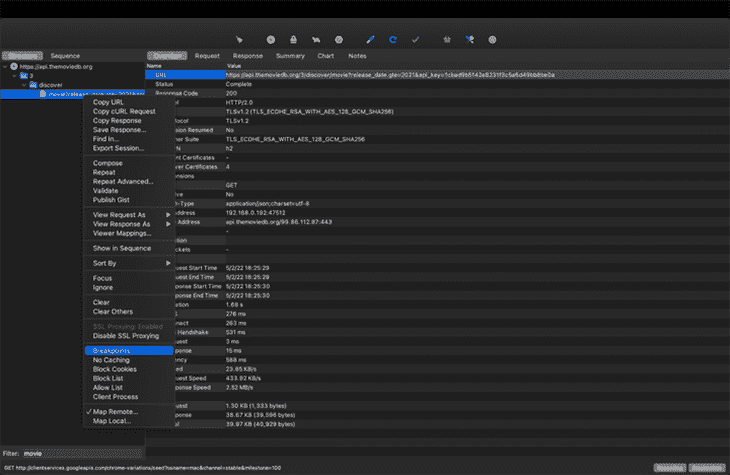

Click a request and select **Breakpoints**


Edit the request and click **Execute**

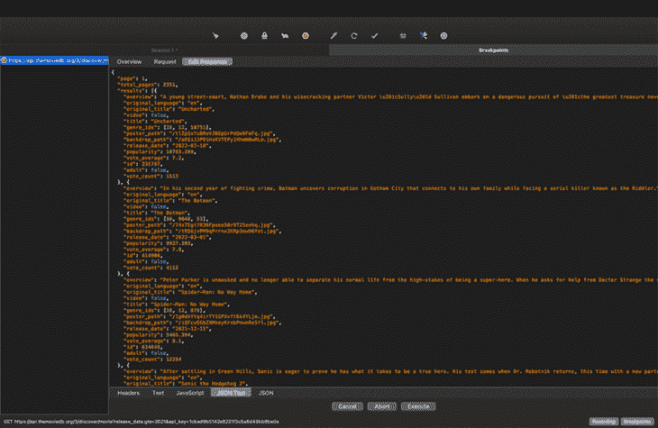

Edit the response and click **Request**

对 Charles 使用断点将按照图像出现的顺序进行。

## 结论

查尔斯网络代理是一个非常方便的软件开发工具。特别是在 Android 上，我们可以操纵响应数据来表示不同的`ViewStates`，从而加快开发和测试。

如果你坚持到底，干得好！让我在评论区听到你对这个工具的想法。谢谢大家！

## 使用 [LogRocket](https://lp.logrocket.com/blg/signup) 消除传统错误报告的干扰

[](https://lp.logrocket.com/blg/signup)

[LogRocket](https://lp.logrocket.com/blg/signup) 是一个数字体验分析解决方案，它可以保护您免受数百个假阳性错误警报的影响，只针对几个真正重要的项目。LogRocket 会告诉您应用程序中实际影响用户的最具影响力的 bug 和 UX 问题。

然后，使用具有深层技术遥测的会话重放来确切地查看用户看到了什么以及是什么导致了问题，就像你在他们身后看一样。

LogRocket 自动聚合客户端错误、JS 异常、前端性能指标和用户交互。然后 LogRocket 使用机器学习来告诉你哪些问题正在影响大多数用户，并提供你需要修复它的上下文。

关注重要的 bug—[今天就试试 LogRocket】。](https://lp.logrocket.com/blg/signup-issue-free)

## LogRocket :即时重现你的安卓应用中的问题。

[](https://lp.logrocket.com/blg/kotlin-signup)

[LogRocket](https://lp.logrocket.com/blg/kotlin-signup) 是一款 Android 监控解决方案，可以帮助您即时重现问题，确定 bug 的优先级，并了解您的 Android 应用程序的性能。

LogRocket 还可以向你展示用户是如何与你的应用程序互动的，从而帮助你提高转化率和产品使用率。LogRocket 的产品分析功能揭示了用户不完成特定流程或不采用新功能的原因。

开始主动监控您的 Android 应用程序— [免费试用 LogRocket】。](hhttps://lp.logrocket.com/blg/kotlin-signup)