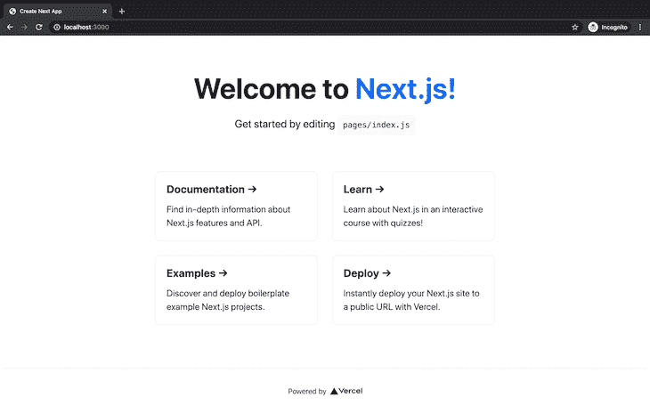
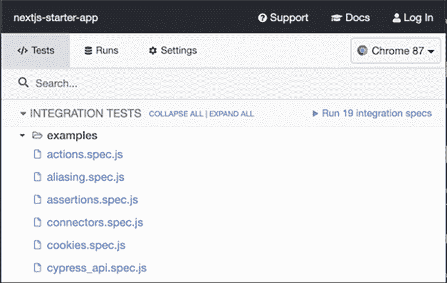

# Next.js - LogRocket 博客中的测试和错误处理模式

> 原文：<https://blog.logrocket.com/testing-error-handling-patterns-next-js/>

***编者按*** *:这篇文章更新于 2022 年 3 月 9 日，以确保所有测试和错误处理模式都是最新的，并扩展了错误处理选项部分以包括更多示例。*

## 介绍

随着时间的推移，越来越多的开发人员开始使用基于领先 JavaScript 库的框架，比如 React 和 Vue。其中之一是 Next.js，这是一个框架，通过为应用程序提供更大的伸缩灵活性，使得使用 React 更加容易。

在准备使用新框架时，测试和错误处理是两个真正值得探索的概念，Next.js 也不例外。这是因为它们都可以确保开发人员编写出好的代码，最终将反映在整体软件质量中——测试使开发人员编写出高效的代码，从而节省了他们的调试时间。

另一方面，错误处理使我们的应用程序更加用户友好。这是因为开发人员可以通过将用户重定向到适当的自定义错误页面来确保用户遇到的任何错误都能得到妥善处理，这极大地增强了用户体验。Next.js 更进了一步，提供了用于正确错误处理的 API。

在本文中，我们将了解更多关于 Next.js 中的测试和错误处理。我们还将研究 Next.js 中的测试和错误处理与其他 JavaScript 库和框架相比的相似之处和不同之处。

本文旨在通过以下部分揭示在 Next.js 应用程序中运行测试和处理错误的不同方法:

### 先决条件

本文涵盖了高级的 Next.js 主题——测试和错误处理——因此，您需要了解一些 Next.js 概念的基础知识。

下面是从本文中获得最佳效果的先决条件:

*   JavaScript 的基础知识
*   React 和 Next.js 的基础知识
*   测试 JavaScript 库和框架的基本知识

## Next.js 应用程序中的测试和错误处理入门

测试库如 [Jest](https://jestjs.io/) 和 [Cypress](https://www.cypress.io/) 可以用来对 JavaScript 及其框架或库进行单元测试，包括 Next.js

JavaScript 还提供了一些错误处理 API:[throw 语句](https://developer.mozilla.org/en-US/docs/Web/JavaScript/Guide/Control_flow_and_error_handling#throw_statement)和 [try…catch 语句。](https://developer.mozilla.org/en-US/docs/Web/JavaScript/Guide/Control_flow_and_error_handling#try...catch_statement)这些可以在 JavaScript 框架或库的 API 中使用，以处理错误，例如使用 Next.js APIs、`getStaticProps`、`getServerSideProps`，以及在 Next.js 中间件中使用`try…catch`语句。如下图所示:

```
export const getStaticProps = async () => {
  try {
    const { data, errors } = await fetchSomeData(`https://...`); // call to get data
    if (errors || !data) {
      return { notFound: true };
    }
    return { props: { data } };
  } catch () {
    return { notFound: true };
  }
};

```

`getStaticProps`函数应该返回一个包含`props`、`redirect`或`notFound`的对象。将 catch 块中的`notFound`属性设置为`true`，我们触发 Next.js 的内部错误处理系统返回一个`404`页面。我们将在本文的后续部分详细阐述这些内容。

让我们在下一节更深入地测试 Next.js 应用程序。

## Next.js 应用程序的测试选项

[Next.js 文档](https://nextjs.org/docs/testing) [推荐](https://nextjs.org/docs/testing)三个测试库:

这个列表并不奇怪；因为 Next.js 是一个 React 框架，所以测试库是相同的。

然而，在本文中，我们将学习使用 Cypress 测试 Next.js 应用程序。让我们开始下一小节。

## 用 Cypress 测试 Next.js 元素

在 Next.js 应用程序上运行测试的一种方式是通过 [Cypress](https://blog.logrocket.com/cypress-io-the-selenium-killer/#what-is-cypress) ，这是一个端到端的基于 JavaScript 的测试框架。首先，需要用 Next.js 创建一个基本的应用程序，然后安装 Cypress 并运行测试。首先导航到您的终端并创建您的应用程序:

```
npx create-next-app nextjs-starter-app

# then navigate to the application and begin the development server

cd nextjs-starter-app
even if there was a successfully generated page before.
# then start a development server on http://localhost:3000

npm run dev

```

接下来，打开`[http://localhost:3000](http://localhost:3000)`上的 app。这将启动一个通用的欢迎页面:



现在，安装 Cypress 来演示如何运行基本测试。导航回终端，运行一个命令在应用程序中设置 Cypress:

```
npm install cypress --save-dev

```

一旦完成，您需要包含一个从终端启动 Cypress 的方法。为此，在应用程序的`package.json`文件的`scripts`对象中创建一个`test`键，并将`cypress open`指定为一个属性:

```
// package.json

  "scripts": {
    "test": "cypress open"
  }

```

在终端中输入以下命令来启动 Cypress:

```
npm run test

```

这将打开 Cypress 的测试套件，您可以在其中查看和运行项目测试。您会注意到已经有一些示例测试来演示 Cypress 是如何工作的。您可以通过运行下面的示例集成规范了解更多信息:



### 如何用 Cypress 构建并运行您的第一个测试

要构建并运行您的第一个测试，导航到您的应用程序中新创建的`Cypress`文件夹。

为您的测试编写脚本，并将它们保存在`integrations`文件夹中。建议您首先删除文件夹中的样本测试。创建一个文件，命名为`deploy.spec.js`。

```
# integration/examples/deploy.spec.js

context('Deploy', () => {
    beforeEach(() => {
      cy.visit('http://localhost:3000');
    });

    it('should click on the Deploy section in the homepage', () => {
      cy.get('h3')
        .contains('Deploy')
        .click()
    });
  });

```

在上面的代码示例中，测试应该执行以下功能:

*   每次考试前访问主页
*   浏览主页，选择任何带有文本“部署”的标题
*   单击此标题并打开附加到它的链接

第三个函数将您的测试暴露给`CORS`错误。为了防止这种情况，请在`cypress.json`文件中禁用 web 安全:

```
{
    "chromeWebSecurity": false
}

#  Do note that this isn't advisable as a practice in production

```

在执行测试之前，您需要自动启动您的开发服务器。为此，导航到终端并安装一个名为 [start-server-and-test](https://www.npmjs.com/package/start-server-and-test) 的工具。

```
npm install start-server-and-test --save-dev

```

接下来，在您的`package.json`文件中，您将在`scripts`对象中设置指令。这将使您能够首先启动您的开发服务器，然后打开 Cypress:

```
"scripts": {
    "test": "cypress open",
    "server": "start-server-and-test dev 3000 test"
  }

```

现在你都准备好了！导航到您的终端，使用命令`npm run server`启动您的服务器并进行测试。您的测试应该像这样启动:

[https://www.youtube.com/embed/m26U48mqMuM](https://www.youtube.com/embed/m26U48mqMuM)

视频

## 在 Next.js 中测试 API 路由

当处理较大的应用程序时，您可能会发现需要测试路由和端点。你也可以用柏树来达到这个目的。在您的应用程序中，导航到`pages`文件夹并创建一个名为`api`的新文件夹。

在这个文件夹中，创建一个名为`books.js`的文件，它将存储 API 所需的数据和函数:

```
// pages/api/books.js

export default function books(req, res) {
  res.statusCode = 200;
  res.setHeader("Content-Type", "application/json");
  return res.json([
    {
      id: 1,
      book: "The Firm",
      author: "John Grisham",
    },
    {
      id: 2,
      book: "Cracking the PM interview",
      author: "Jackie Bavaro",
    },
    {
      id: 3,
      book: "Fools Die",
      author: "Mario Puzo",
    },
  ]);
}

```

接下来，创建一个测试脚本。导航到`cypress`中的`integrations/examples`文件夹，在这里您将为您的 API 路由定义测试:

```
// integration/examples/books.spec.js

describe("Book test", () => {
  it("Confirms the number of books in your local library", () => {
    cy.visit("http://localhost:3000");
    cy.request("GET", "api/books").as("books");
    cy.get("@books").should((response) => {
      expect(response.status).to.eq(200);
      expect(response).to.have.property("headers");
      expect(response).to.have.property("duration");
      expect(response.body).to.have.length(3);
    });
  });
});

```

基本上，测试期望从`books`端点的响应中得到以下内容:

*   响应状态等于`200`
*   API 响应包括一个标头
*   API 响应体包含三个对象
*   包括响应时间

现在，看一看。像以前一样启动服务器并进行测试；你应该会有这个结果:

[https://www.youtube.com/embed/hB61q-0yCOI](https://www.youtube.com/embed/hB61q-0yCOI)

视频

在下一节中，我们将详细研究 Next.js 错误处理。

## Next.js 中的错误类型

Next.js 有三种错误；我们将在下面逐一介绍。

### 开发中的错误

这些是在 Next.js 应用程序开发过程中抛出的运行时错误。它们以覆盖网页的错误叠加或模式出现，如下所示:


Source: [Vercel](https://assets.vercel.com/image/upload/v1645118290/docs-assets/static/docs/error-handling/overlay.png%22)

此错误在生产环境中不可见，只有在开发服务器运行时才会引发。错误覆盖图经常给我们提供有用的提示来修复错误，一旦开发错误得到处理，覆盖图就会消失。

### 客户端错误

作为一个建立在 React 库之上的框架，Next.js 可以访问 React APIs，这意味着 Next.js 中的客户端错误可以使用 [React Error Boundary API](https://reactjs.org/docs/error-boundaries.html) 妥善处理。

在 Next.js 中，`ErrorBoundary`组件跟踪一个`hasError`布尔状态，该状态告诉`ErrorBoundary`在出现错误的情况下，要么呈现子组件，要么返回一个 UI。

要在 Next.js 中使用`ErrorBoundary`组件，创建一个 React 类组件，如下所示:

```
class ErrorBoundary extends React.Component {
  constructor(props) {
    super(props)

    // Define a state variable to track whether is an error or not
    this.state = { hasError: false }
  }
  static getDerivedStateFromError(error) {
    // Update state so the next render will show the fallback UI

    return { hasError: true }
  }
  componentDidCatch(error, errorInfo) {
    // You can use your own error logging service here
    console.log({ error, errorInfo })
  }
  render() {
    // Check if the error is thrown
    if (this.state.hasError) {
      // You can render any custom fallback UI
      return (
        <div>
          <h2>Oops, there is an error!</h2>
          <button
            type="button"
            onClick={() => this.setState({ hasError: false })}
          >
            Try again?
          </button>
        </div>
      )
    }

    // Return children components in case of no error

    return this.props.children
  }
}

export default ErrorBoundary

```

现在，将这个组件导入到`pages/_app.js`文件中，并包装`Component`道具，如下所示:

```
// Import the ErrorBoundary component
import ErrorBoundary from '../components/ErrorBoundary'

function MyApp({ Component, pageProps }) {
  return (
    // Wrap the Component prop with ErrorBoundary component
    <ErrorBoundary FallbackComponent={ErrorFallback}>
      <Component {...pageProps} />
    </ErrorBoundary>
  )
}

export default MyApp

```

### 服务器错误

这些是在 Next.js [中出现的错误](https://nextjs.org/docs/basic-features/data-fetching/overview)比如[`getStaticProps`](https://nextjs.org/docs/api-reference/data-fetching/get-static-props)[`getServerSideProps`](https://nextjs.org/docs/api-reference/data-fetching/get-server-side-props)[`getStaticPaths`](https://nextjs.org/docs/api-reference/data-fetching/get-static-paths)，以及在 Next.js [中间件](https://nextjs.org/docs/middleware)中。当这些 API 中的任何一个出现错误时，我们可以通过呈现 Next.js 自定义错误页面来处理`try…catch`块中的错误，如我们前面的示例所示。

默认情况下，Next.js 提供了一个静态的`500`页面来处理这些错误，我们可以通过创建[自定义错误页面](https://nextjs.org/docs/advanced-features/custom-error-page)来对其进行自定义，比如自定义的`404`或`500`页面。

如果我们探索 Next.js [数据提取库返回值](https://nextjs.org/docs/api-reference/data-fetching/get-server-side-props#getserversideprops-return-values)，我们可以更智能地处理我们的错误，如下所示:

```
export async function getServerSideProps(context) {
  const result = await fetchData(`https://...`) // fetch remote data
  const errorCode = result.ok ? false : result.statusCode
  const data = await result.json()

  if (!data) {
    return {
      redirect: {
        destination: '/',
        permanent: false,
      },
    }
  }

  return {
    props: {errorCode, data }, // will be passed to the page component as props
  }
}

```

上述错误处理模式可用于其他 Next.js 数据获取方法。在上面的代码中，如果没有找到资源，我们使用 [`redirect`属性](https://nextjs.org/docs/api-reference/data-fetching/get-server-side-props#redirect)重定向到一个定制的目的地。

在本例中，我们还返回了一个 error 对象，它可以在我们的 Next.js `Error`组件中使用，根据错误状态代码呈现一个定制视图。

这是 Next.js 中的一个[高级错误处理模式，我们将在下一节中了解更多。](https://nextjs.org/docs/advanced-features/custom-error-page#more-advanced-error-page-customizing)

## 在 Next.js 中呈现自定义错误页面

Nextjs 提供了一个内置的`Error`组件来处理服务器端和客户端的`500`错误。要定制这个组件，用下面的代码创建一个`pages/_error.js`文件:

```
function Error({ statusCode }) {
  return (
    <p>
      {statusCode
        ? `An error ${statusCode} occurred on server`
        : 'An error occurred on client'}
    </p>
  )
}

Error.getInitialProps = ({ res, err }) => {
  const statusCode = res ? res.statusCode : err ? err.statusCode : 404
  return { statusCode }
}

export default Error

```

现在，为了在应用程序的任何部分重用`Error`组件，我们导入它并使用`getServerSideProps`方法来预先呈现每个请求的错误:

```
import Error from 'next/error'

export async function getServerSideProps() {
  const result = await fetchSomeData('https://...')
  const errorCode = result.ok ? false : result.statusCode
  const data = await result.json()

  return {
    props: { errorCode, data },
  }
}

export default function Page({ errorCode, data }) {
  if (errorCode) {
    return <Error statusCode={errorCode} />
  }

  return (
      <div>...</div> // jsx code
    )
}

```

## 摘要

Next.js 提供了一种令人敬畏的体验，旨在让开发人员在使用该框架时有很多选择。使用 Cypress 为您提供了一些方法和功能，让您可以根据需要自由地定义和修改您的测试。Next.js 中的错误可以根据需要进行定制，并导入到多个组件中。

## [LogRocket](https://lp.logrocket.com/blg/nextjs-signup) :全面了解生产 Next.js 应用

调试下一个应用程序可能会很困难，尤其是当用户遇到难以重现的问题时。如果您对监视和跟踪状态、自动显示 JavaScript 错误、跟踪缓慢的网络请求和组件加载时间感兴趣，

[try LogRocket](https://lp.logrocket.com/blg/nextjs-signup)

.

[](https://lp.logrocket.com/blg/nextjs-signup)[](https://lp.logrocket.com/blg/nextjs-signup)

LogRocket 就像是网络和移动应用的 DVR，记录下你的 Next.js 应用上发生的一切。您可以汇总并报告问题发生时应用程序的状态，而不是猜测问题发生的原因。LogRocket 还可以监控应用程序的性能，报告客户端 CPU 负载、客户端内存使用等指标。

LogRocket Redux 中间件包为您的用户会话增加了一层额外的可见性。LogRocket 记录 Redux 存储中的所有操作和状态。

让您调试 Next.js 应用的方式现代化— [开始免费监控](https://lp.logrocket.com/blg/nextjs-signup)。