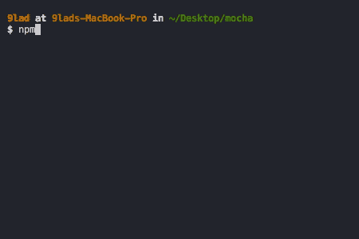
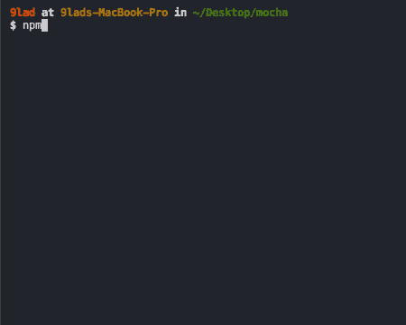
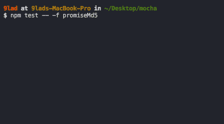
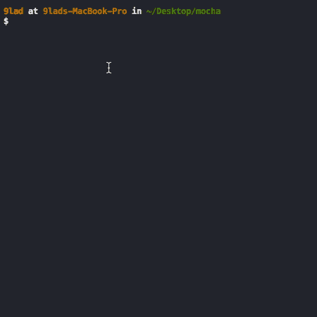
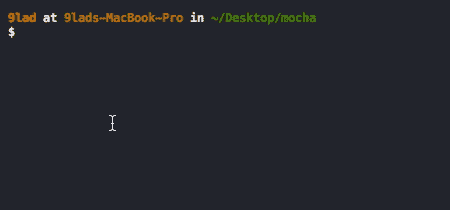
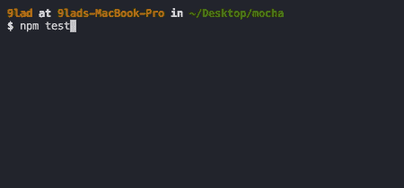
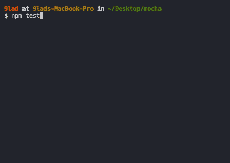
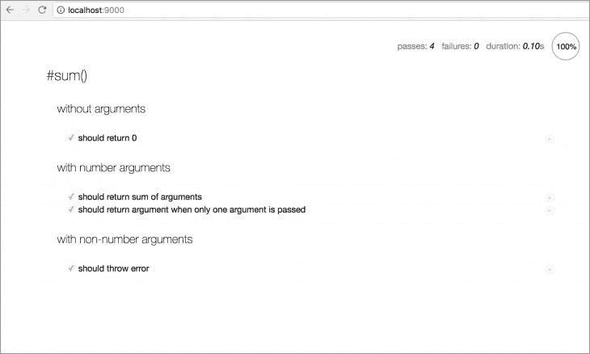

# 用 Mocha 和 Chai - LogRocket 博客测试 Node.js

> 原文：<https://blog.logrocket.com/testing-node-js-mocha-chai/>

***编者按**:这篇文章最近更新于 2022 年 7 月 13 日，以反映 Mocha v.9 中添加的新功能。*

无论你在构建什么样的应用，你都应该在部署之前进行测试。有无数可用的测试框架，包括 Jest、Jasmine、QUnit、Karma 和 Cypress 等等。JavaScript 最流行的测试框架之一是 [Mocha](https://mochajs.org/) 。

在这个全面的教程中，我们将演示如何使用 Mocha 测试 Node.js 应用程序，包括编写我们自己的测试套件和在浏览器中运行 Mocha 测试。我们将详细介绍以下内容:

## 摩卡是什么？

Mocha 是一个开源的 JavaScript 测试框架，运行在 Node.js 和浏览器中。它被设计成用一个非常简单的接口测试同步和异步代码。

Mocha 连续运行测试，以提供灵活准确的报告，同时将未捕获的异常映射到相应的测试用例。Mocha 提供了按特定顺序执行的[函数](https://blog.logrocket.com/unit-testing-node-js-applications-using-mocha-chai-and-sinon/)，将结果记录在终端窗口中。Mocha 还清理被测试软件的状态，以确保测试用例彼此独立运行。

虽然它可以与大多数断言库一起使用，但 Mocha 通常与 [Chai](https://www.chaijs.com/) 一起使用，后者是一个用于 Node.js 和浏览器的流行断言库。

[Mocha 提供了多种接口](https://mochajs.org/#interfaces)用于定义测试套件、钩子和单个测试，包括 TSS、Exports、QUnit 和 Require。

默认接口是行为驱动开发(BDD ),旨在帮助开发人员构建可预测、适应变化且不易出错的软件。BDD 是从测试驱动开发(TDD)发展而来的，它要求您:

1.  为所需的软件功能编写测试
2.  运行软件功能测试
3.  实现软件功能
4.  修复 bug 并重构，直到所有测试都通过
5.  对任何新功能重复该循环

TDD 和 BDD 的主要区别在于，BDD 要求用共享语言编写测试用例，简化了技术和非技术利益相关者之间的交流，如开发人员、QA 团队和业务领导。

## 在 Node.js 中运行 Mocha 测试

首先，您需要在本地机器上全局安装 Mocha，或者将其作为项目的依赖项。您可以使用下面的相应代码来完成此操作:

```
npm i --global mocha

npm i --save-dev mocha

```

在本地机器上全局安装 Mocha 使得 Mocha CLI 二进制文件可以在命令行终端中使用。您可以使用下面的命令在您的终端上运行 Mocha 测试:

```
mocha

```

如果您只是将 Mocha 安装为项目的开发依赖项，那么您可以从项目的`node_modules`目录中访问 Mocha 二进制文件:

```
./node_modules/mocha/bin/mocha

```

要完成 Mocha 设置，您必须为一个非常简单的功能编写一个单元测试，并配置一个脚本来使用 Mocha 运行测试。

Mocha 自动在项目的`test`目录中寻找测试。继续在您的项目根目录下创建这个目录:

```
mkdir test

```

接下来，修改您的`package.json`中的`"test"`脚本，使用 Mocha 运行测试。它应该如下所示:

```
/* package.json */

{
  "scripts": {
    "test": "mocha"
  }
}

```

通过这种设置，您可以使用下面的简单命令在您的项目中运行测试:

```
npm test

```

## 用 Mocha 编写测试

目前，我们已经为使用 Mocha 运行测试做好了一切准备，但是我们还没有任何要运行的测试。让我们为软件的预期功能编写测试。

### 用摩卡和柴写测试

编写测试通常需要使用断言库。断言是用于验证编程操作的结果与预期结果相匹配的功能。不管您选择使用哪个断言库，Mocha 都不会歧视。

如果您在 Node.js 环境中使用 Mocha，您可以使用内置的 [`assert`模块](https://nodejs.org/api/assert.html)作为您的断言库。然而，你也可以使用更多的断言库，比如[柴](http://www.chaijs.com/)、 [Expect.js](https://github.com/mjackson/expect) 、 [Should.js](https://shouldjs.github.io/) 等等。

对于本指南中的所有测试，我们将使用 [Chai 作为断言库](https://blog.logrocket.com/how-to-test-strapi-endpoints-with-mocha-and-chai/)。将 Chai 安装为项目的开发依赖项，如下所示:

```
npm i --save-dev chai

```

Chai 提供了 assert、expect 和 should 断言样式:

```
// Assert style
var assert = require('chai').assert;
var numbers = [1, 2, 3, 4, 5];

assert.isArray(numbers, 'is array of numbers');
assert.include(numbers, 2, 'array contains 2');
assert.lengthOf(numbers, 5, 'array contains 5 numbers');

```

```
// Expect style
var expect = require('chai').expect;
var numbers = [1, 2, 3, 4, 5];

expect(numbers).to.be.an('array').that.includes(2);
expect(numbers).to.have.lengthOf(5);

```

```
// Should style
var should = require('chai').should();
var numbers = [1, 2, 3, 4, 5];

numbers.should.be.an('array').that.includes(2);
numbers.should.have.lengthOf(5);

```

您可以在 Chai 官方文档中了解更多关于 Chai 提供的断言和断言风格的信息。

### 使用 Mocha BDD 接口

下面的代码演示了使用 BDD 接口定义的测试套件是什么样子的:

```
// begin a test suite of one or more tests
describe('#sum()', function() {

  // add a test hook
  beforeEach(function() {
    // ...some logic before each test is run
  })

  // test a functionality
  it('should add numbers', function() {
    // add an assertion
    expect(sum(1, 2, 3, 4, 5)).to.equal(15);
  })

  // ...some more tests

})

```

## 用 Mocha 编写测试套件

现在，让我们编写第一个测试套件，并用 Mocha 运行测试。首先，您必须实现一个`sum()`函数:

*   可以接受任意数量的参数
*   要求所有的参数都是一个`number`，如果有任何参数不是一个`number`就抛出一个错误
*   计算并返回其参数的总和，前提是每个参数都是一个`number`
*   如果没有传递参数，则返回`0`

首先，用所需功能的测试来定义测试套件。在项目的`test`目录中创建一个新的`sum.js`文件，并向其中添加以下代码片段:

```
/* test/sum.js */

var sum = require('../sum.js');
var expect = require('chai').expect;

describe('#sum()', function() {

  context('without arguments', function() {
    it('should return 0', function() {
      expect(sum()).to.equal(0)
    })
  })

  context('with number arguments', function() {
    it('should return sum of arguments', function() {
      expect(sum(1, 2, 3, 4, 5)).to.equal(15)
    })

    it('should return argument when only one argument is passed', function() {
      expect(sum(5)).to.equal(5)
    })
  })

  context('with non-number arguments', function() {
    it('should throw error', function() {
      expect(function() {
        sum(1, 2, '3', [4], 5)
      }).to.throw(TypeError, 'sum() expects only numbers.')
    })
  })

})

```

注意，测试文件中需要`sum`模块，尽管我们还没有创建它。还要注意的是，`sum()`调用被包装在一个函数中，用来测试当传递`non-number`参数时是否抛出错误。这是`.throw()`断言的一个要求，在 [Chai 断言文档](http://www.chaijs.com/api/bdd/)中有详细说明。

接下来，将`sum()`函数的功能实现为模块导出，运行测试，并确保所有测试都通过。在项目的根目录下创建一个新的`sum.js`文件，包含以下代码片段:

```
/* sum.js */

module.exports = function() {

  // Convert arguments object to an array
  var args = Array.prototype.slice.call(arguments);

  // Throw error if arguments contain non-finite number values
  if (!args.every(Number.isFinite)) {
    throw new TypeError('sum() expects only numbers.')
  }

  // Return the sum of the arguments
  return args.reduce(function(a, b) {
    return a + b
  }, 0);

}

```

现在，您可以通过运行前面定义的`test`脚本在您的终端中运行测试:

```
npm test

```

您应该会得到如下所示的输出:



Writing a test suite in Mocha

## 用 Mocha 测试异步代码

到目前为止，您编写的测试是针对涉及同步执行的代码的功能。然而，大多数 Node.js 应用程序需要大量异步代码。Mocha 还使得用非常相似的语法测试异步代码变得容易。

您可以使用以下任何方法来测试 Mocha 的异步代码:

*   回调函数
*   对支持承诺的环境的承诺
*   async/await 用于支持异步功能的环境

让我们深入研究一下这些方法。

### 回调函数

作为第二个参数传递给`it()`的函数可以传递一个可选的回调函数作为它的第一个参数。当这个回调函数被传递时，Mocha 知道测试是针对异步功能的。按照惯例，回调函数被命名为`done`，但是您可以自由地使用您选择的任何标识符:

```
it('test expectation', function(done) {
// test asynchronous code
// call done() to terminate test and proceed to the next test
}

```

关于`done()`回调有一些事情需要注意。

其一，必须调用 Mocha 来终止测试并进行下一个测试；否则，测试会一直运行，直到超时。不应在一个`it()`功能块内多次调用它。多次调用它将会抛出一个错误。

因为它是一个节点样式的回调，所以它可以将一个`Error`实例`err`作为它的第一个参数。用一个`Error`实例调用`done()`回调会导致测试失败，并给出错误。

在继续之前，这里有一个简单的模块，它导出一个异步`md5()`函数来计算一个字符串的 MD5 散列。在项目的根目录下创建一个新的`md5.js`文件，并向其中添加以下代码:

```
/* md5.js */

var crypto = require('crypto');

module.exports = function(string, callback) {
  var withCallback = typeof callback === 'function';

  try {

    var hash = crypto.createHash('md5')
      .update(string)
      .digest('hex');

    withCallback && callback(null, hash);

  } catch (e) {
    if (withCallback) callback(e);
    else throw e;
  }
}

```

下面的代码片段包含一个使用回调函数对这个异步函数的简单测试。在项目的`test`目录中创建一个新的`md5.js`文件，并添加以下代码:

```
/* test/md5.js */

var md5 = require('../md5');
var expect = require('chai').expect;

describe('#md5()', function() {

  context('with string argument', function() {
    it('should compute MD5 hash', function(done) {

      md5('Glad Chinda', function(err, hash) {
        // call the done() callback with the error if any
        // to terminate the test with an error
        if (err) return done(err);

        // add some assertions
        expect(hash)
          .to.be.a('string')
          .that.matches(/^[a-f0-9]{32}$/)
          .and.equal('877dbb93f50eb8a89012e15bd37ee7e4');

        // finally call the done() callback
        // to terminate the test
        done();
      })

    })
  })

  context('with non-string argument', function() {
    it('should throw an error', function(done) {

      md5(12345, function(err, hash) {
        // call the done() callback with the error if any
        // to terminate the test
        if (err) {

          // add an assertion to check the error
          expect(function() { throw err })
            .to.throw(TypeError, 'The “data” argument must be of type string or an instance of Buffer, TypedArray, or DataView');

          // finally call the done() callback
          // to terminate the test and return
          return done();

        }

        // call the done() callback
        // to terminate the test
        done();
      })

    })
  })

})

```

现在，如果您在终端上运行测试，您将得到如下所示的输出:



The callback function in Mocha

### 承诺

如果您在一个支持承诺的环境中开发，很可能大多数异步操作都是基于承诺的。Mocha 还使您有可能测试使用承诺的异步代码。

每当您从传递给`it()`的函数中返回一个承诺时，Mocha 知道要测试的功能是异步的，所以它在进行下一个测试之前等待承诺的实现。

在 Mocha ≥v3.0.0 中，当承诺被返回时调用`done()`回调会导致异常，因为这是不允许的。然而，在旧版本的 Mocha 中，该调用被忽略。

为了测试使用承诺的异步代码，您将创建另一个版本的基于承诺的`md5`模块。用下面的代码在项目的根目录下创建一个新的`promise-md5.js`文件:

```
/* promise-md5.js */

const md5 = require('./md5');

module.exports = (string) => new Promise(
  (resolve, reject) => {
    md5(string, (err, hash) => {
      return err ? reject(err) : resolve(hash)
    })
  }
)

```

下面的代码片段包含一个简单的`promise-md5`模块测试套件。在项目的`test`目录中创建一个新的`promise-md5.js`文件，并添加以下代码:

```
/* test/promise-md5.js */

var promiseMd5 = require('../promise-md5');
var expect = require('chai').expect;

describe('#promiseMd5()', function() {

  context('with string argument', function() {
    it('should compute MD5 hash', function() {

      return promiseMd5('Glad Chinda')
        .then(function(hash) {
          // add some assertions
          expect(hash)
            .to.be.a('string')
            .that.matches(/^[a-f0-9]{32}$/)
            .and.equal('877dbb93f50eb8a89012e15bd37ee7e4');
        })

    })
  })

  context('with non-string argument', function() {
    it('should throw an error', function() {

      return promiseMd5(12345)
        .catch(function(err) {
          // add an assertion to check the error
          expect(function() { throw err })
            .to.throw(TypeError, 'The “data” argument must be of type string or an instance of Buffer, TypedArray, or DataView');
        })

    })
  })

})

```

现在，继续用这个稍加修改的测试命令运行测试:

```
npm test -- -f promiseMd5

```

这个命令使用`-—`将命令选项和参数传送到底层的 Mocha CLI 二进制文件。`-f`标志指示 Mocha 只运行包含给定字符串的测试，在本例中是`promiseMd5`。输出应该如下所示:



Promises in Mocha

### 异步/等待

对于支持最新的 async/await 语法的环境，Mocha 还支持将 async 函数作为第二个参数传递给`it()`。先前的`promise-md5.js`测试可以重写如下:

```
/* test/promise-md5.js */

var promiseMd5 = require('../promise-md5');
var expect = require('chai').expect;

describe('#promiseMd5()', function() {

  context('with string argument', function() {
    it('should compute MD5 hash', async function() {

      // use await to wait until the promise is fulfilled
      var hash = await promiseMd5('Glad Chinda');

      // add some assertions
      expect(hash)
        .to.be.a('string')
        .that.matches(/^[a-f0-9]{32}$/)
        .and.equal('877dbb93f50eb8a89012e15bd37ee7e4');
    })

  })

  context('with non-string argument', function() {
    it('should throw an error', async function() {

      await promiseMd5(12345).catch(function(err) {
        // add an assertion to check the error
        expect(function() { throw err })
          .to.throw(TypeError, 'The “data” argument must be of type string or an instance of Buffer, TypedArray, or DataView');
       })

    })
  })

})

```

## 对摩卡使用测试挂钩

Mocha 为创建测试挂钩做了准备。钩子基本上是被配置为在测试之前或之后运行的逻辑。它们对于设置测试的前提条件或在测试后清理资源非常有用。

对于默认的 BDD 接口，Mocha 提供了四个钩子:

*   `before()`:在块中第一个测试用例之前运行一次
*   `beforeEach()`:在每个测试用例之前运行
*   `afterEach()`:在每个测试用例之后运行
*   `after()`:在块中最后一个测试用例之后运行一次

根据应用于给定测试套件的挂钩，挂钩以确定的顺序与套件中的测试一起运行:

```
before() -> beforeEach() -> test() -> afterEach() -> after()

```

### 创建挂钩

每个钩子基本上都以一个回调函数作为参数。回调函数包含当钩子被触发时要执行的逻辑。逻辑可以是同步的，也可以是异步的，就像常规测试用例一样:

```
describe('some module', function() {

  beforeEach(function() {
    // some logic to run before each test
    // logic can be sync or async
  })

})

```

钩子也可以将可选的`description`作为第一个参数，这样更容易跟踪错误。但是，如果一个命名函数作为一个参数传递给一个钩子，如果没有传递显式的描述，函数的名称将被用作描述:

```
describe('some module', function() {

  // HOOK WITH NAMED FUNCTION
  beforeEach(function createSession() {
    // beforeEach:createSession
  })

  // HOOK WITH DESCRIPTION
  beforeEach('create a user session', function() {
    // beforeEach:create a user session
  })

})

```

[`describe()`函数](https://bignerdranch.com/blog/why-do-javascript-test-frameworks-use-describe-and-beforeeach/)是 Mocha 中分组测试的一种方式。您可以根据需要将测试嵌套在任意深度的组中。`describe()`接受两个参数，测试组的名称和一个回调函数。

### 根套件

每当一个钩子被定义在一个明确的`describe()`块之外，这个钩子就成为一个根级钩子。根级挂钩适用于所有的测试文件，不管它们是在哪里定义的。Mocha 隐式地创建了一个`describe()`块，称为根套件。

在下面的代码片段中，`afterEach()`钩子将在每个文件的每个测试后被触发:

```
var tests = 1;

// Will run after every test in every file
afterEach(function() {
  console.log('Test #' + (tests++));
})

```

有时，您可能希望在运行任何测试套件之前执行异步操作。Mocha 允许您通过使用`--delay`选项运行 Mocha 二进制文件来延迟根套件。

对于项目的测试命令，它看起来如下所示:

```
npm test -- --delay

```

运行这个命令指示 Mocha 将一个特殊的`run()`回调函数附加到全局上下文中。调用`run()`函数指示它运行已经描述过的所有测试套件。因此，在异步操作完成后可以调用`run()`来运行测试。

要查看示例，请将以下代码片段添加到您之前创建的任何测试文件中。请记住，它绝不能在`it()`块内:

```
// Delay running the tests until after 5s
setTimeout(function() {
  run()
}, 5000);

```

现在，使用以下命令运行测试:

```
npm test -- --delay

```

请注意，测试在运行前会延迟五秒钟。然而，如果从未调用过`run()`方法，测试将永远不会运行。输出应该如下所示:



The root suite in Mocha

## 摩卡测试

每当回调函数没有作为第二个参数传递给`it()`时，测试用例被标记为挂起，表明测试还没有被编写。挂起的测试不是失败的测试，它们包含在测试结果中:

```
describe('#flattenArray()', function() {
  // a pending test
  it('should flatten array');
})

```



Controlling Mocha tests

### 包括和不包括测试

您还可以指定应该或不应该运行的测试套件和测试用例。Mocha 提供了两个有用的方法，`only()`和`skip()`，用于控制测试套件和测试用例的排他和包含行为。

使用`describe.skip()`方法防止套件中的测试运行，使用`describe.only()`方法确保套件中的测试运行:

```
// Tests in this suite will run
describe.only('#flattenArray()', function() {
  it('should flatten array', function() {});
})

// Tests in this suite will not run
describe('#mergeArray()', function() {
  it('should merge two arrays', function() {});
})

```

这也适用于使用`it()`的测试用例。你可以在运行时通过调用传递给`it()`的回调函数中的`this.skip()`来跳过测试。这使得基于某些条件动态跳过测试成为可能。

调用`this.skip()`实际上中止了测试。避免在调用`this.skip()`后执行进一步的指令被认为是最佳实践。运行时使用`this.skip()`跳过的每一个测试都将被标记为待定测试:

```
describe.only('#flattenArray()', function() {
  // This test will run
  it.only('should flatten array', function() {});

  // This test will not run
  it('should recursively flatten array', function() {});
})

describe.only('#mergeArray()', function() {

  // This test is skipped at runtime for production environment
  // In production, it will not run and will be marked as pending

  it('should merge two arrays', function() {
    if (process.env.NODE_ENV === 'production') {
      return this.skip();
    }
  });

})

```


Including and excluding Mocha tests

您可以多次使用`.only()`和`.skip()`来选择一组要运行的套件和测试。但是，您必须注意以下几点:

*   嵌套套件仍将被执行
*   如果存在钩子，仍然会被执行
*   测试具有优先权

### 重试摩卡测试

Mocha 使您能够指定失败的测试可以重试的次数。虽然不建议在单元测试中使用这种方法，但是在编写端到端测试时，这种方法会很有用，因为某些外部资源可能由于某种原因而不可用。

Mocha 提供了一个`this.retries()`函数，允许您指定失败的测试可以重试的次数。对于每次重试，Mocha 都会重新运行`beforeEach()`和`afterEach()`钩子，但不会运行`before()`和`after()`钩子。

下面的代码片段显示了一个使用 Cypress 测试运行器访问网页的简单示例。如果服务器响应的状态代码不是`2xx`，可能是因为网络速度慢或互联网连接不良，测试被标记为失败:

```
describe('test medium site', function() {

  // all failed tests in this suite will only be retried 2 times
  this.retries(2);

  it('should load medium homepage', function() {
    // can only retry this test 5 times
    this.retries(5);

    cy.visit('https://medium.com');
  })

})

```

使用`this.retries(5)`，在测试被标记为失败之前，最多允许重试五次。

### 用摩卡慢测试

使用`this.slow()`方法，Mocha 允许您定义在测试被认为缓慢之前应该经过的时间。传递给`this.slow()`的数字代表以毫秒为单位的时间量:

```
describe('slow test', function() {

  // Tests will be considered slow after 1 second elapses
  this.slow(1000);

  // Completes after the specified 1 second elapses
  it('should be complete in a second', function(done) {
    setTimeout(done, 1500);
  })

  // Completes immediately
  it('should be complete instantly', function() {})

})

```



Slow tests with Mocha

注意用于标记慢速测试的红色`1506ms`指示器。测试被认为是缓慢的，因为它花费了超过指定的一秒钟`1000ms`来完全运行。

### 超时设定

默认情况下，对于任何超过两秒钟的测试，Mocha 都会超时。当超时发生时，测试被标记为失败，并引发超时错误:



Mocha timeout

然而，Mocha 提供了一个`this.timeout()`方法，用于指定对于给定的测试套件、钩子或者测试用例，在超时发生之前应该经过的时间。传递给`this.timeout()`的数字代表以毫秒为单位的时间量。

超时可以在不同的级别进行不同的配置，如套件、挂钩和测试级别:

```
describe('some time-consuming operation', function() {

  // set a 5 seconds timeout for this suite
  this.timeout(5000);

  before('some long setup', function(done) {
    // set a hook-level timeout
    this.timeout(2500);

    setTimeout(done, 2250);
  })

  it('should take less than 200ms', function(done) {
    // set a test-level timeout
    this.timeout(200);

    setTimeout(done, 150);
  })

})

```

注意，用`0`调用`this.timeout()`会完全禁用超时:

```
describe('some time-consuming operation', function() {

  // disable timeout for this suite
  this.timeout(0);

  // test that takes a long time to complete
  it('should take a long time', function(done) {
    setTimeout(done, 10000);
  })

})

```

## Mocha CLI 选项

到目前为止，您已经接触了 Mocha 为编写测试提供的所有工具。然而，在使用 Mocha 时，您仍然可以利用许多实用程序，其中一些只有在使用 Mocha CLI 二进制文件时才可用。

要获得可以应用于 Mocha 的可用选项列表，请运行以下命令:

```
mocha -h

```

在您的项目中，您可以改为使用以下命令:

```
npm test -- -h

```

### 看摩卡测试文件

`-w, --watch`标志指示 Mocha 观察测试文件中的变化并重新运行测试。这对于在开发过程中编写测试非常有用:

```
mocha --watch

```

### 异步和保释

`-A, --async-only`标志强制所有测试都需要回调函数或返回承诺，从而异步运行。没有指定回调函数或返回承诺的测试将被标记为失败:

```
mocha --async-only

```

第一次测试失败后，`-b, --bail`标志迫使摩卡退出:

```
mocha --bail

```

### 在 Mocha 中处理超时和慢速测试

`-t, --timeout <ms>`选项允许您为您的测试用例设置超时。Mocha 使用两秒的默认值。您可以通过指定毫秒数或带有`s`后缀的值来设置超时，以秒为单位指定时间:

```
mocha -t 3000

```

上面的代码相当于下面的代码:

```
mocha --timeout 3s

```

要完全禁用超时，您可以使用`--no-timeouts`，它相当于`--timeout 0`:

```
mocha --no-timeouts

```

Mocha 还允许您通过使用`-s, --slow <ms>`选项来设置慢速运行测试的阈值。默认阈值是 75 毫秒。正如您前面看到的，Mocha 使用这个阈值来突出显示运行时间过长的测试:

```
mocha --slow 100

```

### 运行测试而不执行

当您使用在 Mocha v.9 中引入的 [`--dry-run`标志](https://mochajs.org/#-dry-run)时，您告诉 Mocha 执行`runner`并使所有测试通过，而不实际运行任何测试或钩子，就像您使用`it().skip`和`it().only`时一样。

### 运行匹配测试

`-g, --grep <pattern>`标志指示 Mocha 运行匹配特定模式或正则表达式的测试和测试套件，正则表达式在内部被转换为`RegExp`。

另一方面，如前所述，`-f, --fgrep <string>`标志指示 Mocha 只运行包含指定字符串的测试和测试套件。

以下命令将运行包含字符串`array`的所有测试和测试套件:

```
mocha -f array

```

### 包括文件和模块

`-r, --require <module>`标志允许您要求在测试文件中使用的模块和库，比如断言库，而不是在代码中手动调用`require()`。这适用于像 [should.js](https://shouldjs.github.io) 这样的模块。但是，要访问该模块的导出，您必须在代码中要求该模块:

```
mocha --require should

```

`--file <file>`标志允许您添加一个或多个您想要首先包含在您的测试套件中的文件。这些文件可能包含测试所需的某种形式的设置逻辑。可以多次使用`--file`标志来包含多个文件。

### 摩卡接口和记者

Mocha 为编写测试提供了几个接口。默认的是 BDD 接口，我们在本指南中一直使用它。`-u, --ui <name>`允许您指定要使用的另一个接口:

```
mocha --ui exports

```

`-R, --reporter <name>`标志允许您指定显示测试结果的首选报告器。在本教程中，我们使用默认指南 spec。

Mocha 还允许您使用`-R, --reporter <name>`标志指定第三方报告者:

```
mocha -R list

```

## 浏览器中的摩卡

摩卡测试运行器也可以在浏览器中使用；Mocha 的每个版本都包含用于浏览器的`./mocha.css`和`./mocha.js`版本。让我们通过一个简单的设置在浏览器上运行 Mocha 测试。

### 设置公共文件

在项目的根目录下创建一个新的`public`目录。接下来，在新创建的`public`目录中创建一个名为`index.html`的新文件，并添加以下代码:

```
<!doctype html>
<html>
<head>
  <meta charset="utf-8">
  <title>Mocha Tests</title>

  <!-- Include Mocha CSS styles -->
  <link href="https://cdn.rawgit.com/mochajs/mocha/2.2.5/mocha.css" rel="stylesheet">
</head>

<body>
  <div id="mocha"></div>

  <!-- Add the Chai assertion library -->
  <script src="http://chaijs.com/chai.js"></script>

  <!-- Add the Mocha test library -->
  <script src="https://cdnjs.cloudflare.com/ajax/libs/mocha/10.0.0/mocha.min.js"></script>

  <script>
    // Set chai.expect as a global variable
    var expect = chai.expect;

    // Setup Mocha to use the BDD interface
    mocha.setup('bdd');
  </script>

  <!-- Import the sum function -->
  <script src="/sum.js"></script>

  <!-- Import the tests for the sum function -->
  <script src="/sum.test.js"></script>

  <script>
    // Run the tests with Mocha
    mocha.run();
  </script>

</body>
</html>

```

注意，Mocha 和 Chai 断言库的静态 CSS 和 JavaScript 文件已经导入到页面中。元素作为显示测试结果的挂载点。

在设置 Chai 的过程中，`chai.expect`被映射到一个名为`expect`的全局变量，这样就可以在测试脚本中使用它来做出断言。Mocha 通过调用`mocha.setup(‘bdd’)`来设置使用 BDD 接口。使用`mocha.run()`方法运行测试。

接下来，在您之前创建的`public`目录中创建一个新的`sum.js`文件，并向其中添加以下代码:

```
/* public/sum.js */

function sum() {
  // Convert arguments object to array
  var args = Array.prototype.slice.call(arguments);

  // Throw error if arguments contain non-finite number values
  if (!args.every(Number.isFinite)) {
    throw new TypeError('sum() expects only numbers.')
  }

  // Return the sum of the arguments
  return args.reduce(function(a, b) {
    return a + b
  }, 0);
}

```

然后，使用以下代码在`public`目录中创建一个新的`sum.test.js`文件:

```
/* public/sum.test.js */

describe('#sum()', function() {
  context('without arguments', function() {

    it('should return 0', function() {
      expect(sum()).to.equal(0)
    })

  })

  context('with number arguments', function() {

    it('should return sum of arguments', function() {
      expect(sum(1, 2, 3, 4, 5)).to.equal(15)
    })

    it('should return argument when only one argument is passed', function() {
      expect(sum(5)).to.equal(5)
    })

  })

  context('with non-number arguments', function() {

    it('should throw error', function() {
      expect(function() {
        sum(1, 2, '3', [4], 5)
      }).to.throw(TypeError, 'sum() expects only numbers.')
    })

  })
})

```

### 设置一个简单的服务器

或者，您可以设置一个简单的服务器来提供公共文件。对于这个演示，我们将使用`live-server`。继续将它作为项目的依赖项进行安装，如下所示:

```
npm install --save-dev live-server

```

修改您的`package.json`文件的`"scripts"`部分，以包含一个脚本来服务公共文件并在浏览器中运行 Mocha 测试。它应该如下所示:

```
/* package.json */

{
  "scripts": {
    "test": "mocha",
    "test:browser": "live-server --port=9000 --mount=/:public"
  }
}

```

我们添加了一个`test:browser`脚本来启动`port 9000`上的实时服务器，并提供来自`public`目录的文件。最后，运行新脚本:

```
npm run test:browser

```

上面的代码应该在`port 9000`上启动服务器，并为您启动一个浏览器选项卡。浏览器上的测试输出应该如下所示:



Mocha browser testing

## 结论

在本指南中，我们向您介绍了在 Node.js 和浏览器中测试 Mocha 的基本知识。我们还演示了如何为您的 JavaScript 程序编写和运行测试。

尽管本指南内容相当广泛，但您可以随时参考 [Mocha.js 文档](https://mochajs.org/)来了解本文未涉及的任何细节。

## 200 只显示器出现故障，生产中网络请求缓慢

部署基于节点的 web 应用程序或网站是容易的部分。确保您的节点实例继续为您的应用程序提供资源是事情变得更加困难的地方。如果您对确保对后端或第三方服务的请求成功感兴趣，

[try LogRocket](https://lp.logrocket.com/blg/node-signup)

.

[](https://lp.logrocket.com/blg/node-signup)[https://logrocket.com/signup/](https://lp.logrocket.com/blg/node-signup)

LogRocket 就像是网络和移动应用程序的 DVR，记录下用户与你的应用程序交互时发生的一切。您可以汇总并报告有问题的网络请求，以快速了解根本原因，而不是猜测问题发生的原因。

LogRocket 检测您的应用程序以记录基线性能计时，如页面加载时间、到达第一个字节的时间、慢速网络请求，还记录 Redux、NgRx 和 Vuex 操作/状态。

[Start monitoring for free](https://lp.logrocket.com/blg/node-signup)

.