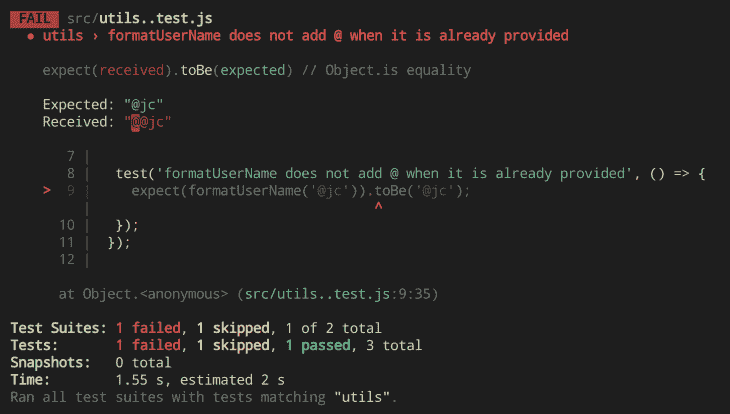
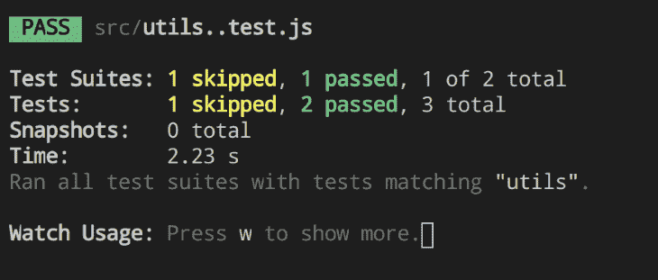

# React 应用测试:Jest 和 React 测试库

> 原文：<https://blog.logrocket.com/testing-react-apps-jest-react-testing-library/>

***编者按:**这篇文章更新于 2022 年 3 月 16 日，删除了任何过时的内容，并增加了关于`React Testing Library` vs. Jest* 的信息

测试是软件工程中必不可少的实践，它有助于构建健壮和高质量的软件，增强团队对代码的信心，使应用程序更加灵活，在引入或修改功能时更容易出错。

高效的团队将测试作为他们日常工作中的核心实践，在自动化测试到位之前，任何特性都不会发布。一些开发人员甚至在编写特性之前编写测试，遵循一个称为测试驱动开发(TDD)的过程。

在本文中，我们将使用 Jest 和`React Testing Library`测试 React 应用程序，Jest 和`React Testing Library`是 JavaScript 测试框架和用于测试组件的 React 实用程序的流行组合。这也是在 [React 的文档](https://reactjs.org/docs/testing.html#tools)中给出的官方推荐。

我们将讨论以下主题:

## 什么是测试？

测试是在代码产生的结果和我们期望的结果之间自动断言的过程。

当测试 React 应用程序时，我们的断言是由应用程序如何呈现和响应用户交互来定义的。

有许多不同类型的测试范例和哲学。本文将关注于创建单元和组件测试(或者集成测试)。

## Jest 和`React Testing Library`介绍

### 什么是玩笑？

Jest 是一个 JavaScript 测试框架,允许开发人员对 JavaScript 和 TypeScript 代码进行测试，并与 React 很好地集成。

这是一个考虑到简单性而设计的框架，提供了一个强大而优雅的 API 来构建隔离测试、快照比较、模拟、测试覆盖等等。

### `React Testing Library`

`React Testing Library`是一个专门为测试 React 组件而构建的 JavaScript 测试工具。它模拟独立组件上的用户交互，并断言它们的输出，以确保 UI 行为正确。

## `React Testing Library`等。他来了

不是笑话的替代品。每一个都执行一个明确的任务，你需要它们来测试你的组件。

Jest 是一个测试运行程序，它查找测试，运行测试，并确定测试是通过还是失败。此外，Jest 为测试套件、测试用例以及断言提供了功能。
`React Testing Library`为测试 React 组件提供虚拟 DOM。

每当我们在没有 web 浏览器的情况下运行测试时，我们都必须有一个虚拟 DOM 来呈现应用程序，与元素进行交互，并观察虚拟 DOM 的行为是否像它应该的那样(比如在单击按钮时改变 div 的宽度)。

`React Testing Library`不特定于任何测试框架；我们可以将它与任何其他测试库一起使用，尽管 Jest 是许多开发人员推荐和首选的。

`create-react-app`默认使用 Jest 和`React Testing Library`。此外， [`[react-scripts]`会自动设置我们的服务器来监视变化](https://blog.logrocket.com/everything-you-need-to-know-about-react-scripts/)，所以如果测试文件被修改，服务器会自动编译并运行测试，而不需要重启服务器。

为了了解这些库是如何协同工作的，让我们来看看`create-react-app`的自动生成的测试文件:

```
import { render, screen } from '@testing-library/react';
import App from './App';

test('renders learn react link', () => {
  render(<App />);
  const linkElement = screen.getByText(/learn react/i)
  expect(linkElement).toBeInTheDocument();
});

```

这里，测试用例由 Jest 提供。为了渲染和访问虚拟 DOM，我们从`React Testing Library`导入并使用了`render`和`screen`。

如果你从头开始设置 React 应用，那么你必须自己安装和设置 Jest 和`React Testing Library`。

## 设置您的测试环境

让我们从安装所需的库和设置项目开始。启动和运行 React 应用程序最简单的方法是使用`create-react-app`。

我建议您按照教程中的步骤运行命令并自己编写代码。但是，如果您更喜欢遵循最终项目结果的代码，您可以从 GitHub 中克隆[教程项目。](https://github.com/bajcmartinez/react-jest-tutorial)

首先，创建一个 React 应用程序:

```
npx create-react-app react-jest-tutorial

```

现在，安装`React Testing Library`:

```
npm install --save-dev @testing-library/react

```

最后，安装附加库:

```
npm install axios

```

## 构建用于测试的 React 应用程序

接下来，让我们构建一个从 API 显示用户的最小应用程序。因为我们只关注前端，所以让我们使用 [JSONPlaceholder 用户 API](https://jsonplaceholder.typicode.com/) 。这个应用程序专为构建测试而构建。

用以下内容替换`App.js`文件的内容:

```
import { useEffect, useState } from 'react';
import axios from 'axios';
import { formatUserName } from './utils';
import './App.css';

function App() {
 const [users, setUsers] = useState([]);

 // Load the data from the server
 useEffect(() => {
   let mounted = true;

   const getUsers = async () => {
     const response = await axios.get('https://jsonplaceholder.typicode.com/users');
     if (mounted) {
       setUsers(response.data);
     }

```

接下来，在`src`文件夹中创建一个名为`utils.js`的文件，并编写以下函数:

```
export function formatUserName(username) {
 return '@' + username;
}

```

现在，您可以使用以下命令运行应用程序:

```
npm start

```

之后，您应该会看到这个屏幕。


API Basic application listing the users from the API with their corresponding usernames.

## 构建单元测试

单元测试孤立地测试单个软件单元或组件。一个单元可以是一个函数、例程、方法、模块或对象，测试目标决定了该单元是否输出给定输入的预期结果。

一个测试模块由 Jest 提供的一系列描述测试结构的方法组成。我们可以如下使用类似`describe`或`test`的方法:

```
describe('my function or component', () => {
 test('does the following', () => {
   // Magic happens here
 });
});

```

`describe`块是测试套件，`test`块(或者简称为`test`)是测试用例。一个测试套件可以有多个测试用例，一个测试用例不一定要在一个测试套件中，尽管这样做是常见的做法。

在测试用例中，我们可以编写断言(例如，Jest 中的`expect`)来验证成功(绿色)或错误(红色)。每个测试用例可以有多个断言。

下面是一个成功的断言的小例子:

```
describe('true is truthy and false is falsy', () => {
 test('true is truthy', () => {
   expect(true).toBe(true);
 });

 test('false is falsy', () => {
   expect(false).toBe(false);
 });
});

```

接下来，让我们针对来自`utils`模块的函数`formatUserName`编写第一个测试用例。
为此，我们必须先创建一个新文件:`utils.test.js`。注意，所有的测试文件都使用模式`{file}.test.js`，其中`{file}`是要测试的模块文件的名称。

我们正在讨论的函数将一个字符串作为输入，并输出相同的字符串，在其开头添加一个`@`。我们的测试函数可以断言，给定一个字符串，例如，`"jc"`，函数将输出`"@jc"`。

以下是测试文件的代码:

```
import { formatUserName } from "./utils";

describe('utils', () => {
 test('formatUserName adds @ at the beginning of the username', () => {
   expect(formatUserName('jc')).toBe('@jc');
 });
});

```

我们有效地描述了模块是什么，测试用例是什么，这样如果它们失败了，我们就能清楚地知道哪里出错了。
现在我们的第一个测试已经准备好了，我们可以运行它，看看会有什么输出。`create-react-app`通过使用简单的 npm 命令，我们可以轻松运行所有测试:

```
npm run test

```

现在，让我们使用下面的代码集中运行一个测试:

```
npm run test -- -t 'utils'

```

我们这样做是因为我们有其他已经由`create-react-app`创建的测试，我们现在需要忽略它们。

如果一切顺利，您应该会看到类似如下的输出:


Successful output.

请注意，有一个测试被跳过了(我们希望这样)，有一个测试成功通过了。但是，如果出了问题会发生什么呢？让我们向`utils`测试套件添加一个新的测试来找出答案:

```
test('formatUserName does not add @ when it is already provided', () => {
   expect(formatUserName('@jc')).toBe('@jc');
 });

```

现在情况不同了；如果用户名在字符串的开头已经包含了一个`@`符号，我们希望函数返回所提供的用户名，而不添加第二个符号。

让我们运行它:



Failed test output.

正如预测的那样，测试失败了，我们收到了关于哪个`expect`调用失败、期望值和实际结果的具体信息。因为我们发现了原始函数的一个问题，所以我们可以修复它:

```
export function formatUserName(username) {
 return username.startsWith('@') ? username : '@' + username;
}

```

现在，让我们再次运行我们的测试:



Successful test.

到目前为止，我们已经取得了很大的进步。我们为我们的应用程序编写了两个测试用例，由于编写了这些测试用例，我们发现了一个 bug，并在发布之前修复了它。

## 用 Jest 测试组件

测试组件和测试功能没有太大的不同。想法和概念是相同的，但是区别在于我们如何编写断言。

我们将通过构建几个测试用例来测试我们的`App`组件，在每个测试用例中，我们将引入不同的东西来验证 React 组件。

我们的第一个测试将是基本的，它将只验证组件渲染。

跳转到文件`App.test.js`(由`create-react-app`自动生成)并用以下内容替换其内容:

```
import { render } from '@testing-library/react';
import App from './App';

describe('App component', () => {
 test('it renders', () => {
   render(<App />);
 });
})

```

与之前类似，我们有一个`describe`块和一个`test`块，但是这一次，我们使用`render`函数挂载来单独渲染一个组件。只有当编译错误或函数组件中的错误阻碍了它的呈现时，这个测试才会失败。

虽然有效，但它不是一个完整的测试，因为它不执行任何断言。为了解决这个问题，我们可以匹配组件中的内容，看看它们是否存在，例如:

```
import { render, screen } from '@testing-library/react';
import App from './App';

describe('App component', () => {
 test('it renders', () => {
   render(<App />);

   expect(screen.getByText('Users:')).toBeInTheDocument();
 });
})

```

我们的新测试更好；它验证组件可以呈现，但是它也搜索 DOM 中存在的带有文本`"Users:"`的元素，在我们的例子中就是这样，因此测试成功通过。

[对象`[screen]`在`React Testing Library`](https://testing-library.com/docs/queries/about/#screen) 中是必不可少的，因为它提供了助手方法来与组件及其元素进行交互。

### 等待异步操作

接下来，我们希望验证在 API 完成后用户列表是否显示了条目。为此，我们可以编写如下测试用例:

```
import { render, screen, waitFor } from '@testing-library/react';
import App from './App';

describe('App component', () => {
 test('it displays a list of users', async () => {
   render(<App />);

   expect(screen.getByTestId('user-list')).toBeInTheDocument();
 });
});

```

但是，当我们运行测试时，它会失败并显示以下消息:


Failed test in Jest.

失败的原因很简单:当我们评估屏幕时，异步操作(`fetch`)仍然处于挂起状态，所以显示的是`"Loading users…"`消息，而不是用户列表。
解决办法是等待:

```
import { render, screen, waitFor } from '@testing-library/react';
import App from './App';

describe('App component', () => {
 test('it displays a list of users', async () => {
   render(<App />);

   const userList = await waitFor(() => screen.getByTestId('user-list'));
   expect(userList).toBeInTheDocument();
 });
});

```

现在，测试成功通过。

## 用反应和玩笑嘲弄

我们的下一步是验证组件将如何对从 API 收集的数据做出反应。但是，如果我们不确定 API 的响应是什么，我们如何测试数据呢？这个问题的解决方法是嘲讽。

模仿的目的是将测试的代码与外部依赖(如 API 调用)隔离开来。这是通过用模拟依赖关系的受控对象替换依赖关系来实现的。

嘲讽是一个三步走的过程。首先，我们必须导入依赖项:

```
import axios from 'axios';

```

然后，嘲笑依赖性:

```
jest.mock('axios');

```

最后，伪造函数输出:

```
axios.get.mockResolvedValue({ data: fakeUsers });

```

让我们看看他们现在的表现:

```
import axios from 'axios';
import { render, screen, waitFor } from '@testing-library/react';
import App from './App';

jest.mock('axios');

const fakeUsers = [{
  "id": 1,
  "name": "Test User 1",
  "username": "testuser1",
 }, {
  "id": 2,
  "name": "Test User 2",
  "username": "testuser2",
 }];

describe('App component', () => {

 test('it displays a row for each user', async () => {
   axios.get.mockResolvedValue({ data: fakeUsers });
   render(<App />);

   const userList = await waitFor(() => screen.findAllByTestId('user-item'));
   expect(userList).toHaveLength(2);
 });
});

```

最后一点注意:因为我们模仿了`axios`，每个使用该库的测试用例将返回`undefined`，除非一个模仿的值通过。因此，概括一下我们的完整组件测试，我们有以下内容:

```
import axios from 'axios';
import { render, screen, waitFor } from '@testing-library/react';
import App from './App';

jest.mock('axios');

const fakeUsers = [{
  "id": 1,
  "name": "Test User 1",
  "username": "testuser1",
 }, {
  "id": 2,
  "name": "Test User 2",
  "username": "testuser2",
 }];

describe('App component', () => {
 test('it renders', async () => {
   axios.get.mockResolvedValue({ data: fakeUsers });
   render(<App />);

   expect(screen.getByText('Users:')).toBeInTheDocument();
 });

 test('it displays a list of users', async () => {
   axios.get.mockResolvedValue({ data: fakeUsers });

   render(<App />);

   const userList = await waitFor(() => screen.getByTestId('user-list'));
   expect(userList).toBeInTheDocument();
 });

 test('it displays a row for each user', async () => {
   axios.get.mockResolvedValue({ data: fakeUsers });
   render(<App />);

   const userList = await waitFor(() => screen.findAllByTestId('user-item'));
   expect(userList).toHaveLength(2);
 });
});

```

让我们运行所有测试，看看结果:


Successful test results.

## 快照测试

当您想要确保您的 UI 不会意外更改时，快照测试非常有用。

一个典型的快照测试用例呈现一个 UI 组件，获取一个快照，然后将其与一个存储的参考快照文件进行比较。如果两个快照匹配，测试将通过。如果两个快照不匹配，这可能是由于意外的更改，或者是由于引用快照需要更新到 UI 组件的新版本。

要编写快照测试，需要使用 [react-test-renderer](https://www.npmjs.com/package/react-test-renderer) 库，因为它是一个能够将 react 组件呈现为纯 JavaScript 对象的库。您可以使用以下命令安装该库:

```
npm i [email protected]

```

现在，让我们编辑`App.js`文件来包含一个快照测试。

```
import renderer from "react-test-renderer";

// ...

test("it renders a correct snapshot", async () => {
  axios.get.mockResolvedValue({ data: fakeUsers });
  const tree = renderer.create(<App />).toJSON();
  expect(tree).toMatchSnapshot();
});

// ...

```

现在，如果我们运行测试，我们应该看到更新的通过测试的结果，并注明:“它呈现了一个正确的快照”。


第一次运行这个测试时，Jest 会在`__snapshots__`文件夹中创建一个快照文件。以下是该文件的外观:

```
// Jest Snapshot v1, https://goo.gl/fbAQLP

exports[`App component it renders correctly 1`] = `
<div
  className="App"
>
  <div>
    Users:
  </div>
  <div>
    Loading users...
  </div>
</div>
`;

```

现在，如果我们继续通过更改一个简单的文本值来修改 App 组件，我们可以预期`it renders a correct snapshot`测试会失败，因为组件的输出已经更改。


我们需要通过这个测试，并通知 Jest 对测试组件的有意更改。当 Jest 处于观察模式时，我们可以很容易地做到这一点，首先在命令行中按下 **w** 来显示更多内容，然后按下 **u** 来更新快照。


## 哪个测试库最适合 React？

当谈到测试库或框架时，有各种选项和组合可以考虑。下面来看看一些最流行的测试框架及其优缺点。

### 玩笑

React 社区推荐 Jest 作为 React 测试框架的选择。Jest 是许多知名公司使用的[，比如脸书、优步和 Airbnb。Jest 也恰好是许多现成 JavaScript 框架的默认设置，包括`create-react-app`。](https://jestjs.io/docs/tutorial-react)

下面是使用 Jest 测试 React 应用程序的一些好处:

*   易于设置和配置，性能也很好
*   借助 Jest 快照捕获特性，轻松跟踪大型测试用例
*   可以进行并行化和异步方法测试
*   提供模拟 API 函数和第三方库的能力

### 酶

Enzyme 允许您操纵、遍历和在某种程度上模拟给定输出的运行时。它帮助您渲染组件、查找元素以及与元素进行交互。

这个库是专门为 React 设计的，它提供了两种测试方法:[浅层渲染](https://enzymejs.github.io/enzyme/docs/api/shallow.html)，这有助于将组件作为一个没有子组件的单元进行测试，以及挂载测试。如果您的组件具有非常高的嵌套子组件和孙组件粒度，这将意味着每个子组件都需要有自己的特定测试来覆盖所有逻辑。

酵素通常与 Jest 连用。

以下是使用 Enzyme 测试 React 应用程序的一些好处:

*   支持浅层渲染
*   支持 DOM 渲染的特性
*   支持在浅层渲染中使用反应钩子
*   可以根据测试输出模拟运行时

### `React Testing Library`

是一个轻量级的库，提供了一整套测试 React DOM 的工具。当与 Jest 测试库一起使用时，`React Testing Library`允许开发者轻松地测试组件来模拟用户的行为。`React Testing Library`自带内置的 React DOM 测试工具，可以模拟 React 应用程序上的实际用户操作。但是，它不支持浅层呈现和访问组件的状态。

`React Testing Library`提供以下优势:

*   支持用户行为测试
*   自带内置的 DOM 测试工具
*   更容易模拟用户工作流和操作
*   兼容 Angular 和 Vue 等其他 UI 框架

### 茉莉

[Jasmine](https://github.com/jasmine/jasmine) 是一个简单的针对浏览器和 Node.js 的 JavaScript 测试框架，Jasmine 遵循行为驱动的开发模式，所以一般在使用前配置到位。

为了在测试 React 应用中使用 Jasmine，开发者可以添加其他第三方框架，比如 Enzyme。

茉莉的一些好处包括:

*   不需要 DOM 来测试
*   可用于前端和后端测试
*   可用于异步功能测试
*   具有自定义的等式检查器断言
*   带有内置的匹配器断言

尽管有很多好处，Jasmine 并不是 React 应用程序的完美测试框架。它不支持快照测试，并且需要第三方库进行并行化和本地 DOM 操作。

### 摩卡

[Mocha 是一个运行在 Node.js 上的 JavaScript 框架](https://blog.logrocket.com/a-quick-and-complete-guide-to-mocha-testing-d0e0ea09f09d/)，用于测试 React 应用。它拥有浏览器支持、异步测试和断言库的使用。

Mocha 非常灵活，但是总是需要导入其他库才能编写测试。与 Jest 类似，Mocha 可以与其他库结合，如 Enzyme，用于断言、嘲讽等。

以下是使用 Mocha 测试 React 应用程序的一些最佳好处:

*   具有简单的异步测试功能
*   当测试文件中需要时，支持生成器轻松测试套件
*   为各种断言和模拟库提供高度可扩展的支持

## 结论

测试您的 React 应用程序是开发高质量应用程序的关键，感谢 React、Jest 和`React Testing Library`，测试我们的组件和应用程序比以往任何时候都更容易。
所有应用和测试的代码都可以在 [GitHub](https://github.com/yomete/react-jest-tutorial) 获得。感谢阅读！

## 使用 LogRocket 消除传统反应错误报告的噪音

[LogRocket](https://lp.logrocket.com/blg/react-signup-issue-free)

是一款 React analytics 解决方案，可保护您免受数百个误报错误警报的影响，只针对少数真正重要的项目。LogRocket 告诉您 React 应用程序中实际影响用户的最具影响力的 bug 和 UX 问题。

[ ](https://lp.logrocket.com/blg/react-signup-general) [  ](https://lp.logrocket.com/blg/react-signup-general) [LogRocket](https://lp.logrocket.com/blg/react-signup-issue-free)

自动聚合客户端错误、反应错误边界、还原状态、缓慢的组件加载时间、JS 异常、前端性能指标和用户交互。然后，LogRocket 使用机器学习来通知您影响大多数用户的最具影响力的问题，并提供您修复它所需的上下文。

关注重要的 React bug—[今天就试试 LogRocket】。](https://lp.logrocket.com/blg/react-signup-issue-free)