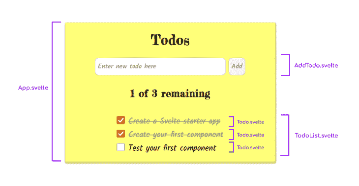
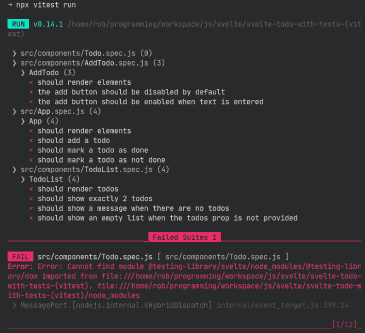
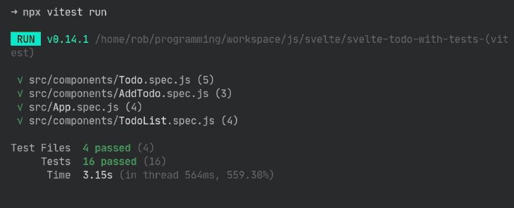
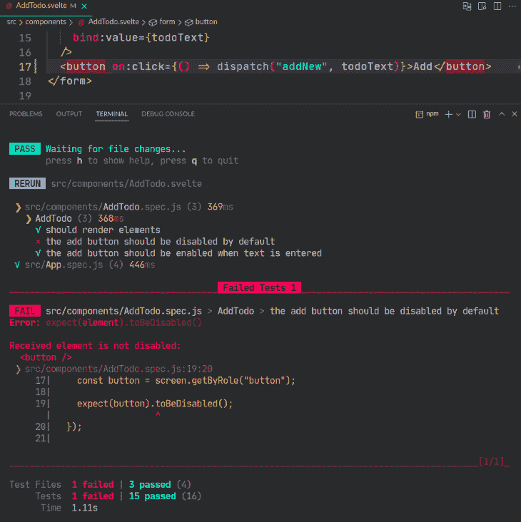
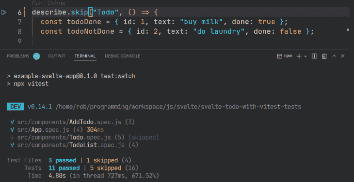
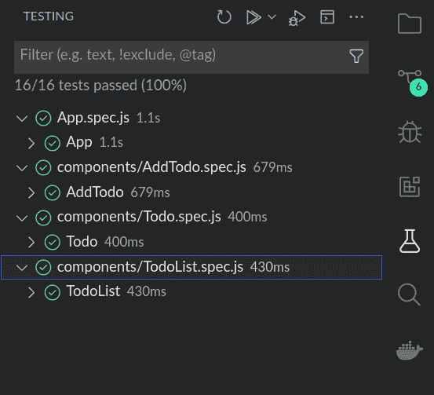

# 用 Vitest 测试一个苗条的应用程序

> 原文：<https://blog.logrocket.com/testing-svelte-app-vitest/>

Vite 已经成为前端工具链的关键。这个构建工具也被 [SvelteKit](https://kit.svelte.dev/) 采用，后者是 [Svelte](https://svelte.dev/) 的官方应用框架。所以，我认为公平地说，Vite 已经成为苗条者的首选开发工具。

[Vitest](https://vitest.dev/) 是一个相对较新的、[Vite](https://vitejs.dev/)-原生单元测试框架。它拥有成为 Vite 理想测试伙伴的[承诺，](https://blog.logrocket.com/testing-vite-minimal-config-using-vitest/)但是它能实现吗？

在本文中，我将探讨以下内容:

## Svelte 和 Vite 的测试框架

目前，Svelte 不推荐特定的单元测试框架，也不提倡特定的测试策略。官方网站提供一些[基本建议](https://svelte.dev/faq#how-do-i-test-svelte-apps)。理论上，你可以使用任何你喜欢的 JavaScript 单元测试库进行测试，你的前端工具链最终会吐出一个普通的 JavaScript 包，对吗？

嗯，这就是问题的症结所在；您正在处理与 JavaScript 相关的语法和格式的不同排列。这些格式被工具链转换成另一种格式。当不同的工具使用不同的语法，并且不能很好地协作时，将工具集成到工具链中是很棘手的。

Vite 通过使用本地 ECMAScript 模块(ESM)提供按需文件服务来提供快速开发环境。它执行 Svelte 到 JavaScript 的动态原子翻译。许多单元测试框架都是使用 [CommonJS 模块、](https://en.wikipedia.org/wiki/CommonJS)构建的，这是一种替代的模块标准。使用 Vite 来管理文件的翻译，然后将它们传递给用不同标准构建的测试框架，这可能会产生摩擦。

引用最受欢迎的团队:

> Vite 的单元测试故事还不清楚。像 [Jest](https://jestjs.io/) 这样的现有选项是在不同的上下文中创建的。Jest 和 Vite 之间有很多重复，迫使用户配置两个不同的管道。

Jest 可能是最流行的单元测试框架；在 2021 年的[JS 调查中，它名列榜首。](https://2021.stateofjs.com/en-US/libraries/testing/#testing_experience_ranking) Jest 与 Vite 的集成并不完整。有一个名为 [vite-jest](https://github.com/sodatea/vite-jest#readme) 的库，旨在为 [Jest](https://jestjs.io/) 提供一流的 vite 集成；然而，它目前是一项正在进行的工作。

Vite-jest 没有提到 Svelte，可能无法与 Svelte 一起工作。对于 SvelteKit，有一个名为 [svelte-add-jest](https://github.com/rossyman/svelte-add-jest) 的实验库。底线是，没有一种清晰、可靠的方式将 Jest 与 Vite 和 Svelte 结合使用。

在任何情况下，正如 Vitest 团队所提到的，Jest 和 Vite 之间存在重复工作。您最终会得到一个开发管道和一个测试管道。开玩笑的说，你可能正在使用 [Babel](https://babeljs.io/) 和一个插件来从 Svelte 翻译成 JavaScript。然后，您需要将一些附带的部分缝合在一起，使其工作。它变得有点像[鲁布·戈德堡机器](https://en.wikipedia.org/wiki/Rube_Goldberg_machine)。

我在另一篇文章中写过这个，[用 Jest](https://www.roboleary.net/2021/11/18/svelte-app-testing-jest.html) 测试一个苗条的应用。我创建了一个[启动模板](https://github.com/robole/svelte-vite-jest-template)来一起使用 Vite、svelite、Jest 和[svelite 测试库](https://testing-library.com/docs/svelte-testing-library/intro/)。它需要大约 10 个依赖项和两个额外的配置文件(`.babelrc`和`jest.config.json`)来创建测试管道。

拥有这种设置是很脆弱的，尤其是当你没有完全理解工具的内部工作原理的时候。我会祈祷对其中一个依赖项的更改不会打破这个链条！链接越多，失败的可能性就越大！如果你成为一个项目的维护者，这种感觉并不好！


Image credit: [XKCD](https://xkcd.com/2347/)

总之，更集成的解决方案是更可取的。Vite-native 解决方案甚至更好。带有 Jest 兼容 API 的 Vite-native 解决方案会更好！在一个配置文件中完成这一切将是一种享受！这可能是 Vitest 所能提供的。

首先，让我们浏览一下 API，看看我们的测试会是什么样子。

## 用 Vitest 编写测试

您可以阅读 Vitest [API 文档](https://vitest.dev/api/)以获得更多详细信息，但是为了回顾关键点，我将提供一个快速的 API 概述。

默认情况下，Vitest 会查找以`.spec.js`或`.test.js`结尾的文件名。如果您愿意，可以对其进行不同的配置。我将我的测试文件命名为`<component-name>.spec.js`，并将它们放在我的组件文件旁边。

API 兼容[柴](https://www.chaijs.com/)断言和 [Jest expect](https://jestjs.io/docs/expect) 。如果你以前用过这些，这个会很熟悉。关键位是:

*   `describe` blocks:用于将相关的测试分组到一个测试套件中；一个套件可以让你组织你的测试，因此报告是清晰的；如果您希望做进一步的聚合，也可以嵌套它们
*   `test`或`it`块:用于创建单独的测试
*   陈述:当你编写测试时，你需要检查值是否满足某些条件——这些被称为断言；`expect`函数提供了对几个[【匹配器】函数](https://jestjs.io/docs/using-matchers)的访问，这些函数允许您验证不同类型的东西(例如`toBeNull`、`toBeTruthy`)

下面是对我们的`Todo`组件进行一次测试的测试套件的基本框架:

```
import {describe, expect, it} from 'vitest';
import Todo from "./Todo.svelte";

describe("Todo", () => {
    let instance = null;

    beforeEach(() => {
        //create instance of the component and mount it
    })

    afterEach(() => {
        //destory/unmount instance
    })

    test("that the Todo is rendered", () => {
        expect(instance).toBeDefined();
    })
})

```

虽然您可以单独使用 Vitest 来运行测试，但是您必须创建一个组件实例，然后将它挂载到一个文档中。我们可以在`beforeEach`函数中做到这一点。您可能还需要在`afterEach`中销毁或卸载这个实例。这是繁琐的；这是最好避免的样板文件。

更常见的是使用[苗条测试库](https://testing-library.com/docs/svelte-testing-library/intro)，它帮助你走向良好的测试实践。它有一个`render`函数，为我们处理组件的渲染，并在内存中使用 [jsdom](https://github.com/jsdom/jsdom) 来完成。还可以获得更方便的 matcher 函数，比如`toBeInTheDocument()` by [jest-dom](https://testing-library.com/docs/ecosystem-jest-dom/) 库。

首先，您将使用以下命令安装库:

```
npm i -D @testing-library/svelte jest-dom jsdom

```

我不完全确定你是否需要自己安装 [jsdom](https://github.com/jsdom/jsdom) 。我可能被提示安装它；我记不清了！

现在，我们可以专注于编写测试。您可以看到，我们将组件名和属性传递给了`render`函数来呈现组件。然后，我们可以通过一个隐式的`screen`变量访问 HTML 输出。我们可以运行[查询方法](https://testing-library.com/docs/queries/about)来找到我们想要测试的页面元素。

```
import { render, screen } from "@testing-library/svelte";
import Todo from "./Todo.svelte";

describe("Todo", () => {
  const todoDone = { id: 1, text: "buy milk", done: true };
  const todoNotDone = { id: 2, text: "do laundry", done: false };

  test("shows the todo text when rendered", () => {
    render(Todo, { props: { todo: todoDone } });

    expect(screen.getByLabelText("Done")).toBeInTheDocument(); // checkbox
    expect(screen.getByText(todoDone.text)).toBeInTheDocument();
  });
});

```

## 将项目从 Jest 迁移到 Vitest

在 Vitest 网站上有一个简短的迁移指南。

(深呼吸)

我们走吧！

我将分叉[一个我以前做的 Todo 应用](https://github.com/robole/svelte-todo-with-tests)，然后用 Jest 和 Svelte 测试库测试。我在我的测试中使用了`<component_name>.spec.js`命名约定以及伴随的组件。它有 98.07%的覆盖率。

Todo 应用程序具有以下功能:

1.  列表待办事项:当列表中没有剩余的项目时，应用程序会显示消息，“恭喜，全部完成！”
2.  记录进度:用户可以标记待办事项已完成，取消标记仍需关注的待办事项；完成的待办事项具有不同的风格，带有灰色文本和删除线装饰。
3.  添加新的待办事项:用户可以添加新的待办事项，但是应用程序禁止添加空的待办事项

以下是组件的概述:



### 装置

首先，我们安装 Vitest。我用 npm 安装了它，但是您可以使用您选择的软件包管理器:

```
# with npm
npm i -D vitest

# or with yarn
yarn add -D vitest

# or with pnpm
pnpm add -D vitest

```

接下来，让我们检查一下我们是否拥有所有东西的最新版本。Vitest 需要 Vite v2.7.10+和节点 v14+。

对于 Vite，我使用的是 v2.6.4，所以我需要更新它。最快的方法就是跑:`npm i -D vite`。

我使用的节点是 v14.18.1，所以不需要更新。如果您需要更新节点，您可以[遵循本指南](https://phoenixnap.com/kb/update-node-js-version)。

### 配置

根据 [Vitest 迁移指南](https://vitest.dev/guide/migration.html):

> Jest 默认启用了他们的[全局 API](https://jestjs.io/docs/api) 。Vitest 没有。您可以通过`[globals](https://vitest.dev/config/#globals)` [配置设置](https://vitest.dev/config/#globals)启用全局变量，或者更新您的代码以使用来自`vitest`模块的导入。

让我们启用`[globals](https://vitest.dev/config/#globals)` [选项](https://vitest.dev/config/#globals)。下面是启用了全局选项的`vite.config.js`文件的样子:

```
import { defineConfig } from "vite";
import { svelte } from "@sveltejs/vite-plugin-svelte";

// https://vitejs.dev/config/
export default defineConfig({
  plugins: [svelte()],
  test: {
    globals: true,
  },
});

```

现在，让我们尝试运行 Vitest 命令:`npx vitest run`将运行一次测试。

运行该命令后，所有 16 个测试都失败了！



有两种类型的错误:

1.  找不到`@testing-library/svelte`节点模块:这是我们正在使用的测试库；我们可以回到这个话题
2.  `ReferenceError`:文档未定义:`document`对象在 jsdom 中定义；这用于模拟 DOM API

我猜默认情况下环境被设置为 Node，Jest 最近也做了同样的移动。让我们将环境变量改为`jsdom`:

```
export default defineConfig({
  plugins: [svelte()],
  test: {
    globals: true,
    environment: "jsdom",
  },
});

```

这就解决了文档错误。现在，四个测试通过了。但是，我们还有七次失败。

其余误差不同；他们被归类为无效柴`propertyError`。比如无效的柴属性:`toBeInTheDocument`。

`toBeInTheDocument`和`toBeEnabled`函数来自 [jest-dom](https://testing-library.com/docs/ecosystem-jest-dom/) 库，这是一个苗条测试库的伴侣。我们以前在测试文件中不需要 import 语句，因为我们配置了 Jest 来包含 jest-dom。下面是来自我们 Jest 配置文件(`jest.config.json`)的选项:

```
"setupFilesAfterEnv": ["@testing-library/jest-dom/extend-expect"]

```

为了在 Vitest 中做同样的事情，我们可以配置一个在每个测试文件之前运行的设置文件。我们可以通过`[setupFiles](https://vitest.dev/config/#setupfiles)` [选项](https://vitest.dev/config/#setupfiles)进行设置。

我们将创建一个包含以下`import`语句的`src/setuptest.js`文件:

```
import "@testing-library/jest-dom";

```

我们可以更新`vite.config.js`文件中的`test`对象，使其看起来像这样:

```
export default defineConfig({
  plugins: [svelte()],
  test: {
    globals: true,
    environment: "jsdom",
    setupFiles: ["src/setupTest.js"],
  },
});

```

现在，11 项测试通过，只有一项失败！我们快到了！

```
FAIL  src/components/Todo.spec.js [ src/components/Todo.spec.js ]
Error: Error: Cannot find module @testing-library/svelte/node_modules/@testing-library/dom imported from file:///home/rob/programming/workspace/js/svelte/svelte-todo-with-tests-(vitest), file:///home/rob/programming/workspace/js/svelte/svelte-todo-with-tests-(vitest)/node_modules
 ❯ MessagePort.[nodejs.internal.kHybridDispatch] internal/event_target.js:399:24

```

最后一个错误与`Todo.spec.js`文件中的第二个`import`语句有关:

```
import { render, screen } from "@testing-library/svelte";
import { fireEvent } from "@testing-library/svelte/node_modules/@testing-library/dom";

```

我不知道为什么我会有第二份这样的声明！`fireEvent`与第一条语句属于同一个库，所以我们应该能够将两条语句压缩成一条`import`，如下所示:

```
import { render, screen, fireEvent } from "@testing-library/svelte";

```

我们和好了吗？



是啊！16 项测试全部通过！🙌

现在，让我们整理一下`package.json`文件中的`scripts`:

```
scripts: {
    "test": "npx vitest",
    "coverage": "npx vitest run --coverage"
}

```

覆盖率报告需要一个额外的包， [c8](https://github.com/bcoe/c8) 。让我们安装这个包并运行覆盖率:

```
npm i -D c8
npm run coverage

```

以下是输出结果:


我们现在已经升级到 100%的覆盖率(开玩笑的话是 98.07%)。加分！🎁

最后，我们可以删除 Jest 相关的依赖项和配置。以下是我用来清理的命令:

```
rm jest.config.json .babelrc
npm uninstall -D @babel/preset-env babel-jest jest jest-transform-stub svelte-jester

```

我们删除了两个配置文件和五个依赖项。感觉自己在飘！🎈😄

这是这个项目的 GitHub repo。

### 关于 Vitest 迁移体验的思考

我给最棒的迁移体验打 7 分。如果您使用的是 jsdom、Svelte Testing Library 或 jest-dom，那么迁移指南会让您感觉很简短。这是几个额外的、很短的步骤，可能会让你挠头。如果那份文件有所改进，我会给它打 9 分。不用编辑测试文件就能让一切正常工作，这是一个惊喜。

* * *

### 更多来自 LogRocket 的精彩文章:

* * *

## Vitest 功能的性能

到目前为止，我们已经确认了 Vitest 的几个功能是有效的:

1.  苗条身材的组件测试
2.  通过 Vitest 使用苗条测试库
3.  使用 [jsdom](https://github.com/jsdom/jsdom) 测试内存中的文档
4.  [柴](https://www.chaijs.com/)内置用于断言和 [Jest expect](https://jestjs.io/docs/expect) 兼容的 API
5.  通过 [c8](https://github.com/bcoe/c8) 覆盖本地代码

现在，让我们使用我们的 Todo 项目来看看 Vitest 的其他一些重要特性。我在试着判断 Vitest 是否可以生产了。目前，Vitest 是 0.14.1 版本，所以我猜它仍然被认为是测试版。

### 智能即时手表模式

就像 Vite 在浏览器中的工作方式一样，Vitest 也知道你的模块的图形。这使得 Vitest 能够进行智能检测，并且只重新运行与变更相关的测试。根据 Vitest 团队的说法，它“……感觉几乎和 HMR 一样，只是为了测试”。

让我们用`npm run test`在 watch 模式下运行 Vitest，并更改其中一个组件文件。

让我们打开`AddTodo.svelte`文件，做一个突破性的改变。我将从`button`中移除`disabled`属性，这将触发一个失败的测试。



Vitest 只重新运行相关的测试套件(`AddTodo`和`App`)，我们得到一个失败的测试用例！运行测试套件需要 446 毫秒，而运行所有测试套件至少需要几秒钟！这种改进对生产率有很大帮助。

### 并发测试

我们可以将`.concurrent`添加到一个套件或单独的测试中，以并行运行它们:

```
import { render, screen, fireEvent } from "@testing-library/svelte";
import App from "./App.svelte";

describe.concurrent("App", () => {
  /* all tests run in parallel */
})

```

让我们看看这是否能加速测试！理论上，我的应用程序应该能够同时运行所有测试。

作为基线，运行我的四个测试套件从冷启动开始需要 5.11 秒。在测试套件变为并发的情况下运行它花费了 3.97 秒，一秒钟就过去了！🎉

### 内置的类型脚本支持

测试一个 TypeScript-Svelte 应用程序似乎效果不错。Johnny Magrippis 有一个关于这个话题的完整的视频教程。他用 SvelteKit 制作了一个小型的货币仪表盘，并用 Vitest 进行了测试。该代码可以在[这个 GitHub repo](https://github.com/jmagrippis/vitest-with-sveltekit) 中找到。

### 测试过滤:在命令行上定位测试

可以通过将名称/模式作为参数传递来过滤命令行上的测试文件。例如，以下命令将只运行包含单词`List`的文件:

```
npx vitest List

```

在我们的例子中，只运行了`TodoList.spec`文件。

#### 跳过套件和测试

您还可以将`.skip`添加到`describe`或`test`函数中，以避免运行某些套件或测试。



在这里，我通过向`describe`函数添加`.skip`来跳过`Todo`测试套件。正如您在上面看到的，输出通知您哪些测试套件和测试被跳过了。而且，颜色编码使它们很容易被发现。

## 使用 Vitest 和 SvelteKit

要将 Vitest 与 SvelteKit 一起使用，您需要添加测试依赖项:

```
npm i -D vitest @testing-library/svelte jest-dom jsdom

```

接下来，我们需要添加我在 Jest to Vitest 迁移示例中分享的相同配置。但是，我们到底把配置放在哪里呢？

### 快速而肮脏的方法

我采用的方法是将我的配置放在项目根目录下一个名为`vitest.config.js`的文件中。该文件包含以下代码:

```
import { defineConfig } from "vite";
import { svelte } from "@sveltejs/vite-plugin-svelte";

// https://vitejs.dev/config/
export default defineConfig({
  plugins: [svelte({ hot: !process.env.VITEST })],
  test: {
    globals: true,
    environment: "jsdom",
    setupFiles: ["src/setupTest.js"],
  },
});

```

我还添加了导入`jest-dom`的`src/setupTest.js`文件。这使我们不必为每个文件添加`import`语句。`src/setupTest.js`文件包含以下内容:

```
import "@testing-library/jest-dom";

```

这是可行的，但是我在做可疑的事情吗？

我不确定。但是，还有另一种方式，我看到有人提到过。

### 正确的方法？

SvelteKit 配置位于项目根目录下的`[svelte.config.js](https://kit.svelte.dev/docs/configuration)`文件中。有一个 [Vite 选项](https://kit.svelte.dev/docs/configuration#vite)，它将一个 [Vite 配置对象](https://vitejs.dev/config)作为它的值。最好在这里添加与 Vitest 相关的选项，这样我们就可以在一个配置中拥有一切。我试过了，但没用！

我注意到 Johnny Magrippis 添加了一个名为 [vitest-svelte-kit](https://github.com/nickbreaton/vitest-svelte-kit) 的库，以便将与 vitest 相关的选项直接添加到`[svelte.config.js](https://kit.svelte.dev/docs/configuration)`文件中。但是，这不会自动运行。要使用这种技术，您需要执行以下操作:

首先，安装 vitest-svelte-kit:

```
npm i -D vitest-svelte-kit

```

接下来，将测试相关的内容添加到`vite`对象中的`svelte.config.js`文件中:

```
import adapter from "@sveltejs/adapter-auto"
import preprocess from "svelte-preprocess"

/** @type {import('@sveltejs/kit').Config} */
const config = {
    // Consult https://github.com/sveltejs/svelte-preprocess
    // for more information about preprocessors
    preprocess: preprocess(),

    kit: {
        adapter: adapter(),
        vite: {
            test: {
                environment: "jsdom",
                globals: true,
                setupFiles: 'src/setupTests.ts',
            },
        },
    },
}

export default config

```

然后，创建一个`vitest.config.js`文件并公开库中的一个函数:

```
import { extractFromSvelteConfig } from "vitest-svelte-kit"

export default extractFromSvelteConfig()

```

我猜 vitest-svelte kit 还没有完全解决所有的问题，但就我所知，它对我来说很好。

后来希望有一个[加法器](https://github.com/svelte-add/svelte-add)。加法器是向 SvelteKit 项目添加集成的简单方法。当你在命令行上创建一个新的应用程序时，一个加法器将使得包含 Vitest 成为可能。这将提供一条成熟的道路。因此，我们还没有完全实现一个配置文件。

我很惊讶地看到 Vitest 已经被很好地支持在浏览器和 IDE 中进行测试。现在，让我们看看 Vitest 是如何与 Web UI 和 IDE 集成的。

### Web 用户界面集成

您可以在 web UI 中使用 Vitest。它需要一个额外的包，您应该用`--ui`标志运行它:

```
npm i -D @vitest/ui

```

接下来，您可以通过传递`--ui`标志来启动 Vitest:

```
npx vitest --ui

```

然后，您可以在`[http://localhost:51204/__vitest__/](http://localhost:51204/__vitest__/)`访问 Vitest UI。

但是，我在 Ubuntu 上的任何浏览器都没有看到结果！🙈我只看到一条细细的绿线！

### IDE 集成

您也可以在 IDE 中使用 Vitest。VS 代码有一个[扩展，JetBrains 产品有一个](https://marketplace.visualstudio.com/items?itemName=ZixuanChen.vitest-explorer)[插件。](https://plugins.jetbrains.com/plugin/19220-vitest-runner)

我尝试了一下 VS 代码扩展，效果很好。它提供了一个侧边栏视图，您可以在其中运行测试。它可以通过将您带到失败测试的代码来启动调试会话。



## 结论

我对 Vitest 印象深刻。它很快，智能手表模式很棒，比竞争对手更容易配置，并且它融合了其他框架的最佳实践，提供了熟悉的测试体验。

能够将现有项目从 Jest 迁移到 Vitest，而不需要更改测试文件，这是一个巨大的胜利。我认为用 Vitest 搭配 Svelte 和 SvelteKit 几乎是显而易见的。

虽然我确实带着 Vitest 通过了一个小应用程序的测试，但我不能说在处理一个更大的项目时是否有任何问题，也不能说它如何管理更复杂的测试用例。我想如果你在一个生产应用程序上使用它，你将处于一个开拓性的空间；所以这里有一些风险因素。

如果您已经在项目中使用 Jest，您可以在 Jest 旁边试验 Vitest，而不需要干预您的测试文件。如果你在这个阵营中，这个策略会让你降低风险。

总的来说，我建议使用 Vitest 和 Svelte。它有资金支持，全职团队成员，和一个强大的社区，我希望 Vitest 有一个光明的未来！

## 使用 [LogRocket](https://lp.logrocket.com/blg/signup) 消除传统错误报告的干扰

[](https://lp.logrocket.com/blg/signup)

[LogRocket](https://lp.logrocket.com/blg/signup) 是一个数字体验分析解决方案，它可以保护您免受数百个假阳性错误警报的影响，只针对几个真正重要的项目。LogRocket 会告诉您应用程序中实际影响用户的最具影响力的 bug 和 UX 问题。

然后，使用具有深层技术遥测的会话重放来确切地查看用户看到了什么以及是什么导致了问题，就像你在他们身后看一样。

LogRocket 自动聚合客户端错误、JS 异常、前端性能指标和用户交互。然后 LogRocket 使用机器学习来告诉你哪些问题正在影响大多数用户，并提供你需要修复它的上下文。

关注重要的 bug—[今天就试试 LogRocket】。](https://lp.logrocket.com/blg/signup-issue-free)