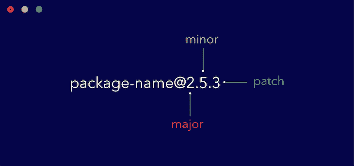

# 向 npm - LogRocket 博客发布 React 包的完整指南

> 原文：<https://blog.logrocket.com/the-complete-guide-to-publishing-a-react-package-to-npm/>

所以您想将 React 组件作为包发布到 npm？本指南将提供你需要的所有信息，即使你对此完全陌生。

我最近构建并发布了一个针对 npm 的 React 包，我对现有的关于如何实现它的信息感到惊讶。我在网上找到了一些文章，但它们要么不够深入，要么是针对普通 JavaScript 的。

本指南是我对 npm ( [命令](https://docs.npmjs.com/cli/npm)和[注册表](https://docs.npmjs.com/misc/registry))、文档、[版本控制](https://docs.npmjs.com/about-semantic-versioning)和无处不在的`[package.json](https://docs.npmjs.com/files/package.json)`)的所有了解的结晶。要遵循本指南，您应该:

1.  熟悉 TypeScript + React
2.  拥有 GitHub 帐户
3.  拥有一个 npm 帐户
4.  喝一杯咖啡(或不喝)

如果你只对代码感兴趣，你可以在这里找到一个[快速入门模板。](https://github.com/ovieokeh/npm-react-typescript-template)

您可以选择使用 JavaScript 或 TypeScript 来构建您的包。对于本教程，我将选择 TypeScript，因为已经有 JavaScript 教程了。

即使你决定使用普通的 JavaScript，你也应该浏览一下这个指南，因为我将涉及一些重要的通用主题。

## 你尽职调查了吗？

在尝试发布包之前，请考虑搜索具有类似功能的现有包。您可能会惊讶地发现，可能已经有了满足您需求的解决方案。

这样做将有助于我们减少 npm 上重复包的数量，并减少新开发人员在选择包时的困惑。鉴于 npm 上的软件包是开源的，你仍然可以为项目贡献你的专业知识，这对参与的每个人来说都是双赢的。

进行尽职调查的另一个好处是，它可以防止你构建一个没有人会使用的包(多亏了更流行的替代方案)。

如果您已经做了尽职调查，并且发现没有现有的类似包，那么您可以随心所欲地构建。解决了这个问题，是时候深入研究这个问题了。

## 国家预防机制登记册

您可能已经熟悉了终端上的`npm`命令。这就是你如何管理你对一个节点项目的依赖(以及目前的前端工作)。您可能不熟悉的是 npm 注册表。

[npm registry](https://www.npmjs.com/) 是一个可重用的开源 JavaScript 包的集合，任何开发人员或组织都可以安装和使用，我们将在这里发布我们的包，供其他开发人员使用。

若要发布到 npm 注册表，您需要一个免费帐户。只需访问[注册页面](https://www.npmjs.com/signup)并填写表格。您现在应该拥有一个帐户，可以向 npm 发布内容。现在我们来谈谈注册表上的包。

npm 上的[包](https://docs.npmjs.com/about-packages-and-modules#about-packages)就是一个由`package.json`文件描述的文件或目录。它可以是一组简单的实用函数([下划线](https://underscorejs.org/))，一个网络库( [Axios](https://github.com/axios/axios) )，甚至是一个 React 组件。

注册表中有不同种类的包:

### 公共包

公共包是 npm 上最常见的类型。它们可以公开访问，通常看起来像`package-name`。要安装一个公共包，你应该运行`npm install package-name`或者`yarn add package-name`。

### 私人套餐

默认情况下，公共用户不能访问私有包。这些对于在组织内共享的自定义包非常有用。要在 npm 上发布私有包，您需要一个付费用户或组织帐户。

私有包也是作用域包，这意味着它们采用格式`@scope/package-name`。这使得不可能为您的私有包保留有用的通用名称。

然而，需要注意的是，尽管所有的私有包都有作用域，但并不是所有的作用域包都是私有的。

### 范围包

作用域包属于一个名称空间，通常用于对相关包的集合进行分组。它使您能够创建与其他用户或组织创建的包同名的包。根据[微软文档](https://docs.microsoft.com/en-us/cpp/cpp/namespaces-cpp?view=vs-2019):

> 名字空间是一个声明性区域，它为标识符(类型、函数、变量等的名称)提供一个范围。)在里面。”

它们采用格式`@scope/package-name`，其中范围通常是您的用户名或 npm 上的组织名。默认情况下，作用域包是私有的，但是在发布时，您可以向`npm publish`命令传递一个标志，使其成为公共的。

## 语义版本控制

一旦您将一个包发布到 npm，您需要确保您最终将推送到您的包的所有更改都被很好地跟踪。例如，当你引入一个突破性的改变时，这样你就不会让你的包的用户感到困惑。

典型的包版本看起来是这样的:`[[email protected]](/cdn-cgi/l/email-protection)`。新的包通常从版本`1.0.0`开始，并根据[已建立的语义版本约定](https://docs.npmjs.com/about-semantic-versioning)进行增量更新。

在下图中，你可以看到第一个数字表示**主**版本。主要版本中的任何差异通常意味着已经包含了突破性的变化。第二个数字表示**的次要**版本，表示已经添加了向后兼容的特性。最后一个数字，**补丁**，是为向后兼容的 bug 修复保留的。



所以让我们回顾一下我们所知道的语义版本化:

1.  新包从版本`1.0.0`开始
2.  增加第一个数字意味着向后不兼容的特性已经包括在内(`2.0.0`)。递增时，第二位和最后一位数字重置为零
3.  增加第二个数字意味着已经包含了向后兼容的特性(`2.1.0`)。递增时，最后一位数字重置为零
4.  增加最后一个数字意味着向后兼容的错误修复已经被包括在内(`2.1.1`)

在实践中，您不需要自己手动实现这些。`npm version`命令负责所有这些，接下来，我们将看看如何使用它来更新我们的包版本。

对于 Git 用户来说，`npm version`命令还能做更多的事情。每当你升级到新版本时，它会自动为你创建一个标签。这允许您只需签出标签，就可以在特定的版本中浏览您的代码。您可以通过运行`git tag`浏览您的所有标签。

不过，需要注意的是:`git push`默认情况下不会将标签推送到原点。您必须通过传递`--tags`命令来手动告诉它，就像这样:

```
git push --tags
```

这就是你需要知道的关于语义版本化的全部内容。

## 包装捆绑

如果你想让你的包在不同的代码库上工作，传输和打包一个包是必须的。如果你想使用像 TypeScript 这样的 JavaScript 风格或者使用 ES6 的一些新特性，你需要转换你的源代码以确保它在任何地方都能工作。

基本上，您可以使用您想要的任何风格的 JavaScript 编写您的源代码，并将您的代码移植到您的所有目标平台上。这通常是通过像 [webpack](https://webpack.js.org/) 或 [Rollup](https://rollupjs.org/) 这样的包来完成的。

对于本指南，我们将重点介绍 Rollup，因为它既健壮又简单，即使初学者也可以在几天内掌握它。在构建示例项目时，我们将:

*   用 TypeScript 编写 React 代码
*   向下转换到 ES5
*   生成一个`index.d.ts`文件，以便 TypeScript 用户可以从默认提供的类型中受益

这些打包器的好处是它们还会处理你的包所需要的任何图像和 CSS(包括 [Sass](https://sass-lang.com/) 和更少的内容)。这使您可以专注于实际的业务逻辑，让您的 bundler 担心如何使它在其他环境中工作。

拥有像 Rollup 这样的 transpiler 的一个优点是，你可以同时使用一个或两个模块系统(require vs. import)。在这里了解更多关于 [JavaScript 模块系统的信息。](https://www.educba.com/require-vs-import/)

幸运的是，设置汇总并不是一个复杂的过程。我们需要一个`rollup.config.js`文件来配置 Rollup 以满足我们的需求，但是在这种情况下我们的需求是什么呢？我们需要:

1.  将我们的 TypeScript + React 代码转换成普通的 ES5 JavaScript
2.  包含 TypeScript 用户的类型定义
3.  包括用于调试的源地图

为了完成所有这些，我们将需要一些 [Rollup 插件](https://rollupjs.org/guide/en/#using-plugins)，我们将在构建我们的示例项目时查看这些插件。基本上，需要插件来扩展 Rollup 的功能。一个例子是配置它来处理 Sass 文件。

你可以在这里得到一个模板。

## 包装测试

一旦你的包裹被运输并准备好发货，你需要一种方法来测试它是否正常工作。

最低效的方法是将您的包发布到 npm，并通过将它安装到一个示例项目中来手动测试它。这是不可取的，因为你可能会最终发布错误的代码到注册表中，供其他开发人员使用。

您需要的是一种在本地测试它的方法，以确保在发布到 npm 之前一切正常。 [`npm link`命令](https://docs.npmjs.com/cli-commands/link.html)会帮你处理。使用`npm link`，您将能够在本地公开您的包，并在本地项目中使用它，就像您从 npm 下载包一样。

但是，请注意，这并不能取代单元测试——您可能仍然需要通过测试获得的额外信心😃。

然而，在本指南中，我不会详细介绍如何建立单元测试，因为已经有[大量关于这个主题的信息](https://reactjs.org/docs/testing.html)可用，并且当我们构建我们的示例项目时，我们将获得与`npm link`进一步合作的实际知识。

## 证明文件

您需要一种方法来教育开发人员如何使用您的软件包。这就是文档的用途，除了最没用的包之外，它对所有的包都是必要的。

有不同的方法可以记录你的包。您可以选择将文档托管在一个自定义域上，并从您的`README.md`文件链接到它。您甚至可以决定变得更有趣，为开发人员提供一个故事书游乐场来试用您的软件包。

然而，最简单的方法——也是我在本指南中选择的方法——是简单地将文档包含在您的`README.md`文件中。好的文档通常包含:

*   创建包的原因
*   这个包解决了什么问题
*   包装如何解决问题
*   包的所有有效配置/属性
*   示例片段
*   运行中的软件包演示
*   投稿人须知

如果你能在你的`README.md`文件中包括以上所有内容，你就可以开始了。一个很好的例子是 GitHub 上的[汇总包文档](https://github.com/rollup/rollup)。

## 项目

我知道许多开发人员通过实践来学习，所以我们将构建一个非常小的包，并应用到目前为止我们已经提到的所有概念。

这是一个简单的计数器包，从 0 到 100 开始计数，然后重置回 0。它接受一个单独的`className`道具，看起来像这样:


作为一个快速提示，在构建这个包时，我们将应用到目前为止我们所学的以下概念:

*   语义版本控制
*   包装捆绑
*   包装测试
*   证明文件

对于此包，我们将使用以下技术:

*   反应(明显)
*   以打字打的文件
*   厚颜无耻

为了使本指南简明扼要，我将不解释 React 和 Sass 代码。相反，我将链接到它，你可以简单地复制和粘贴它。或者你可以[复制回购](https://github.com/ovieokeh/dummy-counter)并按照指南进行操作。你可以看看下面的 CodeSandbox 游乐场:

设置项目

## 谢天谢地，建立这个项目并不需要太多。我们只需要以下文件和文件夹:

`src`–保存源代码的文件夹

1.  `package.json`–描述包的文件
2.  `README.md`–文件以记录包装
3.  `rollup.config.js`–用于配置汇总的文件
4.  `tsconfig.json`–用于配置类型脚本的文件
5.  `.npmignore`–告诉 npm 应该将哪些文件捆绑到包中的文件
6.  还有一些其他文件，如`.gitignore`、`.prettierrc`和`LICENSE`文件，我选择不浏览它们，因为它们非常简单明了。解决了这个问题，是时候构建一些东西了。

构建 React 包

## 这是一个简单的 React 包，由一个`index.tsx`文件和一个`styles.scss`文件组成，用于样式化。

让我们从在 Github 上创建一个新的 repo 并将其克隆到您的本地机器开始。按照[这里的步骤](https://help.github.com/en/github/creating-cloning-and-archiving-repositories/creating-a-new-repository)创建一个**公共**回购(带有一个节点`.gitignore`和一个你选择的许可),然后将它克隆到你的计算机上。此时，您的文件夹将只包含两个文件:

`.gitignore`

1.  `LICENSE`
2.  现在我们将通过运行`npm init -y`来初始化一个新的节点项目。接下来，我们将安装 React 和所有其他与 React 相关的包。

安装完以上软件包后，创建`src`文件夹以及`index.tsx`和`styles.scss`，如下所示:

```
npm i -D react react-dom typescript @types/react @types/react-dom
```

从这里复制粘贴`index.tsx` [的内容](https://github.com/ovieokeh/dummy-counter/blob/master/src/index.tsx)

```
mkdir src && touch src/index.tsx src/styles.scss
```

*   从这里复制粘贴`styles.scss` [的内容](https://github.com/ovieokeh/dummy-counter/blob/master/src/styles.scss)
*   我们已经完成了 React 方面的工作，所以请花些时间浏览一下代码。您会注意到，我们将组件导出为默认导出，并将组件的类型导出为命名导出。这对于 TypeScript 用户来说很方便，他们可以从 sweet VS Code 智能感知中受益。

接下来我们要做的是设置我们的 TypeScript 配置。通过运行`touch tsconfig.json`创建一个名为`tsconfig.json`的新文件，并粘贴以下内容:

要理解这些字段的含义，请浏览打字手册上的 [`tsconfig.json`条目](https://www.typescriptlang.org/docs/handbook/tsconfig-json.html)，因为它们能更好地解释它们。

```
{
  "compilerOptions": {
    "outDir": "dist",
    "module": "esnext",
    "target": "es5",
    "lib": ["es6", "dom", "es2016", "es2017"],
    "sourceMap": true,
    "allowJs": false,
    "jsx": "react",
    "declaration": true,
    "moduleResolution": "node",
    "forceConsistentCasingInFileNames": true,
    "noImplicitReturns": true,
    "noImplicitThis": true,
    "noImplicitAny": true,
    "strictNullChecks": true,
    "suppressImplicitAnyIndexErrors": true,
    "noUnusedLocals": true,
    "noUnusedParameters": true
  },
  "include": ["src"],
  "exclude": ["node_modules", "dist", "example", "rollup.config.js"]
}
```

是时候设置 Rollup 来捆绑我们的包了。

设置累计

## [Rollup](https://rollupjs.org/) 是一个以简单为宗旨的软件包。它也是非常可扩展的，通过一些可用的插件，会给你额外的功能。让我们安装 Rollup 和这个项目中需要的所有插件(我们还需要 [Babel](https://babeljs.io/) ，因为它在传输过程中在内部使用)。

在安装完所有需要的包之后，我们将创建一个配置文件，告诉 Rollup 我们希望这个包如何捆绑。通过运行`touch rollup.config.js`创建一个`rollup.config.js`文件，我们将一点一点地填充这个文件。

```
npm i -D rollup rollup-plugin-typescript2 rollup-plugin-sass babel-core babel-runtime
```

首先，我们希望引入我们已经安装的汇总插件，因此粘贴以下内容:

Sass 插件将帮助我们将 Sass 代码转换成普通的 CSS，并将其注入到我们的最终版本中(用户不必单独导入 CSS)。TypeScript 插件将帮助我们把我们的 TypeScript 代码转换成 ES5 JavaScript。

```
import sass from 'rollup-plugin-sass'
import typescript from 'rollup-plugin-typescript2'

import pkg from './package.json'

// to be continued
```

接下来，我们将`package.json`文件作为一个模块导入，这样我们就可以在配置中使用它的一些属性。

我们必须在配置文件中再配置四个字段，然后我们将完成 Rollup。

`input`–告诉 Rollup 哪个文件是根文件(将其视为所有其他文件的父文件)

*   `output`–告诉汇总将文件捆绑到何处以及以何种格式捆绑
*   `plugins`–告诉汇总我们想要使用哪些插件以及每个插件的配置
*   `externals`–告诉汇总包使用的哪些模块应该由主机环境提供(无论它在哪里使用)
*   解释完毕后，粘贴以下内容:

您可以通过[汇总文档](https://rollupjs.org/guide/en/#big-list-of-options)进一步了解这些字段的作用以及它们可能接受的有效值。

```
// continued
export default {
  input: 'src/index.tsx',
  output: [
    {
      file: pkg.main,
      format: 'cjs',
      exports: 'named',
      sourcemap: true,
      strict: false
    }
  ],
  plugins: [
    sass({ insert: true }),
    typescript({ objectHashIgnoreUnknownHack: true })
  ],
  external: ['react', 'react-dom']
}
```

信不信由你，我们实际上已经完成了配置汇总。现在剩下的就是更新`package.json`来添加所需的脚本和一些其他信息。

更新`package.json`

## 现在我们已经有了源代码，并配置了 Rollup 来传输我们的代码，我们必须更新我们的`package.json`文件，以包含一些新的脚本来简化开发以及一些其他信息。

首先，更新`main`字段以包含`"dist/index.js"`。然后，更新`scripts`字段，如下所示:

这将允许我们简单地运行`npm run build`或`yarn build`来传输和打包我们的包。使用`npm run start`或`yarn start`将使我们能够在“观察”模式下进行更快的测试。

```
"scripts": {
  "build": "rollup -c",
  "start": "rollup -c -w"
},
```

接下来，添加一个`peerDependencies`字段并粘贴以下值:

只有当你发布一个包时,`peerDependencies`字段才是必需的，就像我们正在做的一样。以下是摘自[纱线文档](https://classic.yarnpkg.com/en/docs/dependency-types/#toc-peerdependencies)的解释:

```
"peerDependencies": {
  "react": "^16.8.0",
  "react-dom": "^16.8.0"
},
```

具有对等依赖意味着您的软件包需要一个与安装您的软件包的人完全相同的依赖。这对于像`react`这样需要有一个`react-dom`副本的包来说很有用，这个副本也是安装它的人使用的。

> 在这种情况下，我们只是告诉 npm，无论是谁安装这个包，都需要安装 React 和 React DOM 的副本，这两个版本都高于`v16.8.0`。

最后，添加一个`files`字段，并将其设置为包含`"dist"`的数组，如下所示:

这只是告诉 npm，当有人安装我们的包时，应该只安装`dist`文件夹。

```
"files": ["dist"]
```

我们已经完成了`package.json`，是时候在编写文档和发布之前在本地测试我们的包了。

测试包

## 为了确保我们的包如预期的那样工作，我们需要一种方法在发布它并提供给公众使用之前在本地测试它。

因为我们已经有了构建包的脚本设置，我们将简单地运行`npm run build`来将我们的包捆绑到`dist`文件夹中。运行构建命令后，您可以决定自己检查一下`dist`文件夹来查看输出。注意它是如何发出`index.d.ts`的，以便 TypeScript 用户可以导入您的定制类型。

**注意**:如果运行`npm run build`并且输出不在`dist`文件夹中，确保`package.json`中的`main`字段显示`dist/index.js`。

> 构建包是一回事，但测试它完全是另一回事。我们要做的是将这个包安装到另一个单独的包中，并按原样使用它。

为此，我们将使用`yarn link`命令(本质上与`npm link`相同，但输出更好)。`yarn link`命令将简单地把一个本地包链接到另一个本地包，使你可以像从注册表安装一样使用它。

运行 build 命令后，在项目根目录下运行`yarn link`。您应该得到类似于以下内容的输出:

导航到本地机器上任何现有的 React 项目——如果没有，只需[使用 CRA](https://reactjs.org/docs/create-a-new-react-app.html#create-react-app) 创建一个基本的 React 应用程序——并通过运行包根目录中的`yarn link "dummy-counter"`将`dummy-counter`包链接到项目。

```
You can now run `yarn link "dummy-counter"` in the projects where you want to use this package and it will be used instead.
```

这将使我们能够导入`dummy-counter`包，就像我们通过运行`npm install dummy-counter`来安装它一样。然而，如果你现在尝试使用这个包，你会得到一个错误。

这是因为`dummy-counter`正在使用与您现有项目不同的 React 副本。要解决这个问题，导航回`dummy-counter`项目并运行`npm link ../path/to/your/project/node_modules/react`，其中`../path/to/your/project`应该是项目的实际路径。

例如，我有一个`workspace`文件夹，其中包含我所有的项目，如下所示:

在我的例子中，如果我想在`some-project`中使用`dummy-counter`，我会运行下面的命令:`npm link ../some-project/node_modules/react`。调整以适合您自己的项目路径。

```
workspace
  - dummy-counter
  - some-project
...
```

现在，我们可以导入并使用`dummy-counter`包了，就像这样:

然后，您可以编译您现有的项目，并在浏览器中打开它，以确认`dummy-counter`工作正常。在发布之前，您应该总是像这样手动测试您的包，以确保您只发布工作代码。当然，也建议进行单元测试。

```
import DummyCounter from 'dummy-counter'

const SomeProject = () => (
  <div>
    <DummyCounter />
  </div>
)
```

如果您准确地遵循了本指南，那么您现有的项目应该可以编译并运行，并且`DummyCounter`组件应该可以呈现到 DOM 中。接下来是文档。

编写文档

## 现在我们已经有了一个全功能的包，我们必须包含文档，以便其他开发人员知道如何使用这个包以及传递什么样的道具。

就像我之前说的，有不同的方法来处理文档。您可以选择一种更具交互性的方法，比如将文档托管在自定义域上，并提供沙箱、代码笔等交互式元素。

不过，我们的用例要简单得多，所以简单的基于文本的文档以及`README.md`文件上的代码片段就足够了。这就是我们接下来要做的。

`dummy-counter`包是一个非常简单的 React 组件，包含一个单独的道具，所以文档会反映这一点。从 GitHub 复制[示例文档到这里](https://github.com/ovieokeh/dummy-counter/blob/master/README.md)，打开`README.md`文件，粘贴内容。

您可以花一些时间浏览文档，您会注意到它包含以下信息:

创建包的原因

*   如何使用该软件包
*   包的所有有效配置/属性
*   示例片段
*   当然，它没有包含好的文档所需的所有信息，但是，这也不是一个好的包:它除了教育之外没有其他用途。

当您将这个包发布到 npm 时，这个`README.md`文件将被提取，其内容将被用作这个包的文档。现在让我们看看如何将这个包发布到 npm 注册中心。

发布包

## 我们已经完成了发布包的最难的部分。现在剩下的就是将这个包发布到 npm 注册中心，这样其他开发人员就可以使用它了。

为此，您将使用两个 npm 命令:

`npm login`

1.  `npm publish`
2.  首先，您将从 CLI 登录到您的 npm 帐户(我假设您之前已经创建了一个)。这是为了让 npm 知道哪个用户或组织是包的所有者。

从您的终端运行`npm login`

*   输入您的用户名
*   输入您的密码
*   输入你的电子邮件地址(这是公开的)并点击回车
*   您现在应该在终端上登录到您的 npm 帐户。接下来是实际发布包。从您的终端运行`npm publish`。

如果你正在发布一个有作用域的包，但是希望它是公共的，传递`--access`标志，就像这样:`npm publish --access public`。

您现在可以从任何环境运行`npm install your-package`，它将被安装到`node_modules`文件夹中。

请注意，因为`dummy-counter`是一个无用的包，只是为了演示的目的而创建的，我建议你不要发布它。

维护包

## 现在你有了一个成熟的在线包，其他开发者可以使用，你必须维护这个包。这包括添加新特性、修复 bug、优化包大小等。

每当您发布对您的包的任何更改时，您必须根据引入的更改的严重性和范围来更新包的版本号。还记得包是如何版本化的吗？

典型的包版本类似于`[[email protected]](/cdn-cgi/l/email-protection)`，其中:

第一个数字(本例中为 1)表示主要版本，当引入向后不兼容的更改时，这个数字会增加

*   第二个数字(本例中为 2)表示次要版本，当引入向后兼容的更改时，这个数字会增加
*   最后一个数字(本例中为 3)表示补丁版本，当引入向后兼容的错误修复时，该数字会增加
*   让我们回到我们的`dummy-counter`套餐。

假设我们改变了包的核心功能，允许它接受计数而不是自动计数。这种改变是向后不兼容的，因为这个包不再像以前那样工作了。这是一个重大变化的例子，我们将通过增加第一个数字来传达，如下所示:

请注意，我们实际上并没有指定要增加到的新版本。这个新版本是由`npm version`命令根据以前的版本自动确定的。它包含三个可能的选项:

```
// before update, dummy-counter is @1.0.0

npm version major

// after update, dummy-counter is now @2.0.0
```

`major`–用于递增第一个数字

1.  `minor`–用于递增第二位数字
2.  `patch`–递增最后一位数字
3.  让我们考虑另一个变化。这一次，我们想要添加一个名为`mode`的新道具，它根据传递的值将计数器的背景切换为暗或亮。这个改动不影响之前的`className`道具，所以是向后兼容的。

我们会像这样更新版本号:

最后一个场景。假设我们发现了一个错误，计数器从 1 开始计数，而不是从 0 开始计数，我们想修复这个错误。因为这不会破坏开发人员使用产品的方式，这是一个向后兼容的修复，所以我们只增加最后一位数字:

```
// before update, dummy-counter is @2.0.0

npm version minor

// after update, dummy-counter is now @2.1.0
```

请记住一些规则:

```
// before update, dummy-counter is @2.1.0

npm version patch

// after update, dummy-counter is now @2.1.1
```

包装开始于`@1.0.0`

*   更新**主**版本时，将最后两位重置为零
*   更新**次要**版本时，将最后一位数字重置为零
*   记住这些规则，你应该没问题。

结论

## 以 npm 包的形式分享你的问题解决方案是一项非常有成就感的工作(尽管报酬很低)——它可以帮助你获得同事的认可，加快你的职业生涯，或者通过允许更容易的代码重用来帮助你更快地工作。

虽然本指南应该能够让你开始你的第一个包，但随着你在职业生涯中发布更多的包，你还有很多要学习的。有一点需要注意的是，作为一个发布者，你所做的任何改变都会直接影响到其他人，所以在做某些决定时要记住这一点。

希望这篇文章对你有所帮助。如果你能读到最后，你很棒，你值得拥有以你命名的星座。干杯，快乐编码❤️.

[LogRocket](https://lp.logrocket.com/blg/react-signup-general) :全面了解您的生产 React 应用

## 调试 React 应用程序可能很困难，尤其是当用户遇到难以重现的问题时。如果您对监视和跟踪 Redux 状态、自动显示 JavaScript 错误以及跟踪缓慢的网络请求和组件加载时间感兴趣，

.

[try LogRocket](https://lp.logrocket.com/blg/react-signup-general)

LogRocket 结合了会话回放、产品分析和错误跟踪，使软件团队能够创建理想的 web 和移动产品体验。这对你来说意味着什么？

[ ](https://lp.logrocket.com/blg/react-signup-general) [](https://lp.logrocket.com/blg/react-signup-general) 

LogRocket 不是猜测错误发生的原因，也不是要求用户提供截图和日志转储，而是让您回放问题，就像它们发生在您自己的浏览器中一样，以快速了解哪里出错了。

不再有嘈杂的警报。智能错误跟踪允许您对问题进行分类，然后从中学习。获得有影响的用户问题的通知，而不是误报。警报越少，有用的信号越多。

LogRocket Redux 中间件包为您的用户会话增加了一层额外的可见性。LogRocket 记录 Redux 存储中的所有操作和状态。

现代化您调试 React 应用的方式— [开始免费监控](https://lp.logrocket.com/blg/react-signup-general)。

Modernize how you debug your React apps — [start monitoring for free](https://lp.logrocket.com/blg/react-signup-general).