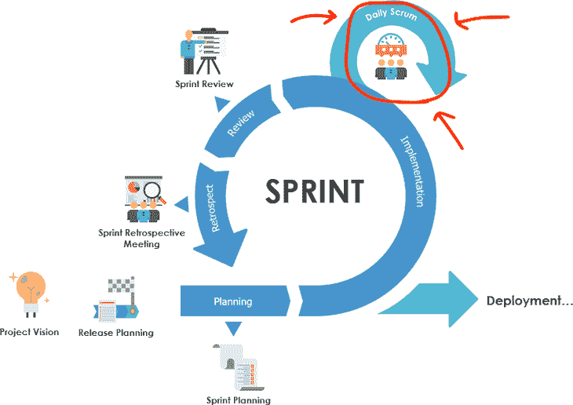
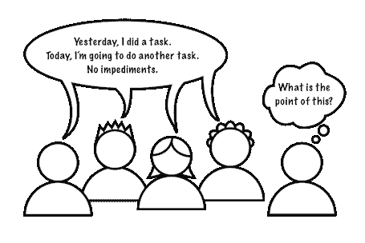

# 每日 scrum 会议:概述，最佳实践，反模式

> 原文：<https://blog.logrocket.com/product-management/the-daily-scrum-meeting-overview-best-practices-anti-patterns/>

在本指南中，我们将概述每日 scrum 会议，也称为每日站立会议，这是敏捷产品经理和开发团队实践的 scrum 仪式。

我们将讨论每日 scrum 仪式的目的和目标，谁参加和主持会议，以及典型的会议议程包括什么。我们还将列出一些可能会破坏 scrum 的常见反模式，以及帮助您避免这些陷阱的技巧和最佳实践。

* * *

## 目录

* * *

## 敏捷中的每日 scrum 是什么？

在敏捷软件开发中，[每日 scrum](https://blog.logrocket.com/product-management/what-are-five-types-of-scrum-meetings/#daily-scrum) ，也称为每日站立，是冲刺阶段每天发生一次的 scrum 事件。

像大多数 scrum 事件一样，每日站立是一个有时间限制的事件，通常不会超过 15 分钟。在每日的 scrum 中，团队成员聚在一起同步并计划他们当天的活动。

Source: [Visual Paradigm](https://www.visual-paradigm.com/scrum/what-is-sprint-retrospective-meeting/)

每日的 scrum 为团队提供了一个机会来分享前一天的成果和当天的计划。这为团队在 sprint 中的进展提供了透明度，使团队成员能够在必要时调整他们的工作。

每日站立是几个 scrum 事件中的一个，旨在促进透明、检查和适应的 scrum 支柱:团队进展的透明，检查与实现 sprint 目标相关的进展，以及需要时的适应。

## 每日 scrum 的目的是什么？

每日站立会议的目的是检查朝着 sprint 目标取得的进展，并在必要时调整工作。这确保了团队的工作和进展对所有团队成员都是可见的，并为团队提供了定期的反馈循环。

作为一名产品经理，根据从日常会议中获得的新信息，与团队讨论权衡和调整优先级是很常见的。

有效的每日 scrums 促进协作和自我组织。例如，每日站立会议鼓励整个团队协作，而不是让工具或经理来协调工作。

对于产品经理来说，这可能是一个游戏规则的改变者:不是需要联络、跟踪和管理整个团队的工作，每日站立鼓励团队成员自我组织并让彼此负责。

## 谁参加每天的 scrum 会议？

每日的 scrum 是为团队设计的，用于在 sprint 中协调和调整进度。至少，产品团队应该出席。通常情况下，邀请名单还应该包括[产品经理](https://blog.logrocket.com/product-management/what-does-a-product-manager-do-role-responsibilities/)和 [scrum 主管](https://www.scrum.org/resources/what-is-a-scrum-master)或交付经理。

虽然项目涉众和团队之外的其他人通常是受欢迎的，但是预期的观众是团队。团队以外的任何与会者都只能是观察员。

## 谁主持每天的 scrum 会议？

日常的混乱没有固定的主持人。有经验的团队通常会自我组织。

然而，根据团队的经验，以及他们是否足够幸运地在团队中有一个专门的 scrum master 或类似的领导者，日常站立通常由 scrum master 或产品经理来推动。

## 每日 scrum 会议议程模板

每天召开 scrum 会议没有固定的方式，但是有一些被广泛采用的方法。

每日脱口秀最常见的形式被称为[三个问题的形式](https://www.agilealliance.org/glossary/three-qs/)。每个团队成员轮流回答以下问题:

1.  我昨天实现了什么？
2.  我今天计划实现什么？
3.  实现我的计划有什么障碍吗？

每日混战最好在每天的同一时间同一地点举行。对于团队来说，在一天开始时举行每日的 scrum 是很常见的。但是，如果您的团队是分散的或者有兼职团队成员，您可能需要考虑一天中的什么时间对每个人最合适。

## 走墙(又名走板)

另一种方式——也是我最喜欢的方式——运行每日 scrum 被称为走墙(也称为走板)。

穿墙行动是这样进行的:不是让每个团队成员谈论他们昨天做了什么和今天计划做什么，而是你走过团队的 [k](https://www.atlassian.com/agile/kanban) [anban](https://www.atlassian.com/agile/kanban) 或任务板，给出每个项目的更新。

[https://www.youtube.com/embed/316qdj10j9M](https://www.youtube.com/embed/316qdj10j9M)

视频

从优先级最高的任务开始，团队讨论正在进行的每个项目，回顾昨天与该项目相关的已完成内容，并概述当天的计划。

走在墙上的形式将焦点从个人转移到工作上。它还鼓励协作和工作进展，而不是简单地交换状态更新。

穿墙的一个潜在缺点是，在某些情况下，不是每个团队成员都会在每日站立时发言。这也可能导致错过重要的更新，这些更新没有被捕获或者与板上的任务无关。

## 要避免的日常 scrum 反模式

如果做得不正确，日常的 scrum 会很快变成一个负担，对团队没有价值。

留意每日 scrum 会议可能不如预期有效的迹象是很重要的。这些迹象通常被称为反模式。

* * *

订阅我们的产品管理简讯
将此类文章发送到您的收件箱

* * *

Source: [Scrum.org](https://www.scrum.org/resources/blog/going-beyond-three-questions-daily-scrum)

反模式是违背日常 scrum 初衷的行为。如果没有纠正，反模式会使日常的 scrum 变得无效。

以下是一些常见的反模式，它们可能会破坏你的日常 scrum 会议:

*   缺乏协调或合作
*   团队成员只在每日站立时交流
*   团队成员是作为个人而不是团队工作的
*   当不是他们的更新时，团队成员会不予理会，并认为其他人的更新与他们没有什么关系
*   团队缺乏对工作和计划的责任感
*   日复一日的冗余更新
*   含糊不清或闪烁其词的更新，例如，“今天我将继续做我昨天做的事情”

重要的是，每日站立会议要简洁明了，并专注于同步团队当天的活动。否则，这仅仅是一个机械的状态会议。

大多数日常的 scrum 反模式都是基于参加会议的人，而不是工作。反模式会导致团队简单地走过场而不承担责任。避免这些陷阱将有助于你营造一个合作的环境，并下定决心朝着共同的目标前进。

## 运行每日 scrum 会议的最佳实践

请记住，每日的混战并不能代替持续的交流。产品团队经常在日常会议中发现需要更深入、更详细的讨论，但这不应该是唯一的交流场所。

以下是一些有效运行每日 scrum 的最佳实践:

*   每天在相同的时间和地点举行每日 scrum
*   在每天的讨论结束后，立即留出时间进行会议期间确定的离线或紧急讨论
*   轮换主持人
*   在团队看板前会面
*   要求所有的讨论都离线进行，直到结束
*   设置一个计时器，并使其可见

如果有必要的话，在每天的 scrum 会议上传递一个会说话的棍子或球也是有益的。谁有球，谁就更新。你可以让它变得有趣，把球扔给下一个队员，轮到他们了。

如果你是远程工作，这种“接力棒传递”的形式在更新者提名下一个人时非常有效。

最后，团队经常努力将讨论限制在最低限度。如果你认为讨论或更新应该离线进行，请举手。如果不止一个团队成员举手，那就是结束讨论的信号。

## 每日站立和每日混战:它们是一样的吗？

术语“每日站立”的字面意思是:这个仪式如此命名是因为它的频率，因为它发生在每天的开始，而且事实上它通常是站着举行的。为什么站着？因为随着时间的推移，随着团队成员变得疲劳，他们会更积极地缩短会议。

每日站立和每日混战经常互换使用。从技术上来说，正如 Scrum 指南中所定义的，这个仪式被称为[每日 scrum](https://www.scrum.org/resources/what-is-a-daily-scrum) ，通常在 15 分钟的站立会议期间举行。这种[的区别](https://www.scrum.org/forum/scrum-forum/38945/daily-scrum-and-daily-standup-same)对于包容性很重要，因为有些团队成员可能无法忍受。

术语“每日 scrum”最初是受现代产品开发应该更像一个橄榄球队，在球场上统一行动，而不是接力赛的想法的启发。根据**的新品开发游戏:**

 **> “产品开发的传统顺序或‘接力赛’方法[……]可能与最大速度和灵活性的目标相冲突。相反，一个整体或“橄榄球”的方法——一个团队作为一个整体，来回传球——可能更好地满足今天的竞争要求。”

就像橄榄球队一样，每天的 scrum 确保所有团队成员都步调一致地朝着冲刺目标前进。

## 结论

如果管理有效，每日 scrum 可以成为促进自我组织、责任和适应性的伟大工具。

在过去的几年里，新的敏捷方法，比如看板，已经形成并被广泛采用。许多团队，不仅仅是那些练习 scrum 的团队，发现每天开会来同步和协作以确保每个人都了解最新的方法并在同一页面上是有益的。

## [LogRocket](https://lp.logrocket.com/blg/pm-signup) 产生产品见解，从而导致有意义的行动

[LogRocket](https://lp.logrocket.com/blg/pm-signup) 确定用户体验中的摩擦点，以便您能够做出明智的产品和设计变更决策，从而实现您的目标。

使用 LogRocket，您可以[了解影响您产品的问题的范围](https://logrocket.com/for/analytics-for-web-applications)，并优先考虑需要做出的更改。LogRocket 简化了工作流程，允许工程和设计团队使用与您相同的[数据进行工作](https://logrocket.com/for/web-analytics-solutions)，消除了对需要做什么的困惑。

让你的团队步调一致——今天就试试 [LogRocket](https://lp.logrocket.com/blg/pm-signup) 。**